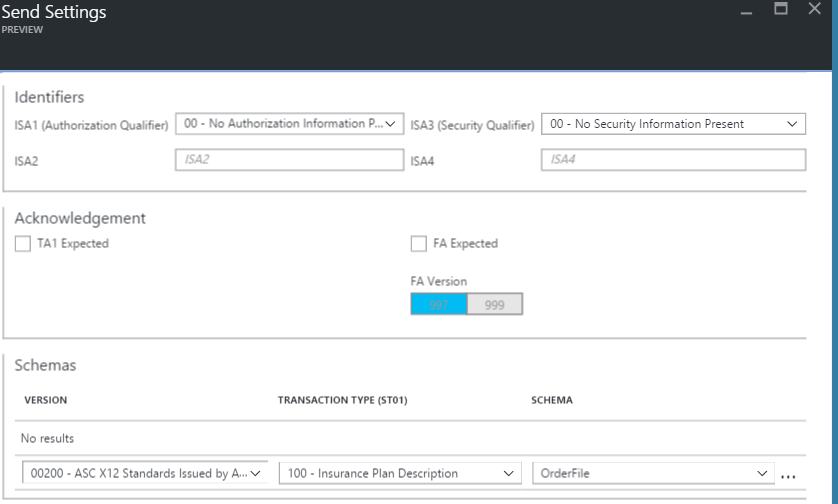
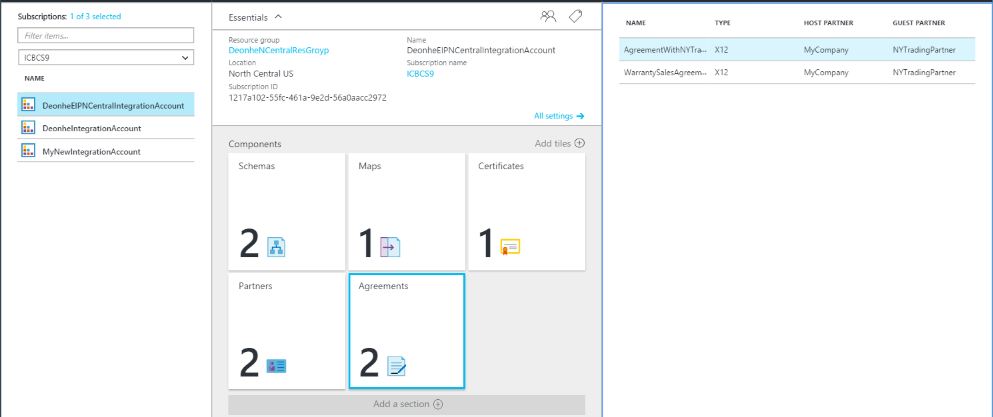

<properties 
    pageTitle="Vue d’ensemble des X12 et le module d’intégration entreprise | Service d’application Microsoft Azure | Microsoft Azure" 
    description="Découvrez comment utiliser X12 accords pour créer des applications de logique" 
    services="logic-apps" 
    documentationCenter=".net,nodejs,java"
    authors="msftman" 
    manager="erikre" 
    editor="cgronlun"/>

<tags 
    ms.service="app-service-logic" 
    ms.workload="integration" 
    ms.tgt_pltfrm="na" 
    ms.devlang="na" 
    ms.topic="article" 
    ms.date="07/08/2016" 
    ms.author="deonhe"/>

# Intégration d’entreprise avec X12 

>[AZURE.NOTE]Cette page couvre la X12 les fonctionnalités des applications logique. Pour plus d’informations sur EDIFACT cliquez [ici](app-service-logic-enterprise-integration-edifact.md).

## Créer une X12 contrat 
Avant de pouvoir échanger X12 des messages, vous devez créer un X12 contrat et le stocker dans votre compte d’intégration. Les étapes suivantes vous guidera le processus de création d’un X12 contrat.

### Voici ce dont vous avez besoin avant de commencer
- Un [compte de l’intégration](./app-service-logic-enterprise-integration-accounts.md) défini dans votre abonnement Azure  
- Au moins deux [partenaires](./app-service-logic-enterprise-integration-partners.md) déjà défini dans votre compte de l’intégration  

>[AZURE.NOTE]Lorsque vous créez un contrat, le contenu dans le fichier du contrat doit correspondre au type de contrat.    

Une fois que vous avez [créé un compte de l’intégration](./app-service-logic-enterprise-integration-accounts.md) et [ajouté des partenaires](./app-service-logic-enterprise-integration-partners.md), vous pouvez créer un X12 contrat en procédant comme suit :  

### Dans la page d’accueil du portail Azure

Après la connexion au [portail Azure](http://portal.azure.com "Azure portail"):  
1. Dans le menu de gauche, sélectionnez **Parcourir** .  

>[AZURE.TIP]Si vous ne voyez pas le lien **Parcourir** , vous devrez peut-être développer tout d’abord le menu. Pour ce faire, cliquez sur le lien **Afficher le menu** situé en haut à gauche du menu réduit.  

    
2. Tapez *intégration* dans la zone de recherche de filtre, puis sélectionnez **L’intégration des comptes** dans la liste des résultats.       
    
3. Dans la carte de **L’intégration des comptes** qui s’ouvre, sélectionnez le compte de l’intégration dans laquelle vous créerez le contrat. Si vous ne voyez pas l’intégration des comptes de listes, [créer un premier](./app-service-logic-enterprise-integration-accounts.md "All about integration accounts").  
  
4.  Sélectionnez la vignette **accords** . Si vous ne voyez pas la vignette accords, tout d’abord l’ajouter.   
     
5. Sélectionnez le bouton **Ajouter** dans la carte accords qui s’ouvre.  
  
6. Entrez un **nom** pour votre contrat, puis cliquez sur le **type d’accord** **Partenaire d’accueil**, **Identité de l’hôte**, **Partenaire invité**, **Identité invité**, dans la carte accords qui s’ouvre.  
  
7. Une fois que vous avez défini la réception propriétés des paramètres, sélectionnez le bouton **OK**  
Nous allons continuer :  
8. Sélectionnez **Paramètres de réception** pour configurer la façon dont les messages reçus via ce contrat doivent être résolu.  
9. Le contrôle de paramètres de réception est divisé en sections suivantes, y compris les identificateurs, accusé de réception, schémas, enveloppes, numéros de contrôle, des Validations et paramètres internes. Configurer ces propriétés en fonction de votre contrat avec le partenaire que vous échangez des messages à l’aide. Voici un aperçu de ces contrôles, configurez les modalités de ce contrat pour identifier et gérer les messages entrants en fonction :  
  

  
10. Sélectionnez le bouton **OK** pour enregistrer vos paramètres.  

### Identificateurs

|Propriété|Description |
|---|---|
|ISA1 (autorisation délimiteurs)|Sélectionnez la valeur de qualificatif d’autorisation dans la liste déroulante.|
|ISA2|Facultatif. Entrez la valeur des informations d’autorisation. Si la valeur entrée pour ISA1 est différent de 00, entrez un minimum d’un caractère alphanumérique et un maximum de 10.|
|ISA3 (sécurité qualificatif)|Sélectionnez la valeur de délimiteurs de sécurité dans la liste déroulante.|
|ISA4|Facultatif. Entrez la valeur d’informations de sécurité. Si la valeur entrée pour ISA3 est différent de 00, entrez un minimum d’un caractère alphanumérique et un maximum de 10.|

### Accusés de réception 

|Propriété|Description |
|----|----|
|TA1 et un prévu|Sélectionnez cette case à cocher pour renvoyer un accusé de réception (TA1 et un) technique à l’expéditeur d’échange. Ces accusés de réception sont envoyés à l’expéditeur échange basé sur les paramètres d’envoi pour le contrat.|
|FA prévu|Sélectionnez cette case à cocher pour renvoyer un accusé de réception (FA) fonctionnel à l’expéditeur d’échange. Sélectionnez ensuite si vous souhaitez que les accusés de réception 997 ou 999, basés sur les versions de schéma que vous travaillez. Ces accusés de réception sont envoyés à l’expéditeur échange basé sur les paramètres d’envoi pour le contrat.|
|Inclure boucle AK2/IK2|Sélectionnez cette case à cocher pour activer la génération de boucles AK2 dans fonctionnels accusés de réception pour les jeux de transaction acceptée. Remarque : Cette case à cocher est activée uniquement si vous avez sélectionné la case à cocher FA prévu.|

### Schémas

Choisissez un schéma pour chaque type de transaction (ST1) et l’Application de l’expéditeur (GS2). Le pipeline de réception que l’ensemble du message entrant par les valeurs correspondantes pour ST1 et GS2 dans le message entrant avec les valeurs que vous définissez ici et le schéma de message entrant avec le schéma que vous définissez ici.

|Propriété|Description |
|----|----|
|Version|Sélectionnez le X12 version|
|Type de transaction (ST01)|Sélectionnez le type de transaction|
|Application d’expéditeur (GS02)|Sélectionnez l’application de l’expéditeur|
|Schéma|Sélectionnez le fichier de schéma que vous souhaitez nous. Fichiers de schéma se trouvent dans votre compte d’intégration.|

### Enveloppes

|Propriété|Description |
|----|----|
|Utilisation de ISA11|Utilisez ce champ pour spécifier le séparateur dans un ensemble de transactions :  Sélectionnez l’identificateur Standard à utiliser la notation décimale de «. » au lieu de la notation décimale du document entrant dans l’EDI pipeline de réception.  Sélectionnez le séparateur de répétition pour spécifier le séparateur répétées occurrences d’un élément de données simple ou d’une structure de données répétées. Par exemple, (^) est généralement utilisée comme séparateur de périodicité. Pour les schémas HIPAA, vous pouvez utiliser uniquement (^).|

### Numéros de contrôle

|Propriété|Description |
|----|----|
|Ne pas autoriser les doublons Interchange un numéro de contrôle|Activez cette option pour bloquer les échanges en double. Si sélectionné, le portail de Services BizTalk vérifie que le numéro de contrôle d’échange (ISA13) pour l’échange reçu ne correspond pas le numéro de contrôle d’échange. Si une correspondance est détectée, le pipeline de réception ne traite pas l’échange. Si vous choisi pour ne pas autoriser les numéros de contrôle d’échange en double, vous pouvez spécifier le nombre de jours à laquelle la case à cocher est exécutée en donnant la valeur appropriée pour vérifier la présence de doublons ISA13 tous les x jours.|
|Ne pas autoriser les doublons numéros de contrôle de groupe|Activez cette option pour bloquer les échanges avec des numéros de contrôle de groupe en double.|
|Ne pas autoriser les doublons numéros Transaction jeu de contrôle|Activez cette option pour bloquer les échanges avec numéros de contrôle de jeu transaction en double.|

### Validations

|Propriété|Description |
|----|----|
|Type de message|Type de Message EDI comme 850 bon de commande ou accusé de réception de mise en œuvre 999.|
|Validation EDI|Exécute la validation EDI sur les types de données, telle que définie par les propriétés EDI du schéma, des restrictions de longueur, des éléments de données vide et des séparateurs à droite.|
|Validation étendue|Si le type de données n’est pas EDI, validation est l’exigence d’élément de données et autorisé périodicité, énumérations et la validation des données élément longueur (min/max).|
|Autoriser les zéros de début ou de fin|L’espace supplémentaire et zéro caractère qui est de début ou de fin est conservés. Ils ne sont pas supprimées.|
|Stratégie séparateur à droite|Génère séparateurs à droite de l’échange reçus. Les options incluent obligatoire, facultatif et non autorisé.|

### Paramètres internes

|Propriété|Description |
|----|----|
|Convertir le format décimal implicite Nn baser 10 valeur numérique.|Convertit un nombre EDI qui est indiqué avec la mise en forme Nn en valeur numérique dans le fichier XML intermédiaire dans le portail de Services BizTalk base 10.|
|Créer des balises XML vides si les séparateurs sont autorisés|Activez cette case à cocher pour que l’expéditeur échange inclut des balises XML vides pour les séparateurs à droite.|
|Processus de traitement par lots entrant|Échange de fractionnement en tant que transaction jeux - suspendre des jeux de transactions erreur : analyse de chaque transaction définie dans un échange dans un document XML distinct en appliquant l’enveloppe appropriée pour l’ensemble de transactions. Avec cette option, si un ou plusieurs transaction affecte dans l’échange échouent à la validation, puis Services BizTalk n'interrompt que les jeux de transaction.   Échange de fractionnement en tant que transaction jeux - suspendre échange erreur : analyse de chaque transaction définie dans un échange dans un document XML distinct en appliquant l’enveloppe appropriée. Avec cette option, si un ou plusieurs transaction affecte dans l’échange échouent à la validation, puis Services BizTalk interrompt l’échange entière.  Conserver échange - suspendre les jeux de transactions erreur : laisse l’échange intacts, création d’un document XML pour l’échange par lots entière. Avec cette option, si onAe ou une transaction plus définit dans l’échange échouent à la validation, puis Services BizTalk interrompt uniquement les jeux de transaction, tout en continuant à traiter tous les autres ensembles de transaction.  Conserver échange - suspendre échange erreur : laisse l’échange intacts, création d’un document XML pour l’échange par lots entière. Avec cette option, si un ou plusieurs transaction affecte dans l’échange échouent à la validation, puis Services BizTalk interrompt l’échange entière.  |

Votre contrat est prêt à gérer les messages entrants sont conformes au schéma que vous avez sélectionné.

Pour configurer les paramètres qui gèrent les messages que vous envoyez pour les partenaires :  
11. Sélectionnez **Paramètres d’envoi** pour configurer la façon dont les messages envoyés par le biais ce contrat doivent être résolu.  

Le contrôle des paramètres d’envoi est divisé en sections suivantes, y compris les identificateurs, accusé de réception, schémas, enveloppes, numéros de contrôle, les jeux de caractères et séparateurs et Validation. 

Voici un aperçu de ces contrôles. Effectuez les sélections en fonction de la manière dont vous souhaitez gérer les messages que vous envoyez aux partenaires via ce contrat :   
  

  

  
12. Sélectionnez le bouton **OK** pour enregistrer vos paramètres.  

### Identificateurs
|Propriété|Description |
|----|----|
|Délimiteurs de l’autorisation (ISA1)|Sélectionnez la valeur de qualificatif d’autorisation dans la liste déroulante.|
|ISA2|Entrez la valeur des informations d’autorisation. Si cette valeur est différent de 00, puis entrez un minimum d’un caractère alphanumérique et un maximum de 10.|
|Délimiteurs de sécurité (ISA3)|Sélectionnez la valeur de délimiteurs de sécurité dans la liste déroulante.|
|ISA4|Entrez la valeur d’informations de sécurité. Si cette valeur est différent de 00, pour la zone de texte valeur (ISA4), puis entrez une valeur alphanumérique au minimum et maximum de 10.|

### Accusé de réception
|Propriété|Description |
|----|----|
|TA1 et un prévu|Sélectionnez cette case à cocher pour renvoyer un accusé de réception (TA1 et un) technique à l’expéditeur d’échange. Ce paramètre spécifie que le partenaire d’accueil qui envoie le message demande un accusé de réception du partenaire invité dans le contrat. Ces accusés de réception sont attendus par le partenaire d’accueil selon les paramètres de recevoir de l’accord.|
|FA prévu|Sélectionnez cette case à cocher pour revenir un accusé de réception (FA) fonctionnel à l’expéditeur d’échange, puis indiquez si vous souhaitez les accusés de réception 997 ou 999, basés sur les versions de schéma que vous travaillez. Ces accusés de réception sont attendus par le partenaire d’accueil selon les paramètres de recevoir de l’accord.|
|Version FA|Sélectionnez la version FA|

### Schémas
|Propriété|Description |
|----|----|
|Version|Sélectionnez le X12 version|
|Type de transaction (ST01)|Sélectionnez le type de transaction|
|SCHÉMA|Sélectionnez le schéma à utiliser. Schémas se trouvent dans votre compte d’intégration. Pour accéder à vos schémas, lier tout d’abord votre compte de l’intégration à votre application logique.|

### Enveloppes
|Propriété|Description |
|----|----|
|Utilisation de ISA11|Utilisez ce champ pour spécifier le séparateur dans un ensemble de transactions :  Sélectionnez l’identificateur Standard à utiliser la notation décimale de «. » au lieu de la notation décimale du document entrant dans l’EDI pipeline de réception.  Sélectionnez le séparateur de répétition pour spécifier le séparateur répétées occurrences d’un élément de données simple ou d’une structure de données répétées. Par exemple, (^) est généralement utilisée comme séparateur de périodicité. Pour les schémas HIPAA, vous pouvez utiliser uniquement (^). |
|Séparateur de répétition|Entrez le séparateur de répétition|
|Numéro de Version du contrôle (ISA12)|Sélectionnez la version de la X12 standard qui est utilisée par le portail de Services BizTalk pour générer un échange sortant.|
|Indicateur d’utilisation (ISA15)|Indiquez si le contexte d’un échange est informations (I), les données de production (P) ou tester des données (T). Recevoir le EDI pipeline promeut cette propriété au contexte.|
|Schéma|Vous pouvez entrer la façon dont le portail de Services BizTalk génère les segments GS et ST pour un échange codée au format X12 qu’il envoie au Pipeline envoyer.  Vous pouvez associer des valeurs des éléments de données GS1, GS2, GS3, GS4, GS5, GS7 et GS8 avec les valeurs du Type de Transaction et des éléments de données Version/version. Lorsque le portail de Services BizTalk détermine qu’un message XML comporte les valeurs définies pour le Type de Transaction et les éléments de Version/version dans une ligne de la grille, puis il remplit les éléments de données GS1, GS2, GS3, GS4, GS5, GS7 et GS8 dans l’enveloppe de l’échange sortant avec les valeurs de la même ligne de la grille. Les valeurs du Type de Transaction et des éléments de Version/Release doivent être uniques.  Facultatif. Pour GS1, sélectionnez une valeur pour le code fonctionnel dans la liste déroulante.  Obligatoire. Pour GS2, entrez une valeur alphanumérique de l’expéditeur application avec deux caractères au minimum et maximum 15 caractères.  Obligatoire. Pour GS3, entrez une valeur alphanumérique pour le destinataire application avec deux caractères au minimum et maximum 15 caractères.  Facultatif. Pour GS4, sélectionnez CCYYMMDD ou aammjj.  Facultatif. Pour GS5, sélectionnez hh, HHMMSS ou HHMMSSdd.  Facultatif. Pour GS7, sélectionnez une valeur pour l’Agence responsable dans la liste déroulante.  Facultatif. Pour GS8, entrez une valeur alphanumérique pour le document identifié avec un minimum d’un caractère et un maximum de 12 caractères.  **Remarque**: ce sont les valeurs que le portail de Services BizTalk entre dans les champs GS de l’échange de génération si le Type de Transaction et Version/Release les éléments dans la même ligne sont une correspondance pour ceux qui sont associés à l’échange.|

### Numéros de contrôle
|Propriété|Description |
|----|----|
|Interchange du numéro de contrôle (ISA13)|Obligatoire. Entrez une plage de valeurs pour le numéro de contrôle d’échange utilisé par le portail de Services BizTalk pour générer un échange sortant. Entrez une valeur numérique avec un minimum de 1 et un maximum de 999999999.|
|Numéro de contrôle de groupe (GS06)|Obligatoire. Entrez la plage de nombres que le portail de Services BizTalk doit utiliser pour le numéro de contrôle de groupe. Entrez une valeur numérique avec au moins un caractère et un maximum de neuf caractères.|
|Numéro de contrôle de jeu transaction (ST02)|Pour le numéro de Transaction définir le contrôle (ST02), entrez une plage de valeurs numériques pour les champs du milieu obligatoires et des valeurs alphanumériques pour le préfixe facultatif et le suffixe. La longueur maximale de tous les quatre champs est neuf caractères.|
|Préfixe|Pour désigner la plage de numéros de contrôle de jeu transaction utilisées dans un accusé de réception, entrez des valeurs dans les champs de nombre (ST02) contrôle accusé de réception. Entrez une valeur numérique pour les deux champs du milieu et une valeur alphanumérique (le cas échéant) pour les champs préfixe et suffixe. Les champs du milieu sont requis et contiennent les valeurs minimales et maximales pour le numéro de contrôle ; le préfixe et suffixe sont facultatifs. La longueur maximale pour tous les trois champs est neuf caractères.|
|Suffixe|Pour désigner la plage de numéros de contrôle de jeu transaction utilisées dans un accusé de réception, entrez des valeurs dans les champs de nombre (ST02) contrôle accusé de réception. Entrez une valeur numérique pour les deux champs du milieu et une valeur alphanumérique (le cas échéant) pour les champs préfixe et suffixe. Les champs du milieu sont requis et contiennent les valeurs minimales et maximales pour le numéro de contrôle ; le préfixe et suffixe sont facultatifs. La longueur maximale pour tous les trois champs est neuf caractères.|

### En-têtes et séparateurs de jeux de caractères
Autres que le jeu de caractères, vous pouvez entrer un autre jeu de séparateurs à utiliser pour chaque type de message. Si un jeu de caractères n’est pas définie pour un schéma de message donné, le jeu de caractères par défaut est utilisé.

|Propriété|Description |
|----|----|
|Jeu de caractères pour être utilisé|Sélectionnez le X12 jeu de caractères pour valider les propriétés que vous entrez pour le contrat.  **Remarque**: le portail de Services BizTalk utilise uniquement ce paramètre pour valider les valeurs entrées pour les propriétés de contrat associé. Le pipeline de réception ou pipeline d’envoi ignore cette propriété de jeu de caractères lors de l’exécution du traitement d’exécution.|
|Schéma|Sélectionnez le signe plus (+) symbole, sélectionnez un schéma dans la liste déroulante. Pour le schéma sélectionné, sélectionnez les séparateurs définis pour être utilisés :  Séparateur d’éléments composant – entrer un caractère unique pour séparer les éléments de données composite.  Séparateur d’élément de données – entrer un caractère unique pour séparer les éléments de données simple au sein des éléments de données composites.    Caractère de remplacement – Activez cette case à cocher si les caractères de la charge utile contient des données qui sont également utilisés comme données, un segment ou séparateurs composant. Vous pouvez ensuite entrer un caractère de remplacement. Lors de la génération sortante X12 du message, toutes les instances de caractères de séparation dans la charge utile de données sont remplacées par le caractère spécifié.  Terminateur de segment : entrez un seul caractère pour indiquer la fin d’un segment EDI.  Suffixe : sélectionnez le caractère qui est utilisé avec l’identificateur de segment. Si vous désignez un suffixe, l’élément de données de début/fin segment peut être vide. Si le terminateur de segment est vide, vous devez désigner un suffixe.|

### Validation
|Propriété|Description |
|----|----|
|Type de message|Cette option permet la validation du récepteur échange. Cette validation effectue une validation EDI sur des éléments de données de l’ensemble de transactions, validation des types de données, les restrictions de longueur et les éléments de données vide et séparateurs de fin.|
|Validation EDI||
|Validation étendue|Cette option permet une validation étendue d’échanges reçus à partir de l’expéditeur échange. Cela inclut la validation de champ longueur, caractère facultatif et nombre de répétitions en plus de validation de type de données XSD. Vous pouvez activer la validation extension sans activer la validation EDI, ou vice versa.|
|Autoriser les zéros de début / fin|Cette option indique qu’un échange EDI reçu de la partie n’échoue pas validation si un élément de données dans un échange EDI n’est pas conforme à sa longueur requise en raison des ou les espaces de fin, mais est conforme à son exigence de longueur lorsqu’ils sont supprimés.|
|Séparateur de fin|Cette option spécifie un échange EDI reçu de la partie n’échoue pas validation si un élément de données dans un échange EDI ne respecte pas ses longueur requise en raison de zéros de début (ou de fin) ou des espaces de fin, mais est conforme à son exigence de longueur lorsqu’ils sont supprimés.  Si vous ne souhaitez pas autoriser les séparateurs et séparateurs dans un échange reçu de l’expéditeur échange, sélectionnez non autorisé. Si l’échange contient les séparateurs et séparateurs, il est déclaré non valides.  Sélectionnez manuel pour accepter les échanges avec ou sans les séparateurs et séparateurs.  Sélectionnez obligatoire si l’échange reçu doit contenir les délimiteurs et séparateurs.|

Une fois que vous sélectionnez **OK** sur les cartes d’ouverts :  
13. Sélectionnez la vignette **accords** sur la carte de compte de l’intégration et vous verrez l’accord nouvellement ajouté répertorié.  
   

## Pour en savoir plus
- [En savoir plus sur le Pack de l’intégration d’entreprise] (./app-service-logic-enterprise-integration-overview.md "En savoir plus sur le Pack de l’intégration d’entreprise")  
