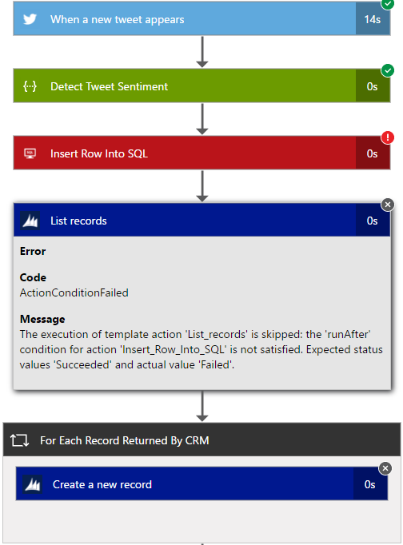
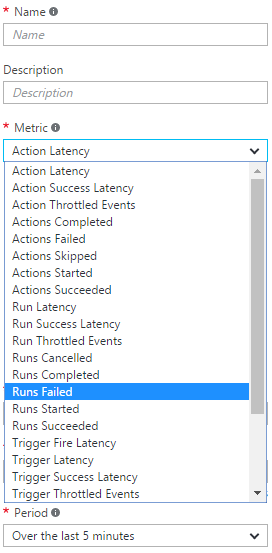

<properties 
    pageTitle="Surveiller les applications logique dans le Service d’application Azure | Microsoft Azure" 
    description="Comment savoir ce que vos applications logique ont fait" 
    authors="jeffhollan" 
    manager="erikre" 
    editor="" 
    services="logic-apps" 
    documentationCenter=""/>

<tags
    ms.service="logic-apps"
    ms.workload="integration"
    ms.tgt_pltfrm="na"
    ms.devlang="na"
    ms.topic="article"
    ms.date="10/18/2016"
    ms.author="jehollan"/>

# <a name="monitor-your-logic-apps"></a>Surveiller des applications de votre logique

Après avoir [créer une application logique](app-service-logic-create-a-logic-app.md), vous pouvez afficher l’historique de son exécution dans le portail Azure.  Vous pouvez également configurer les services, tels que des Diagnostics Azure et les alertes de Azure pour contrôler des événements en temps réel et alerte pour les événements souhaitée « lors de l’échec de plus de 5 s’exécute en une heure ».

## <a name="monitor-in-the-azure-portal"></a>Moniteur dans le portail Azure

Pour afficher l’historique, sélectionnez **Parcourir**, puis sélectionnez **Applications logique**. Une liste de toutes les applications logique dans votre abonnement s’affiche.  Sélectionnez l’application logique que vous voulez analyser.  Vous verrez une liste de toutes les actions et déclencheurs qui se sont produites pour cette application logique.


Il existe plusieurs sections sur cette carte qui sont utiles :

- **Résumé** répertorie **tous les s’exécute** et l' **Historique de déclencheur**
    - Liste **toutes les exécute** la dernière application logique s’exécute.  Vous pouvez cliquer sur une ligne pour plus d’informations sur l’exécution, ou cliquez sur la vignette pour répertorier s’exécute plus.
    - **Historique de déclencheur** répertorie toutes les activités de déclencheur pour cette application logique.  Activité de déclencheur peut être une vérification « Ignoré » pour les nouvelles données (par exemple, recherchez pour voir si un fichier a été ajouté au FTP), « Réussite » ce qui signifie que des données a été retournées pour démarrer une application logique, ou « Échec » qui correspond à une erreur de configuration.
- **Diagnostics** vous permet d’afficher les événements et les détails de l’exécution et vous abonner aux [Alertes Azure](#adding-azure-alerts)

>[AZURE.NOTE] Tous les événements et les détails de runtime sont chiffrées au reste dans le service d’application logique. Ils sont uniquement déchiffrés à une demande d’affichage d’un utilisateur. Accès à ces événements peut également être contrôlée par le contrôle d’accès d’Azure Role-Based (RBAC).

### <a name="view-the-run-details"></a>Afficher les détails de l’exécution

Cette liste de séries d’affiche l' **état**, l' **Heure de début**et la **durée** de la notamment exécuter. Sélectionnez une ligne pour afficher des détails qui s’exécutent.

L’affichage d’analyse vous montre à chaque étape de l’exécution, les entrées et les sorties et les messages d’erreur s’est peut-être occurre.



Si vous avez besoin des détails supplémentaires, tels que l' **ID de corrélation** exécution (qui peut être utilisé pour l’API REST), vous pouvez cliquer sur le bouton **Détails de la série** .  Cela inclut toutes les étapes, statut et entrées/sorties pour l’exécution.

## <a name="azure-diagnostics-and-alerts"></a>Diagnostics de Windows Azure et les alertes

Outre les informations fournies par le portail Azure et API REST ci-dessus, vous pouvez configurer votre application logique pour utiliser Azure Diagnostics pour plus de détails riches et le débogage.

1. Cliquez sur la section **Diagnostics** de la cuillère application logique
1. Cliquez ici pour configurer les **Paramètres de Diagnostic**
1. Configurer un événement concentrateur ou un compte de stockage pour émettre des données à

    

### <a name="adding-azure-alerts"></a>Ajout d’alertes Azure

Une fois que diagnostics sont configurés, vous pouvez ajouter des alertes Azure qui se déclenche lorsque certains seuils sont franchies.  Dans la carte **Diagnostics** , sélectionnez la vignette **d’alertes** et **Ajouter une alerte**.  Cela vous aidera à configurer une alerte basée sur un nombre de seuils et d’indicateurs.



Vous pouvez configurer la **Condition**, **seuil**et **période** comme vous le souhaitez.  Enfin, vous pouvez configurer une adresse de messagerie pour envoyer une notification à, ou configurer un webhook.  Vous pouvez utiliser le [déclencheur de demande](../connectors/connectors-native-reqres.md) dans une application logique à s’exécuter sur une alerte également (pour effectuer les actions à [publier des billets dans la marge](https://github.com/Azure/azure-quickstart-templates/tree/master/201-alert-to-slack-with-logic-app), [Envoyer un texte](https://github.com/Azure/azure-quickstart-templates/tree/master/201-alert-to-text-message-with-logic-app)ou [ajoutez un message pour une file d’attente](https://github.com/Azure/azure-quickstart-templates/tree/master/201-alert-to-queue-with-logic-app)).

### <a name="azure-diagnostics-settings"></a>Paramètres des Diagnostics Azure

Chacun de ces événements contient des informations sur l’application de logique et un événement comme état.  Voici un exemple d’un événement *ActionCompleted* :

```javascript
{
            "time": "2016-07-09T17:09:54.4773148Z",
            "workflowId": "/SUBSCRIPTIONS/80D4FE69-ABCD-EFGH-A938-9250F1C8AB03/RESOURCEGROUPS/MYRESOURCEGROUP/PROVIDERS/MICROSOFT.LOGIC/WORKFLOWS/MYLOGICAPP",
            "resourceId": "/SUBSCRIPTIONS/80D4FE69-ABCD-EFGH-A938-9250F1C8AB03/RESOURCEGROUPS/MYRESOURCEGROUP/PROVIDERS/MICROSOFT.LOGIC/WORKFLOWS/MYLOGICAPP/RUNS/08587361146922712057/ACTIONS/HTTP",
            "category": "WorkflowRuntime",
            "level": "Information",
            "operationName": "Microsoft.Logic/workflows/workflowActionCompleted",
            "properties": {
                "$schema": "2016-06-01",
                "startTime": "2016-07-09T17:09:53.4336305Z",
                "endTime": "2016-07-09T17:09:53.5430281Z",
                "status": "Succeeded",
                "code": "OK",
                "resource": {
                    "subscriptionId": "80d4fe69-ABCD-EFGH-a938-9250f1c8ab03",
                    "resourceGroupName": "MyResourceGroup",
                    "workflowId": "cff00d5458f944d5a766f2f9ad142553",
                    "workflowName": "MyLogicApp",
                    "runId": "08587361146922712057",
                    "location": "eastus",
                    "actionName": "Http"
                },
                "correlation": {
                    "actionTrackingId": "e1931543-906d-4d1d-baed-dee72ddf1047",
                    "clientTrackingId": "my-custom-tracking-id"
                },
                "trackedProperties": {
                    "myProperty": "<value>"
                }
            }
        }
```

Les deux propriétés qui sont particulièrement utiles pour suivi et la surveillance sont *clientTrackingId* et *trackedProperties*.  

#### <a name="client-tracking-id"></a>ID de client de suivi

Le client ID de suivi est une valeur qui sera corrélation événements au sein d’une application logique exécute, y compris des flux de travail imbriquée appelée dans le cadre d’une application logique.  Cet identifiant est généré si n’est pas fourni, mais vous pouvez spécifier manuellement le client ID de suivi à partir d’un déclencheur en passant un `x-ms-client-tracking-id` en-tête avec la valeur ID de la demande de déclencheur (déclencheur demande, déclencheur HTTP ou webhook déclencheur).

#### <a name="tracked-properties"></a>Propriétés de suivi

Les propriétés pouvant être ajoutées sur actions dans la définition de flux de travail pour effectuer le suivi des entrées ou des sorties de données de diagnostic.  Cela peut être utile si vous souhaitez effectuer le suivi des données comme un « N° commande » dans votre télémétrie.  Pour ajouter une propriété de suivi, incluez la `trackedProperties` propriété sur une action.  Les propriétés peuvent uniquement le suivi d’un entrées des actions simples et sorties, mais vous pouvez utiliser la `correlation` propriétés des événements à corrélation sur actions lors de l’exécution.

```javascript
{
    "myAction": {
        "type": "http",
        "inputs": {
            "uri": "http://uri",
            "headers": {
                "Content-Type": "application/json"
            },
            "body": "@triggerBody()"
        },
        "trackedProperties":{
            "myActionHTTPStatusCode": "@action()['outputs']['statusCode']",
            "myActionHTTPValue": "@action()['outputs']['body']['foo']",
            "transactionId": "@action()['inputs']['body']['bar']"
        }
    }
}
```

### <a name="extending-your-solutions"></a>Extension de vos solutions

Vous pouvez tirer parti de cette télémétrie à partir du Hub événement ou stockage à d’autres services, tels que [Opérations Management Suite](https://www.microsoft.com/cloud-platform/operations-management-suite) [Azure flux Analytique](https://azure.microsoft.com/services/stream-analytics/)et [Power BI](https://powerbi.com) pour que la surveillance en temps réel de votre flux de travail d’intégration.

## <a name="next-steps"></a>Étapes suivantes
- [Exemples et des scénarios d’applications logique courants](app-service-logic-examples-and-scenarios.md)
- [Création d’un modèle de déploiement de l’application logique](app-service-logic-create-deploy-template.md)
- [Fonctionnalités d’intégration entreprise](app-service-logic-enterprise-integration-overview.md)
