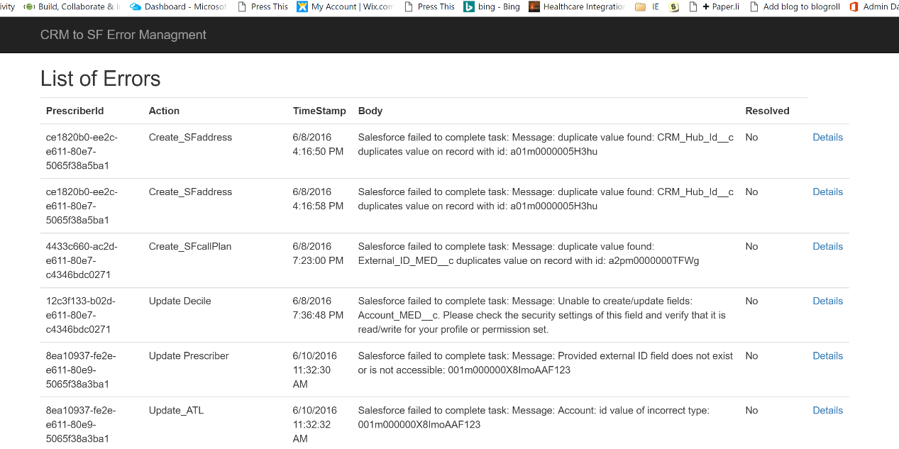
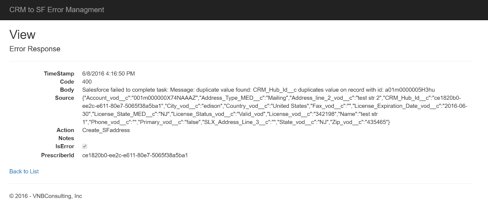

<properties
    pageTitle="Journalisation et gestion des erreurs dans les applications logique | Microsoft Azure"
    description="Afficher un cas d’utilisation réels d’avancées traitement des erreurs et journalisation avec les applications de logique"
    keywords=""
    services="logic-apps"
    authors="hedidin"
    manager="anneta"
    editor=""
    documentationCenter=""/>

<tags
    ms.service="logic-apps"
    ms.workload="na"
    ms.tgt_pltfrm="na"
    ms.devlang="na"
    ms.topic="article"
    ms.date="07/29/2016"
    ms.author="b-hoedid"/>

# <a name="logging-and-error-handling-in-logic-apps"></a>Journalisation et gestion des erreurs dans les applications de logique

Cet article décrit comment vous pouvez étendre une application logique pour mieux prendre en charge la gestion des exceptions. Il s’agit d’un cas d’utilisation réels et notre réponse à la question de « Applications logique prend-il exception et gestion des erreurs ? »

>[AZURE.NOTE]La version actuelle de la fonctionnalité logique applications du Service d’application Microsoft Azure fournit un modèle standard pour les réponses d’action.
>Cela inclut les validation interne et les réponses d’erreur renvoyés à partir d’une application API.

## <a name="overview-of-the-use-case-and-scenario"></a>Vue d’ensemble des cas d’utilisation et scénario

L’article suivant est le cas d’utilisation de cet article.
Un établissement de santé connu engagé nous pour développer une solution Azure qui vont créer un portail patients à l’aide de Microsoft Dynamics CRM Online. Ils nécessaire pour envoyer des enregistrements de rendez-vous entre le portail patients Dynamics CRM Online et Salesforce.  Nous avons invités à utiliser la norme [HL7 FHIR](http://www.hl7.org/implement/standards/fhir/) pour tous les enregistrements patients.

Le projet avait deux conditions principales :  

 -  Une méthode pour enregistrer les enregistrements envoyés à partir du portail Dynamics CRM Online
 -  Permet d’afficher les erreurs qui s’est produite dans le flux de travail


## <a name="how-we-solved-the-problem"></a>Comment nous avons résolu le problème

>[AZURE.TIP] Vous pouvez afficher une vidéo de haut niveau du projet au niveau du [Groupe d’utilisateurs intégration](http://www.integrationusergroup.com/do-logic-apps-support-error-handling/ "Intégration utilisateur du groupe").

Nous avons choisi [DocumentDB Azure](https://azure.microsoft.com/services/documentdb/ "Azure DocumentDB") comme un référentiel pour les enregistrements de journal et d’erreur (DocumentDB fait référence à des enregistrements en tant que documents). Étant donné qu’applications logique contient un modèle standard pour toutes les réponses, nous n’aurait pas à créer un schéma personnalisé. Nous pouvons créer une application API pour **Insérer** et **requête** pour les enregistrements d’erreur et connectez-vous. Nous pouvons également définir un schéma pour chacune d’elles dans l’application de l’API.  

Une autre exigence a été suppression définitive des enregistrements après une date donnée. DocumentDB a une propriété appelée [durée de vie]de(https://azure.microsoft.com/blog/documentdb-now-supports-time-to-live-ttl/ "durée de vie") (TTL), qui nous ont permis de définir une valeur de **durée de vie** pour chaque enregistrement ou de la collection de sites. Cela vous évite supprimer manuellement les enregistrements de DocumentDB.

### <a name="creation-of-the-logic-app"></a>Création de l’application logique

La première étape consiste à créer l’application logique et charger dans le concepteur. Dans cet exemple, nous utilisons parent-enfant logique applications. Supposons que nous avez déjà créé le parent et que vous allez créer une application de logique enfant.

Étant donné que nous allons se connecter à l’enregistrement bientôt déconnecter Dynamics CRM Online, commençons en haut. Nous avons besoin d’utiliser un déclencheur demande, car l’application logique parent déclenche cet enfant.

> [AZURE.IMPORTANT] Pour effectuer ce didacticiel, vous devrez créer une base de données DocumentDB et deux collections (journalisation et erreurs).

### <a name="logic-app-trigger"></a>Déclencheur d’application logique

Nous utilisons un déclencheur demande comme le montre l’exemple suivant.

```` json
"triggers": {
        "request": {
          "type": "request",
          "kind": "http",
          "inputs": {
            "schema": {
              "properties": {
                "CRMid": {
                  "type": "string"
                },
                "recordType": {
                  "type": "string"
                },
                "salesforceID": {
                  "type": "string"
                },
                "update": {
                  "type": "boolean"
                }
              },
              "required": [
                "CRMid",
                "recordType",
                "salesforceID",
                "update"
              ],
              "type": "object"
            }
          }
        }
      },

````


### <a name="steps"></a>Étapes

Nous avons besoin pour vous connecter la source (requête) de l’enregistrement patients à partir du portail Dynamics CRM Online.

1. Nous avons besoin obtenir un nouvel enregistrement de rendez-vous à partir de Dynamics CRM Online.
    Le déclencheur en provenance de CRM nous fournit la **PatentId CRM**, **type d’enregistrement**, **Nouveau ou mis à jour les enregistrement** (nouveau ou mettre à jour de type booléen) et **SalesforceId**. La **SalesforceId** peut être null, car il est utilisé uniquement pour une mise à jour.
    Nous allons l’enregistrement CRM à l’aide de la CRM **PatientID** et le **Type d’enregistrement**.
1. Ensuite, nous devons ajouter notre application API DocumentDB **InsertLogEntry** opération comme indiqué dans les figures suivantes.


#### <a name="insert-log-entry-designer-view"></a>Insérer le mode concepteur d’entrée de journal


#### <a name="insert-error-entry-designer-view"></a>Insérer le mode concepteur d’erreur entrée


#### <a name="check-for-create-record-failure"></a>Rechercher les enregistrement Échec de la création


## <a name="logic-app-source-code"></a>Code source logique de l’application

>[AZURE.NOTE]  Voici des exemples uniquement. Étant donné que ce didacticiel est basé sur une implémentation actuellement en production, la valeur d’un **Nœud Source** n’affichera ne peut-être pas propriétés qui sont liées à la planification d’un rendez-vous.

### <a name="logging"></a>Journalisation
L’exemple de code de l’application logique suivant montre comment gérer la journalisation.

#### <a name="log-entry"></a>Entrée de journal
Il s’agit du code de source d’application logique pour insérer une entrée de journal.

``` json
"InsertLogEntry": {
        "metadata": {
        "apiDefinitionUrl": "https://.../swagger/docs/v1",
        "swaggerSource": "website"
        },
        "type": "Http",
        "inputs": {
        "body": {
            "date": "@{outputs('Gets_NewPatientRecord')['headers']['Date']}",
            "operation": "New Patient",
            "patientId": "@{triggerBody()['CRMid']}",
            "providerId": "@{triggerBody()['providerID']}",
            "source": "@{outputs('Gets_NewPatientRecord')['headers']}"
        },
        "method": "post",
        "uri": "https://.../api/Log"
        },
        "runAfter":    {
            "Gets_NewPatientecord": ["Succeeded"]
        }
}
```

#### <a name="log-request"></a>Demande de journal

Il s’agit du message de demande de journal validé dans l’application de l’API.

``` json
    {
    "uri": "https://.../api/Log",
    "method": "post",
    "body": {
        "date": "Fri, 10 Jun 2016 22:31:56 GMT",
        "operation": "New Patient",
        "patientId": "6b115f6d-a7ee-e511-80f5-3863bb2eb2d0",
        "providerId": "",
        "source": "{\"Pragma\":\"no-cache\",\"x-ms-request-id\":\"e750c9a9-bd48-44c4-bbba-1688b6f8a132\",\"OData-Version\":\"4.0\",\"Cache-Control\":\"no-cache\",\"Date\":\"Fri, 10 Jun 2016 22:31:56 GMT\",\"Set-Cookie\":\"ARRAffinity=785f4334b5e64d2db0b84edcc1b84f1bf37319679aefce206b51510e56fd9770;Path=/;Domain=127.0.0.1\",\"Server\":\"Microsoft-IIS/8.0,Microsoft-HTTPAPI/2.0\",\"X-AspNet-Version\":\"4.0.30319\",\"X-Powered-By\":\"ASP.NET\",\"Content-Length\":\"1935\",\"Content-Type\":\"application/json; odata.metadata=minimal; odata.streaming=true\",\"Expires\":\"-1\"}"
        }
    }

```


#### <a name="log-response"></a>Enregistrer la réponse

Il s’agit le message de réponse journal de l’application API.

``` json
{
    "statusCode": 200,
    "headers": {
        "Pragma": "no-cache",
        "Cache-Control": "no-cache",
        "Date": "Fri, 10 Jun 2016 22:32:17 GMT",
        "Server": "Microsoft-IIS/8.0",
        "X-AspNet-Version": "4.0.30319",
        "X-Powered-By": "ASP.NET",
        "Content-Length": "964",
        "Content-Type": "application/json; charset=utf-8",
        "Expires": "-1"
    },
    "body": {
        "ttl": 2592000,
        "id": "6b115f6d-a7ee-e511-80f5-3863bb2eb2d0_1465597937",
        "_rid": "XngRAOT6IQEHAAAAAAAAAA==",
        "_self": "dbs/XngRAA==/colls/XngRAOT6IQE=/docs/XngRAOT6IQEHAAAAAAAAAA==/",
        "_ts": 1465597936,
        "_etag": "\"0400fc2f-0000-0000-0000-575b3ff00000\"",
        "patientID": "6b115f6d-a7ee-e511-80f5-3863bb2eb2d0",
        "timestamp": "2016-06-10T22:31:56Z",
        "source": "{\"Pragma\":\"no-cache\",\"x-ms-request-id\":\"e750c9a9-bd48-44c4-bbba-1688b6f8a132\",\"OData-Version\":\"4.0\",\"Cache-Control\":\"no-cache\",\"Date\":\"Fri, 10 Jun 2016 22:31:56 GMT\",\"Set-Cookie\":\"ARRAffinity=785f4334b5e64d2db0b84edcc1b84f1bf37319679aefce206b51510e56fd9770;Path=/;Domain=127.0.0.1\",\"Server\":\"Microsoft-IIS/8.0,Microsoft-HTTPAPI/2.0\",\"X-AspNet-Version\":\"4.0.30319\",\"X-Powered-By\":\"ASP.NET\",\"Content-Length\":\"1935\",\"Content-Type\":\"application/json; odata.metadata=minimal; odata.streaming=true\",\"Expires\":\"-1\"}",
        "operation": "New Patient",
        "salesforceId": "",
        "expired": false
    }
}

```

Maintenant examinons la procédure de gestion d’erreur.


### <a name="error-handling"></a>Gestion des erreurs

L’exemple de code logique applications suivant montre comment vous pouvez implémenter de gestion des erreurs.

#### <a name="create-error-record"></a>Créer l’enregistrement d’erreur

Il s’agit de code source logique applications permettant de créer un enregistrement d’erreur.

``` json
"actions": {
    "CreateErrorRecord": {
        "metadata": {
        "apiDefinitionUrl": "https://.../swagger/docs/v1",
        "swaggerSource": "website"
        },
        "type": "Http",
        "inputs": {
        "body": {
            "action": "New_Patient",
            "isError": true,
            "crmId": "@{triggerBody()['CRMid']}",
            "patientID": "@{triggerBody()['CRMid']}",
            "message": "@{body('Create_NewPatientRecord')['message']}",
            "providerId": "@{triggerBody()['providerId']}",
            "severity": 4,
            "source": "@{actions('Create_NewPatientRecord')['inputs']['body']}",
            "statusCode": "@{int(outputs('Create_NewPatientRecord')['statusCode'])}",
            "salesforceId": "",
            "update": false
        },
        "method": "post",
        "uri": "https://.../api/CrMtoSfError"
        },
        "runAfter":
        {
            "Create_NewPatientRecord": ["Failed" ]
        }
    }
}          
```

#### <a name="insert-error-into-documentdb--request"></a>Erreur insérer dans DocumentDB--demander

``` json

{
    "uri": "https://.../api/CrMtoSfError",
    "method": "post",
    "body": {
        "action": "New_Patient",
        "isError": true,
        "crmId": "6b115f6d-a7ee-e511-80f5-3863bb2eb2d0",
        "patientId": "6b115f6d-a7ee-e511-80f5-3863bb2eb2d0",
        "message": "Salesforce failed to complete task: Message: duplicate value found: Account_ID_MED__c duplicates value on record with id: 001U000001c83gK",
        "providerId": "",
        "severity": 4,
        "salesforceId": "",
        "update": false,
        "source": "{\"Account_Class_vod__c\":\"PRAC\",\"Account_Status_MED__c\":\"I\",\"CRM_HUB_ID__c\":\"6b115f6d-a7ee-e511-80f5-3863bb2eb2d0\",\"Credentials_vod__c\",\"DTC_ID_MED__c\":\"\",\"Fax\":\"\",\"FirstName\":\"A\",\"Gender_vod__c\":\"\",\"IMS_ID__c\":\"\",\"LastName\":\"BAILEY\",\"MasterID_mp__c\":\"\",\"C_ID_MED__c\":\"851588\",\"Middle_vod__c\":\"\",\"NPI_vod__c\":\"\",\"PDRP_MED__c\":false,\"PersonDoNotCall\":false,\"PersonEmail\":\"\",\"PersonHasOptedOutOfEmail\":false,\"PersonHasOptedOutOfFax\":false,\"PersonMobilePhone\":\"\",\"Phone\":\"\",\"Practicing_Specialty__c\":\"FM - FAMILY MEDICINE\",\"Primary_City__c\":\"\",\"Primary_State__c\":\"\",\"Primary_Street_Line2__c\":\"\",\"Primary_Street__c\":\"\",\"Primary_Zip__c\":\"\",\"RecordTypeId\":\"012U0000000JaPWIA0\",\"Request_Date__c\":\"2016-06-10T22:31:55.9647467Z\",\"ONY_ID__c\":\"\",\"Specialty_1_vod__c\":\"\",\"Suffix_vod__c\":\"\",\"Website\":\"\"}",
        "statusCode": "400"
    }
}
```

#### <a name="insert-error-into-documentdb--response"></a>Insérez erreur DocumentDB--réponse


``` json
{
    "statusCode": 200,
    "headers": {
        "Pragma": "no-cache",
        "Cache-Control": "no-cache",
        "Date": "Fri, 10 Jun 2016 22:31:57 GMT",
        "Server": "Microsoft-IIS/8.0",
        "X-AspNet-Version": "4.0.30319",
        "X-Powered-By": "ASP.NET",
        "Content-Length": "1561",
        "Content-Type": "application/json; charset=utf-8",
        "Expires": "-1"
    },
    "body": {
        "id": "6b115f6d-a7ee-e511-80f5-3863bb2eb2d0-1465597917",
        "_rid": "sQx2APhVzAA8AAAAAAAAAA==",
        "_self": "dbs/sQx2AA==/colls/sQx2APhVzAA=/docs/sQx2APhVzAA8AAAAAAAAAA==/",
        "_ts": 1465597912,
        "_etag": "\"0c00eaac-0000-0000-0000-575b3fdc0000\"",
        "prescriberId": "6b115f6d-a7ee-e511-80f5-3863bb2eb2d0",
        "timestamp": "2016-06-10T22:31:57.3651027Z",
        "action": "New_Patient",
        "salesforceId": "",
        "update": false,
        "body": "CRM failed to complete task: Message: duplicate value found: CRM_HUB_ID__c duplicates value on record with id: 001U000001c83gK",
        "source": "{\"Account_Class_vod__c\":\"PRAC\",\"Account_Status_MED__c\":\"I\",\"CRM_HUB_ID__c\":\"6b115f6d-a7ee-e511-80f5-3863bb2eb2d0\",\"Credentials_vod__c\":\"DO - Degree level is DO\",\"DTC_ID_MED__c\":\"\",\"Fax\":\"\",\"FirstName\":\"A\",\"Gender_vod__c\":\"\",\"IMS_ID__c\":\"\",\"LastName\":\"BAILEY\",\"MterID_mp__c\":\"\",\"Medicis_ID_MED__c\":\"851588\",\"Middle_vod__c\":\"\",\"NPI_vod__c\":\"\",\"PDRP_MED__c\":false,\"PersonDoNotCall\":false,\"PersonEmail\":\"\",\"PersonHasOptedOutOfEmail\":false,\"PersonHasOptedOutOfFax\":false,\"PersonMobilePhone\":\"\",\"Phone\":\"\",\"Practicing_Specialty__c\":\"FM - FAMILY MEDICINE\",\"Primary_City__c\":\"\",\"Primary_State__c\":\"\",\"Primary_Street_Line2__c\":\"\",\"Primary_Street__c\":\"\",\"Primary_Zip__c\":\"\",\"RecordTypeId\":\"012U0000000JaPWIA0\",\"Request_Date__c\":\"2016-06-10T22:31:55.9647467Z\",\"XXXXXXX\":\"\",\"Specialty_1_vod__c\":\"\",\"Suffix_vod__c\":\"\",\"Website\":\"\"}",
        "code": 400,
        "errors": null,
        "isError": true,
        "severity": 4,
        "notes": null,
        "resolved": 0
        }
}
```

#### <a name="salesforce-error-response"></a>Réponse d’erreur Salesforce

``` json
{
    "statusCode": 400,
    "headers": {
        "Pragma": "no-cache",
        "x-ms-request-id": "3e8e4884-288e-4633-972c-8271b2cc912c",
        "X-Content-Type-Options": "nosniff",
        "Cache-Control": "no-cache",
        "Date": "Fri, 10 Jun 2016 22:31:56 GMT",
        "Set-Cookie": "ARRAffinity=785f4334b5e64d2db0b84edcc1b84f1bf37319679aefce206b51510e56fd9770;Path=/;Domain=127.0.0.1",
        "Server": "Microsoft-IIS/8.0,Microsoft-HTTPAPI/2.0",
        "X-AspNet-Version": "4.0.30319",
        "X-Powered-By": "ASP.NET",
        "Content-Length": "205",
        "Content-Type": "application/json; charset=utf-8",
        "Expires": "-1"
    },
    "body": {
        "status": 400,
        "message": "Salesforce failed to complete task: Message: duplicate value found: Account_ID_MED__c duplicates value on record with id: 001U000001c83gK",
        "source": "Salesforce.Common",
        "errors": []
    }
}

```

### <a name="returning-the-response-back-to-the-parent-logic-app"></a>Renvoi de la réponse à l’application de logique parent

Une fois que vous avez la réponse, vous pouvez lui transmettre revenir à l’application de logique parent.

#### <a name="return-success-response-to-the-parent-logic-app"></a>Renvoyer la réponse de succès à l’application de logique parent

``` json
"SuccessResponse": {
    "runAfter":
        {
            "UpdateNew_CRMPatientResponse": ["Succeeded"]
        },
    "inputs": {
        "body": {
            "status": "Success"
    },
    "headers": {
    "   Content-type": "application/json",
        "x-ms-date": "@utcnow()"
    },
    "statusCode": 200
    },
    "type": "Response"
}
```

#### <a name="return-error-response-to-the-parent-logic-app"></a>Retourner la réponse d’erreur à l’application de logique parent

``` json
"ErrorResponse": {
    "runAfter":
        {
            "Create_NewPatientRecord": ["Failed"]
        },
    "inputs": {
        "body": {
            "status": "BadRequest"
        },
        "headers": {
            "Content-type": "application/json",
            "x-ms-date": "@utcnow()"
        },
        "statusCode": 400
    },
    "type": "Response"
}

```


## <a name="documentdb-repository-and-portal"></a>Portail et DocumentDB référentiel

Notre solution d’ajouter des fonctionnalités supplémentaires avec [DocumentDB](https://azure.microsoft.com/services/documentdb).

### <a name="error-management-portal"></a>Portail de gestion d’erreur

Pour afficher les erreurs, vous pouvez créer une application web MVC pour afficher les enregistrements d’erreur de DocumentDB. Opérations de **liste**, **Détails**, **Modifier**et **Supprimer** sont incluses dans la version actuelle.

> [AZURE.NOTE]Modifier l’opération : DocumentDB a un remplacement de l’ensemble du document.
> Les enregistrements affichés dans la **liste** et vues de **Détail** sont uniquement les exemples. Ils ne sont pas des enregistrements de rendez-vous patients réel.

Voici des exemples de notre détails de l’application MVC créés avec l’approche décrite précédemment.

#### <a name="error-management-list"></a>Liste de gestion d’erreur



#### <a name="error-management-detail-view"></a>Affichage détaillé de gestion d’erreur



### <a name="log-management-portal"></a>Portail de gestion de journal

Pour afficher les journaux, nous avons créé également une application web MVC.  Voici des exemples de notre détails de l’application MVC créés avec l’approche décrite précédemment.

#### <a name="sample-log-detail-view"></a>Exemple de vue de détail journal


### <a name="api-app-details"></a>Détails de l’application API

#### <a name="logic-apps-exception-management-api"></a>Gestion des exceptions logique applications API

Notre application open source logique applications exception Gestion des API fournit les fonctionnalités suivantes.

Il existe deux contrôleurs :

- **ErrorController** insère un enregistrement d’erreur (document) dans une collection de sites DocumentDB.
- **LogController** Insère un enregistrement du journal (document) dans une collection de sites DocumentDB.

> [AZURE.TIP] Utilisent les deux contrôleurs `async Task<dynamic>` opérations. Cela permet les opérations être résolus en cours d’exécution, afin que nous pouvons créer le schéma DocumentDB dans le corps de l’opération.

Chaque document dans DocumentDB doit avoir un ID unique. Nous utilisons `PatientId` et en ajoutant un horodatage est converti en une valeur d’horodatage Unix (double). Nous tronqué pour supprimer la valeur décimale.

Vous pouvez afficher le code source de notre contrôleur d’erreur API [de GitHub](https://github.com/HEDIDIN/LogicAppsExceptionManagementApi/blob/master/Logic App Exception Management API/Controllers/ErrorController.cs).

Nous appelons l’API à partir d’une application logique à l’aide de la syntaxe suivante.

``` json
 "actions": {
        "CreateErrorRecord": {
          "metadata": {
            "apiDefinitionUrl": "https://.../swagger/docs/v1",
            "swaggerSource": "website"
          },
          "type": "Http",
          "inputs": {
            "body": {
              "action": "New_Patient",
              "isError": true,
              "crmId": "@{triggerBody()['CRMid']}",
              "prescriberId": "@{triggerBody()['CRMid']}",
              "message": "@{body('Create_NewPatientRecord')['message']}",
              "salesforceId": "@{triggerBody()['salesforceID']}",
              "severity": 4,
              "source": "@{actions('Create_NewPatientRecord')['inputs']['body']}",
              "statusCode": "@{int(outputs('Create_NewPatientRecord')['statusCode'])}",
              "update": false
            },
            "method": "post",
            "uri": "https://.../api/CrMtoSfError"
          },
          "runAfter": {
              "Create_NewPatientRecord": ["Failed"]
            }
        }
 }
```

L’expression dans l’exemple précédent est vérification de l’état *Create_NewPatientRecord* **Échec**.

## <a name="summary"></a>Résumé

- Vous pouvez facilement implémenter la journalisation et gestion des erreurs dans une application logique.
- Vous pouvez utiliser DocumentDB comme référentiel des enregistrements de journal et d’erreur (documents).
- Vous pouvez utiliser MVC pour créer un portail pour afficher les enregistrements de journal et d’erreur.

### <a name="source-code"></a>Code source
Le code source pour la gestion des exceptions logique applications application API est disponible dans cette [GitHub référentiel](https://github.com/HEDIDIN/LogicAppsExceptionManagementApi "API de gestion des exceptions logique d’application").


## <a name="next-steps"></a>Étapes suivantes
- [Afficher plus d’exemples d’applications logique et scénarios](app-service-logic-examples-and-scenarios.md)
- [En savoir plus sur les applications logique outils d’analyse](app-service-logic-monitor-your-logic-apps.md)
- [Créer un modèle de déploiement automatisé application logique](app-service-logic-create-deploy-template.md)
