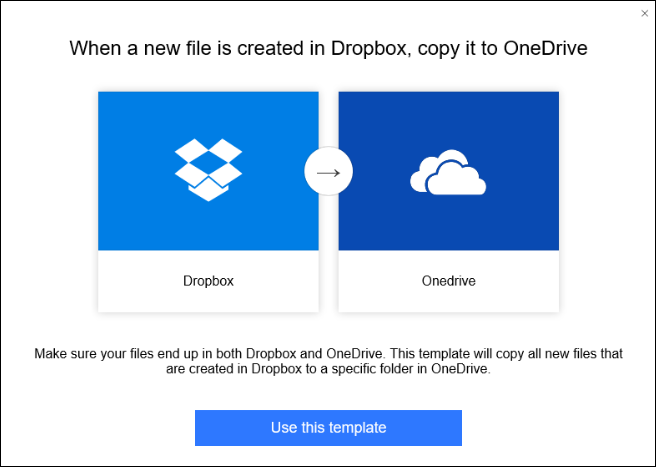
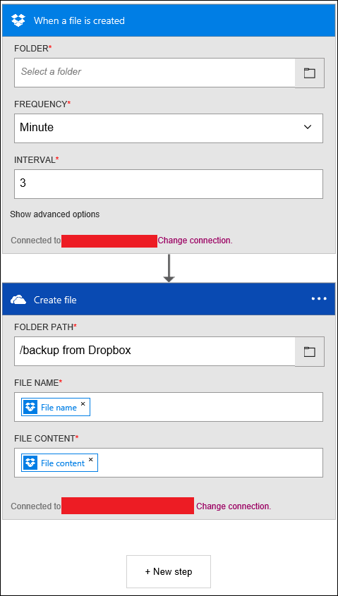

<properties
 pageTitle="Modèles d’application logique | Microsoft Azure"
 description="Découvrez comment utiliser des modèles d’application logique prédéfinis pour vous aider à commencer"
 authors="kevinlam1"
 manager="dwrede"
 editor=""
 services="app-service\logic"
 documentationCenter=""/>

<tags
    ms.service="app-service-logic"
    ms.workload="integration"
    ms.tgt_pltfrm="na"
    ms.devlang="na"
    ms.topic="article"
    ms.date="08/24/2016"
    ms.author="klam"/>

# Modèles d’application logique

## Que sont les modèles d’application logique

Un modèle d’application logique est une application logique prédéfinies que vous pouvez utiliser pour commencer rapidement à créer votre propre flux de travail. 

Ces modèles sont un bon moyen de découvrir les différents modèles qui peuvent être créés à l’aide d’applications logique. Vous pouvez utiliser ces modèles comme-est ou modifiez les adapter à votre scénario.

## Vue d’ensemble des modèles disponibles

Il existe de nombreux modèles disponibles actuellement publiés dans la plateforme d’application logique. Certaines catégories d’exemples, ainsi que le type de connecteurs utilisés dans les, est présentée ci-après.

### Modèles d’entreprise cloud
Modèles intégrés Dynamics CRM, force de vente, zone, Blob Azure et autres connecteurs à vos besoins de cloud enterprise. Voici quelques exemples de que pouvez-vous faire avec ces modèles comprennent organiser vos prospects et sauvegarder vos données de fichiers de l’entreprise.

### Modèles de module d’intégration entreprise
Configurations de VETER (valider, extraire, transformer, enrichir, Router) pipelines, reçoit une X12 EDI document sur AS2 et transformer au format XML, tout aussi bien en tant que message X12 et AS2 gestion.

### Modèles de motif de protocole
Ces modèles se composent des applications de logique qui contiennent des modèles de protocole tel que réponse à la demande sur HTTP, ainsi que les intégrations d’entreprise sur FTP et SFTP. Utilisez ces telles qu’elles existent, ou comme base pour la création de modèles de protocole plus complexes.  

### Modèles de productivité personnelle
Modèles afin d’améliorer la productivité personnelle incluent des modèles de définir des rappels quotidiennes, activez les éléments de travail importantes dans des listes des tâches et automatiser les tâches longues vers le bas jusqu'à une étape d’approbation utilisateur unique.

### Modèles de cloud consommateur
Modèles simples qui s’intègrent aux services de médias sociaux tels que Twitter, la marge et la messagerie, en définitive capable de renforcer médias sociaux initiatives marketing. Cela inclut également des modèles par exemple, copiez trouble, qui peuvent permettent d’améliorer votre productivité en enregistrant le temps passé sur des tâches répétitives traditionnellement. 

## Comment créer une application logique à l’aide d’un modèle 

Pour commencer à utiliser un modèle d’application logique, allez dans le Concepteur d’application logique. Si vous entrez le concepteur en ouvrant une application logique existant, l’application logique charge automatiquement dans votre affichage concepteur. Toutefois, si vous créez une nouvelle application logique, vous voyez l’écran ci-dessous.  
   

À partir de cet écran, vous pouvez choisir de commencer avec une application logique vierge ou un modèle prédéfini. Si vous sélectionnez un des modèles, vous trouverez des informations supplémentaires. Dans cet exemple, nous utilisons le modèle *lorsqu’un fichier est créé dans Dropbox, copiez-le dans OneDrive* .  
   

Si vous choisissez d’utiliser le modèle, sélectionnez le bouton *utiliser ce modèle* . Vous êtes invité à se connecter à vos comptes basés sur les connecteurs utilise le modèle. Ou, si vous avez précédemment établi une connexion avec ces liens, vous pouvez continuer comme indiqué ci-dessous.  
   

Après la connexion et en sélectionnant *Continuer*, l’application logique s’ouvre en mode concepteur.  
   

Dans l’exemple ci-dessus, comme c’est le cas avec de nombreux modèles parmi les champs de propriété obligatoire peut être remplis dans les connecteurs ; Toutefois, certains peuvent nécessiter toujours une valeur avant de pouvoir déployer correctement l’application logique. Si vous essayez de déployer sans entrer certains champs manquants, vous serez averti avec un message d’erreur.

Si vous souhaitez revenir à la visionneuse de modèle, sélectionnez le bouton *modèles* dans la barre de navigation supérieure. En optant revenir à la visionneuse de modèle, vous perdez tout cours non enregistrées. Avant de changer les réinsérer dans la visionneuse de modèle, vous verrez un message d’avertissement vous informant de ce.  
   

## Comment déployer une application logique créée à partir d’un modèle

Après avoir chargé votre modèle et apporté des modifications de votre choix, sélectionnez Enregistrer bouton dans le coin supérieur gauche. Ceci enregistre et publie votre application logique.  
   

Si vous souhaitez plus d’informations sur comment ajouter des étapes supplémentaires dans un modèle d’application logique existant, ou pour effectuer modifie en règle générale, en savoir plus en [créer une application logique](app-service-logic-create-a-logic-app.md).