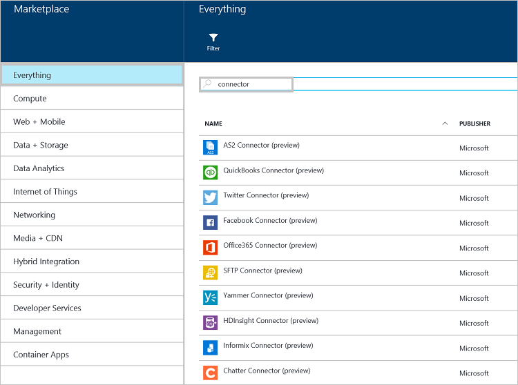

<properties 
    pageTitle="Quels sont les connecteurs et les applications de l’API BizTalk" 
    description="En savoir plus sur les applications de l’API, des connecteurs et applications BizTalk API" 
    services="logic-apps" 
    documentationCenter="" 
    authors="MandiOhlinger" 
    manager="erikre" 
    editor=""/>

<tags 
    ms.service="logic-apps" 
    ms.workload="integration" 
    ms.tgt_pltfrm="na" 
    ms.devlang="na" 
    ms.topic="get-started-article" 
    ms.date="09/01/2016" 
    ms.author="mandia"/>

# Quels sont les connecteurs et les applications de l’API BizTalk

[AZURE.INCLUDE [app-service-logic-version-message](../../includes/app-service-logic-version-message.md)]

Un *connecteur* est un type d’application API qui met l’accent sur la connectivité. Connecteurs, comme une autre application API, servent à partir des applications Web, les applications mobiles et les applications logique. Connecteurs rendent plus facile à vous connecter aux services existants et vous aider à gérer l’authentification, fournissent une analyse, analytique et plus encore.

N’importe quel développeur peut créer leurs propres applications API et les déployer en privé. À l’avenir, les développeurs peuvent partager et facturer leurs applications API personnalisées à la place de marché. 

Pour accélérer les développeurs de créer des solutions, l’équipe Azure ajouté un certain nombre de connecteurs à la place de marché pour répondre à nombreux scénarios courants. En outre, afin d’améliorer la portée de scénarios d’intégration complexes et avancés, un certain nombre de fonctionnalités Premium et BizTalk est également disponible.

Il existe différente Service « Niveaux » disponibles. Tous les niveaux incluent tous les liens et les applications de l’API, y compris leurs fonctionnalités complètes.  

[Application Service tarifs](https://azure.microsoft.com/pricing/details/app-service/) décrit ces niveaux de Services et répertorie ce qui est inclus dans les niveaux. Les sections suivantes décrivent les différentes catégories de connecteurs et les applications de l’API BizTalk.

## Connecteurs hybride 
Les connecteurs hybride étendent la portée davantage dans l’entreprise avec connectivité [DB2](app-service-logic-connector-db2.md), [Informix](app-service-logic-connector-informix.md)et WebSphere MQ. 

Ressources supplémentaires : [connecteurs commerciaux et applications API](app-service-logic-b2b-connectors.md)  
[Créer un processus B2B](app-service-logic-create-a-b2b-process.md)  
[Créer un contrat partenaire commercial](app-service-logic-create-a-trading-partner-agreement.md)  
[Effectuer le suivi de vos messages B2B](app-service-logic-track-b2b-messages.md)  

## Règles
Des règles d’entreprise intègre les stratégies et les décisions qui contrôlent les processus d’entreprise. En règle générale, les règles sont dynamiques et changent au fil du temps pour différentes raisons, y compris les offres entreprise, réglementaires et toute autre raison. [Règles BizTalk](app-service-logic-use-biztalk-rules.md) vous permet de vous pour dissocier ces politiques à partir de votre code de l’application et de simplifier le processus de modification et plus rapide.

## Liste de connecteur et API application
Voir les [liens et des API liste d’applications](app-service-logic-connectors-list.md) pour obtenir une liste complète des liens et des API applications incluses dans chaque catégorie, y compris le Standard connecteurs, EAI BizTalk, Premium et ainsi de suite.
 
