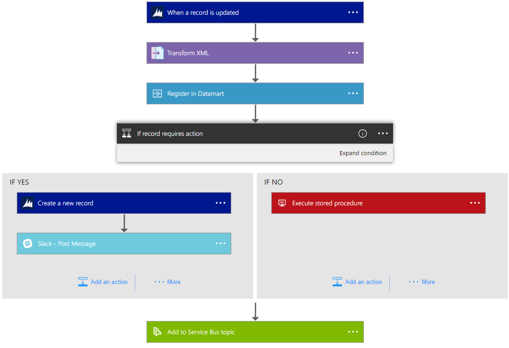

<properties 
    pageTitle="Que sont les applications logique ?" 
    description="En savoir plus sur le Lanceur d’applications logique de Service" 
    authors="kevinlam1" 
    manager="dwrede" 
    editor="" 
    services="logic-apps" 
    documentationCenter=""/>

<tags
    ms.service="logic-apps"
    ms.workload="na"
    ms.tgt_pltfrm="na"
    ms.devlang="na"
    ms.topic="hero-article" 
    ms.date="10/12/2016"
    ms.author="klam"/>

# Que sont les applications logique ?

Applications logique permettent de simplifier et mise en œuvre des flux de travail et les intégrations scalable dans le cloud. Il fournit un concepteur visuel pour modéliser et automatisez vos processus comme une série d’étapes appelé un flux de travail.  Il existe [plusieurs connecteurs](../connectors/apis-list.md) sur le nuage et local pour intégrer rapidement entre les services et les protocoles.  Une application logique commence par un déclencheur (comme « lorsqu’un compte est ajouté à Dynamics CRM ») et après le déclenchement peut commencer plusieurs actions combinaisons, des conversions et une logique de condition.

Les avantages de l’utilisation des applications logique sont les suivants :  

- Gagner du temps en créant des processus complexes à l’aide de facile à comprendre les outils de conception
- Mise en œuvre des motifs et flux de travail en toute transparence, qui seraient difficiles à mettre en œuvre dans le code
- Mise en route rapide à partir de modèles
- Personnalisation de votre application logique avec vos propres API, code et les actions personnalisées
- Se connecter et synchroniser des systèmes hétérogènes dans les locaux et le cloud
- Exploiter BizTalk server, gestion de l’API, fonctions Azure et Bus des services Azure avec prise en charge de l’intégration première classe

Logique applications est un iPaaS entièrement gérées (intégration plateforme en tant que Service) permettant aux développeurs ne pas d’avoir à vous soucier de la création d’hébergement, extensibilité élevées, disponibilité et gestion.  Logique applications sera automatiquement évoluer pour répondre à la demande.

Comme indiqué, avec la logique d’applications, vous pouvez automatiser des processus métiers. Voici quelques exemples :  
 
* Déplacer les fichiers téléchargement à un serveur FTP dans le stockage Azure
* Processus et acheminer des commandes entre en local et systèmes en nuage
* Contrôler tous les tweets à un certain sujet, analyser l’opinion et créer des alertes et des tâches pour les éléments devant être suivi.

Scénarios de ce type peuvent être configurés à partir du concepteur visuel et sans écrire une seule ligne de code. Obtenir de [Création de votre application logique maintenant][create].  Une fois écrite - une application logique peut être [rapidement déployée et reconfigurés](app-service-logic-create-deploy-template.md) dans plusieurs environnements et régions.

## Pourquoi logique applications ?

Logique applications apporte vitesse et extensibilité élevées dans l’espace de l’intégration d’entreprise.  La facilité d’utilisation du concepteur, assurez-vous de divers déclencheurs disponibles et actions et puissants outils de gestion centralisation votre API plus simple que jamais.  Comme entreprises déplacement vers numérisation, applications logique vous permet de connecter ensemble des systèmes hérités et pointe.

En outre, avec notre [Entreprise intégration compte] [ biztalk] vous pouvez mettre à l’échelle afin de faire évoluer scénarios d’intégration avec la puissance d’un [messagerie XML][xml], [Gestion des partenaires commerciaux][tpm]et bien plus encore.

- **Outils de conception facile à utiliser** - applications logique peut être conçue de bout en bout dans le navigateur ou à l’aide des outils de Visual Studio. Démarrer avec un déclencheur - d’un planning simple à lorsqu’un problème GitHub est créé. Organiser puis n’importe quel nombre d’actions à l’aide de la galerie enrichie des connecteurs.

- **API connect facilement** -tâches même composition dont il est faciles décrire sont difficiles à implémenter dans le code. Logique applications facilite pour vous connecter à différents systèmes. Souhaite connecter votre cloud marketing solution vers votre local système de facturation ? Vous souhaitez centraliser la messagerie sur API et systèmes à un Service entreprise ? Applications logique constituent le moyen plus rapide et plus fiable pour fournir des solutions à ces problèmes.

- **Commencer rapidement à partir de modèles** - pour vous aider à commencer nous proposons une [Galerie de modèles] [ templates] vous permettent de créer rapidement des solutions courantes. À partir des solutions B2B avancées pour la connectivité SaaS simple et même quelques qui sont « pour vous amuser » : la galerie d’est le moyen le plus rapide pour commencer à utiliser la puissance des applications logique.

- **Aliments dans extensibilité** - ne voyez pas le lien que vous avez besoin ? Logique applications est conçue pour fonctionner avec vos propres API et le code ; Vous pouvez facilement créer votre propre application API à utiliser comme un lien personnalisé, ou appeler une [Fonction Azure](https://functions.azure.com) pour exécuter des extraits de code à la demande. 

- **Puissance intégration real** - démarrez facile et agrandir que nécessaire. Logique applications peut facilement exploiter la puissance de BizTalk, intégration solution marché de Microsoft pour activer les professionnels de l’intégration à générer les solutions que dont elles ont besoin. En savoir plus sur le [Pack de l’intégration d’entreprise](./app-service-logic-enterprise-integration-overview.md).

## Concepts de l’application logique

Voici quelques-uns des principaux éléments formant l’expérience logique. 

- **Flux de travail** - applications logique fournit un moyen graphique de modéliser vos processus métier comme une série d’étapes ou d’un flux de travail.
- **Connecteurs gérées** - vos applications logique ont besoin d’accéder aux données et services. Connecteurs gérées sont créés spécifiquement pour vous aider lorsque vous connectez à et utilisation de vos données. Consultez la liste des connecteurs désormais disponibles dans [gérées connecteurs][managedapis].
- **Déclencheurs** - certains connecteurs gérées peuvent également agir en tant que déclencheur. Un déclencheur démarre une nouvelle instance d’un flux de travail basé sur un événement spécifique, comme l’arrivée d’un message électronique ou une modification dans votre compte de stockage Azure.
-  **Actions** - chaque étape après que le déclencheur dans un flux de travail est appelé une action. Chaque action est généralement mappée à une opération sur votre connecteur gérée ou des applications personnalisées API.
- Pour des scénarios d’intégration avancées, applications logique **Enterprise Integration Pack** - inclut des capacités à partir de BizTalk. BizTalk est plate-forme d’intégration de Microsoft secteur non significatif. Les connecteurs Enterprise Integration Pack permettent de facilement inclure validation, de transformation et plus d’informations pour votre flux de travail application logique.

## Prise en main  

- Pour commencer avec les applications logique, suivez la [créer une application logique] [ create] didacticiel.  
- [Afficher des exemples et des scénarios courants](app-service-logic-examples-and-scenarios.md)
- [Vous pouvez automatiser des processus métiers avec les applications de logique](http://channel9.msdn.com/Events/Build/2016/T694) 
- [Découvrez comment intégrer vos systèmes applications logique](http://channel9.msdn.com/Events/Build/2016/P462)

[biztalk]: app-service-logic-enterprise-integration-accounts.md
[appservice]: ../app-service/app-service-value-prop-what-is.md
[create]: app-service-logic-create-a-logic-app.md
[managedapis]: ../connectors/apis-list.md
[tpm]: app-service-logic-enterprise-integration-accounts.md
[xml]: app-service-logic-enterprise-integration-b2b.md
[templates]: app-service-logic-use-logic-app-templates.md
