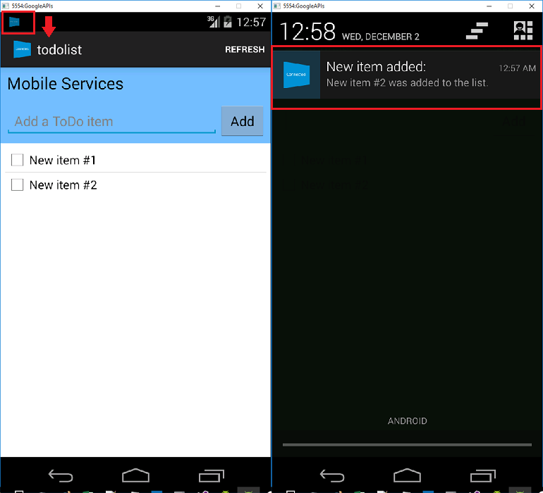

<properties
    pageTitle="Ajouter les Notifications Push à Apache Cordova application des applications mobiles Azure | Service application Azure"
    description="Découvrez comment utiliser les applications Azure Mobile pour envoyer les notifications push à votre application Cordova Apache."
    services="app-service\mobile"
    documentationCenter="javascript"
    manager="erikre"
    editor=""
    authors="ysxu"/>

<tags
    ms.service="app-service-mobile"
    ms.workload="mobile"
    ms.tgt_pltfrm="mobile-html"
    ms.devlang="javascript"
    ms.topic="article"
    ms.date="10/01/2016"
    ms.author="yuaxu"/>

# Ajouter les notifications push à votre application Cordova Apache

[AZURE.INCLUDE [app-service-mobile-selector-get-started-push](../../includes/app-service-mobile-selector-get-started-push.md)]

## Vue d’ensemble

Dans ce didacticiel, ajoutez les notifications push au projet [Cordova Apache rapide démarrer] afin qu’une notification push est envoyée à l’appareil chaque fois qu’un enregistrement est inséré.

Si vous n’utilisez pas le projet de serveur de démarrage rapide téléchargé, vous devez le package d’extension de notification push. Pour plus d’informations, voir [utiliser avec le Kit de développement pour applications Mobile Azure du serveur principal .NET](app-service-mobile-dotnet-backend-how-to-use-server-sdk.md) .

##Conditions préalables

Ce didacticiel couvre une application Apache Cordova développée avec Visual 2015 Studio qui s’exécute sur un appareil iOS, un appareil Windows, l’émulateur Android Google et un appareil Android.

Pour effectuer ce didacticiel, vous devez :

* Un PC avec [Visual Studio Communauté 2015] ou versions ultérieures.
* [Outils visual Studio pour Apache Cordova].
* Un [compte Azure active](https://azure.microsoft.com/pricing/free-trial/).
* Un projet [Cordova Apache démarrage rapide] terminé.
* (Android) Un [compte Google] avec une adresse de messagerie vérifié.
* (iOS) Un abonnement Apple Developer Program et un appareil iOS (iOS Simulator ne prend pas en charge push).
* (Windows) Un compte Windows Store pour les développeurs et un périphérique Windows 10.

##Configurer un concentrateur de notification

[AZURE.INCLUDE [app-service-mobile-configure-notification-hub](../../includes/app-service-mobile-configure-notification-hub.md)]

[Regardez une vidéo montrant les étapes décrites dans cette section](https://channel9.msdn.com/series/Azure-connected-services-with-Cordova/Azure-connected-services-task-3-Create-azure-notification-hub)

##Mettre à jour le projet serveur pour envoyer les notifications push

[AZURE.INCLUDE [app-service-mobile-update-server-project-for-push-template](../../includes/app-service-mobile-update-server-project-for-push-template.md)]

##Modifier votre application Cordova pour recevoir des notifications de transmission

Vous devez vous assurer que votre projet application Cordova Apache est prêt à gérer les notifications push en installant le plug-in de push Cordova ainsi que tous les services push spécifique à la plateforme.

#### Mettre à jour la version Cordova dans votre projet.

Il est recommandé de mettre à jour le projet client à Cordova 6.1.1 si votre projet est configuré à l’aide d’une version antérieure. Pour mettre à jour le projet, cliquez sur fichier pour ouvrir le Concepteur de configuration. Sélectionnez l’onglet plateformes et choisissez 6.1.1 dans la zone de texte **Cordova infrastructure du langage commun** .

Cliquez sur **créer**, puis **Générer la Solution** pour mettre à jour le projet.

#### Installer le plug-in push

Applications Cordova Apache ne gèrent pas en mode natif les capacités de l’appareil ou au réseau.  Ces fonctionnalités sont fournies par les plug-ins sont publiées sur [npm](https://www.npmjs.com/) ou sur GitHub.  La `phonegap-plugin-push` plug-in est utilisée pour gérer les notifications de transmission réseau.

Vous pouvez installer le plug-in push dans une des manières suivantes :

**À partir de l’invite de commande :**

Exécutez la commande suivante :

    cordova plugin add phonegap-plugin-push

**À partir de Visual Studio :**

1.  Dans l’Explorateur, ouvrez la `config.xml` fichier, cliquez sur **plug-ins** > **personnalisé**, sélectionnez **Git** comme la source d’installation, puis entrez `https://github.com/phonegap/phonegap-plugin-push` comme source.

    

2.  Cliquez sur la flèche en regard de la source d’installation.

3. Dans **SENDER_ID**, si vous disposez déjà d’un ID numériques projet pour le projet Google développeur Console, vous pouvez l’ajouter ici. Dans le cas contraire, entrez une valeur de l’espace réservé, telle que 777777, et si vous ciblez Android vous pouvez mettre à jour cette valeur dans config.XML ultérieurement.

4. Cliquez sur **Ajouter**.

Le plug-in push est installé.

####Installer le plug-in appareil

Suivez la même procédure que vous avez utilisé pour installer le plug-in push, mais vous trouverez le plug-in périphérique dans la liste de plug-ins Core (cliquez sur **plug-ins** > **Core** trouver). Vous avez besoin de ce plug-in pour obtenir le nom de la plateforme (`device.platform`).

#### Inscrire votre appareil pour push au démarrage

Au départ, nous inclura certaines un minimum de code pour Android. Plus tard, nous fera certaines modifications petites à s’exécuter sur iOS ou Windows 10.

1. Ajoutez un appel à **registerForPushNotifications** pendant le rappel pour le processus de connexion, ou en bas de la méthode **onDeviceReady** :

        // Login to the service.
        client.login('google')
            .then(function () {
                // Create a table reference
                todoItemTable = client.getTable('todoitem');

                // Refresh the todoItems
                refreshDisplay();

                // Wire up the UI Event Handler for the Add Item
                $('#add-item').submit(addItemHandler);
                $('#refresh').on('click', refreshDisplay);

                    // Added to register for push notifications.
                registerForPushNotifications();

            }, handleError);

    Cet exemple illustre l’appel **registerForPushNotifications** après l’authentification réussit, qui est recommandé lorsque vous utilisez les notifications push et l’authentification dans votre application.

2. Ajouter la nouvelle méthode **registerForPushNotifications** comme suit :

        // Register for Push Notifications. Requires that phonegap-plugin-push be installed.
        var pushRegistration = null;
        function registerForPushNotifications() {
          pushRegistration = PushNotification.init({
              android: { senderID: 'Your_Project_ID' },
              ios: { alert: 'true', badge: 'true', sound: 'true' },
              wns: {}
          });

        // Handle the registration event.
        pushRegistration.on('registration', function (data) {
          // Get the native platform of the device.
          var platform = device.platform;
          // Get the handle returned during registration.
          var handle = data.registrationId;
          // Set the device-specific message template.
          if (platform == 'android' || platform == 'Android') {
              // Register for GCM notifications.
              client.push.register('gcm', handle, {
                  mytemplate: { body: { data: { message: "{$(messageParam)}" } } }
              });
          } else if (device.platform === 'iOS') {
              // Register for notifications.            
              client.push.register('apns', handle, {
                  mytemplate: { body: { aps: { alert: "{$(messageParam)}" } } }
              });
          } else if (device.platform === 'windows') {
              // Register for WNS notifications.
              client.push.register('wns', handle, {
                  myTemplate: {
                      body: '<toast><visual><binding template="ToastText01"><text id="1">$(messageParam)</text></binding></visual></toast>',
                      headers: { 'X-WNS-Type': 'wns/toast' } }
              });
          }
        });

        pushRegistration.on('notification', function (data, d2) {
          alert('Push Received: ' + data.message);
        });

        pushRegistration.on('error', handleError);
        }

3. (Android) Dans le code ci-dessus, remplacez `Your_Project_ID` par le numérique project ID pour votre application à partir de la [Console de développeur Google].

## (Facultatif) Configurer et exécuter l’application sur Android

Terminer cette section pour activer les notifications push pour Android.

####Activer Firebase Cloud de messagerie

Étant donné que nous prévoyons initialement la plateforme Google Android, vous devez activer la messagerie Cloud Firebase. De même, si vous ont été ciblage appareils Microsoft Windows, vous devriez autoriser WNS prise en charge.

[AZURE.INCLUDE [notification-hubs-enable-firebase-cloud-messaging](../../includes/notification-hubs-enable-firebase-cloud-messaging.md)]

####Configurer le système principal de l’application Mobile pour envoyer des demandes de transmission à l’aide de FCM

[AZURE.INCLUDE [app-service-mobile-android-configure-push](../../includes/app-service-mobile-android-configure-push.md)]

####Configurer votre application Cordova pour Android

Dans votre application Cordova, ouvrez config.XML et remplacez `Your_Project_ID` par le numérique project ID pour votre application à partir de la [Console de développeur Google].

        <plugin name="phonegap-plugin-push" version="1.7.1" src="https://github.com/phonegap/phonegap-plugin-push.git">
            <variable name="SENDER_ID" value="Your_Project_ID" />
        </plugin>

Ouvrez index.js et mettre à jour le code pour utiliser votre ID de projet numérique.

        pushRegistration = PushNotification.init({
            android: { senderID: 'Your_Project_ID' },
            ios: { alert: 'true', badge: 'true', sound: 'true' },
            wns: {}
        });

####Configurer votre appareil Android pour le débogage USB

Avant de déployer votre application sur votre appareil Android, vous devez activer le débogage USB.  Sur votre téléphone Android, effectuez les opérations suivantes :

1. Accédez à **paramètres** > **sur téléphone**, puis appuyez sur le **numéro de version** jusqu'à ce que mode développeur est activé (environ 7 fois).

2. Dans **paramètres** > **Options pour les développeurs** activer le **débogage USB**, puis se connecter votre téléphone Android pour le développement de votre PC doté d’un câble USB.

Nous cela testé à l’aide d’un appareil X Google Nexus 5 exécutant Android 6.0 (shamallow).  Toutefois, les techniques sont communes à n’importe quelle version Android moderne.

#### Installez les Services Google Play

Le plug-in push repose sur Android Services Google Play les notifications push.  

1.  Dans **Visual Studio**, cliquez sur **Outils** > **Android** > **Android SDK Manager**, développez le dossier **Suppléments** et cochez la case pour vous assurer que chacun des kits de développement logiciel suivants est installé.
    * Android 2.3 ou version ultérieure
    * Révision de Google référentiel 27 ou une version ultérieure
    * Les Services Google Play 9.0.2 ou une version ultérieure

2.  Cliquez sur **Installer un package** , attendez pour terminer l’installation.

En cours obligatoire bibliothèques sont répertoriées dans la [documentation d’installation du plug-in-phonegap-push].

#### Notifications push test dans l’application sur Android

Vous pouvez les notifications push maintenant test en exécutant l’application et insérer des éléments dans la table TodoItem. Vous pouvez faire ceci à partir de la même appareil ou d’un second périphérique, dans la mesure où vous utilisez le même serveur principal. Tester votre application Cordova sur la plateforme Android dans une des façons suivantes :

- **Sur un appareil physique :**  
Connectez votre appareil Android à votre ordinateur de développement avec un câble USB.  Au lieu **Google Android émulateur**, sélectionnez **l’appareil**. Visual Studio déployer l’application à l’appareil et l’exécuter.  Vous pouvez alors interagir avec l’application sur l’appareil.  
Améliorer votre expérience de développement.  Écran de partage d’applications telles que [Mobizen] peut vous aider à développement d’une application Android par projeter votre écran Android à un navigateur web sur votre PC.

- **Sur un émulateur Android :**  
Il existe des étapes de configuration supplémentaires requises lors de l’exécution sur un émulateur.

    Vérifiez que vous déployez à ou débogage sur un périphérique virtuel lequel APIs de Google est définie comme cible, comme illustré ci-dessous dans le Gestionnaire de périphériques virtuel Android (AVD).

    

    Si vous souhaitez utiliser un x86 plus rapide émulateur, [installez le pilote HAXM](https://taco.visualstudio.com/en-us/docs/run-app-apache/#HAXM) et configurer l’émulateur utilisez-le.

    Ajouter un compte Google à l’appareil Android en cliquant sur **applications** > **paramètres** > **Ajouter un compte**, puis suivez les invites pour ajouter un Google existant du compte à l’appareil (nous vous recommandons à l’aide d’un compte existant au lieu de créer un nouvel identifiant).

    

    Exécutez l’application de la liste des tâches comme avant et insérer un nouvel élément todo. Cette fois-ci, une icône de notification s’affiche dans la zone de notification. Vous pouvez ouvrir le bac d’alimentation notification pour afficher le texte complet de la notification.

    

##(Facultatif) Configurer et exécuter sur iOS

Cette section s’applique à exécuter le projet Cordova sur les appareils iOS. Vous pouvez ignorer cette section si vous ne travaillez pas avec des appareils iOS.

####Installez et exécutez l’agent de remotebuild iOS sur un Mac ou sur le cloud service

Avant de pouvoir exécuter une application Cordova sur iOS à l’aide de Visual Studio, accédez aux étapes dans [iOS Guide de configuration](http://taco.visualstudio.com/en-us/docs/ios-guide/) pour installer et exécuter l’agent remotebuild.

Vérifiez que vous pouvez créer l’application pour iOS. Les étapes décrites dans le guide de configuration sont requises pour générer pour iOS à partir de Visual Studio. Si vous ne disposez pas d’un Mac, vous pouvez générer pour iOS à l’aide de l’agent remotebuild sur un service tel que MacInCloud. Pour plus d’informations, voir [exécuter votre application iOS dans le cloud](http://taco.visualstudio.com/en-us/docs/build_ios_cloud/).

>[AZURE.NOTE] XCode 7 ou version ultérieure est requis pour utiliser le plug-in push sur iOS.

####Rechercher l’ID à utiliser comme votre ID d’application

Avant d’enregistrer votre application pour les notifications push, config.XML ouverte dans votre application Cordova, recherchez la `id` valeur dans l’élément widget de l’attribut, puis copiez-le pour une utilisation ultérieure. Dans le code XML suivant, l’ID est `io.cordova.myapp7777777`.

        <widget defaultlocale="en-US" id="io.cordova.myapp7777777"
        version="1.0.0" windows-packageVersion="1.1.0.0" xmlns="http://www.w3.org/ns/widgets"
            xmlns:cdv="http://cordova.apache.org/ns/1.0" xmlns:vs="http://schemas.microsoft.com/appx/2014/htmlapps">

Utiliser une version ultérieure, cet identificateur lorsque vous créez un ID d’application sur le portail des développeurs d’Apple. (Si vous créez un ID différent de l’application sur le portail de développement et que vous souhaitez utiliser, vous devrez effectuer quelques opérations supplémentaires plus loin dans ce didacticiel pour modifier ce code dans config.Xml. L’ID de l’élément de widget doit correspondre au code de l’application sur le portail de développement.)

####Enregistrer l’application pour les notifications push sur portail des développeurs d’Apple

[AZURE.INCLUDE [Enable Apple Push Notifications](../../includes/enable-apple-push-notifications.md)]

[Regardez une vidéo montrant une procédure similaire](https://channel9.msdn.com/series/Azure-connected-services-with-Cordova/Azure-connected-services-task-5-Set-up-apns-for-push)

####Configurer Azure pour envoyer les notifications push

[AZURE.INCLUDE [app-service-mobile-apns-configure-push](../../includes/app-service-mobile-apns-configure-push.md)]

####Vérifiez que votre ID d’application correspond à votre application Cordova

Si l’ID de l’application déjà créé dans votre compte de développeur Apple correspond à l’ID de l’élément widget dans config.XML, vous pouvez ignorer cette étape. Toutefois, si les ID ne correspondent pas, procédez comme suit :

1. Supprimez le dossier plateformes à partir de votre projet.

2. Supprimez le dossier Plug-ins à partir de votre projet.

3. Supprimez le dossier node_modules à partir de votre projet.

4. Mettre à jour l’attribut id de l’élément widget dans config.XML à utiliser l’ID de l’application que vous avez créé dans votre compte de développeur Apple.

5. Régénérer votre projet.

#####Notifications de transmission de test dans votre application iOS

1. Dans Visual Studio, assurez-vous **iOS** est sélectionné comme cible du déploiement, puis sur **appareil** à s’exécuter sur votre appareil iOS connecté.

    Vous pouvez exécuter sur un appareil iOS connecté à votre PC à l’aide d’iTunes. IOS Simulator ne prend pas en charge les notifications push.

2. Appuyez sur le bouton **exécuter** ou **F5** dans Visual Studio pour générer le projet et lancer l’application dans un appareil iOS, puis cliquez sur **OK** pour accepter les notifications push.

    >[AZURE.NOTE] Vous devez explicitement accepter les notifications push à partir de votre application. Cette requête se produit uniquement la première fois que l’application s’exécute.

3. Dans l’application, tapez une tâche, puis cliquez sur le signe plus (+) icône.

4. Vérifiez qu’une notification correctement après réception, puis cliquez sur OK pour fermer la notification.

##(Facultatif) Configurer et exécuter sur Windows

Cette section s’applique à exécuter le projet de l’application Cordova Apache sur les appareils Windows 10 (le plug-in de push PhoneGap est pris en charge sur Windows 10). Vous pouvez ignorer cette section si vous ne travaillez pas avec des appareils Windows.

####Enregistrer votre application Windows pour les notifications push avec WNS

Pour utiliser les options de la banque dans Visual Studio, sélectionnez une cible Windows dans la liste de plateformes de Solution, tels que **Windows x64** ou **Windows x86** (évitez **Windows AnyCPU** les notifications push).

[AZURE.INCLUDE [app-service-mobile-register-wns](../../includes/app-service-mobile-register-wns.md)]

[Regardez une vidéo montrant une procédure similaire](https://channel9.msdn.com/series/Azure-connected-services-with-Cordova/Azure-connected-services-task-6-Set-up-wns-for-push)

####Configurer le hub de notification pour WNS

[AZURE.INCLUDE [app-service-mobile-configure-wns](../../includes/app-service-mobile-configure-wns.md)]

####Configurer votre application Cordova pour prendre en charge les notifications push Windows

Ouvrez le Concepteur de configuration (avec le bouton droit sur Config.XML et sélectionnez **Concepteur de vue**), sélectionnez l’onglet **Windows** , puis sélectionnez **Windows 10** sous **Windows cible Version**.

>[AZURE.NOTE] Si vous utilisez un Cordova version6.1.1 avant Cordova 5.1.1 (recommandé), vous devez également définir l’indicateur Toast compatible true dans config.Xml.

Pour prendre en charge push notifications dans votre par défaut (débogage) crée, fichier build.json ouvert. Copiez la configuration de « publication » sur la configuration de débogage.

        "windows": {
            "release": {
                "packageCertificateKeyFile": "res\\native\\windows\\CordovaApp.pfx",
                "publisherId": "CN=yourpublisherID"
            }
        }

Après la mise à jour, le code précédent doit ressembler à ceci.

    "windows": {
        "release": {
            "packageCertificateKeyFile": "res\\native\\windows\\CordovaApp.pfx",
            "publisherId": "CN=yourpublisherID"
            },
        "debug": {
            "packageCertificateKeyFile": "res\\native\\windows\\CordovaApp.pfx",
            "publisherId": "CN=yourpublisherID"
            }
        }

Créer l’application et vérifiez que vous n’avez aucune erreur. Vous application client doit maintenant enregistrer pour les notifications à partir du serveur principal de l’application Mobile. Répétez cette section pour chaque projet Windows de votre solution.

####Notifications de transmission de test dans votre application Windows

Dans Visual Studio, vérifiez qu’une plateforme Windows est sélectionnée comme cible de déploiement, tels que **Windows x64** ou **Windows x86**. Pour exécuter l’application sur un PC 10 Windows d’hébergement Visual Studio, choisissez **Ordinateur Local**.

Appuyez sur le bouton Exécuter pour générer le projet et lancer l’application.

Dans l’application, tapez un nom pour une nouvelle todoitem, puis cliquez sur le signe plus (+) icône pour l’ajouter.

Vérifiez la réception d’une notification lorsque l’élément est ajouté.

##Étapes suivantes

* En savoir plus sur [Hubs de Notification] pour en savoir plus sur les notifications push.
* Si vous ne le n'avez pas déjà fait, passez le didacticiel en [Ajoutant l’authentification] dans votre application Apache Cordova.

Découvrez comment utiliser le SDK.

* [Kit de développement logiciel Apache Cordova]
* [ASP.NET Server (SDK)]
* [Node.js Server (SDK)]

<!-- URLs -->
[Ajout d’authentification]: app-service-mobile-cordova-get-started-users.md
[Démarrage rapide Cordova Apache]: app-service-mobile-cordova-get-started.md
[authentication]: app-service-mobile-cordova-get-started-users.md
[Work with the .NET backend server SDK for Azure Mobile Apps]: app-service-mobile-dotnet-backend-how-to-use-server-sdk.md
[Compte Google]: http://go.microsoft.com/fwlink/p/?LinkId=268302
[Console de Google développeur]: https://console.developers.google.com/home/dashboard
[documentation d’installation du plug-in-PhoneGap-push]: https://github.com/phonegap/phonegap-plugin-push/blob/master/docs/INSTALLATION.md
[Mobizen]: https://www.mobizen.com/
[Communauté Visual Studio 2015]: http://www.visualstudio.com/
[Outils Visual Studio pour Apache Cordova]: https://www.visualstudio.com/en-us/features/cordova-vs.aspx
[Notification Hubs]: ../notification-hubs/notification-hubs-push-notification-overview.md
[Kit de développement logiciel Apache Cordova]: app-service-mobile-cordova-how-to-use-client-library.md
[ASP.NET Server (SDK)]: app-service-mobile-dotnet-backend-how-to-use-server-sdk.md
[Node.js Server (SDK)]: app-service-mobile-node-backend-how-to-use-server-sdk.md
