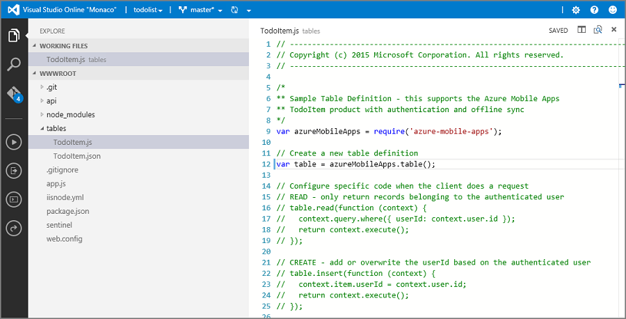

<properties
    pageTitle="Comment travailler avec le Kit de développement logiciel du serveur principal Node.js pour les applications mobiles | Service application Azure"
    description="Découvrez comment travailler avec le Kit de développement logiciel du serveur principal Node.js pour Azure Application Service Mobile actuelles."
    services="app-service\mobile"
    documentationCenter=""
    authors="adrianhall"
    manager="erikre"
    editor=""/>

<tags
    ms.service="app-service-mobile"
    ms.workload="mobile"
    ms.tgt_pltfrm="mobile-multiple"
    ms.devlang="node"
    ms.topic="article"
    ms.date="10/01/2016"
    ms.author="adrianha"/>

# Comment utiliser le Kit de développement logiciel Azure Mobile applications Node.js

[AZURE.INCLUDE [app-service-mobile-selector-server-sdk](../../includes/app-service-mobile-selector-server-sdk.md)]

Cet article fournit des informations détaillées et des exemples montrant comment travailler avec un serveur principal Node.js dans Azure Application Service Mobile applications.

## Introduction

Azure Application Service Mobile applications offre la possibilité d’ajouter un accès mobile optimisé données API Web à une application web.  Azure Application Service Mobile applications SDK est fourni pour les applications web ASP.NET et Node.js.  Le Kit de développement fournit les opérations suivantes :

- Opérations de table (lecture, Insert, Update, Delete) pour accéder aux données
- Opérations de Custom API

Les deux opérations fournissent pour l’authentification entre tous les fournisseurs d’identité autorisées par Azure Application Service, y compris les fournisseurs d’identité social tel que Facebook, Twitter, Google et Microsoft ainsi que Azure Active Directory pour l’identité de l’entreprise.

Vous trouverez des exemples pour chaque cas d’utilisation dans le [répertoire d’exemples GitHub].

## Plateformes prises en charge

Le nœud applications Azure Mobile SDK prend en charge la version LTS actuelle du nœud et versions ultérieures.  Au moment de rédaction, la dernière version LTS est nœud v4.5.0.  Autres versions de nœud peuvent fonctionner mais ne sont pas pris en charge.

Le nœud applications Azure Mobile SDK prend en charge deux pilotes de base de données : le pilote nœud mssql prend en charge SQL Azure et instances de SQL Server locales.  Le pilote sqlite3 prend en charge les bases de données SQLite sur une seule instance uniquement.

### Comment : créer un serveur principal Node.js base à l’aide de la ligne de commande

Chaque version serveur Azure Application Service Mobile application Node.js démarre comme une application ExpressJS.  ExpressJS est l’infrastructure de service web les plus populaires pour Node.js.  Vous pouvez créer un basic application [Express] comme suit :

1. Dans une fenêtre de PowerShell ou de commande, créez un répertoire pour votre projet.

        mkdir basicapp

2. Exécutez initialisation npm pour l’initialisation de la structure d’un package.

        cd basicapp
        npm init

    La commande initialisation npm vous invite à fournir un ensemble de questions initialisation du projet.  Voir l’exemple de sortie :

    ![La sortie initialisation npm][0]

3. Installer les bibliothèques express et applications azure-mobile à partir du référentiel npm.

        npm install --save express azure-mobile-apps

4. Créer un fichier app.js pour mettre en œuvre le serveur mobile simple.

        var express = require('express'),
            azureMobileApps = require('azure-mobile-apps');

        var app = express(),
            mobile = azureMobileApps();

        // Define a TodoItem table
        mobile.tables.add('TodoItem');

        // Add the mobile API so it is accessible as a Web API
        app.use(mobile);

        // Start listening on HTTP
        app.listen(process.env.PORT || 3000);

Cette application crée un WebAPI optimisée pour mobile avec un point de terminaison unique (`/tables/TodoItem`) qui fournit l’accès non authentifiés dans un magasin de données SQL sous-jacent à l’aide d’un schéma dynamiques.  Il convient pour suivre le démarrage rapide de bibliothèque client :

- [Démarrage rapide de Client Android]
- [Démarrage rapide Apache Cordova Client]
- [démarrage rapide de Client iOS]
- [Démarrage rapide de Client du Windows Store]
- [Démarrage rapide de Xamarin.iOS Client]
- [Démarrage rapide de Xamarin.Android Client]
- [Démarrage rapide de Xamarin.Forms Client]

Vous pouvez trouver le code de cette application de base dans l' [exemple basicapp sur GitHub].

### Comment : créer un serveur principal nœud avec Visual Studio 2015

Visual Studio 2015 nécessite une extension pour développer des applications Node.js l’IDE.  Pour commencer, installez les [Outils Node.js 1.1 pour Visual Studio].  Une fois les outils Node.js pour Visual Studio sont installés, créer une application 4.x Express :

1. Ouvrir la boîte de dialogue **Nouveau projet** (à partir du **fichier** > **Nouveau** > **projet...**).

2. Développez **modèles** > **JavaScript** > **Node.js**.

3. Sélectionnez l' **Application de base Azure Node.js Express 4**.

4. Renseignez le nom du projet.  Cliquez sur *OK*.

    ![Projet Visual Studio 2015][1]

5. Cliquez sur le nœud de **npm** et sélectionnez **installer nouveaux packages npm...**.

6. Vous devrez peut-être actualiser le catalogue npm sur la création de votre première application Node.js.  Si nécessaire, cliquez sur **Actualiser** .

7. Entrez les _applications azure-mobile_ dans la zone de recherche.  Cliquez sur le package **applications 2.0.0 azure-mobile** , puis cliquez sur **Installer un Package**.

    ![Installer de nouveaux packages npm][2]

8. Cliquez sur **Fermer**.

9. Ouvrez le fichier _app.js_ pour prendre en charge le Kit de développement Azure Mobile applications.  Au niveau de la ligne 6 at la partie inférieure de la bibliothèque exiger des instructions, ajoutez le code suivant :

        var bodyParser = require('body-parser');
        var azureMobileApps = require('azure-mobile-apps');

    Au niveau de ligne environ 27 après les autres instructions app.use, ajoutez le code suivant :

        app.use('/users', users);

        // Azure Mobile Apps Initialization
        var mobile = azureMobileApps();
        mobile.tables.add('TodoItem');
        app.use(mobile);

    Enregistrez le fichier.

10. Exécutez l’application localement (l’API est pris en charge sur http://localhost:3000) ou publier sur Azure.

### Comment : créer un serveur principal Node.js à l’aide du portail Azure

Vous pouvez créer une droite de la version serveur application Mobile dans le [portail Azure]. Vous pouvez suivre les étapes suivantes ou créez un client et serveur ensemble en suivant le didacticiel [créer une application mobile](app-service-mobile-ios-get-started.md) . Le didacticiel contient une version simplifiée de ces instructions et le mieux adapté à preuve de projets concept.

[AZURE.INCLUDE [app-service-mobile-dotnet-backend-create-new-service-classic](../../includes/app-service-mobile-dotnet-backend-create-new-service-classic.md)]

Dans la carte de _mise en route_ , sous **créer une table API**, choisissez **Node.js** comme votre **langue principale**. Cochez la case pour «**je certifie que cela remplacera tout contenu du site.**», puis cliquez sur **tableau TodoItem créer**.

### Comment : télécharger le projet de code de démarrage rapide de serveur principal Node.js à l’aide de Git

Lorsque vous créez une application Mobile Node.js principale à l’aide du portail de carte de **démarrage rapide** , un projet Node.js est créé pour vous et déployé sur votre site. Vous pouvez ajouter des tableaux et des API et modifier des fichiers de code pour le serveur principal Node.js dans le portail. Vous pouvez également utiliser les outils de déploiement différents pour télécharger le projet principal afin que vous pouvez ajouter ou modifier des tables et des API, puis publier à nouveau le projet. Pour plus d’informations, voir le [Guide de déploiement d’Azure Application Service]. la procédure suivante utilise un référentiel Git pour télécharger le code de projet de démarrage rapide.

1. Installez Git, si vous n’avez pas déjà fait. Les étapes nécessaires pour installer Git varient entre les systèmes d’exploitation. Voir [Installation Git](http://git-scm.com/book/en/Getting-Started-Installing-Git) pour répartitions spécifiques au système d’exploitation et consulter des instructions d’installation.

2. Suivez les étapes décrites dans [Activer le référentiel application de Service d’application](../app-service-web/app-service-deploy-local-git.md#Step3) pour activer le référentiel Git pour votre site principal, effectuer une note du déploiement nom d’utilisateur et mot de passe.

3. Dans la carte pour la principale application Mobile, notez le paramètre **Git cloner URL** .

4. Exécuter le `git clone` commande en utilisant le Git clone URL, entrer votre mot de passe le cas échéant, comme dans l’exemple suivant :

        $ git clone https://username@todolist.scm.azurewebsites.net:443/todolist.git

5. Accédez au répertoire local, qui dans l’exemple précédent est /todolist et notez que les fichiers de projet ont été téléchargés. Recherchez la `todoitem.json` de fichier dans le `/tables` répertoire.  Ce fichier définit les autorisations sur la table.  Sont également disponibles le `todoitem.js` fichier dans le même répertoire, qui définit cette opération CRUD des scripts pour la table.

6. Une fois que vous avez apporté des modifications aux fichiers de projet, exécutez les commandes suivantes pour ajouter, valider, puis télécharger les modifications sur le site :

        $ git commit -m "updated the table script"
        $ git push origin master

    Lorsque vous ajoutez de nouveaux fichiers au projet, vous devez tout d’abord exécuter le `git add .` commande.

Le site est republié chaque fois qu’un nouvel ensemble de validations est envoyée au site.

### Comment : publier votre serveur principal Node.js vers Azure

Microsoft Azure propose plusieurs mécanismes pour la publication de votre serveur principal Azure Application Service Mobile applications Node.js au service Azure.  Il s’agit utilisant des outils de déploiement intégrés dans Visual Studio, les outils de ligne de commande et options de déploiement continue en fonction de contrôle de code source.  Pour plus d’informations sur ce sujet, consultez le [Guide de déploiement d’Azure Application Service].

Azure Application Service contient des conseils pour application Node.js que vous devez évaluer avant de déployer spécifiques :

- Comment [spécifier la Version de nœud]
- Comment [utiliser les modules nœud]

### Comment : activer une Page d’accueil de votre application

De nombreuses applications sont une combinaison des applications mobiles et de site web et l’infrastructure ExpressJS vous permet de combiner les deux facettes.  Parfois, cependant, vous souhaiterez peut-être n'implémenter qu’une interface mobile.  Il est utile de fournir une page d’accueil pour garantir le service d’application est en cours d’exécution.  Vous pouvez fournir votre propre page d’accueil ou activer une page d’accueil temporaire.  Pour activer une page d’accueil temporaire, utilisez ce qui suit d’instanciation Azure Mobile applications :

    var mobile = azureMobileApps({ homePage: true });

Si vous voulez uniquement cette option disponible lorsque vous développez localement, vous pouvez ajouter ce paramètre pour votre `azureMobile.js` fichier.

## Opérations de table 

Le Kit de développement applications azure-mobile Node.js Server fournit des mécanismes pour exposer des tables de données stockées dans la base de données SQL Azure comme un WebAPI.  Cinq opérations sont fournies.

| Opération | Description |
| --------- | ----------- |
| OBTENIR /tables/_tablename_ | Obtenez tous les enregistrements dans le tableau |
| OBTENIR /tables/_tablename_/:id | Obtenir un enregistrement spécifique dans la table |
| BILLET /tables/_tablename_ | Créer un enregistrement dans la table |
| CORRECTIF /tables/_tablename_/:id | Mettre à jour un enregistrement dans la table |
| SUPPRIMER /tables/_tablename_/:id | Supprimer un enregistrement dans la table |

Cette WebAPI prend en charge [d’OData] et étend le schéma de table pour prendre en charge de la [synchronisation de données hors connexion].

### Comment : définir des tables à l’aide d’un schéma dynamiques

Avant de pouvoir utiliser une table, elle doit être définie.  Tables peuvent être définis avec un schéma statique (dans lequel le développeur définit les colonnes dans le schéma) ou dynamique (où le Kit de développement de contrôler le schéma basé sur des demandes entrantes). En outre, le développeur peut contrôler des aspects spécifiques de la WebAPI en ajoutant du code Javascript à la définition.

Pour obtenir les meilleurs résultats, vous devez définir chaque table dans un fichier Javascript dans l’annuaire de tables, puis utilisez la méthode tables.import() pour importer les tables.  Extension de l’application de base, le fichier app.js seront ajusté :

    var express = require('express'),
        azureMobileApps = require('azure-mobile-apps');

    var app = express(),
        mobile = azureMobileApps();

    // Define the database schema that is exposed
    mobile.tables.import('./tables');

    // Provide initialization of any tables that are statically defined
    mobile.tables.initialize().then(function () {
        // Add the mobile API so it is accessible as a Web API
        app.use(mobile);

        // Start listening on HTTP
        app.listen(process.env.PORT || 3000);
    });

Définissez la table dans. / tables/TodoItem.js :

    var azureMobileApps = require('azure-mobile-apps');

    var table = azureMobileApps.table();

    // Additional configuration for the table goes here

    module.exports = table;

Tables utilisent schéma dynamiques par défaut.  Pour désactiver globalement schéma dynamiques, définissez le paramètre application **MS_DynamicSchema** faux au sein du portail Azure.

Vous pouvez trouver un exemple complet dans l' [exemple todo sur GitHub].

### Comment : définir des tables à l’aide d’un schéma statique

Vous pouvez définir explicitement les colonnes pour exposer via la WebAPI.  Le Kit de développement Node.js applications azure-mobile ajoute automatiquement toutes les autres colonnes requis pour la synchronisation des données en mode hors connexion pour la liste que vous spécifiez.  Par exemple, les démarrage rapide pour les applications clientes nécessitent une table contenant deux colonnes : texte (chaîne) et terminer (booléenne).  
La table peut être définie dans le tableau JavaScript fichier de définition (situé dans le répertoire de tables) comme suit :

    var azureMobileApps = require('azure-mobile-apps');

    var table = azureMobileApps.table();

    // Define the columns within the table
    table.columns = {
        "text": "string",
        "complete": "boolean"
    };

    // Turn off dynamic schema
    table.dynamicSchema = false;

    module.exports = table;

Si vous définissez des tables statique, vous devez également appeler la méthode tables.initialize() pour créer le schéma de base de données lors du démarrage.  La méthode tables.initialize() retourne une [vente] afin que le service web ne sert pas demandes avant la base de données en cours d’initialisation.

### Comment : utiliser SQL Express comme banque de données de développement sur votre ordinateur local

La Azure applications The AzureMobile applications nœud Kit de développement Mobile propose trois options pour traiter les données prêts à l’emploi : SDK fournit trois options sont disponibles pour traiter les données prêts à l’emploi :

- Le pilote de **mémoire** permet de fournir un magasin exemple non permanent
- Le pilote **mssql** permet de fournir un magasin de données SQL Express pour le développement
- Utilisez le pilote **mssql** pour fournir une banque de données de base de données SQL Azure de production

Kit de développement logiciel Azure Mobile applications Node.js utilise le [mssql Node.js package] pour établir et utiliser une connexion à SQL Express et la base de données SQL.  Ce package nécessite que vous activez les connexions TCP sur votre instance SQL Express.

> [AZURE.TIP]Le pilote de mémoire ne fournit pas un ensemble complet de fonctionnalités pour le test.  Si vous souhaitez tester votre serveur principal localement, nous vous recommandons de l’utilisation d’un magasin de données SQL Express et le pilote mssql.

1. Téléchargez et installez [Microsoft SQL Server 2014 Express].  Vérifiez que vous installez la 2014 de SQL Server Express avec l’édition d’outils.  Sauf si vous avez besoin explicitement prise en charge 64 bits, la version 32 bits consomme moins de mémoire lors de l’exécution.

2. Exécuter le Gestionnaire de Configuration SQL Server 2014.

  1. Développez le nœud de **Configuration du réseau SQL Server** dans le menu de l’arborescence à gauche.
  2. Cliquez sur **protocoles pour SQLEXPRESS**.
  3. Droit **TCP/IP** , puis sélectionnez **Activer**.  Dans le menu contextuel, cliquez sur **OK** .
  4. Droit **TCP/IP** , puis sélectionnez **Propriétés**.
  5. Cliquez sur l’onglet **Adresses IP** .
  6. Recherchez le nœud **IPAll** .  Dans le champ **Port TCP** , entrez **1433**.

         ![Configure SQL Express for TCP/IP][3]

  7. Cliquez sur **OK**.  Dans le menu contextuel, cliquez sur **OK** .
  8. Dans le menu de l’arborescence à gauche, cliquez sur **Services de SQL Server** .
  9. Droit **SQL Server (SQLEXPRESS)** , puis sélectionnez **redémarrer**
  10. Fermez le Gestionnaire de Configuration SQL Server 2014.

3. Exécutez SQL Server 2014 Management Studio et connectez-vous à votre instance locale SQL Express

  1. Avec le bouton droit de votre instance dans l’Explorateur d’objets, puis sélectionnez **Propriétés**
  2. Sélectionnez la page de **sécurité** .
  3. Vérifiez **SQL Server et mode d’authentification Windows** est sélectionnée
  4. Cliquez sur **OK**

        ![Configurer l’authentification Express SQL][4]

  5. Développez **sécurité** > **connexions** dans l’Explorateur d’objets
  6. Cliquez sur **connexions** et sélectionnez **Nouvelle connexion...**
  7. Entrez un nom de connexion.  Sélectionnez **l’authentification SQL Server**.  Entrez un mot de passe, puis entrez le mot de passe dans la **page Confirmer le mot de passe**.  Le mot de passe doit répondre aux exigences de complexité de Windows.
  8. Cliquez sur **OK**

        ![Ajouter un nouvel utilisateur à SQL Express][5]

  9. Avec le bouton droit de votre nouvelle connexion, puis sélectionnez **Propriétés**
  10. Sélectionnez la page **Rôles de serveur**
  11. Cochez la case en regard du rôle de serveur **dbcreator**
  12. Cliquez sur **OK**
  13. Fermez le SQL Server 2015 Management Studio

Vérifiez que vous enregistrez le nom d’utilisateur et mot de passe sélectionné.  Vous devrez peut-être affecter des rôles de serveurs supplémentaires ou autorisations selon vos besoins en matière de base de données spécifique.

L’application Node.js lit la variable d’environnement **SQLCONNSTR_MS_TableConnectionString** pour la chaîne de connexion pour cette base de données.  Vous pouvez définir cette variable au sein de votre environnement.  Par exemple, vous pouvez utiliser PowerShell pour définir cette variable d’environnement :

    $env:SQLCONNSTR_MS_TableConnectionString = "Server=127.0.0.1; Database=mytestdatabase; User Id=azuremobile; Password=T3stPa55word;"

Accéder à la base de données via une connexion TCP/IP et fournir un nom d’utilisateur et mot de passe pour la connexion.

### Comment : configurer votre projet pour le développement local

Applications mobiles Azure lit un fichier JavaScript appelé _azureMobile.js_ du système de fichiers local.  N’utilisez pas ce fichier pour configurer le Kit de développement Azure Mobile applications en production - utiliser les paramètres de l’application au sein du [portail Azure] à la place.  Le fichier _azureMobile.js_ doit exporter un objet de configuration.  Les plus courants sont les suivantes :

- Paramètres de base de données
- Paramètres de journalisation des Diagnostics
- Paramètres de substitution CORS

Un exemple de fichier _azureMobile.js_ implémentation des paramètres de base de données précédente suit :

    module.exports = {
        cors: {
            origins: [ 'localhost' ]
        },
        data: {
            provider: 'mssql',
            server: '127.0.0.1',
            database: 'mytestdatabase',
            user: 'azuremobile',
            password: 'T3stPa55word'
        },
        logging: {
            level: 'verbose'
        }
    };

Nous vous recommandons d’ajouter _azureMobile.js_ à votre fichier _.gitignore_ (ou autre contrôle de code source ignorer fichier) pour empêcher les mots de passe ne soient pas enregistrées dans le cloud.  Toujours configurer les paramètres de production dans les paramètres de l’application au sein du [portail Azure].

### Procédure : Configurer les paramètres d’application pour votre application Mobile

La plupart des paramètres dans le fichier _azureMobile.js_ ont un paramètre d’application équivalent dans le [portail Azure].  Utilisez la liste suivante pour configurer votre application dans les paramètres de l’application :

| Paramètre d’application                 | Paramètre de _azureMobile.js_  | Description                               | Valeurs valides                                |
| :-------------------------- | :------------------------ | :---------------------------------------- | :------------------------------------------ |
| **MS_MobileAppName**        | nom                      | Le nom de l’application                       | chaîne                                      |
| **MS_MobileLoggingLevel**   | Logging.Level             | Niveau de journalisation minimale de messages pour ouvrir une session      | erreur, avertissement, informations, détaillée, débogage, effet |
| **MS_DebugMode**            | déboguer                     | Activer ou désactiver le mode débogage              | Vrai, faux                                 |
| **MS_TableSchema**          | Data.Schema               | Nom du schéma par défaut pour les tables SQL        | chaîne (par défaut : dbo)                       |
| **MS_DynamicSchema**        | data.dynamicSchema        | Activer ou désactiver le mode débogage              | Vrai, faux                                 |
| **MS_DisableVersionHeader** | version (définie sur non définie)| Désactive l’en-tête X-ZUMO-Server-Version | Vrai, faux                                 |
| **MS_SkipVersionCheck**     | skipversioncheck          | Désactive le contrôle de version API cliente     | Vrai, faux                                 |

Pour définir un paramètre d’application :

1. Connectez-vous au [portail Azure].
2. Sélectionnez **toutes les ressources** ou les **Services d’application** , puis cliquez sur le nom de votre application Mobile.
3. La carte de paramètres s’ouvre par défaut. Si elle n’est pas, cliquez sur **paramètres**.
4. Cliquez sur **paramètres de l’Application** dans le menu général.
5. Faites défiler jusqu'à la section Paramètres de l’application.
6. Si votre application de définir déjà existe, cliquez sur la valeur du paramètre application pour modifier la valeur.
7. Si votre paramètre application n’existe pas, entrez le paramètre d’application dans la zone clé et la valeur dans la zone valeur.
8. Une fois que vous avez terminé, cliquez sur **Enregistrer**.

Modification de la plupart des paramètres de l’application nécessite un redémarrage de service.

### Comment : base de données SQL utiliser comme magasin de données de production

<!--- ALTERNATE INCLUDE - we can't use ../includes/app-service-mobile-dotnet-backend-create-new-service.md - slightly different semantics -->

À l’aide de la base de données SQL Azure comme base de données est identique pour tous les types d’application de Service d’application Azure. Si vous n’avez pas encore fait, procédez comme suit pour créer une application Mobile principale.

1. Connectez-vous au [portail Azure].

2. Dans le coin supérieur gauche de la fenêtre, cliquez sur le bouton **+ Nouveau** > **Web + Mobile** > **Application Mobile**, puis attribuez un nom à votre version de serveur de l’application Mobile.

3. Dans la zone de **Groupe de ressources** , entrez le même nom en tant que votre application.

4. Le plan de services de l’application par défaut est sélectionné.  Si vous souhaitez modifier votre plan de services d’application, vous pouvez le faire en cliquant sur le Plan de services d’application > **+ créer de nouveaux**.  Indiquez un nom de la nouvelle offre de Service d’application, puis sélectionnez un emplacement approprié.  Cliquez sur le niveau de tarification et sélectionnez un niveau de tarification approprié pour le service. Sélectionnez **Afficher tout** pour afficher plus d’options tarification, tels que **Free** et **partagé**.  Une fois que vous avez sélectionné le niveau de tarification, cliquez sur le bouton **Sélectionner** .  Dans la carte de **plan de services d’application** , cliquez sur **OK**.

5. Cliquez sur **créer**. Mise en service d’une application Mobile principale peut prendre quelques minutes.  Une fois que le système principal de l’application Mobile est mis en service, le portail s’ouvre la carte de **paramètres** pour le système principal de l’application Mobile.

Une fois que le système principal de l’application Mobile est créé, vous pouvez choisir pour vous connecter une base de données SQL existante à votre serveur principal application Mobile ou en créer une nouvelle base de données SQL.  Dans cette section, nous créons une base de données SQL.

> [AZURE.NOTE]Si vous avez déjà une base de données dans le même emplacement que le système principal de l’application mobile, vous pouvez choisir à la place **utiliser une base de données existante** , puis sélectionnez cette base de données. L’utilisation d’une base de données dans un autre emplacement n’est pas recommandée en raison de latence plus élevé.

6. Dans le système principal d’une nouvelle application Mobile, cliquez sur **paramètres** > **Application Mobile** > **données** > **+ Ajouter**.

7. Dans la carte de **connexion de données ajouter** , cliquez sur **Base de données SQL - configurer les paramètres requis** > **créer une nouvelle base de données**.  Dans le champ **nom** , entrez le nom de la nouvelle base de données.

8. Cliquez sur **le serveur**.  Dans la carte de **nouveau serveur** , entrez un nom unique dans le champ **nom du serveur** et fournir un approprié **connexion au serveur d’administration** et un **mot de passe**.  Assurez-vous que **Autoriser azure services pour accéder à serveur** est cochée.  Cliquez sur **OK**.

    ![Créer une base de données SQL Azure][6]

9. Dans la carte de la **nouvelle base de données** , cliquez sur **OK**.

10. Dans la carte de **connexion de données ajouter** , sélectionnez la **chaîne de connexion**, entrez la connexion et le mot de passe que vous avez fourni lors de la création de la base de données.  Si vous utilisez une base de données existante, fournissent les informations d’identification pour cette base de données.  Une fois entrées, cliquez sur **OK**.

11. Sauvegarder sur la carte de **connexion de données ajouter** à nouveau, cliquez sur **OK** pour créer la base de données.

<!--- END OF ALTERNATE INCLUDE -->

Création de la base de données peut prendre quelques minutes.  Utilisez la zone de **notification** pour surveiller l’avancement du déploiement.  Ne progressent pas jusqu'à ce que la base de données a été déployé avec succès.  Une fois déployée, une chaîne de connexion est créée pour l’instance SQL de base de données dans votre système principal Mobile paramètres de l’application.  Vous pouvez voir ce paramètre d’application dans les **paramètres** > **paramètres de l’Application** > **chaînes de connexion**.

### Comment : exiger une authentification pour l’accès aux tables

Si vous souhaitez utiliser l’authentification application Service avec le point de terminaison de tables, vous devez tout d’abord configurer Application Service d’authentification dans le [portail Azure] .  Pour plus d’informations sur la configuration d’authentification dans un Service d’application Azure, passez en revue le Guide de Configuration pour le fournisseur d’identité que vous comptez faire :

- [Comment configurer l’authentification Azure Active Directory]
- [Comment configurer l’authentification Facebook]
- [Comment configurer l’authentification Google]
- [Comment configurer Microsoft Authentication]
- [Comment configurer l’authentification Twitter]

Chaque table possède une propriété access qui peut être utilisée pour contrôler l’accès à la table.  L’exemple suivant montre un tableau défini de façon statique avec authentification requise.

    var azureMobileApps = require('azure-mobile-apps');

    var table = azureMobileApps.table();

    // Define the columns within the table
    table.columns = {
        "text": "string",
        "complete": "boolean"
    };

    // Turn off dynamic schema
    table.dynamicSchema = false;

    // Require authentication to access the table
    table.access = 'authenticated';

    module.exports = table;

La propriété access peut prendre une des trois valeurs

  - *anonyme* indique que l’application cliente est autorisée à lire les données sans authentification
  - *authentifié* indique que l’application cliente doit envoyer un jeton d’authentification valide avec la demande
  - *désactivé* indique que ce tableau est actuellement désactivé

Si la propriété access n’est pas définie, accès non authentifié est autorisé.

### Comment : utiliser l’authentification par revendications avec vos tables

Vous pouvez configurer différentes revendications qui sont demandées lorsque l’authentification a été configurée.  Ces revendications ne sont pas normalement disponibles via la `context.user` objet.  Toutefois, ils peuvent être récupérés à l’aide de la `context.user.getIdentity()` méthode.  La `getIdentity()` méthode retourne une vente aboutit à un objet.  L’objet est indexé par la méthode d’authentification (facebook, google, twitter, microsoftaccount ou DAS).

Par exemple, si vous configurez l’authentification Account Microsoft et demande que réclamer les adresses de messagerie, vous pouvez ajouter l’adresse de messagerie à l’enregistrement auprès du contrôleur de tableau suivant :

    var azureMobileApps = require('azure-mobile-apps');

    // Create a new table definition
    var table = azureMobileApps.table();

    table.columns = {
        "emailAddress": "string",
        "text": "string",
        "complete": "boolean"
    };
    table.dynamicSchema = false;
    table.access = 'authenticated';

    /**
    * Limit the context query to those records with the authenticated user email address
    * @param {Context} context the operation context
    * @returns {Promise} context execution Promise
    */
    function queryContextForEmail(context) {
        return context.user.getIdentity().then((data) => {
            context.query.where({ emailAddress: data.microsoftaccount.claims.emailaddress });
            return context.execute();
        });
    }

    /**
    * Adds the email address from the claims to the context item - used for
    * insert operations
    * @param {Context} context the operation context
    * @returns {Promise} context execution Promise
    */
    function addEmailToContext(context) {
        return context.user.getIdentity().then((data) => {
            context.item.emailAddress = data.microsoftaccount.claims.emailaddress;
            return context.execute();
        });
    }

    // Configure specific code when the client does a request
    // READ - only return records belonging to the authenticated user
    table.read(queryContextForEmail);

    // CREATE - add or overwrite the userId based on the authenticated user
    table.insert(addEmailToContext);

    // UPDATE - only allow updating of record belong to the authenticated user
    table.update(queryContextForEmail);

    // DELETE - only allow deletion of records belong to the authenticated uer
    table.delete(queryContextForEmail);

    module.exports = table;

Pour voir quels revendications sont disponibles, utilisez un navigateur web pour afficher la `/.auth/me` point de terminaison de votre site.

### Comment : désactiver l’accès à des opérations spécifiques d’un tableau

Outre figurant dans le tableau, la propriété access peut être utilisée pour contrôler les opérations individuelles.  Il existe quatre opérations :

  - *lire* est l’opération GET RESTful sur la table
  - *Insérer* est l’opération RESTful billet sur la table
  - *mettre à jour* est l’opération correctif RESTful sur la table
  - *Supprimer* est l’opération DELETE RESTful sur la table

Par exemple, vous souhaiterez peut-être fournir une table non authentifiée en lecture seule :

    var azureMobileApps = require('azure-mobile-apps');

    var table = azureMobileApps.table();

    // Read-Only table - only allow READ operations
    table.read.access = 'anonymous';
    table.insert.access = 'disabled';
    table.update.access = 'disabled';
    table.delete.access = 'disabled';

    module.exports = table;

### Comment : ajuster la requête qui est utilisée avec des opérations de table

Une exigence courante pour les opérations de table consiste à fournir une vue des données à accès restreint.  Par exemple, vous pouvez fournir une table balisé avec l’ID utilisateur authentifié telle que vous pouvez uniquement lire ou mettre à jour vos propres enregistrements.  La définition de la table suivante fournit cette fonctionnalité :

    var azureMobileApps = require('azure-mobile-apps');

    var table = azureMobileApps.table();

    // Define a static schema for the table
    table.columns = {
        "userId": "string",
        "text": "string",
        "complete": "boolean"
    };
    table.dynamicSchema = false;

    // Require authentication for this table
    table.access = 'authenticated';

    // Ensure that only records for the authenticated user are retrieved
    table.read(function (context) {
        context.query.where({ userId: context.user.id });
        return context.execute();
    });

    // When adding records, add or overwrite the userId with the authenticated user
    table.insert(function (context) {
        context.item.userId = context.user.id;
        return context.execute();
    });

    module.exports = table;

Opérations qui en règle générale, exécutez une requête ont une propriété de requête que vous pouvez ajuster avec un where clause. La propriété de requête est un objet [QueryJS] qui est utilisé pour convertir une requête OData pour qu’elle soit capable de traiter le système principal de données.  Dans les cas l’égalité simple (par exemple, l’option précédente), une carte peut être utilisée. Vous pouvez également ajouter des clauses SQL spécifiques :

    context.query.where('myfield eq ?', 'value');

### Comment : configurer la suppression temporaire sur une table

Suppression temporaire ne supprime pas réellement les enregistrements.  À la place il les marque comme supprimés dans la base de données en définissant la colonne supprimée sur true.  Le Kit de développement Azure Mobile applications supprime automatiquement les enregistrements supprimés à partir des résultats, sauf si le Kit de développement de Client Mobile utilise IncludeDeleted().  Pour configurer une table pour la suppression de bordures, définissez la `softDelete` propriété dans le fichier de définition de table :

    var azureMobileApps = require('azure-mobile-apps');

    var table = azureMobileApps.table();

    // Define the columns within the table
    table.columns = {
        "text": "string",
        "complete": "boolean"
    };

    // Turn off dynamic schema
    table.dynamicSchema = false;

    // Turn on Soft Delete
    table.softDelete = true;

    // Require authentication to access the table
    table.access = 'authenticated';

    module.exports = table;

Vous devez établir un mécanisme de purge enregistrements - à partir d’une application cliente, via un WebJob, fonction Azure ou une API personnalisée.

### Comment : amorcer votre base de données avec des données

Lorsque vous créez une nouvelle application, vous souhaiterez peut-être amorcer une table avec les données.  Cela peut en effectuer dans le fichier JavaScript définition du tableau comme suit :

    var azureMobileApps = require('azure-mobile-apps');

    var table = azureMobileApps.table();

    // Define the columns within the table
    table.columns = {
        "text": "string",
        "complete": "boolean"
    };
    table.seed = [
        { text: 'Example 1', complete: false },
        { text: 'Example 2', complete: true }
    ];

    // Turn off dynamic schema
    table.dynamicSchema = false;

    // Require authentication to access the table
    table.access = 'authenticated';

    module.exports = table;

Distribution des données est terminé uniquement lorsque la table est créée par le Kit de développement Azure Mobile applications.  Si la table existe déjà dans la base de données, aucune donnée n’est injecte dans la table.  Si schéma dynamique est activée, le schéma est déduit à partir des données attribuées.

Nous vous recommandons d’appeler explicitement la `tables.initialize()` méthode pour créer la table au démarrage du service en cours d’exécution.

### Comment : activer la prise en charge Swagger

Azure Application Service Mobile applications est fourni avec prédéfinis [Swagger] prise en charge.  Pour activer la prise en charge Swagger, tout d’abord installer le swagger-interface utilisateur en tant que dépendance :

    npm install --save swagger-ui

Une fois installée, vous pouvez activer la prise en charge Swagger dans le constructeur Azure Mobile applications :

    var mobile = azureMobileApps({ swagger: true });

Vous seul probablement que vous souhaitez activer Swagger prise en charge dans les éditions de développement.  Vous pouvez le faire en utilisant la `NODE_ENV` paramètre d’application :

    var mobile = azureMobileApps({ swagger: process.env.NODE_ENV !== 'production' });

Le point de terminaison swagger se trouve à http://_yoursite_.azurewebsites.net/swagger.  Vous pouvez accéder à l’interface utilisateur Swagger via la `/swagger/ui` point de terminaison.  Si vous choisissez d’exiger l’authentification dans toute votre application, Swagger génère une erreur.  Pour obtenir de meilleurs résultats, sélectionnez Autoriser les demandes non authentifiés par le biais de l’authentification Azure Application Service / paramètres d’autorisation, puis le contrôle à l’aide de l’authentification par le `table.access` propriété.

Vous pouvez également ajouter l’option Swagger pour votre `azureMobile.js` fichier si vous voulez uniquement prise en charge Swagger lors du développement localement.

## <a name="push">Notifications de transmission

Applications Mobile s’intègre avec Hubs de Notification Azure pour pouvoir envoyer les notifications push ciblées à des millions d’appareils toutes les principales plates-formes. À l’aide de Hubs de Notification, vous pouvez envoyer les notifications push pour iOS, Android et Windows appareils. Pour en savoir que plus sur toutes les opérations possibles avec Hubs de Notification, voir [Vue d’ensemble des Hubs de Notification](../notification-hubs/notification-hubs-push-notification-overview.md).

### </a>Comment : envoyer des notifications push

Le code suivant montre comment utiliser l’objet push pour envoyer une notification de diffusion push pour les appareils iOS inscrits :

    // Create an APNS payload.
    var payload = '{"aps": {"alert": "This is an APNS payload."}}';

    // Only do the push if configured
    if (context.push) {
        // Send a push notification using APNS.
        context.push.apns.send(null, payload, function (error) {
            if (error) {
                // Do something or log the error.
            }
        });
    }

En créant un enregistrement push modèle à partir du client, vous pouvez envoyer à la place un modèle de message push aux périphériques sur toutes les plates-formes prises en charge. Le code suivant montre comment envoyer une notification de modèle :

    // Define the template payload.
    var payload = '{"messageParam": "This is a template payload."}';

    // Only do the push if configured
    if (context.push) {
        // Send a template notification.
        context.push.send(null, payload, function (error) {
            if (error) {
                // Do something or log the error.
            }
        });
    }

###Comment : envoyer des notifications push pour un utilisateur authentifié à l’aide de balises

Lorsqu’un utilisateur authentifié enregistre pour les notifications push, une balise ID utilisateur est ajoutée automatiquement à l’enregistrement. À l’aide de cette balise, vous pouvez envoyer les notifications push pour tous les périphériques enregistrés par un utilisateur spécifique. Le code suivant obtient l’identificateur de sécurité de l’utilisateur qui effectue la demande et envoie une notification de push modèle à chaque enregistrement appareil pour cet utilisateur :

    // Only do the push if configured
    if (context.push) {
        // Send a notification to the current user.
        context.push.send(context.user.id, payload, function (error) {
            if (error) {
                // Do something or log the error.
            }
        });
    }

Lorsque vous enregistrez les notifications push à partir d’un client authentifié, vérifiez que l’authentification est terminée avant d’essayer d’inscription.

## API personnalisé

###  Comment : définir une API personnalisée

Outre l’accès aux données API via le point de terminaison /tables, Azure Mobile applications peuvent fournir personnalisée relative à l’API.  Personnalisé API sont définis dans la même façon que les définitions de table et peut accéder à tous les mêmes installations, y compris l’authentification.

Si vous souhaitez utiliser l’authentification application Service avec une API personnalisé, vous devez tout d’abord configurer Application Service d’authentification dans le [portail Azure] .  Pour plus d’informations sur la configuration d’authentification dans un Service d’application Azure, passez en revue le Guide de Configuration pour le fournisseur d’identité que vous comptez faire :

- [Comment configurer l’authentification Azure Active Directory]
- [Comment configurer l’authentification Facebook]
- [Comment configurer l’authentification Google]
- [Comment configurer Microsoft Authentication]
- [Comment configurer l’authentification Twitter]

API personnalisés est définis dans la même façon que l’API de Tables.

1. Créer un répertoire **api**
2. Créer un fichier JavaScript de définition de l’API dans l’annuaire de **l’api** .
3. Utilisez la méthode d’importation pour importer le répertoire **api** .

Voici la définition de l’api prototype basée sur l’exemple basic application que nous avons utilisé précédemment.

    var express = require('express'),
        azureMobileApps = require('azure-mobile-apps');

    var app = express(),
        mobile = azureMobileApps();

    // Import the Custom API
    mobile.api.import('./api');

    // Add the mobile API so it is accessible as a Web API
    app.use(mobile);

    // Start listening on HTTP
    app.listen(process.env.PORT || 3000);

Prenons un exemple API qui renvoie la date du serveur à l’aide de la méthode _Date.now()_ .  Voici le fichier api/date.js :

    var api = {
        get: function (req, res, next) {
            var date = { currentTime: Date.now() };
            res.status(200).type('application/json').send(date);
        });
    };

    module.exports = api;

Chaque paramètre est un des verbes RESTful standard - GET billet, correctif ou la supprimer.  La méthode est une fonction [Logiciels intermédiaires ExpressJS] standard qui envoie la sortie requise.

### Comment : exiger une authentification pour l’accès à une API personnalisée

Azure Kit de développement Mobile applications met en œuvre l’authentification de la même façon pour le point de terminaison de tables et API personnalisé.  Pour ajouter l’authentification à l’API développé dans la section précédente, ajoutez une propriété **access** :

    var api = {
        get: function (req, res, next) {
            var date = { currentTime: Date.now() };
            res.status(200).type('application/json').send(date);
        });
    };
    // All methods must be authenticated.
    api.access = 'authenticated';

    module.exports = api;

Vous pouvez également spécifier l’authentification sur opérations spécifiques :

    var api = {
        get: function (req, res, next) {
            var date = { currentTime: Date.now() };
            res.status(200).type('application/json').send(date);
        }
    };
    // The GET methods must be authenticated.
    api.get.access = 'authenticated';

    module.exports = api;

Le même jeton qui est utilisé pour le point de terminaison tables doit être utilisé pour personnalisé API nécessitant une authentification.

### Comment : gérer les téléchargements de fichiers volumineux

Azure Kit de développement Mobile applications utilise les [logiciels intermédiaires corps analyseur](https://github.com/expressjs/body-parser) d’accepter et de décoder le contenu du corps dans votre présentation.  Vous pouvez configurer des corps-analyseur pour accepter les téléchargements de fichiers plus grandes :

    var express = require('express'),
        bodyParser = require('body-parser'),
        azureMobileApps = require('azure-mobile-apps');

    var app = express(),
        mobile = azureMobileApps();

    // Set up large body content handling
    app.use(bodyParser.json({ limit: '50mb' }));
    app.use(bodyParser.urlencoded({ limit: '50mb', extended: true }));

    // Import the Custom API
    mobile.api.import('./api');

    // Add the mobile API so it is accessible as a Web API
    app.use(mobile);

    // Start listening on HTTP
    app.listen(process.env.PORT || 3000);

Le fichier est codée avant la transmission en base-64.  Cela permet d’augmenter la taille du téléchargement réel (et par conséquent, la taille que vous devez prendre en compte pour).

### Comment : exécuter des instructions SQL personnalisées

Le Kit de développement Azure Mobile applications permettant d’accéder à l’ensemble du contexte via l’objet de la demande, ce qui vous permet d’exécuter des instructions SQL paramétrées pour le fournisseur de données défini facilement :

    var api = {
        get: function (request, response, next) {
            // Check for parameters - if not there, pass on to a later API call
            if (typeof request.params.completed === 'undefined')
                return next();

            // Define the query - anything that can be handled by the mssql
            // driver is allowed.
            var query = {
                sql: 'UPDATE TodoItem SET complete=@completed',
                parameters: [{
                    completed: request.params.completed
                }]
            };

            // Execute the query.  The context for Azure Mobile Apps is available through
            // request.azureMobile - the data object contains the configured data provider.
            request.azureMobile.data.execute(query)
            .then(function (results) {
                response.json(results);
            });
        }
    };

    api.get.access = 'authenticated';
    module.exports = api;

## Débogage, des tableaux simple et facile API

### Comment : déboguer, diagnostiquer et résoudre les problèmes d’applications Azure Mobile

Le Service d’application Azure fournit plusieurs débogage et résolution des problèmes techniques destinées aux applications Node.js.
Consultez les articles suivants pour commencer à résoudre les problèmes la principale Node.js Mobile :

- [Analyse d’un Service d’application Azure]
- [Activer la journalisation des diagnostics dans le Service d’application Azure]
- [Résoudre les problèmes d’un Service d’application Azure dans Visual Studio]

Applications Node.js ont accès à un large éventail d’outils de journal de diagnostic.  En interne, le Kit de développement logiciel Azure Mobile applications Node.js utilise [Winston] pour la journalisation des Diagnostics.  La journalisation est activée automatiquement en activant le mode débogage ou en définissant le paramètre d’application **MS_DebugMode** sur true dans le [portail Azure]. Journaux générés s’affichent dans les journaux de Diagnostic sur le [portail Azure].

### Comment : utiliser des tableaux facile dans le portail Azure

Tables faciles dans le portail vous permettent de créer et utiliser des directement des tables dans le portail. Vous pouvez modifier les opérations de table à l’aide de l’éditeur de Service d’application.

Lorsque vous cliquez sur **tables faciles** dans vos paramètres de site principal, vous pouvez ajouter, modifier ou supprimer un tableau. Vous pouvez également afficher les données de la table.

Les commandes suivantes sont disponibles dans la barre de commande pour une table :

+ **Modifier les autorisations** - modifier l’autorisation de lecture, insérer, mettre à jour et supprimer des opérations sur la table. 
  Options sont pour autoriser l’accès anonyme, afin d’exiger l’authentification, ou de désactiver tous les accès à l’opération. 
+ **Modifier le script** - le fichier de script pour la table est ouverte dans l’Éditeur du Service application.
+ **Schéma de gérer** - ajouter ou supprimer des colonnes ou modifier l’index de table.
+ **Effacer le tableau** - tronque une table existante Suppression de toutes les lignes de données tout en conservant le schéma reste la même.
+ **Supprimer des lignes** - supprimer des lignes de données individuelles.
+ **Afficher les journaux de diffusion en continu** - vous connecte au service de journal de diffusion en continu de votre site.

###Comment : utiliser des API facile dans le portail Azure

API facile dans le portail vous permettre de créer et utiliser des directement API personnalisé dans le portail. Vous pouvez modifier des scripts API à l’aide de l’éditeur de Service d’application.

Lorsque vous cliquez sur **API facile** dans vos paramètres de site principal, vous pouvez ajouter, modifier ou supprimer un point de terminaison API personnalisé.

Dans le portail, vous pouvez modifier les autorisations d’accès pour une action HTTP donnée, modifier le fichier de script dans l’Éditeur du Service application API ou afficher les journaux de diffusion en continu.

###Comment : modifier le code dans l’éditeur de Service application.

Le portail Azure vous permet de modifier vos fichiers de script Node.js principal dans l’Éditeur du Service application sans avoir à télécharger le projet sur votre ordinateur local. Pour modifier des fichiers de script dans l’éditeur en ligne :

1. Dans votre carte de serveur principal application Mobile, cliquez sur **tous les paramètres** > **tables faciles** ou **API simple**, cliquez sur une table ou API, puis cliquez sur **Modifier le script**. Le fichier de script est ouvert dans l’Éditeur du Service application.

    

2. Apportez vos modifications au fichier de code dans l’éditeur en ligne. Les modifications sont enregistrées automatiquement en cours de frappe.

<!-- Images -->
[0]: ./media/app-service-mobile-node-backend-how-to-use-server-sdk/npm-init.png
[1]: ./media/app-service-mobile-node-backend-how-to-use-server-sdk/vs2015-new-project.png
[2]: ./media/app-service-mobile-node-backend-how-to-use-server-sdk/vs2015-install-npm.png
[3]: ./media/app-service-mobile-node-backend-how-to-use-server-sdk/sqlexpress-config.png
[4]: ./media/app-service-mobile-node-backend-how-to-use-server-sdk/sqlexpress-authconfig.png
[5]: ./media/app-service-mobile-node-backend-how-to-use-server-sdk/sqlexpress-newuser-1.png
[6]: ./media/app-service-mobile-node-backend-how-to-use-server-sdk/dotnet-backend-create-db.png

<!-- URLs -->
[Démarrage rapide de Client Android]: app-service-mobile-android-get-started.md
[Démarrage rapide Apache Cordova Client]: app-service-mobile-cordova-get-started.md
[démarrage rapide de Client iOS]: app-service-mobile-ios-get-started.md
[Démarrage rapide de Xamarin.iOS Client]: app-service-mobile-xamarin-ios-get-started.md
[Démarrage rapide de Xamarin.Android Client]: app-service-mobile-xamarin-android-get-started.md
[Démarrage rapide de Xamarin.Forms Client]: app-service-mobile-xamarin-forms-get-started.md
[Démarrage rapide de Client du Windows Store]: app-service-mobile-windows-store-dotnet-get-started.md
[HTML/Javascript Client QuickStart]: app-service-html-get-started.md
[synchronisation de données hors connexion]: app-service-mobile-offline-data-sync.md
[Comment configurer l’authentification Azure Active Directory]: app-service-mobile-how-to-configure-active-directory-authentication.md
[Comment configurer l’authentification Facebook]: app-service-mobile-how-to-configure-facebook-authentication.md
[Comment configurer l’authentification Google]: app-service-mobile-how-to-configure-google-authentication.md
[Comment configurer Microsoft Authentication]: app-service-mobile-how-to-configure-microsoft-authentication.md
[Comment configurer l’authentification Twitter]: app-service-mobile-how-to-configure-twitter-authentication.md
[Guide de déploiement d’Azure Application Service]: ../app-service-web/web-sites-deploy.md
[Analyse d’un Service d’application Azure]: ../app-service-web/web-sites-monitor.md
[Activer la journalisation des diagnostics dans le Service d’application Azure]: ../app-service-web/web-sites-enable-diagnostic-log.md
[Résoudre les problèmes d’un Service d’application Azure dans Visual Studio]: ../app-service-web/web-sites-dotnet-troubleshoot-visual-studio.md
[spécifier la Version de nœud]: ../nodejs-specify-node-version-azure-apps.md
[utiliser des modules nœud]: ../nodejs-use-node-modules-azure-apps.md
[Create a new Azure App Service]: ../app-service-web/
[azure-mobile-apps]: https://www.npmjs.com/package/azure-mobile-apps
[Express]: http://expressjs.com/
[Swagger]: http://swagger.io/

[Portail Azure]: https://portal.azure.com/
[OData]: http://www.odata.org
[Promesses]: https://developer.mozilla.org/en-US/docs/Web/JavaScript/Reference/Global_Objects/Promise
[exemple de basicapp sur GitHub]: https://github.com/azure/azure-mobile-apps-node/tree/master/samples/basic-app
[exemple TODO sur GitHub]: https://github.com/azure/azure-mobile-apps-node/tree/master/samples/todo
[répertoire d’exemples GitHub]: https://github.com/azure/azure-mobile-apps-node/tree/master/samples
[static-schema sample on GitHub]: https://github.com/azure/azure-mobile-apps-node/tree/master/samples/static-schema
[QueryJS]: https://github.com/Azure/queryjs
[Outils Node.js 1.1 pour Visual Studio]: https://github.com/Microsoft/nodejstools/releases/tag/v1.1-RC.2.1
[MSSQL Node.js package]: https://www.npmjs.com/package/mssql
[Microsoft SQL Server 2014 Express]: http://www.microsoft.com/en-us/server-cloud/Products/sql-server-editions/sql-server-express.aspx
[ExpressJS logiciels intermédiaires]: http://expressjs.com/guide/using-middleware.html
[Winston]: https://github.com/winstonjs/winston
