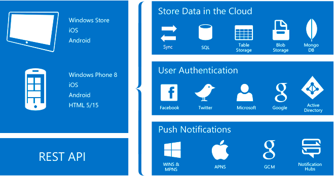

<properties
    pageTitle="Quelles sont les applications Mobile"
    description="Découvrez quels sont les avantages application Service apporte à vos applications mobiles d’entreprise."
    services="app-service\mobile"
    documentationCenter=""
    authors="adrianhall"
    manager="yochayk"
    editor=""/>

<tags
    ms.service="app-service-mobile"
    ms.workload="na"
    ms.tgt_pltfrm="mobile-multiple"
    ms.devlang="na"
    ms.topic="hero-article"
    ms.date="10/01/2016"
    ms.author="adrianha"/>

# Quelles sont les applications Mobile ?

Azure Application Service est une entièrement géré [plateforme en tant que Service](https://azure.microsoft.com/overview/what-is-paas/) (PaaS) pour les développeurs professionnels réunissant un ensemble enrichi de fonctionnalités dans le site web, mobile et de scénarios d’intégration. *Applications Mobile* dans le *Service d’application Azure* offrent une plateforme de développement d’applications mobiles hautement scalable, globalement disponibles pour les développeurs d’entreprise et intégrateurs réunissant un ensemble enrichi de fonctionnalités pour les développeurs mobiles.

##Pourquoi les applications mobiles ?
*Applications Mobile* dans le *Service d’application Azure* propose une plateforme de développement d’applications mobiles hautement scalable, globalement disponibles pour les développeurs d’entreprise et intégrateurs réunissant un ensemble enrichi de fonctionnalités pour les développeurs mobiles. Les applications mobiles, vous pouvez :

- **Créer native et croisée plateforme applications** - si vous créez native iOS, Android et Windows applications ou disponibilité sur plusieurs plateformes Xamarin ou Cordova (Phonegap) applications, vous pouvez tirer parti du Service d’application à l’aide de SDK native.
- **Se connecter à vos systèmes d’entreprise** - avec les applications Mobile ajouter d’entreprise se sur en quelques minutes et vous connecter à votre entreprise en local ou ressources en nuage.
- **Créer des applications en mode hors connexion compatibles avec la synchronisation des données** - Vérifiez vos collaborateurs mobiles productif par les applications de création qui fonctionnent en mode hors connexion et utiliser les logiciels de Mobile aux données de synchronisation en arrière-plan lorsque la connexion est présente avec un de vos sources de données d’entreprise ou SaaS APIs.
- **Les Notifications push des millions de secondes** - engager vos clients avec les notifications push instantanée sur n’importe quel appareil, personnalisée à leurs besoins, envoyés lorsque le temps est correct.

## Fonctionnalités de l’application mobile
Les fonctionnalités suivantes sont importantes au développement mobile activé pour le cloud :

- **Authentification et autorisation** , sélectionnez à partir d’une liste de fournisseurs d’identité, y compris Azure Active Directory pour l’authentification de l’entreprise, ainsi que des fournisseurs de mise en réseau, tels que Facebook et Google, Twitter Account Microsoft croissant.  Azure applications Mobile fournit un service OAuth 2.0 pour chaque fournisseur.  Vous pouvez également intégrer le Kit de développement pour le fournisseur d’identité pour les fonctionnalités spécifiques du fournisseur.

  En savoir plus sur notre [fonctionnalités d’authentification].

- **Accès aux données** - applications Mobile Azure fournit une source de données compatibles avec les mobiles OData v3 liée à SQL Azure ou un serveur SQL local.  Ce service peut être basé sur Framework entité, ce qui vous permet de s’intègrent facilement avec d’autres NoSQL et fournisseurs de données SQL, y compris les fournisseurs de [Stockage de Table Azure], MongoDB, [DocumentDB] et API SaaS tels qu’Office 365 et Salesforce.com.
- **Synchronisation hors connexion** - rendez notre Client SDK facilement vous permettant de créer des applications mobiles robustes et injoignable qui fonctionnent avec des données hors ligne ensemble qui peuvent être automatiquement synchronisées avec les données de serveur principal, avec prise en charge de résolution de conflit.

  En savoir plus sur notre [fonctionnalités de données].

- **Les Notifications push** - notre Client SDK intégrer en toute transparence avec les fonctionnalités d’enregistrement de Azure Notification Hubs, ce qui vous permet d’envoyer les notifications push à des millions d’utilisateurs simultanément.

  En savoir plus sur notre [transmission des fonctionnalités de notification].

- **Kits de développement logiciel client** - nous fournissons un ensemble complet de Client SDK couvrant ([iOS], [Android] et [Windows]), le développement natif développement sur plusieurs plates-formes ([Xamarin pour iOS et Android], [Xamarin formulaires]) et développement d’applications hybride ([Apache Cordova]).  Chaque client SDK est disponible avec une licence MIT et open source.

## Fonctionnalités de Service application Azure.
Les fonctionnalités de plateforme suivantes sont généralement utiles pour les sites de production mobile.

- **Mise à l’échelle** - application Service permet rapidement à distance échelle ou de sortie pour gérer les charge client entrant. Sélectionner le nombre et la taille de machines virtuelles manuellement ou configurer la mise à l’échelle à l’échelle la principale application mobile en fonction de chargement ou de la planification.

  En savoir plus sur la [mise à l’échelle].

- **Les intermédiaires environnements** - application Service peut s’exécuter plusieurs versions de votre site, ce qui vous permet d’effectuer A / B test, tester en production dans le cadre d’un plan DevOps plus grand et effectuez l’archive mis en œuvre d’un nouveau contexte.

  En savoir plus sur les [environnements de construction].

- **Déploiement continu** - application Service peut s’intègrent aux systèmes SCM courantes, ce qui vous permet de déployer automatiquement une nouvelle version de votre serveur principal en appuyant vers une branche de votre système de SCM.

  En savoir plus sur [les options de déploiement].

- **Mise en réseau virtuel** - application Service peut se connecter à des ressources locales à l’aide de connexions réseau, ExpressRoute ou hybride virtuelles.

  Découvrez plus sur [les connexions hybride], [réseaux virtuels]et [ExpressRoute].

- **Isolé / dédié environnements** -application Service peuvent être exécuté dans un environnement entièrement isolé et dédié pour l’exécution en toute sécurité des applications de Service d’application Azure à l’échelle de hauteur.  Il s’agit idéal pour les charges de travail application nécessitant une échelle très haute, isolement ou accès réseau sécurisé.

  En savoir plus sur les [Environnements de Service d’application].

## Prise en main ##
Pour vous familiariser avec les applications Mobile, suivez le didacticiel [Prise en main] .  Il aborde les concepts de base produire un serveur principal mobile et le client de votre choix, puis sur l’intégration de l’authentification, synchronisation hors connexion et les notifications push.  Vous pouvez suivre le didacticiel [Prise en main] plusieurs fois - une seule fois pour chaque application cliente.

Pour plus d’informations sur les applications Mobile Azure, veuillez consulter notre [plan d’apprentissage].
Pour plus d’informations sur la plateforme Azure Application Service, voir [Service d’application Azure].

>[AZURE.NOTE]Si vous voulez commencer à utiliser le Service d’application Azure avant de vous inscrire pour un compte Azure, accédez à [Essayer le Service application](https://tryappservice.azure.com/?appServiceName=mobile), où vous pouvez créer une application web starter courte immédiatement dans le Service d’application. Aucune carte de crédit obligatoire ; Aucune engagements.

<!-- URLs. -->
[Migrate your Mobile Service to App Service]: app-service-mobile-migrating-from-mobile-services.md
[Service application Azure]: ../app-service/app-service-value-prop-what-is.md
[Prise en main]: app-service-mobile-ios-get-started.md
[Stockage de Table Azure]: ../storage/storage-getting-started-guide.md
[DocumentDB]: ../documentdb/documentdb-get-started.md
[fonctionnalités d’authentification]: ./app-service-mobile-auth.md
[fonctionnalités de données]: ./app-service-mobile-offline-data-sync.md
[fonctionnalités de notification push]: ../notification-hubs/notification-hubs-push-notification-overview.md
[iOS]: ./app-service-mobile-ios-how-to-use-client-library.md
[Android]: ./app-service-mobile-android-how-to-use-client-library.md
[Windows]: ./app-service-mobile-dotnet-how-to-use-client-library.md
[Xamarin pour iOS et Android]: ./app-service-mobile-dotnet-how-to-use-client-library.md
[Formulaires Xamarin]: ./app-service-mobile-xamarin-forms-get-started.md
[Apache Cordova]: ./app-service-mobile-cordova-how-to-use-client-library.md
[mise à l’échelle]: ../app-service-web/web-sites-scale.md
[environnements de construction]: ../app-service-web/web-sites-staged-publishing.md
[options de déploiement]: ../app-service-web/web-sites-deploy.md
[connexions hybride]: ../app-service-web/web-sites-hybrid-connection-get-started.md
[réseaux virtuels]: ../app-service-web/web-sites-integrate-with-vnet.md
[ExpressRoute]: ../app-service-web/app-service-app-service-environment-network-configuration-expressroute.md
[Environnements de Service d’application]: ../app-service-web/app-service-app-service-environment-intro.md
[plan d’apprentissage]: https://azure.microsoft.com/en-us/documentation/learning-paths/appservice-mobileapps/
