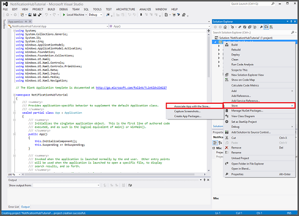

<properties
    pageTitle="Ajouter les notifications push dans votre application de plateforme de Windows universel (UWP) | Applications mobiles Azure"
    description="Découvrez comment utiliser Azure Application Service Mobile applications et Azure Notification Hubs pour envoyer les notifications push dans votre application de plateforme de Windows universel (UWP)."
    services="app-service\mobile,notification-hubs"
    documentationCenter="windows"
    authors="ysxu"
    manager="dwrede"
    editor=""/>

<tags
    ms.service="app-service-mobile"
    ms.workload="mobile"
    ms.tgt_pltfrm="mobile-windows"
    ms.devlang="dotnet"
    ms.topic="article"
    ms.date="10/12/2016"
    ms.author="yuaxu"/>

# Ajouter les notifications push dans votre application Windows

[AZURE.INCLUDE [app-service-mobile-selector-get-started-push](../../includes/app-service-mobile-selector-get-started-push.md)]

##Vue d’ensemble

Dans ce didacticiel, ajoutez les notifications push au [démarrage de Windows rapides](app-service-mobile-windows-store-dotnet-get-started.md) projet afin qu’une notification push est envoyée à l’appareil chaque fois qu’un enregistrement est inséré.

Si vous n’utilisez pas le projet de serveur de démarrage rapide téléchargé, vous devez le package d’extension de notification push. Pour plus d’informations, voir [utiliser avec le Kit de développement pour applications Mobile Azure du serveur principal .NET](app-service-mobile-dotnet-backend-how-to-use-server-sdk.md) .

##Configurer un concentrateur de Notification

[AZURE.INCLUDE [app-service-mobile-configure-notification-hub](../../includes/app-service-mobile-configure-notification-hub.md)]

##Enregistrer votre application pour les notifications push

Vous devez soumettre votre application du Windows Store, puis configurez votre projet serveur pour intégrer avec Windows Notification Services (WNS) pour envoyer push.

1. Dans l’Explorateur de solutions Visual Studio, le projet application UWP avec le bouton droit, cliquez sur **banque** > **Application associer avec le magasin...**. 

    
    
2. Dans l’Assistant, cliquez sur **suivant**, connectez-vous avec votre compte Microsoft, tapez un nom pour votre application en **réserve un nouveau nom de l’application**, puis cliquez sur **réserver**.

3. Une fois l’inscription de l’application est créée, sélectionnez le nouveau nom de l’application et cliquez sur **suivant**, puis cliquez sur **associer**. Cela ajoute les informations d’enregistrement du Windows Store requises au manifeste d’application.  

7. Accédez au [Centre de développement Windows](https://dev.windows.com/en-us/overview), se connecter avec votre compte Microsoft, cliquez sur le nouvel enregistrement de l’application dans **Mes applications**, puis développez **Services** > **notifications de transmission**. 

8. Dans la page **notifications Push** , cliquez sur **le site Services Live** sous **Microsoft Azure Mobile Services**.

9. Dans la page d’inscription, prenez note de la valeur sous **Application secrets** et l' **Identificateur de Package de sécurité**, qui vous utiliserez suivant pour configurer votre serveur principal de l’application mobile. 

    

    > [AZURE.IMPORTANT] Le client secret et le package identificateur de sécurité sont des informations d’identification de sécurité importantes. Vous ne pouvez partager ces valeurs avec tout le monde ou les distribuer avec votre application. L' **Id de l’Application** est utilisé avec le code secret pour configurer l’authentification Account Microsoft.

##Configurer le système principal pour envoyer les notifications push

[AZURE.INCLUDE [app-service-mobile-configure-wns](../../includes/app-service-mobile-configure-wns.md)]

##Mettre à jour le serveur pour envoyer les notifications push

Utilisez la procédure ci-dessous qui correspond à votre type de projet principal&mdash; [.NET serveur principal](#dotnet) ou [serveur principal Node.js](#nodejs).

### Projet principal .NET

1. Dans Visual Studio, avec le bouton droit de la project server et cliquez sur **Gérer les Packages NuGet**, recherchez Microsoft.Azure.NotificationHubs, puis cliquez sur **installer**. Cette procédure installe la bibliothèque de client Hubs de Notification.

2. Développez **contrôleurs**, ouvrez TodoItemController.cs et ajoutez les éléments suivants à l’aide des instructions :

        using System.Collections.Generic;
        using Microsoft.Azure.NotificationHubs;
        using Microsoft.Azure.Mobile.Server.Config;

3. Dans la méthode **PostTodoItem** , ajoutez le code suivant après l’appel à **InsertAsync**:

        // Get the settings for the server project.
        HttpConfiguration config = this.Configuration;
        MobileAppSettingsDictionary settings =
            this.Configuration.GetMobileAppSettingsProvider().GetMobileAppSettings();

        // Get the Notification Hubs credentials for the Mobile App.
        string notificationHubName = settings.NotificationHubName;
        string notificationHubConnection = settings
            .Connections[MobileAppSettingsKeys.NotificationHubConnectionString].ConnectionString;

        // Create the notification hub client.
        NotificationHubClient hub = NotificationHubClient
            .CreateClientFromConnectionString(notificationHubConnection, notificationHubName);

        // Define a WNS payload
        var windowsToastPayload = @"<toast><visual><binding template=""ToastText01""><text id=""1"">"
                                + item.Text + @"</text></binding></visual></toast>";
        try
        {
            // Send the push notification.
            var result = await hub.SendWindowsNativeNotificationAsync(windowsToastPayload);

            // Write the success result to the logs.
            config.Services.GetTraceWriter().Info(result.State.ToString());
        }
        catch (System.Exception ex)
        {
            // Write the failure result to the logs.
            config.Services.GetTraceWriter()
                .Error(ex.Message, null, "Push.SendAsync Error");
        }

    Ce code indique le hub de notification pour envoyer une notification push après qu’un nouvel élément est le point d’insertion.

4. Publier à nouveau le projet serveur.

### Node.js et project

1. Si vous n’avez pas déjà fait, [Télécharger le projet de démarrage rapide](app-service-mobile-node-backend-how-to-use-server-sdk.md#download-quickstart) ou bien utilisez l' [éditeur en ligne dans le portail Azure](app-service-mobile-node-backend-how-to-use-server-sdk.md#online-editor).

2. Remplacez le code existant dans le fichier todoitem.js avec les éléments suivants :

        var azureMobileApps = require('azure-mobile-apps'),
        promises = require('azure-mobile-apps/src/utilities/promises'),
        logger = require('azure-mobile-apps/src/logger');

        var table = azureMobileApps.table();

        table.insert(function (context) {
        // For more information about the Notification Hubs JavaScript SDK,
        // see http://aka.ms/nodejshubs
        logger.info('Running TodoItem.insert');

        // Define the WNS payload that contains the new item Text.
        var payload = "<toast><visual><binding template=\ToastText01\><text id=\"1\">"
                                    + context.item.text + "</text></binding></visual></toast>";

        // Execute the insert.  The insert returns the results as a Promise,
        // Do the push as a post-execute action within the promise flow.
        return context.execute()
            .then(function (results) {
                // Only do the push if configured
                if (context.push) {
                    // Send a WNS native toast notification.
                    context.push.wns.sendToast(null, payload, function (error) {
                        if (error) {
                            logger.error('Error while sending push notification: ', error);
                        } else {
                            logger.info('Push notification sent successfully!');
                        }
                    });
                }
                // Don't forget to return the results from the context.execute()
                return results;
            })
            .catch(function (error) {
                logger.error('Error while running context.execute: ', error);
            });
        });

        module.exports = table;

    Envoie une notification toast WNS qui contient la item.text lorsqu’un nouvel élément todo est inséré.

2. Lorsque vous modifiez le fichier sur votre ordinateur local, publier à nouveau le projet serveur.

##Ajouter les notifications push dans votre application

Ensuite, votre application doit enregistrer les notifications push au démarrage. Lorsque vous avez déjà activé l’authentification, assurez-vous que le signes de l’utilisateur avant d’essayer d’enregistrer les notifications push.

1. Ouvrez le fichier de projet **App.xaml.cs** et ajoutez le code suivant `using` instructions :

        using System.Threading.Tasks;
        using Windows.Networking.PushNotifications;

2. Dans le même fichier, ajoutez la définition de méthode **InitNotificationsAsync** suivante à la classe **d’application** :

        private async Task InitNotificationsAsync()
        {
            // Get a channel URI from WNS.
            var channel = await PushNotificationChannelManager
                .CreatePushNotificationChannelForApplicationAsync();

            // Register the channel URI with Notification Hubs.
            await App.MobileService.GetPush().RegisterAsync(channel.Uri);
        }

    Ce code récupère le ChannelURI pour l’application à partir de WNS, puis enregistre ce ChannelURI avec votre application application Service Mobile.

3. Dans la partie supérieure du Gestionnaire d’événements **OnLaunched** dans **App.xaml.cs**, ajoutez la touche de modification **asynchrone** pour la définition de méthode et l’appel suivant à la nouvelle méthode **InitNotificationsAsync** , comme dans l’exemple suivant :

        protected async override void OnLaunched(LaunchActivatedEventArgs e)
        {
            await InitNotificationsAsync();

            // ...
        }

    Cela garantit que le ChannelURI courte est enregistré chaque fois que l’application est lancée.

4. Reconstruire votre projet application UWP. Votre application est désormais prête à recevoir des notifications toast.

##Notifications de transmission de test dans votre application

[AZURE.INCLUDE [app-service-mobile-windows-universal-test-push](../../includes/app-service-mobile-windows-universal-test-push.md)]

##Étapes suivantes

En savoir plus sur les notifications push :

* [Comment utiliser le client géré pour applications Mobile Azure](app-service-mobile-dotnet-how-to-use-client-library.md#how-to-register-push-templates-to-send-cross-platform-notifications)  
Modèles permettent de vous envoyer des campagnes de disponibilité sur plusieurs plateformes et pousse localisés. Découvrez comment enregistrer des modèles.

* [Diagnostiquer les problèmes de notification push](../notification-hubs/notification-hubs-push-notification-fixer.md)  
Il existe différentes raisons pourquoi les notifications peuvent être perdues ou ne finissent pas sur les appareils. Cette rubrique vous montre comment analyser et identifier la cause des échecs de notification push. 

Vous pouvez passer à un des didacticiels suivants :

+ [Ajouter une authentification dans votre application](app-service-mobile-windows-store-dotnet-get-started-users.md)  
  Découvrez comment authentifier les utilisateurs de votre application avec un fournisseur d’identité.

+ [Activer la synchronisation hors connexion pour votre application](app-service-mobile-windows-store-dotnet-get-started-offline-data.md)  
  Découvrez comment ajouter une prise en charge en mode hors connexion votre application à l’aide d’un serveur principal application Mobile. Synchronisation hors connexion permet aux utilisateurs finaux d’interagir avec une application mobile&mdash;l’affichage, l’ajout ou modification de données&mdash;même lorsqu’il n’y a aucune connexion réseau.

<!-- Anchors. -->

<!-- URLs. -->
[Azure Portal]: https://portal.azure.com/

<!-- Images. -->

