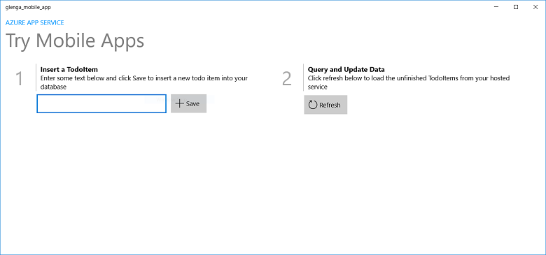

<properties
    pageTitle="Créer une plateforme de Windows universel (UWP) qui utilise dans des applications mobiles | Microsoft Azure"
    description="Suivez ce didacticiel pour l’utilisation de l’application mobile Azure les serveurs principaux pour le développement d’application universel Windows plateforme (UWP) dans c#, Visual Basic ou JavaScript."
    services="app-service\mobile"
    documentationCenter="windows"
    authors="adrianhall"
    manager="erikre"
    editor=""/>

<tags
    ms.service="app-service-mobile"
    ms.workload="mobile"
    ms.tgt_pltfrm="mobile-windows"
    ms.devlang="dotnet"
    ms.topic="hero-article"
    ms.date="10/01/2016"
    ms.author="adrianha"/>

#Créer une application Windows

[AZURE.INCLUDE [app-service-mobile-selector-get-started](../../includes/app-service-mobile-selector-get-started.md)]

##Vue d’ensemble

Ce didacticiel montre comment ajouter un service de nuage principal à une application universel Windows plateforme (UWP). Pour plus d’informations, voir [Quels sont les applications Mobile](app-service-mobile-value-prop.md). Captures d’écran de l’application finale sont les suivantes :

   
En cours d’exécution sur un ordinateur de bureau. 

  
En cours d’exécution sur un téléphone

Fin de ce didacticiel est requis pour tous les autres didacticiels application Mobile pour les applications UWP. 

##Conditions préalables

Pour effectuer ce didacticiel, vous devez les éléments suivants :

* Un compte Azure actif. Si vous n’avez pas un compte, vous pouvez vous inscrire une version d’évaluation Azure et obtenir jusqu'à 10 applications mobiles gratuites que vous pouvez continuer à utiliser même après la fin de votre version d’évaluation. Pour plus d’informations, voir [Azure la version d’évaluation gratuite](https://azure.microsoft.com/pricing/free-trial/).

* [Visual Studio Communauté 2015] ou une version ultérieure.

>[AZURE.NOTE] Si vous voulez commencer avec le Service d’application Azure avant de vous inscrivez à un compte Azure, accédez à [Essayer le Service application](https://tryappservice.azure.com/?appServiceName=mobile). Vous pouvez créer une application mobile starter courte immédiatement dans le Service d’application : aucune carte de crédit obligatoire et aucun engagements.

##Créer un nouveau contexte de l’application Mobile Azure

Suivez ces étapes pour créer un nouveau contexte de l’application Mobile.

[AZURE.INCLUDE [app-service-mobile-dotnet-backend-create-new-service](../../includes/app-service-mobile-dotnet-backend-create-new-service.md)]

Vous avez maintenant sa mise en service un serveur principal application Mobile Azure qui peut être utilisée par vos applications de client mobile. Ensuite, vous allez télécharger un projet de serveur pour une simple « liste todo » principal et publiez-le sur Azure.

## Configurer le projet de serveur

[AZURE.INCLUDE [app-service-mobile-configure-new-backend.md](../../includes/app-service-mobile-configure-new-backend.md)]

##Téléchargez et exécutez le projet client

Une fois que vous avez configuré la principale application Mobile, vous pouvez créer une nouvelle application client ou modifier une application existante pour vous connecter à Azure. Dans cette section, vous téléchargez un projet de modèle d’application UWP qui est utilisé pour vous connecter à votre serveur principal application Mobile.

1. Dans la carte de **démarrage rapide** pour la principale application Mobile, cliquez sur **créer une nouvelle application** > **Télécharger**, puis extraire le projet compressé des fichiers sur votre ordinateur local.

    

3. (Facultatif) Ajouter le projet application UWP à la même solution que le projet serveur. Cela facilite déboguer et tester l’application et le serveur principal dans la même solution Visual Studio, si vous choisissez de le faire. Pour ajouter un projet d’application UWP à la solution, vous devez utiliser Visual Studio 2015 ou une version ultérieure.

4. Avec l’application UWP comme projet de démarrage, appuyez sur la touche F5 pour le déploiement et l’exécution de l’application.

5. Dans l’application, tapez du texte significatif, tel que *Terminer le didacticiel*, dans la zone de texte **Insérer un TodoItem** , puis cliquez sur **Enregistrer**.

    

    Cela envoie une demande de publication pour le nouveau système principal de l’application mobile est hébergé dans Azure.

6. (Facultatif) Arrêter l’application et redémarrer sur un autre appareil ou un émulateur mobile.

    

    Notez que les données enregistrées à partir de l’étape précédente sont chargées à partir d’Azure après le démarrage de l’application UWP. 

##Étapes suivantes

* [Ajouter une authentification dans votre application](app-service-mobile-windows-store-dotnet-get-started-users.md)  
  Découvrez comment authentifier les utilisateurs de votre application avec un fournisseur d’identité.

* [Ajouter les notifications push dans votre application](app-service-mobile-windows-store-dotnet-get-started-push.md)  
  Découvrez comment ajouter push notifications prennent en charge dans votre application et configurer la principale application Mobile pour Azure Notification Hubs permet d’envoyer les notifications push.

* [Activer la synchronisation hors connexion pour votre application](app-service-mobile-windows-store-dotnet-get-started-offline-data.md)  
  Découvrez comment ajouter une prise en charge en mode hors connexion votre application à l’aide d’un serveur principal application Mobile. Synchronisation hors connexion permet aux utilisateurs finaux d’interagir avec une application mobile&mdash;l’affichage, l’ajout ou modification de données&mdash;même lorsqu’il n’y a aucune connexion réseau.

<!-- Anchors. -->
<!-- Images. -->
<!-- URLs. -->
[Mobile App SDK]: http://go.microsoft.com/fwlink/?LinkId=257545
[Azure portal]: https://portal.azure.com/
[Communauté Visual Studio 2015]: https://go.microsoft.com/fwLink/p/?LinkID=534203
