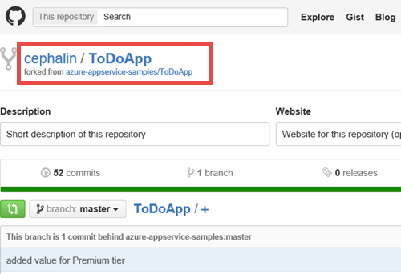
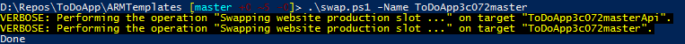
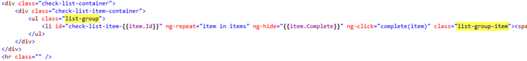

<properties
    pageTitle="Développement Agile avec le Service d’application Azure"
    description="Apprenez à créer des applications complexes de grande échelle avec Azure Application Service d’une manière qui prend en charge le développement de logiciels agile."
    services="app-service"
    documentationCenter=""
    authors="cephalin"
    manager="wpickett"
    editor=""/>

<tags
    ms.service="app-service"
    ms.workload="na"
    ms.tgt_pltfrm="na"
    ms.devlang="na"
    ms.topic="article"
    ms.date="07/01/2016"
    ms.author="cephalin"/>

# Développement Agile avec le Service d’application Azure #

Dans ce didacticiel, vous allez apprendre à créer des applications complexes de grande échelle avec [Azure Application Service](/services/app-service/) d’une manière qui prend en charge le [développement de logiciels agile](https://en.wikipedia.org/wiki/Agile_software_development). Il suppose que vous savez déjà comment [déployer des applications complexes mis dans Azure](app-service-deploy-complex-application-predictably.md).

Limitations des processus techniques peuvent être souvent gêne en œuvre de la méthodologie agile. Azure Application Service avec des fonctionnalités telles que [la publication continue](app-service-continuous-deployment.md), [mise en environnements](web-sites-staged-publishing.md) (emplacements) et la [surveillance](web-sites-monitor.md), lorsqu’il est associé de manière judicieuse avec l’orchestration et la gestion du déploiement dans le [Gestionnaire de ressources Azure](../azure-resource-manager/resource-group-overview.md), peuvent faire partie de la solution idéale pour les développeurs qui adopter développement agile.

Le tableau suivant est une courte liste des exigences associé développement agile, et comment Azure services permet d’eux.

| Configuration requise | Comment permet d’Azure |
|---------------------------------------------------------------|--------------------------------------------------------------------------------------------------------------------------------------------------------------------------------------------------------------------------|
| -Concevoir avec chaque validation -Générer automatiquement et rapidement | Lorsqu’il est configuré avec un déploiement continu, Azure Application Service peut fonctionner comme versions préliminaires d’exécution live basés sur une branche de développement. Chaque fois que code est basculé vers la branche, il est automatiquement générées et en cours d’exécution live dans Azure.|
| -Assurez-vous crée test automatique | Charger des tests, les tests de site web, etc., peuvent être déployés avec le modèle Azure le Gestionnaire de ressources.|
| -Effectuer des tests dans un cloner d’un environnement de production | Azure Gestionnaire de ressources modèles peut être utilisé pour créer l’environnement de production Azure (y compris les paramètres de l’application, de modèles de chaîne de connexion, de mise à l’échelle, etc.) pour tester rapidement et mis identiques.|
| -Afficher facilement des résultats de la version la plus récente | Déploiement continue à Azure à partir d’un référentiel signifie que vous pouvez tester nouveau code dans une application active immédiatement après avoir validé vos modifications. |
| -Valider dans la branche principale quotidiennement -Automatiser le déploiement | Intégration continue d’une application de production avec une branche principale d’un référentiel déploie automatiquement chaque valider/fusionner dans la branche principale en production. |

[AZURE.INCLUDE [app-service-web-to-api-and-mobile](../../includes/app-service-web-to-api-and-mobile.md)]

## Ce que vous ferez ##

Vous guidera dans un flux de travail test développement-production phases classique afin de publier les modifications de nouveau sur l’exemple d’application [ToDoApp](https://github.com/azure-appservice-samples/ToDoApp) , qui se compose de deux [applications web](/services/app-service/web/), un correspondant à un site Web frontal (FE), l’autre est un serveur principal API Web (BE) et une [base de données SQL](/services/sql-database/). Vous fonctionnera avec l’architecture de déploiement illustré ci-dessous :

Pour placer l’image en mots :

-   L’architecture de déploiement est divisée en trois distinct environnements (ou [groupes de ressources](../azure-resource-manager/resource-group-overview.md) dans Azure), chacune avec sa propre [plan de services d’application](../app-service/azure-web-sites-web-hosting-plans-in-depth-overview.md), les paramètres de [mise à l’échelle](web-sites-scale.md) et base de données SQL. 
-   Chaque environnement pouvant être gérée séparément. Ils peuvent exister même dans différents abonnements.
-   Intermédiaire et production sont implémentées comme deux emplacements de l’application de Service d’application même. La branche maître est configuré pour l’intégration continue avec l’emplacement de mise en attente.
-   Lors de la validation branche maître vérifiée sur l’emplacement intermédiaire (avec des données de production), l’application intermédiaire vérifiée est échangée dans la production emplacement [sans interruption de service](web-sites-staged-publishing.md).

L’environnement de production et de mise en attente défini par le modèle en [ * &lt;repository_root >*/ARMTemplates/ProdandStage.json](https://github.com/azure-appservice-samples/ToDoApp/blob/master/ARMTemplates/ProdAndStage.json).

Les environnements de développement et de test sont définies par le modèle en [ * &lt;repository_root >*/ARMTemplates/Dev.json](https://github.com/azure-appservice-samples/ToDoApp/blob/master/ARMTemplates/Dev.json).

Vous allez également utiliser la stratégie de branchement classique, avec un code de déplacement de la branche de développement jusqu'à la branche de test, puis dans la branche maître (déplacement vers le haut dans la qualité, pour ainsi dire).

 

## Composants nécessaires ##

-   Un compte Azure
-   Un compte [GitHub](https://github.com/)
-   GIT Shell (installé avec [GitHub pour Windows](https://windows.github.com/)) - Cela vous permet d’exécuter des commandes à la fois le Git et PowerShell dans la même session 
-   Dernière [Azure PowerShell](https://github.com/Azure/azure-powershell/releases/download/0.9.4-June2015/azure-powershell.0.9.4.msi) bits
-   Fonctionnement de base des opérations suivantes :
    -   Déploiement de modèle [Azure le Gestionnaire de ressources](../azure-resource-manager/resource-group-overview.md) (également voir [déployer une application complexe mis dans Azure](app-service-deploy-complex-application-predictably.md))
    -   [GIT](http://git-scm.com/documentation)
    -   [PowerShell](https://technet.microsoft.com/library/bb978526.aspx)

> [AZURE.NOTE] Vous avez besoin d’un compte Azure pour effectuer ce didacticiel :
> + Vous pouvez [Ouvrir un compte Azure gratuitement](/pricing/free-trial/) - vous obtenez crédits vous pouvez utiliser pour essayer de services Azure payants et même après leur utilisation vous pouvez conserver le compte et libérer de l’utilisation des services Azure, tels que des applications Web.
> + Vous pouvez [Activer les avantages d’abonné Visual Studio](/pricing/member-offers/msdn-benefits-details/) : Visual Studio votre abonnement fournit les crédits chaque mois que vous pouvez utiliser pour les services Azure payants.
>
> Si vous voulez commencer à utiliser le Service d’application Azure avant de vous inscrire pour un compte Azure, accédez à [Essayer le Service application](http://go.microsoft.com/fwlink/?LinkId=523751), où vous pouvez créer une application web starter courte immédiatement dans le Service d’application. Aucune carte de crédit obligatoire ; Aucune engagements.

## Configurer votre environnement de production ##

>[AZURE.NOTE] Le script utilisé dans ce didacticiel pour configurer automatiquement publication continue à partir de votre référentiel GitHub. Cette fonctionnalité nécessite que vos informations d’identification GitHub sont déjà stockées dans Azure, sinon les scripts de déploiement échouera lorsque vous tentez de configurer les paramètres de contrôle de source pour les applications web. 
>
>Pour stocker vos informations d’identification GitHub dans Azure, créez une application web dans le [Portail Azure](https://portal.azure.com/) et [configurer le déploiement GitHub](app-service-continuous-deployment.md). Vous devez uniquement effectuer cette action une seule fois. 

Dans un scénario DevOps classique, vous disposez d’une application qui s’exécute live dans Azure et que vous souhaitez apporter des modifications à la publication continue. Dans ce scénario, vous avez un modèle qui vous développé, testez et utilisé pour déployer l’environnement de production. Vous sera configurez-la dans cette section.

1.  Créer votre propre branche du référentiel [ToDoApp](https://github.com/azure-appservice-samples/ToDoApp) . Pour plus d’informations sur la création de votre branche, voir [branche un mis en pension](https://help.github.com/articles/fork-a-repo/). Une fois votre branche est créé, vous pouvez le voir dans votre navigateur.
 
    

2.  Ouvrez une session Git Shell. Si vous n’avez pas encore Git Shell, installez maintenant [GitHub pour Windows](https://windows.github.com/) .

3.  Créer une copie locale des votre branche en exécutant la commande suivante :

        git clone https://github.com/<your_fork>/ToDoApp.git 

4.  Une fois que votre cloner local, accédez à * &lt;repository_root >*\ARMTemplates et exécuter la deploy.ps1 script comme suit :

        .\deploy.ps1 –RepoUrl https://github.com/<your_fork>/todoapp.git

4.  Lorsque vous y êtes invité, tapez le nom d’utilisateur souhaité et le mot de passe pour l’accès de base de données.

    Vous devriez voir la progression des différentes ressources Azure mise en service. Lorsque le déploiement est terminé, le script pour lancer l’application dans le navigateur et vous offre un signal sonore convivial.

    
 
    >[AZURE.TIP] Prenez connaissance des * &lt;repository_root >*\ARMTemplates\Deploy.ps1, pour voir comment elle génère des ressources avec des ID uniques. Vous pouvez utiliser la même approche pour créer le même déploiement identiques sans vous préoccuper des noms des ressources en conflit.
 
6.  Revenez dans votre session Git Shell, exécutez :

        .\swap –Name ToDoApp<unique_string>master

    

7.  Une fois le script terminé, revenez à accéder à adresse de frontend (http://ToDoApp*&lt;unique_string >*master.azurewebsites.net/) pour afficher l’application en cours d’exécution en production.
 
5.  Connectez-vous au [Portail Azure](https://portal.azure.com/) et prenez connaissance des quel est créé.

    Vous devez être en mesure de voir les deux applications web dans le même groupe de ressources, l’autre avec les `Api` suffixe dans le nom. Si vous examinez l’affichage de groupe de ressources, vous verrez également la base de données SQL et serveur, le plan de services d’application et les emplacements de mise en attente pour les applications web. Naviguer parmi les différentes ressources et comparez-les avec * &lt;repository_root >*\ARMTemplates\ProdAndStage.json pour voir comment ils sont configurés dans le modèle.

    

Vous avez maintenant configurer l’environnement de production. Ensuite, vous sera démarrer une nouvelle mise à jour à l’application.

## Créer de développement et tester branches ##

Maintenant que vous avez une application complexe fonctionne en production dans Azure, vous effectuerez une mise à jour à votre application conformément aux méthodologie agile. Dans cette section, vous créerez le développement et tester branches dont vous aurez besoin pour effectuer les mises à jour requises.

1.  Tout d’abord créer l’environnement de test. Dans votre session Git Shell, exécutez les commandes suivantes pour créer l’environnement pour une nouvelle branche appelée **NewUpdate**. 

        git checkout -b NewUpdate
        git push origin NewUpdate 
        .\deploy.ps1 -TemplateFile .\Dev.json -RepoUrl https://github.com/<your_fork>/ToDoApp.git -Branch NewUpdate

1.  Lorsque vous y êtes invité, tapez le nom d’utilisateur souhaité et le mot de passe pour l’accès de base de données. 

    Lorsque le déploiement est terminé, le script pour lancer l’application dans le navigateur et vous offre un signal sonore convivial. Et comme cela, vous avez à présent une nouvelle branche avec sa propre environnement de test. Prenez le temps de passer en revue quelques points sur cet environnement de test :

    -   Vous pouvez créer dans n’importe quel abonnement Azure. Que signifie que l’environnement de production pouvant être gérée séparément de votre environnement de test.
    -   Votre environnement de test est en cours d’exécution live dans Azure.
    -   Votre environnement de test est identique à l’environnement de production, sauf pour les emplacements de mise en attente et les paramètres de mise à l’échelle. Vous pouvez le savoir, car il s’agit des seules les différences entre ProdandStage.json et Dev.json.
    -   Vous pouvez gérer votre environnement de test dans sa propre plan de services d’application, avec un niveau de prix différent (par exemple, **Free**).
    -   Suppression de cet environnement de test sera suffit de supprimer le groupe de ressources. Vous allez découvrir comment effectuer cette [ultérieurement](#delete).

2.  Passez à créer une branche de développement en exécutant les commandes suivantes :

        git checkout -b Dev
        git push origin Dev
        .\deploy.ps1 -TemplateFile .\Dev.json -RepoUrl https://github.com/<your_fork>/ToDoApp.git -Branch Dev

3.  Lorsque vous y êtes invité, tapez le nom d’utilisateur souhaité et le mot de passe pour l’accès de base de données. 

    Prenez le temps de passer en revue quelques points sur cet environnement de développement : 

    -   Votre environnement de développement possède une configuration identique à l’environnement de test, car il est déployé à l’aide du même modèle.
    -   Chaque environnement de développement peut être créé dans l’abonnement Azure du développeur, quitter l’environnement de test pour être gérées séparément.
    -   Votre environnement de développement s’exécute live dans Azure.
    -   Suppression de l’environnement de développement est aussi simple que la suppression du groupe de ressources. Vous allez découvrir comment effectuer cette [ultérieurement](#delete).

>[AZURE.NOTE] Lorsque vous avez plusieurs développeurs travaillent sur la nouvelle mise à jour, chacun d’eux pouvez facilement créer un environnement de développement dédié et branche en procédant comme suit :
>
>1. Créer leur propres branche du référentiel dans GitHub (voir [branche un mis en pension](https://help.github.com/articles/fork-a-repo/)).
>2. Cloner la branche sur leur ordinateur local
>3. Exécutez les commandes mêmes pour créer leurs propres branche de développement et l’environnement.

Lorsque vous avez terminé, votre branche GitHub doit avoir trois branches :

Et vous devez disposer des applications web six (trois séries de deux) dans trois groupes de ressources distincts :

 
>[AZURE.NOTE] Notez que ProdandStage.json Spécifie l’environnement de production pour utiliser le **Standard** tarifs niveau approprié à l’extensibilité de l’application de production.

## Créer et tester chaque valider ##

Les fichiers de modèle ProdAndStage.json et Dev.json spécifient déjà les paramètres de contrôle source, qui par défaut configure continu de publication pour l’application web. Par conséquent, chaque valider vers la branche GitHub déclenche un déploiement automatique vers Azure de cette branche. Voyons comment votre configuration fonctionne maintenant.

1.  Assurez-vous que vous êtes dans la branche de développement du référentiel local. Pour ce faire, exécutez la commande suivante dans Git Shell :

        git checkout Dev

2.  Apportez une modification simple au calque de l’interface utilisateur de l’application en modifiant le code pour utiliser les listes de [démarrage](http://getbootstrap.com/components/) . Ouvrir * &lt;repository_root >*\src\MultiChannelToDo.Web\index.cshtml et apportez la modification en surbrillance ci-dessous :

    

    >[AZURE.NOTE] Si vous ne pouvez pas lire l’image ci-dessus : 
    >
    >- Dans la ligne 18, modifiez `check-list` à `list-group`.
    >- Dans la ligne 19, modifiez `class="check-list-item"` à `class="list-group-item"`.

3.  Enregistrer les modifications. Revenez dans Git Shell, exécutez les commandes suivantes :

        cd <repository_root>
        git add .
        git commit -m "changed to bootstrap style"
        git push origin Dev
 
    Ces commandes git sont similaires aux « archivage de votre code » dans un autre système de contrôle de source comme TFS. Lorsque vous exécutez `git push`, la nouvelle validation déclenche un push code automatique à Azure, qui reconstruit ensuite l’application pour refléter la modification dans l’environnement de développement.

4.  Pour vérifier que cette push code à votre environnement de développement s’est produite, accédez à la carte de l’application web de votre environnement de développement et examinez la partie du **déploiement** . Vous devez être en mesure de voir votre message de validation dernière il.

    

5.  À partir de là, cliquez sur **Parcourir** pour afficher la nouvelle modification dans l’application live dans Azure.

    

    Il s’agit d’une modification assez secondaire à l’application. Toutefois, la plupart des heures nouvelle modification à une application web complexe a effets secondaires inattendus et indésirables. Pouvoir facilement tester chaque valider dans les versions live vous permet d’intercepter ces problèmes avant de les voir vos clients.

À présent, vous devez être à l’aise avec la réalisation que, en tant que développeur sur le projet **NewUpdate** , vous pourrez facilement créer un environnement de développement pour vous-même, puis créer chaque valider et tester chaque version.

## Fusionner code dans un environnement de test ##

Lorsque vous êtes prêt à distribuer votre code à partir de développement branche devenir branche NewUpdate, c’est le processus git standard :

1.  Fusionner les nouvelles validations au NewUpdate dans la branche de développement dans GitHub, tels que des validations créées par d’autres développeurs. Tout nouveau valider sur GitHub sera déclencher la lecture d’une diffusion de code et générer dans l’environnement de développement. Vous pouvez puis vérifiez que votre code de développement branche continue de fonctionner avec les dernières bits à partir de branche NewUpdate.

2.  Fusionner tous les votre validations nouveau à partir de développement branche dans branche NewUpdate sur GitHub. Cette action déclenche un push de code et les créer dans l’environnement de test. 

Notez également que déploiement continue étant déjà le programme d’installation avec ces branches git, vous n’avez pas besoin aucune action autre qu’exécutant l’intégration crée. Vous devez simplement effectuer pratiques de contrôle de source standard à l’aide de git, et Azure exécutera tous les processus de génération pour vous.

À présent, nous allons transmission votre code à branche **NewUpdate** . Git Shell, exécutez les commandes suivantes :

    git checkout NewUpdate
    git pull origin NewUpdate
    git merge Dev
    git push origin NewUpdate

Voilà ! 

Accédez à la carte de l’application web pour votre environnement de test afficher votre nouveau valider (fusionné dans la branche NewUpdate), maintenant poussée vers l’environnement de test. Ensuite, cliquez sur **Parcourir** pour voir que la modification du style est en cours d’exécution live dans Azure.

## Déployer mise à jour en production ##

Distribution code vers l’environnement de test et de production n’êtes pas différente de celle que vous avez déjà terminé lorsque vous poussé code à l’environnement de test. Il est très simple. 

Git Shell, exécutez les commandes suivantes :

    git checkout master
    git pull origin master
    git merge NewUpdate
    git push origin master

N’oubliez pas que selon la manière dont l’environnement intermédiaire et de production n’est configuré dans ProdandStage.json, votre nouveau code est basculé vers l’emplacement de **mise en attente** et s’il exécute. Afin que si vous accédez à l’URL de l’emplacement intermédiaire, vous verrez le nouveau code en cours d’exécution il. Pour ce faire, exécutez la `Show-AzureWebsite` applet de commande dans Git Shell.

    Show-AzureWebsite -Name ToDoApp<unique_string>master -Slot Staging
 
Et que vous avez vérifié la mise à jour dans l’emplacement intermédiaire, la seule chose qui reste à faire est désormais disponible pour le remplacement en production. Git Shell, exécutez simplement les commandes suivantes :

    cd <repository_root>\ARMTemplates
    .\swap.ps1 -Name ToDoApp<unique_string>master

Félicitations ! Vous avez publié une nouvelle mise à jour à votre application web de production. Que se passe-t-il plus est que vous venez de faire il en créant facilement développement et testez les environnements et créer et tester chaque valider. Il s’agit des blocs de construction essentiels pour le développement de logiciels agile.

## Supprimer le développement et test des environnements ##

Étant donné que vous avez intentionnellement conçu votre environnements de développement et de test pour servir de groupes de ressources autonome, il est très facile pour les supprimer. Pour supprimer ceux que vous avez créé dans ce didacticiel, les branches GitHub et les objets Azure, exécutez simplement les commandes suivantes dans Git Shell :

    git branch -d Dev
    git push origin :Dev
    git branch -d NewUpdate
    git push origin :NewUpdate
    Remove-AzureRmResourceGroup -Name ToDoApp<unique_string>dev-group -Force -Verbose
    Remove-AzureRmResourceGroup -Name ToDoApp<unique_string>newupdate-group -Force -Verbose

## Résumé ##

Développement Agile est indispensable pour de nombreuses sociétés qui souhaitent adopter Azure en tant que leur plate-forme d’application. Dans ce didacticiel, vous avez appris à créer et de supprimer vers le bas réplique exacte ou à côté de copies de l’environnement de production en toute simplicité même pour les applications complexes. Vous avez également appris comment tirer parti de cette possibilité de créer un processus de développement qui peut créer et tester chaque valider unique dans Azure. Ce didacticiel a montré espérons-le, comment vous pouvez mieux utiliser Azure Application Service et le Gestionnaire de ressources Azure ensemble pour créer une solution DevOps qui convient à la méthodologie agile. Ensuite, vous pouvez créer dans ce scénario en effectuant des techniques DevOps avancées telles que [le test en production](app-service-web-test-in-production-get-start.md). Dans un scénario de test de production courant, voir [déploiement Flighting (test bêta) dans le Service d’application Azure](app-service-web-test-in-production-controlled-test-flight.md).

## Ressources complémentaires ##

-   [Déployer une application complexe mis dans Azure](app-service-deploy-complex-application-predictably.md)
-   [Développement Agile en pratique : conseils et astuces pour le Cycle de développement modernes](http://channel9.msdn.com/Events/Ignite/2015/BRK3707)
-   [Stratégies de déploiement avancées pour les applications Web Azure à l’aide de modèles de gestionnaire de ressources](http://channel9.msdn.com/Events/Build/2015/2-620)
-   [Création de modèles Gestionnaire de ressources Azure](../resource-group-authoring-templates.md)
-   [JSONLint - la validation JSON](http://jsonlint.com/)
-   [ARMClient – configurer la publication GitHub au site](https://github.com/projectKudu/ARMClient/wiki/Setup-GitHub-publishing-to-Site)
-   [GIT branchement – base branchement et la fusion](http://www.git-scm.com/book/en/v2/Git-Branching-Basic-Branching-and-Merging)
-   [Blog de David Ebbo](http://blog.davidebbo.com/)
-   [PowerShell Azure](../powershell-install-configure.md)
-   [Outils de ligne de commande disponibilité sur plusieurs plateformes Azure](../xplat-cli-install.md)
-   [Créer ou modifier des utilisateurs dans Azure Active Directory](https://msdn.microsoft.com/library/azure/hh967632.aspx#BKMK_1)
-   [Projet Kudu Wiki](https://github.com/projectkudu/kudu/wiki)
