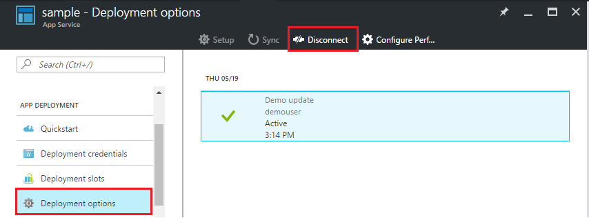

<properties
    pageTitle="Déploiement continue à Azure Application Service | Microsoft Azure"
    description="Apprenez à activer le déploiement continue à Azure Application Service."
    services="app-service"
    documentationCenter=""
    authors="dariagrigoriu"
    manager="wpickett"
    editor="mollybos"/>

<tags
    ms.service="app-service"
    ms.workload="na"
    ms.tgt_pltfrm="na"
    ms.devlang="na"
    ms.topic="article"
    ms.date="10/28/2016"
    ms.author="dariagrigoriu"/>
    
# Déploiement continue à Azure Application Service

Ce didacticiel montre comment configurer un flux de travail de déploiement continue de votre application de [Service d’application Azure] . Intégration du Service d’application avec BitBucket, GitHub et Visual Studio Team Services (VSTS) permet à un flux de travail de déploiement continue où Azure extrait dans les mises à jour la plus récentes à partir de votre projet publié à un de ces services. Déploiement continue est une option intéressante pour les projets dans laquelle plusieurs et intégrés de dons fréquents.

## Activer le déploiement en continu

Pour activer le déploiement continue, 

1. Publier le contenu de votre application dans le référentiel qui sera utilisé pour le déploiement continue.  
    Pour plus d’informations sur la publication de votre projet dans ces services, voir [créer un mis en pension (GitHub)], [créer une mis en pension (BitBucket)]et [prise en main VSTS].

2. Dans la carte de menu de votre application dans le [portail Azure], cliquez sur **le déploiement des applications > options de déploiement**. Cliquez sur **Choisir une Source**, puis sélectionnez la source du déploiement.  

    
    
    > [AZURE.NOTE] Pour configurer un VSTS compte pour le déploiement de Service d’application, consultez ce [didacticiel](https://github.com/projectkudu/kudu/wiki/Setting-up-a-VSTS-account-so-it-can-deploy-to-a-Web-App).
    
3. Terminer le flux de travail d’autorisation. 

4. Dans la carte de la **source du déploiement** , choisissez le projet et branche déployer à partir de. Lorsque vous avez terminé, cliquez sur **OK**.
  
    

    > [AZURE.NOTE] Lorsque vous activez déploiement continue avec GitHub ou BitBucket, projets publiques et privées seront affiche.

    Service d’application crée une association avec le référentiel sélectionné, extrait dans les fichiers à partir de la branche spécifiée et conserve un cloner du référentiel de votre application de Service d’application. Lorsque vous configurez le déploiement continu VSTS à partir du portail Azure, l’intégration utilise le Service d’application [moteur de déploiement Kudu](https://github.com/projectkudu/kudu/wiki), permettant d’automatiser déjà tâches génération et de déploiement avec chaque `git push`. Vous n’avez pas besoin de configurer séparément déploiement continue dans VSTS. Une fois ce processus terminé, la carte de l’application **des options de déploiement** indiqueront un déploiement actif qui indique le déploiement a réussi.

5. Pour vérifier que l’application est déployée avec succès, cliquez sur l' **URL** dans la partie supérieure de cuillère de l’application dans le portail Azure. 

6. Pour vérifier que le déploiement continue se produit à partir du référentiel de votre choix, appuyez sur une modification dans le référentiel. Votre application doit mettre à jour pour refléter les modifications peu de temps après que la diffusion vers le référentiel est terminée. Vous pouvez vérifier qu’il a extrait dans la mise à jour dans la carte de **options de déploiement** de votre application.

## Déploiement continu d’une solution Visual Studio 

Pousser une solution Visual Studio Azure application service est aussi simple appuyer sur un fichier index.html simple. Le processus de déploiement de l’application Service rationalise tous les détails, y compris la restauration des dépendances NuGet et la création des binaires d’application. Vous pouvez suivre les source contrôle les meilleures pratiques de gestion du code uniquement dans votre référentiel Git et laisser déploiement du Service d’application à prendre en charge le reste.

Les étapes pour pousser votre solution Visual Studio au Service d’application sont les mêmes que dans la [section précédente](#overview), autant que vous configurez votre solution et référentiel comme suit :

-   Utilisez l’option de contrôle de source Visual Studio pour générer un `.gitignore` fichier telles que l’image ci-dessous ou manuellement ajouter un `.gitignore` fichier dans votre racine du référentiel avec du contenu similaire à cet [exemple .gitignore](https://github.com/github/gitignore/blob/master/VisualStudio.gitignore). 

    
 
-   Ajoutez arborescence de la solution complète pour votre référentiel, avec le fichier .sln à la racine du référentiel.

Une fois que vous avez configuré votre référentiel comme décrit et configuré votre application dans Azure pour la publication continue parmi les référentiels Git en ligne, vous pouvez développer votre application ASP.NET localement dans Visual Studio et déployer en continu votre code simplement en appuyant vos modifications dans votre référentiel Git en ligne.

## Désactiver le déploiement en continu

Pour désactiver le déploiement continue, 

1. Dans la carte de menu de votre application dans le [portail Azure], cliquez sur **le déploiement des applications > options de déploiement**. Cliquez ensuite sur **se déconnecter** dans la carte de **options de déploiement** .

        

2. Lorsque vous aurez répondu **Oui** au message de confirmation, vous pouvez revenir à la carte de votre application et cliquez sur **le déploiement des applications > options de déploiement** si vous voulez configurer la publication d’une autre source.

## Ressources supplémentaires

* [Comment identifier les problèmes courants liés au déploiement continue](https://github.com/projectkudu/kudu/wiki/Investigating-continuous-deployment)
* [Comment utiliser PowerShell pour Azure]
* [Comment utiliser les outils de ligne de commande Azure pour Mac et Linux]
* [Documentation GIT]
* [Kudu de projet](https://github.com/projectkudu/kudu/wiki)

>[AZURE.NOTE] Si vous voulez commencer à utiliser le Service d’application Azure avant de vous inscrire pour un compte Azure, accédez à [Essayer le Service application](http://go.microsoft.com/fwlink/?LinkId=523751), où vous pouvez créer une application web starter courtes immédiatement dans le Service d’application. Aucune carte de crédit obligatoire ; Aucune engagements.

[Service application Azure]: https://azure.microsoft.com/en-us/documentation/articles/app-service-changes-existing-services/ 
[Portail Azure]: https://portal.azure.com
[VSTS Portal]: https://www.visualstudio.com/en-us/products/visual-studio-team-services-vs.aspx
[Installing Git]: http://git-scm.com/book/en/Getting-Started-Installing-Git
[Comment utiliser PowerShell pour Azure]: ../articles/powershell-install-configure.md
[Comment utiliser les outils de ligne de commande Azure pour Mac et Linux]: ../articles/xplat-cli-install.md
[Documentation GIT]: http://git-scm.com/documentation

[Créer un mis en pension (GitHub)]: https://help.github.com/articles/create-a-repo
[Créer un mis en pension (BitBucket)]: https://confluence.atlassian.com/display/BITBUCKET/Create+an+Account+and+a+Git+Repo
[Prise en main VSTS]: https://www.visualstudio.com/get-started/overview-of-get-started-tasks-vs
[Continuous delivery to Azure using Visual Studio Team Services]: ../articles/cloud-services/cloud-services-continuous-delivery-use-vso.md
