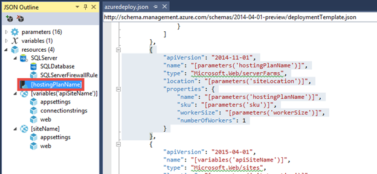
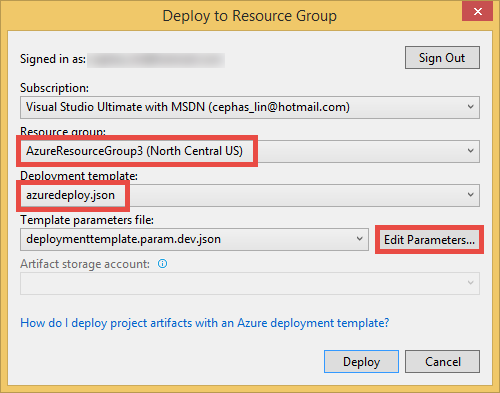

<properties
    pageTitle="Mise en service et déployer microservices mis dans Azure"
    description="Découvrez comment déployer une application composée de microservices dans le Service d’application Azure comme une seule unité et d’une manière prévisible à l’aide de modèles de groupe de ressources JSON et l’écriture de script PowerShell."
    services="app-service"
    documentationCenter=""
    authors="cephalin"
    manager="wpickett"
    editor="jimbe"/>

<tags
    ms.service="app-service"
    ms.workload="na"
    ms.tgt_pltfrm="na"
    ms.devlang="na"
    ms.topic="article"
    ms.date="01/06/2016"
    ms.author="cephalin"/>

# Mise en service et déployer microservices mis dans Azure #

Ce didacticiel montre comment configurer et déployer une application composée de [microservices](https://en.wikipedia.org/wiki/Microservices) dans [Azure Application Service](/services/app-service/) comme une seule unité et d’une manière prévisible à l’aide de modèles de groupe de ressources JSON et l’écriture de script PowerShell. 

Lors de la mise en service et déployer des applications de grande échelle qui sont composées de hautement découplé microservices répétabilité et la prévisibilité sont essentiels au succès. [Azure Application Service](/services/app-service/) vous permet de créer microservices qui incluent des applications web, les applications mobiles, API applications et applications logique. [Gestionnaire de ressources Azure](../azure-resource-manager/resource-group-overview.md) vous permet de gérer tous les microservices comme une unité, ainsi que des dépendances de ressources telles que base de données et les paramètres de contrôle de la source. À présent, vous pouvez également déployer une telle application à l’aide de modèles JSON et simple l’écriture de script PowerShell. 

[AZURE.INCLUDE [app-service-web-to-api-and-mobile](../../includes/app-service-web-to-api-and-mobile.md)] 

## Ce que vous ferez ##

Dans le didacticiel, vous allez déployer une application qui inclut :

-   Deux web apps (c'est-à-dire que deux microservices)
-   Une version de serveur de base de données SQL
-   Paramètres de l’application, des chaînes de connexion et contrôle de code source
-   Analyse de l’application, les alertes, les paramètres autoscaling

## Vous allez utiliser des outils ##

Dans ce didacticiel, vous allez utiliser les outils suivants. Dans la mesure où il n’est pas exhaustive discussion sur Outils, je vais respectez le scénario de bout en bout et simplement vous permettent d’une brève introduction à chacun, où vous trouverez plus d’informations sur celui-ci. 

### Modèles de gestionnaire de ressources Azure (JSON) ###
 
Chaque fois que vous créez une application web dans le Service d’application Azure, par exemple, le Gestionnaire de ressources Azure utilise un modèle JSON pour créer le groupe de ressources entier avec les ressources de composant. Un modèle complexe à partir d' [Azure Marketplace](/marketplace) telles que l’application [WordPress Scalable](/marketplace/partners/wordpress/scalablewordpress/) peut inclure la base de données MySQL, comptes de stockage, le plan de services d’application, l’application web elle-même, règles d’alerte, paramètres de l’application, les paramètres d’échelle et plus et tous les ces modèles sont disponibles via PowerShell. Pour plus d’informations sur la façon de télécharger et utiliser ces modèles, voir [Utilisation de PowerShell Azure avec le Gestionnaire de ressources Azure](../powershell-azure-resource-manager.md).

Pour plus d’informations sur les modèles Azure le Gestionnaire de ressources, voir [Création de modèles de gestionnaire de ressources Azure](../resource-group-authoring-templates.md)

### Azure SDK 2.6 pour Visual Studio ###

Le plus récent SDK contient des améliorations apportées à la prise en charge du modèle de gestionnaire de ressources dans l’éditeur de JSON. Vous pouvez utilisez cette option pour créer un modèle de groupe de ressources à partir de zéro ou ouvrir un modèle JSON existant (par exemple, un modèle téléchargé galerie) rapidement pour la modification, remplir le fichier de paramètres et même déployer le groupe de ressources directement à partir d’une solution de groupe de ressources Azure.

Pour plus d’informations, voir [Azure SDK 2.6 pour Visual Studio](/blog/2015/04/29/announcing-the-azure-sdk-2-6-for-net/).

### Azure PowerShell 0.8.0 ou version ultérieure ###

Au début de la version 0.8.0, l’installation de PowerShell Azure inclut le module Azure le Gestionnaire de ressources en plus du module Azure. Ce nouveau module vous permet le déploiement des groupes de ressources de script.

Pour plus d’informations, voir [Utilisation de PowerShell Azure avec le Gestionnaire de ressources Azure](../powershell-azure-resource-manager.md)

### Explorateur de ressources Azure ###

Cet [outil Aperçu](https://resources.azure.com) vous permet d’Explorer les définitions JSON de tous les groupes de ressources dans votre abonnement et des ressources. Dans l’outil, vous pouvez modifier les définitions de JSON d’une ressource, supprimer un ensemble de la hiérarchie des ressources et créer des ressources.  Les informations disponibles dans cet outil sont très utiles pour la création de modèles, car il vous montre les propriétés que vous devez définir pour un type particulier de ressource, les valeurs correctes, etc.. Vous pouvez même créer votre groupe de ressources dans le [Portail Azure](https://portal.azure.com/), puis vérifiez que ses définitions JSON dans l’outil de l’Explorateur pour vous aider à modéliser le groupe de ressources.

### Déployer au bouton Azure ###

Si vous utilisez GitHub pour le contrôle de code source, vous pouvez placer un [déploiement au bouton Azure](/blog/2014/11/13/deploy-to-azure-button-for-azure-websites-2/) dans votre fichier Lisez-moi. MD, qui permet un déploiement de clé en main l’interface utilisateur pour Azure. Pendant que vous pouvez faire ceci pour une application web simple, vous pouvez étendre cette option pour activer le déploiement d’un groupe de ressources entière en plaçant un fichier azuredeploy.json dans la racine du référentiel. Ce fichier JSON, qui contient le modèle de groupe de ressources, doit être utilisé par la déployer au bouton Azure pour créer le groupe de ressources. Pour obtenir un exemple, consultez l’exemple [ToDoApp](https://github.com/azure-appservice-samples/ToDoApp) , que vous utiliserez dans ce didacticiel.

## Obtenir de l’exemple de modèle de groupe de ressources ##

Maintenant, nous allons apprendre vers la droite pour celle-ci.

1.  Accédez à l’exemple de Service d’application [ToDoApp](https://github.com/azure-appservice-samples/ToDoApp) .

2.   Dans readme.md, cliquez sur **déployer vers Azure**.
 
3.  Vous êtes dirigé vers le site [déployer à azure](https://deploy.azure.com) et vous êtes invité à entrer des paramètres de déploiement. Notez que la plupart des champs est remplie avec le nom du référentiel et quelques chaînes aléatoires à votre place. Vous pouvez modifier tous les champs si vous le souhaitez, mais les seules choses que vous devez entrer la connexion d’administration SQL Server et le mot de passe, puis cliquez sur **suivant**.
 
    

4.  Cliquez ensuite sur **déployer** pour lancer le processus de déploiement. Une fois que le processus s’exécute jusqu'à son terme, cliquez sur le http://todoapp*XXXX*. azurewebsites.net lien permettant de parcourir l’application déployée. 

    

    L’interface utilisateur doit être un peu lent lorsque vous naviguez tout d’abord, étant donné que les applications débutez vers le haut, mais vous-même inciter qu’il s’agit d’une application entièrement fonctionnelle.

5.  Dans la page déployer, cliquez sur le lien **Gérer** pour afficher la nouvelle application dans le portail Azure.

6.  Dans la liste déroulante **Essentials** , cliquez sur le lien de groupe de ressources. Notez également que l’application web est déjà connectée au référentiel GitHub sous **Projet externe**. 

    
 
7.  Dans la carte de groupe de ressources, notez qu’il existe déjà une base de données SQL dans le groupe de ressources et les deux applications web.

    
 
Tout ce que vous venez de voir dans quelques minutes une application entièrement déployée deux-microservice, avec tous les composants, dépendances, paramètres, base de données et publication continue, configurée par une orchestration automatisée dans le Gestionnaire de ressources Azure. Tout cela effectué par deux éléments :

-   Le déploiement au bouton Azure
-   azuredeploy.JSON à la racine mis en pension

Vous pouvez déployer cette application même dizaines, des centaines ou des milliers de fois et avoir la même configuration chaque fois. La répétabilité et élaborer de cette approche vous permet de déployer des applications de grande échelle avec facilité et confiance.

## Examinez (ou modifiez) AZUREDEPLOY. JSON ##

Maintenant Examinons comment le référentiel GitHub a été configuré. Vous serez à l’aide de l’éditeur de JSON dans le Kit de développement .NET Azure, donc si vous n’avez pas déjà installé [Azure .NET SDK 2.6](/downloads/), faites-le maintenant.

1.  Dupliquer le référentiel [ToDoApp](https://github.com/azure-appservice-samples/ToDoApp) à l’aide de votre outil git favoris. Dans la capture d’écran ci-dessous, je fais ceci dans l’Explorateur d’équipes dans Visual Studio 2013.

    

2.  À partir de la racine du référentiel, ouvrez azuredeploy.json dans Visual Studio. Si vous ne voyez pas le volet du plan JSON, vous devez installer Azure .NET SDK.

    

Je vais pas décrire tous les détails du format JSON, mais la section [Plus de ressources](#resources) comporte des liens pour apprendre à utiliser le langage de modèle de groupe de ressources. Ici, je vais simplement pour montrer que vous les fonctionnalités intéressantes qui peuvent vous aider à commencer à effectuer votre propre modèle personnalisé pour le déploiement des applications.

### Paramètres ###

Consultez la section Paramètres pour vérifier que la plupart de ces paramètres est que le bouton **déployer vers Azure** vous invite à entrer. Le site derrière le bouton **déployer vers Azure** remplit l’entrée de l’interface utilisateur en utilisant les paramètres définis dans azuredeploy.json. Ces paramètres sont utilisés dans les définitions de ressource, telles que les noms des ressources, les valeurs de propriété, etc..

### Ressources ###

Dans le nœud de ressources, vous pouvez voir que 4 ressources de niveau supérieur sont définis, notamment une instance SQL Server, un plan de services d’application et les deux applications web. 

#### Plan de services d’application ####

Commençons par une ressource de niveau racine simple dans le JSON. Dans le plan JSON, cliquez sur le plan de services d’application nommé **[hostingPlanName]** pour mettre en surbrillance le code JSON correspondant. 

Notez que la `type` élément spécifie la chaîne à une offre de Service d’application (il était appelé une batterie de serveurs fois long et long il y a), et d’autres éléments et propriétés sont renseignées à l’aide des paramètres définis dans le fichier JSON cette ressource n’a pas les ressources imbriquées.

>[AZURE.NOTE] Notez également que la valeur de `apiVersion` indique Azure quelle version de l’API REST pour utiliser la définition de la ressource JSON avec et il peut affecter comment la ressource doit être mis en forme à l’intérieur de la `{}`. 

#### SQL Server ####

Cliquez ensuite sur la ressource de SQL Server nommée **SQL Server** dans le plan de JSON.

 
Notez les informations suivantes sur le code JSON en surbrillance :

-   L’utilisation de paramètres garantit que les ressources créées sont nommés et configurés de manière à rend cohérents entre eux.
-   La ressource de SQL Server dispose de deux ressources imbriquées, chacune avec une valeur différente pour `type`.
-   Les ressources imbriquées à l’intérieur de `“resources”: […]`, où la base de données et les règles de pare-feu sont définis, ont un `dependsOn` élément qui spécifie l’ID de la ressource de la ressource de SQL Server de niveau racine. Cela indique Gestionnaire de ressources Azure, « avant de créer cette ressource que d’autres ressources doit déjà exister. et si d’autres cette ressource est définie dans le modèle, puis celle d’abord créer ».

    >[AZURE.NOTE] Pour plus d’informations sur l’utilisation de la `resourceId()` fonction, voir [Fonctions de modèle Azure Gestionnaire de ressources](../resource-group-template-functions.md).

-   L’effet de la `dependsOn` élément est que le Gestionnaire de ressources Azure peut-il déterminer les ressources qui peuvent être créés en parallèle et les ressources qui doivent être créés dans un ordre séquentiel. 

#### Dans le navigateur ####

À présent, nous allons passer aux applications web réel eux-mêmes, qui sont plus complexes. Cliquez sur l’application web [variables('apiSiteName')] dans le plan JSON pour mettre en évidence son code JSON. Vous remarquerez que les éléments sont prise beaucoup plus intéressantes. Pour cela, je vais parler les fonctionnalités un par un :

##### Ressource racine #####

L’application web dépend de deux différentes ressources. Cela signifie que le Gestionnaire de ressources Azure créera l’application web uniquement après avoir créé le plan de services d’application et de l’instance SQL Server.

##### Paramètres de l’application #####

Les paramètres d’application sont également définies comme une ressource imbriquée.

Dans la `properties` élément pour `config/appsettings`, vous avez deux paramètres de l’application dans le format `“<name>” : “<value>”`.

-   `PROJECT`est un [paramètre KUDU](https://github.com/projectkudu/kudu/wiki/Customizing-deployments) qui indique le déploiement d’Azure le projet à utiliser dans une solution Visual Studio plusieurs projet. Je vais vous montrer plus tard comment le contrôle de code source est configuré, mais dans la mesure où le code ToDoApp fait partie d’une solution de Visual Studio plusieurs projet, nous avons besoin de ce paramètre.
-   `clientUrl`est utilise simplement une application qui définissant le code d’application.

##### Chaînes de connexion #####

Les chaînes de connexion sont également définies comme une ressource imbriquée.

Dans la `properties` élément pour `config/connectionstrings`, chaque chaîne de connexion est également définie comme une paire de valeur : nom, avec la mise en forme spécifique `“<name>” : {“value”: “…”, “type”: “…”}`. Pour le `type` élément, les valeurs possibles sont `MySql`, `SQLServer`, `SQLAzure`, et `Custom`.

>[AZURE.TIP] Pour une liste définitive des types de chaîne de connexion, exécutez la commande suivante dans Azure PowerShell : \[Enum]::GetNames("Microsoft.WindowsAzure.Commands.Utilities.Websites.Services.WebEntities.DatabaseType")
    
##### Contrôle de code source #####

Les paramètres de contrôle de code source sont également définies comme une ressource imbriquée. Le Gestionnaire de ressources Azure utilise cette ressource pour configurer la publication continue (voir inconvénient sur `IsManualIntegration` ultérieurement) et également pour démarrer le déploiement de code de l’application automatiquement pendant le traitement du fichier JSON.

`RepoUrl`et `branch` doivent être très intuitive et doivent pointer vers le référentiel Git et le nom de la succursale à publier à partir de. Là encore, celles-ci sont définies par les paramètres d’entrée. 

Remarque dans les `dependsOn` élément qui, en plus de la ressource de l’application web proprement dite, `sourcecontrols/web` dépend également `config/appsettings` et `config/connectionstrings`. C’est parce qu’une fois que `sourcecontrols/web` est configuré, le processus de déploiement d’Azure tente automatiquement déployer, créer et lancer le code d’application. Par conséquent, l’insertion de cette dépendance permet de s’assurer que l’application a accès aux paramètres de l’application requises et des chaînes de connexion avant l’exécution de code de l’application. 

>[AZURE.NOTE] Notez également que `IsManualIntegration` est défini sur `true`. Cette propriété est nécessaire dans ce didacticiel, car vous ne possédez pas réellement le référentiel GitHub et par conséquent ne peut pas réellement accorder une autorisation à Azure pour configurer la publication continue à partir de [ToDoApp](https://github.com/azure-appservice-samples/ToDoApp) (c'est-à-dire transmission mises à jour automatiques référentiel vers Azure). Vous pouvez utiliser la valeur par défaut `false` pour le référentiel spécifié uniquement si vous avez configuré les informations d’identification du propriétaire GitHub dans le [portail Azure](https://portal.azure.com/) avant. En d’autres termes, si vous avez configuré précédemment contrôle de code source à GitHub ou BitBucket pour une application dans le [Portail Azure](https://portal.azure.com/) , à l’aide de vos informations d’identification utilisateur, puis Azure sera n’oubliez pas les informations d’identification et les utiliser à chaque fois que vous déployez une application à partir de GitHub ou BitBucket à l’avenir. Toutefois, si vous n’avez pas encore fait, déploiement du modèle JSON échouera lorsque le Gestionnaire de ressources Azure essaie de configurer des paramètres de contrôle de source de l’application web, car il ne peut pas se connecter dans GitHub ou BitBucket avec les informations d’identification du propriétaire du référentiel.

## Comparer le modèle JSON avec un groupe de ressources déployé ##

Dans ce cas, vous pouvez faire défiler les cartes de tous les l’application web dans le [Portail Azure](https://portal.azure.com/), mais il existe un autre outil qui est aussi simple qu’if utile, pas plus. Accédez à l’outil Aperçu [Explorateur des ressources de Azure](https://resources.azure.com) , qui vous offre une représentation JSON de tous les groupes de ressources dans vos abonnements, tels qu’ils existent réellement dans le système principal Azure. Vous pouvez également voir comment la ressource hiérarchie du groupe JSON dans Azure correspond à la hiérarchie dans le fichier de modèle qui est utilisé pour créer votre document.

Par exemple, lorsque j’accéder à l’outil [Explorateur de ressources Azure](https://resources.azure.com) et développez les nœuds dans l’Explorateur, je vois le groupe de ressources et les ressources de niveau racine qui sont collectées sous leurs types de ressources correspondantes.

Si vous d’exploration une application web, vous devez être en mesure de voir les détails de configuration de l’application web semblables à l’en dessous de capture d’écran :

Là encore, les ressources imbriquées doivent avoir une hiérarchie très semblable à ceux dans votre fichier de modèle JSON, et vous devez voir les paramètres de l’application, chaînes de connexion, etc., correctement reflétées dans le volet JSON. L’absence de paramètres ici peut-être signaler un problème avec votre fichier JSON et peut vous aider à résoudre les problèmes de votre fichier de modèle JSON.

## Déployez le modèle de groupe de ressources vous-même ##

Le bouton **déployer vers Azure** est très pratique, mais elle vous permet de déployer le modèle de groupe de ressources dans azuredeploy.json uniquement si vous avez déjà poussé azuredeploy.json à GitHub. Le Kit de développement .NET Azure fournit également les outils vous permettant de déployer un fichier de modèle JSON directement à partir de votre ordinateur local. Pour ce faire, procédez comme suit :

1.  Dans Visual Studio, cliquez sur **fichier** > **Nouveau** > **projet**.

2.  Cliquez sur **Visual c#** > **Cloud** > **Groupe de ressources Azure**, puis cliquez sur **OK**.

    

3.  Dans **Sélection du modèle Azure**, sélectionnez **Modèle vide** , puis cliquez sur **OK**.

4.  Faites glisser azuredeploy.json dans le dossier des **modèles** de votre nouveau projet.

    

5.  Dans l’Explorateur de solutions, ouvrez la azuredeploy.json copiée.

6.  Dans un souci de la démonstration, nous allons ajouter quelques ressources un aperçu Application standards à notre fichier JSON, en cliquant sur **Ajouter une ressource**. Si vous êtes intéressé simplement déploiement du fichier JSON, passez aux étapes de déploiement.

    

7.  Sélectionnez **Application perspectives pour les applications Web**, puis vérifiez un Service d’application existant planifier et web app est sélectionnée, puis cliquez sur **Ajouter**.

    

    Vous pourrez maintenant afficher plusieurs nouvelles ressources qui, en fonction de la ressource et qu’il fait, avoir des dépendances sur le plan de services d’application ou l’application web. Ces ressources ne sont pas activés par leur définition existante et que vous voulez modifier l’aspect.

    
 
8.  Dans le cadre de JSON, cliquez sur **appInsights échelle** pour mettre en surbrillance son code JSON. Il s’agit le paramètre de mise à l’échelle de votre plan de services d’application.

9.  Dans le code JSON en surbrillance, recherchez la `location` et `enabled` propriétés et les définir comme illustré ci-dessous.

    

10. Dans le cadre de JSON, cliquez sur **CPUHigh appInsights** pour mettre en surbrillance son code JSON. Il s’agit d’une alerte.

11. Recherchez la `location` et `isEnabled` propriétés et les définir comme illustré ci-dessous. Procédez de même pour les autres trois alertes (bulbes violets).

    

12. Vous êtes maintenant prêt à déployer. Cliquez sur le projet et sélectionnez **déployer** > **Nouveau déploiement**.

    

13. Connectez-vous à votre compte Azure si vous n’avez pas déjà fait.

14. Sélectionnez un groupe de ressources existant dans votre abonnement ou créer un nouveau, sélectionnez **azuredeploy.json**, puis cliquez sur **Modifier les paramètres de**.

    

    Vous pourrez maintenant modifier tous les paramètres définis dans le fichier de modèle dans un tableau piles. Paramètres qui définissent les valeurs par défaut déjà auront leurs valeurs par défaut, puis paramètres permettant de définir une liste de valeurs autorisées seront affichés sous forme de listes déroulantes.

    

15. Renseignez tous les paramètres vides et utilisez l' [adresse mis en pension GitHub ToDoApp](https://github.com/azure-appservice-samples/ToDoApp.git) **repoUrl**. Ensuite, cliquez sur **Enregistrer**.
 
    

    >[AZURE.NOTE] AutoScaling est une fonctionnalité proposée dans niveau **Standard** ou une version ultérieure, et les alertes au niveau de l’offre sont des fonctionnalités proposées dans niveau **base** ou une version ultérieure, vous devez définir le paramètre de **référence (SKU)** sur **Standard** ou **Premium** pour afficher toutes les informations application nouvelles ressources s’allument.
    
16. Cliquez sur **déployer**. Si vous avez sélectionné **Enregistrer les mots de passe**, le mot de passe est enregistré dans le paramètre fichier **au format texte brut**. Dans le cas contraire, vous êtes invité à entrer le mot de passe de base de données pendant le processus de déploiement.

Voilà ! Maintenant, il vous suffit d’accéder au site du [Portail Azure](https://portal.azure.com/) et l’outil [Azure Explorateur des ressources](https://resources.azure.com) pour afficher les nouvelles alertes et paramètres d’échelle ajoutés à votre JSON déploiement application.

Les étapes dans cette section principalement accompli les tâches suivantes :

1.  Préparer le fichier de modèle
2.  Créer un fichier de paramètre utiliser le fichier de modèle
3.  Déployé le fichier de modèle avec le fichier de paramètres

La dernière étape est facilement émise par une applet de commande PowerShell. Pour voir ce que Visual Studio fait lorsqu’il déployé votre application, ouvrez Scripts\Deploy AzureResourceGroup.ps1. Il y a beaucoup de code, mais je vais simplement sélectionner tout le code pertinent que vous avez besoin pour déployer le fichier de modèle avec le fichier de paramètres.

L’applet de commande dernière, `New-AzureResourceGroup`, est celle qui effectue l’action. Tout cela doit montrent vous que, à l’aide d’outils, il est relativement simple déployer votre application cloud mis. Chaque fois que vous exécutez l’applet de commande sur le même modèle avec le même fichier de paramètres, vous allez obtenir le même résultat.

## Résumé ##

Dans DevOps, répétabilité et prévisibilité sont des clés à n’importe quel succès du déploiement d’une application de grande échelle composé de microservices. Dans ce didacticiel, vous avez déployé une application de deux microservice pour Azure comme un groupe de ressources unique à l’aide du modèle Azure le Gestionnaire de ressources. Bien entendu, il vous a donné les connaissances que vous avez besoin pour commencer la conversion de votre application dans Azure dans un modèle de mise en service et déployer mis. 

## Étapes suivantes ##

Découvrez comment [Appliquer la méthodologie agile et en permanence publier votre application microservices en toute simplicité](app-service-agile-software-development.md) et déploiement avancées techniques telles que le [déploiement flighting](app-service-web-test-in-production-controlled-test-flight.md) facilement.

## Ressources complémentaires ##

-   [Azure langue du modèle de gestionnaire de ressources](../resource-group-authoring-templates.md)
-   [Création de modèles Gestionnaire de ressources Azure](../resource-group-authoring-templates.md)
-   [Fonctions de modèle Azure Gestionnaire de ressources](../resource-group-template-functions.md)
-   [Déployer une application avec le Gestionnaire de ressources Azure modèle](../resource-group-template-deploy.md)
-   [À l’aide de PowerShell Azure avec le Gestionnaire de ressources Azure](../powershell-azure-resource-manager.md)
-   [Résolution des problèmes de déploiement de groupe de ressources dans Azure](../resource-manager-troubleshoot-deployments-portal.md)

 
