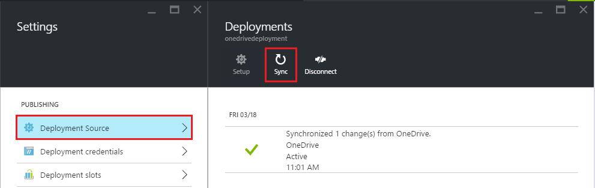

<properties
    pageTitle="Contenu de synchronisation à partir d’un dossier cloud au Service d’application Azure"
    description="Apprenez à déployer votre application de Service d’application Azure via la synchronisation de contenu à partir d’un dossier de cloud."
    services="app-service"
    documentationCenter=""
    authors="dariagrigoriu"
    manager="wpickett"
    editor="mollybos"/>

<tags
    ms.service="app-service"
    ms.workload="na"
    ms.tgt_pltfrm="na"
    ms.devlang="na"
    ms.topic="article"
    ms.date="06/13/2016"
    ms.author="dariagrigoriu"/>
    
# Contenu de synchronisation à partir d’un dossier cloud au Service d’application Azure

Ce didacticiel montre comment déployer au [Service d’application Azure](http://go.microsoft.com/fwlink/?LinkId=529714) à la synchronisation de votre contenu à partir de services de stockage cloud populaires tels que Dropbox et OneDrive. 

## Vue d’ensemble du déploiement de synchronisation de contenu

Le déploiement de synchronisation de contenu à la demande est optimisé par le [moteur de déploiement Kudu](https://github.com/projectkudu/kudu/wiki) intégré Service d’application. Dans le [Portail Azure](https://portal.azure.com), vous pouvez désigner un dossier dans votre espace de stockage cloud, travailler avec votre application code et le contenu de ce dossier et synchroniser au Service d’application en cliquant sur un bouton. Synchronisation de contenu utilise le processus Kudu de génération et de déploiement. 
    
## Comment activer le déploiement de synchronisation de contenu
Pour activer la synchronisation de contenu à partir du [Portail Azure](https://portal.azure.com), procédez comme suit :

1. Dans la carte de votre application dans le portail Azure, cliquez sur **paramètres** > **Source du déploiement**. Cliquez sur **Choisir une Source**, puis sélectionnez **OneDrive** ou **Dropbox** comme source pour le déploiement. 

    

    >[AZURE.NOTE] En raison de différences sous-jacentes dans les API, **OneDrive entreprise** n’est pas prise en charge pour le moment. 

2. Terminer le flux de travail d’autorisation pour activer le Service d’application pour accéder à un chemin désigné prédéfini spécifique de OneDrive ou Dropbox tout votre contenu application Service l’emplacement de stockage.  
    Après l’autorisation de l’application de Service plateforme vous donne l’option pour créer un dossier de contenu sous le chemin d’accès contenu désigné, ou pour choisir un dossier existant contenu sous ce chemin d’accès contenu désigné. Les chemins d’accès contenus désignés sous vos comptes de stockage cloud utilisés pour la synchronisation de Service d’application sont les suivantes :  
    * **OneDrive**:`Apps\Azure Web Apps` 
    * **Dropbox**:`Dropbox\Apps\Azure`

3. Après la synchronisation initiale du contenu de la synchronisation de contenu peut être lancée à la demande à partir du portail Azure. L’historique de déploiement est disponible avec la carte **déploiements** .

    
 
Plus d’informations pour le déploiement de Dropbox sont disponibles sous [déployer à partir de Dropbox](http://blogs.msdn.com/b/windowsazure/archive/2013/03/19/new-deploy-to-windows-azure-web-sites-from-dropbox.aspx). 

