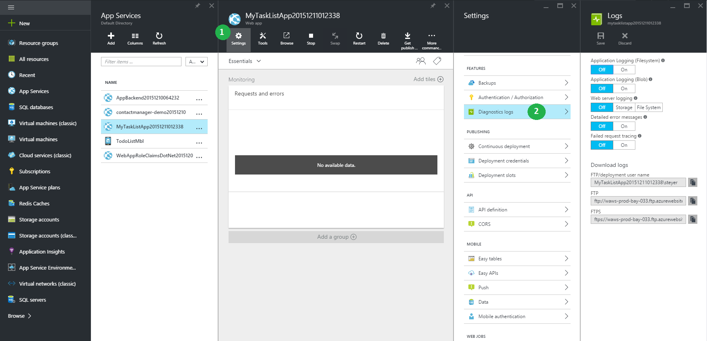

<properties
    pageTitle="Référence pour naviguer sur le portail Azure"
    description="Découvrez l’expérience utilisateur différent pour l’application de Service Web entre le portail de gestion et le portail d’Azure"
    services="app-service"
    documentationCenter=""
    authors="jaime-espinosa"
    manager="wpickett"
    editor="jimbe"/>

<tags
    ms.service="app-service"
    ms.workload="na"
    ms.tgt_pltfrm="na"
    ms.devlang="na"
    ms.topic="article"
    ms.date="02/26/2016"
    ms.author="jaime-espinosa"/>

# Référence pour naviguer sur le portail Azure

Sites Web Azure sont maintenant appelées [Application Service Web Apps](http://go.microsoft.com/fwlink/?LinkId=529714). Nous allons mettre à jour tous notre documentation pour refléter ce changement de nom et fournir des instructions pour le portail Azure. Jusqu'à ce que ce processus est terminé, vous pouvez utiliser ce document comme un guide pour utiliser des applications Web dans le portail Azure.

[AZURE.INCLUDE [app-service-web-to-api-and-mobile](../../includes/app-service-web-to-api-and-mobile.md)] 
 
## L’avenir du portail classique Azure

Pendant que vous remarquerez la répertorient les modifications dans le portail classique Azure, ce portail est en train d’être remplacés par le portail Azure. Comme le portail classique est progressivement, le focus pour un nouveau développement est déplacé vers le portail Azure. Toutes les nouvelles fonctionnalités à venir pour les applications Web soient transférés dans le portail Azure. Commencer à utiliser le portail Azure pour tirer parti de la plus récente et plus grande que Web Apps obligé de proposer.

## Différences de disposition entre le portail classique Azure et le portail Azure

Dans le portail classique, tous les services Azure figurent dans la partie gauche. Navigation dans le portail classique provient d’une arborescence, où vous démarrez à partir du service, puis naviguez dans chaque élément. Cette structure fonctionne également lorsque vous gérez des composants indépendants. Toutefois, applications basées sur Azure sont un ensemble de services interconnectés, et l’arborescence n’est pas idéale pour travailler avec des collections de services. 

Le portail Azure facilite la créer des applications de bout en bout avec des composants à partir de plusieurs services. Le portail est organisé des *trajets*. Un *voyage* est une série de *cartes*, qui sont des conteneurs pour les différents composants. Par exemple, la configuration automatique-mise à l’échelle pour une application web est un *voyage* qui vous permet d’accéder plusieurs cartes comme le montre l’exemple suivant : la carte de **site web** (que titre carte n'a pas encore été mis à jour pour utiliser les nouveaux termes), la carte de **paramètres** et la carte de **mise à l’échelle** . Dans l’exemple, mise à l’échelle en cours configurée pour dépendent de l’UC, de sorte qu’il est également une carte **Pourcentage processeur** . Les composants dans les *cartes* sont appelés des *composants*, qui ressemble vignettes. 

## Exemple de navigation : créer une application web

Création de nouvelles applications web est toujours aussi simple que 1-2-3. Voici une illustration du portail classique et le portail côte à côte pour montrer que rien n’a changé dans le nombre d’étapes nécessaires pour vous aider à une application web et en cours d’exécution. 

Dans le portail, vous pouvez choisir parmi les plus courants des applications web, y compris les applications galerie populaires comme WordPress. Pour une liste complète des applications disponibles, visitez le [Azure Marketplace].

Lorsque vous créez une application web, vous spécifiez URL, plan de services d’application et l’emplacement dans le portail comme vous le faites dans le portail classique. 

En outre, le portail vous permet de définir d’autres paramètres communs. Par exemple, [groupes de ressources](../azure-resource-manager/resource-group-overview.md) simplifient la voir et gérer les ressources Azure connexes. 

## Exemple de navigation : fonctionnalités et paramètres

Tous les paramètres et les fonctionnalités sont désormais groupées logiquement dans une carte unique, à partir de laquelle vous pouvez naviguer.

Par exemple, vous pouvez créer des domaines personnalisés en cliquant sur les **domaines personnalisés et SSL** dans la carte de **paramètres** .

Pour configurer une alerte analyse, cliquez sur **demandes et les erreurs** , puis sur **Ajouter une alerte**.

Pour activer des diagnostics, cliquez sur **les journaux de Diagnostics** dans la carte de **paramètres** .

 
Pour configurer les paramètres de l’application, cliquez sur **paramètres de l’Application** dans la carte de **paramètres** . 

Autre que le nom de la marque, quelques éléments dans le portail ont été renommés ou regroupées différemment afin de pouvoir les retrouver plus facilement. Par exemple, vous trouverez ci-dessous une capture d’écran de la page correspondante application Paramètres (**configurer**) dans le portail classique.

## Ressources complémentaires

[Azure Portal]: https://portal.azure.com
[Azure Marketplace]: /marketplace/

>[AZURE.NOTE] Si vous voulez commencer à utiliser le Service d’application Azure avant de vous inscrire pour un compte Azure, accédez à [Essayer le Service application](http://go.microsoft.com/fwlink/?LinkId=523751), où vous pouvez créer une application web starter courtes immédiatement dans le Service d’application. Aucune carte de crédit obligatoire ; Aucune engagements.

## Ce qui a changé
* Pour un guide à la modification de sites Web Application Service voir : [Azure Application Service et son Impact sur les Services Azure existants](http://go.microsoft.com/fwlink/?LinkId=529714)
 
