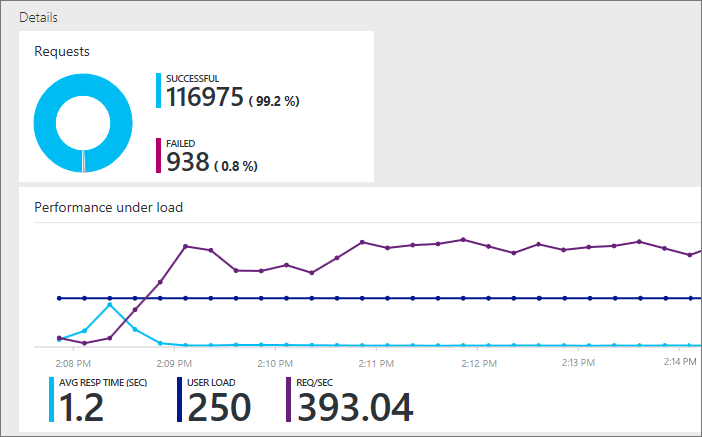

<properties
   pageTitle="Tester les performances de votre application web Azure | Microsoft Azure"
   description="Exécuter les tests de performances de l’application web Azure pour vérifier la manière dont votre application gère charge utilisateur. Mesurer le temps de réponse et rechercher les échecs susceptibles d’indiquer des problèmes."
   services="app-service\web"
   documentationCenter=""
   authors="ecfan"
   manager="douge"
   editor="jimbe"/>

<tags
   ms.service="app-service-web"
   ms.workload="web"
   ms.tgt_pltfrm="na"
   ms.devlang="na"
   ms.topic="article"
   ms.date="05/25/2016"
   ms.author="estfan; manasma; ahomer"/>

# <a name="performance-test-your-azure-web-app-under-load"></a>Test des performances de votre application web Azure sous charge

Vérifier les performances de votre application web avant de lancer ou déployer des mises à jour en production. Ainsi, vous pouvez mieux déterminer si votre application est prête à être publiée. Estimez plus il est probable que votre application peut gérer le trafic lors de l’utilisation de pointe ou auprès de votre prochaine push marketing.

Au cours de la version d’évaluation, vous pouvez test des performances de votre application gratuitement dans le portail Azure.
Ces tests simulent la charge utilisateur sur votre application sur une période spécifique et mesurent la réponse de votre application. Par exemple, les résultats des tests montrent la vitesse votre application répond à un nombre spécifique d’utilisateurs. Ils affichent également le nombre de requêtes a échoué, indiquant les problèmes avec votre application.      


## <a name="before-you-start"></a>Avant de commencer

* Vous devez un [abonnement Azure](https://account.windowsazure.com/subscriptions), si vous n’en avez pas déjà. Découvrez comment vous pouvez [Ouvrir un compte Azure gratuitement](https://azure.microsoft.com/pricing/free-trial/?WT.mc_id=A261C142F).

* Vous avez besoin d’un compte de [Visual Studio Team Services](https://www.visualstudio.com/products/what-is-visual-studio-online-vs) pour conserver votre historique des tests des performances. Un compte approprié est créé automatiquement lorsque vous configurez votre test de performances. Vous pouvez également créer un nouveau compte ou utiliser un compte existant si vous êtes le propriétaire du compte. 

* Déployez votre application dans un environnement de test. Que votre application utilise un plan de services d’application autre que le plan de production. De cette façon, vous n’affecte tous nos clients existants ou ralentir votre application en production. 

## <a name="set-up-and-run-your-performance-test"></a>Configurer et exécuter votre test de performances

0.  Connectez-vous au [portail Azure](https://portal.azure.com). Pour utiliser un compte de Visual Studio Team Services dont vous êtes propriétaire, connectez-vous en tant que le propriétaire du compte.

0.  Accédez à votre application web.

    

0.  Accédez au **Test des performances**.

    
 
0. Vous allez maintenant lier un compte de [Visual Studio Team Services](https://www.visualstudio.com/products/what-is-visual-studio-online-vs) pour conserver votre historique des tests des performances.

    Si vous avez un compte Team Services à utiliser, sélectionnez ce compte. Si vous ne, créez un nouveau compte.

    

0.  Créer votre test de performances. Définir les détails et exécutez le test. 

Vous pouvez consulter les résultats en temps réel pendant l’exécution du test.

Par exemple, supposons que nous ayons une application qui a communiqué coupons à la vente de congés de l’année précédente. Cet événement dure 15 minutes avec une pointe de 100 clients simultanées. Nous voulons doublez le nombre de clients cette année. Nous voulons également améliorer la satisfaction client en réduisant le temps de chargement de page à partir de 5 secondes à 2 secondes. Par conséquent, nous allons tester les performances de notre application mise à jour avec 250 utilisateurs pendant 15 minutes.

Nous allons simuler la charge sur notre application en générant des utilisateurs virtuels (clients) qui visitez notre site web en même temps. Cela permet de visualiser le nombre de requêtes est ignore ou répond lentement.

  

   *  URL par défaut de votre application web est ajouté automatiquement. 
   Vous pouvez modifier l’URL pour tester les autres pages (requêtes HTTP GET uniquement).

   *  Pour simuler les conditions locales et réduire la latence, sélectionnez l’emplacement le plus proche de vos utilisateurs pour générer la charge.

  Voici le test en cours. Pendant la première minute, notre page se charge plus lentement que nous voulons.

  

  Une fois le test est exécuté, nous apprenons beaucoup plus rapidement chargement de la page après la première minute. Cela permet d’identifier l’endroit où nous voulons démarrer la résolution des problèmes.

  

## <a name="test-multiple-urls"></a>Tester les URL multiples

Vous pouvez également exécuter les tests de performances comportant plusieurs URL qui représentent un scénario de bout en bout utilisateur en téléchargeant un fichier Visual Studio Web Test. Quelques façons, vous pouvez créer un Test de site Web Visual Studio fichier sont :

* [Capturer le trafic à l’aide de Fiddler et exporter un fichier de Test de site Web Visual Studio](http://docs.telerik.com/fiddler/Save-And-Load-Traffic/Tasks/VSWebTest)
* [Créer un fichier de test de charge dans Visual Studio](https://www.visualstudio.com/docs/test/performance-testing/run-performance-tests-app-before-release)

Pour télécharger et exécuter un fichier Visual Studio Web Test :
 
0. Suivez les étapes ci-dessus pour ouvrir la carte de **test de performances de nouveau** .
   Dans cette carte, choisissez l’option CONFIGFURE tester à l’aide pour ouvrir la carte de **test configurer à l’aide** .  

    

0. Vérifiez que le TYPE de TEST est défini sur **Visual Studio Web Test** et sélectionnez votre fichier d’HTTP Archive.
    Utilisez l’icône « dossier » pour ouvrir la boîte de dialogue de sélecteur de fichier.

    

    Une fois que le fichier a été téléchargé, vous consultez la liste des URL à tester dans la section Détails de l’URL.
 
0. Spécifier la charge utilisateur et durée du test, puis cliquez sur **exécuter les tests**.

    

    Une fois le test, vous consultez les résultats dans les deux volets. Le volet de gauche affiche les informations performnace comme une série de graphiques.

    

    Le volet de droite affiche une liste d’échecs de requêtes, avec le type d’erreur et le nombre de fois où qu'elle s’est produite.

    

0. Exécutez à nouveau le test en sélectionnant l’icône **réexécuter** dans la partie supérieure du volet de droite.

    

##  <a name="q--a"></a>Q & A

#### <a name="q-is-there-a-limit-on-how-long-i-can-run-a-test"></a>Q : y a-t-il une limite sur combien de temps que je peux exécuter un test ? 

**A**: Oui, vous pouvez exécuter votre test jusqu'à une heure dans le portail Azure.

#### <a name="q-how-much-time-do-i-get-to-run-performance-tests"></a>Q : combien de temps exécuter les tests de performances obtenir ? 

**A**: après la version d’évaluation, vous obtenez 20 000 utilisateurs virtuels minutes (VUMs) gratuites chaque mois avec votre compte Visual Studio Team Services. Un VUM est le nombre d’utilisateurs virtuels multipliés par le nombre de minutes dans votre test. Si vos besoins dépassent la limite gratuite, vous pouvez acheter davantage de temps et payez uniquement ce que vous utilisez.

#### <a name="q-where-can-i-check-how-many-vums-ive-used-so-far"></a>Q : où puis-je vérifier combien VUMs que j’ai utilisés jusqu'à présent ?

**A**: vous pouvez vérifier ce montant dans le portail Azure.


#### <a name="q-what-is-the-default-option-and-are-my-existing-tests-impacted"></a>Q : quelle est l’option par défaut et sont affectés mes tests existants ?

**A**: l’option par défaut pour les tests de performances de chargement est un test manuel - identique à celle de l’option de test avant l’URL plusieurs a été ajoutée au portail.
Les tests existants continuent à utiliser l’URL configurée et fonctionnent comme auparavant.

#### <a name="q-what-features-not-supported-in-the-visual-studio-web-test-file"></a>Q : quelles sont les fonctionnalités non prises en charge dans le fichier de Test de site Web Visual Studio ?

**A**: À l’heure actuelle cette fonctionnalité ne reconnaît pas les plug-ins, des sources de données et des règles d’extraction Test de site Web. Vous devez modifier votre fichier de Test de site Web pour les supprimer. Nous espérons qu’ajouter le support pour ces fonctionnalités dans les futures mises à jour.

#### <a name="q-does-it-support-any-other-web-test-file-formats"></a>Q : il en charge par les autres formats de fichier de Test de site Web ?
  
**A**: À présenter uniquement Visual Studio Web Test des fichiers au format sont prises en charge.
Nous serait heureux bienvenus si vous devez prendre en charge d’autres formats de fichier. Nous envoyer un e-mail à [vsoloadtest@microsoft.com](mailto:vsoloadtest@microsoft.com).

#### <a name="q-what-else-can-i-do-with-a-visual-studio-team-services-account"></a>Q : que puis-je faire d’autre avec un compte Visual Studio Team Services ?

**A**: pour trouver votre nouveau compte, cliquez sur ```https://{accountname}.visualstudio.com```. Partager votre code, générer, tester, effectuer le suivi du travail et les logiciels d’expédition – tout dans le cloud à l’aide de n’importe quel outil ou la langue. Découvrez comment les services et fonctionnalités [Visual Studio Team Services](https://www.visualstudio.com/products/what-is-visual-studio-online-vs) aider l’équipe de collaborer plus facilement et déployer en continu.

## <a name="see-also"></a>Voir aussi

* [Exécuter les tests de performances cloud simple](https://www.visualstudio.com/docs/test/performance-testing/getting-started/get-started-simple-cloud-load-test)
* [Exécuter les tests de performances Jmeter Apache](https://www.visualstudio.com/docs/test/performance-testing/getting-started/get-started-jmeter-test)
* [Enregistrer et relire des tests de charge sur le nuage](https://www.visualstudio.com/docs/test/performance-testing/getting-started/record-and-replay-cloud-load-tests)
* [Test des performances de votre application dans le cloud](https://www.visualstudio.com/docs/test/performance-testing/getting-started/getting-started-with-performance-testing)
