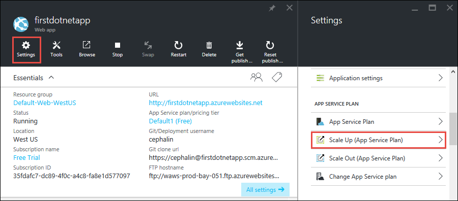
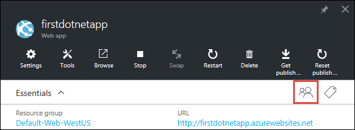

<properties
    pageTitle="Ajouter des fonctionnalités à votre première application web"
    description="Ajouter des fonctionnalités pouvant être ajoutées à votre application web première en quelques minutes."
    services="app-service\web"
    documentationCenter=""
    authors="cephalin"
    manager="wpickett"
    editor=""
/>

<tags
    ms.service="app-service-web"
    ms.workload="web"
    ms.tgt_pltfrm="na"
    ms.devlang="na"
    ms.topic="hero-article"
    ms.date="05/12/2016"
    ms.author="cephalin"
/>

# Ajouter des fonctionnalités à votre première application web

Dans [déployer votre application web première vers Azure de cinq minutes](app-service-web-get-started.md), vous avez déployé une application web exemple sur [Azure Application Service](../app-service/app-service-value-prop-what-is.md). Dans cet article, vous allez ajouter rapidement certaines fonctionnalités correctement à votre application web déployée. En quelques minutes, vous pourrez :

- appliquer l’authentification pour vos utilisateurs
- mettre automatiquement à l’échelle votre application
- recevoir des alertes sur les performances de votre application

Quelle que soit l’application exemple vous déployé dans l’article précédent, vous pouvez suivre le long dans le didacticiel.

Les trois activités dans ce didacticiel sont uniquement quelques exemples des nombreuses fonctionnalités utiles que pouvez-vous lorsque vous placez votre application web dans le Service d’application. La plupart des fonctionnalités sont disponibles dans la couche **Free** (qui est votre première application web qui s’exécute sur), et vous pouvez utiliser votre version d’évaluation crédits pour tester les fonctionnalités qui nécessitent une valeur supérieure tarifs niveaux. Être assuré que votre application web reste dans **Free** niveau, sauf si modifie explicitement à un autre niveau de tarification.

>[AZURE.NOTE] L’application web que vous avez créé avec Azure infrastructure du langage commun s’exécute en couche **libre** , qui autorise uniquement une instance de machine virtuelle partagée avec les quotas de ressources. Pour plus d’informations sur ce que vous obtenez avec couche **libre** , voir [limites de Service d’application](../azure-subscription-service-limits.md#app-service-limits).

## Authentifier vos utilisateurs

À présent, nous allons voir il est facile d’ajouter l’authentification dans votre application (lectures en [Application Service d’authentification/autorisation](https://azure.microsoft.com/blog/announcing-app-service-authentication-authorization/)).

1. Dans la carte du portail de votre application, que vous venez ouvert, cliquez sur **paramètres** > **authentification / autorisation**.  
    

2. Cliquez **sur** activer l’authentification.  

4. Dans les **Fournisseurs d’authentification**, cliquez sur **Azure Active Directory**.  
    

5. Dans la carte **Paramètres Azure Active Directory** , cliquez sur **Express**, puis cliquez sur **OK**. Les paramètres par défaut créent une nouvelle application Azure AD dans votre annuaire par défaut.  
 

6. Cliquez sur **Enregistrer**.  
    

    Une fois que la modification a réussi, vous verrez le bell notification vert, ainsi qu’un message convivial.

7. Dans la carte du portail de votre application, cliquez sur le lien **URL** (ou **Parcourir** dans la barre de menus). Le lien est une adresse HTTP.  
      
    Mais une fois qu’il ouvre l’application dans un nouvel onglet, l’URL zone des redirections plusieurs fois et se termine à votre application avec une adresse HTTPS. Ce que vous voyez est que vous êtes déjà connecté à votre abonnement Azure, et vous êtes automatiquement authentifié dans l’application.  
      
    Afin que si vous ouvrez maintenant une session non authentifiée dans un autre navigateur, vous verrez un écran de connexion lorsque vous accédez à la même URL.  
    <!--   -->
   Si vous n’avez jamais fait rien avec Azure Active Directory, votre répertoire par défaut n’ait pas tous les utilisateurs Azure AD. Dans ce cas, le seul compte dans cet emplacement est probablement le compte Microsoft avec votre abonnement Azure. C’est pourquoi vous ont été automatiquement connecté à l’application dans une version antérieure du même navigateur.
   Vous pouvez utiliser ce même compte Microsoft pour ouvrir une session sur cette page de connexion également.

Félicitations, vous soyez couple tout le trafic vers votre application web.

Vous avez probablement remarqué dans le **authentification / autorisation** carte que vous pouvez effectuer beaucoup plus d’informations, telles que :

- Activer la connexion mise en réseau
- Activer plusieurs options de connexion
- Modifier le comportement par défaut lorsque personnes d’abord accéder à votre application

Application Service fournit qu'une solution clés en main pour certains l’authentification classique doit afin que vous n’avez pas besoin fournir la logique d’authentification vous-même.
Pour plus d’informations, voir [Application Service d’authentification / d’autorisation](https://azure.microsoft.com/blog/announcing-app-service-authentication-authorization/).

## Mettre à l’échelle votre application automatiquement en fonction de la demande

Ensuite, nous allons échelle votre application afin qu’il ajuste automatiquement il capacité de répondre à la demande des utilisateurs (lectures à [l’échelle de votre application dans Azure](web-sites-scale.md) et le [nombre d’instances de l’échelle manuellement ou automatiquement](../monitoring-and-diagnostics/insights-how-to-scale.md)).

En bref, vous adapter votre application web de deux façons :

- [Évoluer](https://en.wikipedia.org/wiki/Scalability#Horizontal_and_vertical_scaling): obtenez plus processeur, mémoire, espace disque et des fonctionnalités supplémentaires, tels que dédiés machines virtuelles et des domaines personnalisés certificats, les intermédiaires emplacements, autoscaling et bien plus encore. Évoluer en modifiant le niveau de tarification du plan de Service d’application que votre application appartient.
- [Mise à l’échelle](https://en.wikipedia.org/wiki/Scalability#Horizontal_and_vertical_scaling): augmenter le nombre de machine virtuelle instances qui s’exécutent votre application.
Vous pouvez intégrer jusqu'à jusqu'à 50 instances, selon votre niveau de tarification.

Sans davantage ado, nous allons définir autoscaling.

1. Tout d’abord, nous allons évoluer pour activer autoscaling. Dans la carte du portail de votre application, cliquez sur **paramètres** > **Échelle vers le haut (application Service Plan)**.  
    

2. Faites défiler et sélectionnez la couche **S1 Standard** , la couche les plus faibles qui prend en charge autoscaling (encerclé dans la capture d’écran), puis cliquez sur **Sélectionner**.  
    

    Vous avez terminé mise à l’échelle vers le haut.

    >[AZURE.IMPORTANT] Ce niveau consacrés votre crédits d’évaluation gratuites. Si vous avez un compte de paie par utilisation, il entraîne frais à votre compte.

3. Ensuite, nous allons configurer autoscaling. Dans la carte du portail de votre application, cliquez sur **paramètres** > **Échelle arrière (application Service Plan)**.  
    

4. Modifier **l’échelle en** pourcentage **Du processeur**. Les curseurs en dessous de la liste déroulante mettre à jour en conséquence. Ensuite, définissez une plage **d’Instances** entre **1** et **2** et une **plage cible** entre **40** et **80**. Faire en tapant dans les zones ou en déplaçant les curseurs.  
 

    En fonction de cette configuration, votre application automatiquement peut évoluer lors de l’utilisation de l’UC est supérieure à 80 % et mettre à l’échelle dans lors de l’utilisation de l’UC est inférieure à 40 %.

5. Dans la barre de menus, cliquez sur **Enregistrer** .

Félicitations, votre application est autoscaling.

Vous avez probablement remarqué dans le **Paramètres d’échelle de** carte que vous pouvez effectuer beaucoup plus d’informations, telles que :

- Mettre à l’échelle à un certain nombre d’instances manuellement
- Mettre à l’échelle par d’autres mesures de performances, tels que file d’attente mémoire pourcentage ou le disque
- Personnaliser le comportement de mise à l’échelle lors du déclenche d’une règle de performance
- Échelle sur une planification
- Définir le comportement d’autoscaling pour un événement futur

Pour plus d’informations sur la mise à l’échelle des votre application, voir [évoluer votre application dans Azure](../app-service-web/web-sites-scale.md). Pour plus d’informations sur la mise à l’échelle, voir le [nombre d’instances de l’échelle manuellement ou automatiquement](../monitoring-and-diagnostics/insights-how-to-scale.md).

## Recevoir des alertes pour votre application

Maintenant que votre application est autoscaling, que se passe-t-il lorsqu’il atteint le nombre maximal d’instance (2) et processeur se trouve au-dessus de l’utilisation du souhaité (80 %) ?
Vous pouvez configurer une alerte (lectures à [recevoir des notifications alertes](../monitoring-and-diagnostics/insights-receive-alert-notifications.md)) pour vous informer de cette situation afin d’autres adapter à distance/hors de votre application, par exemple. Nous allons rapidement configurer une alerte pour ce scénario.

1. Dans la carte du portail de votre application, cliquez sur **Outils** > **alertes**.  
    

2. Cliquez sur **Ajouter une alerte**. Puis, dans la zone **ressources** , sélectionnez la ressource qui se termine par **(serverfarms)**. Il s’agit de votre plan de services d’application.  
    

3. Spécifiez le **nom** comme `CPU Maxed`, **métrique** en tant que **Pourcentage du processeur**et **seuil** en tant que `90`, puis sélectionnez **lecteurs, collaborateurs et les propriétaires de messagerie**, puis cliquez sur **OK**.   
 

    Une fois Azure créer l’alerte, vous le voyez dans la carte **alertes** .  
    

Félicitations, vous recevez maintenant alertes.

Ce paramètre d’alerte vérifie l’UC toutes les cinq minutes. Si ce nombre dépasse 90 %, vous recevrez un message d’alerte, ainsi que toutes les personnes qui est autorisé. Pour afficher toutes les personnes qui est autorisé à recevoir toutes les alertes, revenez à la carte du portail de votre application et cliquez sur le bouton **d’accès** .  

Vous devriez voir que **les administrateurs d’abonnement** sont déjà le **propriétaire** de l’application. Ce groupe vous inclut si vous êtes l’administrateur du compte de votre abonnement Azure (par exemple, votre abonnement d’évaluation). Pour plus d’informations sur le contrôle d’accès basé sur un rôle Azure, consultez [Contrôle d’accès Azure Role-Based](../active-directory/role-based-access-control-configure.md).

> [AZURE.NOTE] Règles d’alerte est une fonctionnalité Azure. Pour plus d’informations, voir [notifications d’alerte réception](../monitoring-and-diagnostics/insights-receive-alert-notifications.md).

## Étapes suivantes

Sur la bonne voie pour configurer l’alerte, vous avez peut-être remarqué une vaste gamme d’outils dans le **Outils de** carte. Dans ce cas, vous pouvez résoudre les problèmes de performances du moniteur, tester les vulnérabilités, gérer les ressources, interagir avec la console de machine virtuelle et ajouter des extensions utiles. Nous vous invitons à cliquer sur chacun de ces outils pour découvrir les outils simples mais puissants à vos conseils doigt.

Découvrez comment faire plus avec votre application déployée. Voici la liste partielle uniquement :

- [Acheter et configurer un nom de domaine personnalisé](custom-dns-web-site-buydomains-web-app.md) - acheter un domaine attrayant pour votre application web au lieu de la *. azurewebsites.net domaine. Ou utiliser un domaine que vous avez déjà.
- [Configurer la mise en environnements](web-sites-staged-publishing.md) - déployer votre application sur une URL intermédiaire avant de mettre en production. Mettre à jour votre application web en ligne en toute sécurité. Configurer une solution DevOps élaborée avec plusieurs emplacements de déploiement.
- [Configurer la déploiement continu](app-service-continuous-deployment.md) - intégrer le déploiement des applications dans votre système de contrôle de code source. Déployer sur Azure avec chaque validation.
- [Accès local ressources](web-sites-hybrid-connection-get-started.md) - Access existant en local de base de données ou système CRM.
- [Sauvegarder votre application](web-sites-backup.md) - configurer arrière et de restauration pour votre application web. Préparer des défaillances inattendues et de les résoudre.
- [Activer les journaux de diagnostic](web-sites-enable-diagnostic-log.md) - lire les journaux IIS de traces Azure ou de l’applications. Les lire dans un flux de données, téléchargez-les ou les déplacer dans [Application perspectives](../application-insights/app-insights-overview.md) pour l’analyse de clé en main.
- [Analyser votre application pour vulnérabilités](https://azure.microsoft.com/blog/web-vulnerability-scanning-for-azure-app-service-powered-by-tinfoil-security/) -
analyser votre application web menaces modernes à l’aide du service fourni par [Tinfoil sécurité](https://www.tinfoilsecurity.com/).
- [Exécuter des travaux en arrière-plan](../azure-functions/functions-overview.md) - exécuter tâches de traitement des données, création de rapports, etc..
- [Découvrir le fonctionnement du Service d’application](../app-service/app-service-how-works-readme.md)
