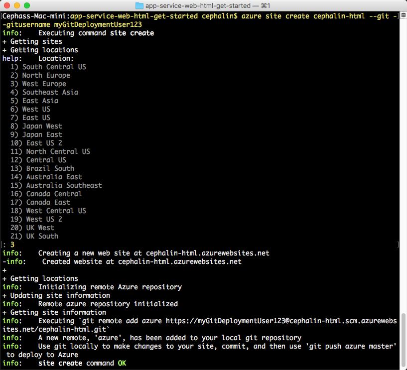
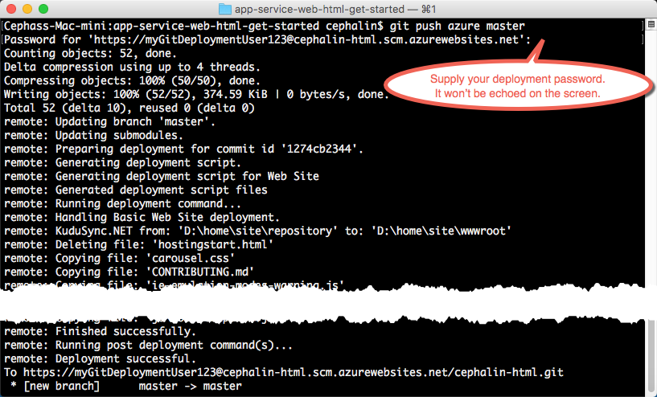

<properties 
    pageTitle="Déployez votre application web première pour Azure de cinq minutes | Microsoft Azure" 
    description="Découvrez combien il est facile pour exécuter des applications web dans le Service d’application en déployant un exemple d’application. Lancer effectuant développement réel rapidement et consultez les résultats immédiatement." 
    services="app-service\web"
    documentationCenter=""
    authors="cephalin"
    manager="wpickett"
    editor=""
/>

<tags
    ms.service="app-service-web"
    ms.workload="web"
    ms.tgt_pltfrm="na"
    ms.devlang="na"
    ms.topic="hero-article"
    ms.date="10/13/2016" 
    ms.author="cephalin"
/>
    
# Déployez votre application web première pour Azure de cinq minutes

Ce didacticiel vous aide à déployer une application web HTML + CSS simple au [Service d’application Azure](../app-service/app-service-value-prop-what-is.md).
Vous pouvez utiliser le Service d’application pour créer des applications web, [l’application mobile back-end](/documentation/learning-paths/appservice-mobileapps/)et les [applications de l’API](../app-service-api/app-service-api-apps-why-best-platform.md).

Vous allez : 

- Créer une application web dans le Service d’application Azure.
- Déployer HTML, CSS à celui-ci.
- Consulter vos pages en cours d’exécution en production.
- Mettre à jour votre contenu la même façon que vous le feriez [push que GIT valide](https://git-scm.com/docs/git-push).

## Conditions préalables

- [Git](http://www.git-scm.com/downloads).
- [Azure infrastructure du langage commun](../xplat-cli-install.md).
- Un compte Microsoft Azure. Si vous n’avez pas un compte, vous pouvez [vous inscrire à une version d’évaluation gratuite](/pricing/free-trial/?WT.mc_id=A261C142F) ou [activer vos avantages d’abonné Visual Studio](/pricing/member-offers/msdn-benefits-details/?WT.mc_id=A261C142F).

>[AZURE.NOTE] Vous pouvez [Essayer le Service application](http://go.microsoft.com/fwlink/?LinkId=523751) sans compte Azure. Créer une application starter et lire avec celui-ci pour devenir une heure--aucune carte de crédit requises, aucune engagements.

## Déployer un site HTML simple

1. Ouvrez une nouvelle invite de commande Windows, fenêtre PowerShell, shell Linux ou terminal OS X. Exécuter `git --version` et `azure --version` pour vérifier que Git et Azure infrastructure du langage commun sont installés sur votre ordinateur.

    

    Si vous n’avez pas installé les outils, voir [conditions préalables](#Prerequisites) pour les liens vers le téléchargement.

3. Se connecter à Azure comme suit :

        azure login

    Suivez le message d’aide pour continuer le processus de connexion.

    

4. Changer Azure infrastructure du langage commun en mode ASM, puis définissez l’utilisateur de déploiement de Service d’application. Vous allez déployer code avec les informations d’identification ultérieurement.

        azure config mode asm
        azure site deployment user set --username <username> --pass <password>

1. Passer à un répertoire de travail (`CD`) et cloner l’application exemple comme suit :

        git clone https://github.com/Azure-Samples/app-service-web-html-get-started.git

2. Modifier le référentiel de votre application exemple. 

        cd app-service-web-html-get-started

4. Créer la ressource de l’application de Service d’application dans Azure avec un nom d’application unique et de l’utilisateur de déploiement que vous avez configuré précédemment. Lorsque vous êtes invité, indiquez le nombre de la région souhaitée.

        azure site create <app_name> --git --gitusername <username>

    

    Votre application est créée dans Azure maintenant. En outre, votre répertoire actif est connecté à la nouvelle application de Service d’application et initialisé Git comme un Git à distance.
    Vous pouvez accéder à l’URL de l’application (http://&lt;app_name >. azurewebsites.net) pour voir la page HTML par défaut superbes, mais nous allons y accéder votre code maintenant.

4. Déployez votre exemple de code dans votre application Azure comme vous le feriez transmission de code avec Git. Lorsque vous y êtes invité, utilisez le mot de passe que vous avez configuré précédemment.

        git push azure master

    

    Si vous avez utilisé une des structures de langue, vous verrez des sorties différentes. C’est parce que `git push` non seulement injecte du code dans Azure, mais déclenche également les tâches de déploiement dans le moteur de déploiement. Si vous avez tout package.json (Node.js) ou fichiers requirements.txt (Python) dans la racine de votre projet (référentiel), ou si vous avez un fichier packages.config dans votre projet ASP.NET, le script de déploiement restaure les packages requis pour vous. Vous pouvez également [Activer l’extension Composer](web-sites-php-mysql-deploy-use-git.md#composer) pour traiter automatiquement les fichiers composer.json dans votre application PHP.

Félicitations, vous avez déployé votre application de Service d’application Azure.

## Consultez votre application en direct.

Pour afficher votre application en cours d’exécution live dans Azure, exécutez cette commande à partir de n’importe quel répertoire de votre référentiel :

    azure site browse

## Mettre à jour de votre application

Vous pouvez désormais utiliser Git pour envoyer à partir de la racine de votre projet (référentiel) à tout moment pour effectuer une mise à jour sur le site réel. Vous faire la même façon que lorsque vous avez déployé votre code la première fois. Par exemple, chaque fois que vous souhaitez distribuer une nouvelle modification que vous avez testé localement, exécutez les commandes suivantes à partir de la racine de votre projet (référentiel) :

    git add .
    git commit -m "<your_message>"
    git push azure master

## Étapes suivantes

Recherchez les étapes de développement et de déploiement par défaut pour votre infrastructure de langue :

> [AZURE.SELECTOR]
- [.NET](web-sites-dotnet-get-started.md)
- [PHP](app-service-web-php-get-started.md)
- [Node.js](app-service-web-nodejs-get-started.md)
- [Python](web-sites-python-ptvs-django-mysql.md)
- [Java](web-sites-java-get-started.md)

Ou faire plus avec votre application web première. Par exemple :

- Essayez les [autres méthodes de déploiement de votre code à Azure](../app-service-web/web-sites-deploy.md). Par exemple, pour déployer à partir d’un de vos référentiels GitHub, sélectionnez **GitHub** au lieu de **Référentiel Git Local** dans **les options de déploiement**.
- Utiliser votre application Azure à un niveau avancé. Authentifier vos utilisateurs. Évoluer en fonction à la demande. Configurer des alertes de performance. Tout en quelques clics. Voir [Ajouter une fonctionnalité à votre première application web](app-service-web-get-started-2.md).

