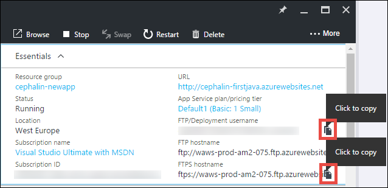

<properties 
    pageTitle="Déployez votre application web Java première pour Azure de cinq minutes | Microsoft Azure" 
    description="Découvrez combien il est facile pour exécuter des applications web dans le Service d’application en déployant un exemple d’application. Lancer effectuant développement réel rapidement et consultez les résultats immédiatement." 
    services="app-service\web"
    documentationCenter=""
    authors="cephalin"
    manager="wpickett"
    editor=""
/>

<tags
    ms.service="app-service-web"
    ms.workload="web"
    ms.tgt_pltfrm="na"
    ms.devlang="na"
    ms.topic="hero-article"
    ms.date="10/13/2016" 
    ms.author="cephalin"
/>
    
# Déployez votre application web Java première pour Azure de cinq minutes

Ce didacticiel vous aide à déployer une application web Java simple au [Service d’application Azure](../app-service/app-service-value-prop-what-is.md).
Vous pouvez utiliser le Service d’application pour créer des applications web, [l’application mobile back-end](/documentation/learning-paths/appservice-mobileapps/)et les [applications de l’API](../app-service-api/app-service-api-apps-why-best-platform.md).

Vous allez : 

- Créer une application web dans le Service d’application Azure.
- Déployer une application de Java exemple.
- Consultez votre code en cours d’exécution en production.

## Conditions préalables

- Obtenez un client FTP/FTPS, par exemple [FileZilla](https://filezilla-project.org/).
- Obtenir un compte Microsoft Azure. Si vous n’avez pas un compte, vous pouvez [vous inscrire à une version d’évaluation gratuite](/pricing/free-trial/?WT.mc_id=A261C142F) ou [activer vos avantages d’abonné Visual Studio](/pricing/member-offers/msdn-benefits-details/?WT.mc_id=A261C142F).

>[AZURE.NOTE] Vous pouvez [Essayer le Service application](http://go.microsoft.com/fwlink/?LinkId=523751) sans compte Azure. Créer une application starter et lire avec celui-ci pour devenir une heure--aucune carte de crédit requises, aucune engagements.

## Créer une application web

1. Connectez-vous au [portail Azure](https://portal.azure.com) avec votre compte Azure.

2. Dans le menu de gauche, cliquez sur **Nouveau** > **Web + Mobile** > **Web App**.

    

3. Dans la carte de création d’une application, utilisez les paramètres suivants pour votre nouvelle application :

    - **Nom de l’application**: tapez un nom unique.
    - **Groupe de ressources**: sélectionnez **à nouveau** , puis nommez le groupe de ressources.
    - **Application Service/emplacement de plan**: cliquez dessus pour configurer, puis cliquez sur **Créer un nouveau** pour définir le nom, un emplacement et un niveau de tarification de l’offre de Service d’application. N’hésitez pas à utiliser la **Free** tarifs niveau.

    Lorsque vous avez terminé, votre carte de création d’une application doit ressembler à ceci :

    

3. Dans la partie inférieure, cliquez sur **créer** . Vous pouvez cliquer sur l’icône de **Notification** dans la partie supérieure pour afficher la progression.

    

4. Lorsque le déploiement est terminé, vous devez voir ce message de notification. Cliquez sur le message pour ouvrir la carte de votre déploiement.

    

5. Dans la carte **déploiement a réussi** , cliquez sur le lien de **ressources** pour ouvrir la carte de votre nouvelle application web.

    

## Déployer une application Java dans votre application web

À présent, nous allons déployer une application Java vers Azure à l’aide de FTPS.

5. Dans la carte de l’application web, faites défiler jusqu'à **paramètres de l’Application** ou le rechercher, puis cliquez dessus. 

    

6. Dans la **version Java**, sélectionnez **Java 8** , puis cliquez sur **Enregistrer**.

    

    Lorsque vous recevez la notification de **mise à jour les paramètres de l’application web terminée**, accédez à http://*&lt;appname >*. azurewebsites.net pour afficher le servlet JSP par défaut en action.

7. Dans la carte de l’application web, faites défiler vers le bas jusqu'à les **informations d’identification du déploiement** ou le rechercher, puis cliquez dessus.

8. Définissez vos informations d’identification de déploiement, puis cliquez sur **Enregistrer**.

7. Dans la carte de l’application web, cliquez sur **Aperçu**. En regard de **nom d’utilisateur/déploiement FTP** et **FTPS hostname**, cliquez sur le bouton **Copier** pour copier les valeurs suivantes.

    

    Vous êtes maintenant prêt à déployer votre application Java avec FTPS.

8. Dans votre client FTP/FTPS, connectez-vous au serveur FTP de votre application web Azure en utilisant les valeurs que vous avez copié dans la dernière étape. Utilisez le mot de passe de déploiement que vous avez créé précédemment.

    La capture d’écran suivante montre connectant à l’aide de FileZilla.

    

    Vous pouvez constater des avertissements de sécurité pour le termes non reconnu certificat SSL à partir d’Azure. Continuez et continuer.

9. Cliquez sur [ce lien](https://github.com/Azure-Samples/app-service-web-java-get-started/raw/master/webapps/ROOT.war) pour télécharger le fichier WAR sur votre ordinateur local.

9. Dans votre client FTP/FTPS, accédez à **/site/wwwroot/webapps** dans le site distant, puis faites glisser le fichier téléchargé guerre sur votre ordinateur local dans ce répertoire à distance.

    

    Cliquez sur **OK** pour remplacer le fichier dans Azure.

    >[AZURE.NOTE] Selon le comportement par défaut de Tomcat, nom de fichier **ROOT.war** dans /site/wwwroot/webapps vous donne l’application web racine (http://*&lt;appname >*. azurewebsites.net) et le nom de fichier ** * &lt;Nomquelconque >*.war** vous donne une application web nommée (http://*&lt;appname >*.azurewebsites.net/*&lt;Nomquelconque >*).

Voilà ! Votre application Java s’exécute à présent live dans Azure. Dans votre navigateur, accédez à http://*&lt;appname >*. azurewebsites.net pour voir en action. 

## Mettre à jour de votre application

Chaque fois que vous avez besoin effectuer une mise à jour, simplement télécharger le nouveau fichier WAR dans le même répertoire remote avec votre client FTP/FTPS.

## Étapes suivantes

[Créer une application web Java à partir d’un modèle dans la Azure Marketplace](web-sites-java-get-started.md#marketplace). Vous pouvez obtenir votre propre conteneur Tomcat entièrement personnalisable et obtenir le UI Gestionnaire familiers. 

Déboguer votre application web Azure, directement dans [IntelliJ](app-service-web-debug-java-web-app-in-intellij.md) ou [Eclipse](app-service-web-debug-java-web-app-in-eclipse.md).

Ou faire plus avec votre application web première. Par exemple :

- Essayez les [autres méthodes de déploiement de votre code à Azure](../app-service-web/web-sites-deploy.md). 
- Utiliser votre application Azure à un niveau avancé. Authentifier vos utilisateurs. Évoluer en fonction à la demande. Configurer des alertes de performance. Tout en quelques clics. Voir [Ajouter une fonctionnalité à votre première application web](app-service-web-get-started-2.md).

