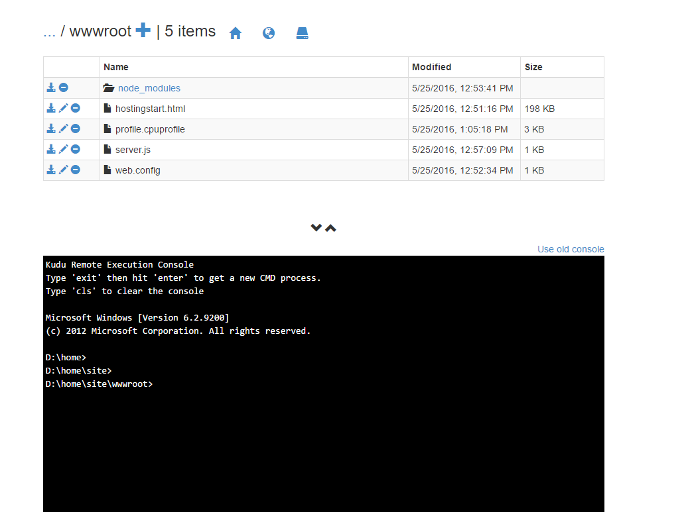

<properties
    pageTitle="Meilleures pratiques et guide de dépannage pour les applications de nœud dans des applications Web Azure"
    description="Découvrez les meilleures pratiques et les étapes de dépannage pour les applications de nœud dans des applications Web Azure."
    services="app-service\web"
    documentationCenter="nodejs"
    authors="ranjithr"
    manager="wadeh"
    editor=""/>

<tags
    ms.service="app-service-web"
    ms.workload="web"
    ms.tgt_pltfrm="na"
    ms.devlang="nodejs"
    ms.topic="article"
    ms.date="06/06/2016"
    ms.author="ranjithr;wadeh"/>
    
# <a name="best-practices-and-troubleshooting-guide-for-node-applications-on-azure-web-apps"></a>Meilleures pratiques et guide de dépannage pour les applications de nœud dans des applications Web Azure

[AZURE.INCLUDE [tabs](../../includes/app-service-web-get-started-nav-tabs.md)]

Dans cet article, vous allez apprendre les meilleures pratiques et les étapes de dépannage pour les [applications de nœud](app-service-web-nodejs-get-started.md) s’exécutant sur Azure WebApp (avec [iisnode](https://github.com/azure/iisnode)).

>[AZURE.WARNING] Utilisez faire preuve de prudence lorsque vous utilisez les étapes de dépannage sur votre site de production. Il est recommandé de résoudre votre application sur une configuration non production par exemple votre emplacement intermédiaire et lorsque le problème est résolu, remplacez votre emplacement intermédiaire avec votre emplacement de production.

## <a name="iisnode-configuration"></a>Configuration de IISNODE

Ce [fichier de schéma](https://github.com/Azure/iisnode/blob/master/src/config/iisnode_schema_x64.xml) affiche tous les paramètres qui peuvent être configurées pour iisnode. Certains paramètres qui seront utiles pour votre application sont :

* nodeProcessCountPerApplication

    Ce paramètre détermine le nombre de processus de nœud lancé par application IIS. Valeur par défaut est 1. Vous pouvez lancer autant de node.exe en tant que votre nombre core machine virtuelle par ce paramètre à 0. Valeur recommandée est 0 pour la plupart des applications, vous pouvez utiliser tous les cœurs sur votre ordinateur. Node.exe est single threaded afin une node.exe utilisera un maximum de 1 core et obtenir des performances optimales se déconnecter de votre application de nœud que vous ne souhaitez pas utiliser tous les cœurs.

* nodeProcessCommandLine

    Ce paramètre détermine le chemin d’accès à la node.exe. Vous pouvez définir cette valeur pointe vers votre version node.exe.

* maxConcurrentRequestsPerProcess

    Ce paramètre détermine le nombre maximal de demandes simultanées envoyé par iisnode pour chaque node.exe. Sous WebApp azure, la valeur par défaut est infini. Vous n’avez pas à vous soucier de ce paramètre. En dehors des applications Web azure, la valeur par défaut est 1024. Vous souhaiterez peut-être effectuer cette configuration selon le nombre de requêtes que votre application reçoit et la vitesse votre application traite chaque requête.

* maxNamedPipeConnectionRetry

    Ce paramètre détermine le nombre maximal de fois iisnode tentera apporter connexion sur le canal nommé d’envoyer la demande via à node.exe. Ce paramètre en combinaison avec namedPipeConnectionRetryDelay détermine le délai d’expiration total de chaque demande dans iisnode. Valeur par défaut est de 200 sur Azure WebApp. Nombre total de délai d’attente en secondes = (maxNamedPipeConnectionRetry \* namedPipeConnectionRetryDelay) / 1000

* namedPipeConnectionRetryDelay

    Ce paramètre permet de contrôler la quantité de durée (en ms) iisnode attend entre chaque tentative d’envoyer à node.exe sur le canal nommé. Valeur par défaut est 250ms.
    Nombre total de délai d’attente en secondes = (maxNamedPipeConnectionRetry \* namedPipeConnectionRetryDelay) / 1000

    Par défaut, le délai d’expiration total dans iisnode sur WebApp azure est de 200 \* 250ms = 50 secondes.

* logDirectory

    Ce paramètre détermine le répertoire dans laquelle iisnode se connecteront stdout/stderr. Valeur par défaut est iisnode qui est relatif au répertoire de script principal (répertoire où server.js principale se présenter)

* debuggerExtensionDll

    Ce paramètre détermine quelle version iisnode nœud inspecteur utilisera lors du débogage votre application nœud. Actuellement iisnode-inspecteur-0.7.3.dll et iisnode inspector.dll sont les seuls 2 valeurs valides pour ce paramètre. Valeur par défaut est iisnode-inspecteur-0.7.3.dll. version iisnode-inspecteur-0.7.3.dll utilise nœud-inspecteur-0.7.3 et, selon toute évidence afin que vous devez activer WebSocket sur votre webapp azure pour utiliser cette version. Voir <http://www.ranjithr.com/?p=98> pour plus d’informations sur la configuration iisnode pour lancer l’inspecteur de nœud nouveau.

* flushResponse

    Le comportement par défaut de IIS est qu’il met les données de réponse vers le haut à 4 Mo avant de vider, ou jusqu'à la fin de la réponse, selon ce qui vient en premier. iisnode propose un paramètre de configuration pour remplacer ce comportement : pour vider un fragment du corps d’entité réponse au plus tôt iisnode il reçoit de node.exe, vous devez définir la iisnode/@flushResponse attribut dans web.config « True » :
    
    ```
    <configuration>    
        <system.webServer>    
            <!-- ... -->    
            <iisnode flushResponse="true" />    
        </system.webServer>    
    </configuration>
    ```

    L’activation de consommation de chaque fragment du corps d’entité réponse ajoute baisse des performances qui permet de réduire le débit du système de ~ 5 % (à partir de v0.1.13), il est recommandé définir la portée ce paramètre uniquement aux points de terminaison nécessitant une réponse streaming (par exemple, à l’aide de la <location> élément dans le fichier web.config)

    En outre, de diffusion en continu les applications, vous devrez également définir responseBufferLimit de votre gestionnaire d’iisnode à 0.
    
    ```
    <handlers>    
        <add name="iisnode" path="app.js" verb="\*" modules="iisnode" responseBufferLimit="0"/>    
    </handlers>
    ```

* watchedFiles

    Il s’agit d’une liste séparés par des points-virgules de fichiers qui sera suivi des modifications. Une modification apportée à un fichier, l’application vers la Corbeille. Chaque entrée se compose d’un répertoire facultatif d’un nom et le nom du fichier requis qui dépendent du répertoire où se trouve le point d’entrée application principale. Les caractères génériques sont autorisés dans la partie de nom de fichier uniquement. Valeur par défaut est «\*. js;web.config »

* recycleSignalEnabled

    Valeur par défaut est false. Si activé, votre application nœud peut se connecter à un canal nommé (variable d’environnement IISNODE\_contrôle\_barre verticale) et envoyer un message « Corbeille ». Cela entraînera le w3wp recycler normalement.

* idlePageOutTimePeriod

    Valeur par défaut est égal à 0 ce qui signifie que cette fonctionnalité est désactivée. Lorsque la valeur à une valeur supérieure à 0, iisnode sera la page déconnecter tous ses processus enfants toutes les millisecondes 'idlePageOutTimePeriod'. Pour mieux comprendre quelle page arrière moyens, reportez-vous à cette [documentation](https://msdn.microsoft.com/library/windows/desktop/ms682606.aspx). Ce paramètre sera utile pour les applications qui utilisent une grande quantité de mémoire voulez parfois pageout mémoire sur le disque pour libérer certaines RAM.

>[AZURE.WARNING] Utilisez faire preuve de prudence lorsque vous activez les paramètres de configuration suivants sur les applications de production. Il est recommandé de les n'activer pas les applications de production en direct.

* debugHeaderEnabled

    La valeur par défaut est false. Si la valeur true, iisnode ajoute un en-tête de réponse HTTP iisnode-débogage à chaque réponse HTTP, il envoie que la valeur d’en-tête iisnode débogage est une URL. Les éléments individuels d’informations de diagnostic peuvent être acquise en consultant le fragment d’URL, mais une quantité visualisation mieux est atteint en ouvrant l’URL dans le navigateur.

* loggingEnabled

    Ce paramètre détermine la journalisation des stdout et stderr par iisnode. Iisnode sera capturer stdout/stderr à partir de processus nœud que lance et écrire dans le répertoire spécifié dans le paramètre « logDirectory ». Une fois que cela est activée, votre application écrire journaux au système de fichiers et, selon la quantité de journalisation terminée par l’application, il peut y avoir des conséquences sur les performances.

* devErrorsEnabled

    Valeur par défaut est false. Lorsque la valeur true, iisnode affiche le code d’état HTTP et le code d’erreur Win32 sur votre navigateur. Le code win32 sera utile pour certains types de problèmes de débogage.
    
* debuggingEnabled (n’activez pas sur site de production réel)

    Ce paramètre détermine la fonctionnalité de débogage. Iisnode est intégré à inspecteur de nœud. Activez ce paramètre, vous activez le débogage de votre application de nœud. Une fois ce paramètre est activé, iisnode sera mise en page les fichiers nécessaires nœud-inspecteur répertoire « debuggerVirtualDir » à la première requête débogage à votre application de nœud. Vous pouvez charger l’inspecteur de nœud en envoyant une requête à http://yoursite/server.js/debug. Vous pouvez contrôler le segment URL déboguer avec le paramètre « debuggerPathSegment ». Par défaut debuggerPathSegment = « déboguer ». Vous pouvez définir cette GUID par exemple afin qu’il soit plus difficile à découvrir par d’autres personnes.

    Consultez ce [lien](https://tomasz.janczuk.org/2011/11/debug-nodejs-applications-on-windows.html) pour plus d’informations sur le débogage.

## <a name="scenarios-and-recommendationstroubleshooting"></a>Scénarios et recommandations/dépannage

### <a name="my-node-application-is-making-too-many-outbound-calls"></a>Mon application nœud effectue trop d’appels sortants.

De nombreuses applications souhaiteriez établir des connexions sortantes dans le cadre de leur fonctionnement normal. Par exemple, lorsqu’une demande arrive, votre application nœud souhaiteriez contacter un API REST ailleurs et obtenir des informations pour traiter la requête. Vous pouvez utiliser un agent actif conserver lorsque vous faites appel http ou https. Par exemple, vous pouvez utiliser le module agentkeepalive comme votre agent actif conserver lorsque ces appels sortants. Cela permet de garantir que les supports sont réutilisées sur votre webapp azure machine virtuelle et en réduisant la charge de la création de nouveaux sockets pour chaque demande sortante. En outre, cela garantit que vous utilisez moins nombre de sockets pour adresser de nombreuses demandes sortants et par conséquent, vous ne dépassez pas la maxSockets alloué par machine virtuelle. Recommandation sur Azure WebApp serait pour définir la valeur de maxSockets agentKeepAlive à un total de 160 sockets par machine virtuelle. Cela signifie que si vous avez 4 node.exe en cours d’exécution sur l’ordinateur virtuel, vous souhaiteriez définir la maxSockets agentKeepAlive 40 par node.exe qui est 160 total par machine virtuelle.

Exemple de configuration agentKeepALive :

```
var keepaliveAgent = new Agent({    
    maxSockets: 40,    
    maxFreeSockets: 10,    
    timeout: 60000,    
    keepAliveTimeout: 300000    
});
```

Cet exemple part du principe que vous avez node.exe 4 s’exécutant sur votre ordinateur virtuel. Si vous avez un nombre différent de node.exe en cours d’exécution sur l’ordinateur virtuel, vous devrez modifier la maxSockets définir en conséquence.

### <a name="my-node-application-is-consuming-too-much-cpu"></a>Mon application nœud consomme trop d’UC.

Vous obtiendrez probablement une recommandation à partir d’Azure WebApp sur votre portail sur haute consommation processeur. Vous pouvez également configurer moniteurs regarder pour certaines [mesures](web-sites-monitor.md). Lors de la vérification de l’utilisation de l’UC sur le [Tableau de bord de portail Azure](../application-insights/app-insights-web-monitor-performance.md), recherchez les valeurs MAX processeur afin de ne pas manquer les valeurs pointe.
Dans le cas dans lequel vous pensez que votre application consomme trop processeur et vous ne pouvez pas expliquer, vous devrez profil de votre application de nœud.

### 

#### <a name="profiling-your-node-application-on-azure-webapps-with-v8-profiler"></a>Profil de votre application nœud sur azure WebApp avec versions 8-Générateur de profils

Par exemple, supposons que vous avez une application hello world à profil comme indiqué ci-dessous :

```
var http = require('http');    
function WriteConsoleLog() {    
    for(var i=0;i<99999;++i) {    
        console.log('hello world');    
    }    
}

function HandleRequest() {    
    WriteConsoleLog();    
}

http.createServer(function (req, res) {    
    res.writeHead(200, {'Content-Type': 'text/html'});    
    HandleRequest();    
    res.end('Hello world!');    
}).listen(process.env.PORT);
```

Accédez à votre https://yoursite.scm.azurewebsites.net/DebugConsole site scm

Vous verrez une invite de commande, comme illustré ci-dessous. Accédez à votre répertoire/wwwroot du site


Exécutez la commande « npm Installer version 8-Générateur de profils »

Cela doit installer des versions 8-du Générateur de profils sous nœud\_répertoire modules et toutes ses dépendances.
À présent, modifiez votre server.js pour le profil de votre application.

```
var http = require('http');    
var profiler = require('v8-profiler');    
var fs = require('fs');

function WriteConsoleLog() {    
    for(var i=0;i<99999;++i) {    
        console.log('hello world');    
    }    
}

function HandleRequest() {    
    profiler.startProfiling('HandleRequest');    
    WriteConsoleLog();    
    fs.writeFileSync('profile.cpuprofile', JSON.stringify(profiler.stopProfiling('HandleRequest')));    
}

http.createServer(function (req, res) {    
    res.writeHead(200, {'Content-Type': 'text/html'});    
    HandleRequest();    
    res.end('Hello world!');    
}).listen(process.env.PORT);
```

Les modifications ci-dessus seront la fonction WriteConsoleLog du profil, puis écrire la sortie de profil dans fichier 'profile.cpuprofile' sous wwwroot de votre site. Envoyer une demande à votre application. Vous verrez un fichier 'profile.cpuprofile' créé sous wwwroot de votre site.



Téléchargez ce fichier et vous devrez ouvrir ce fichier avec des outils de F12 Chrome. D’appuyer sur F12 dans chrome, puis cliquez sur l’onglet « Profils ». Cliquez sur le bouton « Charger ». Sélectionnez votre fichier profile.cpuprofile que vous venez de télécharger. Cliquez sur le profil que vous venez de charger.


Vous verrez que 95 % de l’heure a été utilisée par la fonction WriteConsoleLog comme illustré ci-dessous. Cela vous montre également les numéros de ligne exacte et les fichiers source qui occasionnent le problème.

### <a name="my-node-application-is-consuming-too-much-memory"></a>Mon application nœud consomme trop de mémoire.

Vous obtiendrez probablement une recommandation à partir d’Azure WebApp sur votre portail sur forte consommation de mémoire. Vous pouvez également configurer moniteurs regarder pour certaines [mesures](web-sites-monitor.md). Lors de la vérification de l’utilisation de la mémoire dans le [Tableau de bord de portail Azure](../application-insights/app-insights-web-monitor-performance.md), vérifiez les valeurs MAX pour la mémoire afin de ne pas manquer les valeurs pointe.

#### <a name="leak-detection-and-heap-diffing-for-nodejs"></a>Détection de perte et comparaison de segment pour node.js 

Vous pouvez aussi utiliser [nœud memwatch](https://github.com/lloyd/node-memwatch) pour vous aider à identifier les pertes de mémoire.
Vous pouvez installer memwatch comme versions 8-Générateur de profils et modifier votre code pour capturer et comparaison perd de segments pour identifier la mémoire dans votre application.

### <a name="my-nodeexes-are-getting-killed-randomly"></a>Mon node.exe sont prise supprimé de manière aléatoire 

Il existe plusieurs raisons pourquoi cela se présente :

1.  Votre application est levée d’exceptions non gérées – Veuillez vérifier d\\accueil\\fichiers journaux\\Application\\fichier errors.txt de journalisation pour obtenir des informations sur l’exception levée. Ce fichier comporte la trace de pile afin de résoudre votre application basée sur ce problème.

2.  Votre application consomme trop de mémoire qui affecte les autres processus de mise en route. Si la mémoire virtuelle totale est près de 100 %, votre node.exe pourrait être supprimés par le Gestionnaire des tâches pour permettre aux autres processus vous exercer à effectuer certaines tâches. Pour résoudre ce problème, vérifiez que votre application pas perd de la mémoire ou si votre application a réellement besoin d’utiliser une grande quantité de mémoire, veuillez évoluer vers une plus grande machine virtuelle avec beaucoup plus de mémoire vive.

### <a name="my-node-application-does-not-start"></a>Mon application nœud ne démarre pas

Si votre application retourne 500 erreurs au démarrage, vous pouvez rencontrer plusieurs raisons :

1.  Node.exe n’est pas présent à l’emplacement correct. Vérifiez le paramètre nodeProcessCommandLine.

2.  Fichier de script principal n’est pas présent à l’emplacement correct. Vérifiez web.config et assurez-vous que le nom du fichier de script principal dans la section gestionnaires correspond au fichier de script principal.

3.  Configuration Web.config n’est pas correcte, vérifiez les noms de paramètres/valeurs.

4.  Démarrer à froid – votre application prend trop de temps pour qu’il démarre. Si votre application prend plue (maxNamedPipeConnectionRetry \* namedPipeConnectionRetryDelay) / 1000 secondes, iisnode renverra une erreur 500. Augmenter les valeurs de ces paramètres pour correspondre à l’heure de début d’application pour empêcher iisnode d’arriver à expiration et retourne une erreur 500.

### <a name="my-node-application-crashed"></a>Mon application nœud cesse de fonctionner

Votre application est levée d’exceptions non gérées – Veuillez vérifier d\\accueil\\fichiers journaux\\Application\\fichier errors.txt de journalisation pour obtenir des informations sur l’exception levée. Ce fichier comporte la trace de pile afin de résoudre votre application basée sur ce problème.

### <a name="my-node-application-takes-too-much-time-to-startup-cold-start"></a>Mon application nœud prend trop de temps pour qu’il démarre (commencer à froid)

Raison la plus courante est que l’application a un grand nombre de fichiers dans le nœud\_modules et l’application tente de charger la plupart de ces fichiers lors du démarrage. Par défaut, dans la mesure où se trouvent vos fichiers sur le partage réseau sur Azure WebApp, chargement de fichiers autant peut prendre un certain temps.
Il existe certaines solutions en faire plus rapide :

1.  Vérifiez que vous avez une structure de dépendance plat et aucune dépendance en double à l’aide de npm3 installer vos modules.

2.  Essayer de jattes charger le nœud de votre\_modules et se charge pas tous les modules au démarrage. Cela signifie que l’appel vers require('module') doit être effectuée lorsque vous l’avez réellement besoin au sein de la fonction que vous essayez d’utiliser le module.

3.  Applications Web Azure offre une fonction appelée cache local. Cette fonctionnalité copie votre contenu à partir du partage réseau sur le disque local sur l’ordinateur virtuel. Dans la mesure où les fichiers sont locales, le temps de chargement du nœud\_modules est beaucoup plus rapide. -Cette [documentation](../app-service/app-service-local-cache.md) explique comment utiliser le Cache Local plus en détail.

## <a name="iisnode-http-status-and-substatus"></a>Sous-état et état http IISNODE

Ce [fichier source](https://github.com/Azure/iisnode/blob/master/src/iisnode/cnodeconstants.h) répertorie tous l’iisnode combinaison possible état/sous-état peut retourner en cas d’erreur.

Activer FREB à votre application pour vérifier le code d’erreur win32 (Vérifiez que vous activez FREB uniquement sur les sites de production non pour des raisons de performances.).

| État HTTP | HTTP sous-état | Cause possible ?                                                                                                                                                                                            
|-------------|----------------|--------------------------------------------------------------------------------------------------------------------------------------------------------------
| 500         | 1000           | Un problème distribuer la requête à IISNODE s’est produite : vérifier si node.exe a été démarré. Node.exe pourrait être bloqué lors du démarrage. Vérifiez votre configuration web.config d’erreurs.                                                                                                                                                                                                                                                                                     |
| 500         | 1001           | -Win32Error 0 x 2 - application ne répond pas à l’URL. Vérifier les règles de réécriture d’URL ou si votre application expresse comporte les itinéraires correctes définis. -Win32Error 0x6d – canal nommé est occupé (e) – Node.exe n’accepte pas les demandes, car le canal est occupé (e). Vérifier l’utilisation intensive du processeur. -Autres erreurs – Vérifiez si node.exe cesse de fonctionner.
| 500         | 1002           | Node.exe cesse de fonctionner : vérifier d\\accueil\\fichiers journaux\\journalisation-errors.txt pour le suivi de la pile.                                                                                                                                                                                                                                                                                                                                                                                        |
| 500         | 1003           | Problème de configuration de canal – vous devez jamais voir ceci, mais dans ce cas, la configuration de canal nommé est incorrecte.                                                                                                                                                                                                                                                                                                                                                          |
| 500         | 1004-1018      | Une erreur s’est produite envoyer la demande ou de traitement de la réponse vers ou à partir de node.exe. Vérifier si node.exe cesse de fonctionner. vérifier d\\accueil\\fichiers journaux\\journalisation-errors.txt pour le suivi de la pile.                                                                                                                                                                                                                                                                                    |
| 503         | 1000           | Mémoire insuffisante pour allouer plus les connexions de canaux nommés. Vérification de la raison pour laquelle votre application consomme la mémoire tellement. Vérifiez la valeur du paramètre maxConcurrentRequestsPerProcess. Si son n’est pas infini et vous comporte un grand nombre de requêtes, augmentez cette valeur pour éviter cette erreur.                                                                                                                                                                                                                                                                                                                  |
| 503         | 1001           | Impossible de distribuer demande à node.exe, car l’application est recyclage. Une fois que l’application a recycler, demandes doivent être pris en charge normalement.                                                                                                                                                                                                                                                                                                               |
| 503         | 1002           | Impossible de distribuer le code d’erreur win32 à cocher pour connaître la raison – demande à un node.exe.                                                                                                                                                                                                                                                                                                                                                                               |
| 503         | 1003           | Canal nommé est trop occupé – vérifier si nœud consomme un grand nombre de processeurs                                                                                                                                                                                                                                                                                                                                                                                                        
                                                                                                                                                                                                                                                                                                            
                                                                                                                                                                                                                                                                                                                                                                                                                                                                                                         
Il existe un paramètre dans NODE.exe appelé nœud\_en attente\_barre verticale\_INSTANCES. Par défaut en dehors d’azure WebApp cette valeur est 4. Cela signifie que node.exe accepte uniquement les demandes de 4 à la fois sur le canal nommé. Sous Azure WebApp, cette valeur est définie à 5 000 et cette valeur doit être suffisante pour la plupart des applications de nœud s’exécutant sur WebApp azure. Vous devriez voir pas 503.1003 sur WebApp azure, car nous ont une valeur élevée pour le nœud\_en attente\_barre verticale\_INSTANCES.  |

## <a name="more-resources"></a>Ressources complémentaires

Suivez ces liens pour en savoir plus sur les applications node.js service d’application Azure.

* [Prise en main Node.js web apps dans Azure Application Service](app-service-web-nodejs-get-started.md)
* [Le débogage d’une application web Node.js dans le Service d’application Azure](web-sites-nodejs-debug.md)
* [Utilisation des Modules Node.js avec applications Azure](../nodejs-use-node-modules-azure-apps.md)
* [Azure Application Service Web applications : Node.js](https://blogs.msdn.microsoft.com/silverlining/2012/06/14/windows-azure-websites-node-js/)
* [Centre de développement Node.js](../nodejs-use-node-modules-azure-apps.md)
* [Exploration de la Console de débogage confiant Super Kudu](https://azure.microsoft.com/documentation/videos/super-secret-kudu-debug-console-for-azure-web-sites/)