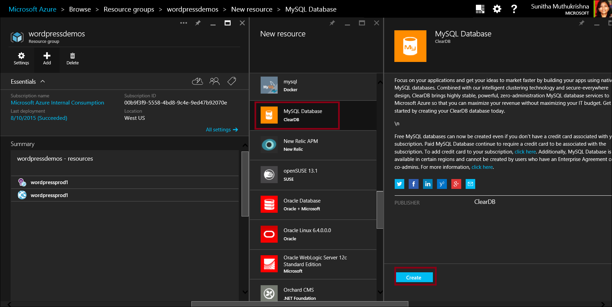
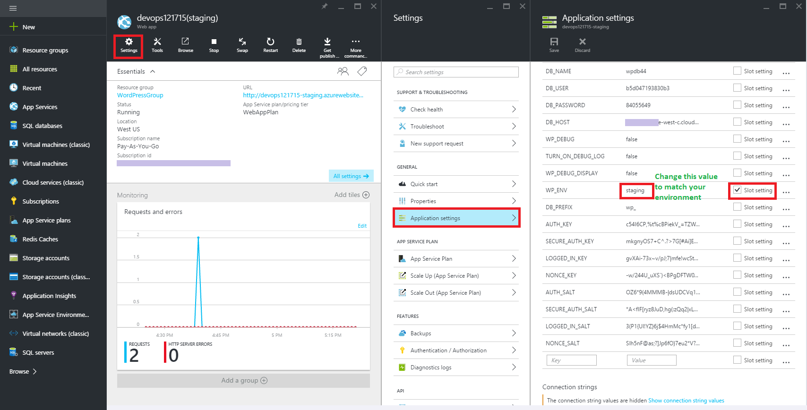
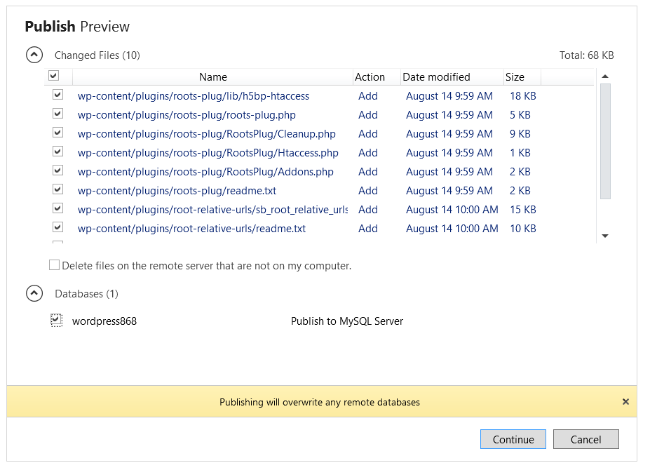
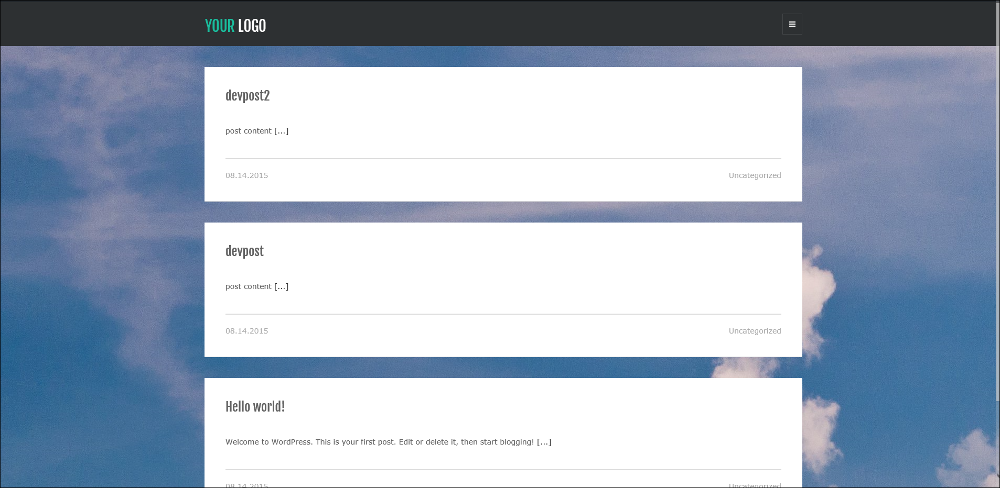
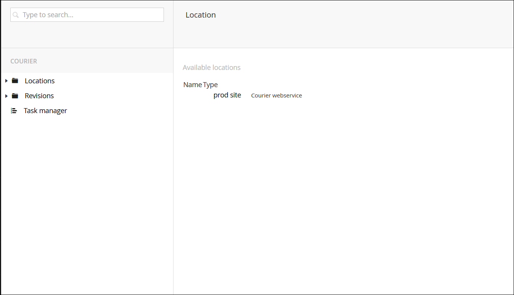
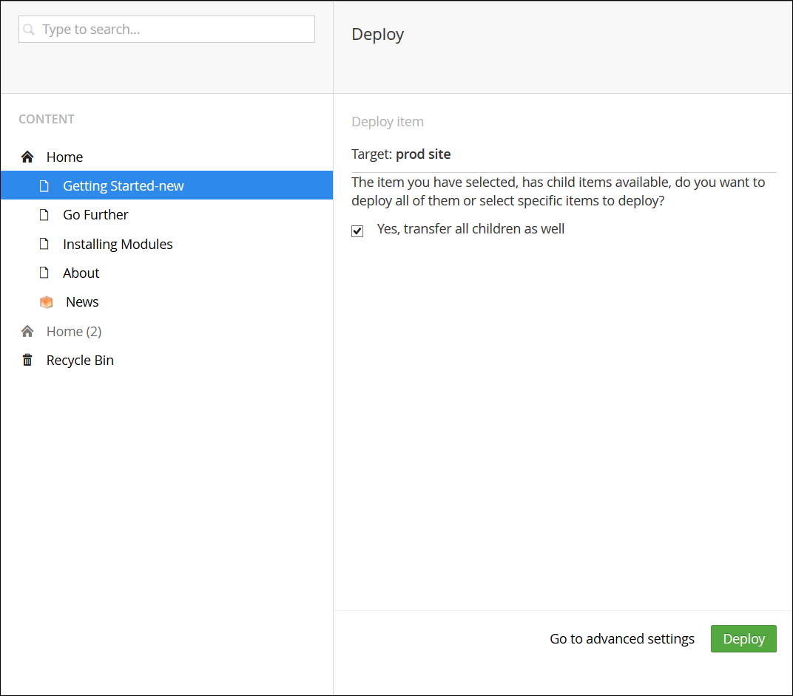

<properties
  pageTitle="Utiliser efficacement les environnements DevOps pour votre application web"
  description="Apprenez à utiliser les emplacements de déploiement pour configurer et gérer plusieurs environnements de développement pour votre application"
  services="app-service\web"
  documentationCenter=""
  authors="sunbuild"
  manager="yochayk"
  editor=""/>

<tags
  ms.service="app-service"
  ms.devlang="na"
  ms.topic="article"
  ms.tgt_pltfrm="na"
  ms.workload="web"
  ms.date="10/24/2016"
  ms.author="sumuth"/>

# <a name="use-devops-environments-effectively-for-your-web-apps"></a>Utilisation des environnements de DevOps efficace pour vos applications web

Cet article vous montre comment configurer et gérer les déploiements d’applications web pour plusieurs versions de votre application comme intermédiaire, q & a et production de développement. Chaque version de votre application peut être considérée comme environnement de développement correspondant à un besoin spécifique au sein de votre processus de déploiement. Par exemple environnement dans q & a peut être utilisée par votre équipe de développeurs pour tester la qualité de l’application avant d’installer les modifications en production.
La configuration de plusieurs environnements de développement peut être une tâche ardue que nécessaire suivre, gérer les ressources (cluster, dans le navigateur, base de données, cache, etc.) et déployer le code dans des environnements.

## <a name="setting-up-a-non-production-environment-stagedevqa"></a>La configuration d’un environnement de test (scène, développement, q & a)
Une fois que vous avez une application web production hausse et en cours d’exécution, l’étape suivante consiste à créer un environnement de test. Pour utiliser les emplacements de déploiement Assurez-vous que vous êtes en mode plan **Standard** ou **Premium** application Service. Emplacements de déploiement sont réellement live web apps avec leurs propres noms d’hôte. Éléments de contenu et de configuration de l’application Web peuvent être transférées entre deux emplacements de déploiement, y compris l’emplacement de production. Déployer votre application dans un emplacement de déploiement offre les avantages suivants :

1. Vous pouvez valider des modifications de l’application web dans un emplacement de déploiement intermédiaire avant d’inversion avec l’emplacement de production.
2. Déployer une application web sur un emplacement tout d’abord et inversion en production garantissent que toutes les instances de l’emplacement sont échauffés avant échangées en production. Cela supprime le temps d’arrêt lorsque vous déployez votre application web. La redirection du trafic est transparente et aucune demande n’est abandonnées en raison d’opérations de permutation. Ce flux de travail peut être automatisée en configurant [Automatique intervertir](web-sites-staged-publishing.md#configure-auto-swap-for-your-web-app) lors de la validation avant permutation n’est pas nécessaire.
3. Après une permutation, l’emplacement avec l’application web précédemment intermédiaire comporte maintenant l’application web production précédent. Si les modifications échangées dans l’emplacement de production sont pas comme prévu, vous pouvez effectuer la même permutation immédiatement pour obtenir votre « dernière connus bonne web app » précédent.

Pour configurer un emplacement de déploiement intermédiaire, voir [configurer la mise en environnements pour les applications web dans le Service d’application Azure](web-sites-staged-publishing.md). Chaque environnement doit inclure son propre jeu de ressources, par exemple si vous web application utilise une base de données puis production et intermédiaire dans le navigateur doivent utiliser différentes bases de données. Ajouter des ressources de l’environnement intermédiaire développement telles que la base de données, de stockage ou du cache de configuration de votre environnement de développement intermédiaire.

## <a name="examples-of-using-multiple-development-environments"></a>Exemples d’utilisation de plusieurs environnements de développement

N’importe quel projet doit suivre une gestion de code source avec au moins deux environnements, un environnement de développement et de production, mais lorsque utilisant des systèmes de gestion de contenu, structures d’Application etc. nous pouvons rencontrer des problèmes dans lequel l’application ne reconnaît pas ce scénario prêts à l’emploi. C’est vrai pour certains des structures populaires présentés ci-dessous. Combien de questions viennent à l’esprit lorsque vous travaillez avec une CMS/Framework tels que

1. Comment rompre arrière dans différents environnements
2. Quels fichiers puis-je modifier et fonctionne ont une incidence sur mises à jour de la version framework
3. Comment gérer la configuration par environnement
4. Comment gérer les mises à jour de la version de modules/plug-ins, core framework version mises à jour

Il existe plusieurs manières de configurer un environnement plusieurs pour votre projet et les exemples ci-dessous sont une seule de ces méthodes les applications correspondantes.

### <a name="wordpress"></a>WordPress
Dans cette section, vous allez apprendre à configurer un flux de travail de déploiement à l’aide d’emplacements pour WordPress. WordPress comme la plupart des solutions CMS ne reconnaît pas travailler avec plusieurs environnements de développement prêts à l’emploi. Application Service Web Apps comporte quelques fonctionnalités qui facilitent la stocker les paramètres de configuration en dehors de votre code.

Avant de créer un emplacement intermédiaire, configurez votre code de l’application pour prendre en charge plusieurs environnements. Pour prendre en charge plusieurs environnements dans WordPress, vous devez modifier `wp-config.php` dans votre application web développement local, ajoutez le code suivant au début du fichier. Cela vous permet de votre application sélectionner la configuration correcte basée sur l’environnement sélectionné.

```
// Support multiple environments
// set the config file based on current environment
if (strpos($_SERVER['HTTP_HOST'],'localhost') !== false) {
// local development
 $config_file = 'config/wp-config.local.php';
}
elseif ((strpos(getenv('WP_ENV'),'stage') !== false) || (strpos(getenv('WP_ENV'),'prod' )!== false ))
//single file for all azure development environments
 $config_file = 'config/wp-config.azure.php';
}
$path = dirname(__FILE__). '/';
if (file_exists($path. $config_file)) {
// include the config file if it exists, otherwise WP is going to fail
require_once $path. $config_file;
```

Créer un dossier sous la racine de l’application web appelée `config` et ajouter un fichier deux fichiers : `wp-config.azure.php` et `wp-config.local.php` représentant votre environnement local et azure respectivement.

Copiez le texte suivant dans `wp-config.local.php` :

```
<?php
// MySQL settings
/** The name of the database for WordPress */

define('DB_NAME', 'yourdatabasename');

/** MySQL database username */
define('DB_USER', 'yourdbuser');

/** MySQL database password */
define('DB_PASSWORD', 'yourpassword');

/** MySQL hostname */
define('DB_HOST', 'localhost');
/**
 * For developers: WordPress debugging mode.
 * * Change this to true to enable the display of notices during development.
 * It is strongly recommended that plugin and theme developers use WP_DEBUG
 * in their development environments.
 */
define('WP_DEBUG', true);

//Security key settings
define('AUTH_KEY', 'put your unique phrase here');
define('SECURE_AUTH_KEY','put your unique phrase here');
define('LOGGED_IN_KEY','put your unique phrase here');
define('NONCE_KEY', 'put your unique phrase here');
define('AUTH_SALT', 'put your unique phrase here');
define('SECURE_AUTH_SALT', 'put your unique phrase here');
define('LOGGED_IN_SALT', 'put your unique phrase here');
define('NONCE_SALT', 'put your unique phrase here');

/**
 * WordPress Database Table prefix.
 *
 * You can have multiple installations in one database if you give each a unique
 * prefix. Only numbers, letters, and underscores please!
 */
$table_prefix = 'wp_';
```

Définissant les clés de sécurité ci-dessus peut aider votre application web empêche le piratée, donc utiliser des valeurs uniques. Si vous avez besoin générer la chaîne de clés de sécurité présentés ci-dessus, vous pouvez accéder au générateur automatique pour créer des clés/valeurs à l’aide de ce [lien] (https://api.wordpress.org/secret-key/1.1/salt)

Copiez le code suivant dans `wp-config.azure.php`:


``` <?php
    // MySQL settings
    /** The name of the database for WordPress */
    
    define('DB_NAME', getenv('DB_NAME'));
    
    /** MySQL database username */
    define('DB_USER', getenv('DB_USER'));
    
    /** MySQL database password */
    define('DB_PASSWORD', getenv('DB_PASSWORD'));
    
    /** MySQL hostname */
    define('DB_HOST', getenv('DB_HOST'));
    
    /**
    * For developers: WordPress debugging mode.
    *
    * Change this to true to enable the display of notices during development.
    * It is strongly recommended that plugin and theme developers use WP_DEBUG
    * in their development environments.
    * Turn on debug logging to investigate issues without displaying to end user. For WP_DEBUG_LOG to
    * do anything, WP_DEBUG must be enabled (true). WP_DEBUG_DISPLAY should be used in conjunction
    * with WP_DEBUG_LOG so that errors are not displayed on the page */
    
    */
    define('WP_DEBUG', getenv('WP_DEBUG'));
    define('WP_DEBUG_LOG', getenv('TURN_ON_DEBUG_LOG'));
    define('WP_DEBUG_DISPLAY',false);
    
    //Security key settings
    /** If you need to generate the string for security keys mentioned above, you can go the automatic generator to create new keys/values: https://api.wordpress.org/secret-key/1.1/salt **/
    define('AUTH_KEY',getenv('DB_AUTH_KEY'));
    define('SECURE_AUTH_KEY', getenv('DB_SECURE_AUTH_KEY'));
    define('LOGGED_IN_KEY', getenv('DB_LOGGED_IN_KEY'));
    define('NONCE_KEY', getenv('DB_NONCE_KEY'));
    define('AUTH_SALT', getenv('DB_AUTH_SALT'));
    define('SECURE_AUTH_SALT', getenv('DB_SECURE_AUTH_SALT'));
    define('LOGGED_IN_SALT',  getenv('DB_LOGGED_IN_SALT'));
    define('NONCE_SALT',  getenv('DB_NONCE_SALT'));
    
    /**
    * WordPress Database Table prefix.
    *
    * You can have multiple installations in one database if you give each a unique
    * prefix. Only numbers, letters, and underscores please!
    */
    $table_prefix = getenv('DB_PREFIX');
```

#### <a name="use-relative-paths"></a>Utiliser des chemins relatifs
Une dernière chose consiste à configurer l’application WordPress pour utiliser les chemins d’accès relatifs. WordPress stocke des informations d’URL dans la base de données. Cela rend le déplacement du contenu d’un environnement vers un autre plus difficile que vous devez mettre à jour la base de données chaque fois que vous changez de local sur la scène ou scène environnements de production. Pour réduire les risques en matière de problèmes peut être dû au déploiement d’une base de données chaque fois que vous déployez à partir d’un environnement utilisez le [plug-in de racine Relative des liens](https://wordpress.org/plugins/root-relative-urls/) qui peut être installé à l’aide du tableau de bord WordPress administrateur ou télécharger manuellement à partir [d’ici](https://downloads.wordpress.org/plugin/root-relative-urls.zip).


Ajoutez les entrées suivantes à votre `wp-config.php` fichier avant la `That's all, stop editing!` commentaire :

```

  define('WP_HOME', 'http://'. filter_input(INPUT_SERVER, 'HTTP_HOST', FILTER_SANITIZE_STRING));
    define('WP_SITEURL', 'http://'. filter_input(INPUT_SERVER, 'HTTP_HOST', FILTER_SANITIZE_STRING));
    define('WP_CONTENT_URL', '/wp-content');
    define('DOMAIN_CURRENT_SITE', filter_input(INPUT_SERVER, 'HTTP_HOST', FILTER_SANITIZE_STRING));
```

Activer le plug-in par le biais du `Plugins` menu Tableau de bord WordPress administrateur. Enregistrez vos paramètres de lien permanent WordPress application.

#### <a name="the-final-wp-configphp-file"></a>La dernière `wp-config.php` fichier
Les mises à jour WordPress Core n’affectent pas votre `wp-config.php`, `wp-config.azure.php` et `wp-config.local.php` fichiers. En fin de cette façon `wp-config.php` fichier ressemble à ceci

```
<?php
/**
 * The base configurations of the WordPress.
 *
 * This file has the following configurations: MySQL settings, Table Prefix,
 * Secret Keys, and ABSPATH. You can find more information by visiting
 *
 * Codex page. You can get the MySQL settings from your web host.
 *
 * This file is used by the wp-config.php creation script during the
 * installation. You don't have to use the web web app, you can just copy this file
 * to "wp-config.php" and fill in the values.
 *
 * @package WordPress
 */

// Support multiple environments
// set the config file based on current environment
if (strpos($_SERVER['HTTP_HOST'],'localhost') !== false) { // local development
  $config_file = 'config/wp-config.local.php';
}
elseif ((strpos(getenv('WP_ENV'),'stage') !== false) ||(strpos(getenv('WP_ENV'),'prod' )!== false )){
  $config_file = 'config/wp-config.azure.php';
}


$path = dirname(__FILE__). '/';
if (file_exists($path. $config_file)) {
  // include the config file if it exists, otherwise WP is going to fail
  require_once $path. $config_file;
}

/** Database Charset to use in creating database tables. */
define('DB_CHARSET', 'utf8');

/** The Database Collate type. Don't change this if in doubt. */
define('DB_COLLATE', '');


/* That's all, stop editing! Happy blogging. */

define('WP_HOME', 'http://'. $_SERVER['HTTP_HOST']);
define('WP_SITEURL', 'http://'. $_SERVER['HTTP_HOST']);
define('WP_CONTENT_URL', '/wp-content');
define('DOMAIN_CURRENT_SITE', $_SERVER['HTTP_HOST']);

/** Absolute path to the WordPress directory. */
if ( !defined('ABSPATH') )
    define('ABSPATH', dirname(__FILE__). '/');

/** Sets up WordPress vars and included files. */
require_once(ABSPATH. 'wp-settings.php');
```

#### <a name="set-up-a-staging-environment"></a>Configurer un environnement de mise en attente
En supposant que vous disposez déjà d’une application web WordPress en cours d’exécution sur Azure Web, connexion au [portail Azure Gestion Preview](http://portal.azure.com) et accédez à votre application web WordPress. Applications If pas en créer un à partir de la place de marché. Pour plus d’informations, [Cliquez ici](web-sites-php-web-site-gallery.md).
Cliquez sur Paramètres -> déploiement emplacements -> Ajouter pour créer un emplacement de déploiement avec la scène de nom. Un emplacement de déploiement est une autre application web partageant les mêmes ressources en tant que l’application web principal créé ci-dessus.


Ajouter une autre base de données MySQL, par exemple `wordpress-stage-db` à votre groupe de ressources `wordpressapp-group`.

 

Mettre à jour les chaînes de connexion de votre emplacement de déploiement de partage pointer vers la base de données nouvellement créé, `wordpress-stage-db`. Notez que votre production web app, `wordpressprodapp` et intermédiaire web app `wordpressprodapp-stage` doivent pointer vers différentes bases de données.

#### <a name="configure-environment-specific-app-settings"></a>Configurer les paramètres d’application spécifiques à l’environnement
Les développeurs peuvent stocker des paires de chaînes clé-valeur dans Azure dans le cadre des informations de configuration associées à une application web appelée paramètres de l’application. En cours d’exécution, application de Service Web Apps automatiquement récupère les valeurs suivantes pour vous et les rend disponible pour le code en cours d’exécution dans votre application web. À partir d’une transaction perspective est un côté piles bénéficier depuis des informations sensibles telles que les chaînes de connexion de base de données avec les mots de passe jamais apparaissent sous forme de texte clair dans un fichier tel que `wp-config.php`.

Ce processus défini ci-dessous est utile lorsque vous effectuez qu’elle comprenne les modifications de fichier et les modifications de base de données WordPress application :
- Mise à niveau WordPress
- Ajouter, modifier ou mettre à niveau les plug-ins
- Ajouter, modifier ou mettre à niveau des thèmes

Configurer les paramètres d’application pour :

- informations de base de données
- activation/désactivation de l’enregistrement WordPress
- Paramètres de sécurité WordPress



Vérifiez que vous avez ajouté les paramètres d’application suivants pour votre emplacement production web app et de partage. Notez que la production web app et la mise en attente dans le navigateur utilisent différentes bases de données.
Désactivez la case à cocher de **Paramètre emplacement** pour tous les paramètres de paramètres à l’exception de WP_ENV. Cela bascule la configuration de votre application web, ainsi que le contenu et les fichiers de base de données. Si **Emplacement paramètre** est **activé**, paramètres de l’application de l’application web et la configuration de chaîne de connexion seront déplace pas dans les environnements lorsque vous effectuez une opération de permutation et par conséquent, si les modifications de base de données sont présentes cela pas sauts de page votre application web de production.

Déployer le développement local environnement web app scène web app et base de données à l’aide de WebMatrix ou outils de votre choix, tels que FTP, Git ou PhpMyAdmin.



Recherchez et testez votre application web intermédiaire. Étant donné un scénario où le thème de l’application web doit être mis à jour, voici la mise en attente dans le navigateur.




 Si tous de test vous convient, cliquez sur le bouton **intervertir** dans votre application web intermédiaire pour déplacer votre contenu vers l’environnement de production. Dans ce cas vous échangez l’application web et la base de données dans des environnements durant chaque **permutation** .


 > [AZURE.NOTE]
 >Si vous avez un scénario où vous devez uniquement les fichiers push (aucune mise à jour de base de données), puis **Vérifiez** le **Paramètre d’emplacement** pour la base de données associées *paramètres de l’application* et les *paramètres de chaînes de connexion* dans la carte de paramètre d’application web au sein du portail preview Azure avant d’effectuer le remplacement. Dans ce cas DB_NAME, DB_HOST, DB_PASSWORD, DB_USER, paramètre de chaîne de connexion par défaut ne doit pas apparaissent-elles dans Aperçu des modifications lorsque vous effectuez un **échanger**. AT cette fois, avoir terminé l’opération **intervertir** l’application web WordPress aura les mises à jour des fichiers **uniquement**.

Avant d’effectuer une permutation, voici l’application production WordPress web 

Après l’opération changez-les de place, le thème a été mis à jour dans votre application web de production.


Dans une situation lorsque vous souhaitez **restaurer**, vous pouvez atteindre les paramètres de production web app et cliquez sur le bouton **échange** pour le remplacement de l’application web et la base de données à partir de production dans un emplacement intermédiaire. Une importante chose à retenir est que si les modifications de base de données sont incluses dans une opération de **remplacement** à un moment donné, puis la prochaine fois que vous déployez de nouveau à votre application web intermédiaire, que vous devez déployer la base de données change à la base de données active pour votre application web intermédiaire qui pourrait être la base de données de production précédent ou la base de données secondaire.

#### <a name="summary"></a>Résumé
Généraliser le processus de n’importe quelle application avec une base de données

1. Installer des applications sur votre environnement local
2. Inclure configuration spécifique de l’environnement (local et Azure Web App)
3. Configurer votre environnement dans l’application de Service Web Apps – mise en attente, Production
4. Si vous avez une application de production déjà en cours d’exécution sur Azure, synchroniser votre contenu à l’environnement local et intermédiaire production (fichiers/code + base de données).
5. Développer votre application sur votre environnement local
6. Placez votre application web production sous maintenance ou mode verrouillé et base de données de la synchronisation du contenu à partir de production pour les environnements de test et de développement
7. Déployer environnement intermédiaire et Test
8. Déployer dans un environnement de Production
9. Répétez les étapes 4 à 6

### <a name="umbraco"></a>Umbraco
Dans cette section, vous allez apprendre comment Umbraco CMS utilise un module personnalisé pour déployer à partir de plusieurs DevOps environnement. Cet exemple montre comment vous offre une approche de gestion de plusieurs environnements de développement différente.

[Umbraco CMS](http://umbraco.com/) est un des popular.NET CMS solutions utilisées par les nombreux développeurs qui fournit module [Courier2](http://umbraco.com/products/more-add-ons/courier-2) pour déployer à partir de développement mis en œuvre aux environnements de production. Vous pouvez facilement créer un environnement de développement local pour une application web Umbraco CMS à l’aide de Visual Studio ou WebMatrix.

1. Créer une application web Umbraco avec Visual Studio, [Cliquez ici](https://our.umbraco.org/documentation/Installation/install-umbraco-with-nuget).
2. Pour créer une application web Umbraco avec WebMatrix, [Cliquez ici](http://umbraco.com/help-and-support/video-tutorials/getting-started/working-with-webmatrix).

N’oubliez pas de supprimer la `install` dossier sous votre application et jamais Téléchargez-le sur les applications web de partage ou de production. Pour ce didacticiel, j’utilise WebMatrix

#### <a name="set-up-a-staging-environment"></a>Configurer un environnement intermédiaire
- Créer un emplacement de déploiement comme indiqué ci-dessus pour Umbraco CMS web app, en supposant que vous disposez déjà d’une application web Umbraco CMS vers le haut et en cours d’exécution. Si ce n’est pas le cas, vous pouvez créer un à partir de la place de marché.

- Mettre à jour la chaîne de connexion de votre emplacement de déploiement de partage pointer vers la base de données nouvellement créé, **umbraco-étape-db**. Votre production web app (umbraositecms-1) et intermédiaire dans le navigateur (umbracositecms 1-secondaire) **doivent** pointent vers différentes bases de données.


- Cliquez sur **obtenir publier des paramètres** pour l' emplacement de déploiement **scène**. Cela télécharge un fichier de paramètres de publication qui stockent toutes les informations requises Visual Studio ou une matrice Web pour publier votre application à partir de développement local web app sur Azure dans le navigateur.

 

- Ouvrez votre application web développement local dans **WebMatrix** ou **Visual Studio**. Dans ce didacticiel, j’utilise Web matrice et vous devez tout d’abord importer le fichier de paramètres de publication pour votre application web intermédiaire


- Effectuer des modifications dans la boîte de dialogue et déployer votre application web local dans votre application web Azure, *umbracositecms 1-secondaire*. Lorsque vous déployez des fichiers directement dans votre application web intermédiaire vous supprime tous les fichiers dans le `~/app_data/TEMP/` mise en route de comme ces régénérer lors de l’application web de partage de dossier. Vous devez également omettre le `~/app_data/umbraco.config` fichier en tant que cela, trop, sera régénérer.


- Après publication avec succès l’application web local Umbraco mis en œuvre dans le navigateur, accédez à votre application web intermédiaire et effectuer quelques tests pour éliminer les éventuels problèmes.

#### <a name="set-up-courier2-deployment-module"></a>Configurer le module de déploiement Courier2
Avec module [Courier2](http://umbraco.com/products/more-add-ons/courier-2) vous pouvez distribuer le contenu, les feuilles de style, modules de développement et bien plus encore avec un simple avec le bouton droit à partir d’une application web intermédiaire pour production web app pour un déploiement gratuit contraintes plus et réduire les risques d’annulation de votre application web de production lorsque vous déployez une mise à jour.
Acheter une licence pour Courier2 pour le domaine `*.azurewebsites.net` et votre domaine personnalisé (par exemple http://abc.com) une fois que vous avez acheté la licence, placez la licence téléchargée (. Fichier LIC) dans le `bin` dossier.


Télécharger le package Courier2 [ici](https://our.umbraco.org/projects/umbraco-pro/umbraco-courier-2/). Connectez-vous à votre application web de partage, dire http://umbracocms-site-stage.azurewebsites.net/umbraco et cliquez sur le Menu **développeur** et sélectionnez **Packages**. Cliquez sur **installer** un package local


Télécharger le package courier2 en utilisant le programme d’installation.


Pour configurer vous devez mettre à jour le fichier courier.config sous le dossier de **configuration** de votre application web.

```xml
<!-- Repository connection settings -->
 <!-- For each site, a custom repository must be configured, so Courier knows how to connect and authenticate-->
 <repositories>
    <!-- If a custom Umbraco Membership provider is used, specify login & password + set the passwordEncoding to clear: -->
    <repository name="production web app" alias="stage" type="CourierWebserviceRepositoryProvider" visible="true">
      <url>http://umbracositecms-1.azurewebsites.net</url>
      <user>0</user>
      <!--<login>user@email.com</login> -->
      <!-- <password>user_password</password>-->
      <!-- <passwordEncoding>Clear</passwordEncoding>-->
      </repository>
 </repositories>
 ```

Sous `<repositories>`, entrez les informations utilisateur et URL du site production. Si vous utilisez le fournisseur d’appartenance Umbraco par défaut, puis ajouter l’ID de l’utilisateur d’Administration dans <user> section. Si vous utilisez un fournisseur d’appartenances Umbraco personnalisé, utilisez `<login>`,`<password>` Courier2 module cherchez à vous connecter au site de production. Pour plus d’informations, consultez la [documentation](http://umbraco.com/help-and-support/customer-area/courier-2-support-and-download/developer-documentation) de module courrier.

De même, installer le module Courier sur votre site de production et configurez-le point à étape web app dans son fichier courier.config respectifs comme illustré ici

```xml
 <!-- Repository connection settings -->
 <!-- For each site, a custom repository must be configured, so Courier knows how to connect and authenticate-->
 <repositories>
    <!-- If a custom Umbraco Membership provider is used, specify login & password + set the passwordEncoding to clear: -->
    <repository name="Stage web app" alias="stage" type="CourierWebserviceRepositoryProvider" visible="true">
      <url>http://umbracositecms-1-stage.azurewebsites.net</url>
      <user>0</user>
      </repository>
 </repositories>
```

Cliquez sur onglet Courier2 dans le tableau de bord Umbraco CMS web app, sélectionnez emplacements. Vous devez voir le nom du référentiel comme indiqué dans `courier.config`. Procédez comme suit sur votre production et mis en œuvre des applications web.



Vous permet de déployer du contenu de site intermédiaire sur site de production. Accédez au contenu et sélectionner une page existante ou créer une nouvelle page. Je sélectionner une page existante à partir de mon application web dans lequel le titre de la page est remplacé par **Mise en route – nouveau** et cliquez sur **Enregistrer et publier**.


Sélectionnez maintenant la page modifiée et *cliquez avec le bouton droit sur* pour afficher toutes les options. Cliquez sur **courrier** pour afficher la boîte de dialogue déploiement. Cliquez sur **déployer** pour lancer le déploiement



Examinez les modifications, puis cliquez sur Continuer.


Journal de déploiement indique si le déploiement a réussi.

 

Accédez à votre application web de production pour voir si les modifications sont répercutées.

 

Pour plus d’informations sur l’utilisation de courrier, consultez la documentation.

#### <a name="how-to-upgrade-umbraco-cms-version"></a>Comment mettre à niveau de version Umbraco CMS

Courier ne permettra pas déployer avec la mise à niveau à partir d’une version de Umbraco CMS vers un autre. Lorsque la mise à niveau de version Umbraco CMS, vous devez vérifier incompatibilité avec vos modules personnalisés ou modules tiers et les bibliothèques Umbraco Core. Meilleurs résultats

1. Sauvegardez toujours votre application web et la base de données avant d’effectuer une mise à niveau. Sous Azure Web App, vous pouvez configurer des sauvegardes automatiques pour vos sites Web à l’aide de la sauvegarde les fonctionnalités et de restaurer votre site si nécessaire à l’aide de restaurer fonctionnalité. Pour plus d’informations, voir [Comment faire pour sauvegarder votre application web](web-sites-backup.md) et [comment restaurer votre application web](web-sites-restore.md).

2. Vérifiez si les packages tiers que vous utilisez sont compatibles avec la version que vous avez mise à niveau vers. Page de téléchargement du package, vérifiez la compatibilité des projets avec la version Umbraco CMS.

Pour plus d’informations sur la mise à niveau votre application web localement, suivez les instructions comme mentionné [ici](https://our.umbraco.org/documentation/getting-started/set up/upgrading/general).

Une fois que votre site de développement local est mis à niveau, publier les modifications sur les intermédiaires dans le navigateur. Tester votre application et si tous les test vous convient, utilisez bouton **intervertir** pour **échanger** votre site intermédiaire à production web app. Lorsque vous effectuez l’opération de **remplacement** , vous pouvez afficher les modifications qui seront affectées dans la configuration de votre application web. Cette opération **intervertir** , nous allons inversion les applications web et les bases de données. Cela signifie que, une fois que l’échange de l’application web production pointe maintenant sur base de données umbraco-étape-db et intermédiaire application web pointe vers umbraco produit-base de données de base de données.


L’avantage d’échange de l’application web et la base de données :
1. Vous donne la possibilité pour revenir à la version précédente de votre application web avec un autre **intervertir** si il existe des problèmes d’application.
2. Une mise à niveau, vous devez déployer des fichiers et base de données à partir de la mise en attente de production web app et base de données dans le navigateur. Il existe plusieurs choses que vous pouvant rencontrer des problèmes lors du déploiement de fichiers et base de données. En utilisant la fonctionnalité **échange** d’emplacements, nous puissions réduire les temps d’arrêt pendant une mise à niveau et réduire les risques d’erreurs qui peuvent survenir lorsque vous déployez des modifications.
3. Vous donne la possibilité d’effectuer **A / B test** à l’aide de la fonctionnalité de [test de production](https://azure.microsoft.com/documentation/videos/introduction-to-azure-websites-testing-in-production-with-galin-iliev/)

Cet exemple montre la flexibilité de la plateforme qui vous pouvez de créer des modules personnalisés similaires au module Umbraco Courier pour gérer le déploiement dans des environnements.

## <a name="references"></a>Références
[Développement Agile avec le Service d’application Azure](app-service-agile-software-development.md)

[Configurer la mise en environnements pour les applications web dans le Service d’application Azure](web-sites-staged-publishing.md)

[Comment faire pour bloquer l’accès aux emplacements de déploiement de production non web](http://ruslany.net/2014/04/azure-web-sites-block-web-access-to-non-production-deployment-slots/)
