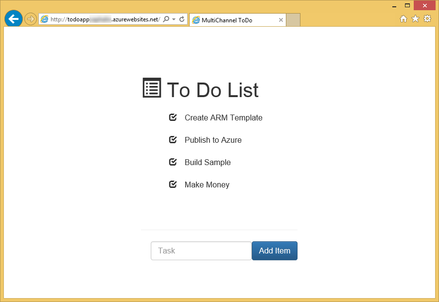
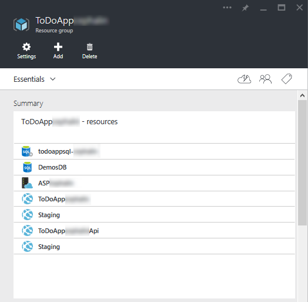

<properties
    pageTitle="Déploiement flighting (test bêta) dans le Service d’application Azure"
    description="Découvrez comment flight nouvelles fonctionnalités dans votre application ou vos mises à jour dans ce didacticiel de bout en bout pour le test bêta. Il réunit application Service fonctionnalités telles que publication continue, emplacements, le routage du trafic et l’intégration des perspectives d’Application."
    services="app-service\web"
    documentationCenter=""
    authors="cephalin"
    manager="wpickett"
    editor=""/>

<tags
    ms.service="app-service-web"
    ms.workload="web"
    ms.tgt_pltfrm="na"
    ms.devlang="na"
    ms.topic="article"
    ms.date="02/02/2016"
    ms.author="cephalin"/>
# Déploiement flighting (test bêta) dans le Service d’application Azure

Ce didacticiel montre comment effectuer des *déploiements flighting* en intégrant les différentes fonctionnalités de [Service d’application Azure](http://go.microsoft.com/fwlink/?LinkId=529714) et des [Idées que Application Azure](/services/application-insights/). 

*Flighting* est un processus de déploiement qui valide une nouvelle fonctionnalité ou les modifier avec un nombre limité de clients réels et teste majeur dans un scénario de production. Il est similaire à la version bêta test et parfois appelé « test contrôlé aérienne ». Nombre de grandes entreprises avec une présence web utilisent cette approche pour accéder au plus tôt validation sur leurs mises à jour de l’application dans leurs pratiques de [développement agile](https://en.wikipedia.org/wiki/Agile_software_development). Azure Application Service permet de test en production intégrer de publication continue et les idées d’Application pour implémenter le même scénario DevOps. Cette approche présentent les avantages suivants :

- **Gain réel commentaires _avant_ sont mises à jour en production** - le mieux obtenant commentaires dès que vous relâchez se distingue commentaires avant de relâcher la touche. Vous pouvez tester les mises à jour avec le trafic utilisateur réel et comportements dès que vous le souhaitez dans le cycle de vie du produit.
- **Amélioration [continu développement piloté par test (CTDD)](https://en.wikipedia.org/wiki/Continuous_test-driven_development) ** - grâce à l’intégration de test en production avec intégration continue et d’instrumentation avec des aperçus de l’Application, validation de l’utilisateur qui se produit au plus tôt et automatiquement dans votre vie des produits. Cela permet de réduire les investissements de départ dans l’exécution des tests manuel.
- **Optimiser tester le flux de travail** - grâce à l’automatisation test en production avec instrumentation analyse continue, vous pouvez potentiellement accomplir les objectifs de différents types de tests dans un seul processus, tels que [l’intégration](https://en.wikipedia.org/wiki/Integration_testing) [régression](https://en.wikipedia.org/wiki/Regression_testing), [facilité d’utilisation](https://en.wikipedia.org/wiki/Usability_testing), d’accessibilité, localisation, [performance](https://en.wikipedia.org/wiki/Software_performance_testing), [sécurité](https://en.wikipedia.org/wiki/Security_testing)et [acceptation](https://en.wikipedia.org/wiki/Acceptance_testing).

Un déploiement flighting est pratiquement pas le routage du trafic. Dans un tel déploiement que vous souhaitez obtenir un aperçu aussi rapidement que possible, s’il être un bogue inattendu, une baisse des performances, problèmes d’expérience utilisateur. Rappelez-vous que vous travaillez avec des clients. Pour y parvenir droite, vous devez vous assurer que vous avez configuré votre déploiement flighting pour rassembler toutes les données que vous avez besoin pour prendre une décision judicieuse pour l’étape suivante. Ce didacticiel montre comment collecter des données avec des aperçus de l’Application, mais vous pouvez utiliser Relic nouveau ou autres technologies adapté à votre scénario. 

## Ce que vous ferez

Dans ce didacticiel, vous allez apprendre à importer les scénarios suivants pour tester votre application de Service d’application en production :

- [Acheminer le trafic de production](app-service-web-test-in-production-get-start.md) dans votre application bêta
- [Instrument votre application](../application-insights/app-insights-web-track-usage.md) pour obtenir des métriques utiles
- Déployez votre application bêta et suivre les mesures de l’application en continu
- Comparer des mesures entre l’application de production et l’application bêta pour voir comment les modifications du code traduisent des résultats

## Composants nécessaires

-   Un compte Azure
-   Un compte [GitHub](https://github.com/)
- Visual Studio 2015 - vous pouvez télécharger l' [Édition Communauté](https://www.visualstudio.com/en-us/products/visual-studio-express-vs.aspx).
-   GIT Shell (installé avec [GitHub pour Windows](https://windows.github.com/)) - Cela vous permet d’exécuter des commandes à la fois le Git et PowerShell dans la même session
-   Dernière [Azure PowerShell](https://github.com/Azure/azure-powershell/releases/download/v0.9.8-September2015/azure-powershell.0.9.8.msi) bits
-   Fonctionnement de base des opérations suivantes :
    -   Déploiement de modèle [Azure le Gestionnaire de ressources](../azure-resource-manager/resource-group-overview.md) (voir [déployer une application complexe mis dans Azure](app-service-deploy-complex-application-predictably.md))
    -   [GIT](http://git-scm.com/documentation)
    -   [PowerShell](https://technet.microsoft.com/library/bb978526.aspx)

> [AZURE.NOTE] Vous avez besoin d’un compte Azure pour effectuer ce didacticiel :
> + Vous pouvez [Ouvrir un compte Azure gratuitement](/pricing/free-trial/) - vous obtenez crédits vous pouvez utiliser pour essayer de services Azure payants et même après leur utilisation vous pouvez conserver le compte et libérer de l’utilisation des services Azure, tels que des applications Web.
> + Vous pouvez [Activer les avantages d’abonné Visual Studio](/pricing/member-offers/msdn-benefits-details/) : Visual Studio votre abonnement fournit les crédits chaque mois que vous pouvez utiliser pour les services Azure payants.
>
> Si vous voulez commencer à utiliser le Service d’application Azure avant de vous inscrire pour un compte Azure, accédez à [Essayer le Service application](http://go.microsoft.com/fwlink/?LinkId=523751), où vous pouvez créer une application web starter courte immédiatement dans le Service d’application. Aucune carte de crédit obligatoire ; Aucune engagements.

## Configurer votre application web de production

>[AZURE.NOTE] Le script utilisé dans ce didacticiel pour configurer automatiquement publication continue à partir de votre référentiel GitHub. Cette fonctionnalité nécessite que vos informations d’identification GitHub sont déjà stockées dans Azure, sinon les scripts de déploiement échouera lorsque vous tentez de configurer les paramètres de contrôle de source pour les applications web.
>
>Pour stocker vos informations d’identification GitHub dans Azure, créez une application web dans le [Portail Azure](https://portal.azure.com/) et [configurer le déploiement GitHub](app-service-continuous-deployment.md#Step7). Vous devez uniquement effectuer cette action une seule fois.

Dans un scénario DevOps classique, vous disposez d’une application qui s’exécute live dans Azure et que vous souhaitez apporter des modifications à la publication continue. Dans ce scénario, vous allez déployer en production un modèle que vous avez développé et testé.

1.  Créer votre propre branche du référentiel [ToDoApp](https://github.com/azure-appservice-samples/ToDoApp) . Pour plus d’informations sur la création de votre branche, voir [branche un mis en pension](https://help.github.com/articles/fork-a-repo/). Une fois votre branche est créé, vous pouvez le voir dans votre navigateur.

    

2.  Ouvrez une session Git Shell. Si vous n’avez pas encore Git Shell, installez maintenant [GitHub pour Windows](https://windows.github.com/) .
3.  Créer une copie locale des votre branche en exécutant la commande suivante :

        git clone https://github.com/<your_fork>/ToDoApp.git

4.  Une fois que votre cloner local, accédez à * &lt;repository_root >*\ARMTemplates et exécuter la deploy.ps1 script avec un suffixe unique, comme indiqué ci-dessous :

        .\deploy.ps1 –RepoUrl https://github.com/<your_fork>/todoapp.git -ResourceGroupSuffix <your_suffix>

4.  Lorsque vous y êtes invité, tapez le nom d’utilisateur souhaité et le mot de passe pour l’accès de base de données. N’oubliez pas vos informations d’identification de base de données, car vous devez spécifier à nouveau lors de la mise à jour le groupe de ressources.

    Vous devriez voir la progression des différentes ressources Azure mise en service. Lorsque le déploiement est terminé, le script pour lancer l’application dans le navigateur et vous offre un signal sonore convivial.
    

6.  Revenez dans votre session Git Shell, exécutez :

        .\swap –Name ToDoApp<your_suffix>

    

7.  Une fois le script terminé, revenez à accéder à adresse de frontend (http://ToDoApp*&lt;your_suffix >*.azurewebsites.net/) pour afficher l’application en cours d’exécution en production.
5.  Connectez-vous au [Portail Azure](https://portal.azure.com/) et prenez connaissance des quel est créé.

    Vous devez être en mesure de voir les deux applications web dans le même groupe de ressources, l’autre avec les `Api` suffixe dans le nom. Si vous examinez l’affichage de groupe de ressources, vous verrez également la base de données SQL et serveur, le plan de services d’application et les emplacements de mise en attente pour les applications web. Naviguer parmi les différentes ressources et comparez-les avec * &lt;repository_root >*\ARMTemplates\ProdAndStage.json pour voir comment ils sont configurés dans le modèle.

    

Vous avez configuré l’application de production.  À présent, nous allons Imaginons que vous recevez des commentaires que facilité d’utilisation est un problème pour l’application. Si vous décidez d’étudier. Vous allez d’instrumentation de votre application pour envoyer des commentaires.

## Déterminer l’origine : Instrument votre application client pour surveillance/indicateurs

5. Ouvrir * &lt;repository_root >*\src\MultiChannelToDo.sln dans Visual Studio.
6. Restaurer tous les packages Nuget par clic droit sur la solution > **Gérer les Packages NuGet pour Solution** > **restaurer**.
6. Avec le bouton droit **MultiChannelToDo.Web** > **Ajouter Application Insights télémétrie** > **Configurer les paramètres** > modifier le groupe de ressources pour ToDoApp*&lt;your_suffix >* > **Ajouter Application Insights au projet**.
7. Dans le portail Azure, ouvrez la carte pour la ressource d’aperçu de l’Application **MultiChannelToDo.Web** . Dans la partie **santé des applications** , cliquez sur **apprendre à collecter les données de chargement de page navigateur** > Copier le code.
7. Ajouter le code d’instrumentation JS copié à * &lt;repository_root >*\src\MultiChannelToDo.Web\app\Index.cshtml, juste avant la formule de politesse `<heading>` balise. Il doit contenir la clé instrumentation uniques de la ressource de l’aperçu de l’Application.

        

11. Envoyer des événements personnalisés analyse des applications pour souris clics en ajoutant le code suivant à la fin du corps :

        

    Cet extrait de code JavaScript envoie un événement personnalisé analyse d’Application chaque fois qu’un utilisateur clique sur n’importe où dans l’application web.

12. Dans Git Shell, validez et transmission vos modifications à votre branche dans GitHub. Attendez que les clients d’actualiser le navigateur.

        git add -A :/
        git commit -m "add AI configuration for client app"
        git push origin master

6.  Remplacez les modifications de l’application déployée en production :

        .\swap –Name ToDoApp<your_suffix>

13. Accédez à la ressource d’analyse de l’Application que vous avez configuré. Cliquez sur les événements personnalisés.

    

    Si vous ne voyez pas les mesures pour les événements personnalisés, patientez quelques minutes, puis cliquez sur **Actualiser**.

Supposons que vous voyez un graphique comme ci-dessous :

Et la grille d’événement ci-dessous :

Selon votre code de l’application ToDoApp, l’événement de **bouton** correspond au bouton Envoyer, et l’événement **Saisie** correspond à la zone de texte. Jusque là, éléments représentatives. Cependant, il semble qu’il existe une grande quantité de clics et quelques clics dans les listes des tâches (les événements de **liste d’horizontale** ).

Basé sur ce problème, vous formulaire votre hypothèse que certains utilisateurs sont confondus quelle partie de l’interface utilisateur est interactif et c’est parce que le curseur est un style pour la sélection de texte lorsqu’il se trouve sur les éléments de liste et leurs icônes.

Il peut s’agir d’un exemple vraiment. Toutefois, vous allez passer d’un amélioration du produit dans votre application et puis exécuter un déploiement flighting pour obtenir des commentaires de facilité d’utilisation des clients live.

### Instrument votre application de serveur de surveillance/mesures
Il s’agit d’une tangente étant donné que le scénario présenté dans ce didacticiel traite uniquement avec l’application client. Toutefois, pour conformité vous allez configurer l’application côté serveur.

6. Avec le bouton droit **MultiChannelToDo** > **Ajouter Application Insights télémétrie** > **Configurer les paramètres** > modifier le groupe de ressources pour ToDoApp*&lt;your_suffix >* > **Ajouter Application Insights au projet**.
12. Dans Git Shell, validez et transmission vos modifications à votre branche dans GitHub. Attendez que les clients d’actualiser le navigateur.

        git add -A :/
        git commit -m "add AI configuration for server app"
        git push origin master

6.  Remplacez les modifications de l’application déployée en production :

        .\swap –Name ToDoApp<your_suffix>

Voilà !

## Déterminer l’origine : Ajouter des balises de spécifiques à l’emplacement à vos mesures application client

Dans cette section, vous allez configurer les emplacements de déploiement différentes pour envoyer télémétrie emplacement spécifique à la même ressource Application perspectives. Ainsi, vous pouvez comparer les données de télémétrie entre le trafic de différents emplacements (environnements de déploiement) pour voir facilement l’effet de vos modifications de l’application. En même temps, vous pouvez séparer le trafic de production du reste afin que vous pouvez continuer à surveiller votre application de production selon vos besoins.

Dans la mesure où vous êtes collecte des données d’un comportement client, vous allez [Ajouter un initialiseur de télémétrie pour votre code JavaScript](../application-insights/app-insights-api-custom-events-metrics.md#js-initializer) dans index.cshtml. Si vous souhaitez tester les performances côté serveur, par exemple, vous pouvez également effectuer de la même façon dans votre code serveur (voir [Application Insights API pour les mesures et les événements personnalisés](../application-insights/app-insights-api-custom-events-metrics.md).

1. Tout d’abord, ajoutez le code entre les deux `//` bloquent les commentaires en dessous dans le code JavaScript que vous avez ajouté à la `<heading>` balise précédemment.

        window.appInsights = appInsights;

        // Begin new code
        appInsights.queue.push(function () {
            appInsights.context.addTelemetryInitializer(function (envelope) {
                var telemetryItem = envelope.data.baseData;
                telemetryItem.properties = telemetryItem.properties || {};
                telemetryItem.properties["Environment"] = "@System.Configuration.ConfigurationManager.AppSettings["environment"]";
            });
        });
        // End new code

        appInsights.trackPageView();

    Ce code initialiseur entraîne la `appInsights` objet à ajouter l’une propriété personnalisée appelée `Environment` à chaque élément de télémétrie il envoie.

2. Ensuite, ajoutez cette propriété personnalisée en tant que [paramètre d’emplacement](web-sites-staged-publishing.md#AboutConfiguration) pour votre application web dans Azure. Pour ce faire, exécutez les commandes suivantes dans votre session Git Shell.

        $app = Get-AzureWebsite -Name todoapp<your_suffix> -Slot production
        $app.AppSettings.Add("environment", "Production")
        $app.SlotStickyAppSettingNames.Add("environment")
        $app | Set-AzureWebsite -Name todoapp<your_suffix> -Slot production

    Le fichier Web.config dans votre projet déjà définit la `environment` paramètre d’application. Avec ce paramètre, lorsque vous testez l’application localement, vos mesures seront marqués avec `VS Debugger`. Toutefois, lorsque vous appuyez sur vos modifications sur Azure, Azure sera rechercher et utiliser la `environment` définition dans configuration de l’application web à la place de l’application et de vos mesures seront marqués avec `Production`.

3. Valider et transmission vos modifications du code à votre branche sur GitHub et attendez pour vos utilisateurs à utiliser la nouvelle application (qu’il soit nécessaire pour actualiser le navigateur). Il dure environ 15 minutes pour la nouvelle propriété s’afficheront dans vos idées Application `MultiChannelToDo.Web` ressource.

        git add -A :/
        git commit -m "add environment property to AI events for client app"
        git push origin master

4. À présent, accédez à la carte **d’événements personnalisés** à nouveau et filtrer les mesures `Environment=Production`. Vous devriez maintenant pouvoir voir tous les événements personnalisés nouveau dans l’emplacement de production avec ce filtre.

    

5. Cliquez sur le bouton **Favoris** pour enregistrer les paramètres actuels de mesures Explorer à s’intitule **événements personnalisés : Production**. Vous pouvez facilement passer cet affichage et un affichage de connecteur déploiement ultérieurement.

    > [AZURE.TIP] Pour encore plus puissant analytique, intégrez [votre ressource Application analyse avec Power BI](../application-insights/app-insights-export-power-bi.md).

### Ajouter des balises spécifiques à l’emplacement à vos mesures application server
Là encore, pour plus de précision vous allez définir l’application côté serveur. Contrairement à l’application de client qui est instrumentée dans JavaScript, balises spécifiques à l’emplacement pour l’application serveur est équipé de code .NET.

1. Ouvrir * &lt;repository_root >*\src\MultiChannelToDo\Global.asax.cs. Ajoutez le bloc de code ci-dessous, juste avant la formule de politesse accolade espace de noms.

        namespace MultiChannelToDo
        {
                ...

                // Begin new code
            public class ConfigInitializer
            : ITelemetryInitializer
            {
                void ITelemetryInitializer.Initialize(ITelemetry telemetry)
                {
                    telemetry.Context.Properties["Environment"] = System.Configuration.ConfigurationManager.AppSettings["environment"];
                }
            }
                // End new code
        }

2. Corriger les erreurs de résolution du nom en ajoutant le `using` instructions ci-dessous au début du fichier :

        using Microsoft.ApplicationInsights.Channel;
        using Microsoft.ApplicationInsights.Extensibility;

3. Ajoutez le code ci-dessous au début de la `Application_Start()` méthode :

        TelemetryConfiguration.Active.TelemetryInitializers.Add(new ConfigInitializer());

3. Valider et appuyez sur vos modifications du code à votre branche sur GitHub et attendez pour vos utilisateurs à utiliser la nouvelle application (qu’il soit nécessaire pour actualiser le navigateur). Il dure environ 15 minutes pour la nouvelle propriété s’afficheront dans vos idées Application `MultiChannelToDo` ressource.

        git add -A :/
        git commit -m "add environment property to AI events for server app"
        git push origin master

## Mise à jour : Configurer votre branche bêta

2. Ouvrir * &lt;repository_root >*\ARMTemplates\ProdAndStagetest.json et rechercher le `appsettings` ressources (recherchez `"name": "appsettings"`). Il existe 4 d'entre eux, une pour chaque emplacement. 

2. Pour chaque `appsettings` ressource, ajouter un `"environment": "[parameters('slotName')]"` paramètre d’application à la fin de la `properties` tableau. N’oubliez pas de mettre fin à la ligne précédente avec une virgule.

    
    
    Vous venez d’ajouter le `environment` paramètre d’application à tous les emplacements dans le modèle.
    
2. Dans le même fichier, recherchez la `slotconfignames` ressources (recherchez `"name": "slotconfignames"`). Il y a 2 d'entre elles, une pour chaque application.

2. Pour chaque `slotconfignames` ressource, ajoutez `"environment"` à la fin de la `appSettingNames` tableau. N’oubliez pas de mettre fin à la ligne précédente avec une virgule.

    Vous venez de créer la `environment` application affectant bâton à son emplacement déploiement respectifs pour les deux applications.  

3. Dans votre session Git Shell, exécutez les commandes suivantes avec le même suffixe de groupe de ressources que vous avez utilisé avant.

        git checkout -b beta
        git push origin beta
        .\deploy.ps1 -RepoUrl https://github.com/<your_fork>/ToDoApp.git -ResourceGroupSuffix <your_suffix> -SlotName beta -Branch beta

4. Lorsque vous y êtes invité, spécifiez les mêmes base de données informations d’identification SQL comme avant. Puis, lorsque vous êtes invité à mettre à jour le groupe de ressources, tapez `Y`, puis `ENTER`.

    Une fois le script terminé, toutes vos ressources dans le groupe de ressources d’origine sont conservés, mais un nouvel emplacement nommé « bêta » est créé avec la même configuration que l’emplacement « Mis en œuvre » qui a été créé dans le début qu’il contient.

    >[AZURE.NOTE] Cette méthode de création de différents environnements de déploiement est différente de la méthode de [développement de logiciels Agile avec Azure Application Service](app-service-agile-software-development.md). Dans ce cas, vous créez des environnements de déploiement avec emplacements de déploiement, où que vous créez environnements de déploiement des groupes de ressources. Gestion des environnements de déploiement des groupes de ressources permet de conserver l’environnement de production immuables pour les développeurs, mais elle n’est pas facile à effectuer des tests de production, vous pouvez effectuer facilement avec emplacements.

Si vous le souhaitez, vous pouvez également créer une application alpha en exécutant

    git checkout -b alpha
    git push origin alpha
    .\deploy.ps1 -RepoUrl https://github.com/<your_fork>/ToDoApp.git -ResourceGroupSuffix <your_suffix> -SlotName beta -Branch alpha

Pour ce didacticiel, vous sera simplement continuer à utiliser votre application bêta.

## Mise à jour : Distribuer les mises à jour à l’application bêta

Revenir à votre application que vous souhaitez améliorer.

1. Vérifiez que vous êtes à présent dans votre branche bêta

        git checkout beta

2. Dans * &lt;repository_root >*\src\MultiChannelToDo.Web\app\Index.cshtml, recherchez la `<li>` ajouter des balises et ajouter la `style="cursor:pointer"` attribut, comme illustré ci-dessous.

    

3. valider et push vers Azure.

4. Vérifiez que la modification est maintenant reflétée dans l’emplacement de la version bêta en accédant à http://todoapp*&lt;your_suffix >*-beta.azurewebsites.net/. Si vous ne voyez pas la modification encore, actualisez votre navigateur pour obtenir le nouveau code javascript.

    

Maintenant que vous avez vos modifications en cours d’exécution dans l’emplacement de la version bêta, vous êtes prêt à effectuer un déploiement flighting.

## Valider : Acheminer le trafic vers l’application bêta

Dans cette section, vous achemine le trafic vers l’application bêta. Pour les besoins de clarté de démonstration, vous allez acheminer une partie significative du trafic utilisateur à celui-ci. En réalité, le volume de trafic que vous souhaitez router varient selon votre situation spécifique. Par exemple, si votre site se trouve à l’échelle de microsoft.com, vous devrez peut-être inférieure à 1 % du total trafic afin d’obtenir des informations utiles.

1. Dans votre session Git Shell, exécutez les commandes suivantes pour acheminer semestre le trafic de production vers l’emplacement de la version bêta :

        $siteName = "ToDoApp<your suffix>"
        $rule = New-Object Microsoft.WindowsAzure.Commands.Utilities.Websites.Services.WebEntities.RampUpRule
        $rule.ActionHostName = "$siteName-beta.azurewebsites.net"
        $rule.ReroutePercentage = 50
        $rule.Name = "beta"
        Set-AzureWebsite $siteName -Slot Production -RoutingRules $rule

  La `ReroutePercentage=50` propriété spécifie que 50 % du trafic production doivent être routés vers URL de l’application bêta (spécifié par le `ActionHostName` propriété).

2. Maintenant accéder au http://ToDoApp*&lt;your_suffix >*. azurewebsites.net. 50 % du trafic doit maintenant être redirigé vers l’emplacement de la version bêta.

3. Dans la ressource Application perspectives, filtrer les mesures en environnement = « bêta ».

    > [AZURE.NOTE] Si vous enregistrez cette vue filtrée en tant que favori un autre, vous pouvez facilement retourner les vues explorer métrique entre les affichages de la version bêta et de production.

Supposons que dans l’Application Insights voir doit ressembler à ce qui suit :

Non seulement cela affiche qu’il n’y a plus grand nombre de clics sur le `<li>` balises, mais il semble une augmentation de clics sur `<li>` balises. Vous pouvez ensuite conclure que personnes ont mis en évidence la nouvelle `<li>` balises sont interactifs et maintenant effacez toutes leurs tâches achevées précédemment dans l’application.

Basé sur les données de votre déploiement flighting, vous décidez que votre nouvelle interface utilisateur est prêt pour la production.

## Mise en service : déplacer votre nouveau code en production

Vous êtes maintenant prêt à déplacer votre mise à jour en production. Rédaction est que maintenant, vous savez que votre mise à jour a déjà été validée _avant_ l’engagé en production. Maintenant que vous pouvez confiance déployer. Dans la mesure où vous avez une mise à jour l’application client AngularJS, vous validée uniquement le code côté client. Si vous deviez apporter des modifications à l’application Web API principale, vous pourriez valider vos modifications de la même façon et aisée.

1. Dans Git Shell, supprimez la règle de routage du trafic en exécutant la commande suivante :

        Set-AzureWebsite $siteName -Slot Production -RoutingRules @()

2. Exécutez les commandes Git :

        git checkout master
        git pull origin master
        git merge beta
        git push origin master

2. Patientez quelques minutes pour le nouveau code à déployer vers l’emplacement intermédiaire, puis lancez http://ToDoApp*&lt;your_suffix >*-staging.azurewebsites.net pour vérifier que la nouvelle mise à jour est échauffé dans l’emplacement intermédiaire. N’oubliez pas que la branche maître de votre branche est liée à l’emplacement de mise en attente de votre application.

3. À présent, remplacez l’emplacement intermédiaire en production

        cd <ROOT>\ToDoApp\ARMTemplates
        .\swap.ps1 -Name todoapp<your_suffix>

## Résumé ##

Azure Application Service facilite pour les petites-moyennes entreprises permettent de tester leurs applications des clients en production, quelque chose qui a été effectuée traditionnellement dans les entreprises volumineux. Nous espérons que ce didacticiel vous a donné les connaissances nécessaires rassembler application Service et Application perspectives pour faciliter le déploiement flighting possible et même d’autres scénarios de test de production, dans le monde DevOps. 

## Ressources complémentaires ##

-   [Développement Agile avec le Service d’application Azure](app-service-agile-software-development.md)
-   [Configurer la mise en environnements pour les applications web dans le Service d’application Azure](web-sites-staged-publishing.md)
-   [Déployer une application complexe mis dans Azure](app-service-deploy-complex-application-predictably.md)
-   [Création de modèles Gestionnaire de ressources Azure](../resource-group-authoring-templates.md)
-   [JSONLint - la validation JSON](http://jsonlint.com/)
-   [GIT branchement – base branchement et la fusion](http://www.git-scm.com/book/en/v2/Git-Branching-Basic-Branching-and-Merging)
-   [PowerShell Azure](../powershell-install-configure.md)
-   [Projet Kudu Wiki](https://github.com/projectkudu/kudu/wiki)
