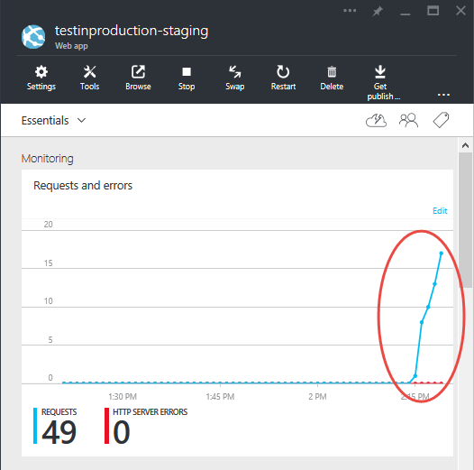

<properties
    pageTitle="Prise en main test de production pour les applications Web"
    description="En savoir plus sur le Test de fonctionnalité de Production (TiP) dans Azure Application Service Web Apps."
    services="app-service\web"
    documentationCenter=""
    authors="cephalin"
    manager="wpickett"
    editor=""/>

<tags
    ms.service="app-service-web"
    ms.workload="web"
    ms.tgt_pltfrm="na"
    ms.devlang="na"
    ms.topic="article"
    ms.date="01/13/2016"
    ms.author="cephalin"/>

# Prise en main test de production pour les applications Web

Les tests de production ou live test de votre application web en utilisant le trafic client en direct, est une stratégie de test que les développeurs application plus intègrent dans leur méthodologie de [développement agile](https://en.wikipedia.org/wiki/Agile_software_development) . Il vous permet de tester la qualité de vos applications avec le trafic utilisateur live dans votre environnement de production, contrairement à des données synthétisées dans un environnement de test. En exposant votre nouvelle application avec des utilisateurs réels, vous pouvez être informées dans les problèmes réels que votre application peut être confrontée après son déploiement. Vous pouvez vérifier les fonctionnalités, performances et à la valeur de vos mises à jour de l’application contre le volume, la vitesse et variété de trafic utilisateur réel, ce qui vous pouvez se jamais rapprocher dans un environnement de test.

## Le trafic routage dans l’application Service Web Apps

Avec la fonctionnalité le routage du trafic dans le [Service d’application Azure](http://go.microsoft.com/fwlink/?LinkId=529714), vous pouvez diriger une partie du trafic utilisateur live à un ou plusieurs [emplacements de déploiement](web-sites-staged-publishing.md)et puis analyser votre application avec [Azure Application Insights](/services/application-insights/) ou [Azure HDInsight](/services/hdinsight/)ou un outil tiers comme [Nouveau Relic](/marketplace/partners/newrelic/newrelic/) pour valider vos modifications. Par exemple, vous pouvez implémenter les scénarios suivants avec le Service d’application :

- Détecter les bogues fonctionnels ou d’identifier les défauts de performances dans vos mises à jour avant le déploiement au niveau du site
- Effectuer des « test contrôlé vols » de vos modifications en mesurant indicateurs usibility sur l’application bêta
- Progressivement rampe jusqu'à une nouvelle mise à jour du détail et sauvegarde normalement vers le bas vers la version actuelle si une erreur se produit 
- Optimiser les résultats d’entreprise de votre application en exécutant [A / B teste](https://en.wikipedia.org/wiki/A/B_testing) ou des [tests a variables](https://en.wikipedia.org/wiki/Multivariate_testing_in_marketing) dans plusieurs emplacements de déploiement

### Configuration requise pour utiliser le routage du trafic dans les applications Web

- Votre application web doit s’exécuter dans la couche **Standard** ou **Premium** , qu’il est nécessaire pour plusieurs emplacements de déploiement.
- Pour pouvoir fonctionner correctement, le routage du trafic requiert des cookies pour être activé dans le navigateur des utilisateurs. Routage de trafic utilise des cookies pour épingler un navigateur client vers un emplacement de déploiement de la durée de vie la session du client.
- Routage de trafic prend en charge les scénarios d’info-bulle avancées par applets de commande PowerShell Azure.

## Segment de trafic acheminer vers un emplacement de déploiement

Au niveau de base dans tous les scénarios Conseil, router un pourcentage prédéfini de votre du trafic vers un emplacement de déploiement de production non. Pour ce faire, procédez comme suit :

>[AZURE.NOTE] Cette procédure suppose que vous disposez déjà d’un [emplacement de déploiement de production non](web-sites-staged-publishing.md) et que le contenu de l’application web souhaitée est déjà [déployé](web-sites-deploy.md) sur celui-ci.

1. Connectez-vous au [portail Azure](https://portal.azure.com/).
2. Dans la carte de votre application web, cliquez sur **paramètres** > **Le routage du trafic**.
  
3. Sélectionnez l’emplacement de votre choix pour acheminer le trafic vers et le pourcentage du trafic total vous le souhaitez, puis cliquez sur **Enregistrer**.

    

4. Accédez à la carte de l’emplacement déploiement. Normalement, le trafic live acheminé vers celui-ci.

    

Une fois que le routage du trafic est configuré, le pourcentage de clients spécifié doivent être routé aléatoirement vers votre emplacement hors production. Toutefois, il est important de noter qu’une fois qu’un client est automatiquement acheminé vers un emplacement spécifique, il est « épinglé » à cet emplacement pour la durée de vie de cette session client. Cela fait à l’aide de des cookies pour épingler la session d’utilisateur. Si vous examinez les requêtes HTTP, vous trouverez une `TipMix` des cookies dans toutes les requêtes suivantes.

## Forcer les demandes des clients à un emplacement spécifique

Outre le routage du trafic automatique, application Service peut pour acheminer les requêtes à un emplacement spécifique. Cela est utile lorsque vous voulez que vos utilisateurs pour pouvoir participer dans ou annulations de votre application bêta. Pour ce faire, vous utilisez la `x-ms-routing-name` paramètre de requête.

Pour rediriger les utilisateurs à un emplacement spécifique à l’aide `x-ms-routing-name`, vous devez vous assurer que l’emplacement est déjà ajouté à la liste le routage du trafic. Dans la mesure où vous voulez acheminer explicitement vers un emplacement, le pourcentage de routage réel que vous définissez n’a pas d’importance. Si vous le souhaitez, vous pouvez concevoir un « lien bêta » que les utilisateurs peuvent cliquer pour accéder à l’application bêta.

### Cesser d’utiliser les utilisateurs déconnecter de l’application bêta

Pour permettre aux utilisateurs de votre application bêta cesser d’utiliser, par exemple, vous pouvez placer ce lien dans votre page web :

    <a href="<webappname>.azurewebsites.net/?x-ms-routing-name=self">Go back to production app</a>

La chaîne `x-ms-routing-name=self` Spécifie l’emplacement de production. Une fois que le navigateur client accéder au lien, non seulement il est redirigé vers l’emplacement de production, mais toutes les requêtes suivantes contiendra la `x-ms-routing-name=self` cookies épingle la session vers l’emplacement de production.

### Choisir les utilisateurs de d’application bêta

Permettre aux utilisateurs de participer à votre application bêta, définissez le même paramètre de requête sur le nom de l’emplacement de production non, par exemple :

        <webappname>.azurewebsites.net/?x-ms-routing-name=staging

## Ressources complémentaires ##

-   [Configurer la mise en environnements pour les applications web dans le Service d’application Azure](web-sites-staged-publishing.md)
-   [Déployer une application complexe mis dans Azure](app-service-deploy-complex-application-predictably.md)
-   [Développement Agile avec le Service d’application Azure](app-service-agile-software-development.md)
-   [Utilisation des environnements de DevOps efficace pour vos applications web](app-service-web-staged-publishing-realworld-scenarios.md)