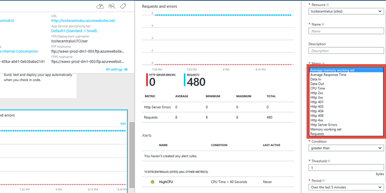

<properties
    pageTitle="Ralentir les performances de l’application web dans le Service d’application | Microsoft Azure"
    description="Cet article vous permet de résoudre les problèmes de performances d’application web lente dans le Service d’application Azure."
    services="app-service\web"
    documentationCenter=""
    authors="cephalin"
    manager="wpickett"
    editor=""
    tags="top-support-issue"
    keywords="performances d’application Web, application lente, application lente"/>

<tags
    ms.service="app-service-web"
    ms.workload="web"
    ms.tgt_pltfrm="na"
    ms.devlang="na"
    ms.topic="article"
    ms.date="07/06/2016"
    ms.author="cephalin"/>

# Résoudre les problèmes de performances d’application web lente dans le Service d’application Azure

Cet article vous permet de résoudre les problèmes de performances d’application web lente dans le [Service d’application Azure](http://go.microsoft.com/fwlink/?LinkId=529714).

Si vous avez besoin d’une aide supplémentaire à tout moment dans cet article, vous pouvez contacter experts Azure sur [la Azure MSDN et les forums de débordement de pile](https://azure.microsoft.com/support/forums/). Par ailleurs, vous pouvez également créer un incident de support Azure. Accédez au [site d’assistance Azure](https://azure.microsoft.com/support/options/) et cliquez sur **Obtenir un Support**.

## Manifestation

Lorsque vous naviguez sur l’application web, le chargement de pages lentement et parfois délai d’expiration.

## Cause

Ce problème se produit souvent par des problèmes au niveau application, telle que :

-   demandes met beaucoup de temps
-   application à l’aide mémoire/processeur élevé
-   application cesse-t-il de fonctionner en raison d’une exception.

## Étapes de dépannage

Résolution des problèmes peuvent être divisée en trois tâches distinctes, dans un ordre séquentiel :

1.  [Observez et surveiller le comportement de l’application](#observe)
2.  [Collecte de données](#collect)
3.  [Limiter le problème](#mitigate)

[Application de Service Web Apps](/services/app-service/web/) vous propose différentes options à chaque étape.

<a name="observe" />
### 1. observer et surveiller le comportement de l’application

#### Effectuer le suivi de l’état du Service

Microsoft Azure publicizes chaque fois qu’il y a une dégradation des performances ou interruption du service. Vous pouvez suivre l’état du service sur le [Portail Azure](https://portal.azure.com/). Pour plus d’informations, voir [fonctionnement du service suivi](../monitoring-and-diagnostics/insights-service-health.md).

#### Surveiller votre application web

Cette option permet de déterminer si votre application rencontre des problèmes. Carte de votre application web, cliquez sur la vignette **demandes et les erreurs** . La carte **métrique** montre tous les mesures que vous pouvez ajouter.

Parmi les mesures que vous pouvez surveiller pour votre application web

-   Mémoire moyenne jeu de travail
-   Temps de réponse moyen
-   Temps processeur
-   Utilisation de la mémoire
-   Demandes

Pour plus d’informations, voir :

-   [Surveiller des applications Web dans le Service d’application Azure](web-sites-monitor.md)
-   [Recevoir des notifications d’alerte](../monitoring-and-diagnostics/insights-receive-alert-notifications.md)

#### Surveiller l’état de point de terminaison web

Si vous exécutez votre application web dans le **Standard** tarifs couche, Web Apps permet de contrôler 2 points de terminaison de 3 emplacements géographiques.

Point de terminaison de surveillance configure les tests de site web à partir d’emplacements distribués geo qui permettent de tester le temps de réponse et disponibilité des URL web. Le test effectue une opération HTTP GET sur l’URL web pour déterminer la disponibilité et l’heure de réponse à partir de chaque emplacement. Chaque emplacement configuré s’exécute un test de cinq minutes.

Disponibilité est contrôlée à l’aide de codes de réponse HTTP, de temps de réponse est mesuré en millisecondes. Un test surveillance échoue si le code de réponse HTTP est supérieur ou égal à 400 ou si la réponse prend plus de 30 secondes. Un point de terminaison est considéré comme disponible si ses tests surveillance imprimés à partir de tous les emplacements spécifiés.

Pour configurer, voir [Comment : surveiller l’état de point de terminaison web](web-sites-monitor.md#webendpointstatus).

Voir également, [tout en conservant Azure fonctionnement des Sites Web plus de point de terminaison de surveillance - avec Stefan Schackow](/documentation/videos/azure-web-sites-endpoint-monitoring-and-staying-up/) pour une vidéo sur le contrôle de point de terminaison.

#### Analyse des performances application en utilisant les Extensions

Vous pouvez également surveiller les performances de votre application en tirant parti des _extensions de site_.

Chaque application Service web app propose un point de terminaison de gestion extensible qui vous permet de tirer parti d’un ensemble d’outils déployés en tant qu’extensions de site puissants. Ces outils de la plage à partir d’éditeurs de code source tel que [Visual Studio Team Services](https://www.visualstudio.com/products/what-is-visual-studio-online-vs.aspx) aux outils de gestion des ressources connectés comme une base de données MySQL connecté à une application web.

[Azure Application Insights](/services/application-insights/) et [Nouveau Relic](/marketplace/partners/newrelic/newrelic/) sont deux des extensions de site disponibles de contrôle performances. Pour utiliser le nouveau Relic, vous installez un agent lors de l’exécution. Pour utiliser Azure Application perspectives, vous reconstruisez votre code avec un kit de développement et vous pouvez également installer une extension qui permet d’accéder à des données supplémentaires. Le Kit de développement vous permet d’écrire du code pour surveiller l’utilisation et les performances de votre application plus en détail.

Pour utiliser l’analyse de l’Application, voir [analyse des performances dans les applications web](../application-insights/app-insights-web-monitor-performance.md).

Pour utiliser Relic nouvelle, voir [Gestion des performances nouvelle Relic Application dans Azure](../store-new-relic-cloud-services-dotnet-application-performance-management.md).

<a name="collect" />
### 2. collecte de données

####    Activer la journalisation des diagnostics pour votre application web

L’environnement Web Apps fournit des fonctionnalités de diagnostic pour les informations de journalisation à partir du serveur web et l’application web. Elles sont séparées logiquement en diagnostics server web et les diagnostics de l’application.

##### Diagnostics de serveur Web

Vous pouvez activer ou désactiver les types de journaux suivants :

-   **Enregistrement des erreurs détaillées** - informations d’erreur détaillées pour les codes d’état HTTP indiquant qu’une erreur (code d’état 400 ou version ultérieure). Cela peut contenir des informations qui peuvent vous aider à déterminer pourquoi le serveur a renvoyé le code d’erreur.
-   **Échec de la demande de suivi** - des informations détaillées sur les requêtes échecs, y compris une trace des composants IIS permettant de traiter la demande et la durée de chaque composant. Cela peut être utile si vous essayez d’améliorer les performances de l’application web ou d’isoler ce qui est à l’origine d’une erreur HTTP spécifique.
-   **Journalisation sur le serveur web** - informations sur les transactions HTTP utilisant le format de fichier journal étendu W3C. Ceci est utile pour déterminer les chiffres de l’application web globaux, tels que le nombre de demandes gérées ou le nombre de requêtes proviennent d’une adresse IP spécifique.

##### Diagnostics d’applications

Diagnostics d’applications vous permet de capturer des informations obtenues par une application web. Applications ASP.NET peuvent utiliser la `System.Diagnostics.Trace` cours pour enregistrer les informations dans le journal de diagnostic applications.

Pour obtenir des instructions détaillées sur la façon de configurer votre application pour l’enregistrement, voir [Activer l’enregistrement des diagnostics pour les applications web dans le Service d’application Azure](web-sites-enable-diagnostic-log.md).

#### Utiliser le profil à distance

Dans le Service d’application Azure, applications Web et applications API WebJobs peut être défini à distance. Si votre processus s’exécute plus lentement que prévu, ou la latence des requêtes HTTP sont supérieures à normal et l’utilisation de l’UC du processus est également élevée, vous pouvez à distance votre processus de profil et obtenir les piles d’appels échantillonnage de l’UC pour analyser l’activité de processus et réactif chemins d’accès de code.

Pour plus d’informations, voir [prise en charge Azure Application Service profil à distance](/blog/remote-profiling-support-in-azure-app-service).

#### Utiliser le portail de Support Azure Application Service

Applications Web vous offre la possibilité de résoudre les problèmes liés à votre application web en consultant HTTP journaux, les journaux d’événements, les images complètes processus et autres éléments. Vous pouvez accéder à toutes ces informations à l’aide de notre portail de Support **http://&lt;votre nom de l’application >.scm.azurewebsites.net/Support**

Le portail du Service de l’application Azure prend en charge vous propose trois onglets distincts pour prendre en charge les trois étapes d’un scénario de résolution des problèmes courant :

1.  Observez le comportement actuel
2.  Analyser en collecte des informations de diagnostic et en exécutant les analyseurs intégrés
3.  Atténuer

Si le problème se produit immédiatement, cliquez sur **analyse** > **Diagnostics** > **Diagnostiquer maintenant** pour créer une session de diagnostic pour vous, qui collecterez HTTP consigne, Observateur d’événements, les images complètes, les journaux d’erreur PHP et PHP traitement état de mémoire.

Une fois que les données recueillies, il sera également exécuter une analyse des données et vous fournir un rapport HTML.

Au cas où vous voulez télécharger les données, par défaut, il est stocké dans le dossier D:\home\data\DaaS.

Pour plus d’informations sur le portail Azure Application Service prise en charge, voir [Nouvelles mises à jour à Extension de Site de prise en charge pour les sites Web Azure](/blog/new-updates-to-support-site-extension-for-azure-websites).

#### Utiliser la Console de débogage Kudu

Applications Web est fourni avec une console de débogage que vous pouvez utiliser pour débogage, exploration, le téléchargement de fichiers, ainsi que les points de terminaison JSON pour obtenir des informations relatives à votre environnement. Cette option est appelée la _Console Kudu_ ou le _Tableau de bord SCM_ pour votre application web.

Vous pouvez accéder à ce tableau de bord en accédant au lien **https://&lt;votre nom de l’application >.scm.azurewebsites.net/**.

Parmi les éléments qui fournit des Kudu sont :

-   paramètres d’environnement pour votre application
-   flux de journal
-   vidage des Diagnostics
-   déboguer console dans laquelle vous pouvez exécuter les applets de commande Powershell et les commandes de base pratiques recommandées.

Une autre fonctionnalité utile de Kudu est que, au cas où votre application est lever des exceptions de première chance, vous pouvez utiliser Kudu et exporte l’outil SysInternals Procdump pour créer la quantité de mémoire. Ces images mémoire sont des instantanés du processus et peuvent souvent vous aider à résoudre les problèmes plus complexes avec votre application web.

Pour plus d’informations sur les fonctionnalités disponibles dans Kudu, voir [Outils Azure sites Web Team Services que vous devez savoir sur](/blog/windows-azure-websites-online-tools-you-should-know-about/).

<a name="mitigate" />
### 3. atténuer le problème

####    Échelle de l’application web

Dans le Service d’application Azure, pour améliorer les performances et de débit, vous pouvez ajuster l’échelle à partir duquel vous exécutez votre application. Mise à l’échelle d’une application web implique deux actions associées : modification de votre plan de services d’application à un niveau plus élevé de tarification et la configuration de certains paramètres une fois que vous avez basculé vers le niveau de prix supérieur.

Pour plus d’informations sur la mise à l’échelle, voir [échelle une application web dans le Service d’application Azure](web-sites-scale.md).

En outre, vous pouvez choisir d’exécuter votre application sur plusieurs instances. Cela non seulement vous offre une capacité de traitement plus, mais vous donne également certaines montant de tolérance de panne. Si le processus se déroule vers le bas sur une instance, l’autre instance continue servir les requêtes.

Vous pouvez définir la mise à l’échelle pour être manuelle ou automatique.

####    Utiliser AutoHeal

AutoHeal réutilise le processus de travail de votre application basée sur les paramètres que vous choisissez (par exemple, les modifications de configuration, demandes, limites en mémoire ou le temps nécessaire pour exécuter une requête). La plupart du temps, Corbeille le processus est le moyen le plus rapide pour résoudre un problème. Bien que vous pouvez toujours redémarrer l’application web à partir de directement à partir du portail Azure, AutoHeal fera automatiquement pour vous. Il vous souhaitez d’ajouter des déclencheurs de web.config racine de votre application web. Notez que ces paramètres seraient fonctionne de la même façon, même si votre application n’est pas un .net une.

Pour plus d’informations, voir [Correcteur automatique des Sites Web Azure](/blog/auto-healing-windows-azure-web-sites/).

####    Redémarrez l’application web

Il s’agit souvent la façon la plus simple pour récupérer des problèmes uniques. Dans le [Portail Azure](https://portal.azure.com/), sur la carte de votre application web, vous disposez des options pour arrêter ou redémarrer votre application.

 

Vous pouvez également gérer votre application web à l’aide de Powershell Azure. Pour plus d’informations, voir [Utilisation de PowerShell Azure avec le Gestionnaire de ressources Azure](../powershell-azure-resource-manager.md).
