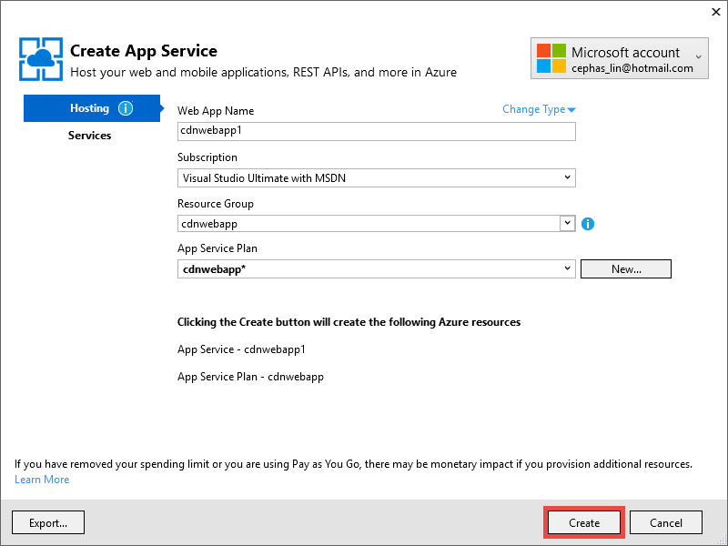

<properties 
    pageTitle="Utiliser Azure CDN dans le Service d’application Azure" 
    description="Un didacticiel qui vous apprend à déployer une application web au Service d’application Azure qui sert le contenu à partir d’un point de terminaison Azure CDN intégrée" 
    services="app-service\web,cdn" 
    documentationCenter=".net" 
    authors="cephalin" 
    manager="wpickett" 
    editor="jimbe"/>

<tags 
    ms.service="app-service" 
    ms.workload="tbd" 
    ms.tgt_pltfrm="na" 
    ms.devlang="dotnet" 
    ms.topic="article" 
    ms.date="07/01/2016" 
    ms.author="cephalin"/>


# <a name="use-azure-cdn-in-azure-app-service"></a>Utiliser Azure CDN dans le Service d’application Azure

[Application Service](http://go.microsoft.com/fwlink/?LinkId=529714) peut être intégré aux [Azure CDN](/services/cdn/), ajout aux mise à l’échelle des capacités intrinsèque à dans [l’Application de Service Web Apps](http://go.microsoft.com/fwlink/?LinkId=529714) globales en servant le contenu de votre application web globalement à partir des nœuds de serveur près de vos clients (une liste de tous les emplacements de nœud actuel mis à jour sont accessibles [ici](http://msdn.microsoft.com/library/azure/gg680302.aspx)). Dans des scénarios comme servant des images statiques, cette intégration peut améliorer sensiblement les performances de vos applications Azure Application Service Web et améliore sensiblement expérience de l’utilisateur de votre application web dans le monde. 

Intégration des applications Web avec Azure CDN vous offre les avantages suivants :

- Intégration de déploiement de contenu (images, les scripts et feuilles de style) dans le cadre du processus de [déploiement continue](app-service-continuous-deployment.md) de votre application web
- Aisément mettre à jour les packages NuGet dans votre application web dans le Service d’application Azure, tels que jQuery ou versions démarrage 
- Gérer votre application Web et votre contenu CDN servi à partir de la même interface de Visual Studio
- Intégrer ASP.NET regroupement et minimisation Azure CDN

[AZURE.INCLUDE [app-service-web-to-api-and-mobile](../../includes/app-service-web-to-api-and-mobile.md)] 

## <a name="what-you-will-build"></a>Vous allez créer ##

Vous déployez une application web au Service d’application Azure à l’aide de la valeur par défaut modèle ASP.NET MVC dans Visual Studio, ajoutez le code pour fournir du contenu à partir d’un CDN Azure intégré, comme une image, résultats de l’action contrôleur et les fichiers par défaut JavaScript et CSS et également écrire du code pour configurer le mécanisme de secours pour les offres pris en charge dans le cas où le CDN est en mode hors connexion.

## <a name="what-you-will-need"></a>Composants nécessaires ##

Ce didacticiel comporte les conditions préalables suivantes :

-   Un [compte Microsoft Azure](/account/) active
-   Visual Studio 2015 avec le [Kit de développement Azure pour .NET](http://go.microsoft.com/fwlink/p/?linkid=323510&clcid=0x409). Si vous utilisez Visual Studio, les étapes peuvent varier.

> [AZURE.NOTE] Vous avez besoin d’un compte Azure pour effectuer ce didacticiel :
> + Vous pouvez [Ouvrir un compte Azure gratuitement](/pricing/free-trial/) - vous obtenez crédits vous pouvez utiliser pour essayer de services Azure payants et même après leur utilisation vous pouvez conserver le compte et libérer de l’utilisation des services Azure, tels que des applications Web.
> + Vous pouvez [Activer les avantages d’abonné Visual Studio](/pricing/member-offers/msdn-benefits-details/) : Visual Studio votre abonnement fournit les crédits chaque mois que vous pouvez utiliser pour les services Azure payants.
>
> Si vous voulez commencer à utiliser le Service d’application Azure avant de vous inscrire pour un compte Azure, accédez à [Essayer le Service application](http://go.microsoft.com/fwlink/?LinkId=523751), où vous pouvez créer une application web starter courtes immédiatement dans le Service d’application. Aucune carte de crédit obligatoire ; Aucune engagements.

## <a name="deploy-a-web-app-to-azure-with-an-integrated-cdn-endpoint"></a>Déployer une application web vers Azure avec un point de terminaison CDN intégrée ##

Dans cette section, vous déployez le modèle d’application ASP.NET MVC dans Visual Studio 2015 par défaut au Service d’application et puis intégrer un point de terminaison CDN. Suivez les instructions ci-dessous :

1. Dans Visual Studio 2015, créer une nouvelle application web ASP.NET à partir de la barre de menus en accédant à **fichier > Nouveau > projet > Web > Application Web ASP.NET**. Attribuez un nom et cliquez sur **OK**.

    

3. Sélectionnez **MVC** et cliquez sur **OK**.

    

4. Si vous n’avez pas encore connecté à votre compte Azure, cliquez sur l’icône de compte dans le coin supérieur droit et suivez la boîte de dialogue pour vous connecter à votre compte Azure. Une fois que vous avez terminé, configurez votre application comme indiqué ci-dessous, puis cliquez sur **Nouveau** pour créer une nouvelle offre de Service d’application pour votre application.  

    

5. Configurer une nouvelle offre de Service d’application dans la boîte de dialogue comme indiqué ci-dessous, puis cliquez sur **OK**. 

    

8. Cliquez sur **créer** pour créer l’application web.

    

9. Une fois que votre application ASP.NET est créée, publiez-le sur Azure dans le volet d’activité de Service d’application Azure en cliquant sur **Publier `<app name>` de cette application Web maintenant**. Cliquez sur **Publier** pour terminer le processus.

    

    Vous verrez votre application web publiés dans le navigateur lors de la publication est terminée. 

1. Pour créer un point de terminaison CDN, connectez-vous au [portail Azure](https://portal.azure.com). 
2. Cliquez sur **+ nouvelle** > **Media + CDN** > **CDN**.

    

3. Spécifier la **CDN**, **emplacement**, **groupe de ressources**, le **niveau de prix**, puis cliquez sur **créer**

       

4. Dans le **Profil CDN** carte cliquez sur bouton **+ point de terminaison** . Donnez-lui un nom, sélectionnez **L’application Web** dans la liste déroulante **Type d’origine** et votre application web dans la liste déroulante **nom d’hôte d’origine** , puis cliquez sur **Ajouter**.  

    


    > [AZURE.NOTE] Une fois votre point de terminaison CDN est créé, la carte de **point de terminaison** montre son URL CDN et le domaine d’origine auquel il est intégré à. Toutefois, il peut prendre un certain temps pour une configuration nouveau CDN du point de terminaison d’être entièrement propagées à tous les emplacements de nœud CDN. 

3. Dans la carte de **point de terminaison** , cliquez sur le nom du point de terminaison CDN que vous venez de créer.

    

3. Cliquez sur le bouton **configurer** . Dans la carte de **configurer** , sélectionnez **mettre en Cache chaque URL unique** dans **comportement de cache de chaîne de requête** de liste déroulante, puis cliquez sur le bouton **Enregistrer** .


    

Une fois que vous activer cette option, le lien même accédé avec des chaînes de requête différents est mis en cache comme entrées distinctes.

>[AZURE.NOTE] Tandis que l’activation de la chaîne de requête n’est pas nécessaire pour cette section didacticiel, que vous voulez effectuer cette opération comme au plus tôt que possible convenance depuis toute modification apportée ici va prendre un certain temps de se propager à tous les nœuds CDN, et vous ne voulez pas tout contenu non requête chaîne-compatible à engorger le cache CDN (mise à jour contenu CDN abordé ultérieurement).

2. À présent, accédez à l’adresse de point de terminaison CDN. Si le point de terminaison est prêt, vous devriez voir votre application web affichée. Si vous obtenez une erreur **404 HTTP** , le point de terminaison CDN n’est pas prêt. Vous devrez peut-être patienter vers le haut et une heure pour la configuration CDN d’être propagées à tous les nœuds de bord. 

    

1. Ensuite, essayez d’accéder au fichier **~/Content/bootstrap.css** dans votre projet ASP.NET. Dans la fenêtre du navigateur, accédez à * *http://*&lt;cdnName >*.azureedge.net/Content/bootstrap.css**. Mon installation, cette URL est la suivante :

        http://az673227.azureedge.net/Content/bootstrap.css

    Ce qui correspond à l’URL d’origine suivante au point de terminaison CDN :

        http://cdnwebapp.azurewebsites.net/Content/bootstrap.css

    Lorsque vous naviguez vers * *http://*&lt;cdnName >*.azureedge.net/Content/bootstrap.css**, vous devrez télécharger bootstrap.css fourni à partir de votre application web dans Azure. 

    

Vous pouvez accéder à n’importe quelle URL accessible au public auprès de la même façon * *http://*&lt;ServiceName% >*.cloudapp.net/**, directement à partir de votre point de terminaison CDN. Par exemple :

-   Un fichier .js du chemin d’accès /Script
-   Tout fichier de contenu à partir de la /Content chemin d’accès
-   N’importe quel contrôleur/action 
-   Si la chaîne de requête est activée au votre point de terminaison CDN, n’importe quelle URL avec des chaînes de requête
-   L’application web Azure entière, tout le contenu soit public

Notez qu’il peut ne pas être toujours judicieux de sélectionner (ou généralement recommandé) pour répondre à une application web Azure entière via Azure CDN. Les avertissements sont notamment :

-   Cette approche nécessite l’ensemble de votre site d’être publique, car Azure CDN ne peut pas servir aucun contenu privé.
-   Si le point de terminaison CDN est déconnecté pour une raison quelconque, si maintenance planifiée ou erreur de l’utilisateur, votre application web entière est hors connexion, à moins que les clients peuvent être redirigés vers l’URL d’origine * *http://*&lt;nom du site >*.azurewebsites.net/**. 
-   Même avec les paramètres de contrôle du Cache personnalisés (voir [configurer les options pour les fichiers statiques dans votre application web Azure mise en cache](#configure-caching-options-for-static-files-in-your-azure-web-app)), un point de terminaison CDN n’améliore pas les performances du contenu dynamique hautement. Si vous avez essayé de charger la page d’accueil à partir de votre point de terminaison CDN comme indiqué ci-dessus, notez que l’opération était d’au moins 5 secondes pour charger la page d’accueil par défaut la première fois, ce qui correspond à une page simple. Imaginons que se passe-t-il à l’expérience client si cette page contient du contenu dynamique que vous devez mettre à jour toutes les minutes. Héberger un contenu dynamique à partir d’un point de terminaison CDN nécessite l’expiration de cache courte, qui se traduit par échecs dans le cache fréquents au point de terminaison CDN. Cette problème les performances de votre application web Azure et nuit à l’utilité d’un CDN.

La solution consiste à déterminer le contenu à faire à partir d’Azure CDN sur un cas dans votre application web Azure. À cet effet, vous avez déjà appris à accéder à des fichiers de contenu à partir du point de terminaison CDN. J’ai vous montrent comment prendre en charge une action contrôleur spécifique via le point de terminaison CDN de [fournir du contenu à partir d’actions contrôleur via Azure CDN](#serve-content-from-controller-actions-through-azure-cdn).

## <a name="configure-caching-options-for-static-files-in-your-azure-web-app"></a>Configurer les options de mise en cache pour les fichiers statiques dans votre application web Azure ##

Avec l’intégration des Azure CDN dans votre application web Azure, vous pouvez spécifier comment vous voulez contenu statique à mettre en cache dans le point de terminaison CDN. Pour ce faire, ouvrez le *fichier Web.config* à partir de votre projet ASP.NET (par exemple, **cdnwebapp**) et ajouter une `<staticContent>` élément à `<system.webServer>`. Le code XML ci-dessous configure le cache pour expirer dans les 3 jours.  

    <system.webServer>
      <staticContent>
        <clientCache cacheControlMode="UseMaxAge" cacheControlMaxAge="3.00:00:00"/>
      </staticContent>
      ...
    </system.webServer>

Une fois que vous procédez ainsi, tous les fichiers statiques dans votre application web Azure observerez la même règle dans le cache de résolution CDN. Contrôle plus précis des paramètres du cache, ajouter un fichier *Web.config* dans un dossier et ajoutez vos paramètres. Par exemple, ajouter un fichier *Web.config* au dossier *\Content* et remplacez le contenu par le code XML suivant :

    <?xml version="1.0"?>
    <configuration>
      <system.webServer>
        <staticContent>
          <clientCache cacheControlMode="UseMaxAge" cacheControlMaxAge="15.00:00:00"/>
        </staticContent>
      </system.webServer>
    </configuration>

Ce paramètre, tous les fichiers statiques à partir du dossier *\Content* à mettre en cache pour 15 jours.

Pour plus d’informations sur la configuration du `<clientCache>` élément, voir [Cache Client &lt;clientCache >](http://www.iis.net/configreference/system.webserver/staticcontent/clientcache).

Dans la section suivante, j’ai également montre comment vous pouvez configurer les paramètres de cache de résultats contrôleur d’action dans le cache CDN.

## <a name="serve-content-from-controller-actions-through-azure-cdn"></a>Fournir du contenu à partir d’actions contrôleur via Azure CDN ##

Lorsque vous intégrez Web Apps avec Azure CDN, il est relativement facile de fournir du contenu à partir d’actions du contrôleur par le biais du CDN Azure. Là encore, si vous décidez de répondre à l’application web Azure entière via votre fournisseur, vous n’avez pas besoin effectuer cette action du tout dans la mesure où toutes les actions de contrôleur sont accessibles via le CDN déjà. Mais, pour les raisons que j’ai déjà fait remarquer dans [déployer une application web Azure avec un point de terminaison CDN intégrée](#deploy-a-web-app-to-azure-with-an-integrated-cdn-endpoint), vous pouvez décider contre ceci, choisir à la place sélectionner l’action contrôleur que vous souhaitez servir à partir d’Azure CDN. [Martin Balliauw](https://twitter.com/maartenballiauw) vous montre comment y parvenir avec une amusante contrôleur de MemeGenerator [latence réducteur sur le web avec le CDN Azure](http://channel9.msdn.com/events/TechDays/Techdays-2014-the-Netherlands/Reducing-latency-on-the-web-with-the-Windows-Azure-CDN). J’ai sera simplement le reproduire ici.

Supposons dans votre application web que vous souhaitez générer memes basé sur une image Chuck Norris jeune (photo par [Lumière Maurice](http://www.flickr.com/photos/alan-light/218493788/)) comme suit :


Vous avez un simple `Index` action qui autorise les clients à spécifier les superlatifs dans l’image, puis génère la meme une fois qu’ils publient à l’action. Dans la mesure où il est Chuck Norris, vous vous attendez cette page pour devenir globalement grandement populaires. Il s’agit d’un bon exemple d’héberger un contenu dynamique semi-structurées avec Azure CDN. 

Suivez les étapes ci-dessus pour cette action contrôleur de configuration :

1. Dans le dossier *\Controllers* , créez un nouveau fichier .cs appelé *MemeGeneratorController.cs* et remplacez le contenu par le code suivant. Le chemin d’accès de fichier pour `~/Content/chuck.bmp` et le nom de votre fournisseur `yourCDNName`.


        using System;
        using System.Collections.Generic;
        using System.Diagnostics;
        using System.Drawing;
        using System.IO;
        using System.Net;
        using System.Web.Hosting;
        using System.Web.Mvc;
        using System.Web.UI;

        namespace cdnwebapp.Controllers
        {
          public class MemeGeneratorController : Controller
          {
            static readonly Dictionary<string, Tuple<string ,string>> Memes = new Dictionary<string, Tuple<string, string>>();

            public ActionResult Index()
            {
              return View();
            }

            [HttpPost, ActionName("Index")]
            public ActionResult Index_Post(string top, string bottom)
            {
              var identifier = Guid.NewGuid().ToString();
              if (!Memes.ContainsKey(identifier))
              {
                Memes.Add(identifier, new Tuple<string, string>(top, bottom));
              }

              return Content("<a href=\"" + Url.Action("Show", new {id = identifier}) + "\">here's your meme</a>");
            }

            [OutputCache(VaryByParam = "*", Duration = 1, Location = OutputCacheLocation.Downstream)]
            public ActionResult Show(string id)
            {
              Tuple<string, string> data = null;
              if (!Memes.TryGetValue(id, out data))
              {
                return new HttpStatusCodeResult(HttpStatusCode.NotFound);
              }

              if (Debugger.IsAttached) // Preserve the debug experience
              {
                return Redirect(string.Format("/MemeGenerator/Generate?top={0}&bottom={1}", data.Item1, data.Item2));
              }
              else // Get content from Azure CDN
              {
                return Redirect(string.Format("http://<yourCDNName>.azureedge.net/MemeGenerator/Generate?top={0}&bottom={1}", data.Item1, data.Item2));
              }
            }

            [OutputCache(VaryByParam = "*", Duration = 3600, Location = OutputCacheLocation.Downstream)]
            public ActionResult Generate(string top, string bottom)
            {
              string imageFilePath = HostingEnvironment.MapPath("~/Content/chuck.bmp");
              Bitmap bitmap = (Bitmap)Image.FromFile(imageFilePath);

              using (Graphics graphics = Graphics.FromImage(bitmap))
              {
                SizeF size = new SizeF();
                using (Font arialFont = FindBestFitFont(bitmap, graphics, top.ToUpperInvariant(), new Font("Arial Narrow", 100), out size))
                {
                    graphics.DrawString(top.ToUpperInvariant(), arialFont, Brushes.White, new PointF(((bitmap.Width - size.Width) / 2), 10f));
                }
                using (Font arialFont = FindBestFitFont(bitmap, graphics, bottom.ToUpperInvariant(), new Font("Arial Narrow", 100), out size))
                {
                    graphics.DrawString(bottom.ToUpperInvariant(), arialFont, Brushes.White, new PointF(((bitmap.Width - size.Width) / 2), bitmap.Height - 10f - arialFont.Height));
                }
              }
              MemoryStream ms = new MemoryStream();
              bitmap.Save(ms, System.Drawing.Imaging.ImageFormat.Png);
              return File(ms.ToArray(), "image/png");
            }

            private Font FindBestFitFont(Image i, Graphics g, String text, Font font, out SizeF size)
            {
              // Compute actual size, shrink if needed
              while (true)
              {
                size = g.MeasureString(text, font);

                // It fits, back out
                if (size.Height < i.Height &&
                     size.Width < i.Width) { return font; }

                // Try a smaller font (90% of old size)
                Font oldFont = font;
                font = new Font(font.Name, (float)(font.Size * .9), font.Style);
                oldFont.Dispose();
              }
            }
          }
        }

2. Avec le bouton droit dans la valeur par défaut `Index()` action et sélectionnez **Ajouter une vue**.

    

3.  Acceptez les paramètres ci-dessous, puis cliquez sur **Ajouter**.

    

4. Ouvrez la nouvelle *Views\MemeGenerator\Index.cshtml* et remplacez le contenu par le HTML simple suivant pour l’envoi des superlatifs :

        <h2>Meme Generator</h2>
        
        <form action="" method="post">
            <input type="text" name="top" placeholder="Enter top text here" />
            <br />
            <input type="text" name="bottom" placeholder="Enter bottom text here" />
            <br />
            <input class="btn" type="submit" value="Generate meme" />
        </form>

5. Publier à nouveau sur l’application web Azure et accédez à * *http://*&lt;ServiceName% >*.cloudapp.net/MemeGenerator/Index** dans votre navigateur. 

Lorsque vous envoyez les valeurs de formulaire à `/MemeGenerator/Index`, la `Index_Post` méthode d’action renvoie un lien vers la `Show` méthode d’action avec l’identificateur d’entrée correspondante. Lorsque vous cliquez sur le lien, vous atteignez le code suivant :  

    [OutputCache(VaryByParam = "*", Duration = 1, Location = OutputCacheLocation.Downstream)]
    public ActionResult Show(string id)
    {
      Tuple<string, string> data = null;
      if (!Memes.TryGetValue(id, out data))
      {
        return new HttpStatusCodeResult(HttpStatusCode.NotFound);
      }

      if (Debugger.IsAttached) // Preserve the debug experience
      {
        return Redirect(string.Format("/MemeGenerator/Generate?top={0}&bottom={1}", data.Item1, data.Item2));
      }
      else // Get content from Azure CDN
      {
        return Redirect(string.Format("http://<yourCDNName>.azureedge.net/MemeGenerator/Generate?top={0}&bottom={1}", data.Item1, data.Item2));
      }
    }

Si votre débogueur local est connecté, vous obtiendrez l’expérience de débogage standard avec une redirection locale. Si elle s’exécute dans l’application web Azure, il vous redirige vers :

    http://<yourCDNName>.azureedge.net/MemeGenerator/Generate?top=<formInput>&bottom=<formInput>

Ce qui correspond à l’URL d’origine suivants à votre point de terminaison CDN :

    http://<yourSiteName>.azurewebsites.net/cdn/MemeGenerator/Generate?top=<formInput>&bottom=<formInput>

Une fois que la règle soit appliquée précédemment de réécriture d’URL, le fichier réel est mis en cache sur votre point de terminaison CDN est la suivante :

    http://<yourSiteName>.azurewebsites.net/MemeGenerator/Generate?top=<formInput>&bottom=<formInput>

Vous pouvez ensuite utiliser la `OutputCacheAttribute` attribut sur la `Generate` méthode pour spécifier comment le résultat de l’action doit être mis en cache, qui respecte la Azure CDN. Le code ci-dessous spécifier une durée d’expiration de cache d’une heure (3 600 secondes).

    [OutputCache(VaryByParam = "*", Duration = 3600, Location = OutputCacheLocation.Downstream)]

De même, vous pouvez servir de du contenu provenant de n’importe quelle action contrôleur dans votre application web Azure via votre Azure CDN, avec l’option de mise en cache souhaitée.

Dans la section suivante, je vous montrent comment prendre en charge les scripts groupées et réduites et CSS via Azure CDN. 

## <a name="integrate-aspnet-bundling-and-minification-with-azure-cdn"></a>Intégrer ASP.NET regroupement et minimisation Azure CDN ##

Feuilles de style CSS et les scripts Modifier rarement et sont les premiers candidats pour le cache Azure CDN. Servir de l’application web entière via votre Azure CDN est la plus simple pour intégrer regroupement et minimisation Azure CDN. Toutefois, comme vous pouvez choisir par rapport à cette approche pour les raisons décrites dans [intégrer un point de terminaison Azure CDN avec votre Azure application et rver statique du contenu web dans vos pages Web à partir d’Azure CDN](#deploy-a-web-app-to-azure-with-an-integrated-cdn-endpoint), je vous montrent comment faire tout en conservant l’expérience de programme souhaité de ASP.NET regroupement et minimisation, telles que :

-   Expérience de mode débogage rédaction
-   Rationaliser le déploiement
-   Mises à jour immédiates aux clients des mises à niveau de version de script/CSS
-   Mécanisme de secours en cas d’échec de votre point de terminaison CDN
-   Réduire la modification de code

Dans le projet ASP.NET que vous avez créé dans [intégrer un point de terminaison Azure CDN avec votre Azure application et serve statique du contenu web dans vos pages Web à partir d’Azure CDN](#deploy-a-web-app-to-azure-with-an-integrated-cdn-endpoint), ouvrez *App_Start\BundleConfig.cs* et examinez la `bundles.Add()` appels de méthode.

    public static void RegisterBundles(BundleCollection bundles)
    {
        bundles.Add(new ScriptBundle("~/bundles/jquery").Include(
                    "~/Scripts/jquery-{version}.js"));
        ...
    }

La première `bundles.Add()` instruction ajoute un ensemble de guides de script dans le répertoire virtuel `~/bundles/jquery`. Ensuite, ouvrez *Views\Shared\_Layout.cshtml* pour voir comment la balise d’ensemble de guides de script est affichée. Vous devez être en mesure de trouver la ligne de code Razor suivante :

    @Scripts.Render("~/bundles/jquery")

Lorsque ce code Razor s’exécute dans l’application web Azure, il doit rendre un `<script>` balise pour l’ensemble de guides de script similaire à ce qui suit : 

    <script src="/bundles/jquery?v=FVs3ACwOLIVInrAl5sdzR2jrCDmVOWFbZMY6g6Q0ulE1"></script>

Cependant, lorsqu’il est exécuté dans Visual Studio en tapant `F5`, il doit rendre chaque fichier de script du lot individuellement (dans l’exemple précédent, fichier de script qu’une seule est du lot) :

    <script src="/Scripts/jquery-1.10.2.js"></script>

Cela vous permet de déboguer le code JavaScript dans votre environnement de développement lors de la réduction des connexions client simultanées (regroupement) et l’amélioration fichier téléchargement performances (réduction) en production. Il est une excellente fonctionnalité pour conserver avec l’intégration Azure CDN. En outre, dans la mesure où l’offre rendu contient déjà une chaîne de version généré automatiquement, vous souhaitez répliquer cette fonctionnalité afin que lorsque vous mettez à jour votre version jQuery via NuGet, il peut être mis à jour sur le côté client dès que possible.

Suivez les étapes ci-dessous pour l’intégration ASP.NET regroupement et minimisation avec votre point de terminaison CDN.

1. Dans *App_Start\BundleConfig.cs*, modifiez le `bundles.Add()` méthodes à utiliser un autre [constructeur offre groupée](http://msdn.microsoft.com/library/jj646464.aspx), qui indique une adresse CDN. Pour ce faire, remplacez le `RegisterBundles` définition de méthode par le code suivant :  
    
        public static void RegisterBundles(BundleCollection bundles)
        {
          bundles.UseCdn = true;
          var version = System.Reflection.Assembly.GetAssembly(typeof(Controllers.HomeController))
            .GetName().Version.ToString();
          var cdnUrl = "http://<yourCDNName>.azureedge.net/{0}?" + version;

          bundles.Add(new ScriptBundle("~/bundles/jquery", string.Format(cdnUrl, "bundles/jquery")).Include(
                "~/Scripts/jquery-{version}.js"));

          bundles.Add(new ScriptBundle("~/bundles/jqueryval", string.Format(cdnUrl, "bundles/jqueryval")).Include(
                "~/Scripts/jquery.validate*"));

          // Use the development version of Modernizr to develop with and learn from. Then, when you're
          // ready for production, use the build tool at http://modernizr.com to pick only the tests you need.
          bundles.Add(new ScriptBundle("~/bundles/modernizr", string.Format(cdnUrl, "bundles/modernizr")).Include(
                "~/Scripts/modernizr-*"));

          bundles.Add(new ScriptBundle("~/bundles/bootstrap", string.Format(cdnUrl, "bundles/bootstrap")).Include(
                "~/Scripts/bootstrap.js",
                "~/Scripts/respond.js"));

          bundles.Add(new StyleBundle("~/Content/css", string.Format(cdnUrl, "Content/css")).Include(
                "~/Content/bootstrap.css",
                "~/Content/site.css"));
        }


    N’oubliez pas de remplacer `<yourCDNName>` avec le nom de votre Azure CDN.

    Clairement, vous êtes en train `bundles.UseCdn = true` et ajoutés une URL CDN soignée à chaque ensemble. Par exemple, le premier constructeur dans le code :

        new ScriptBundle("~/bundles/jquery", string.Format(cdnUrl, "bundles/jquery"))

    est identique à la suivante : 

        new ScriptBundle("~/bundles/jquery", string.Format(cdnUrl, "http://<yourCDNName>.azureedge.net/bundles/jquery?<W.X.Y.Z>"))

    Ce constructeur indique ASP.NET regroupement et minimisation pour afficher les fichiers de script individuels lors du débogage localement, mais utilisez l’adresse CDN spécifiée pour accéder au script en question. Toutefois, tenez compte des deux points importants avec cette URL CDN soignée :
    
    - L’origine de cette URL CDN est `http://<yourSiteName>.azurewebsites.net/bundles/jquery?<W.X.Y.Z>`, qui est en réalité le répertoire virtuel du fichier de script dans votre application Web.
    - Dans la mesure où vous utilisez constructeur CDN, la balise de script CDN pour l’offre groupée ne contient plus la chaîne de version généré automatiquement l’URL du rendu. Vous devez générer manuellement une chaîne de version unique chaque fois que l’offre de script a été modifiée pour forcer une absence de cache à votre Azure CDN. En même temps, cette chaîne version unique doit rester constante via la durée de vie du déploiement afin d’optimiser l’accès au cache à votre Azure CDN après le déploiement de l’offre.

3. La chaîne de requête `<W.X.Y.Z>` extrait de *Properties\AssemblyInfo.cs* dans votre projet ASP.NET. Vous pouvez avoir un flux de travail de déploiement incluant incrémentation de la version d’assemblage chaque fois que vous publiez sur Azure. Ou, vous pouvez simplement modifier *Properties\AssemblyInfo.cs* dans votre projet pour incrémenter automatiquement la chaîne de version chaque fois que vous créez, avec le caractère générique ' *'. Par exemple, remplacez `AssemblyVersion` comme indiqué ci-dessous :
    
        [assembly: AssemblyVersion("1.0.0.*")]
    
    N’importe quel autre stratégie rationaliser générer une chaîne unique pour la durée de vie d’un déploiement est prises en charge ici.

3. Publier à nouveau l’application ASP.NET et accéder à la page d’accueil.
 
4. Affichez le code HTML de la page. Vous devez être en mesure de voir l’URL CDN rendu, avec une chaîne de version unique chaque fois que vous republiez des modifications à votre application web Azure. Par exemple :  
    
        ...
        <link href="http://az673227.azureedge.net/Content/css?1.0.0.25449" rel="stylesheet"/>
        <script src="http://az673227.azureedge.net/bundles/modernizer?1.0.0.25449"></script>
        ...
        <script src="http://az673227.azureedge.net/bundles/jquery?1.0.0.25449"></script>
        <script src="http://az673227.azureedge.net/bundles/bootstrap?1.0.0.25449"></script>
        ...

5. Dans Visual Studio, déboguer l’application ASP.NET dans Visual Studio en tapant `F5`., 

6. Affichez le code HTML de la page. Vous verrez toujours chaque fichier de script rendu individuellement afin que vous pouvez avoir une opération de débogage cohérente expérience dans Visual Studio.  
    
        ...
        <link href="/Content/bootstrap.css" rel="stylesheet"/>
        <link href="/Content/site.css" rel="stylesheet"/>
        <script src="/Scripts/modernizr-2.6.2.js"></script>
        ...
        <script src="/Scripts/jquery-1.10.2.js"></script>
        <script src="/Scripts/bootstrap.js"></script>
        <script src="/Scripts/respond.js"></script>
        ...    

## <a name="fallback-mechanism-for-cdn-urls"></a>Mécanisme de secours pour CDN URL ##

Lorsque votre point de terminaison Azure CDN échoue pour une raison quelconque, vous souhaitez que votre page Web assez intelligent accéder à votre serveur Web d’origine comme option de secours pour le chargement d’un code JavaScript ou démarrage. Il est assez grave perdre des images sur votre application web en raison de l’indisponibilité CDN, mais beaucoup plus important perte de fonctionnalité page essentiels fournie par vos scripts et les feuilles de style.

La classe [offre groupée](http://msdn.microsoft.com/library/system.web.optimization.bundle.aspx) contient une propriété appelée [CdnFallbackExpression](http://msdn.microsoft.com/library/system.web.optimization.bundle.cdnfallbackexpression.aspx) qui vous permet de configurer le mécanisme de secours pour Échec CDN. Pour utiliser cette propriété, procédez comme suit :

1. Dans votre projet ASP.NET, ouvrez *App_Start\BundleConfig.cs*, où vous avez ajouté une URL CDN dans chaque [constructeur lot](http://msdn.microsoft.com/library/jj646464.aspx)et ajoutez `CdnFallbackExpression` code à quatre emplacements comme indiqué pour ajouter un mécanisme de secours aux groupes par défaut.  
    
        public static void RegisterBundles(BundleCollection bundles)
        {
          var version = System.Reflection.Assembly.GetAssembly(typeof(BundleConfig))
            .GetName().Version.ToString();
          var cdnUrl = "http://cdnurl.azureedge.net/.../{0}?" + version;
          bundles.UseCdn = true;

          bundles.Add(new ScriptBundle("~/bundles/jquery", string.Format(cdnUrl, "bundles/jquery")) 
                { CdnFallbackExpression = "window.jquery" }
                .Include("~/Scripts/jquery-{version}.js"));

          bundles.Add(new ScriptBundle("~/bundles/jqueryval", string.Format(cdnUrl, "bundles/jqueryval")) 
                { CdnFallbackExpression = "$.validator" }
                .Include("~/Scripts/jquery.validate*"));

          // Use the development version of Modernizr to develop with and learn from. Then, when you're
          // ready for production, use the build tool at http://modernizr.com to pick only the tests you need.
          bundles.Add(new ScriptBundle("~/bundles/modernizr", string.Format(cdnUrl, "bundles/modernizer")) 
                { CdnFallbackExpression = "window.Modernizr" }
                .Include("~/Scripts/modernizr-*"));

          bundles.Add(new ScriptBundle("~/bundles/bootstrap", string.Format(cdnUrl, "bundles/bootstrap"))     
                { CdnFallbackExpression = "$.fn.modal" }
                .Include(
                        "~/Scripts/bootstrap.js",
                        "~/Scripts/respond.js"));

          bundles.Add(new StyleBundle("~/Content/css", string.Format(cdnUrl, "Content/css")).Include(
                "~/Content/bootstrap.css",
                "~/Content/site.css"));
        }

    Lorsque `CdnFallbackExpression` est pas null, script est injecte dans le code HTML pour tester si l’offre est chargé correctement et, dans le cas contraire, accéder à l’offre directement depuis le serveur Web d’origine. Cette propriété doit être affectée à une expression JavaScript qui teste si l’offre CDN respectif est chargé correctement. L’expression nécessaire pour tester chaque botte varie en fonction du contenu. Pour les offres groupées par défaut ci-dessus :
    
    - `window.jquery`est défini dans .js jquery-{version}
    - `$.validator`est défini dans jquery.validate.js
    - `window.Modernizr`est défini dans modernizer-{version} .js
    - `$.fn.modal`est défini dans bootstrap.js
    
    Vous avez probablement remarqué que je n’a pas défini CdnFallbackExpression pour la `~/Cointent/css` offre groupée. C’est parce qu’actuellement il y a un [bogue dans System.Web.Optimization](https://aspnetoptimization.codeplex.com/workitem/104) qui injecte un `<script>` balise de la CSS secours au lieu d’attendus `<link>` balise.
    
    Il existe cependant, un bon [Ensemble de guides de Style secours](https://github.com/EmberConsultingGroup/StyleBundleFallback) proposés par [Les Consulting Group](https://github.com/EmberConsultingGroup). 

2. Pour utiliser la solution de contournement pour CSS, créer un nouveau fichier .cs dans le dossier de *App_Start* de votre projet ASP.NET nommé *StyleBundleExtensions.cs*et remplacez son contenu par le [code à partir de GitHub](https://github.com/EmberConsultingGroup/StyleBundleFallback/blob/master/Website/App_Start/StyleBundleExtensions.cs). 

4. Dans *App_Start\StyleFundleExtensions.cs*, renommez l’espace de noms espace de noms de votre application ASP.NET (par exemple, **cdnwebapp**). 

3. Revenez à `App_Start\BundleConfig.cs` et remplacer la dernière `bundles.Add` instruction par le code suivant :  

        bundles.Add(new StyleBundle("~/Content/css", string.Format(cdnUrl, "Content/css"))
          .IncludeFallback("~/Content/css", "sr-only", "width", "1px")
          .Include(
            "~/Content/bootstrap.css",
            "~/Content/site.css"));

    Cette nouvelle méthode d’extension utilise la même idée pour injection de script dans le code HTML pour vérifier le DOM pour l’un nom de classe correspondant, le nom de la règle et la valeur de règle définis dans l’ensemble de guides CSS et se situe sur le serveur Web origin si elle ne parvient pas à trouver la correspondance.

4. Publier à nouveau sur votre application web Azure et accéder à la page d’accueil. 
5. Affichez le code HTML de la page. Vous devez trouver scripts injection semblable à ce qui suit :    
    
    ```
    ...
    <link href="http://az673227.azureedge.net/Content/css?1.0.0.25474" rel="stylesheet"/>
<script>(function() {
                var loadFallback,
                    len = document.styleSheets.length;
                for (var i = 0; i < len; i++) {
                    var sheet = document.styleSheets[i];
                    if (sheet.href.indexOf('http://az673227.azureedge.net/Content/css?1.0.0.25474') !== -1) {
                        var meta = document.createElement('meta');
                        meta.className = 'sr-only';
                        document.head.appendChild(meta);
                        var value = window.getComputedStyle(meta).getPropertyValue('width');
                        document.head.removeChild(meta);
                        if (value !== '1px') {
                            document.write('<link href="/Content/css" rel="stylesheet" type="text/css" />');
                        }
                    }
                }
                return true;
            }())||document.write('<script src="/Content/css"><\/script>');</script>

    <script src="http://az673227.azureedge.net/bundles/modernizer?1.0.0.25474"></script>
    <script>(window.Modernizr)||document.write('<script src="/bundles/modernizr"><\/script>');</script>
    ... 
    <script src="http://az673227.azureedge.net/bundles/jquery?1.0.0.25474"></script>
    <script>(window.jquery)||document.write('<script src="/bundles/jquery"><\/script>');</script>

    <script src="http://az673227.azureedge.net/bundles/bootstrap?1.0.0.25474"></script>
    <script>($.fn.modal)||document.write('<script src="/bundles/bootstrap"><\/script>');</script>
    ...
    ```

    Notez que script inséré pour l’offre groupée CSS contienne toujours l’incomplète errant à partir de la `CdnFallbackExpression` propriété dans la ligne :

        }())||document.write('<script src="/Content/css"><\/script>');</script>

    Mais depuis la première partie de la || expression retourne toujours true (dans la ligne directement supérieur à celui), la fonction document.Write () ne s’exécutera jamais.

6. Pour vérifier que le script secours fonctionne, revenez à la carte du point de terminaison votre fournisseur, cliquez sur **Arrêter**.

    

7. Actualisez votre navigateur pour l’application web Azure. Vous devez maintenant voir que tous les scripts et feuilles de style sont correctement chargé.

## <a name="more-information"></a>Plus d’informations 
- [Vue d’ensemble du réseau de distribution de contenu Azure (CDN)](../cdn/cdn-overview.md)
- [À l’aide de CDN Azure](../cdn/cdn-create-new-endpoint.md)
- [Intégrer un service cloud Azure CDN](../cdn/cdn-cloud-service-with-cdn.md)
- [ASP.NET regroupement et minimisation](http://www.asp.net/mvc/tutorials/mvc-4/bundling-and-minification)

