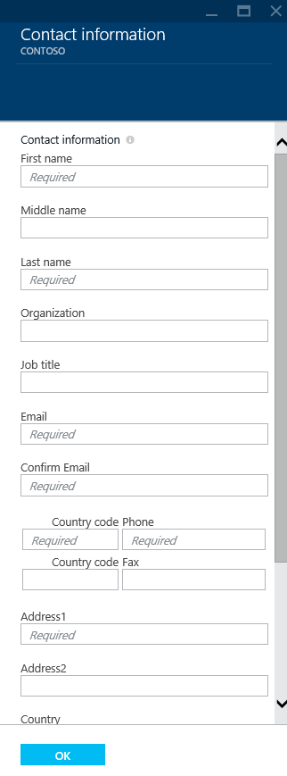

<properties
    pageTitle="Comment acheter un nom de domaine personnalisé dans Azure Application Service Web Apps"
    description="Découvrez comment acheter un nom de domaine personnalisé avec une application web dans le Service d’application Azure."
    services="app-service\web"
    documentationCenter=""
    authors="rmcmurray"
    manager="wpickett"
    editor=""/>

<tags
    ms.service="app-service-web"
    ms.workload="web"
    ms.tgt_pltfrm="na"
    ms.devlang="na"
    ms.topic="article"
    ms.date="08/11/2016"
    ms.author="robmcm"/>

# Acheter et configurer un nom de domaine personnalisé dans le Service d’application Azure

[AZURE.INCLUDE [web-selector](../../includes/websites-custom-domain-selector.md)]

Lorsque vous créez une application web, Azure assigne à un sous-domaine de azurewebsites.net. Par exemple, si votre application web est nommée **contoso**, l’URL est **contoso.azurewebsites.net**. Azure affecte également une adresse IP virtuelle.

Pour une application web de production, vous voudrez probablement aux utilisateurs d’afficher un nom de domaine personnalisé. Cet article explique comment acheter et configurer un domaine personnalisé avec [Application de Service Web Apps](http://go.microsoft.com/fwlink/?LinkId=529714). 

[AZURE.INCLUDE [introfooter](../../includes/custom-dns-web-site-intro-notes.md)]

## Vue d’ensemble

Si vous n’avez pas un nom de domaine pour votre application web, vous pouvez facilement en acquérir un portail [Azure](https://portal.azure.com/). Pendant le processus d’achat, vous pouvez choisir d’avoir des enregistrements DNS de WWW et racine domaine être mappée automatiquement dans votre application web. Vous pouvez également gérer vos directement de domaine à l’intérieur de portail Azure.

Suivez les étapes suivantes pour acheter des noms de domaine et assigner à votre application web.

1. Dans votre navigateur, ouvrez le [Portail Azure](https://portal.azure.com/).

2. Dans l’onglet **Applications Web** , cliquez sur le nom de votre application web, sélectionnez **paramètres**, puis **domaines personnalisés**

    

3. Dans la carte **domaines personnalisés** , cliquez sur **acheter des domaines**.

    

4. Dans la carte **Acheter les domaines** , utilisez la zone de texte pour taper le nom de domaine que vous voulez acheter et appuyez sur ENTRÉE. Les domaines disponibles suggérées seront affichés juste en dessous de la zone de texte. Sélectionnez le domaine que vous voulez acheter. Vous pouvez choisir d’acheter plusieurs domaines à la fois. 

  

5. Cliquez sur les **Informations de Contact** et remplissez le formulaire d’informations de contact du domaine.

  

    > [AZURE.NOTE] Il est très important que vous remplissez tous les champs requis avec une précision autant que possible, notamment l’adresse de messagerie. En cas d’achat le domaine sans « Protection de la confidentialité », vous devrez vérifier votre messagerie avant que le domaine est activé. Dans certains cas, des données incorrectes pour les informations de contact entraînera Échec d’acheter des domaines. 

6. À présent que vous pouvez choisir,

    a) « renouvellement automatique » votre domaine chaque année
    
    b) inscription complémentaire pour « Protection de la confidentialité » qui est incluse dans le prix d’achat gratuitement (à l’exception des domaines de premier niveau qui Registre ne prend en charge de la confidentialité. Par exemple :. co.in,. co.uk etc..)  
    
    c) « attribuer des noms d’hôtes par défaut » pour WWW et racine de domaine à l’application Web en cours. 

  
  
    > [AZURE.NOTE] Option C configure DNS liaisons et Hostname automatiquement pour vous.  Ainsi, votre application Web est accessible à l’aide de domaine personnalisé dès l’achat terminée (baring retards de propagation DNS dans certains cas). En cas de, votre application Web derrière Azure le trafic Manager, vous verrez pas option permettant d’affecter le domaine racine, comme des enregistrements A ne fonctionnent pas avec le Gestionnaire de trafic. Vous pouvez toujours affecter les domaines/sub-domains acheté auprès d’une application Web à un autre dans le navigateur et vice versa. Reportez-vous à l’étape 8 pour plus d’informations. 
    
7. Cliquez sur **Sélectionner** sur carte **Domaines acheter** , puis vous verrez les informations d’achat sur carte **confirmation d’achat** . Si vous acceptez les conditions juridiques et cliquez sur **acheter**, votre commande sera envoyé et vous pouvez surveiller le processus d’achat lors de la **Notification**. Achat de domaine peut prendre plusieurs minutes. 

  

  

8. Si vous avez commandé avec succès un domaine, vous pouvez gérer le domaine et affecter à votre application web. Cliquez sur la **« … »** dans la partie droite de votre domaine. Ensuite, vous pouvez **Annuler l’achat** ou un **domaine gérer**. Cliquez sur **gérer le domaine**, puis nous pouvons lier **sous-domaine** à notre application web sur carte **domaine gérer** . Si vous souhaitez lier un **sous-domaine** à une autre application Web puis exécuter cette étape à partir de dans le cadre de l’application Web correspondantes. Sur cette page vous cliquez pour affecter le domaine au point de terminaison le trafic gestionnaire (si l’application Web est derrière TM) par sélection simplement responsable le trafic nommer dans le menu déroulant. En procédant ainsi, domaine/sous-domaine doivent être affectée automatiquement pour toutes les applications Web derrière ce point de terminaison gestionnaire le trafic. 

    

    > [AZURE.NOTE] Vous pouvez « annuler achat » sous 5 jours pour le remboursement intégral. Après 5 jours, vous serez à ne pas être en mesure de « Annuler achat », à la place, vous verrez une option pour le domaine « supprimer ». Suppression du domaine entraînerait libération de votre abonnement sans remboursement et deviendra domaine disponible. 

Une fois la configuration terminée, le nom de domaine personnalisé apparaîtront dans la section **liaisons Hostname** de votre application web.

À ce stade, vous devriez pouvoir Entrez le nom de domaine personnalisé dans votre navigateur et vérifiez qu’il correctement vous permet d’accéder à votre application web.
 
## Que se passe-t-il au domaine personnalisé que vous avez acheté

Le domaine personnalisé que vous avez acheté dans la carte **personnalisée domaines et SSL** est lié à l’abonnement Azure. En tant qu’une ressource Azure, ce domaine personnalisé est distinct et indépendant à partir de l’application de Service d’application que vous l’avez acheté tout d’abord le domaine pour. Cela signifie que :

- Dans le portail Azure, vous pouvez utiliser le domaine personnalisé que vous avez acheté pour plus d’une application de Service d’application et pas seulement pour l’application que vous l’avez acheté tout d’abord le domaine personnalisé pour. 
- Vous pouvez gérer les domaines personnalisés que vous avez acheté dans l’abonnement Azure en accédant à la cuillère **domaines personnalisés et SSL** du *toute* application de Service d’application dans cet abonnement.
- Vous pouvez affecter une application de Service d’application à partir de la même abonnement Azure à un sous-domaine au sein de ce domaine personnalisé.
- Si vous choisissez de supprimer une application de Service d’application, vous pouvez choisir ne pas de supprimer le domaine personnalisé, qu'il est lié à si vous voulez continuer à l’utiliser pour les autres applications.

## Si vous ne voyez pas le domaine personnalisé que vous avez acheté.

Si vous avez acheté le domaine personnalisé à partir d’au sein de la carte **personnalisée domaines et SSL** , mais ne peuvent pas voir le domaine personnalisé sous **domaines gérés**, vérifiez les éléments suivants :

- La création de domaine personnalisé n’ont ne peut-être pas fini. Vérifier la cloche notification en haut du portail Azure pour l’état d’avancement.
- La création de domaine personnalisé peut échouer pour une raison quelconque. Vérifier la cloche notification en haut du portail Azure pour l’état d’avancement.
- Le domaine personnalisé peut avoir réussi, mais la carte peut ne pas être actualisée encore. Essayez de rouvrir la carte **personnalisée domaines et SSL** .
- Vous avez supprimé le domaine personnalisé à un moment donné. Vérifiez les journaux d’audit en cliquant sur **paramètres** > **Les journaux d’Audit** à partir de la carte principale de votre application. 
- La carte **personnalisée domaines et SSL** recherchée dans peut-être appartenir à une application qui est créée dans un autre abonnement Azure. Basculez vers une autre application dans un autre abonnement et vérifier sa carte **personnalisée domaines et SSL** .  
  Au sein du portail, vous ne pourrez pas afficher ou gérer les domaines personnalisés créés dans un autre abonnement Azure à l’application. Toutefois, si vous cliquez sur **Gestion avancée** dans la carte de **domaine gérer** du domaine, vous serez redirigé vers le domaine le site Web fournisseur, où vous pourrez   [configurer manuellement votre domaine personnalisé tel que n’importe quel domaine personnalisé externes](web-sites-custom-domain-name.md)  
   pour les applications créées dans un autre abonnement Azure. 

