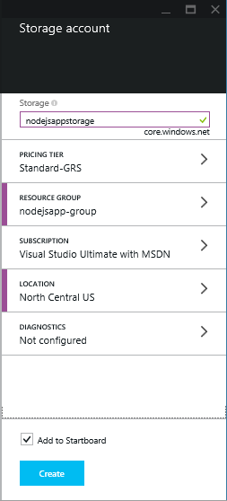
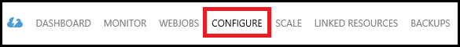
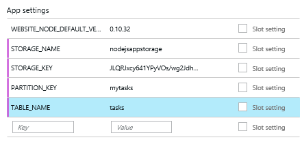

<properties
    pageTitle="Dans le navigateur Node.js au moyen du Service de Table Azure"
    description="Ce didacticiel vous apprend à utiliser le service de Table Azure pour stocker les données à partir d’une application Node.js qui est hébergée dans Azure Application Service Web Apps."
    tags="azure-portal"
    services="app-service\web, storage"
    documentationCenter="nodejs"
    authors="rmcmurray"
    manager="wpickett"
    editor=""/>

<tags
    ms.service="storage"
    ms.workload="storage"
    ms.tgt_pltfrm="na"
    ms.devlang="nodejs"
    ms.topic="article"
    ms.date="08/11/2016"
    ms.author="robmcm"/>

# Dans le navigateur Node.js au moyen du Service de Table Azure

## Vue d’ensemble

Ce didacticiel montre comment utiliser le service de Table fourni par la gestion des données Azure pour stocker et accéder aux données à partir d’une application [nœud] hébergée dans [Azure Application Service](http://go.microsoft.com/fwlink/?LinkId=529714) Web Apps. Ce didacticiel suppose que vous avez déjà préalable utilisé le nœud et [Git].

Vous allez apprendre :

* Comment utiliser npm (Gestionnaire de package nœud) pour installer les modules nœud

* Comment travailler avec le service de Table Azure

* Comment utiliser l’infrastructure du langage commun Azure pour créer une application web.

En suivant ce didacticiel, vous allez créer une simple-based application « liste de tâches » qui permet de créer, extraction et exécution de tâches. Les tâches sont stockées dans le service de tableau.

Voici l’application terminée :

![Une page web affichant une liste des tâches vide][node-table-finished]

>[AZURE.NOTE] Si vous voulez commencer à utiliser le Service d’application Azure avant de vous inscrire pour un compte Azure, accédez à [Essayer le Service application](http://go.microsoft.com/fwlink/?LinkId=523751), où vous pouvez créer une application web starter courte immédiatement dans le Service d’application. Aucune carte de crédit obligatoire ; Aucune engagements.

## Conditions préalables

Avant de suivre les instructions fournies dans cet article, assurez-vous que vous avez les éléments suivants :

* [nœud] version 0.10.24 ou une version ultérieure

* [GIT]

[AZURE.INCLUDE [create-account-and-websites-note](../../includes/create-account-and-websites-note.md)]

## Créer un compte de stockage

Créez un compte de stockage Azure. L’application utilise ce compte pour stocker les éléments des tâches.

1.  Connectez-vous au [portail Azure](https://portal.azure.com/).

2. Cliquez sur l’icône **Nouveau** dans le coin inférieur gauche du portail de, puis cliquez sur **données + stockage** > **stockage**. Attribuez un nom unique le compte de stockage et créer un [groupe de ressources](../azure-resource-manager/resource-group-overview.md) de celui-ci.

    

    Lorsque le compte de stockage a été créé, le bouton **Notifications** clignote en vert **SUCCESS** et carte de compte de stockage est ouverte pour afficher qu’il appartient au nouveau groupe de ressources que vous avez créé.

5. Dans la carte de compte de stockage, cliquez sur **paramètres** > **clés**. Copiez la clé primaire access dans le Presse-papiers.

    ![Touche d’accès rapide][portal-storage-access-keys]

##Installer des modules et générer la structure

Dans cette section, vous créez une nouvelle application nœud et npm permet d’ajouter des packages de module. Pour cette application, vous allez utiliser les modules [Express] et [Azure] . Le module Express fournit une infrastructure de modèle Vue contrôleur pour nœud, tandis que les modules Azure fournit la connectivité au service Table.

### Installer express et générer la structure

1. À partir de la ligne de commande, créez un répertoire nommé **liste des tâches** et basculer vers ce répertoire.  

2. Entrez la commande suivante pour installer le module Express.

        npm install express-generator@4.2.0 -g

    Selon le système d’exploitation, vous devrez peut-être placer 'sudo' avant la commande :

        sudo npm install express-generator@4.2.0 -g

    Le résultat doit ressembler à l’exemple suivant :

        express-generator@4.2.0 /usr/local/lib/node_modules/express-generator
        ├── mkdirp@0.3.5
        └── commander@1.3.2 (keypress@0.1.0)

    > [AZURE.NOTE] Le «-g' paramètre installe le module globalement. De cette façon, nous pouvons utiliser **express** pour générer la structure de l’application web sans avoir à taper les informations de chemin d’accès supplémentaire.

4. Pour créer la structure de l’application, entrez la commande **express** :

        express

    Le résultat de cette commande ressemble à l’exemple suivant :

           create : .
           create : ./package.json
           create : ./app.js
           create : ./public
           create : ./public/images
           create : ./routes
           create : ./routes/index.js
           create : ./routes/users.js
           create : ./public/stylesheets
           create : ./public/stylesheets/style.css
           create : ./views
           create : ./views/index.jade
           create : ./views/layout.jade
           create : ./views/error.jade
           create : ./public/javascripts
           create : ./bin
           create : ./bin/www

           install dependencies:
             $ cd . && npm install

           run the app:
             $ DEBUG=my-application ./bin/www

    Vous avez maintenant plusieurs fichiers dans le répertoire de la **liste des tâches** et des répertoires.

### Installer des modules complémentaires

Parmi les fichiers que **express** crée est **package.json**. Ce fichier contient la liste des dépendances de module. Plus tard, lorsque vous déployez l’application à l’application de Service Web Apps, ce fichier détermine les modules qui doivent être installés sur Azure.

À partir de la ligne de commande, entrez la commande suivante pour installer les modules décrits dans le fichier **package.json** . Vous devrez peut-être utiliser « sudo ».

    npm install

Le résultat de cette commande ressemble à l’exemple suivant :

    debug@0.7.4 node_modules\debug

    cookie-parser@1.0.1 node_modules\cookie-parser
    ├── cookie-signature@1.0.3
    └── cookie@0.1.0

    [...]

Ensuite, entrez la commande suivante pour installer les modules [azure], le [nœud uuid], [nconf] et [asynchrone] :

    npm install azure-storage node-uuid async nconf --save

La **--Enregistrer** indicateur ajoute des entrées pour ces modules vers le fichier **package.json** .

Le résultat de cette commande ressemble à l’exemple suivant :

    async@0.9.0 node_modules\async

    node-uuid@1.4.1 node_modules\node-uuid

    nconf@0.6.9 node_modules\nconf
    ├── ini@1.2.1
    ├── async@0.2.9
    └── optimist@0.6.0 (wordwrap@0.0.2, minimist@0.0.10)

    [...]

## Créer l’application

Nous sommes maintenant prêts à créer l’application.

### Créer un modèle

Un *modèle* est un objet qui représente les données dans votre application. Pour l’application, le modèle uniquement est un objet de la tâche, qui représente un élément dans la liste des tâches. Tâches aura les champs suivants :

- PartitionKey
- RowKey
- nom (chaîne)
- catégorie (chaîne)
- terminé (booléen)

**PartitionKey** et **RowKey** sont utilisées par le Service de tableau en tant que clés de la table. Pour plus d’informations, voir [Présentation du modèle de données de Service de la Table](https://msdn.microsoft.com/library/azure/dd179338.aspx).

1. Dans le répertoire de la **liste des tâches** , créez un nouveau répertoire nommé **modèles**.

2. Dans le répertoire de **modèles** , créez un nouveau fichier nommé **task.js**. Ce fichier contient le modèle pour les tâches créées par votre application.

3. Au début du fichier **task.js** , ajoutez le code suivant pour faire référence à des bibliothèques requis :

        var azure = require('azure-storage');
        var uuid = require('node-uuid');
        var entityGen = azure.TableUtilities.entityGenerator;

4. Ajoutez le code suivant pour définir et exporter l’objet de la tâche. Cet objet est responsable de la connexion à la table.

        module.exports = Task;

        function Task(storageClient, tableName, partitionKey) {
          this.storageClient = storageClient;
          this.tableName = tableName;
          this.partitionKey = partitionKey;
          this.storageClient.createTableIfNotExists(tableName, function tableCreated(error) {
            if(error) {
              throw error;
            }
          });
        };

5. Ajoutez le code suivant pour définir des méthodes supplémentaires sur l’objet de la tâche, qui autorisent les interactions avec les données stockées dans le tableau :

        Task.prototype = {
          find: function(query, callback) {
            self = this;
            self.storageClient.queryEntities(this.tableName, query, null, function entitiesQueried(error, result) {
              if(error) {
                callback(error);
              } else {
                callback(null, result.entries);
              }
            });
          },

          addItem: function(item, callback) {
            self = this;
            // use entityGenerator to set types
            // NOTE: RowKey must be a string type, even though
            // it contains a GUID in this example.
            var itemDescriptor = {
              PartitionKey: entityGen.String(self.partitionKey),
              RowKey: entityGen.String(uuid()),
              name: entityGen.String(item.name),
              category: entityGen.String(item.category),
              completed: entityGen.Boolean(false)
            };
            self.storageClient.insertEntity(self.tableName, itemDescriptor, function entityInserted(error) {
              if(error){  
                callback(error);
              }
              callback(null);
            });
          },

          updateItem: function(rKey, callback) {
            self = this;
            self.storageClient.retrieveEntity(self.tableName, self.partitionKey, rKey, function entityQueried(error, entity) {
              if(error) {
                callback(error);
              }
              entity.completed._ = true;
              self.storageClient.updateEntity(self.tableName, entity, function entityUpdated(error) {
                if(error) {
                  callback(error);
                }
                callback(null);
              });
            });
          }
        }

6. Enregistrez et fermez le fichier **task.js** .

### Créer un contrôleur

Un *contrôleur* gère les requêtes HTTP et affiche la réponse HTML.

1. Dans le **répertoire/itinéraires liste des tâches** , créez un nouveau fichier nommé **tasklist.js** et ouvrez-la dans un éditeur de texte.

2. Ajouter le code suivant à **tasklist.js**. Cette opération charge les modules azure et asynchrone, qui sont utilisés par **tasklist.js**. La fonction **liste des tâches** , qui est une instance de l’objet de **tâche** définie précédemment passée définit également :

        var azure = require('azure-storage');
        var async = require('async');

        module.exports = TaskList;

3. Définir un objet de la **liste des tâches** .

        function TaskList(task) {
          this.task = task;
        }

4. Ajoutez les méthodes suivantes à la **liste des tâches**:

        TaskList.prototype = {
          showTasks: function(req, res) {
            self = this;
            var query = new azure.TableQuery()
              .where('completed eq ?', false);
            self.task.find(query, function itemsFound(error, items) {
              res.render('index',{title: 'My ToDo List ', tasks: items});
            });
          },

          addTask: function(req,res) {
            var self = this;
            var item = req.body.item;
            self.task.addItem(item, function itemAdded(error) {
              if(error) {
                throw error;
              }
              res.redirect('/');
            });
          },

          completeTask: function(req,res) {
            var self = this;
            var completedTasks = Object.keys(req.body);
            async.forEach(completedTasks, function taskIterator(completedTask, callback) {
              self.task.updateItem(completedTask, function itemsUpdated(error) {
                if(error){
                  callback(error);
                } else {
                  callback(null);
                }
              });
            }, function goHome(error){
              if(error) {
                throw error;
              } else {
               res.redirect('/');
              }
            });
          }
        }

### Modifier app.js

1. À partir du répertoire de la **liste des tâches** , ouvrez le fichier **app.js** . Ce fichier a été créé en exécutant la commande **express** .

2. Au début du fichier, ajoutez le code suivant pour charger le module azure, définir le nom de la table clé de partition et les informations d’identification de stockage utilisées par cet exemple :

        var azure = require('azure-storage');
        var nconf = require('nconf');
        nconf.env()
             .file({ file: 'config.json', search: true });
        var tableName = nconf.get("TABLE_NAME");
        var partitionKey = nconf.get("PARTITION_KEY");
        var accountName = nconf.get("STORAGE_NAME");
        var accountKey = nconf.get("STORAGE_KEY");

    > [AZURE.NOTE] nconf se charge les valeurs de configuration à partir des variables d’environnement ou le fichier **config.json** , nous allons créer ultérieurement.

3. Dans le fichier app.js, faites défiler jusqu'à l’endroit où vous voyez la ligne suivante :

        app.use('/', routes);
        app.use('/users', users);

    Remplacez les lignes ci-dessus par le code indiqué ci-dessous. Une instance de <strong>tâche</strong> avec une connexion à votre compte de stockage sera initialisé. Il est passé à la <strong>liste des tâches</strong>, qui utilisent pour communiquer avec le service de tableau :

        var TaskList = require('./routes/tasklist');
        var Task = require('./models/task');
        var task = new Task(azure.createTableService(accountName, accountKey), tableName, partitionKey);
        var taskList = new TaskList(task);

        app.get('/', taskList.showTasks.bind(taskList));
        app.post('/addtask', taskList.addTask.bind(taskList));
        app.post('/completetask', taskList.completeTask.bind(taskList));

4. Enregistrez le fichier **app.js** .

### Modifier l’affichage d’index

1. Ouvrez le fichier **tasklist/views/index.jade** dans un éditeur de texte.

2. Remplacez tout le contenu du fichier par le code suivant. Cette opération définit un mode qui affiche les tâches existantes et contient un formulaire pour l’ajout de nouvelles tâches et marquage existants comme étant terminée.

        extends layout

        block content
          h1= title
          br

          form(action="/completetask", method="post")
            table.table.table-striped.table-bordered
              tr
                td Name
                td Category
                td Date
                td Complete
              if (typeof tasks === "undefined")
                tr
                  td
              else
                each task in tasks
                  tr
                    td #{task.name._}
                    td #{task.category._}
                    - var day   = task.Timestamp._.getDate();
                    - var month = task.Timestamp._.getMonth() + 1;
                    - var year  = task.Timestamp._.getFullYear();
                    td #{month + "/" + day + "/" + year}
                    td
                      input(type="checkbox", name="#{task.RowKey._}", value="#{!task.completed._}", checked=task.completed._)
            button.btn(type="submit") Update tasks
          hr
          form.well(action="/addtask", method="post")
            label Item Name:
            input(name="item[name]", type="textbox")
            label Item Category:
            input(name="item[category]", type="textbox")
            br
            button.btn(type="submit") Add item

3. Enregistrez et fermez le fichier **index.jade** .

### Modifier la mise en page Général

Le fichier **layout.jade** dans le répertoire **affichages** est un modèle global d’autres fichiers **.jade** . Dans cette étape, vous allez modifier pour qu’il utilise [Démarrage Twitter](https://github.com/twbs/bootstrap), c'est-à-dire un jeu d’outils qui facilite la création d’une application web aspect piles.

Téléchargez et extraire les fichiers de [Démarrage Twitter](http://getbootstrap.com/). Copiez le fichier **bootstrap.min.css** le dossier démarrage **css** dans le répertoire **public/feuilles de style** de votre application.

À partir du dossier **vues** , ouvrez **layout.jade** et remplacez l’intégralité du contenu avec les éléments suivants :

    doctype html
    html
      head
        title= title
        link(rel='stylesheet', href='/stylesheets/bootstrap.min.css')
        link(rel='stylesheet', href='/stylesheets/style.css')
      body.app
        nav.navbar.navbar-default
          div.navbar-header
          a.navbar-brand(href='/') My Tasks
        block content

### Créer un fichier de configuration

Pour exécuter l’application localement, nous allons présenter les informations d’identification Azure stockage dans un fichier de configuration. Créez un fichier nommé * *config.json* *avec le JSON suivant :

    {
        "STORAGE_NAME": "<storage account name>",
        "STORAGE_KEY": "<storage access key>",
        "PARTITION_KEY": "mytasks",
        "TABLE_NAME": "tasks"
    }

Remplacez le **nom de compte de stockage** par le nom du compte de stockage que vous avez créée et remplacez **touche d’accès rapide stockage** avec la touche d’accès principal pour votre compte de stockage. Par exemple :

    {
        "STORAGE_NAME": "nodejsappstorage",
        "STORAGE_KEY": "KG0oDd..."
        "PARTITION_KEY": "mytasks",
        "TABLE_NAME": "tasks"
    }

Enregistrer ce fichier *répertoire de niveau supérieur* à celui du répertoire de la **liste des tâches** , comme suit :

    parent/
      |-- config.json
      |-- tasklist/

La raison pour cela est d’éviter de vérifier le fichier de configuration dans le contrôle de source, où il peut s’avérer public. Lors du déploiement de l’application vers Azure, nous allons utiliser des variables d’environnement au lieu d’un fichier de configuration.

## Exécutez l’application localement

Pour tester l’application sur votre ordinateur local, procédez comme suit :

1. À partir de la ligne de commande, accédez au répertoire de la **liste des tâches** .

2. Pour lancer l’application localement, utilisez la commande suivante :

        npm start

3. Ouvrez un navigateur web et accédez à http://127.0.0.1:3000.

    Une page web semblable à l’exemple suivant s’affiche.

    ![Une page Web affichant une liste des tâches vide][node-table-finished]

4. Pour créer un nouvel élément des tâches, entrez un nom et une catégorie, puis cliquez sur **Ajouter un élément**. 

6. Pour marquer une tâche comme terminée, vérifiez **achevé** et cliquez sur **Mettre à jour les tâches**.

    ![Image du nouvel élément dans la liste des tâches][node-table-list-items]

Même si l’application est en cours d’exécution en local, qu’il stocke les données dans le service de Table Azure.

## Déployer votre application dans Azure

Les étapes décrites dans cette section utilisent les outils de ligne de commande Azure pour créer une nouvelle application web dans le Service d’application et utilisent ensuite Git pour déployer votre application. Pour effectuer ces étapes, vous devez posséder un abonnement Azure.

> [AZURE.NOTE] Ces étapes peuvent également être effectuées à l’aide du [Portail Azure](https://portal.azure.com/). Voir [créer et déployer une application web Node.js dans le Service d’application Azure].
>
> S’il s’agit de l’application web première que vous avez créé, vous devez utiliser le portail Azure pour déployer cette application.

Pour commencer, installez l' [Infrastructure du langage commun Azure] en entrant la commande suivante à partir de la ligne de commande :

    npm install azure-cli -g

### Importer les paramètres de publication

Dans cette étape, vous allez télécharger un fichier contenant des informations sur votre abonnement.

1. Entrez la commande suivante :

        azure account download

    Cette commande lance un navigateur et accède à la page de téléchargement. Si vous y êtes invité, connectez-vous avec le compte associé à votre abonnement Azure.

    <!-- ![The download page][download-publishing-settings] -->

    Le téléchargement du fichier démarre automatiquement ; Si elle n’est pas le cas, vous pouvez cliquer sur le lien au début de la page pour télécharger manuellement le fichier. Enregistrer le fichier et notez le chemin d’accès du fichier.

2. Entrez la commande suivante pour importer les paramètres :

        azure account import <path-to-file>

    Spécifiez le chemin d’accès et le nom du fichier de paramètres publication que vous avez téléchargée à l’étape précédente.

3. Une fois les paramètres importés, supprimez le fichier de paramètres de publication. Il n’est plus nécessaire et contient des informations sensibles concernant votre abonnement Azure.

### Créer une application web application Service

1. À partir de la ligne de commande, accédez au répertoire de la **liste des tâches** .

2. Utilisez la commande suivante pour créer une nouvelle application web.

        azure site create --git

    Vous demandera le nom de l’application web et l’emplacement. Indiquez un nom unique et sélectionnez le même emplacement géographique comme votre compte de stockage Azure.

    La `--git` paramètre crée un référentiel Git sur Azure pour cette application web. Son initialisation également un référentiel Git dans le répertoire actif si aucun existe et ajoute un [Git distant] nommé « azure », qui est utilisé pour publier l’application sur Azure. Enfin, il crée un fichier **web.config** , qui contient les paramètres utilisés par Azure pour héberger des applications nœud. Si vous omettez le `--git` paramètre mais que le répertoire contient un référentiel Git, la commande toujours créera l’azure' ' à distance.

    Une fois cette commande terminée, vous verrez sortie similaire à ce qui suit. Notez que la ligne commençant par le **site Web créé en** contienne l’URL de l’application web.

        info:   Executing command site create
        help:   Need a site name
        Name: TableTasklist
        info:   Using location southcentraluswebspace
        info:   Executing `git init`
        info:   Creating default .gitignore file
        info:   Creating a new web site
        info:   Created web site at  tabletasklist.azurewebsites.net
        info:   Initializing repository
        info:   Repository initialized
        info:   Executing `git remote add azure https://username@tabletasklist.azurewebsites.net/TableTasklist.git`
        info:   site create command OK

    > [AZURE.NOTE] S’il s’agit de la première application Service web app pour votre abonnement, vous serez invité à utiliser le portail Azure pour créer l’application web. Pour plus d’informations, voir [créer et déployer une application web Node.js dans le Service d’application Azure].

### Définir les variables d’environnement

Dans cette étape, vous allez ajouter des variables d’environnement à votre configuration d’application web sur Azure.
À partir de la ligne de commande, entrez les informations suivantes :

    azure site appsetting add
        STORAGE_NAME=<storage account name>;STORAGE_KEY=<storage access key>;PARTITION_KEY=mytasks;TABLE_NAME=tasks

Remplacer **<storage account name>** avec le nom de l’espace de stockage du compte que vous avez créé précédemment, puis remplacez **<storage access key>** avec la touche d’accès principal pour votre compte de stockage. (Utiliser les mêmes valeurs que le fichier config.json que vous avez créé précédemment).

Vous pouvez également définir les variables d’environnement dans le [Portail Azure](https://portal.azure.com/):

1.  Ouvrir la carte de l’application web en cliquant sur **Parcourir** > **Web Apps** > votre nom de l’application web.

1.  Dans la carte de votre application web, cliquez sur **Tous les paramètres** > **Paramètres de l’Application**.

    <!--  -->

1.  Faites défiler jusqu'à la section **paramètres de l’application** et ajoutez les paires clé/valeur.

    

1. Cliquez sur **Enregistrer**.

### Publication de l’application

Pour publier l’application, valider les fichiers de code à Git et maintenez enfoncé puis azure/masque.

1. Définissez vos informations d’identification de déploiement.

        azure site deployment user set <name> <password>

2. Ajouter et valider vos fichiers d’application.

        git add .
        git commit -m "adding files"

3. Distribuer la validation à l’application web application Service :

        git push azure master

    Utiliser **maître** comme la branche cible. À la fin du déploiement, vous verrez une instruction similaire à l’exemple suivant :

        To https://username@tabletasklist.azurewebsites.net/TableTasklist.git
         * [new branch]      master -> master

4. Une fois l’opération de diffusion terminée, accédez à l’URL de l’application web précédemment renvoyée par la `azure create site` commande pour afficher votre application.

## Étapes suivantes

Tandis que les étapes décrites dans cet article décrivent l’utilisation du Service de Table pour stocker les informations, vous pouvez également utiliser [MongoDB](https://mlab.com/azure/). 

## Ressources supplémentaires

[Azure infrastructure du langage commun]

## Ce qui a changé
* Pour un guide à la modification de sites Web Application Service voir : [Azure Application Service et son Impact sur les Services Azure existants](http://go.microsoft.com/fwlink/?LinkId=529714)

<!-- URLs -->

[Créer et déployer une application web Node.js dans le Service d’application Azure]: web-sites-nodejs-develop-deploy-mac.md
[Azure Developer Center]: /develop/nodejs/

[nœud]: http://nodejs.org
[GIT]: http://git-scm.com
[Express]: http://expressjs.com
[for free]: http://windowsazure.com
[GIT à distance]: http://git-scm.com/docs/git-remote

[Azure infrastructure du langage commun]: ../xplat-cli-install.md

[Azure]: https://github.com/Azure/azure-sdk-for-node
[nœud uuid]: https://www.npmjs.com/package/node-uuid
[nconf]: https://www.npmjs.com/package/nconf
[asynchrone]: https://www.npmjs.com/package/async

[Azure Portal]: https://portal.azure.com

[Create and deploy a Node.js application to an Azure Web Site]: web-sites-nodejs-develop-deploy-mac.md
 
<!-- Image References -->

[node-table-finished]: ./media/storage-nodejs-use-table-storage-web-site/table_todo_empty.png
[node-table-list-items]: ./media/storage-nodejs-use-table-storage-web-site/table_todo_list.png
[download-publishing-settings]: ./media/storage-nodejs-use-table-storage-web-site/azure-account-download-cli.png
[portal-new]: ./media/storage-nodejs-use-table-storage-web-site/plus-new.png
[portal-storage-account]: ./media/storage-nodejs-use-table-storage-web-site/new-storage.png
[portal-quick-create-storage]: ./media/storage-nodejs-use-table-storage-web-site/quick-storage.png
[portal-storage-access-keys]: ./media/storage-nodejs-use-table-storage-web-site/manage-access-keys.png
[go-to-dashboard]: ./media/storage-nodejs-use-table-storage-web-site/go_to_dashboard.png
[web-configure]: ./media/storage-nodejs-use-table-storage-web-site/sql-task-configure.png
[app-settings-save]: ./media/storage-nodejs-use-table-storage-web-site/savebutton.png
[app-settings]: ./media/storage-nodejs-use-table-storage-web-site/storage-tasks-appsettings.png
