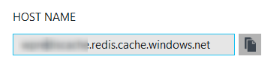
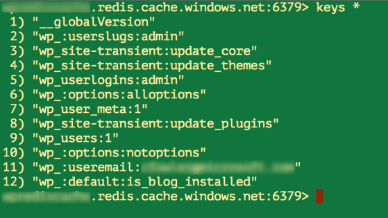

<properties
    pageTitle="Connecter une application web dans le Service d’application Azure pour mettre en Cache Redis via le protocole Memcache | Microsoft Azure"
    description="Connecter une application web dans le service d’application Azure pour mettre en Cache Redis en utilisant le protocole Memcache"
    services="app-service\web"
    documentationCenter="php"
    authors="SyntaxC4"
    manager="wpickett"
    editor="riande"/>

<tags
    ms.service="app-service-web"
    ms.devlang="php"
    ms.topic="get-started-article"
    ms.tgt_pltfrm="windows"
    ms.workload="na"
    ms.date="02/29/2016"
    ms.author="cfowler"/>

# <a name="connect-a-web-app-in-azure-app-service-to-redis-cache-via-the-memcache-protocol"></a>Connecter une application web dans le Service d’application Azure pour mettre en Cache Redis via le protocole Memcache

Dans cet article, vous allez apprendre à vous connecter une application web WordPress dans le [Service d’application Azure](http://go.microsoft.com/fwlink/?LinkId=529714) [Azure Redis] cache[ 12] à l’aide de la [Memcache] [ 13] protocole. Si vous avez une application web existante qui utilise un serveur Memcached pour la mise en cache en mémoire, vous pouvez effectuer une migration vers Azure Application Service et utiliser la solution de mise en cache internes dans Microsoft Azure avec peu ou pas de modification à votre code de l’application. En outre, vous pouvez utiliser votre Memcache existant compétences pour créer hautement scalable, distributed applications dans le Service d’application Azure avec Azure Redis Cache de mise en cache en mémoire, lors de l’utilisation de structures d’application populaires tels que .NET PHP, Node.js, Java et Python.  

Application Service Web Apps permet ce scénario d’application avec le correctif Memcache des applications Web, ce qui correspond à un serveur Memcached local qui se comporte comme un proxy Memcache pour mettre en cache des appels au Cache Redis Azure. Cela permet de n’importe quelle application qui communique à l’aide du protocole Memcache en cache des données avec Redis Cache. Ce correctif Memcache fonctionne au niveau du protocole, afin qu’il puisse être utilisé par toute application ou l’infrastructure de l’application dans la mesure où il communique à l’aide du protocole Memcache.

[AZURE.INCLUDE [app-service-web-to-api-and-mobile](../../includes/app-service-web-to-api-and-mobile.md)] 

## <a name="prerequisites"></a>Conditions préalables

Le correctif Memcache des applications Web peut être utilisé avec n’importe quelle application autant il communique à l’aide du protocole Memcache. Pour cet exemple, l’application de référence est un site WordPress Scalable qui peut être mis en service à partir de Azure Marketplace.

Suivez les étapes décrites dans les articles suivants :

* [Configurer une instance du Service de Cache Redis Azure][0]
* [Déployer un site WordPress Scalable dans Azure][1]

Une fois que le site WordPress Scalable déployée et une instance de Cache Redis sa mise en service, vous serez prêt à procéder à l’activation le correctif Memcache dans Azure Application Service Web Apps.

## <a name="enable-the-web-apps-memcache-shim"></a>Activer le correctif Memcache des applications Web

Pour configurer le correctif Memcache, vous devez créer trois paramètres de l’application. Cela peut être effectuée à l’aide de plusieurs méthodes, y compris le [Portail Azure](http://go.microsoft.com/fwlink/?LinkId=529715), le [portail classique][3], les [Applets de commande PowerShell Azure] [ 5] ou de l' [Interface de ligne Azure][5]. Aux fins de ce billet, je vais utiliser le [Portail Azure] [ 4] pour définir les paramètres de l’application. Les valeurs suivantes peuvent être extraites cuillère **paramètres** du votre instance de Cache Redis.


### <a name="add-redishost-app-setting"></a>Ajouter un paramètre d’application REDIS_HOST

Est le premier paramètre de l’application que vous avez besoin pour créer la **REDIS\_hôte** paramètre d’application. Ce paramètre définit la destination auquel le correctif transfère les informations du cache. La valeur requise pour le paramètre d’application REDIS_HOST peut être extraite à partir de la carte de **Propriétés** de votre instance de Cache Redis.



Définir la clé du paramètre application à **REDIS\_hôte** et la valeur du paramètre d’application pour le **nom d’hôte** de l’instance de Cache Redis.


### <a name="add-rediskey-app-setting"></a>Ajouter un paramètre d’application REDIS_KEY

La deuxième définie application vous devez créer la **REDIS\_clé** paramètre d’application. Ce paramètre fournit que le jeton d’authentification requise pour l’accès en toute sécurité l’instance de Cache Redis. Vous pouvez récupérer la valeur requise pour le paramètre d’application REDIS_KEY à partir de la carte de **touches d’accès rapide** de l’instance de Cache Redis.


Définir la clé du paramètre application à **REDIS\_clé** et la valeur du paramètre d’application à la **Clé primaire** de l’instance de Cache Redis.


### <a name="add-memcacheshimredisenable-app-setting"></a>Ajouter un paramètre d’application MEMCACHESHIM_REDIS_ENABLE

Le dernier paramètre de l’application est utilisé pour activer le correctif Memcache dans les applications Web, qui utilise la REDIS_HOST et REDIS_KEY pour vous connecter au Cache Redis Azure et transférer le cache appels. Définir la clé du paramètre application à **MEMCACHESHIM\_REDIS\_activer** et la valeur **Vrai**.


Une fois que vous avez terminé d’ajouter les paramètres de l’application trois (3), cliquez sur **Enregistrer**.

## <a name="enable-memcache-extension-for-php"></a>Activer l’extension Memcache pour PHP

Dans l’ordre de l’application à parler le protocole Memcache, il est nécessaire installer l’extension Memcache PHP--le cadre de la langue de votre site WordPress.

### <a name="download-the-phpmemcache-extension"></a>Télécharger l’Extension php_memcache

Accédez à [PECL][6]. Sous la catégorie de mise en cache, cliquez sur [memcache][7]. Sous la colonne téléchargements, cliquez sur le lien de mise en registre.


Télécharger le lien Non-Thread approuvés (NTS) x86 pour la version de PHP activé dans les applications Web. (Valeur par défaut est PHP 5.4)


### <a name="enable-the-phpmemcache-extension"></a>Activer l’extension php_memcache

Après avoir téléchargé le fichier, décompresser le fichier et télécharger les **php\_memcache.dll** dans la **d\\accueil\\site\\wwwroot\\emplacement\\texte\\ ** répertoire. Après que le php_memcache.dll est téléchargé dans l’application web, vous devez activer l’extension au Runtime PHP. Pour activer l’extension Memcache dans le portail Azure, ouvrez la carte de **Paramètres de l’Application** pour l’application web, puis ajouter un nouveau paramètre d’application avec la touche de **PHP\_EXTENSIONS** et la valeur **emplacement\\texte\\php_memcache.dll**.


> [AZURE.NOTE] Si l’application web doit charger plusieurs extensions PHP, la valeur de PHP_EXTENSIONS doit être une liste délimitée par des virgules des chemins d’accès relatifs aux fichiers DLL.


Une fois que vous avez terminé, cliquez sur **Enregistrer**.

## <a name="install-memcache-wordpress-plugin"></a>Installer le plug-in Memcache WordPress

> [AZURE.NOTE] Vous pouvez également télécharger le [Plug-in Memcached objet Cache](https://wordpress.org/plugins/memcached/) depuis WordPress.org.

Dans la page de plug-ins WordPress, cliquez sur **Ajouter nouveau**.


Dans la zone Rechercher, tapez **memcached** et appuyez sur **entrée**.


Recherchez le **Cache d’objets Memcached** dans la liste, puis cliquez sur **Installer maintenant**.


### <a name="enable-the-memcache-wordpress-plugin"></a>Activer le plug-in Memcache WordPress

>[AZURE.NOTE] Suivez les instructions dans ce billet de blog à [l’activation d’une Extension de Site dans les applications Web] [ 8] pour installer Visual Studio Team Services.

Dans la `wp-config.php` , ajoutez le code suivant au-dessus de l’arrêter la modification de commentaire au bas du fichier.

```php
$memcached_servers = array(
    'default' => array('localhost:' . getenv("MEMCACHESHIM_PORT"))
);
```

Une fois ce code a été copié, monaco enregistre automatiquement le document.

L’étape suivante consiste à activer le plug-in cache d’objets. Pour ce faire glisser-déplacer des **objets cache.php** **wp-contenu/plug-ins/memcached** dossier vers le dossier **du contenu wp** pour activer la fonctionnalité de Cache d’objets Memcache.


Maintenant que le fichier **objet cache.php** se trouve dans le dossier **du contenu wp** , le Cache d’objets Memcached est activé.


## <a name="verify-the-memcache-object-cache-plugin-is-functioning"></a>Vérifier que le plug-in Cache d’objets Memcache fonctionne

Toutes les étapes pour activer le correctif Memcache des applications Web sont maintenant terminées. Ne vous reste consiste à vérifier que les données sont Complétez votre instance de Cache Redis.

### <a name="enable-the-non-ssl-port-support-in-azure-redis-cache"></a>Activer la prise en charge du port non SSL dans Azure Redis Cache

>[AZURE.NOTE] Au moment de la rédaction de cet article, l’infrastructure du langage commun Redis ne reconnaît pas la connectivité SSL, et donc les étapes suivantes sont nécessaires.

Dans le portail Azure, accédez à l’instance de Cache Redis que vous avez créé pour cette application web. Une fois la carte du cache est ouvert, cliquez sur l’icône **paramètres** .


Sélectionnez les **Ports d’accès** dans la liste.


Cliquez sur **non** pour **Autoriser l’accès uniquement via SSL**.


Vous verrez que le port NON-SSL est maintenant défini. Cliquez sur **Enregistrer**.


### <a name="connect-to-azure-redis-cache-from-redis-cli"></a>Se connecter aux Azure Redis Cache de redis-infrastructure du langage commun

>[AZURE.NOTE] Cette étape part du principe que redis est installé localement sur votre ordinateur de développement. [Installer Redis localement à l’aide de ces instructions][9].

Ouvrez votre console de ligne de commande de choix, puis tapez la commande suivante :

```shell
redis-cli –h <hostname-for-redis-cache> –a <primary-key-for-redis-cache> –p 6379
```

Remplacer le ** &lt;cache hostname pour redis&gt; ** avec le nom d’hôte xxxxx.redis.cache.windows.net réel et la ** &lt;principal clé pour redis cache&gt; ** avec la touche d’accès rapide pour le cache, puis appuyez sur **entrée**. Une fois que l’infrastructure du langage commun s’est connecté à l’instance de Cache Redis, émettre n’importe quelle commande redis. Dans la capture d’écran ci-dessous, j’ai choisi répertorier les clés.



L’appel pour répertorier les clés doit renvoyer une valeur. Si pas, essayez d’accéder à l’application web et essayez à nouveau.

## <a name="conclusion"></a>Conclusion

Félicitations ! L’application WordPress comporte maintenant un cache en mémoire centralisé pour vous aider à augmentation de débit. N’oubliez pas le correctif de Memcache applications Web peuvent être utilisé avec n’importe quel client Memcache quel que soit le langage de programmation ou infrastructure de l’application. Pour fournir des commentaires ou pour poser des questions sur le correctif Memcache des applications Web, publier sur les [Forums MSDN] [ 10] ou [Stackoverflow][11].

>[AZURE.NOTE] Si vous voulez commencer à utiliser le Service d’application Azure avant de vous inscrire pour un compte Azure, accédez à [Essayer le Service application](http://go.microsoft.com/fwlink/?LinkId=523751), où vous pouvez créer une application web starter courte immédiatement dans le Service d’application. Aucune carte de crédit obligatoire ; Aucune engagements.

## <a name="whats-changed"></a>Ce qui a changé
* Pour un guide à la modification de sites Web Application Service voir : [Azure Application Service et son impact sur les Services Azure existants](http://go.microsoft.com/fwlink/?LinkId=529714)


[0]: ../redis-cache/cache-dotnet-how-to-use-azure-redis-cache.md#create-a-cache
[1]: http://bit.ly/1t0KxBQ
[2]: http://manage.windowsazure.com
[3]: http://portal.azure.com
[4]: ../powershell-install-configure.md
[5]: /downloads
[6]: http://pecl.php.net
[7]: http://pecl.php.net/package/memcache
[8]: http://blog.syntaxc4.net/post/2015/02/05/how-to-enable-a-site-extension-in-azure-websites.aspx
[9]: http://redis.io/download#installation
[10]: https://social.msdn.microsoft.com/Forums/home?forum=windowsazurewebsitespreview
[11]: http://stackoverflow.com/questions/tagged/azure-web-sites
[12]: /services/cache/
[13]: http://memcached.org
