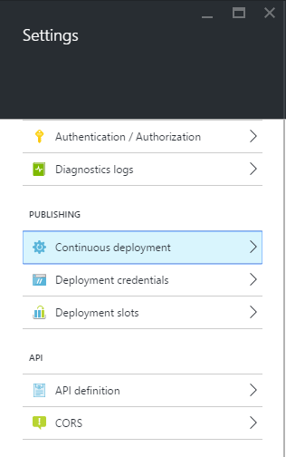
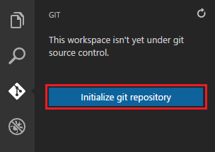

<properties
   pageTitle="Créer une application web ASP.NET 5 dans le Code de Visual Studio"
   description="Ce didacticiel montre comment créer une application web ASP.NET 5 à l’aide de Code de Visual Studio."
   services="app-service\web"
   documentationCenter=".net"
   authors="erikre"
   manager="wpickett"
   editor="jimbe"/>

<tags
    ms.service="app-service-web" 
    ms.workload="web" 
    ms.tgt_pltfrm="dotnet" 
    ms.devlang="na" 
    ms.topic="article" 
    ms.date="02/26/2016" 
    ms.author="cephalin"/>

# Créer une application web ASP.NET 5 dans le Code de Visual Studio

## Vue d’ensemble

Ce didacticiel montre comment créer une application web ASP.NET 5 à l’aide de [Visual Studio Code (Code VS)](http://code.visualstudio.com//Docs/whyvscode) et le déployez dans [Azure Application Service](../app-service/app-service-value-prop-what-is.md). 

> [AZURE.NOTE] Bien que cet article fait référence aux applications web, elle s’applique également à l’API applications et applications mobiles. 

ASP.NET 5 est une nouvelle conception significative d’ASP.NET. ASP.NET 5 est une nouvelle infrastructure open source et disponibilité sur plusieurs plateformes pour la création d’applications web moderne sur le cloud à l’aide de .NET. Pour plus d’informations, voir [présentation ASP.NET 5](http://docs.asp.net/en/latest/conceptual-overview/aspnet.html). Pour plus d’informations sur Azure Application Service web apps, voir [Vue d’ensemble des applications Web](app-service-web-overview.md).

[AZURE.INCLUDE [app-service-web-try-app-service.md](../../includes/app-service-web-try-app-service.md)]

## Conditions préalables  

* Installer [un Code VS](http://code.visualstudio.com/Docs/setup).
* D’installer [Node.js](http://nodejs.org) - groupes de Node.js est une plateforme pour créer des applications serveur rapide et format SVG à l’aide de JavaScript. Nœud est le runtime (nœud) et [npm](http://www.npmjs.com/) est le Gestionnaire de Package pour les modules nœud. Vous allez utiliser npm pour scaffold une application web ASP.NET 5 dans ce didacticiel.
* Installer Git - vous pouvez l’installer à partir de ces emplacements : [Chocolatey](https://chocolatey.org/packages/git) ou [git scm.com](http://git-scm.com/downloads). Si vous débutez dans Git, choisissez [git scm.com](http://git-scm.com/downloads) et sélectionnez l’option **d’Utilisation Git à partir de l’invite de commandes**. Une fois que vous installez Git, vous devez également définir le nom d’utilisateur Git et messagerie électronique comme il est requise plus loin dans le didacticiel (lorsque vous effectuez une validation à partir du Code VS).  

## Installer ASP.NET 5 et DNX
ASP.NET 5/DNX (l’environnement d’exécution .NET) est une pile .NET épurée pour la création de cloud moderne et les applications web qui s’exécutent sur OS X, Linux et Windows. Il a été généré à partir du sol vers le haut pour fournir une structure de développement optimisé pour les applications qui sont déployées dans le cloud ou exécuter en local. Il est constitué de modules avec impact minimal, afin de vous conservez flexibilité lors de la construction vos solutions.

Ce didacticiel est conçu pour vous aider à démarrer la création d’applications avec les dernières versions de développement de ASP.NET 5 et DNX. Suivez les instructions ci-dessous sont spécifiques à Windows. Pour plus d’instructions d’installation pour OS X, Linux et Windows, voir [l’installation d’ASP.NET 5 et DNX](https://code.visualstudio.com/Docs/ASPnet5#_installing-aspnet-5-and-dnx). 

1. Pour installer le Gestionnaire de Version .NET (DNVM) dans Windows, ouvrez une invite de commandes et exécutez la commande suivante.

        @powershell -NoProfile -ExecutionPolicy unrestricted -Command "&{$Branch='dev';iex ((new-object net.webclient).DownloadString('https://raw.githubusercontent.com/aspnet/Home/dev/dnvminstall.ps1'))}"

    Cela télécharger le script DNVM et placez-le dans votre répertoire de profil utilisateur. 

2. **Redémarrez Windows** pour terminer l’installation DNVM. 

    Après avoir redémarré Windows, vous pouvez ouvrir l’invite de commande pour vérifier l’emplacement de DNVM en entrant des opérations suivantes :

        where dnvm

    L’invite de commandes affiche un chemin d’accès similaire à ce qui suit.

    

3. Maintenant que vous avez DNVM, vous devez l’utiliser pour télécharger DNX pour exécuter vos applications. À l’invite, exécutez la procédure suivante :

        dnvm upgrade

    Vérifier votre DNVM et afficher le runtime actif en tapant ce qui suit à l’invite de commandes :

        dnvm list

    L’invite de commandes affiche les détails de l’exécution actif.

    

    Si plusieurs DNX runtime n’est répertorié, vous pouvez choisir d’entrer les opérations suivantes (ou une version plus récente) à l’invite de commande pour définir le runtime DNX actif. Définir la même version utilisé par le Générateur de 5 ASP.NET lorsque vous créez votre application web plus loin dans ce didacticiel. *Vous devrez pas modifier le runtime actif si elle est définie sur la dernière version disponible.*

        dnvm use 1.0.0-update1 –p

> [AZURE.NOTE] Pour plus d’instructions d’installation pour OS X, Linux et Windows, voir [l’installation d’ASP.NET 5 et DNX](https://code.visualstudio.com/Docs/ASPnet5#_installing-aspnet-5-and-dnx). 

## Créer l’application web 

Cette section vous montre comment scaffold nouvelle application web application ASP.NET. Vous allez utiliser le Gestionnaire de package nœud (npm) pour installer [Yeoman](http://yeoman.io/) (outil de la structure d’application - le Code VS équivalent de Visual Studio **fichier > Nouveau projet** opération), [Grunt](http://gruntjs.com/) (canal d’injection JavaScript tâche) et [Bower](http://bower.io/) (Gestionnaire de package côté client). 

1. Ouvrez une invite de commandes en tant qu’administrateur et accédez à l’emplacement où vous souhaitez créer votre projet ASP.NET. Par exemple, créez un répertoire *vscodeprojects* à la racine du lecteur C:\.

2. Entrez les informations suivantes à l’invite de commande pour installer Yeoman et les outils de prise en charge.

        npm install -g yo grunt-cli generator-aspnet bower

    > [AZURE.NOTE] Vous pouvez obtenir un avertissement suggérant que votre version npm est mis à jour. Ce message d’avertissement ne doit pas affecter ce didacticiel.

3. Entrez les informations suivantes à l’invite de commande pour créer le dossier du projet et scaffold l’application.

        yo aspnet

4. Utilisez les touches de direction pour sélectionner le type de **Base Web Application** dans le menu de générateur ASP.NET 5 et appuyez sur la touche ** &lt;entrée >**.

    

5. Définissez le nom de votre nouvelle application web ASP.NET sur **SampleWebApp**. Comme ce nom est utilisé jusqu'à la fin du didacticiel, si vous sélectionnez un autre nom, vous devez remplacer pour chaque occurrence de **SampleWebApp**. Lorsque vous appuyez sur ** &lt;entrée >**, Yeoman crée un nouveau dossier nommé **SampleWebApp** et les fichiers nécessaires pour votre nouvelle application.

6. À l’invite de commandes, accédez au dossier de votre nouveau projet :

        cd SampleWebApp

7. Également à l’invite de commandes, pour installer les packages NuGet nécessaires pour exécuter l’application, entrez la commande suivante :

        dnu restore

8. Ouvrez Code VS en entrant la commande suivante à l’invite :

        code .

## Exécuter l’application web localement

À présent que vous avez créé l’application web et récupérées tous les packages NuGet pour l’application, vous pouvez exécuter l’application web localement.

1. Dans la **Palette de commande** dans le Code VS, entrez la commande suivante pour afficher les options de commande Exécuter disponibles :

        dnx: Run Command

    > [AZURE.NOTE] Si le serveur Omnisharp n’est pas en cours d’exécution, il démarre. Entrez la commande ci-dessus.

    Ensuite, sélectionnez la commande suivante pour exécuter votre application web :
        
        dnx web - (SampleWebApp)

    La fenêtre de commande affiche que l’application a démarré. Si la fenêtre de commande n’affiche ce message, vérifiez le coin inférieur gauche corning de Code et les erreurs dans votre projet.
    
    > [AZURE.NOTE]Émission d’une commande dans la **Palette de commande** nécessite un **>** caractères au début de la ligne de commande. Vous pouvez afficher les détails relatifs à la commande **web** dans le fichier *project.json* .   
    > Si la commande n’apparaît pas ou n’est pas disponible, vous devrez peut-être installer l’extension c#. Exécuter `>Extensions: Install Extension` et `ext install c#` pour installer les extensions c#.

2. Ouvrez un navigateur et accédez à l’URL suivante.

    **http://localhost:5000**

    La page par défaut de l’application web s’affichent comme suit.

    

3. Fermer votre navigateur. Dans la **Fenêtre de commande**, appuyez sur **Ctrl + C** pour arrêter l’application et fermez la **Fenêtre de commande**. 

## Créer une application web dans le portail d’Azure

Les étapes suivantes vous guidera créer une application web dans le portail Azure.

1. Connectez-vous au [portail Azure](https://portal.azure.com).

2. Cliquez sur **Nouveau** dans la partie supérieure gauche du portail.

3. Cliquez sur **Web Applications > Web application**.

    

4. Entrez une valeur de **nom**, tel que **SampleWebAppDemo**. Notez que ce nom doit être unique et le portail applique que lorsque vous essayez d’entrer le nom. Par conséquent, si vous sélectionnez une entrée une valeur différente, vous devez remplacer par cette valeur pour chaque occurrence de **SampleWebAppDemo** que vous voyez dans ce didacticiel. 

5. Sélectionnez un existant de **Plan de Service d’application** ou créez-en une. Si vous créez une nouvelle offre, sélectionnez le niveau de tarification, emplacement et d’autres options. Pour plus d’informations sur les offres de Service d’application, voir l’article de la [vue d’ensemble détaillée de Service d’application Azure offres](../app-service/azure-web-sites-web-hosting-plans-in-depth-overview.md).

    

6. Cliquez sur **créer**.

    

## Activer la publication Git pour la nouvelle application web

GIT est un système de contrôle de version distribuée que vous pouvez utiliser pour déployer votre application web Azure Application Service. Vous pouvez stocker le code que vous écrivez pour votre application web dans un référentiel Git local, et vous serez déployez votre code Azure en appuyant sur un référentiel distant.   

1. Connectez-vous au [portail Azure](https://portal.azure.com).

2. Cliquez sur **Parcourir**.

3. Cliquez sur **Web Apps** pour afficher la liste des applications web associé à votre abonnement Azure.

4. Sélectionnez l’application web que vous avez créé dans ce didacticiel.

5. Dans la carte de l’application web, cliquez sur **paramètres** > **déploiement continue**. 

    

6. Cliquez sur **Choisir Source > référentiel Git Local**.

7. Cliquez sur **OK**.

    

8. Si vous n’avez pas déjà défini des informations d’identification de déploiement pour la publication d’une application web ou une autre application Service d’application, les configurer maintenant :

    * Cliquez sur **paramètres** > **informations d’identification de déploiement**. La carte de **définir les informations d’identification de déploiement** s’affiche.

    * Créer un nom d’utilisateur et mot de passe.  Vous aurez besoin ultérieurement ce mot de passe lors de la configuration Git.

    * Cliquez sur **Enregistrer**.

9. Dans la carte de votre application web, cliquez sur **Paramètres > Propriétés**. L’URL du référentiel Git à distance que vous allez déployer sur indiqué sous **GIT URL**.

10. Copiez la valeur **GIT URL** pour le réutiliser ultérieurement dans le didacticiel.

    

## Publier votre application web au Service d’application Azure

Dans cette section, vous allez créer un référentiel Git local et push à partir de ce référentiel vers Azure à déployer votre application web Azure.

1. Dans le Code VS, sélectionnez l’option **Git** dans la barre de navigation gauche.

    

2. Sélectionnez **initialisation git référentiel** pour vous assurer que votre espace de travail se trouve sous contrôle de code source git. 

    

3. Ouvrez la fenêtre de commande et accédez à l’annuaire de votre application web. Ensuite, entrez la commande suivante :

        git config core.autocrlf false

    Cette commande empêche un problème à propos du texte impliquant des fins de CRLF et fins de saut de ligne.

4. Dans le Code VS, ajouter un message de validation et cliquez sur l’icône à cocher **Valider tout** .

    

5. Une fois Git terminée traitement, vous verrez qu’il n’y a pas de fichiers répertoriés dans la fenêtre Git sous **modifications**. 

    

6. Rétablir la fenêtre de commande où l’invite de commandes pointe vers le répertoire où se trouve votre application web.

7. Créer une référence à distance pour pousser des mises à jour dans votre application web à l’aide de l’URL Git (numéro se termine par « .git ») que vous avez copiée précédemment.

        git remote add azure [URL for remote repository]

8. Configurer Git pour enregistrer vos informations d’identification localement afin qu’ils seront ajoutés automatiquement à vos commandes push générés à partir du Code VS.

        git config credential.helper store

9. Notifications Push vos modifications sur Azure en entrant la commande suivante. Après cette push initial vers Azure, vous pourrez effectuer toutes les commandes push à partir du Code VS. 

        git push -u azure master

    Vous êtes invité au mot de passe que vous avez créée précédemment dans Azure. **Remarque : Votre mot de passe ne sera pas visible.**

    Le résultat de la commande ci-dessus se termine par un message que déploiement a réussi.

        remote: Deployment successful.
        To https://user@testsite.scm.azurewebsites.net/testsite.git
        [new branch]      master -> master

> [AZURE.NOTE] Si vous apportez des modifications à votre application, vous pouvez publier directement dans le Code VS à l’aide de la fonctionnalité intégrée Git en sélectionnant l’option **Valider tous les** suivie de l’option **poussée** . Vous trouverez l’option **poussée** disponible dans le menu déroulant en regard des boutons **Valider tous les** et **Actualiser** .

Si vous avez besoin collaborer sur un projet, vous devez prendre en compte pousser à GitHub en séparant reçue vers Azure.

## Exécuter l’application dans Azure
À présent que vous avez déployé votre application web, nous allons exécuter l’application tandis que hébergées dans Azure. 

Cela peut être exécuté de deux façons :

* Ouvrez un navigateur et tapez le nom de votre application web comme suit.   

        http://SampleWebAppDemo.azurewebsites.net
 
* Dans le portail Azure, recherchez la carte de l’application web pour votre application web, puis cliquez sur **Parcourir** pour afficher votre application 
* dans votre navigateur par défaut.

## Résumé
Dans ce didacticiel, vous avez appris comment créer une application web dans le Code VS et déployer sur Azure. Pour plus d’informations à propos du Code VS, consultez l’article [Pourquoi Visual Studio Code ?](https://code.visualstudio.com/Docs/) Pour plus d’informations sur l’application Service web apps, voir [Vue d’ensemble des applications Web](app-service-web-overview.md). 
