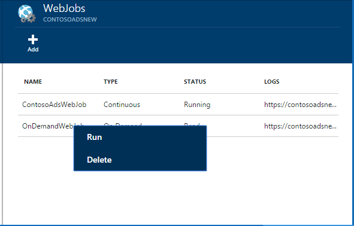

<properties 
    pageTitle="Exécuter des tâches en arrière-plan avec WebJobs" 
    description="Découvrez comment effectuer des tâches en arrière-plan dans les applications web Azure." 
    services="app-service" 
    documentationCenter="" 
    authors="tdykstra" 
    manager="wpickett" 
    editor="jimbe"/>

<tags 
    ms.service="app-service" 
    ms.workload="na" 
    ms.tgt_pltfrm="na" 
    ms.devlang="na" 
    ms.topic="article" 
    ms.date="04/27/2016" 
    ms.author="tdykstra"/>

# <a name="run-background-tasks-with-webjobs"></a>Exécuter des tâches en arrière-plan avec WebJobs

## <a name="overview"></a>Vue d’ensemble

Vous pouvez exécuter des programmes ou des scripts dans WebJobs dans votre [Application de Service](http://go.microsoft.com/fwlink/?LinkId=529714) web app de trois façons : à la demande, en continu, ou selon un planning. Il est sans frais supplémentaires pour utiliser WebJobs.

Cet article vous explique comment déployer WebJobs à l’aide du [Portail Azure](https://portal.azure.com). Pour plus d’informations sur le déploiement à l’aide de Visual Studio ou un processus continu remise, Découvrez [comment déployer Azure WebJobs aux applications Web](websites-dotnet-deploy-webjobs.md).

Le Kit de développement WebJobs Azure simplifie WebJobs de nombreuses tâches de programmation. Pour plus d’informations, voir [qu’est le Kit de développement WebJobs](websites-dotnet-webjobs-sdk.md).

 Fonctions Azure (actuellement en preview) est une autre façon d’exécuter des scripts et des programmes dans le Service d’application Azure. Pour plus d’informations, voir [vue d’ensemble des fonctions Azure](../azure-functions/functions-overview.md).

[AZURE.INCLUDE [app-service-web-to-api-and-mobile](../../includes/app-service-web-to-api-and-mobile.md)] 

## <a name="acceptablefiles"></a>Types de fichiers acceptables pour les scripts ou des programmes

Types de fichiers suivants sont acceptées :

* .cmd, .bat, .exe (à l’aide de windows cmd)
* .ps1 (à l’aide de powershell)
* .sh (à l’aide de bash)
* .PHP (à l’aide de php)
* .py (à l’aide de python)
* .js (à l’aide de nœud)
* .jar (à l’aide de java)

## <a name="CreateOnDemand"></a>Créer une demande suite WebJob dans le portail

1. Dans la carte **Web App** du [Portail Azure](https://portal.azure.com), cliquez sur **tous les paramètres > WebJobs** pour afficher la carte **WebJobs** .
    
    
    
5. Cliquez sur **Ajouter**. La boîte de dialogue **Ajouter WebJob** s’affiche.
    
    
    
2. Sous **nom**, attribuez un nom pour le WebJob. Le nom doit commencer par une lettre ou un chiffre et ne peut pas contenir de caractères spéciaux autre que «- » et « _ ».
    
4. Dans la zone **comment exécuter** , cliquez sur **Exécuter à la demande**.
    
3. Dans la zone de **Téléchargement de fichier** , cliquez sur l’icône de dossier, puis naviguez vers le fichier zip qui contient votre script. Le fichier zip doit contenir votre fichier exécutable (.exe .cmd .bat .sh .php .py .js) ainsi que les fichiers de prise en charge nécessaires à l’exécution du programme ou un script.
    
5. Consultez **créer** pour télécharger le script dans votre application web. 
    
    Le nom que vous avez spécifiée pour la WebJob s’affiche dans la liste de la carte **WebJobs** .
    
6. Pour exécuter le WebJob, cliquez sur son nom dans la liste, puis cliquez sur **exécuter**.
    
    
    
## <a name="CreateContinuous"></a>Créer un WebJob s’exécute en permanence

1. Pour créer un WebJob en permanence en cours d’exécution, suivez les mêmes étapes de création d’un WebJob que s’exécute une seule fois, mais dans la zone **comment exécuter** , cliquez sur **continu**.

2. Pour démarrer ou arrêter une WebJob continue, avec le bouton droit de la WebJob dans la liste, puis cliquez sur **Démarrer** ou **Arrêter**.
    
> [AZURE.NOTE] Si votre application web s’exécute sur plusieurs instances, une WebJob s’exécute en permanence s’exécuter sur tous vos instances. À la demande et planifiées WebJobs s’exécuter sur une seule instance sélectionnée pour par Microsoft Azure d’équilibrage de charge.
    
> Pour WebJobs continue à fiable et sur toutes les instances, activer le toujours sur * paramètre de configuration pour l’application web dans le cas contraire, ils peuvent arrêter l’exécution lorsque le site d’hébergement SCM inactif trop longtemps.

## <a name="CreateScheduledCRON"></a>Créer un WebJob planifiée à l’aide d’une expression CRON

Cette technique n’est disponible pour les applications Web en mode Basic, Standard ou Premium et nécessite le paramètre **Toujours** être activée pour l’application.

Pour transformer une WebJob à la demande sur un WebJob planifiée, il vous suffit inclure un `settings.job` fichier à la racine de votre fichier zip WebJob. Ce fichier JSON doit inclure un `schedule` propriété avec une [expression CRON](https://en.wikipedia.org/wiki/Cron), par exemple ci-dessous.

L’expression CRON se compose de 6 champs : `{second} {minute} {hour} {day} {month} {day of the week}`.

Par exemple, pour déclencher votre WebJob toutes les 15 minutes, votre `settings.job` aurait :

```json
{
    "schedule": "0 */15 * * * *"
}
``` 

Autres exemples de planification CRON :

- Toutes les heures (par exemple, chaque fois que le nombre de minutes est égal à 0) :`0 0 * * * *` 
- Toutes les heures de 9 h à 17 :`0 0 9-17 * * *` 
- À 9:30 quotidiennement :`0 30 9 * * *`
- À 9:30 chaque jour de la semaine :`0 30 9 * * 1-5`

**Remarque**: lorsque vous déployez une WebJob de Visual Studio, veillez à marquer votre `settings.job` propriétés du fichier en tant que « Copier si plus récent ».


## <a name="CreateScheduled"></a>Créer un WebJob planifiée à l’aide du planificateur d’Azure

La technique autre suivante montre comment utiliser le planificateur Azure. Dans ce cas, votre WebJob n’a pas de connaissances en direct l’échéancier. En revanche, le planificateur Azure obtient configuré pour déclencher votre WebJob sur un planning. 

Le portail Azure ne dispose pas encore la possibilité de créer un WebJob planifiée, mais tant que fonctionnalité est ajoutée que vous pouvez le faire à l’aide du [portail classique](http://manage.windowsazure.com).

1. Dans le [portail classique](http://manage.windowsazure.com) accédez à la page WebJob et cliquez sur **Ajouter**.

1. Dans la zone **comment exécuter** , cliquez sur **exécuter sur un planning**.
    
    ![Nouveau travail planifié][NewScheduledJob]
    
2. Choisir le **Planificateur région** pour votre travail, puis cliquez sur la flèche en bas à droite de la boîte de dialogue pour passer à l’écran suivant.

3. Dans la boîte de dialogue **Créer une tâche** , choisissez le type de **périodicité** souhaitée : **tâche ponctuelle** ou **périodique**.
    
    ![Planifier la périodicité][SchdRecurrence]
    
4. Également choisir une heure de **début** : **maintenant** ou **à un moment donné**.
    
    ![Heure de début de planification][SchdStart]
    
5. Si vous voulez commencer à un moment donné, choisissez vos valeurs d’heure départ sous **Démarrage**.
    
    ![Début de planification à un moment donné][SchdStartOn]
    
6. Si vous avez choisi une tâche périodique, vous avez la **Répéter chaque** option pour spécifier la fréquence d’apparition et l’option **De fin** pour spécifier une heure de fin.
    
    ![Planifier la périodicité][SchdRecurEvery]
    
7. Si vous choisissez **semaines**, vous pouvez activer la case **Sur une planification particulier** et spécifier les jours de la semaine que vous voulez exécuter la tâche.
    
    ![Planifier les jours de la semaine][SchdWeeksOnParticular]
    
8. Si vous choisissez le **mois** et activez la case **Sur une planification particulier** , vous pouvez définir la tâche à exécuter sur certains numérotée **jours** du mois. 
    
    ![Planifier les Dates particulier au cours du mois][SchdMonthsOnPartDays]
    
9. Si vous choisissez **Jours de la semaine**, vous pouvez sélectionner l’ou les jours de la semaine dans le mois que vous voulez exécuter la tâche.
    
    ![Planifier les jours de la semaine particulier en un mois][SchdMonthsOnPartWeekDays]
    
10. Enfin, vous pouvez également utiliser l’option **Occurrences** à choisir la semaine dans le mois (premier, deuxième, troisième etc.) que vous souhaitez que la tâche à s’exécuter sur les jours de la semaine que vous avez spécifié.
    
    ![Planifier les jours de la semaine particulier sur semaines particuliers en un mois][SchdMonthsOnPartWeekDaysOccurences]
    
11. Après avoir créé une ou plusieurs tâches, leurs noms seront affichent sous l’onglet WebJobs avec leur statut, type de planification et d’autres informations. Informations historiques pour les 30 derniers WebJobs sont conservées.
    
    ![Liste des tâches][WebJobsListWithSeveralJobs]
    
### <a name="Scheduler"></a>Tâches planifiées et planificateur Azure

Tâches planifiées peuvent être configurées davantage dans les pages du planificateur Azure du [portail classique](http://manage.windowsazure.com).

1.  Dans la page WebJobs, cliquez sur lien de **planification** du travail pour accéder à la page du portail Scheduler Azure. 
    
    ![Lien vers le planificateur Azure][LinkToScheduler]
    
2. Dans la page planificateur, cliquez sur la tâche.
    
    ![Tâche sur la page du portail Scheduler][SchedulerPortal]
    
3. La page **Action de travail** s’ouvre, où vous pouvez configurer la tâche. 
    
    ![Action de la tâche PageInScheduler][JobActionPageInScheduler]
    
## <a name="ViewJobHistory"></a>Afficher l’historique

1. Pour afficher l’historique de l’exécution d’une tâche, y compris les tâches créées avec le SDK WebJobs, cliquez sur le lien correspondant sous la colonne **les journaux** de la cuillère WebJobs. (Vous pouvez utiliser l’icône du Presse-papiers pour copier l’URL de la page fichier journal dans le Presse-papiers si vous le souhaitez.)
    
    
        
2. En cliquant sur le lien ouvre la page de détails de la WebJob. Cette page affiche le nom de la commande Exécuter, les dernières fois que s’il est exécuté, et sa réussite ou son échec. Sous **travail récent s’exécute**, cliquez sur une heure pour consulter des informations supplémentaires.
    
    ![WebJobDetails][WebJobDetails]
    
3. La page **Détails de l’exécution WebJob** s’affiche. Cliquez sur **Sortie bascule** pour afficher le texte du contenu du journal. Le journal de résultat est au format texte. 
    
    ![Travail Web détails de l’exécution][WebJobRunDetails]
    
4. Pour afficher le texte de sortie dans une fenêtre distincte du navigateur, cliquez sur le lien de **téléchargement** . Pour télécharger le texte, cliquez sur le lien et utilisez les options de votre navigateur pour enregistrer le contenu du fichier.
    
    ![Télécharger la sortie de journal][DownloadLogOutput]
    
5. Le lien **WebJobs** en haut de la page fournit un moyen pratique pour accéder à une liste de WebJobs dans le tableau de bord de l’historique.
    
    ![Lien vers la liste WebJobs][WebJobsLinkToDashboardList]
    
    ![Liste des WebJobs dans le tableau de bord de l’historique][WebJobsListInJobsDashboard]
    
    Cliquez sur un de ces liens pour accéder à la page Détails de WebJob pour la tâche que vous avez sélectionné.


## <a name="WHPNotes"></a>Notes
    
- Applications Web en mode gratuit peuvent expirer après 20 minutes s’il existe aucune demande au site scm (déploiement) et le portail de l’application web n’est ne pas ouvert dans Azure. Demandes sur le site réel ne réinitialise pas cela.
- Code d’un projet en continu doit être conçus pour fonctionner en boucle.
- Tâches continues s’exécuter en continu uniquement lorsque l’application web est vers le haut.
- Base et les modes Standard offre la toujours sur les fonctionnalités qui, lorsque activé, empêche les applications web de devenir inactif.
- Vous ne pouvez déboguer en permanence en cours d’exécution WebJobs. Débogage WebJobs planifiée ou à la demande n’est pas pris en charge.

## <a name="NextSteps"></a>Étapes suivantes
 
Pour plus d’informations, voir [Azure WebJobs recommandé ressources][WebJobsRecommendedResources].

[PSonWebJobs]:http://blogs.msdn.com/b/nicktrog/archive/2014/01/22/running-powershell-web-jobs-on-azure-websites.aspx
[WebJobsRecommendedResources]:http://go.microsoft.com/fwlink/?LinkId=390226

[OnDemandWebJob]: ./media/web-sites-create-web-jobs/01aOnDemandWebJob.png
[WebJobsList]: ./media/web-sites-create-web-jobs/02aWebJobsList.png
[NewContinuousJob]: ./media/web-sites-create-web-jobs/03aNewContinuousJob.png
[NewScheduledJob]: ./media/web-sites-create-web-jobs/04aNewScheduledJob.png
[SchdRecurrence]: ./media/web-sites-create-web-jobs/05SchdRecurrence.png
[SchdStart]: ./media/web-sites-create-web-jobs/06SchdStart.png
[SchdStartOn]: ./media/web-sites-create-web-jobs/07SchdStartOn.png
[SchdRecurEvery]: ./media/web-sites-create-web-jobs/08SchdRecurEvery.png
[SchdWeeksOnParticular]: ./media/web-sites-create-web-jobs/09SchdWeeksOnParticular.png
[SchdMonthsOnPartDays]: ./media/web-sites-create-web-jobs/10SchdMonthsOnPartDays.png
[SchdMonthsOnPartWeekDays]: ./media/web-sites-create-web-jobs/11SchdMonthsOnPartWeekDays.png
[SchdMonthsOnPartWeekDaysOccurences]: ./media/web-sites-create-web-jobs/12SchdMonthsOnPartWeekDaysOccurences.png
[RunOnce]: ./media/web-sites-create-web-jobs/13RunOnce.png
[WebJobsListWithSeveralJobs]: ./media/web-sites-create-web-jobs/13WebJobsListWithSeveralJobs.png
[WebJobLogs]: ./media/web-sites-create-web-jobs/14WebJobLogs.png
[WebJobDetails]: ./media/web-sites-create-web-jobs/15WebJobDetails.png
[WebJobRunDetails]: ./media/web-sites-create-web-jobs/16WebJobRunDetails.png
[DownloadLogOutput]: ./media/web-sites-create-web-jobs/17DownloadLogOutput.png
[WebJobsLinkToDashboardList]: ./media/web-sites-create-web-jobs/18WebJobsLinkToDashboardList.png
[WebJobsListInJobsDashboard]: ./media/web-sites-create-web-jobs/19WebJobsListInJobsDashboard.png
[LinkToScheduler]: ./media/web-sites-create-web-jobs/31LinkToScheduler.png
[SchedulerPortal]: ./media/web-sites-create-web-jobs/32SchedulerPortal.png
[JobActionPageInScheduler]: ./media/web-sites-create-web-jobs/33JobActionPageInScheduler.png
 
