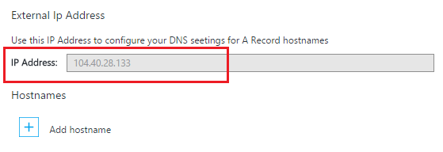

<properties
    pageTitle="Mapper un nom de domaine personnalisé pour une application Azure"
    description="Découvrez comment mapper un nom de domaine personnalisé (domaine personnel) à votre application dans le Service d’application Azure."
    services="app-service"
    documentationCenter=""
    authors="cephalin"
    manager="wpickett"
    editor="jimbe"
    tags="top-support-issue"/>

<tags
    ms.service="app-service"
    ms.workload="na"
    ms.tgt_pltfrm="na"
    ms.devlang="na"
    ms.topic="article"
    ms.date="07/27/2016"
    ms.author="cephalin"/>

# Mapper un nom de domaine personnalisé pour une application Azure

[AZURE.INCLUDE [web-selector](../../includes/websites-custom-domain-selector.md)]

Cet article vous explique comment mapper manuellement un nom de domaine personnalisé pour votre application web, principal de l’application mobile ou application API dans le [Service d’application Azure](../app-service/app-service-value-prop-what-is.md). 

Votre application contient déjà un sous-domaine unique de azurewebsites.net. Par exemple, si le nom de votre application est **contoso**, son nom de domaine est **contoso.azurewebsites.net**. Toutefois, vous pouvez mapper un domaine personnalisé nom à application ainsi que son URL, tel que `www.contoso.com`, reflète votre marque.

>[AZURE.NOTE] Obtenir de l’aide d’experts en Azure sur les [forums Azure](https://azure.microsoft.com/support/forums/). Pour encore plus élevé au niveau de prise en charge, accédez au [site Azure prend en charge](https://azure.microsoft.com/support/options/) , puis cliquez sur **Prise en charge**.

[AZURE.INCLUDE [introfooter](../../includes/custom-dns-web-site-intro-notes.md)]

## Acheter un nouveau domaine personnalisé dans le portail Azure

Si vous n’avez pas déjà acheté un nom de domaine personnalisé, vous pouvez acheter un et gérer directement dans les paramètres de votre application dans le [portail Azure](https://portal.azure.com). Cette option facilite la mapper un domaine personnalisé pour votre application, si votre application utilise le [Gestionnaire de trafic Azure](web-sites-traffic-manager-custom-domain-name.md) ou non. 

Pour plus d’informations, voir [acheter un nom de domaine personnalisé pour le Service d’application](custom-dns-web-site-buydomains-web-app.md).

## Mapper un domaine personnalisé que vous avez acheté en externe

Si vous avez déjà acheté un domaine personnalisé à partir [d’Azure DNS](https://azure.microsoft.com/services/dns/) ou d’un fournisseur tiers, il existe trois principales étapes pour mapper le domaine personnalisé pour votre application :

1. [Adresse IP de l’application obtenir *(uniquement un enregistrement)* ](#vip).
2. [Créer les enregistrements DNS que mappent votre domaine à votre application](#createdns). 
    - **Où**: votre outil de gestion de registrar du domaine (par exemple DNS Azure, GoDaddy, etc.).
    - **Pourquoi**: pour que vos domaines sachent soit résolue le domaine personnalisé souhaité dans votre application Azure.
1. [Activer le nom de domaine personnalisé pour votre application Azure](#enable).
    - **Où**: le [portail Azure](https://portal.azure.com).
    - **Pourquoi**: pour que votre application sache pour répondre aux demandes apportées au nom de domaine personnalisé.
3. [Propagation vérifier DNS](#verify).

### Types de domaines, que vous pouvez mettre en correspondance

Azure Application Service vous permet de mapper les catégories suivantes des domaines personnalisés dans votre application.

- **Domaine racine** - le nom de domaine que vous avez réservée de domaines (représentée par la `@` héberger enregistrement, en général). Par exemple, **contoso.com**.
- **Sous-domaine** - tous les domaines qui se trouve sous votre domaine racine. Par exemple, **www.contoso.com** (représentée par la `www` enregistrement hôte).  Vous pouvez mapper différents sous-domaines du même domaine racine à différentes applications dans Azure.
- **Domaine génériques** - [tout sous-domaine dont l’étiquette DNS à l’extrême gauche est `*` ](https://en.wikipedia.org/wiki/Wildcard_DNS_record) (par exemple, les enregistrements d’hôte `*` et `*.blogs`). Par exemple, ** \*. contoso.com**.

### Types d’enregistrements DNS que vous pouvez utiliser

Selon vos besoins, vous pouvez utiliser deux types d’enregistrements DNS standards pour mapper votre domaine personnalisé : 

- [A](https://en.wikipedia.org/wiki/List_of_DNS_record_types#A) - cartes votre nom de domaine personnalisé à l’adresse IP virtuelle de l’application Azure adresse directement. 
- [CNAME](https://en.wikipedia.org/wiki/CNAME_record) - mappe votre nom de domaine personnalisé au nom de domaine Azure de votre application, * *&lt;*appname*>. azurewebsites.net**. 

L’avantage de CNAME est qu’il persiste à travers les modifications d’adresses IP. Si vous supprimez et recréez votre application ou modifiez à partir d’un niveau supérieur pour revenir à la couche **Shared** , adresse IP virtuelle de votre application peut changer. Via une modification, un enregistrement CNAME est toujours valide, qu’un enregistrement A requiert une mise à jour. 

Le didacticiel montre étapes pour à l’aide de l’enregistrement A également pour à l’aide de l’enregistrement CNAME.

>[AZURE.IMPORTANT] Ne créez pas un enregistrement CNAME pour votre domaine racine (c'est-à-dire « enregistrement racine »). Pour plus d’informations, voir [Pourquoi ne peuvent pas un enregistrement CNAME être utilisé dans le domaine racine](http://serverfault.com/questions/613829/why-cant-a-cname-record-be-used-at-the-apex-aka-root-of-a-domain).
Pour mapper un domaine racine dans votre application Azure, utilisez à la place d’un enregistrement A.

## Étape 1. *(Enregistrement uniquement)* Obtenir l’adresse IP de l’application
Pour mapper un nom de domaine personnalisé à l’aide d’un enregistrement A, vous devez adresse IP de votre application Azure. Si vous allez mapper à l’aide d’un enregistrement CNAME à la place, ignorez cette étape et passer à la section suivante.

1.  Connectez-vous au [portail Azure](https://portal.azure.com).

2.  Cliquez sur **Services d’application** dans le menu de gauche.

4.  Cliquez sur votre application, puis cliquez sur **domaines personnalisés**.

6.  Prenez note de l’adresse IP au-dessus de section noms d’hôtes...

    

7.  Conservez cette carte portail ouvert. Vous sera y revenir une fois que vous créez les enregistrements DNS.

## Étape 2. Créer les enregistrements DNS

Connectez-vous à votre enregistrement de domaines et leur outil permet d’ajouter un enregistrement ou un enregistrement CNAME. Interface utilisateur de chaque registrar est légèrement différente, afin que vous devez consulter la documentation de votre fournisseur. Toutefois, voici quelques conseils généraux.

1.  Rechercher la page de gestion des enregistrements DNS. Recherchez les liens ou les zones du site intitulé **Nom de domaine**, de **DNS**ou de **Gestion des noms de serveur**. Souvent, vous pouvez trouver le lien en afficher vos informations de compte, puis puis recherchez un lien par exemple, **mon domaine**.
2.  Recherchez un lien qui vous permet d’ajouter ou modifier des enregistrements DNS. Il peut s’agir d’un **fichier de Zone** ou lier des **Enregistrements DNS** ou un lien de configuration **avancés** .
3.  Créer l’enregistrement et enregistrez vos modifications.
    - [Instructions d’un enregistrement A sont ici](#a).
    - [Instructions pour un enregistrement CNAME sont ici](#cname).

### Créer un enregistrement A

Pour utiliser un enregistrement A pour mapper à l’adresse IP de votre application Azure, vous devez réellement créer un enregistrement A et un enregistrement TXT. L’enregistrement A est pour la résolution DNS lui-même et l’enregistrement TXT concerne Azure pour vérifier que vous êtes propriétaire du nom de domaine personnalisé. 

Configurez votre enregistrement A comme suit (@ généralement représente le domaine racine) :
 
<table cellspacing="0" border="1">
  <tr>
    <th>Exemple de nom de domaine complet</th>
    <th>Un hôte</th>
    <th>Une valeur</th>
  </tr>
  <tr>
    <td>Contoso.com (racine)</td>
    <td>@</td>
    <td>Adresse IP de <a href="#vip">étape 1</a></td>
  </tr>
  <tr>
    <td>www.contoso.com (sub)</td>
    <td>www</td>
    <td>Adresse IP de <a href="#vip">étape 1</a></td>
  </tr>
  <tr>
    <td>*. contoso.com (caractère générique)</td>
    <td>*</td>
    <td>Adresse IP de <a href="#vip">étape 1</a></td>
  </tr>
</table>

Votre enregistrement TXT supplémentaire prend en charge la convention mappages à partir de &lt; *sous-domaine*>. &lt; *rootdomain*> pour &lt; *appname*>. azurewebsites.net. Configurez votre enregistrement TXT comme suit :

<table cellspacing="0" border="1">
  <tr>
    <th>Exemple de nom de domaine complet</th>
    <th>TXT hôte</th>
    <th>Valeur TXT</th>
  </tr>
  <tr>
    <td>Contoso.com (racine)</td>
    <td>@</td>
    <td>&lt;<i>appname</i>>. azurewebsites.net</td>
  </tr>
  <tr>
    <td>www.contoso.com (sub)</td>
    <td>www</td>
    <td>&lt;<i>appname</i>>. azurewebsites.net</td>
  </tr>
  <tr>
    <td>*. contoso.com (caractère générique)</td>
    <td>*</td>
    <td>&lt;<i>appname</i>>. azurewebsites.net</td>
  </tr>
</table>

###Créer un enregistrement CNAME

Si vous utilisez un enregistrement CNAME pour mapper au nom de domaine par défaut de votre application Azure, vous n’avez pas besoin un enregistrement TXT comme vous le faites avec un enregistrement A. 

>[AZURE.IMPORTANT] Ne créez pas un enregistrement CNAME pour votre domaine racine (c'est-à-dire « enregistrement racine »). Pour plus d’informations, voir [Pourquoi ne peuvent pas un enregistrement CNAME être utilisé dans le domaine racine](http://serverfault.com/questions/613829/why-cant-a-cname-record-be-used-at-the-apex-aka-root-of-a-domain).
Pour mapper un domaine racine dans votre application Azure, utilisez un [enregistrement A](#a) à la place.

Configurez votre enregistrement CNAME comme suit (@ généralement représente le domaine racine) :

<table cellspacing="0" border="1">
  <tr>
    <th>Exemple de nom de domaine complet</th>
    <th>Hôte CNAME</th>
    <th>Valeur CNAME</th>
  </tr>
  <tr>
    <td>www.contoso.com (sub)</td>
    <td>www</td>
    <td>&lt;<i>appname</i>>. azurewebsites.net</td>
  </tr>
  <tr>
    <td>*. contoso.com (caractère générique)</td>
    <td>*</td>
    <td>&lt;<i>appname</i>>. azurewebsites.net</td>
  </tr>
</table>

##Étape 3. Activer le nom de domaine personnalisé pour votre application

Dans la carte **Des domaines personnalisés** dans le portail Azure (voir [étape 1](#vip)), vous devez ajouter le nom de domaine complet (FQDN) de votre domaine personnalisé à la liste.

1.  Si vous n’avez pas fait, connectez-vous au [portail Azure](https://portal.azure.com).

2.  Dans le portail Azure, cliquez sur **Services d’application** dans le menu de gauche.

3.  Cliquez sur votre application, puis cliquez sur **domaines personnalisés** > **Ajouter nom d’hôte**.

4.  Ajouter le nom de domaine complet de votre domaine personnalisé à la liste (par exemple, **www.contoso.com**).

    

    >[AZURE.NOTE] Azure tentera de vérifier le nom de domaine que vous utilisez ici. N’oubliez pas qu’est le même nom de domaine pour lequel vous avez créé un enregistrement DNS à [l’étape 2](#createdns). 

5.  Cliquez sur **Valider**.

6.  Après avoir cliqué sur **Valider** Azure sera démarrer flux de travail de vérification du domaine. Il vérifie la propriété du domaine, ainsi que Hostname disponibilité et rapport de réussite ou erreur détaillé avec guidence instructions sur la façon de résoudre l’erreur.    

7.  Si la validation réussit **hostname ajouter** bouton devient actif et vous pourrez le nom d’hôte attribuer. 

8.  Une fois que Azure a terminé la configuration de votre nouveau nom de domaine personnalisé, accédez à votre nom de domaine personnalisé dans un navigateur. Le navigateur doit ouvrir votre application Azure, ce qui signifie que votre nom de domaine est configuré correctement.

> [AZURE.NOTE] Si l’enregistrement DNS est déjà dans utiliser (scénario du trafic services de domaine active) et vous devez manière préemptive le lier votre application web pour la vérification du domaine, créer simplement une enregistrements TXT comme exemples présentés dans le tableau suivant. Votre enregistrement TXT supplémentaire prend en charge la convention mappages à partir de &lt; *sous-domaine*>. &lt; *rootdomain*> pour &lt; *appname*>. azurewebsites.net. 
> <table cellspacing="0" border="1">
  <tr>
    <th>Exemple de nom de domaine complet</th>
    <th>TXT hôte</th>
    <th>Valeur TXT</th>
  </tr>
  <tr>
    <td>Contoso.com (racine)</td>
    <td>awverify.contoso.com</td>
    <td>&lt;<i>appname</i>>. azurewebsites.net</td>
  </tr>
  <tr>
    <td>www.contoso.com (sub)</td>
    <td>awverify.www.contoso.com</td>
    <td>&lt;<i>appname</i>>. azurewebsites.net</td>
  </tr>
    <tr>
    <td>*. contoso.com (sub)</td>
    <td>awverify.*.contoso.com</td>
    <td>&lt;<i>appname</i>>. azurewebsites.net</td>
  </tr>
</table>
Une fois cet enregistrement DNS est créé, revenez au portail Azure et ajouter votre nom de domaine personnalisé pour votre application web.
 

##Vérifier propagation DNS

Une fois que vous avez terminé les étapes de configuration, il peut prendre quelques instants pour que ces changements, en fonction de votre fournisseur. Vous pouvez vérifier que la propagation DNS fonctionne comme prévu à l’aide de [http://digwebinterface.com/](http://digwebinterface.com/). Une fois que vous naviguez jusqu’au site, spécifiez les noms d’hôtes dans la zone de texte, puis cliquez sur **Aller**. Vérifier les résultats pour vérifier si les modifications récentes apportées sont effectives.  

> [AZURE.NOTE] La propagation des entrées DNS peut prendre jusqu'à 48 heures (parfois plus longtemps). Si vous avez tout configuré correctement, vous devez attendre la propagation aboutisse.

## Étapes suivantes
Découvrez comment sécuriser votre nom de domaine personnalisé avec HTTPS en [achetant un certificat SSL dans Azure](web-sites-purchase-ssl-web-site.md) ou en [utilisant un certificat SSL à partir d’un autre emplacement](web-sites-configure-ssl-certificate.md).

>[AZURE.NOTE] Si vous voulez commencer à utiliser le Service d’application Azure avant de vous inscrire pour un compte Azure, accédez à [Essayer le Service application](http://go.microsoft.com/fwlink/?LinkId=523751), où vous pouvez créer une application web starter courtes immédiatement dans le Service d’application. Aucune carte de crédit obligatoire ; Aucune engagements.

[Prise en main DNS Azure](../dns/dns-getstarted-create-dnszone.md)  
[Créer des enregistrements DNS pour une application web dans un domaine personnalisé](../dns/dns-web-sites-custom-domain.md)  
[Domaine délégué à DNS Azure](../dns/dns-domain-delegation.md)

<!-- Images -->
[subdomain]: media/web-sites-custom-domain-name/azurewebsites-subdomain.png
