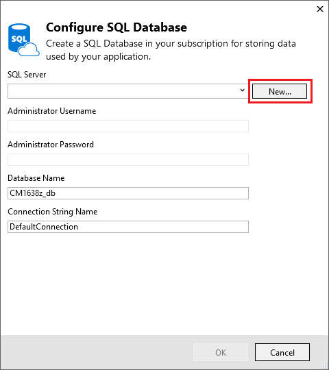
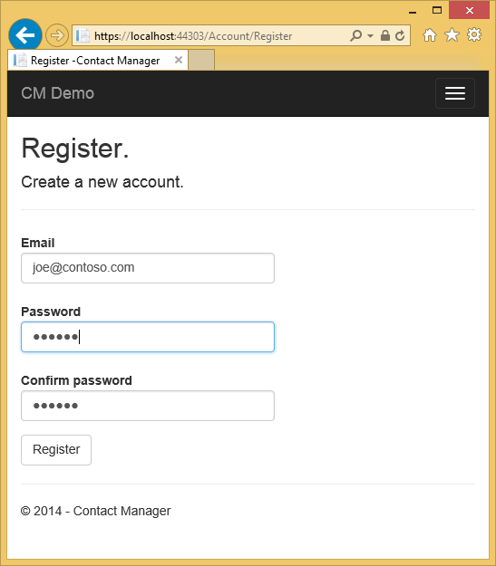
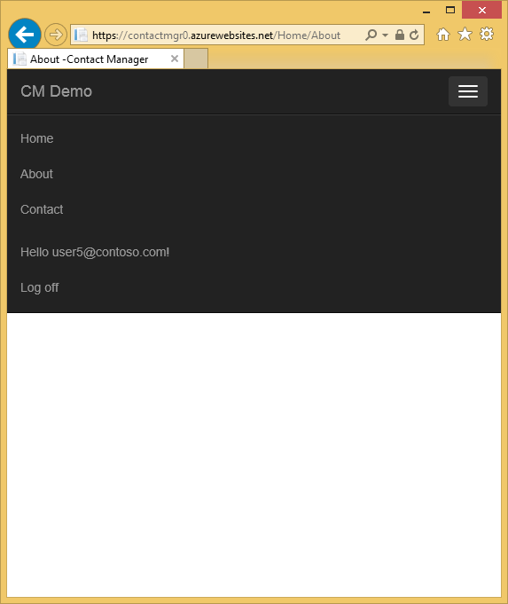
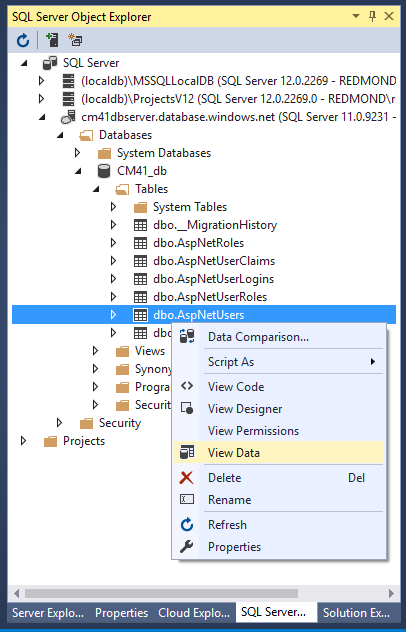

<properties 
    pageTitle="Créer une application ASP.NET MVC avec auth et base de données SQL et déployer au Service d’application Azure" 
    description="Découvrez comment développer une application ASP.NET MVC 5 avec une base de données SQL principale, ajouter d’authentification et autorisation et déployer sur Azure." 
    services="app-service\web" 
    documentationCenter=".net" 
    authors="Rick-Anderson" 
    writer="Rick-Anderson" 
    manager="wpickett" 
    editor=""/>

<tags 
    ms.service="app-service-web" 
    ms.workload="web" 
    ms.tgt_pltfrm="na" 
    ms.devlang="dotnet" 
    ms.topic="article" 
    ms.date="03/21/2016" 
    ms.author="riande"/> 

# Créer une application ASP.NET MVC avec auth et base de données SQL et déployer au Service d’application Azure

Ce didacticiel montre comment créer une application web ASP.NET MVC 5 sécurisée qui permet aux utilisateurs de se connecter à l’aide des informations d’identification de Facebook ou Google. L’application est une simple liste de contacts qui utilise l’infrastructure d’entité ADO.NET pour l’accès de base de données. Vous pouvez déployer l’application sur [Azure Application Service](http://go.microsoft.com/fwlink/?LinkId=529714). 

Dans la zone fin du didacticiel, vous avez une application web sécurisée pilotées par les données vers le haut et en cours d’exécution dans le cloud et à l’aide d’une base de données cloud. L’illustration suivante montre la page de connexion pour l’application terminée.

![page de connexion][rxb]

Vous allez découvrir :

* Comment créer un projet web ASP.NET MVC 5 sécurisé dans Visual Studio.
* Comment authentifier et autoriser les utilisateurs qui se connecteront avec les informations d’identification à partir de leurs comptes Google ou Facebook (authentification fournisseur mise en réseau à l’aide de [OAuth 2.0](http://oauth.net/2 "http://oauth.net/2")).
* Comment authentifier et autoriser les utilisateurs qui enregistrent dans une base de données gérée par l’application (authentification locale à l’aide [d’Identité ASP.NET](http://asp.net/identity/)).
* Comment utiliser les ADO.NET entité Framework 6 Code First pour lire et écrire des données dans une base de données SQL.
* Comment utiliser des Migrations première entité Framework Code pour déployer une base de données.
* Comment stocker des données relationnelles dans le cloud à l’aide de base de données SQL Azure.
* Comment déployer un projet web qui utilise une base de données pour une [application web](http://go.microsoft.com/fwlink/?LinkId=529714) dans le Service d’application Azure.

>[AZURE.NOTE] Il s’agit d’un didacticiel long. Si vous voulez une brève introduction aux projets web Azure Application Service et Visual Studio, voir [créer une application web ASP.NET dans le Service d’application Azure](web-sites-dotnet-get-started.md). Pour résoudre les problèmes d’informations, consultez la section [dépannage](#troubleshooting) .
>
>Ou, si vous voulez commencer à utiliser le Service d’application Azure avant de vous inscrire pour un compte Azure, accédez à [Essayer le Service application](http://go.microsoft.com/fwlink/?LinkId=523751), où vous pouvez créer une application web starter courte immédiatement dans le Service d’application. Aucune carte de crédit obligatoire ; Aucune engagements.

## Conditions préalables

Pour effectuer ce didacticiel, vous avez besoin d’un compte Microsoft Azure. Si vous n’avez pas un compte, vous pouvez [activer vos avantages d’abonné Visual Studio](/pricing/member-offers/msdn-benefits-details/?WT.mc_id=A261C142F) ou [s’inscrire à une version d’évaluation gratuite](/pricing/free-trial/?WT.mc_id=A261C142F).

Pour configurer votre environnement de développement, vous devez installer [Visual Studio 2013 mise à jour de 5](http://go.microsoft.com/fwlink/?LinkId=390521) ou version ultérieure et la dernière version du [Kit de développement logiciel Azure pour .NET](http://go.microsoft.com/fwlink/?linkid=324322&clcid=0x409). Cet article a été écrit pour Visual Studio mise à jour 4 et SDK 2.8.1. Utiliser les mêmes instructions pour Visual Studio 2015 avec la dernière [Azure SDK pour .NET](http://go.microsoft.com/fwlink/?linkid=518003&clcid=0x409) installé, mais certains écrans aura un aspect différents parmi les modèles.

## Créer une application ASP.NET MVC 5

### Créer le projet

1. Dans le menu **fichier** , cliquez sur **Nouveau projet**.

    

1. Dans la boîte de dialogue **Nouveau projet** , développez **c#** et sélectionnez **Web** sous **Modèles installés**, puis sélectionnez **Application Web ASP.NET**. Nom de l’application **ContactManager**, puis cliquez sur **OK**.

    
 
    **Remarque :** Vérifiez que vous entrez « ContactManager ». Blocs de code que vous devez être copie ultérieurement part du principe que le nom du projet est ContactManager. 

1. Dans la boîte de dialogue **Nouveau projet ASP.NET** , sélectionnez le modèle **MVC** . Vérifier **l’authentification** est définie sur **Les comptes d’utilisateurs individuels**, **hôte dans le nuage** est activée, puis **Application Service** est sélectionné.

    

1. Cliquez sur **OK**.

1. La boîte de dialogue **Configurer les paramètres Microsoft Azure Web App** s’affiche. Vous devrez peut-être se connecter si vous ne le n'avez pas déjà fait, ou entrez à nouveau vos informations d’identification si votre nom d’utilisateur est expiré.

1. Facultatif : modifier la valeur dans le **nom de l’application Web** zone (voir l’image ci-dessous).

    L’URL de l’application web sera {nom} .azurewebsites .net, afin que le nom doit être unique dans le domaine azurewebsites.net. L’Assistant configuration propose un nom unique en ajoutant un numéro au nom du projet « ContactManager » et qui est prêt pour ce didacticiel.

5. Dans le **groupe de ressources** de liste déroulante Sélectionner un groupe existant ou **créer un groupe de ressources**(voir l’image ci-dessous). 

    Si vous préférez, vous pouvez sélectionner un groupe de ressources que vous avez déjà. Mais si vous créez un nouveau groupe de ressources et utilisez uniquement pour ce didacticiel, il est facile de supprimer toutes les ressources Azure que vous avez créé pour le didacticiel lorsque vous avez terminé avec elles. Pour plus d’informations sur les groupes de ressources, voir [vue d’ensemble du Gestionnaire de ressources Azure](../azure-resource-manager/resource-group-overview.md). 

5. Dans le **plan de services d’application** liste déroulante Sélectionner un plan existant ou un **plan de créer nouvelle application Service**(voir l’image ci-dessous).

    Si vous préférez, vous pouvez sélectionner un plan de services d’application que vous avez déjà. Pour plus d’informations sur les offres de Service d’application, voir [vue d’ensemble détaillée de Service d’application Azure offres](../app-service/azure-web-sites-web-hosting-plans-in-depth-overview.md). 

1. Appuyez sur l' **exploration des services Azure supplémentaires** pour ajouter une base de données SQL.

    

1. Appuyez sur la **+** icône pour ajouter une base de données SQL.

    

1. Appuyez sur **Nouveau** dans la boîte de dialogue **Configurer la base de données SQL** :

    

1. Entrez un nom pour l’administrateur et un mot de passe.

    

    Le nom du serveur doit être unique. Il peut contenir des lettres minuscules, les chiffres et des traits d’union. Il ne peut pas contenir un trait d’union. Le nom d’utilisateur et mot de passe sont nouvelles informations d’identification que vous créez pour le nouveau serveur. 

    Si vous disposez déjà d’un serveur de base de données, vous pouvez sélectionner qui au lieu de créer une. Les serveurs de base de données sont une ressource essentielle, et que vous voulez généralement créer plusieurs bases de données du même serveur test et développement au lieu de créer un serveur de base de données par base de données. Toutefois, pour ce didacticiel vous ne devez le serveur temporairement, et en créant le serveur dans le même groupe de ressources que le site web vous permettent de supprimer les ressources de l’application et base de données web en supprimant le groupe de ressources lorsque vous avez terminé avec le didacticiel. 

    Si vous sélectionnez un serveur de base de données existant, vérifiez que votre application web et la base de données se trouvent dans la même région.

    

4. Cliquez sur **créer**.

    Visual Studio crée le projet web ContactManager, crée le groupe de ressources et le plan de services d’application que vous avez spécifié, et crée une application web dans le Service d’application Azure avec le nom que vous avez spécifié.

### Définir l’en-tête de page et le pied de page

1. Dans **L’Explorateur** , ouvrez le fichier *Layout.cshtml* dans le dossier *Views\Shared* .

    ![_Layout.cshtml dans l’Explorateur de solutions][newapp004]

1. Remplacez le ActionLink dans le fichier *Layout.cshtml* par le code suivant.

    @Html.ActionLink("CMDémo », « Index », « Contacts », nouveau {zone = « »}, les nouveaux { @class = « barre de navigation-marque »})
                   

    Vérifiez que vous changez le paramètre tiers à « Domicile » en « Contacts ». Le balisage ci-dessus crée un lien « Contacts » sur chaque page à la méthode Index du contrôleur de Contacts. Modifier le nom de l’application dans l’en-tête et le pied de page à partir de « Mon Application ASP.NET » et « Nom de l’Application » à « Gestionnaire de contacts » et « CM démo ». 
 
### Exécutez l’application localement

1. Appuyez sur CTRL + F5 pour exécuter l’application.

    La page d’accueil application apparaît dans le navigateur par défaut.

    

C’est tout ce que vous devez faire pour le moment créer l’application que vous allez déployer sur Azure. 

## Déploiement de l’application vers Azure

1. Dans Visual Studio, cliquez sur le projet dans **L’Explorateur** et sélectionnez **Publier** dans le menu contextuel.

    
    
    L’Assistant **Publier le site Web** s’ouvre.

1. Dans la boîte de dialogue **Publier le site Web** , cliquez sur **Publier**.

    

    L’application que vous avez créé est actif dans le cloud. La prochaine fois que vous déployez l’application, seuls les fichiers modifiés (ou nouveau) seront déployées.

    

## Activer le protocole SSL pour le projet ##

1. Dans l' **Explorateur de solutions**, cliquez sur le projet **ContactManager** , puis appuyez sur F4 pour ouvrir la fenêtre **Propriétés** .

3. Modifiez **le protocole SSL activé** en **True**. 

4. Copiez l' **URL SSL**.

    L’URL SSL sera https://localhost:44300 /, sauf si vous avez déjà créé des applications web SSL.

    ![Activer le protocole SSL][rxSSL]
 
1. Dans l' **Explorateur de solutions**, cliquez avec le bouton droit sur le projet du **Gestionnaire de contacts professionnels** , puis cliquez sur **Propriétés**.

1. Cliquez sur l’onglet **Web** .

1. Modifiez l' **Url de Project** pour utiliser l' **URL SSL** et enregistrer la page (contrôle S).

    
 
1. Vérifiez qu’Internet Explorer est le navigateur que Visual Studio lance, comme le montre l’image ci-dessous :

    

    Le sélecteur de navigateur vous permet de spécifier le navigateur que Visual Studio lance. Vous pouvez sélectionner plusieurs navigateurs et que Visual Studio mettre à jour chaque navigateur lorsque vous apportez des modifications. Pour plus d’informations, voir [L’aide de lien de navigateur dans Visual Studio 2013](http://www.asp.net/visual-studio/overview/2013/using-browser-link).

    

1. Appuyez sur CTRL + F5 pour exécuter l’application. Cliquez sur **Oui** pour démarrer le processus d’approbation le certificat auto-signé IIS Express ayant généré.

     

1. Lire de la boîte de dialogue **Avertissement de sécurité** , puis sur **Oui** si vous voulez installer le certificat représentant **hôte local**.

    

1. Internet Explorer affiche la page *d’accueil* et aucun avertissement SSL.

     

     Internet Explorer est un bon choix lorsque vous utilisez SSL parce qu’il a accepté le certificat et affiche le contenu HTTPS sans avertissement. Microsoft Edge et Google Chrome acceptent également le certificat. Firefox utilise son propre magasin de certificats, afin qu’elle affiche un avertissement s’affiche.

     

## Ajouter une base de données à l’application

Ensuite, vous devez mettre à jour l’application pour ajouter la fonctionnalité permettant d’afficher et mettre à jour les contacts et stocker les données dans une base de données. L’application utilise le Framework entité (FE) pour créer la base de données et de lire et de mettre à jour les données.

### Ajouter des classes de modèle de données pour les contacts

Vous commencez par créer un modèle de données simple dans le code.

1. Dans l' **Explorateur de solutions**, cliquez sur le dossier Modèles, cliquez sur **Ajouter**, puis **classe**.

    

2. Dans la boîte de dialogue **Ajouter un nouvel élément** , nommez le nouveau fichier de classe *Contact.cs*, puis cliquez sur **Ajouter**.

    ![Ajouter la boîte de dialogue Nouvel élément][adddb002]

3. Remplacez le contenu du fichier Contact.cs par le code suivant.

        using System.ComponentModel.DataAnnotations;
        using System.Globalization;
        namespace ContactManager.Models
        {
            public class Contact
            {
                public int ContactId { get; set; }
                public string Name { get; set; }
                public string Address { get; set; }
                public string City { get; set; }
                public string State { get; set; }
                public string Zip { get; set; }
                [DataType(DataType.EmailAddress)]
                public string Email { get; set; }
            }
        }
La classe **contacter** définit les données que vous souhaitez stocker pour chaque contact, ainsi qu’une clé primaire, *ID de contact*, qui est requis par la base de données.

### Créer des pages web qui permettent aux utilisateurs d’application pour l’utiliser avec les contacts

La fonctionnalité de la structure ASP.NET MVC peut générer automatiquement un code qui effectue créer, lire, mettre à jour et supprimer des actions (CRUD). 

1. Générez le projet **(Ctrl + Maj + B)**. (Vous devez générer le projet avant d’utiliser la fonctionnalité de la structure.)
 
1. Dans l' **Explorateur de solutions**, cliquez sur le dossier contrôleurs et cliquez sur **Ajouter**, puis cliquez sur **contrôleur**.

    ![Ajouter contrôleur dans le menu contextuel du dossier contrôleurs][addcode001]

5. Dans la boîte de dialogue **Ajouter une structure** , sélectionnez **Contrôleur de 5 MVC avec les affichages, à l’aide de FE** , puis sur **Ajouter**.
    
    

1. Dans la zone de liste déroulante **classe du modèle** , sélectionnez le **Contact (ContactManager.Models)**. (Voir l’image ci-dessous).

1. Dans la **classe de contexte de données**, sélectionnez **ApplicationDbContext (ContactManager.Models)**. **ApplicationDbContext** sera utilisé pour l’appartenance DB et nos données de contact.

    

1. Cliquez sur **Ajouter**.

   Visual Studio crée un contrôleur avec méthodes et les affichages pour les opérations de base de données pour les objets de **Contact** .

## Activer les Migrations, créer la base de données, ajouter des exemples de données et un initialiseur de données ##

La tâche suivante consiste à activer la fonctionnalité de [Code première Migrations](http://msdn.microsoft.com/library/hh770484.aspx) afin de créer des tables de base de données basées sur le modèle de données que vous avez créé.

1. Dans le menu **Outils** , sélectionnez **Gestionnaire de Package NuGet** , puis sur **Gestionnaire de Package Console**.

    

2. Dans la fenêtre **Gestionnaire de Package Console** , entrez la commande suivante :

        enable-migrations

    La commande **enable-migrations** crée un dossier *Migrations* et place dans ce dossier un fichier *Configuration.cs* que vous pouvez modifier pour amorcer la base de données et configurer des Migrations. 

2. Dans la fenêtre **Gestionnaire de Package Console** , entrez la commande suivante :

        add-migration Initial

    La commande **initiale de migration ajouter** génère un fichier nommé ** &lt;date_stamp&gt;Initial** dans le dossier *Migrations* . Le code de ce fichier crée les tables de base de données. Le paramètre première ( **Initial** ) est utilisé pour créer le nom du fichier. Vous pouvez voir les nouveaux fichiers de classe dans **L’Explorateur de solutions**.

    Dans la classe **initiale** , la méthode **la** crée la table Contacts et supprime la méthode **vers le bas** (utilisée lorsque vous souhaitez revenir à l’état précédent).

3. Ouvrez le fichier *Migrations\Configuration.cs* . 

4. Ajoutez le code suivant `using` instruction. 

         using ContactManager.Models;

5. Remplacez la méthode de *valeur de départ* par le code suivant :

        protected override void Seed(ContactManager.Models.ApplicationDbContext context)
        {
            context.Contacts.AddOrUpdate(p => p.Name,
               new Contact
               {
                   Name = "Debra Garcia",
                   Address = "1234 Main St",
                   City = "Redmond",
                   State = "WA",
                   Zip = "10999",
                   Email = "debra@example.com",
               },
                new Contact
                {
                    Name = "Thorsten Weinrich",
                    Address = "5678 1st Ave W",
                    City = "Redmond",
                    State = "WA",
                    Zip = "10999",
                    Email = "thorsten@example.com",
                },
                new Contact
                {
                    Name = "Yuhong Li",
                    Address = "9012 State st",
                    City = "Redmond",
                    State = "WA",
                    Zip = "10999",
                    Email = "yuhong@example.com",
                },
                new Contact
                {
                    Name = "Jon Orton",
                    Address = "3456 Maple St",
                    City = "Redmond",
                    State = "WA",
                    Zip = "10999",
                    Email = "jon@example.com",
                },
                new Contact
                {
                    Name = "Diliana Alexieva-Bosseva",
                    Address = "7890 2nd Ave E",
                    City = "Redmond",
                    State = "WA",
                    Zip = "10999",
                    Email = "diliana@example.com",
                }
                );
        }

    Ce code initialise (semences) la base de données avec les informations de contact. Pour plus d’informations sur l’amorçage de la base de données, voir [amorçage et bases de données de débogage entité Framework (FE)](http://blogs.msdn.com/b/rickandy/archive/2013/02/12/seeding-and-debugging-entity-framework-ef-dbs.aspx). Générez le projet pour vous n’assurer aucune erreur de compilation.

6. Dans le **Gestionnaire de Package Console** Entrez la commande :

        update-database

    ![Commandes de la Console du Gestionnaire de package][addcode009]

    La **base de données mise à jour** s’exécute la première migration qui crée la base de données. Par défaut, la base de données est créé comme une base de données SQL Server Express LocalDB. 

7. Appuyez sur CTRL + F5 pour exécuter l’application, puis cliquez sur le lien **Démo CM** ; ou accédez à https://localhost :(port#)/Cm. 

    L’application affiche des données de la valeur de départ et fournit des liens détails, modifier et supprimer. Vous pouvez créer, modifier, supprimer et afficher les données.

    ![Vue MVC des données][rx2]

## Ajouter un fournisseur oauth2 ne

>[AZURE.NOTE] Pour obtenir des instructions détaillées sur l’utilisation des Google et Facebook développeur sites portail, ce didacticiel des liens vers des didacticiels sur le site ASP.NET. Toutefois, Google et Facebook modifier leurs sites plus fréquemment que ces didacticiels sont mis à jour, et ils sont désormais mis à jour. Si vous rencontrez un problème en suivant les instructions, voir le commentaire Disqus proposé à la fin de ce didacticiel pour obtenir une liste de ce qui a changé. 

[OAuth] (http://oauth.net/ "http://OAuth.NET/") est un protocole ouvert qui permet d’autorisation sécurisée dans une méthode simple et standard à partir des applications web, mobiles et de bureau. Le modèle ASP.NET MVC internet utilise OAuth pour exposer Facebook, Twitter, Google et Microsoft comme fournisseur d’authentification. Bien que ce didacticiel utilise Google uniquement en tant que le fournisseur d’authentification, vous pouvez facilement modifier le code pour utiliser un de ces fournisseurs. Les étapes pour implémenter d’autres fournisseurs sont très semblables aux étapes que vous voyez dans ce didacticiel. Pour utiliser Facebook comme fournisseur d’authentification, voir [MVC 5 application avec Facebook, Twitter, LinkedIn et oauth2 ne Google authentification ](http://www.asp.net/mvc/tutorials/mvc-5/create-an-aspnet-mvc-5-app-with-facebook-and-google-oauth2-and-openid-sign-on).

Outre l’authentification, ce didacticiel utilise des rôles pour implémenter l’autorisation. Seuls les utilisateurs que vous ajoutez au rôle *canEdit* sont en mesure de modifier des données (autrement dit, créer, modifier ou supprimer des contacts).

1. Suivez les instructions dans l' [Application de 5 MVC avec Facebook, Twitter, LinkedIn et oauth2 ne Google authentification](http://www.asp.net/mvc/tutorials/mvc-5/create-an-aspnet-mvc-5-app-with-facebook-and-google-oauth2-and-openid-sign-on#goog) sous **créer une application Google pour OAuth 2 pour configurer une application Google pour oauth2 ne**.

3. Exécuter et tester l’application pour vérifier que vous pouvez vous connecter à l’aide de l’authentification Google.

2. Si vous voulez créer des boutons de mise en réseau connexion avec des icônes spécifiques du fournisseur, voir [boutons de connexion assez social pour ASP.NET MVC 5](http://www.jerriepelser.com/blog/pretty-social-login-buttons-for-asp-net-mvc-5)

## À l’aide de l’appartenance API

Dans cette section, vous allez ajouter un utilisateur local et le rôle *canEdit* à la base de données d’appartenance. Seuls les utilisateurs dans le rôle *canEdit* seront en mesure de modifier des données. Une meilleure pratique consiste aux rôles nom par les actions qu’ils peuvent effectuer, *canEdit* est préférable d’un rôle appelé *administrateur*. Lorsque votre application évolue, vous pouvez ajouter des rôles tels que *canDeleteMembers* plutôt que la moins descriptifs *superAdmin*.

1. Ouvrez le fichier *migrations\configuration.cs* et ajoutez le code suivant `using` instructions :

        using Microsoft.AspNet.Identity;
        using Microsoft.AspNet.Identity.EntityFramework;

1. Ajoutez la méthode **AddUserAndRole** suivante à la classe :

        bool AddUserAndRole(ContactManager.Models.ApplicationDbContext context)
        {
            IdentityResult ir;
            var rm = new RoleManager<IdentityRole>
                (new RoleStore<IdentityRole>(context));
            ir = rm.Create(new IdentityRole("canEdit"));
            var um = new UserManager<ApplicationUser>(
                new UserStore<ApplicationUser>(context));
            var user = new ApplicationUser()
            {
                UserName = "user1@contoso.com",
            };
            ir = um.Create(user, "P_assw0rd1");
            if (ir.Succeeded == false)
                return ir.Succeeded;
            ir = um.AddToRole(user.Id, "canEdit");
            return ir.Succeeded;
        }

1. Appeler la nouvelle méthode à partir de la méthode de **valeur de départ** :

        protected override void Seed(ContactManager.Models.ApplicationDbContext context)
        {
            AddUserAndRole(context);
            context.Contacts.AddOrUpdate(p => p.Name,
                // Code removed for brevity
        }

    Les images suivantes indique les modifications apportées à la méthode de *valeur de départ* :

    

    Ce code crée un nouveau rôle appelé *canEdit*, crée un nouvel utilisateur local *user1@contoso.com*et ajoute *user1@contoso.com* au rôle *canEdit* . Pour plus d’informations, consultez les [didacticiels ASP.NET identité](http://www.asp.net/identity/overview/features-api) sur le site ASP.NET.

## Utiliser Code temporaire pour ajouter les nouveaux utilisateurs de connexion mise en réseau pour le rôle canEdit  ##

Dans cette section, vous allez temporairement modifier la méthode **ExternalLoginConfirmation** dans le contrôleur de compte à ajouter de nouveaux utilisateurs enregistrement auprès d’un fournisseur OAuth au rôle *canEdit* . Nous espérons que de fournir un outil similaire à [WSAT](http://msdn.microsoft.com/library/ms228053.aspx) à l’avenir qui vous permet de créer et modifier des comptes d’utilisateurs et les rôles. Jusque là, vous pouvez effectuer la même fonction en utilisant le code temporaire.

1. Ouvrez le fichier **Controllers\AccountController.cs** et accédez à la méthode **ExternalLoginConfirmation** .

1. Ajoutez l’appel suivant à **AddToRoleAsync** juste avant l’appel **SignInAsync** .

        await UserManager.AddToRoleAsync(user.Id, "canEdit");

   Le code ci-dessus ajoute l’utilisateur que vous venez inscrit au rôle « canEdit », qui lui permet d’accéder aux méthodes d’action qui modifient les données (modifier). L’extrait suivant montre la nouvelle ligne de code dans le contexte.

          // POST: /Account/ExternalLoginConfirmation
          [HttpPost]
          [AllowAnonymous]
          [ValidateAntiForgeryToken]
          public async Task ExternalLoginConfirmation(ExternalLoginConfirmationViewModel model, string returnUrl)
          {
             if (User.Identity.IsAuthenticated)
             {
                return RedirectToAction("Index", "Manage");
             }
             if (ModelState.IsValid)
             {
                // Get the information about the user from the external login provider
                var info = await AuthenticationManager.GetExternalLoginInfoAsync();
                if (info == null)
                {
                   return View("ExternalLoginFailure");
                }
                var user = new ApplicationUser { UserName = model.Email, Email = model.Email };
                var result = await UserManager.CreateAsync(user);
                if (result.Succeeded)
                {
                   result = await UserManager.AddLoginAsync(user.Id, info.Login);
                   if (result.Succeeded)
                   {
                      await UserManager.AddToRoleAsync(user.Id, "canEdit");
                      await SignInManager.SignInAsync(user, isPersistent: false, rememberBrowser: false);
                      return RedirectToLocal(returnUrl);
                   }
                }
                AddErrors(result);
             }
             ViewBag.ReturnUrl = returnUrl;
             return View(model);
          }

Plus loin dans le didacticiel, vous allez déployer l’application vers Azure, où vous sera session avec Google ou un autre fournisseur d’authentification tiers. Cela ajoutera votre compte récemment enregistrée au rôle *canEdit* . Toutes les personnes qui recherche URL de votre application web et possède un ID de Google peuvent enregistrer et mettre à jour votre base de données. Pour empêcher d’autres personnes à partir de la façon de procéder, vous pouvez arrêter le site. Vous pourrez vérifier qui figure dans le rôle *canEdit* en examinant la base de données.

Dans la **Console du Gestionnaire de Package** sur la touche flèche haut pour faire apparaître la commande suivante :

        Update-Database

La commande de **Base de données mise à jour** s’exécute la méthode de **valeur de départ** et qui exécute la méthode **AddUserAndRole** ajoutée précédemment. La méthode **AddUserAndRole** crée l’utilisateur *user1@contoso.com* et lui ajoute au rôle *canEdit* .

## Protéger l’Application avec SSL et l’attribut autoriser ##

Dans cette section vous appliquez l’attribut [Autoriser](http://msdn.microsoft.com/library/system.web.mvc.authorizeattribute.aspx) pour limiter l’accès pour les méthodes d’action. Les utilisateurs anonymes seront en mesure d’afficher uniquement la méthode d’action **Index** du contrôleur accueil. Les utilisateurs inscrits seront en mesure d’afficher des données de contacts (les pages **Détails** et **Index** du contrôleur Cm), la page à propos et la page contacts. Seuls les utilisateurs dans le rôle *canEdit* pourront aux méthodes d’action access qui modifient les données.

1. Ouvrez le fichier *App_Start\FilterConfig.cs* et remplacez la méthode *RegisterGlobalFilters* par suivants (qui permet de créer les deux filtres) :

        public static void RegisterGlobalFilters(GlobalFilterCollection filters)
        {
            filters.Add(new HandleErrorAttribute());
            filters.Add(new System.Web.Mvc.AuthorizeAttribute());
            filters.Add(new RequireHttpsAttribute());
        }
        
    Ce code ajoute le filtre [Autoriser](http://msdn.microsoft.com/library/system.web.mvc.authorizeattribute.aspx) et le filtre [RequireHttps](http://msdn.microsoft.com/library/system.web.mvc.requirehttpsattribute.aspx) à l’application. Le filtre [Autoriser](http://msdn.microsoft.com/library/system.web.mvc.authorizeattribute.aspx) empêche les utilisateurs anonymes d’accéder à toutes les méthodes dans l’application. Vous allez utiliser l’attribut [AllowAnonymous](http://blogs.msdn.com/b/rickandy/archive/2012/03/23/securing-your-asp-net-mvc-4-app-and-the-new-allowanonymous-attribute.aspx) pour cesser d’utiliser l’exigence d’autorisation dans quelques méthodes, afin que les utilisateurs anonymes peuvent se connecter et d’afficher la page d’accueil. La [RequireHttps](http://msdn.microsoft.com/library/system.web.mvc.requirehttpsattribute.aspx) requiert que tous les accès à l’application web soit via HTTPS.

    Une autre solution consiste à ajouter l’attribut [Autoriser](http://msdn.microsoft.com/library/system.web.mvc.authorizeattribute.aspx) et l’attribut [RequireHttps](http://msdn.microsoft.com/library/system.web.mvc.requirehttpsattribute.aspx) à chaque contrôleur, mais il est recommandé une sécurité pour les appliquer à l’ensemble de l’application. En ajoutant globalement, chaque nouvelle méthode contrôleur et une action que vous ajoutez est automatiquement protégé : vous n’avez pas besoin de n’oubliez pas de les appliquer. Pour plus d’informations, voir [sécurisation de votre application MVC ASP.NET et l’attribut AllowAnonymous nouveau](http://blogs.msdn.com/b/rickandy/archive/2012/03/23/securing-your-asp-net-mvc-4-app-and-the-new-allowanonymous-attribute.aspx). 

1. Ajoutez l’attribut [AllowAnonymous](http://blogs.msdn.com/b/rickandy/archive/2012/03/23/securing-your-asp-net-mvc-4-app-and-the-new-allowanonymous-attribute.aspx) à la méthode **Index** du contrôleur Home. L’attribut [AllowAnonymous](http://blogs.msdn.com/b/rickandy/archive/2012/03/23/securing-your-asp-net-mvc-4-app-and-the-new-allowanonymous-attribute.aspx) vous permet de liste blanche les méthodes que vous souhaitez cesser d’utiliser l’autorisation. 

        public class HomeController : Controller
        {
          [AllowAnonymous]
          public ActionResult Index()
          {
             return View();
          }

    Si vous effectuez une recherche globale pour *AllowAnonymous*, vous verrez qu’il est utilisé dans les méthodes de connexion et d’enregistrement du contrôleur de compte.

1. Dans *CmController.cs*, ajoutez `[Authorize(Roles = "canEdit")]` aux méthodes HttpGet et HttpPost qui modifient les données (créer, modifier, supprimer, chaque méthode d’action à l’exception des détails et Index) dans le contrôleur *Cm* . Vous trouverez ci-dessous une partie du code terminée : 

        // GET: Cm/Create
        [Authorize(Roles = "canEdit")]
        public ActionResult Create()
        {
           return View(new Contact { Address = "123 N 456 W",
            City="Great Falls", Email = "ab@cd.com", Name="Joe Smith", State="MT",
           Zip = "59405"});
        }
        // POST: Cm/Create
        // To protect from overposting attacks, please enable the specific properties you want to bind to, for 
        // more details see http://go.microsoft.com/fwlink/?LinkId=317598.
        [HttpPost]
        [ValidateAntiForgeryToken]
         [Authorize(Roles = "canEdit")]
        public ActionResult Create([Bind(Include = "ContactId,Name,Address,City,State,Zip,Email")] Contact contact)
        {
            if (ModelState.IsValid)
            {
                db.Contacts.Add(contact);
                db.SaveChanges();
                return RedirectToAction("Index");
            }
            return View(contact);
        }
        // GET: Cm/Edit/5
        [Authorize(Roles = "canEdit")]
        public ActionResult Edit(int? id)
        {
            if (id == null)
            {
                return new HttpStatusCodeResult(HttpStatusCode.BadRequest);
            }
            Contact contact = db.Contacts.Find(id);
            if (contact == null)
            {
                return HttpNotFound();
            }
            return View(contact);
        }
        
1. Appuyez sur CTRL + F5 pour exécuter l’application.

1. Si vous n’êtes toujours connecté à partir d’une session précédente, appuyez sur le lien **se déconnecter** .

1. Cliquez sur le **sur** ou le **Contact** liens. Vous êtes redirigé vers la page de connexion, car les utilisateurs anonymes ne peuvent pas afficher les pages.

1. Cliquez sur le lien **Enregistrer en tant qu’un utilisateur** et ajouter un utilisateur local messagerie *joe@contoso.com*. Vérifiez *Jean* peut afficher sur la page d’accueil et pages de contacts. 

    

1. Cliquez sur le lien *Démo CM* et vérifiez que vous voyez les données.

1. Cliquez sur un lien dans la page, vous êtes redirigé vers la page de connexion (parce qu’un nouvel utilisateur local n’est pas ajouté au rôle *canEdit* ).

1. Connectez-vous en tant que *user1@contoso.com* par mot de passe de « P_assw0rd1 » (le « 0 » dans « word » est égal à zéro). Vous êtes redirigé vers la page modifier que vous avez précédemment sélectionné. 
2. 

    Si vous ne pouvez pas vous connecter à l’aide de ce compte et le mot de passe, essayez de copier le mot de passe à partir du code source et collez-le. Si vous ne pouvez pas toujours se connecter, vérifiez la colonne **nom d’utilisateur** de la table **AspNetUsers** pour vérifier *user1@contoso.com* a été ajoutée. 

1. Vérifiez que vous pouvez apporter des modifications de données.

## Déployer l’application sur Azure

1. Dans Visual Studio, cliquez sur le projet dans **L’Explorateur** et sélectionnez **Publier** dans le menu contextuel.

    ![Publier dans le menu contextuel du projet][firsdeploy003]

    L’Assistant **Publier le site Web** s’ouvre.

1. Cliquez sur l’onglet **paramètres** sur le côté gauche de la boîte de dialogue **Publier le site Web** . 

2. Sous **ApplicationDbContext** , sélectionnez la base de données que vous avez créé lors de la création du projet.
   

1. Sous **ContactManagerContext**, sélectionnez **Exécuter les Migrations premier Code**.

    

1. Cliquez sur **Publier**.

1. Connectez-vous en tant que *user1@contoso.com* (avec un mot de passe de « P_assw0rd1 ») et vérifiez que vous pouvez modifier les données.

1. Se déconnecter.

1. Accédez à la [Console de développeurs Google](https://console.developers.google.com/) et sur la mise à jour de l’onglet **informations d’identification** la redirection MU et JavaScript Orgins pour utiliser l’URL Azure.

1. Se connecter à l’aide de Google ou Facebook. Qui ajoute le compte Google ou Facebook au rôle **canEdit** . Si vous obtenez une erreur HTTP 400 avec le message *la redirection URI dans la demande : https://contactmanager {mon version}.azurewebsites.net/signin-google ne correspond pas à une redirection inscrite URI.*, vous devrez patienter jusqu'à ce que les modifications apportées sont propagées. Si vous obtenez cette erreur après plusieurs minutes, vérifiez les URI sont corrects.

### Arrêter l’application web pour empêcher d’autres personnes de votre inscription  

1. Dans l' **Explorateur de serveurs**, accédez à **Azure > Application Service > {votre groupe de ressources} > {votre application web}**.

4. Avec le bouton droit de l’application web, puis sélectionnez **Arrêter**. 

    Par ailleurs, à partir du [Portail Azure](https://portal.azure.com/), vous pouvez accéder à la carte de l’application web, puis cliquez sur l’icône **Arrêter** en haut de la carte.

    

### Supprimer AddToRoleAsync, publier et tester

1. Commenter ou supprimez le code suivant de la méthode **ExternalLoginConfirmation** dans le contrôleur de compte :

        await UserManager.AddToRoleAsync(user.Id, "canEdit");

1. Générez le projet (qui enregistre les modifications de fichier et vérifie que vous n’avez pas des erreurs de compilation).

5. Cliquez sur le projet dans **L’Explorateur de solutions** et sélectionnez **Publier**.

       
    
4. Cliquez sur le bouton **Démarrer (version préliminaire)** . Uniquement les fichiers qui doivent être mis à jour sont déployés.

5. Démarrez l’application web à partir de Visual Studio ou à partir du portail. **Vous ne pourrez publier pendant l’arrêt de l’application web**.

    

5. Revenez à Visual Studio et cliquez sur **Publier**.

3. Votre application Azure s’ouvre dans votre navigateur par défaut. Si vous êtes connecté, vous déconnecter afin d’afficher la page d’accueil en tant qu’utilisateur anonyme.  

4. Cliquez sur le lien **à propos de** . Vous serez redirigé vers la page d’accès.

5. Cliquez sur le lien **d’inscription** sur la page d’accès et compte local. Nous utiliserons ce compte local afin de vérifier que vous pouvez accéder aux pages uniquement lecture mais vous ne pouvez pas accéder aux pages qui modifient les données (qui sont protégées par le rôle *canEdit* ). Plus tard dans le didacticiel, vous allez supprimer accès au compte local. 

    

1. Vérifiez que vous pouvez naviguer vers les pages *sur* et de *Contact* .

    

1. Cliquez sur le lien **Démo CM** pour atteindre le contrôleur **Cm** . Par ailleurs, vous pouvez ajouter *Cm* à l’URL. 

    
 
1. Cliquez sur un lien. 

    Vous êtes redirigé vers la page de connexion. 

2. Sous **utiliser un autre service pour vous connecter**, cliquez sur Google ou Facebook et journal avec le compte que vous avez enregistré précédemment. (Si vous travaillez rapidement et vos cookies session n’a pas expiré, vous serez automatiquement connecté avec le compte Google ou Facebook que vous avez précédemment utilisé.)

2. Vérifiez que vous pouvez modifier les données lorsque vous êtes connecté à ce compte.

    **Remarque :** Vous ne pouvez pas vous déconnectez Google à partir de cette application et le journal dans un compte google différents avec le même navigateur. Si vous utilisez un navigateur, vous devez accéder à Google et se déconnecter. Vous pouvez vous connecter avec un autre compte à partir de la même authentificateur tiers (par exemple, Google) à l’aide d’un autre navigateur.

    Si vous n’avez pas rempli le prénom et le nom de vos informations de compte Google, une exception NullReferenceException se produit.

## Examinez l’instruction SQL Azure DB ##

1. Dans l' **Explorateur de serveurs**, accédez à **Azure > bases de données SQL > {votre base de données}**

2. Cliquez avec le bouton droit sur votre base de données, puis sélectionnez **Ouvrir dans l’Explorateur d’objets SQL Server**.
 
    
 
3. Si vous n’avez pas déjà connecté à cette base de données, vous pouvez être invité à ajouter une règle de pare-feu pour activer l’accès pour votre adresse IP actuelle. L’adresse IP sera renseignée. Cliquez sur **Ajouter une règle de pare-feu** pour activer l’accès.

    

3. Connectez-vous à la base de données avec le nom d’utilisateur et mot de passe que vous avez spécifié lors de la création du serveur de base de données. 
 
1. Cliquez avec le bouton droit sur la table **AspNetUsers** et sélectionnez **Afficher les données**.

    
 
1. Notez l’Id du compte Google que vous avez enregistré auprès d’être présent le rôle **canEdit** et l’Id de *user1@contoso.com*. Elles doivent être les seuls utilisateurs dans le rôle **canEdit** . (Vous devez vérifier que dans l’étape suivante.)

    
 
2. Dans l' **Explorateur d’objets SQL Server**, cliquez avec le bouton droit sur **AspNetUserRoles** et sélectionnez **Afficher les données**.

    
 
3. Vérifiez que **nom d’utilisateur** est de *user1@contoso.com* et le compte Google que vous avez enregistré. 

## Résolution des problèmes

Si vous rencontrez des problèmes, voici quelques suggestions pour que faire.

* Erreurs de mise en service SQL de base de données - Vérifiez que vous disposez du Kit de développement actuel installé. Les versions antérieures à 2.8.1 ont un bogue qui provoque des erreurs lors VS essaie de créer le serveur de base de données ou la base de données dans certains scénarios.
* Message d’erreur « opération n’est pas prise en charge pour le type d’offre d’abonnement » lors création de ressources Azure - comme ci-dessus.
* Erreurs lors du déploiement - pensez à l’article de la [base ASP.NET déploiement](web-sites-dotnet-get-started.md) consulter. Scénario de déploiement est plus simple que si vous avez le même problème il elle peut être plus facile à isoler. Par exemple, dans certains environnements d’entreprise un pare-feu d’entreprise peut empêcher Web déployer les types de connexions à Azure dont il a besoin.
* Aucune option permettant de sélectionner chaîne de connexion dans l’Assistant Publier le site Web lorsque vous déployez - si vous avez utilisé une autre méthode pour créer vos ressources Azure (par exemple, vous tentez à déployer une application web et une base de données SQL créée dans le portail), la base de données SQL peut ne pas être associé à l’application web. La solution la plus simple consiste à créer une nouvelle application web et la base de données à l’aide de VS comme indiqué dans le didacticiel. Vous n’êtes pas obligé de démarrer le didacticiel sur--dans l’Assistant Publier le site Web, vous pouvez choisir pour créer une nouvelle application web et vous obtenez la boîte de dialogue ressource Azure création même que vous obtenez lorsque vous créez le projet.
* Instructions pour Google ou Facebook portail pour les développeurs sont obsolètes : afficher le commentaire Disqus proposé à la fin de ce didacticiel.

## Étapes suivantes

Vous avez créé une application web ASP.NET MVC simple qui authentifie les utilisateurs. Pour plus d’informations sur les tâches courantes d’authentification et la façon de sécuriser des données sensibles, consultez les didacticiels suivants.

- [Créer une application web ASP.NET MVC 5 sécurisée avec journal dans réinitialiser confirmation et mot de passe de messagerie](http://www.asp.net/mvc/overview/getting-started/create-an-aspnet-mvc-5-web-app-with-email-confirmation-and-password-reset)
- [Application ASP.NET MVC 5 avec SMS et des messages électroniques authentification à deux facteurs](http://www.asp.net/mvc/overview/getting-started/aspnet-mvc-5-app-with-sms-and-email-two-factor-authentication)
- [Meilleures pratiques pour le déploiement des mots de passe et d’autres données sensibles sur ASP.NET et Azure](http://www.asp.net/identity/overview/features-api/best-practices-for-deploying-passwords-and-other-sensitive-data-to-aspnet-and-azure) 
- [Créer une application ASP.NET MVC 5 avec Facebook et oauth2 ne Google](http://www.asp.net/mvc/tutorials/mvc-5/create-an-aspnet-mvc-5-app-with-facebook-and-google-oauth2-and-openid-sign-on ) Cela inclut des instructions sur l’ajout des données de profil à la base de données d’inscription des utilisateurs et pour obtenir des instructions détaillées sur l’utilisation de Facebook comme fournisseur d’authentification.
- [Prise en main ASP.NET MVC 5](http://www.asp.net/mvc/tutorials/mvc-5/introduction/getting-started)

Pour un didacticiel plus avancé sur l’utilisation de l’infrastructure d’entité, voir [Prise en main FE et MVC](http://www.asp.net/mvc/tutorials/getting-started-with-ef-using-mvc/creating-an-entity-framework-data-model-for-an-asp-net-mvc-application).

Ce didacticiel a été rédigé par [Anderson RTF](http://blogs.msdn.com/b/rickandy/) (Twitter [@RickAndMSFT](https://twitter.com/RickAndMSFT)) avec l’aide des Tom Dykstra et Barry Dorrans (Twitter [@blowdart](https://twitter.com/blowdart)). 

***Veuillez laisser des commentaires*** sur ce que vous avez aimé ou que vous voulez voir améliorée, pas seulement sur le didacticiel lui-même, mais également sur les produits il montre. Vos commentaires nous aider à hiérarchiser les améliorations. Vous pouvez également demander et voter pour les nouvelles rubriques à [Afficher Me comment avec le Code](http://aspnet.uservoice.com/forums/228522-show-me-how-with-code).

## Ce qui a changé

* Pour un guide à la modification de sites Web Application Service voir : [Azure Application Service et son Impact sur les Services Azure existants](http://go.microsoft.com/fwlink/?LinkId=529714)

<!-- bookmarks -->
[Add an OAuth Provider]: #addOauth
[Using the Membership API]:#mbrDB
[Create a Data Deployment Script]:#ppd
[Update the Membership Database]:#ppd2

[setupwindowsazureenv]: #bkmk_setupwindowsazure
[createapplication]: #bkmk_createmvc4app
[deployapp1]: #bkmk_deploytowindowsazure1
[deployapp11]: #bkmk_deploytowindowsazure11
[adddb]: #bkmk_addadatabase

<!-- images-->
[rx2]: ./media/web-sites-dotnet-deploy-aspnet-mvc-app-membership-oauth-sql-database/rx2.png

[rx5]: ./media/web-sites-dotnet-deploy-aspnet-mvc-app-membership-oauth-sql-database-vs2013/rx5.png
[rx6]: ./media/web-sites-dotnet-deploy-aspnet-mvc-app-membership-oauth-sql-database-vs2013/rx6.png
[rx7]: ./media/web-sites-dotnet-deploy-aspnet-mvc-app-membership-oauth-sql-database-vs2013/rx7.png
[rx8]: ./media/web-sites-dotnet-deploy-aspnet-mvc-app-membership-oauth-sql-database-vs2013/rx8.png
[rx9]: ./media/web-sites-dotnet-deploy-aspnet-mvc-app-membership-oauth-sql-database-vs2013/rx9.png

[rxb]: ./media/web-sites-dotnet-deploy-aspnet-mvc-app-membership-oauth-sql-database/rxb.png

[rxSSL]: ./media/web-sites-dotnet-deploy-aspnet-mvc-app-membership-oauth-sql-database/rxSSL.png

[rxNOT]: ./media/web-sites-dotnet-deploy-aspnet-mvc-app-membership-oauth-sql-database-vs2013/rxNOT.png
[rxNOT2]: ./media/web-sites-dotnet-deploy-aspnet-mvc-app-membership-oauth-sql-database-vs2013/rxNOT2.png

[rxNOT]: ./media/web-sites-dotnet-deploy-aspnet-mvc-app-membership-oauth-sql-database-vs2013/rxNOT.png
[rxNOT]: ./media/web-sites-dotnet-deploy-aspnet-mvc-app-membership-oauth-sql-database-vs2013/rxNOT.png
[rxNOT]: ./media/web-sites-dotnet-deploy-aspnet-mvc-app-membership-oauth-sql-database-vs2013/rxNOT.png
[rr1]: ./media/web-sites-dotnet-deploy-aspnet-mvc-app-membership-oauth-sql-database-vs2013/rr1.png

[rxPrevDB]: ./media/web-sites-dotnet-deploy-aspnet-mvc-app-membership-oauth-sql-database-vs2013/rxPrevDB.png

[rxWSnew]: ./media/web-sites-dotnet-deploy-aspnet-mvc-app-membership-oauth-sql-database-vs2013/rxWSnew2.png
[rxCreateWSwithDB]: ./media/web-sites-dotnet-deploy-aspnet-mvc-app-membership-oauth-sql-database-vs2013/rxCreateWSwithDB.png

[setup007]: ./media/web-sites-dotnet-deploy-aspnet-mvc-app-membership-oauth-sql-database-vs2013/dntutmobile-setup-azure-site-004.png

[newapp004]: ./media/web-sites-dotnet-deploy-aspnet-mvc-app-membership-oauth-sql-database/dntutmobile-createapp-004.png

[firsdeploy003]: ./media/web-sites-dotnet-deploy-aspnet-mvc-app-membership-oauth-sql-database/dntutmobile-deploy1-publish-001.png

[adddb002]: ./media/web-sites-dotnet-deploy-aspnet-mvc-app-membership-oauth-sql-database/dntutmobile-adddatabase-002.png
[addcode001]: ./media/web-sites-dotnet-deploy-aspnet-mvc-app-membership-oauth-sql-database/dntutmobile-controller-add-context-menu.png

[addcode008]: ./media/web-sites-dotnet-deploy-aspnet-mvc-app-membership-oauth-sql-database-vs2013/dntutmobile-migrations-package-manager-menu.png
[addcode009]: ./media/web-sites-dotnet-deploy-aspnet-mvc-app-membership-oauth-sql-database/dntutmobile-migrations-package-manager-console.png

[Important information about ASP.NET in Azure web apps]: #aspnetwindowsazureinfo
[Next steps]: #nextsteps

[ImportPublishSettings]: ./media/web-sites-dotnet-deploy-aspnet-mvc-app-membership-oauth-sql-database-vs2013/ImportPublishSettings.png
 
