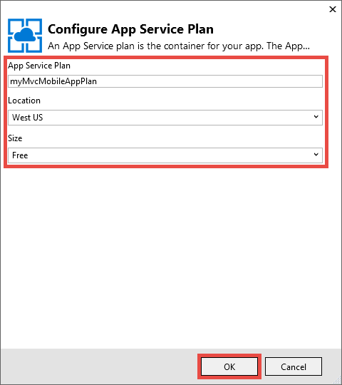

<properties 
    pageTitle="Déployer une application web mobile ASP.NET MVC 5 dans le Service d’application Azure" 
    description="Didacticiel qui vous apprend à déployer une application web au Service d’application Azure à l’aide des fonctionnalités mobiles dans une application web ASP.NET MVC 5." 
    services="app-service" 
    documentationCenter=".net" 
    authors="cephalin" 
    manager="wpickett" 
    editor="jimbe"/>

<tags 
    ms.service="app-service" 
    ms.workload="na" 
    ms.tgt_pltfrm="na" 
    ms.devlang="dotnet" 
    ms.topic="article" 
    ms.date="01/12/2016" 
    ms.author="cephalin;riande"/>

# Déployer une application web mobile ASP.NET MVC 5 dans le Service d’application Azure

Ce didacticiel vous apprend les notions de base de la façon de créer une application web ASP.NET MVC 5 qui est compatible avec mobile et déployer Azure application service. Pour ce didacticiel, vous devez [Visual Studio Express 2013 pour Web] [ Visual Studio Express 2013] ou l’édition professionnelle de Visual Studio si vous l’avez déjà. Vous pouvez utiliser [Visual Studio 2015] , mais les captures d’écran sera différentes et vous devez utiliser les modèles de 4.x ASP.NET.

[AZURE.INCLUDE [create-account-and-websites-note](../../includes/create-account-and-websites-note.md)]

## Ce que vous allez créer

Pour ce didacticiel, vous allez ajouter des fonctionnalités mobiles à la demande de conférence-référencement simple qui est fournie dans le [projet de démarrage][StarterProject]. La capture d’écran suivante montre les sessions ASP.NET dans l’application terminée, comme illustré dans l’émulateur de navigateur dans les outils de développement Internet Explorer 11 F12.

![][FixedSessionsByTag]

Vous pouvez utiliser les outils de développement Internet Explorer 11 F12 et l' [outil Fiddler] [ Fiddler] pour aider à déboguer votre application. 

## Vous allez découvrir des compétences

Voici ce que vous allez découvrir :

-   Découvrez comment utiliser Visual Studio 2013 pour publier votre application web directement dans une application web dans le Service d’application Azure.
-   Comment les modèles ASP.NET MVC 5 utilisent l’infrastructure de démarrage CSS pour améliorer l’affichage sur les appareils mobiles
-   Comment créer des affichages mobiles spécifiques pour cibler les navigateurs mobiles spécifiques, tels que les iPhone et Android
-   Comment créer des vues injoignable (vues qui répondent aux différents navigateurs sur les périphériques)

## Configurer l’environnement de développement

Configurer votre environnement de développement en installant le Kit de développement Azure pour .NET 2.5.1 ou version ultérieure. 

1. Installez le Kit de développement Azure pour .NET, cliquez sur le lien ci-dessous. Si vous n’avez pas encore installé de Visual Studio 2013, il sera installé par le lien. Ce didacticiel requiert Visual Studio 2013. [Azure SDK pour Visual Studio 2013][AzureSDKVs2013]
1. Dans la fenêtre Web Platform Installer, cliquez sur **l’installation** et poursuivre l’installation.

Vous devez également un émulateur de navigateur mobile. Une des opérations suivantes sont prises en charge :

-   Émulateur de navigateur dans [les outils de développement Internet Explorer 11 F12] [ EmulatorIE11] (utilisé dans toutes les captures d’écran de navigateur mobile). Il a Présélections de chaîne de l’agent utilisateur pour Windows Phone 8, Windows Phone 7 et Apple iPad.
-   Navigateur émulateur dans [Google Chrome DevTools][EmulatorChrome]. Il contient Présélections de nombreux appareils Android, ainsi que Apple iPhone, Apple iPad et tablette Kindle Fire. Il émule également événements tactiles.
-   [Émulateur Mobile Opera][EmulatorOpera]

Projets Visual Studio avec C\# code source sont disponibles pour accompagner cette rubrique :

-   [Téléchargement de projet Starter][StarterProject]
-   [Projet téléchargement terminé][CompletedProject]

##Déployer le projet de démarrage pour une application web Azure

1.  Télécharger le d’application conférence annonce [projet starter][StarterProject].

2.  Puis dans l’Explorateur Windows, cliquez sur le fichier ZIP téléchargé, puis sélectionnez *Propriétés*.

3.  Dans la boîte de dialogue **Propriétés** , cliquez sur le bouton **Débloquer** . (Déblocage empêche un avertissement de sécurité qui se produit lorsque vous essayez d’utiliser un fichier *.zip* que vous avez téléchargé à partir du web.)

4.  Cliquez sur le fichier ZIP et sélectionnez **Extraire tout** pour décompresser le fichier. 

5.  Dans Visual Studio, ouvrez le fichier *C#\Mvc5Mobile.sln* .

6.  Dans l’Explorateur, droit sur le projet, puis cliquez sur **Publier**.

    ![][DeployClickPublish]

7.  Dans publier le site Web, cliquez sur **Microsoft Azure Application Service**.

    ![][DeployClickWebSites]

8.  Si vous n’avez pas encore connecté Azure, cliquez sur **Ajouter un compte**.

    ![][DeploySignIn]

9.  Suivez les invites pour vous connecter à votre compte Azure.

11. La boîte de dialogue Service d’application doit maintenant vous montrer comme connecté. Cliquez sur **Nouveau**.

    ![][DeployNewWebsite]  

12. Dans le champ **Nom de l’application Web** , spécifiez un préfixe de nom d’application unique. Votre nom de l’application web complet sera * &lt;préfixe >*. azurewebsites.net. En outre, sélectionnez ou spécifiez un nouveau nom de groupe de ressources dans le **groupe de ressources**. Ensuite, cliquez sur **Nouveau** pour créer une nouvelle offre de Service d’application.

    ![][DeploySiteSettings]

13. Configurez la nouvelle offre de Service d’application et cliquez sur **OK**. 

    

13. Dans la boîte de dialogue Créer un Service de l’application, cliquez sur **créer**.

     

13. Après la Azure ressources sont créées, le publier le site Web boîte de dialogue sera remplie avec les paramètres pour votre nouvelle application. Cliquez sur **Publier**.

    ![][DeployPublishSite]

    Une fois que Visual Studio a terminé de publier le projet de démarrage à l’application web Azure, le navigateur de bureau s’ouvre et affiche l’application web en direct.

14. Démarrez votre émulateur de navigateur mobile, copiez l’URL de l’application de conférence (*<prefix>*. azurewebsites.net) dans l’émulateur, puis cliquez sur le bouton droit en haut et sélectionnez **Parcourir par une balise**. Si vous utilisez Internet Explorer 11 en tant que navigateur par défaut, il vous suffit de taper `F12`, puis `Ctrl+8`, puis modifiez le profil de navigateur pour **Windows Phone**. L’image suivante montre la vue *AllTags* en mode portrait (à partir d’en choisissant **Parcourir par une balise**).

    ![][AllTags]

>[AZURE.TIP] Pendant que vous pouvez déboguer votre application MVC 5 à partir de Visual Studio, vous pouvez publier votre application web vers Azure à nouveau pour vérifier l’application web en direct directement à partir de votre navigateur mobile ou un émulateur de navigateur.

L’affichage est très lisible sur un appareil mobile. Vous pouvez également déjà Découvrez quelques-unes des effets visuels appliqués par l’infrastructure de démarrage CSS.
Cliquez sur le lien **ASP.NET** .

![][SessionsByTagASP.NET]

Le mode de balise ASP.NET est équipé de zoom à l’écran, démarrage effectue automatiquement à votre place. Cependant, vous pouvez améliorer cette vue pour s’adapter le navigateur mobile. Par exemple, la colonne **Date** est difficile à lire. Plus loin dans le didacticiel, vous allez modifier l’affichage *AllTags* modifiez-en compatibles avec les mobiles.

##Démarrage CSS Framework

Créer la 5 MVC modèle est prise en charge démarrage intégrée. Vous avez déjà vu comment il améliore immédiatement les différents affichages dans votre application. Par exemple, la barre de navigation en haut est automatiquement réductible lorsque la largeur de navigateur est plus petite. Dans le navigateur de bureau, essayez de redimensionner la fenêtre du navigateur et observez comment la barre de navigation change son aspect. Il s’agit de la conception web réactive intégré à démarrage.

Pour visualiser l’aspect de l’application Web sans démarrage, ouvrir *application\_Démarrer\\BundleConfig.cs* et commentez les lignes qui contiennent *bootstrap.js* et *bootstrap.css*. Le code suivant montre les deux derniers instructions de la `RegisterBundles` méthode après la modification :

     bundles.Add(new ScriptBundle("~/bundles/bootstrap").Include(
              //"~/Scripts/bootstrap.js",
              "~/Scripts/respond.js"));

    bundles.Add(new StyleBundle("~/Content/css").Include(
              //"~/Content/bootstrap.css",
              "~/Content/site.css"));

Appuyez sur la touche `Ctrl+F5` pour exécuter l’application.

Notez que la barre de navigation réductible est maintenant simplement une liste non triée ordinaire. Cliquez sur **Parcourir par une balise** à nouveau, puis cliquez sur **ASP.NET**.
Dans l’affichage mobile émulateur, vous voyez à présent que n’est plus ajustées zoom à l’écran, et vous devez accéder sur le côté afin de voir le côté droit de la table.

![][SessionsByTagASP.NETNoBootstrap]

Annuler les modifications et actualisez le navigateur mobile pour vérifier que l’affichage mobile employez a été restauré.

Démarrage n’est pas spécifique à ASP.NET MVC 5, et vous pouvez tirer parti de ces fonctionnalités dans n’importe quelle application web. Mais il est désormais disponible dans le modèle de projet ASP.NET MVC 5, afin que votre application Web 5 MVC peut tirer parti de démarrage par défaut.

Pour plus d’informations sur le démarrage, accédez à la [démarrage] [ BootstrapSite] site.

Dans la section suivante, vous verrez comment fournir des vues spécifiques mobile navigateur.

##Remplacer les affichages, mises en page et des vues partielles

Vous pouvez ignorer n’importe quel affichage (y compris les mises en page et des vues partielles) pour les navigateurs mobiles en règle générale, pour un navigateur mobile individuel, ou pour n’importe quel navigateur spécifique. Pour offrir un affichage spécifique au mobile, vous pouvez copier un fichier de vue et ajouter *. Mobile* au nom du fichier. Par exemple, pour créer un *Index* l’affichage mobile, vous pouvez copier *affichages\\famille\\Index.cshtml* à *affichages\\famille\\Index.Mobile.cshtml*.

Dans cette section, vous devez créer un fichier de mise en page mobiles spécifiques.

Pour commencer, copiez *affichages\\Shared\\\_Layout.cshtml* à *affichages\\Shared\\\_Layout.Mobile.cshtml*. Ouvrir * \_Layout.Mobile.cshtml* et remplacez le titre à partir **d’Application MVC5** **d’Application MVC5 (Mobile)**.

Dans chacune `Html.ActionLink` appeler pour la barre de navigation, supprimez « Parcourir par « dans chaque lien *ActionLink*. Le code suivant illustre la finale `<ul class="nav navbar-nav">` balise du fichier mise en page mobile.

    <ul class="nav navbar-nav">
        <li>@Html.ActionLink("Home", "Index", "Home")</li>
        <li>@Html.ActionLink("Date", "AllDates", "Home")</li>
        <li>@Html.ActionLink("Speaker", "AllSpeakers", "Home")</li>
        <li>@Html.ActionLink("Tag", "AllTags", "Home")</li>
    </ul>

Copier la *affichages\\famille\\AllTags.cshtml* fichier vers *affichages\\famille\\AllTags.Mobile.cshtml*. Ouvrez le nouveau fichier et modifiez la `<h2>` élément à partir de « Balises » à « balises (M) » :

    <h2>Tags (M)</h2>

Accédez à la page des balises à l’aide d’un navigateur et l’utilisation de navigateur mobile émulateur. L’émulateur de navigateur mobile affiche les deux modifications apportées (le titre de * \_Layout.Mobile.cshtml* et le titre à partir de *AllTags.Mobile.cshtml*).

![][AllTagsMobile_LayoutMobile]

En revanche, l’affichage du bureau n’a pas été modifié (avec des titres de * \_Layout.cshtml* et *AllTags.cshtml*).

![][AllTagsMobile_LayoutMobileDesktop]

##Créer des vues spécifiques au navigateur

En plus des vues spécifiques au bureau et mobile, vous pouvez créer des affichages pour un navigateur individuel. Par exemple, vous pouvez créer des affichages qui sont spécialement pour l’iPhone ou le navigateur Android. Dans cette section, vous devez créer une mise en page pour le navigateur iPhone et une version iPhone de l’affichage *AllTags* .

Ouvrez le fichier *Global.asax* et ajoutez le code suivant en bas de la `Application_Start` méthode.

    DisplayModeProvider.Instance.Modes.Insert(0, new DefaultDisplayMode("iPhone")
    {
        ContextCondition = (context => context.GetOverriddenUserAgent().IndexOf
            ("iPhone", StringComparison.OrdinalIgnoreCase) >= 0)
    });

Ce code définit un nouveau mode d’affichage nommé « iPhone » qui sera associé à chaque demande entrante. Si la demande entrante correspond à la condition que vous avez défini (autrement dit, si l’agent utilisateur contient la chaîne « iPhone »), ASP.NET MVC se présentera les vues dont le nom contient le suffixe « iPhone ».

>[AZURE.NOTE] Lorsque vous ajoutez des modes d’affichage spécifiques au navigateur mobile, par exemple pour iPhone et Android, veillez à définir le premier argument `0` (insérer en haut de la liste) pour vous assurer que le mode spécifiques au navigateur est prioritaire sur le modèle mobile (*. Mobile.cshtml). Si le modèle mobile est en haut de la liste au lieu de cela, il sera sélectionné sur votre mode d’affichage souhaité (le premier wins EQUIV et le modèle mobile correspond à tous les navigateurs mobiles). 

Dans le code, avec le bouton droit `DefaultDisplayMode`, cliquez sur **résoudre**, puis sélectionnez `using System.Web.WebPages;`. Cette opération ajoute une référence à la `System.Web.WebPages` espace de noms, qui est l’endroit où le `DisplayModeProvider` et `DefaultDisplayMode` types sont définis.

![][ResolveDefaultDisplayMode]

Vous pouvez également ajouter simplement manuellement la ligne suivante à la `using` section du fichier.

    using System.Web.WebPages;

Enregistrer les modifications. Copier la *affichages\\Shared\\\_Layout.Mobile.cshtml* fichier vers *affichages\\Shared\\\_Layout.iPhone.cshtml*. Ouvrir le nouveau fichier et modifiez le titre de `MVC5 Application (Mobile)` à `MVC5 Application (iPhone)`.

Copier la *affichages\\famille\\AllTags.Mobile.cshtml* fichier vers *affichages\\famille\\AllTags.iPhone.cshtml*. Dans le nouveau fichier, modifiez le `<h2>` élément à partir de « balises (M) » à « Balises (iPhone) ».

Exécutez l’application. Exécuter un émulateur de navigateur mobile, vérifiez que son agent utilisateur est défini sur « iPhone », puis accédez à la vue *AllTags* . Si vous utilisez l’émulateur dans les outils de développement Internet Explorer 11 F12, configurer l’émulation à ce qui suit :

-   Profil de navigateur = **Windows Phone**
-   Chaîne d’agent utilisateur = **personnalisé**
-   Chaîne personnalisée = **Apple-iPhone5C1/1001.525**

La capture d’écran suivante montre l’affichage *AllTags* affiché dans l’émulateur dans les outils de développement Internet Explorer 11 F12 par la chaîne de l’agent utilisateur personnalisées (il s’agit d’une chaîne d’agent utilisateur iPhone 5 C).

![][AllTagsIPhone_LayoutIPhone]

Dans le navigateur mobile, sélectionnez le lien **haut-parleurs** . Car il n’est pas un affichage mobile (*AllSpeakers.Mobile.cshtml*), la vue de haut-parleurs par défaut (*AllSpeakers.cshtml*) est affichée à l’aide de l’affichage de mise en page mobile (*\_Layout.Mobile.cshtml*). Comme indiqué ci-dessous, le titre **MVC5 Application (Mobile)** est défini dans * \_Layout.Mobile.cshtml*.

![][AllSpeakers_LayoutMobile]

Vous pouvez désactiver globalement une vue (non mobile) par défaut du rendu à l’intérieur d’une mise en page mobile en définissant `RequireConsistentDisplayMode` à `true` dans la *affichages\\\_ViewStart.cshtml* fichier, comme suit :

    @{
        Layout = "~/Views/Shared/_Layout.cshtml";
        DisplayModeProvider.Instance.RequireConsistentDisplayMode = true;
    }

Lorsque `RequireConsistentDisplayMode` est défini sur `true`, la mise en page mobile (*\_Layout.Mobile.cshtml*) est utilisé uniquement pour les affichages mobiles (c'est-à-dire lorsque le fichier de vue est de la forme * **ViewName**. Mobile.cshtml*). Vous souhaiterez peut-être définir `RequireConsistentDisplayMode` à `true` si votre mise en page mobile ne fonctionne pas correctement avec vos affichages non mobile. La capture d’écran ci-dessous montre comment la page *haut-parleurs* s’affiche quand `RequireConsistentDisplayMode` est défini sur `true` (sans la chaîne « (Mobile) » dans la barre de navigation en haut).

![][AllSpeakers_LayoutMobileOverridden]

Vous pouvez désactiver le mode de cohérence de l’affichage dans une vue spécifique en définissant `RequireConsistentDisplayMode` à `false` dans le fichier de vue. Le balisage suivant dans la *affichages\\famille\\AllSpeakers.cshtml* fichier définit `RequireConsistentDisplayMode` à `false`:

    @model IEnumerable<string>

    @{
        ViewBag.Title = "All speakers";
        DisplayModeProvider.Instance.RequireConsistentDisplayMode = false;
    }

Dans cette section, nous avons vu comment créer des vues et mises en page mobiles et comment créer des mises en page et des affichages pour des appareils spécifiques tels que l’iPhone.
Toutefois, le principal avantage de l’infrastructure de démarrage CSS est la disposition injoignable, ce qui signifie qu’une seule feuille de style peut être appliqué au sein de bureau, téléphone et tablette navigateurs pour créer une apparence cohérente. Dans la section suivante, vous verrez comment tirer parti de démarrage pour créer des vues compatibles avec les mobiles.

##Améliorer la liste des haut-parleurs

Que vous venez de voir, l’affichage des *haut-parleurs* peut être lu, mais les liens sont petits et difficiles appuyer sur un appareil mobile. Dans cette section, vous allez créer *l’AllSpeakers* affichage compatibles avec les mobiles, qui affiche les liens volumineux, appuyez fois facile et contient une zone de recherche pour trouver rapidement des haut-parleurs.

Vous pouvez utiliser le style de démarrage [groupe liste liée][] pour améliorer l’affichage de *haut-parleurs* . Dans *affichages\\famille\\AllSpeakers.cshtml*, remplacez le contenu du fichier Razor par le code ci-dessous.

     @model IEnumerable<string>

    @{
        ViewBag.Title = "All Speakers";
    }

    <h2>Speakers</h2>

    

        @foreach (var speaker in Model)
        {
            @Html.ActionLink(speaker, "SessionsBySpeaker", new { speaker }, new { @class = "list-group-item" })
        }
    

La `class="list-group"` l’attribut dans le `
` balise s’applique le style de liste démarrage et la `class="input-group-item"` attribut s’applique styles d’élément de liste démarrage à chaque lien.

Actualisez le navigateur mobile. La vue mise à jour ressemble à ceci :

![][AllSpeakersFixed]

Le style du démarrage [groupe liste liée][] vérifie la zone entière pour chaque lien cliquable, ce qui correspond à une quantité meilleure expérience utilisateur. Basculer vers l’affichage du bureau et observez l’apparence cohérente.

![][AllSpeakersFixedDesktop]

Bien que l’affichage de navigateur mobile a amélioré, il est difficile de parcourir la longue liste de haut-parleurs. Démarrage ne fournit une recherche filtre des fonctionnalités de la-prédéfinies, mais vous pouvez l’ajouter avec quelques lignes de code. Vous allez tout d’abord ajouter une zone de recherche à l’affichage, puis sociaux avec le code JavaScript pour la fonction filter. Dans *affichages\\famille\\AllSpeakers.cshtml*, ajouter un \<formulaire\> balise juste après le \<h2\> balise, comme indiqué ci-dessous :

    @model IEnumerable<string>

    @{
        ViewBag.Title = "All Speakers";
    }

    <h2>Speakers</h2>

    <form class="input-group">
        
        <input type="text" class="form-control" placeholder="Search speaker">
    </form>
     
    

        @foreach (var speaker in Model)
        {
            @Html.ActionLink(speaker, 
                             "SessionsBySpeaker", 
                             new { speaker }, 
                             new { @class = "list-group-item" })
        }
    

Notez que la `<form>` et `<input>` balises les deux possèdent les styles démarrage est appliquées. La `` élément ajoute un démarrage [glyphicon][] à la zone de recherche.

Dans le dossier *Scripts* , ajoutez un fichier JavaScript appelé *filter.js*. Ouvrez le fichier et collez le code suivant :

    $(function () {

        // reset the search form when the page loads
        $("form").each(function () {
            this.reset();
        });

        // wire up the events to the <input> element for search/filter
        $("input").bind("keyup change", function () {
            var searchtxt = this.value.toLowerCase();
            var items = $(".list-group-item");

            // show all speakers that begin with the typed text and hide others
            for (var i = 0; i < items.length; i++) {
                var val = items[i].text.toLowerCase();
                val = val.substring(0, searchtxt.length);
                if (val == searchtxt) {
                    $(items[i]).show();
                }
                else {
                    $(items[i]).hide();
                }
            }
        });
    });

Vous devez également inclure filter.js dans votre offres enregistrés. Ouvrir *application\_Démarrer\\BundleConfig.cs* et modifier les offres premières. Modifier la première `bundles.Add` instruction (pour l’ensemble de guides **jquery** ) pour inclure *Scripts\\filter.js*, comme suit :

     bundles.Add(new ScriptBundle("~/bundles/jquery").Include(
                "~/Scripts/jquery-{version}.js",
                "~/Scripts/filter.js"));

L’offre **jquery** est déjà rendu par la valeur par défaut * \_disposition* affichage. Plus tard, vous pouvez utiliser le même code JavaScript pour appliquer la fonctionnalité de filtre à d’autres affichages de liste.

Actualisez le navigateur mobile et accédez à la vue *AllSpeakers* . Dans la zone de recherche, tapez « sc ». La liste des haut-parleurs doit maintenant être filtrée en fonction de la chaîne de recherche.

![][AllSpeakersFixedSearchBySC]

##Améliorer la liste de balises

Par exemple l’affichage de *haut-parleurs* , l’affichage de *balises* est lisible, mais les liens sont petit et difficile appuyer sur un appareil mobile. Vous pouvez corriger l’affichage de *balises de* la même façon que vous corrigez l’affichage de *haut-parleurs* , si vous utilisez les modifications de code décrites précédemment, mais avec les éléments suivants `Html.ActionLink` syntaxe de la méthode dans *affichages\\famille\\AllTags.cshtml*:

    @Html.ActionLink(tag, 
                     "SessionsByTag", 
                     new { tag }, 
                     new { @class = "list-group-item" })

Le navigateur de bureau actualisé se présente comme suit :

![][AllTagsFixedDesktop]

Et le navigateur mobile actualisé se présente comme suit : 

![][AllTagsFixed]

>[AZURE.NOTE] Si vous remarquez que la mise en forme de liste d’origine est toujours présente dans le navigateur mobile et demandez à votre style de démarrage piles est passée, il s’agit d’un objet de votre action antérieur à créer des affichages mobiles spécifiques. Toutefois, à présent que vous utilisez le cadre de démarrage CSS pour créer une conception web réactive, accédez tête et supprimez ces affichages mobiles spécifiques et la disposition mobiles spécifiques. Une fois que vous l’avez fait, le navigateur mobile actualisé affiche le style du démarrage.

##Améliorer la liste de Dates

Vous pouvez améliorer l’affichage des *Dates* comme vous améliorée les vues *balises* et des *haut-parleurs* si vous utilisez les modifications de code décrites précédemment, mais avec les éléments suivants `Html.ActionLink` syntaxe de la méthode dans *affichages\\famille\\AllDates.cshtml*:

    @Html.ActionLink(date.ToString("ddd, MMM dd, h:mm tt"), 
                     "SessionsByDate", 
                     new { date }, 
                     new { @class = "list-group-item" })

Vous obtiendrez un affichage de navigateur mobile actualisées à ceci :

![][AllDatesFixed]

Vous pouvez améliorer l’affichage des *Dates* en organisant les valeurs de date-heure par date. Pour cela, avec le style de démarrage [panneaux][] . Remplacez le contenu de la *affichages\\famille\\AllDates.cshtml* fichier avec le code suivant :

    @model IEnumerable<DateTime>

    @{
        ViewBag.Title = "All Dates";
    }

    <h2>Dates</h2>

    @foreach (var dategroup in Model.GroupBy(x=>x.Date))
    {
        

            

                @dategroup.Key.ToString("ddd, MMM dd")
            

            

                @foreach (var date in dategroup)
                {
                    @Html.ActionLink(date.ToString("h:mm tt"), 
                                     "SessionsByDate", 
                                     new { date }, 
                                     new { @class = "list-group-item" })
                }
            

        

    }

Ce code crée un distinct `
` balise pour chaque date distinct dans la liste et utilise le [groupe liste liée][] pour les liens correspondantes comme auparavant. Le navigateur mobile ressemble à ceci lorsque ce code s’exécute :

![][AllDatesFixed2]

Basculez vers le navigateur de bureau. Là encore, notez l’apparence cohérente.

![][AllDatesFixed2Desktop]

##Améliorer l’affichage SessionsTable

Dans cette section, vous allez créer l’affichage de *SessionsTable* plus compatibles avec les mobiles. Cette modification est plus complet les modifications précédentes.

Dans le navigateur mobile, appuyez sur le bouton de la **balise** , puis entrez `asp` dans la zone de recherche.

![][AllTagsFixedSearchByASP]

Appuyez sur le lien **ASP.NET** .

![][SessionsTableTagASP.NET]

Comme vous pouvez le voir, l’affichage est mis en forme comme un tableau, ce qui est actuellement conçu pour être affichés dans le navigateur de bureau. Toutefois, il est un peu difficile à lire sur un navigateur mobile. Pour résoudre ce problème, ouvrez *affichages\\famille\\SessionsTable.cshtml* , puis remplacez le contenu du fichier par le code suivant :

    @model IEnumerable<Mvc5Mobile.Models.Session>

    <h2>@ViewBag.Title</h2>

    

        

            @foreach (var session in Model)
            {
                

                    

                        @Html.ActionLink(session.Title, 
                                         "SessionByCode", 
                                         new { session.Code }, 
                                         new { @class="list-group-item active" })
                        

                            

                                @Html.Partial("_SpeakersLinks", session)
                            

                            

                                @session.DateText
                            

                            

                                @Html.Partial("_TagsLinks", session)
                            

                        

                    

                

            }
        

    

Le code fait 3 éléments :

-   utilise le [groupe personnalisé liste liée][] de démarrage pour mettre en forme les informations de session verticalement, afin que toutes ces informations ne peut être lire dans un navigateur mobile (à l’aide de classes comme liste groupe-élément du texte)
-   applique le [système de grille][] à la mise en page, afin que les éléments de la session de flux horizontalement dans le navigateur de bureau et verticalement dans le navigateur mobile (à l’aide de la classe colonne-md-4)
-   utilise les [utilitaires injoignable][] pour masquer les indicateurs de session lorsqu’ils sont affichés dans le navigateur mobile (à l’aide de la classe masquée-x)

Vous pouvez également appuyer sur un lien de titre pour accéder à la session correspondante. L’image ci-dessous reflète les modifications de code.

![][FixedSessionsByTag]

Le système de grille démarrage que vous avez appliqué automatiquement Réorganise les sessions verticalement dans le navigateur mobile. Notez également que les balises n’apparaissent pas. Basculez vers le navigateur de bureau.

![][SessionsTableFixedTagASP.NETDesktop]

Dans le navigateur de bureau, notez que les balises sont désormais affichées. En outre, vous pouvez voir que le système de grille démarrage que vous avez appliqué réorganise les éléments session dans deux colonnes. Si vous agrandissez le navigateur, vous verrez que la disposition se transforme en trois colonnes.

##Améliorer l’affichage SessionByCode

Enfin, vous allez résoudre l’affichage *SessionByCode* modifiez-en compatibles avec les mobiles.

Dans le navigateur mobile, appuyez sur le bouton de la **balise** , puis entrez `asp` dans la zone de recherche.

![][AllTagsFixedSearchByASP]

Appuyez sur le lien **ASP.NET** . Sessions de la balise ASP.NET sont affichées.

![][FixedSessionsByTag]

Cliquez sur le lien de **Création d’une Application de Page unique avec ASP.NET et AngularJS** .

![][SessionByCode3-644]

L’affichage par défaut du bureau fonctionne correctement, mais vous pouvez améliorer la présentation facilement à l’aide de certains composants de l’interface utilisateur de démarrage.

Ouvrir *affichages\\famille\\SessionByCode.cshtml* et remplacez le contenu par le balisage suivant :

    @model Mvc5Mobile.Models.Session

    @{
        ViewBag.Title = "Session details";
    }
    <h3>@Model.Title (@Model.Code)</h3>
    

        <strong>@Model.DateText</strong> in <strong>@Model.Room</strong>
    

    

        

            Speakers
        

        @foreach (var speaker in Model.Speakers)
        {
            @Html.ActionLink(speaker, 
                             "SessionsBySpeaker", 
                             new { speaker }, 
                             new { @class="panel-body" })
        }
    

    
@Model.Abstract

    

        

            Tags
        

        @foreach (var tag in Model.Tags)
        {
            @Html.ActionLink(tag, 
                             "SessionsByTag", 
                             new { tag }, 
                             new { @class = "panel-body" })
        }
    

Le balisage utilise démarrage panneaux Styles pour améliorer l’affichage mobile. 

Actualisez le navigateur mobile. L’image suivante reflète les modifications du code que vous venez de créer :

![][SessionByCodeFixed3-644]

## Renvoyer à la ligne vers le haut et réviser

Ce didacticiel vous a montré comment utiliser ASP.NET MVC 5 pour développer des applications Web compatibles avec les mobiles. Parmi lesquels :

-   Déployer une application ASP.NET MVC 5 à un Service d’application web app
-   Démarrage permet de créer en mode web injoignable dans votre application MVC 5
-   Remplacer la mise en page, d’affichages et vues partielles, globalement et pour obtenir une vue individuelle
-   Disposition de contrôle et partielle de remplacement à l’aide de l’application la `RequireConsistentDisplayMode` propriété
-   Créer des affichages qui ciblent des navigateurs spécifiques, tels que le navigateur iPhone
-   Appliquer des styles de démarrage dans le code Razor

## Voir aussi

-   [9 principes fondamentaux de conception web réactive](http://blog.froont.com/9-basic-principles-of-responsive-web-design/)
-   [Démarrage][BootstrapSite]
-   [Blog démarrage officiel][]
-   [Didacticiel Démarrage Twitter de République didacticiel][]
-   [Laboratoire de démarrage][]
-   [Meilleures pratiques W3C recommandation Mobile Web applications][]
-   [W3C Candidate recommandation pour les requêtes de média][]

## Ce qui a changé
* Pour un guide à la modification de sites Web Application Service voir : [Azure Application Service et son Impact sur les Services Azure existants](http://go.microsoft.com/fwlink/?LinkId=529714)

<!-- Internal Links -->
[Deploy the starter project to an Azure web app]: #bkmk_DeployStarterProject
[Bootstrap CSS Framework]: #bkmk_bootstrap
[Override the Views, Layouts, and Partial Views]: #bkmk_overrideviews
[Create Browser-Specific Views]:#bkmk_browserviews
[Improve the Speakers List]: #bkmk_Improvespeakerslist
[Improve the Tags List]: #bkmk_improvetags
[Improve the Dates List]: #bkmk_improvedates
[Improve the SessionsTable View]: #bkmk_improvesessionstable
[Improve the SessionByCode View]: #bkmk_improvesessionbycode

<!-- External Links -->
[Visual Studio Express 2013]: http://www.visualstudio.com/downloads/download-visual-studio-vs#d-express-web
[Visual Studio 2015]: https://www.visualstudio.com/downloads/download-visual-studio-vs
[AzureSDKVs2013]: http://go.microsoft.com/fwlink/p/?linkid=323510&clcid=0x409
[Fiddler]: http://www.fiddler2.com/fiddler2/
[EmulatorIE11]: http://msdn.microsoft.com/library/ie/dn255001.aspx
[EmulatorChrome]: https://developers.google.com/chrome-developer-tools/docs/mobile-emulation
[EmulatorOpera]: http://www.opera.com/developer/tools/mobile/
[StarterProject]: http://go.microsoft.com/fwlink/?LinkID=398780&clcid=0x409
[CompletedProject]: http://go.microsoft.com/fwlink/?LinkID=398781&clcid=0x409
[BootstrapSite]: http://getbootstrap.com/
[WebPIAzureSdk23NetVS13]: ./media/web-sites-dotnet-deploy-aspnet-mvc-mobile-app/WebPIAzureSdk23NetVS13.png
[groupe liste liée]: http://getbootstrap.com/components/#list-group-linked
[glyphicon]: http://getbootstrap.com/components/#glyphicons
[panneaux]: http://getbootstrap.com/components/#panels
[groupe personnalisé liste liée]: http://getbootstrap.com/components/#list-group-custom-content
[système de grille]: http://getbootstrap.com/css/#grid
[utilitaires injoignable]: http://getbootstrap.com/css/#responsive-utilities
[Blog démarrage officiel]: http://blog.getbootstrap.com/
[Didacticiel Démarrage Twitter de République didacticiel]: http://www.tutorialrepublic.com/twitter-bootstrap-tutorial/
[Laboratoire de démarrage]: http://www.bootply.com/
[Meilleures pratiques W3C recommandation Mobile Web applications]: http://www.w3.org/TR/mwabp/
[W3C Candidate recommandation pour les requêtes de média]: http://www.w3.org/TR/css3-mediaqueries/

<!-- Images -->
[DeployClickPublish]: ./media/web-sites-dotnet-deploy-aspnet-mvc-mobile-app/deploy-to-azure-website-1.png
[DeployClickWebSites]: ./media/web-sites-dotnet-deploy-aspnet-mvc-mobile-app/deploy-to-azure-website-2.png
[DeploySignIn]: ./media/web-sites-dotnet-deploy-aspnet-mvc-mobile-app/deploy-to-azure-website-3.png
[DeployUsername]: ./media/web-sites-dotnet-deploy-aspnet-mvc-mobile-app/deploy-to-azure-website-4.png
[DeployPassword]: ./media/web-sites-dotnet-deploy-aspnet-mvc-mobile-app/deploy-to-azure-website-5.png
[DeployNewWebsite]: ./media/web-sites-dotnet-deploy-aspnet-mvc-mobile-app/deploy-to-azure-website-6.png
[DeploySiteSettings]: ./media/web-sites-dotnet-deploy-aspnet-mvc-mobile-app/deploy-to-azure-website-7.png
[DeployPublishSite]: ./media/web-sites-dotnet-deploy-aspnet-mvc-mobile-app/deploy-to-azure-website-8.png
[MobileHomePage]: ./media/web-sites-dotnet-deploy-aspnet-mvc-mobile-app/mobile-home-page.png
[FixedSessionsByTag]: ./media/web-sites-dotnet-deploy-aspnet-mvc-mobile-app/SessionsByTag-ASP.NET-Fixed.png
[AllTags]: ./media/web-sites-dotnet-deploy-aspnet-mvc-mobile-app/AllTags.png
[SessionsByTagASP.NET]: ./media/web-sites-dotnet-deploy-aspnet-mvc-mobile-app/SessionsByTag-ASP.NET.png
[SessionsByTagASP.NETNoBootstrap]: ./media/web-sites-dotnet-deploy-aspnet-mvc-mobile-app/SessionsByTag-ASP.NET-NoBootstrap.png
[AllTagsMobile_LayoutMobile]: ./media/web-sites-dotnet-deploy-aspnet-mvc-mobile-app/AllTagsMobile-_LayoutMobile.png
[AllTagsMobile_LayoutMobileDesktop]: ./media/web-sites-dotnet-deploy-aspnet-mvc-mobile-app/AllTagsMobile-_LayoutMobile-Desktop.png
[ResolveDefaultDisplayMode]: ./media/web-sites-dotnet-deploy-aspnet-mvc-mobile-app/Resolve-DefaultDisplayMode.png
[AllTagsIPhone_LayoutIPhone]: ./media/web-sites-dotnet-deploy-aspnet-mvc-mobile-app/AllTagsIPhone-_LayoutIPhone.png
[AllSpeakers_LayoutMobile]: ./media/web-sites-dotnet-deploy-aspnet-mvc-mobile-app/AllSpeakers-_LayoutMobile.png
[AllSpeakers_LayoutMobileOverridden]: ./media/web-sites-dotnet-deploy-aspnet-mvc-mobile-app/AllSpeakers-_LayoutMobile-Overridden.png
[AllSpeakersFixed]: ./media/web-sites-dotnet-deploy-aspnet-mvc-mobile-app/AllSpeakers-Fixed.png
[AllSpeakersFixedDesktop]: ./media/web-sites-dotnet-deploy-aspnet-mvc-mobile-app/AllSpeakers-Fixed-Desktop.png
[AllSpeakersFixedSearchBySC]: ./media/web-sites-dotnet-deploy-aspnet-mvc-mobile-app/AllSpeakers-Fixed-SearchBySC.png
[AllTagsFixedDesktop]: ./media/web-sites-dotnet-deploy-aspnet-mvc-mobile-app/AllTags-Fixed-Desktop.png 
[AllTagsFixed]: ./media/web-sites-dotnet-deploy-aspnet-mvc-mobile-app/AllTags-Fixed.png
[AllDatesFixed]: ./media/web-sites-dotnet-deploy-aspnet-mvc-mobile-app/AllDates-Fixed.png
[AllDatesFixed2]: ./media/web-sites-dotnet-deploy-aspnet-mvc-mobile-app/AllDates-Fixed2.png
[AllDatesFixed2Desktop]: ./media/web-sites-dotnet-deploy-aspnet-mvc-mobile-app/AllDates-Fixed2-Desktop.png
[AllTagsFixedSearchByASP]: ./media/web-sites-dotnet-deploy-aspnet-mvc-mobile-app/AllTags-Fixed-SearchByASP.png
[SessionsTableTagASP.NET]: ./media/web-sites-dotnet-deploy-aspnet-mvc-mobile-app/SessionsTable-Tag-ASP.NET.png
[SessionsTableFixedTagASP.NETDesktop]: ./media/web-sites-dotnet-deploy-aspnet-mvc-mobile-app/SessionsTable-Fixed-Tag-ASP.NET-Desktop.png
[SessionByCode3-644]: ./media/web-sites-dotnet-deploy-aspnet-mvc-mobile-app/SessionByCode-3-644.png
[SessionByCodeFixed3-644]: ./media/web-sites-dotnet-deploy-aspnet-mvc-mobile-app/SessionByCode-Fixed-3-644.png
 
