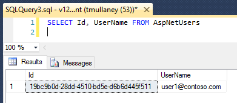

<properties
    pageTitle="Didacticiel : Web app avec une base de données client multiples utilisant entité infrastructure et sécurité au niveau de la ligne"
    description="Découvrez le développement d’une application web ASP.NET MVC 5 avec un multi-client base de données SQL backent, à l’aide de Framework entité et sécurité au niveau de la ligne."
  metaKeywords="azure asp.net mvc entity framework multi tenant row level security rls sql database"
    services="app-service\web"
    documentationCenter=".net"
    manager="jeffreyg"
  authors="tmullaney"/>

<tags
    ms.service="app-service-web"
    ms.workload="web"
    ms.tgt_pltfrm="na"
    ms.devlang="dotnet"
    ms.topic="article"
    ms.date="04/25/2016"
    ms.author="thmullan"/>

# <a name="tutorial-web-app-with-a-multi-tenant-database-using-entity-framework-and-row-level-security"></a>Didacticiel : Web app avec une base de données client multiples utilisant entité infrastructure et sécurité au niveau de la ligne

Ce didacticiel montre comment créer une application web client à plusieurs avec un modèle de location «[base de données partagée, schéma partagé](https://msdn.microsoft.com/library/aa479086.aspx)», en utilisant entité Framework et [Sécurité au niveau de la ligne](https://msdn.microsoft.com/library/dn765131.aspx). Dans ce modèle, une seule base de données contient des données pour plusieurs clients, et chaque ligne de chaque table est associé à un « client identifiant. » Sécurité au niveau des lignes (RLS), une nouvelle fonctionnalité de base de données SQL Azure, est utilisé pour empêcher les clients d’accès aux données de l’autre. Cette fonctionnalité nécessite simplement une petite unique, modification à l’application. Centralisation la logique d’accès client au sein de la base de données, RLS simplifie le code de l’application et réduit le risque d’une perte de données accidentel entre les clients de.

Commençons par l’application simple gestionnaire de contacts professionnels à partir de [créer une application ASP.NET MVP avec auth et base de données SQL et déployer Azure Application Service](web-sites-dotnet-deploy-aspnet-mvc-app-membership-oauth-sql-database.md). Droit à présent, l’application permet à tous les utilisateurs (clients) pour afficher tous les contacts :


Avec quelques modifications mineures, nous allons ajouter prise en charge de plusieurs location, afin que les utilisateurs peuvent voir uniquement les contacts que leur appartiennent.

## <a name="step-1-add-an-interceptor-class-in-the-application-to-set-the-sessioncontext"></a>Étape 1 : Ajouter une classe intercepteur dans l’application de définir la SESSION_CONTEXT

Il existe une modification application que nous devons faire. Étant donné que tous les utilisateurs de l’application vous connecter à la base de données à l’aide de la même chaîne de connexion (par exemple, connexion SQL même), il n’est actuellement aucun moyen d’une stratégie RLS savoir auquel il doit effectuer de filtrage pour l’utilisateur. Cette approche est très courante dans les applications web, car elle permet de regroupement de connexions efficace, mais cela signifie que nous avons besoin d’un autre moyen d’identifier l’utilisateur actuel de l’application au sein de la base de données. La solution consiste à disposer de l’application définir une paire clé-valeur pour l’ID utilisateur actuel dans la [SESSION_CONTEXT](https://msdn.microsoft.com/library/mt590806) immédiatement après l’ouverture d’une connexion, avant d’exécuter des requêtes. SESSION_CONTEXT est un magasin clé-valeur à portée de session, et notre politique RLS utilisera le nom d’utilisateur qu’il contient pour identifier l’utilisateur actuel.

Nous allons ajouter un [intercepteur](https://msdn.microsoft.com/data/dn469464.aspx) (en particulier, un [DbConnectionInterceptor](https://msdn.microsoft.com/library/system.data.entity.infrastructure.interception.idbconnectioninterceptor)), une nouvelle fonctionnalité dans Framework (FE) 6, entité pour définir automatiquement le nom d’utilisateur actuel dans la SESSION_CONTEXT par l’exécution d’une instruction T-SQL chaque fois que FE ouvre une connexion.

1.  Ouvrez le projet ContactManager dans Visual Studio.
2.  Avec le bouton droit sur le dossier Modèles dans l’Explorateur de solutions, puis sélectionnez Ajouter > cours.
3.  Nommez la nouvelle classe « SessionContextInterceptor.cs », puis cliquez sur Ajouter.
4.  Remplacez le contenu de SessionContextInterceptor.cs par le code suivant.

```
using System;
using System.Collections.Generic;
using System.Linq;
using System.Web;
using System.Data.Common;
using System.Data.Entity;
using System.Data.Entity.Infrastructure.Interception;
using Microsoft.AspNet.Identity;

namespace ContactManager.Models
{
    public class SessionContextInterceptor : IDbConnectionInterceptor
    {
        public void Opened(DbConnection connection, DbConnectionInterceptionContext interceptionContext)
        {
            // Set SESSION_CONTEXT to current UserId whenever EF opens a connection
            try
            {
                var userId = System.Web.HttpContext.Current.User.Identity.GetUserId();
                if (userId != null)
                {
                    DbCommand cmd = connection.CreateCommand();
                    cmd.CommandText = "EXEC sp_set_session_context @key=N'UserId', @value=@UserId";
                    DbParameter param = cmd.CreateParameter();
                    param.ParameterName = "@UserId";
                    param.Value = userId;
                    cmd.Parameters.Add(param);
                    cmd.ExecuteNonQuery();
                }
            }
            catch (System.NullReferenceException)
            {
                // If no user is logged in, leave SESSION_CONTEXT null (all rows will be filtered)
            }
        }
        
        public void Opening(DbConnection connection, DbConnectionInterceptionContext interceptionContext)
        {
        }

        public void BeganTransaction(DbConnection connection, BeginTransactionInterceptionContext interceptionContext)
        {
        }

        public void BeginningTransaction(DbConnection connection, BeginTransactionInterceptionContext interceptionContext)
        {
        }

        public void Closed(DbConnection connection, DbConnectionInterceptionContext interceptionContext)
        {
        }

        public void Closing(DbConnection connection, DbConnectionInterceptionContext interceptionContext)
        {
        }

        public void ConnectionStringGetting(DbConnection connection, DbConnectionInterceptionContext<string> interceptionContext)
        {
        }

        public void ConnectionStringGot(DbConnection connection, DbConnectionInterceptionContext<string> interceptionContext)
        {
        }

        public void ConnectionStringSet(DbConnection connection, DbConnectionPropertyInterceptionContext<string> interceptionContext)
        {
        }

        public void ConnectionStringSetting(DbConnection connection, DbConnectionPropertyInterceptionContext<string> interceptionContext)
        {
        }

        public void ConnectionTimeoutGetting(DbConnection connection, DbConnectionInterceptionContext<int> interceptionContext)
        {
        }

        public void ConnectionTimeoutGot(DbConnection connection, DbConnectionInterceptionContext<int> interceptionContext)
        {
        }

        public void DataSourceGetting(DbConnection connection, DbConnectionInterceptionContext<string> interceptionContext)
        {
        }

        public void DataSourceGot(DbConnection connection, DbConnectionInterceptionContext<string> interceptionContext)
        {
        }

        public void DatabaseGetting(DbConnection connection, DbConnectionInterceptionContext<string> interceptionContext)
        {
        }

        public void DatabaseGot(DbConnection connection, DbConnectionInterceptionContext<string> interceptionContext)
        {
        }

        public void Disposed(DbConnection connection, DbConnectionInterceptionContext interceptionContext)
        {
        }

        public void Disposing(DbConnection connection, DbConnectionInterceptionContext interceptionContext)
        {
        }

        public void EnlistedTransaction(DbConnection connection, EnlistTransactionInterceptionContext interceptionContext)
        {
        }

        public void EnlistingTransaction(DbConnection connection, EnlistTransactionInterceptionContext interceptionContext)
        {
        }

        public void ServerVersionGetting(DbConnection connection, DbConnectionInterceptionContext<string> interceptionContext)
        {
        }

        public void ServerVersionGot(DbConnection connection, DbConnectionInterceptionContext<string> interceptionContext)
        {
        }

        public void StateGetting(DbConnection connection, DbConnectionInterceptionContext<System.Data.ConnectionState> interceptionContext)
        {
        }

        public void StateGot(DbConnection connection, DbConnectionInterceptionContext<System.Data.ConnectionState> interceptionContext)
        {
        }
    }

    public class SessionContextConfiguration : DbConfiguration
    {
        public SessionContextConfiguration()
        {
            AddInterceptor(new SessionContextInterceptor());
        }
    }
}
```

Il s’agit de la modification de la seule application obligatoire. Continuez et créer et publier l’application.

## <a name="step-2-add-a-userid-column-to-the-database-schema"></a>Étape 2 : Ajouter une colonne ID d’utilisateur pour le schéma de base de données

Ensuite, nous devons ajouter une colonne ID utilisateur à la table Contacts pour associer chaque ligne à un utilisateur (client). Nous modifiera le schéma directement dans la base de données, afin que nous n’êtes pas obligé d’inclure ce champ dans notre modèle de données FE.

Connectez-vous à la base de données directement, à l’aide de SQL Server Management Studio ou Visual Studio et puis exécutez le T-SQL suivante :

```
ALTER TABLE Contacts ADD UserId nvarchar(128)
    DEFAULT CAST(SESSION_CONTEXT(N'UserId') AS nvarchar(128))
```

Une colonne ID utilisateur est ajoutée à la table Contacts. Nous utilisons le type de données nvarchar (128) pour faire correspondre les ID utilisateur stockées dans la table AspNetUsers, et nous créons une contrainte par défaut qui définit automatiquement le nom d’utilisateur pour les lignes nouvellement insérées à l’ID utilisateur actuellement stocké dans SESSION_CONTEXT.

Maintenant, le tableau ressemble à ceci :


Lors de la création de nouveaux contacts, ils automatiquement est affectés le nom d’utilisateur correct. À des fins de démonstration, cependant, nous allons d’affecter certains de ces contacts existants à un utilisateur existant.

Si vous avez créé un petit nombre d’utilisateurs dans l’application déjà (par exemple, l’utilisation de local, Google ou Facebook comptes), ils apparaissent dans la table AspNetUsers. Dans la capture d’écran ci-dessous, il ne comprend qu’un seul utilisateur.



Copier le code de user1@contoso.com, et collez-le dans l’instruction T-SQL ci-dessous. Exécuter cette instruction pour associer trois des Contacts à ce nom d’utilisateur.

```
UPDATE Contacts SET UserId = '19bc9b0d-28dd-4510-bd5e-d6b6d445f511'
WHERE ContactId IN (1, 2, 5)
```

## <a name="step-3-create-a-row-level-security-policy-in-the-database"></a>Étape 3 : Créer une stratégie de sécurité au niveau de la ligne dans la base de données

La dernière étape consiste à créer une stratégie de sécurité qui utilise le nom d’utilisateur dans SESSION_CONTEXT pour filtrer automatiquement les résultats renvoyés par les requêtes.

Lorsque vous êtes toujours connecté à la base de données, exécutez le T-SQL suivante :

```
CREATE SCHEMA Security
go

CREATE FUNCTION Security.userAccessPredicate(@UserId nvarchar(128))
    RETURNS TABLE
    WITH SCHEMABINDING
AS
    RETURN SELECT 1 AS accessResult
    WHERE @UserId = CAST(SESSION_CONTEXT(N'UserId') AS nvarchar(128))
go

CREATE SECURITY POLICY Security.userSecurityPolicy
    ADD FILTER PREDICATE Security.userAccessPredicate(UserId) ON dbo.Contacts,
    ADD BLOCK PREDICATE Security.userAccessPredicate(UserId) ON dbo.Contacts
go

```

Ce code effectue trois opérations. Tout d’abord, il crée un nouveau schéma est recommandé pour centraliser et limiter l’accès aux objets RLS. Ensuite, il crée une fonction prédicat renvoyant '1' lorsque le nom d’utilisateur d’une ligne correspond à l’ID utilisateur dans SESSION_CONTEXT. Enfin, il crée une stratégie de sécurité qui ajoute cette fonction en tant qu’un filtre et le bloc prédicat sur la table Contacts. Le prédicat de filtre provoque des requêtes retourner uniquement les lignes qui appartiennent à l’utilisateur actuel, puis le prédicat bloc fonctionne comme une sauvegarde pour empêcher l’application de jamais accidentellement insérer une ligne pour l’utilisateur incorrect.

À présent, exécutez l’application et connectez-vous en tant que user1@contoso.com. Cet utilisateur voit maintenant uniquement les Contacts que nous avons attribué à ce nom d’utilisateur :


Pour valider plus, essayez d’enregistrer un nouvel utilisateur. Ils ne verront aucun contact, comme aucun ont été attribuées leur. S’ils créent un nouveau contact, il doivent être affectée à ces, et seulement ils seront en mesure de voir.

## <a name="next-steps"></a>Étapes suivantes

Voilà ! L’application web le Gestionnaire de contacts simple a été convertie en un client multiples une où chaque utilisateur possède son propre liste de contacts. À l’aide de la sécurité au niveau de la ligne, nous avons évitée la complexité d’appliquer la logique d’accès client dans notre code de l’application. Cette transparence permet à l’application pour vous concentrer sur le problème de l’entreprise réel à portée de main, et il permet également de réduire les risques en matière de divulguer accidentellement des données que l’application de base de code grandit.

Ce didacticiel a rayé uniquement la surface de les possibilités offertes par RLS. Par exemple, il est possible d’avoir plus sophistiqués ou logique d’accès aux granulaires et il est possible de stocker plusieurs simplement le nom d’utilisateur actuel dans la SESSION_CONTEXT. Il est également possible [d’intégrer RLS avec les bibliothèques de base de données élastique outils client](../sql-database/sql-database-elastic-tools-multi-tenant-row-level-security.md) pour prendre en charge milieu des fragments clients multiples d’un niveau de données horizontale.

Au-delà de ces possibilités, nous nous efforçons également pour rendre RLS mieux encore. Si vous avez des questions, des idées ou des éléments que vous voulez voir, n’hésitez pas dans les commentaires. Nous vous remercions pour vos commentaires !
