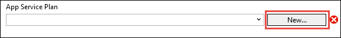
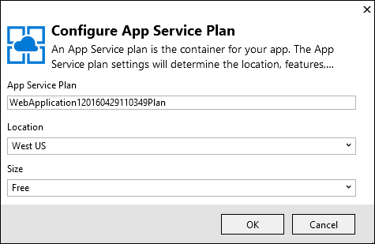
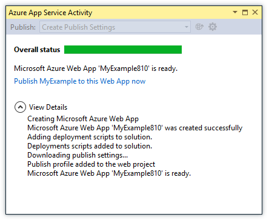
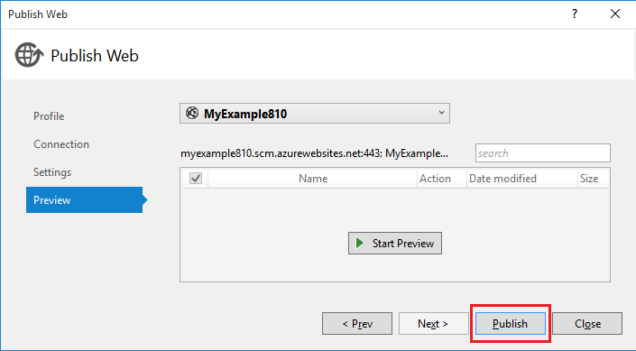

<properties
    pageTitle="Déployer une application ASP.NET au Service d’application Azure à l’aide de Visual Studio | Microsoft Azure"
    description="Découvrez comment déployer un projet web ASP.NET sur une nouvelle application web dans le Service d’application Azure, à l’aide de Visual Studio."
    services="app-service\web"
    documentationCenter=".net"
    authors="tdykstra"
    manager="wpickett"
    editor=""/>

<tags
    ms.service="app-service-web"
    ms.workload="web"
    ms.tgt_pltfrm="na"
    ms.devlang="dotnet"
    ms.topic="get-started-article"
    ms.date="07/22/2016"
    ms.author="rachelap"/>

# Déployer une application web ASP.NET au Service d’application Azure, à l’aide de Visual Studio

[AZURE.INCLUDE [tabs](../../includes/app-service-web-get-started-nav-tabs.md)]

## Vue d’ensemble

Ce didacticiel montre comment déployer une application web ASP.NET pour une [application web dans le Service d’application Azure](app-service-web-overview.md) à l’aide de Visual Studio 2015.

Le didacticiel suppose que vous êtes un développeur ASP.NET qui n’a aucune expérience antérieure d’à l’aide d’Azure. Lorsque vous avez terminé, vous avez une application web simple vers le haut et en cours d’exécution dans le cloud.

Vous allez découvrir :

* Comment créer une nouvelle application web application Service pendant que vous créez un nouveau projet web dans Visual Studio.
* Découvrez comment déployer un projet web à un Service d’application web app à l’aide de Visual Studio.

Le diagramme illustre que vous faire dans le didacticiel.

À la fin du didacticiel, une section de [résolution des problèmes](#troubleshooting) vous donne des idées sur la procédure à suivre si quelque chose ne fonctionne pas, et une section [étapes suivantes](#next-steps) fournit des liens vers d’autres didacticiels coder plus en détail comment faire utiliser le Service d’application Azure.

Comme il s’agit d’un didacticiel mise en route, le projet web qu'il montre comment déployer est simple qui n’utilise pas une base de données et ne fait pas authentification ou autorisation. Pour obtenir des liens vers des rubriques de déploiement plus avancées, voir [comment déployer une application web Azure](web-sites-deploy.md).

Outre le temps nécessaire pour installer le Kit de développement Azure pour .NET, ce didacticiel prendra environ 10 à 15 minutes.

## Conditions préalables

* Le didacticiel suppose que vous avez travaillé avec ASP.NET MVC et Visual Studio. Si vous avez besoin d’une présentation, voir [Prise en main ASP.NET MVC 5](http://www.asp.net/mvc/overview/getting-started/introduction/getting-started).

* Vous avez besoin d’un compte Azure. Vous pouvez [Ouvrir un compte Azure gratuit](/pricing/free-trial/?WT.mc_id=A261C142F) ou [avantages d’abonné activer Visual Studio](/pricing/member-offers/msdn-benefits-details/?WT.mc_id=A261C142F). 

    Si vous voulez commencer avec le Service d’application Azure avant de vous inscrivez à un compte Azure, accédez à [Essayer le Service application](http://go.microsoft.com/fwlink/?LinkId=523751). Il vous pouvez créer une application starter courte dans le Service d’application : aucune carte de crédit obligatoire et aucun engagements.

## Configurer l’environnement de développement

Le didacticiel est écrit pour Visual Studio 2015 avec le [Kit de développement logiciel Azure pour .NET](../dotnet-sdk.md) 2,9 ou version ultérieure. 

* [Téléchargez la dernière version du SDK Azure pour Visual Studio 2015](http://go.microsoft.com/fwlink/?linkid=518003). Le Kit de développement installe Visual Studio 2015 si vous n’avez pas dessus.

    >[AZURE.NOTE] En fonction du nombre des dépendances SDK vous disposez déjà sur votre ordinateur, l’installation du Kit de développement peut prendre beaucoup de temps, de quelques minutes au moins d’une demi-heure.

Si vous avez Visual Studio 2013 et que vous préférez utiliser qui, vous pouvez [Télécharger la dernière version du SDK Azure pour Visual Studio 2013](http://go.microsoft.com/fwlink/?LinkID=324322). Certains écrans peut s’afficher différemment dans les illustrations.

## Configurer un nouveau projet web

L’étape suivante consiste à créer un projet web dans Visual Studio et une application web dans le Service d’application Azure. Dans cette section du didacticiel, vous configurez le nouveau projet web. 

1. Ouvrir Visual Studio 2015.

2. Cliquez sur **fichier > Nouveau > projet**.

3. Dans la boîte de dialogue **Nouveau projet** , cliquez sur **c# > Web > Application Web ASP.NET**.

3. Assurez-vous que **.NET Framework 4.5.2** est sélectionné comme framework cible.

4.  [Analyse des applications Azure](../application-insights/app-insights-overview.md) surveille votre application web pour la disponibilité, les performances et l’utilisation. La case à cocher **Ajouter Application Insights au projet** est sélectionnée par défaut la première fois que vous créez un projet web après l’installation de Visual Studio. Désactivez la case à cocher si elle est sélectionnée, mais vous ne voulez pas essayez d’analyse de l’Application.

4. Nom de l’application **MyExample**, puis cliquez sur **OK**.

    

5. Dans la boîte de dialogue **Nouveau projet ASP.NET** , sélectionnez le modèle **MVC** , puis cliquez sur **Modifier l’authentification**.

    Pour ce didacticiel, vous déployez un projet web ASP.NET MVC. Si vous voulez savoir comment déployer un projet d’API Web ASP.NET, consultez la section [étapes suivantes](#next-steps) . 

    

6. Dans la boîte de dialogue **Modifier l’authentification** , cliquez sur **Aucune authentification**, puis cliquez sur **OK**.

    

    Pour ce didacticiel mise en route vous déployez une application simple qui ne fait pas journal de l’utilisateur.

5. Dans la section **Microsoft Azure** de la boîte de dialogue **Nouveau projet ASP.NET** , assurez-vous que **l’hôte dans le nuage** est sélectionnée et que **L’application Service** est sélectionné dans la liste déroulante.

    

    Ces paramètres dirigent Visual Studio pour créer une application web Azure pour votre projet web.

6. Cliquez sur **OK**

## Configurer les ressources Azure pour une nouvelle application web

Maintenant que vous informer Visual Studio des ressources Azure que vous souhaitez créer.

5. Dans la boîte de dialogue **Créer un Service de l’application** , cliquez sur **Ajouter un compte**et puis se connecter à Azure avec l’ID et le mot de passe du compte que vous utilisez pour gérer vos abonnements Azure.

    

    Si vous déjà connecté précédemment sur le même ordinateur, vous ne verrez pas le bouton **Ajouter un compte** . Dans ce cas, vous pouvez ignorer cette étape, ou vous devrez peut-être entrer à nouveau vos informations d’identification.
 
3. Entrez un **Nom de l’application Web** qui est unique dans le domaine *azurewebsites.net* . Par exemple, vous pouvez nommer MyExample avec des numéros vers la droite pour le rendre unique, tel que MyExample810. Si un nom web par défaut est créé, il sera unique et vous pouvez l’utiliser.

    Si une autre personne a déjà utilisé le nom que vous entrez, vous voyez un point d’exclamation rouge vers la droite au lieu d’une coche verte, et vous devez entrer un nom différent.

    L’URL de votre application ce nom n’est plus *. azurewebsites.net*. Par exemple, si le nom est `MyExample810`, l’URL est `myexample810.azurewebsites.net`.

    Vous pouvez également utiliser un domaine personnalisé avec une application web Azure. Pour plus d’informations, voir [configurer un nom de domaine personnalisé dans le Service d’application Azure](web-sites-custom-domain-name.md).

6. Cliquez sur le bouton **Nouveau** en regard de la zone de **Groupe de ressources** et entrez « MyExample » ou un autre nom si vous préférez. 

    

    Un groupe de ressources est un ensemble de ressources Azure tels que des applications web, les bases de données et les machines virtuelles. Pour un didacticiel, il est recommandé de créer un nouveau groupe de ressources, car cela facilite la supprimer en une seule étape toutes les ressources Azure que vous créez pour le didacticiel. Pour plus d’informations, voir [vue d’ensemble du Gestionnaire de ressources Azure](../azure-resource-manager/resource-group-overview.md).

4. Cliquez sur le bouton **Nouveau** en regard de **l’Application Service planifier** liste déroulante.

    

    La boîte de dialogue **Configurer un Plan de Service application** s’affiche.

    

    Dans la procédure suivante, vous configurez un plan de services d’application pour le nouveau groupe de ressources. Un plan de services d’application spécifie les ressources de calcul que votre application web s’exécute sur. Par exemple, si vous choisissez la couche gratuite, votre application API s’exécute sur machines virtuelles partagés, tandis que pour certains niveaux payant il s’exécute sur machines virtuelles dédiés. Pour plus d’informations, voir [vue d’ensemble des offres de Service d’application](../app-service/azure-web-sites-web-hosting-plans-in-depth-overview.md).

5. Dans la boîte de dialogue **Configurer un Plan de Service application** , entrez « MyExamplePlan » ou un autre nom si vous préférez.

5. Dans la liste déroulante **emplacement** , choisissez l’emplacement le plus proche de vous.

    Ce paramètre spécifie le centre de données Azure votre application est exécuté en. Pour ce didacticiel, vous pouvez sélectionner n’importe quelle région et qu’il ne faire la différence visible. Mais, pour une application de production, vous voulez que votre serveur pour être aussi proche que possible pour les clients qui sont accèdent, pour réduire le [temps de latence](http://www.bing.com/search?q=web%20latency%20introduction&qs=n&form=QBRE&pq=web%20latency%20introduction&sc=1-24&sp=-1&sk=&cvid=eefff99dfc864d25a75a83740f1e0090).

5. Dans le menu déroulant **taille** , cliquez sur **libre**.

    Pour ce didacticiel, le niveau de tarification libre fournira bonnes performances suffisantes.

6. Dans la boîte de dialogue **Configurer un Plan de Service application** , cliquez sur **OK**.

7. Dans la boîte de dialogue **Créer un Service de l’application** , cliquez sur **créer**.

## Visual Studio crée l’application web et de projet

En peu de temps, généralement inférieure à une minute, Visual Studio crée le projet web et l’application web.  

La fenêtre **Explorateur de solutions** affiche les fichiers et dossiers dans le nouveau projet.

La fenêtre **Azure Application Service activité** indique que l’application web a été créée.

La fenêtre **Explorateur de Cloud** vous permet d’afficher et gérer des ressources Azure, y compris la nouvelle application web que vous venez de créer.

    
## Déployer le projet web à l’application web Azure

Dans cette section, vous déployez le projet web à l’application web.

1. Dans l' **Explorateur de solutions**, cliquez sur le projet et choisissez **Publier**.

    

    En quelques secondes, l’Assistant **Publier le site Web** s’affiche. L’Assistant s’ouvre pour un *profil de la publication* qui inclut des paramètres de déploiement du projet web pour la nouvelle application web.

    Le profil de publication comprend un nom d’utilisateur et mot de passe pour le déploiement.  Ces informations d’identification ont été créées pour vous, et vous n’êtes pas obligé d’Entrez-les. Le mot de passe est chiffré dans un fichier spécifique à l’utilisateur masqué dans les `Properties\PublishProfiles` dossier.
 
8. Sous l’onglet **connexion** de l’Assistant **Publier le site Web** , cliquez sur **suivant**.

    

    L’option suivant est l’onglet **paramètres** . Ici, vous pouvez modifier la configuration de build pour déployer une version de débogage pour le [débogage distant](../app-service-web/web-sites-dotnet-troubleshoot-visual-studio.md#remotedebug). L’onglet offre également plusieurs [Options de publication du fichier](https://msdn.microsoft.com/library/dd465337.aspx#Anchor_2).

10. Sous l’onglet **paramètres** , cliquez sur **suivant**.

    

    L’onglet **Aperçu** est la suivante. Vous avez la possibilité pour voir ce que fichiers vont être copié à partir de votre projet à l’application API ici. Lorsque vous déployez un projet pour une application API que vous avez déjà déployé sur précédemment, seuls les fichiers modifiés sont copiées. Si vous souhaitez afficher une liste de ce que seront copié, vous pouvez cliquez sur le bouton **Démarrer Preview** .

11. Sous l’onglet **Aperçu** , cliquez sur **Publier**.

    

    Lorsque vous cliquez sur **Publier**, Visual Studio lance le processus de copie des fichiers sur le serveur Azure. Cela peut prendre une minute.

    Windows **Azure Application Service activité** de **sortie** et afficher les actions de déploiement exécutées et réussite du déploiement de rapports.

    

    Lors de la réussite du déploiement, le navigateur par défaut s’ouvre automatiquement à l’URL de l’application web déployée et l’application que vous avez créé est en cours d’exécution dans le cloud. L’URL dans la barre d’adresse du navigateur indique que l’application web est chargée à partir d’Internet.

    

    > [AZURE.TIP]Vous pouvez activer la barre d’outils **Publication Web en un clic** pour un déploiement rapide. Cliquez sur **Affichage > barres d’outils**, puis sélectionnez **Publication Web en un clic**. Vous pouvez utiliser la barre d’outils pour sélectionner un profil, cliquez sur un bouton à publier ou cliquez sur un bouton pour ouvrir l’Assistant **Publier le site Web** .
    > 

## Résolution des problèmes

Si vous rencontrez un problème tout au long de ce didacticiel, assurez-vous que vous utilisez la dernière version du Kit de développement Azure pour .NET. Pour ce faire, le plus simple consiste à [Télécharger le Kit de développement Azure pour Visual Studio 2015](http://go.microsoft.com/fwlink/?linkid=518003). Si vous avez la version actuellement installée, le programme d’installation de la plateforme Web vous permet de déterminer qu’aucune installation n’est nécessaire.

Si vous êtes sur un réseau d’entreprise et essayez à déployer Azure Application Service via un pare-feu, vérifiez que les ports 443 et 8172 sont ouverts pour déployer Web. Si vous ne pouvez pas ouvrir les ports, consultez la section étapes suivante suivants pour les autres options de déploiement.

Une fois que vous avez votre application web ASP.NET en cours d’exécution dans le Service d’application Azure, vous souhaiterez peut-être en savoir plus sur les fonctionnalités de Visual Studio qui simplifient la résolution des problèmes. Pour plus d’informations sur la journalisation, débogage distant et plus d’informations, voir [dépannage Azure web apps dans Visual Studio](web-sites-dotnet-troubleshoot-visual-studio.md).

## Étapes suivantes

Dans ce didacticiel, vous avez appris à créer une application web simple et le déployez dans une application web Azure. Voici quelques rubriques connexes et ressources pour en savoir plus sur le Service d’application Azure :

* Surveillez et gérez votre application web dans le [portail Azure](https://portal.azure.com/). 

    Pour plus d’informations, voir [un aperçu du portail Azure](/services/management-portal/) et [Configuration des applications web dans le Service d’application Azure](web-sites-configure.md).

* Déployer un projet web existant vers une nouvelle application web, à l’aide de Visual Studio

    Droit sur le projet dans **L’Explorateur de solutions**, puis cliquez sur **Publier**. Choisissez le **Service d’application Microsoft Azure** comme cible de la publication, puis cliquez sur **Nouveau**. Les boîtes de dialogue sont ensuite différente de celle que vous avez vu dans ce didacticiel.

* Déployer un projet web à partir de contrôle de code source

    Pour plus d’informations sur l' [automatisation du déploiement](http://www.asp.net/aspnet/overview/developing-apps-with-windows-azure/building-real-world-cloud-apps-with-windows-azure/continuous-integration-and-continuous-delivery) d’un [système de contrôle source](http://www.asp.net/aspnet/overview/developing-apps-with-windows-azure/building-real-world-cloud-apps-with-windows-azure/source-control), voir [utiliser des applications web dans le Service d’application Azure](app-service-web-get-started.md) et [comment déployer une application web Azure](web-sites-deploy.md).

* Déploiement d’un site Web ASP.NET API pour une application API dans le Service d’application Azure

    Vous avez appris à créer une instance de Service d’application Azure principalement destiné à un site Web d’hôte. Application Service offre également des fonctionnalités pour l’hébergement Web API, telles que CORS support technique et prise en charge des métadonnées API de génération du code client. Vous pouvez utiliser les fonctionnalités de l’API dans une application web, mais si vous souhaitez principalement héberger une API dans une instance de Service d’application, une **application API** serait un meilleur choix. Pour plus d’informations, voir [prise en main des applications de l’API et ASP.NET dans le Service d’application Azure](../app-service-api/app-service-api-dotnet-get-started.md). 

* Ajoutez un nom de domaine personnalisé et SSL

    Pour plus d’informations sur l’utilisation de SSL et votre propre domaine (par exemple, www.contoso.com au lieu de contoso.azurewebsites.net), consultez les ressources suivantes :

    * [Configurer un nom de domaine personnalisé dans le Service d’application Azure](web-sites-custom-domain-name.md)
    * [Activer HTTPS pour un site Web Azure](web-sites-configure-ssl-certificate.md)

* Supprimer le groupe de ressources qui contient votre application web et les ressources connexes Azure lorsque vous avez terminé avec elles.

    Pour plus d’informations sur l’utilisation des groupes de ressources dans le portail Azure, consultez [ressources de déployer des modèles de gestionnaire de ressources et Azure portail](../resource-group-template-deploy-portal.md).   

*   Pour plus d’exemples de création d’une application Web ASP.NET dans le Service d’application, consultez [créer et déployer une application web ASP.NET dans le Service d’application Azure](https://github.com/Microsoft/HealthClinic.biz/wiki/Create-and-deploy-an-ASP.NET-web-app-in-Azure-App-Service) et [créer et déployer une application mobile dans le Service d’application Azure](https://github.com/Microsoft/HealthClinic.biz/wiki/Create-and-deploy-a-mobile-app-in-Azure-App-Service) à partir de la connexion de [HealthClinic.biz](https://github.com/Microsoft/HealthClinic.biz) 2015 [Démo](https://blogs.msdn.microsoft.com/visualstudio/2015/12/08/connectdemos-2015-healthclinic-biz/). Pour des Démarrages rapides supplémentaires à partir de la démonstration HealthClinic.biz, consultez [Azure développeur outils Démarrages rapides](https://github.com/Microsoft/HealthClinic.biz/wiki/Azure-Developer-Tools-Quickstarts).
