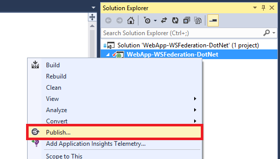
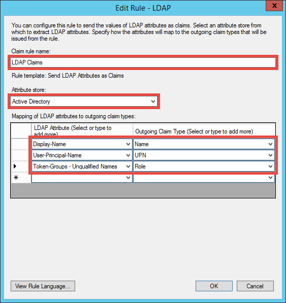

<properties 
    pageTitle="Créer une application Azure-métier avec l’authentification ADFS | Microsoft Azure" 
    description="Apprenez à créer une application métier dans Azure Application Service qui authentifie STS locales. Ce didacticiel cible AD FS en tant que le STS locales." 
    services="app-service\web" 
    documentationCenter=".net" 
    authors="cephalin" 
    manager="wpickett" 
    editor=""/>

<tags 
    ms.service="app-service-web" 
    ms.devlang="dotnet" 
    ms.topic="article" 
    ms.tgt_pltfrm="na" 
    ms.workload="web" 
    ms.date="08/31/2016" 
    ms.author="cephalin"/>

# Créer une application Azure-métier avec l’authentification ADFS

Cet article vous explique comment créer une application métier ASP.NET MVC dans le [Service d’application Azure](../app-service/app-service-value-prop-what-is.md) à l’aide d’un local [Active Directory Federation Services](http://technet.microsoft.com/library/hh831502.aspx) en tant que le fournisseur d’identité. Ce scénario peut fonctionner lorsque vous souhaitez créer des applications métier dans Azure Application Service mais votre organisation nécessite des données de répertoire stocké sur le site.

>[AZURE.NOTE] Pour une vue d’ensemble des options d’authentification et d’autorisation entreprise différente pour Azure Application Service, voir [authentifier avec locale d’Active Directory dans votre application Azure](web-sites-authentication-authorization.md).

## Vous allez créer ##

Vous allez créer une application ASP.NET simple dans Azure Application Service Web Apps avec les fonctionnalités suivantes :

- Authentifie les utilisateurs par rapport à AD FS
- Utilise `[Authorize]` pour autoriser des utilisateurs pour différentes actions
- Configuration statique pour débogage dans Visual Studio et publication dans l’application de Service Web Apps (configurer une seule fois, déboguer et publier à tout moment)  

## Vous avez besoin ##

[AZURE.INCLUDE [free-trial-note](../../includes/free-trial-note.md)]

Vous besoin des éléments suivants pour effectuer ce didacticiel :

- Un local déploiement AD FS (pour une procédure de bout en bout de l’environnement de test utilisé dans ce didacticiel, voir [laboratoire de Test : STS autonome avec AD FS dans Azure machine virtuelle (pour test uniquement)](https://blogs.msdn.microsoft.com/cephalin/2014/12/21/test-lab-standalone-sts-with-ad-fs-in-azure-vm-for-test-only/))
- Autorisations nécessaires pour créer le lieu d’utiliser des tiers approbations dans AD FS Management
- Mise à jour de Visual Studio 2013 4 ou version ultérieure
- [Azure SDK 2.8.1](http://go.microsoft.com/fwlink/p/?linkid=323510&clcid=0x409) ou version ultérieure

## Exemple d’utilisation application pour professionnelles de modèle ##

L’exemple d’application dans ce didacticiel, [WebApp-WSFederation-DotNet)](https://github.com/AzureADSamples/WebApp-WSFederation-DotNet), est créé par l’équipe Azure Active Directory. Dans la mesure où AD FS prend en charge la fédération Web, vous pouvez l’utiliser en tant que modèle pour créer des applications métier en toute simplicité. Il comporte les fonctionnalités suivantes :

- Utilise [La fédération Web](http://msdn.microsoft.com/library/bb498017.aspx) pour vous authentifier avec un local déploiement AD FS
- Fonctionnalités de connexion et déconnexion
- Utilise [Microsoft.Owin](http://www.asp.net/aspnet/overview/owin-and-katana/an-overview-of-project-katana) (au lieu de Windows Identity Foundation), qui est futures d’ASP.NET et plus faciles à configurer pour l’authentification et l’autorisation à WIF

## Configurer l’exemple d’application ##

2.  Cloner ou télécharger l’exemple de solution en [WebApp-WSFederation-DotNet](https://github.com/AzureADSamples/WebApp-WSFederation-DotNet) dans votre répertoire local.

    > [AZURE.NOTE] Les instructions de la section [README.md](https://github.com/AzureADSamples/WebApp-WSFederation-DotNet/blob/master/README.md) vous montrent comment configurer l’application avec Azure Active Directory. Mais dans ce didacticiel, vous configuré celui-ci avec AD FS, vous devez donc effectuer les opérations suivantes à la place.

3.  Ouvrez la solution et ouvrez Controllers\AccountController.cs dans l' **Explorateur de solutions**.

    Vous verrez que le code émet simplement une demande d’authentification pour authentifier l’utilisateur à l’aide de la fédération Web. Toutes les authentifications sont configurée dans App_Start\Startup.Auth.cs.

4.  Ouvrez App_Start\Startup.Auth.cs. Dans la `ConfigureAuth` méthode, notez la ligne :

        app.UseWsFederationAuthentication(
            new WsFederationAuthenticationOptions
            {
                Wtrealm = realm,
                MetadataAddress = metadata                                      
            });

    Dans le monde OWIN, cet extrait de code est vraiment au minimum que vous devez configurer l’authentification Web fédération. Il est beaucoup plus simple et élégant que WIF, où Web.config injection avec XML différents endroits. Les informations seulement vous avez besoin sont la partie de confiance (RP) identificateur et l’URL du fichier de métadonnées de votre service AD FS. Voici un exemple :

    -   Identificateur RP :`https://contoso.com/MyLOBApp`
    -   Adresse de métadonnées :`http://adfs.contoso.com/FederationMetadata/2007-06/FederationMetadata.xml`

5.  Dans App_Start\Startup.Auth.cs, modifiez les définitions de chaîne statique suivantes :  
    <pre class="prettyprint">
    domaine de chaîne statique privé = ConfigurationManager.AppSettings["ida :<mark>RPIdentifier</mark>»] ; <mark><del>chaîne statique privé aadInstance = ConfigurationManager.AppSettings["ida:AADInstance »] ;</del></mark> 
     <mark><del>client chaîne statique privé = ConfigurationManager.AppSettings["ida:Tenant »] ;</del></mark> 
     <mark><del>chaîne statique privé métadonnées = chaîne. Format (« {0} / {1} /federationmetadata/2007-06/federationmetadata.xml », aadInstance, client) ;</del></mark> 
     <mark>chaîne statique privé métadonnées = chaîne. Format (« https:// {0} /federationmetadata/2007-06/federationmetadata.xml », ConfigurationManager.AppSettings["ida:ADFS"]) ;</mark>

    <mark><del>autorité de chaîne = String.Format (CultureInfo.InvariantCulture, aadInstance, client) ;</del></mark>
    </pre>

6.  À présent, apportez les modifications correspondantes dans Web.config. Ouvrez le fichier Web.config et modifier les paramètres d’application suivants :  
    <pre class="prettyprint">
    &lt;appSettings&gt;
    &lt;add key="webpages:Version" value="3.0.0.0" /&gt;
    &lt;add key="webpages:Enabled" value="false" /&gt;
    &lt;add key="ClientValidationEnabled" value="true" /&gt;
    &lt;add key="UnobtrusiveJavaScriptEnabled" value="true" /&gt;
      <mark><del>&lt;add key="ida:Wtrealm" value="[Enter the App ID URI of WebApp-WSFederation-DotNet https://contoso.onmicrosoft.com/WebApp-WSFederation-DotNet]" /&gt;</del></mark>
      <mark><del>&lt;add key="ida:AADInstance" value="https://login.windows.net" /&gt;</del></mark>
      <mark><del>&lt;add key="ida:Tenant" value="[Enter tenant name, e.g. contoso.onmicrosoft.com]" /&gt;</del></mark>
      <mark>&lt;add key="ida:RPIdentifier" value="[Enter the relying party identifier tel que configuré dans AD FS, par exemple, https://localhost:44320 /] » /&gt;</mark>
      <mark>&lt;Ajouter clé = valeur « ida : ADFS » = « [Entrez le nom de domaine complet du service AD FS, par exemple, adfs.contoso.com] » /&gt; </mark>        

    &lt;/appSettings&gt;
    </pre>

    Renseignez les valeurs de clé en fonction de votre environnement correspondante.

7.  Générez l’application pour vous assurer qu’aucune erreur.

Voilà. L’exemple d’application est désormais prêt à travailler avec AD FS. Vous avez besoin configurer une approbation RP avec cette application ultérieurement dans AD FS.

## Déployer l’exemple d’application à Azure Application Service Web Apps

Ici, vous publiez l’application à une application web dans l’application de Service Web Apps tout en conservant l’environnement de débogage. Notez que vous allez publier l’application avant d’avoir une approbation RP avec AD FS, afin que l’authentification ne fonctionne toujours pas encore. Toutefois, si vous le faites maintenant vous pouvez avoir l’URL de l’application web que vous pouvez utiliser pour configurer l’approbation RP ultérieurement.

1. Avec le bouton droit de votre projet et sélectionnez **Publier**.

    

2. Sélectionnez **Microsoft Azure Application Service**.
3. Si vous n’avez pas connecté à Azure, cliquez sur **Se connecter** et utiliser le compte Microsoft pour votre abonnement Azure pour vous connecter.
4. Une fois connecté, cliquez sur **Nouveau** pour créer une application web.
5. Remplissez tous les champs requis. Vous vous apprêtez à se connecter localement données plus tard, afin de ne pas créer une base de données pour cette application web.

    

6. Cliquez sur **créer**. Une fois que l’application web est créée, la boîte de dialogue Publier le site Web est ouvert.
7. Dans l' **URL de Destination**, modifiez **http** en **https**. Copier l’URL complète dans un éditeur de texte pour une utilisation ultérieure. Ensuite, cliquez sur **Publier**.

    

11. Dans Visual Studio, ouvrez **Web.Release.config** dans votre projet. Insérez le code XML suivant dans le `<configuration>` ajouter des balises et remplacez la valeur de clé avec l’URL de votre application web publier.  
    <pre class="prettyprint">
&lt;appSettings&gt;
   &lt;Ajouter clé = valeur « ida : RPIdentifier » = «<mark>[par exemple, https://mylobapp.azurewebsites.net/]</mark>« xdt:Transform = xdt:Locator="Match(key) « SetAttributes » « /&gt;
&lt;/appSettings&gt;</pre>

Lorsque vous avez terminé, vous avez deux identificateurs RP configurés dans votre projet, un pour votre environnement de débogage dans Visual Studio et un pour l’application web publiés dans Azure. Vous allez définir une approbation RP pour chacune des deux environnements dans AD FS. Pendant le débogage, les paramètres d’application dans Web.config sont utilisés pour que votre configuration **Déboguer** fonctionne avec AD FS. Lorsqu’il est publié (par défaut, la configuration **Release** est publiée), un fichier Web.config transformé téléchargé incorpore les modifications de paramètre d’application dans Web.Release.config.

Si vous voulez joindre l’application web publiés dans Azure pour le débogueur (c'est-à-dire que vous devez télécharger les symboles de débogage de votre code dans l’application web publiés), vous pouvez créer une copie de la configuration de débogage pour le débogage Azure, mais avec sa propre transformation Web.config personnalisée (par exemple, Web.AzureDebug.config) qui utilise les paramètres d’application à partir de Web.Release.config. Cela vous permet de tenir à jour une configuration statique entre les différents environnements.

## Configurer les approbations fête confiance dans AD FS Management ##

Maintenant que vous devez configurer une approbation RP dans AD FS Management avant de pouvoir utiliser votre application exemple et réellement authentifier avec AD FS. Vous devrez configurer deux approbations RP distinctes, une pour votre environnement de débogage et l’autre pour votre application web publiées.

> [AZURE.NOTE] Vérifiez que vous répétez les étapes suivantes pour les deux de vos environnements.

4.  Sur votre serveur AD FS, ouvrez une session avec les informations d’identification disposant de droits de gestion à AD FS.
5.  Ouvrez l’outil Gestion AD FS. Droit **AD FS\Trusted Relationships\Relying fête approuve** et sélectionnez **Ajouter vous appuyer fête gestion de la confidentialité**.

    

5.  Dans la page **Sélectionner la Source de données** , sélectionnez **entrer manuellement les données relatives à la partie de confiance**. 

    

6.  Dans la page **Spécifier le nom complet** , tapez un nom d’affichage pour l’application et cliquez sur **suivant**.
7.  Dans la page **Choisir un protocole** , cliquez sur **suivant**.
8.  Dans la page **Configurer un certificat** , cliquez sur **suivant**.

    > [AZURE.NOTE] Dans la mesure où vous devez utiliser HTTPS déjà, jetons chiffrés sont facultatives. Si vous voulez vraiment chiffrer les jetons à partir d’AD FS sur cette page, vous devez également ajouter une logique de déchiffrement jeton dans votre code. Pour plus d’informations, voir [configuration manuelle des logiciels intermédiaires OWIN Web-Federation et acceptation des jetons chiffrés](http://chris.59north.com/post/2014/08/21/Manually-configuring-OWIN-WS-Federation-middleware-and-accepting-encrypted-tokens.aspx).
  
5.  Avant de passer à l’étape suivante, vous avez besoin d’un type d’information à partir de votre projet Visual Studio. Dans les propriétés du projet, notez l' **URL SSL** de l’application. 

    

6.  Dans AD FS Management, dans la page **Configurer l’URL** de l' **Assistant Ajout de confiance fête gestion de la confidentialité**, sélectionnez **Activer la prise en charge le protocole Web-Federation passif** et tapez l’URL SSL de votre projet Visual Studio que vous avez noté à l’étape précédente. Ensuite, cliquez sur **suivant**.

    

    > [AZURE.NOTE] URL indique où vous souhaitez transférer le client après que l’authentification réussit. Pour l’environnement de débogage, il doit être <code>https://localhost:&lt;port&gt;/</code>. Pour l’application web publiés, il doit être l’URL de l’application web.

7.  Dans la page **Configurer les identificateurs** , vérifiez que votre projet SSL URL est déjà répertorié, puis cliquez sur **suivant**. Cliquez sur **suivant** tout à fait à la fin de l’Assistant avec sélections par défaut.

    > [AZURE.NOTE] Dans App_Start\Startup.Auth.cs de votre projet Visual Studio, cet identificateur est comparé à la valeur de <code>WsFederationAuthenticationOptions.Wtrealm</code> lors de l’authentification fédérée. Par défaut, les URL de l’application à partir de l’étape précédente est ajouté comme un identificateur RP.

8.  Vous avez terminé de configurer l’application RP pour votre projet dans AD FS. Ensuite, vous configurez cette application pour envoyer les demandes nécessaires à votre application. La boîte de dialogue **Modifier les règles réclamer** est ouvert par défaut pour vous à la fin de l’Assistant pour que vous puissiez commencer immédiatement. Nous allons configurer au moins les affirmations suivantes (avec des schémas entre parenthèses) :

    -   Nom (http://schemas.xmlsoap.org/ws/2005/05/identity/claims/name) - utilisé par ASP.NET pour alimenter `User.Identity.Name`.
    -   Nom d’utilisateur principal (http://schemas.xmlsoap.org/ws/2005/05/identity/claims/upn) - utilisé pour identifier les utilisateurs de l’organisation.
    -   Appartenances à un groupe en tant que rôles (http://schemas.microsoft.com/ws/2008/06/identity/claims/role) - peut être utilisé avec `[Authorize(Roles="role1, role2,...")]` décoration pour autoriser contrôleurs/actions. En réalité, cette approche peut ne pas être le plus performantes pour l’autorisation de rôle. Si vos utilisateurs AD appartiennent à des centaines de groupes de sécurité, ils deviennent des centaines de rôle revendications du jeton SAML. Une autre solution consiste à envoyer une demande de remboursement seul rôle conditionnelle en fonction de l’appartenance à un groupe particulier. Toutefois, nous allons Restez simple pour ce didacticiel.
    -   Nom ID (http://schemas.xmlsoap.org/ws/2005/05/identity/claims/nameidentifier) - peut être utilisé pour la validation contre. Pour plus d’informations sur la manière qu’il fonctionne avec validation contre, consultez la section **Ajouter une fonctionnalité de métier** de [créer une ligne d’activité application Azure avec l’authentification Azure Active Directory](web-sites-dotnet-lob-application-azure-ad.md#bkmk_crud).

    > [AZURE.NOTE] Les types de revendications vous devez configurer pour votre application est déterminé par les besoins de votre application. Pour la liste des revendications prises en charge par les applications Azure Active Directory (c'est-à-dire les approbations RP), par exemple, voir [jeton pris en charge et les Types de revendications](http://msdn.microsoft.com/library/azure/dn195587.aspx).

8.  Dans la boîte de dialogue Modifier les règles de revendications, cliquez sur **Ajouter une règle**.
9.  Configurer les nom UPN et rôle revendications comme indiqué dans la capture d’écran, cliquez sur **Terminer**.

    

    Ensuite, vous créez un nom transitoire ID réclamer la procédure indiqué dans les [Identificateurs de nom dans assertions SAML](http://blogs.msdn.com/b/card/archive/2010/02/17/name-identifiers-in-saml-assertions.aspx).

9.  Cliquez à nouveau sur **Ajouter une règle** .
10. Sélectionnez **Envoyer des demandes à l’aide d’une règle personnalisée** , puis cliquez sur **suivant**.
11. Collez la langue de règle suivante dans la zone **règle personnalisée** , nommez la règle **Par l’identificateur de Session** et cliquez sur **Terminer**.  
    <pre class="prettyprint">
    C1 : [Type == « http://schemas.microsoft.com/ws/2008/06/identity/claims/windowsaccountname »] &amp; &amp; 
    c2 : [Type == « http://schemas.microsoft.com/ws/2008/06/identity/claims/authenticationinstant »] = > Ajouter (stocker = « _OpaqueIdStore », types = («<mark>http://contoso.com/internal/sessionid</mark>»), requête = « {0} ; {} 1} ; {2} ; {3} ; {4} », paramètre = « useEntropy », paramètre = c1. Valeur, paramètre = c1. OriginalIssuer, paramètre = « », paramètre = c2. Valeur) ;
    </pre>

    Votre règle personnalisée doit ressembler à cette capture d’écran :

    

9.  Cliquez à nouveau sur **Ajouter une règle** .
10. Sélectionnez **transformer un réclamer entrants** , puis cliquez sur **suivant**.
11. Configurer la règle comme indiqué dans la capture d’écran (en utilisant le type de réclamer que vous avez créé dans la règle personnalisée) et cliquez sur **Terminer**.

    

    Pour plus d’informations sur les étapes de la demande de nom ID transitoire, voir [Identificateurs de nom dans assertions SAML](http://blogs.msdn.com/b/card/archive/2010/02/17/name-identifiers-in-saml-assertions.aspx).

12. Cliquez sur **Appliquer** dans la boîte de dialogue **Modifier les règles réclamer** . Il doit maintenant ressembler à la capture d’écran suivante :

    

    > [AZURE.NOTE] Là encore, assurez-vous que vous répétez ces étapes pour votre environnement de débogage et l’application web publiés.

## Authentification fédérée test pour votre application

Vous êtes prêt à tester la logique d’authentification de votre application par rapport à AD FS. Dans mon environnement de test AD FS, j’ai un utilisateur de test appartenant à un groupe dans Active Directory (AD).

Pour tester l’authentification dans le débogueur, il vous souhaitez maintenant est type `F5`. Si vous souhaitez tester l’authentification dans l’application web publiés, accédez à l’URL.

Une fois l’application web chargé, cliquez sur **Se connecter**. Vous devriez maintenant obtenir une boîte de dialogue connexion ou la page de connexion pris en charge par ADFS, selon la méthode d’authentification choisie par AD FS. Voici ce que je reçois dans Internet Explorer 11.

Une fois que vous vous connectez à l’aide d’un utilisateur dans le domaine AD du déploiement AD FS, vous devez maintenant voir la page d’accueil de **Bonjour, <User Name>!** dans le coin. Voici ce que je reçois.

Jusque là, vous avez réussi des façons suivantes :

- Votre application a atteint l’AD FS et identificateur RP correspondant se trouve dans la base de données AD FS
- AD FS a correctement authentifié un utilisateur AD et les rediriger vers la page d’accueil de l’application
- AD FS envoyé la demande de nom (http://schemas.xmlsoap.org/ws/2005/05/identity/claims/name) à votre application, comme indiqué par le fait que le nom d’utilisateur est affiché dans le coin. 

Si la demande de nom n’apparaît pas, vous auriez vu **Bonjour, !**. Si vous examinez Views\Shared\_LoginPartial.cshtml, vous avez trouvé qu’elle utilise `User.Identity.Name` pour afficher le nom d’utilisateur. Comme indiqué précédemment, si la demande de nom de l’utilisateur authentifié est disponible dans le jeton SAML, ASP.NET hydrates cette propriété avec lui. Pour afficher toutes les demandes qui sont envoyés par AD FS, placez un point d’arrêt dans Controllers\HomeController.cs, dans la méthode d’action Index. Une fois l’utilisateur authentifié, inspecter la `System.Security.Claims.Current.Claims` collection de sites.

 

## Autoriser les utilisateurs pour contrôleurs spécifiques ou des actions

Étant donné que vous avez inclus appartenances en tant que revendications rôle dans votre configuration de l’approbation RP, vous pouvez désormais utiliser les directement dans le `[Authorize(Roles="...")]` décoration pour contrôleurs et actions. Dans une application métier avec le modèle créer-lecture-mise à jour-suppression (CRUD), vous pouvez autoriser des rôles spécifiques pour accéder à chaque action. Pour l’instant, vous essaiera uniquement cette fonctionnalité sur le contrôleur accueil existant.

1. Ouvrez Controllers\HomeController.cs.
2. Décorer les `About` et `Contact` méthodes d’action semblables au code suivant, en utilisant la sécurité appartenances de l’utilisateur authentifié.  
    <pre class="prettyprint">
    <mark>[Autoriser (rôles = « Test Group »)]</mark> 
    public ActionResult About() {ViewBag.Message = « Votre description de la page d’application. » ;

        return View();
    }

    <mark>[Autoriser (rôles = « Domain Admins »)]</mark> 
    public ActionResult Contact() {ViewBag.Message = « Votre contact page. » ;

        return View();
    }  </pre>

    Étant donné que j’ai ajouté **Tester utilisateur** au **Groupe de Test** dans mon environnement de test AD FS, je vais utiliser groupe de Test pour tester les autorisations sur `About`. Pour `Contact`, je vais tester la casse négative du **Domain Admins**, auquel n’appartient pas **Tester utilisateur** .

3. En tapant le démarrez `F5` et se connecter, puis cliquez sur à **propos**. Vous devez maintenant afficher la `~/About/Index` page correctement, si votre utilisateur authentifié est autorisé pour cette action.
4. Cliquez sur **contacts**, qui ne devraient pas autoriser **l’Utilisateur de Test** pour l’action dans mon cas. Toutefois, le navigateur est redirigé vers AD FS, qui finalement affiche ce message :

    

    Si vous examinez cette erreur dans l’Observateur d’événements sur le serveur AD FS, vous voyez ce message d’exception :  
    <pre class="prettyprint">
   Microsoft.IdentityServer.Web.InvalidRequestException : MSIS7042 : <mark>la même session de navigateur client a été demandes « 6 » dans les dernière 11 secondes.</mark> Pour plus d’informations, contactez votre administrateur.
   en Microsoft.IdentityServer.Web.Protocols.PassiveProtocolHandler.UpdateLoopDetectionCookie (contexte WrappedHttpListenerContext) à Microsoft.IdentityServer.Web.Protocols.WSFederation.WSFederationProtocolHandler.SendSignInResponse (WSFederationContext contexte, réponse MSISSignInResponse) à Microsoft.IdentityServer.Web.PassiveProtocolListener.ProcessProtocolRequest (ProtocolContext protocolContext, PassiveProtocolHandler protocolHandler) en Microsoft.IdentityServer.Web.PassiveProtocolListener.OnGetContext (WrappedHttpListenerContext contexte) </pre>

    La raison pour laquelle cette erreur est que par défaut, MVC renvoie un 401 non autorisé lorsque les rôles d’un utilisateur ne sont pas autorisés. Cela déclenche une demande d’authentification pour votre fournisseur d’identité (AD FS). Étant donné que l’utilisateur est déjà authentifié, AD FS renvoie à la même page, laquelle puis émet un autre 401, création d’une boucle de redirection. Vous remplace de AuthorizeAttribute `HandleUnauthorizedRequest` méthode avec une logique simple pour afficher un élément qui est pertinent pour au lieu de poursuivre la boucle de redirection.

5. Créer un fichier dans le projet appelé AuthorizeAttribute.cs et collez le code suivant.

        using System;
        using System.Web.Mvc;
        using System.Web.Routing;
        
        namespace WebApp_WSFederation_DotNet
        {
            [AttributeUsage(AttributeTargets.Class | AttributeTargets.Method, Inherited = true, AllowMultiple = true)]
            public class AuthorizeAttribute : System.Web.Mvc.AuthorizeAttribute
            {
                protected override void HandleUnauthorizedRequest(AuthorizationContext filterContext)
                {
                    if (filterContext.HttpContext.Request.IsAuthenticated)
                    {
                        filterContext.Result = new System.Web.Mvc.HttpStatusCodeResult((int)System.Net.HttpStatusCode.Forbidden);
                    }
                    else
                    {
                        base.HandleUnauthorizedRequest(filterContext);
                    }
                }
            }
        }

    Le code de substitution envoie un HTTP 403 (refusé) au lieu de HTTP 401 (non autorisé) dans les cas authentifiés mais non autorisés.

6. Exécuter le débogueur de `F5`. En cliquant sur **Contact** maintenant affiche un message d’erreur plus informatif (très peu attrayante) :

    

7. Publier l’application à Azure Application Service Web Apps et tester le comportement de l’application live.

## Se connecter à des données locales

Une raison que vous souhaiteriez implémenter votre application métier avec AD FS au lieu d’Azure Active Directory est les problèmes de conformité à la conservation des données organisation hors-site. Cela peut également signifie que votre application web dans Azure doit accéder aux bases de données locales, car vous n’êtes pas autorisé à utiliser la [Base de données SQL](/services/sql-database/) que la couche de données pour vos applications web.

Azure Application Service Web Apps prend en charge l’accès à des bases de données locales avec deux approches : [Connexions hybride](../biztalk-services/integration-hybrid-connection-overview.md) et [Réseaux virtuels](web-sites-integrate-with-vnet.md). Pour plus d’informations, voir [VNET à l’aide de l’intégration et des connexions hybride avec Azure Application Service Web Apps](https://azure.microsoft.com/blog/2014/10/30/using-vnet-or-hybrid-conn-with-websites/).

## Autres ressources

- [Protéger l’Application avec SSL et l’attribut autoriser](web-sites-dotnet-deploy-aspnet-mvc-app-membership-oauth-sql-database.md#protect-the-application-with-ssl-and-the-authorize-attribute)
- [Vous authentifier avec locale d’Active Directory dans votre application Azure](web-sites-authentication-authorization.md)
- [Créer une application Azure-métier avec l’authentification Azure Active Directory](web-sites-dotnet-lob-application-azure-ad.md)
- [Utilisez l’Option de l’authentification d’organisation locale (ADFS) avec ASP.NET dans Visual Studio 2013](http://www.cloudidentity.com/blog/2014/02/12/use-the-on-premises-organizational-authentication-option-adfs-with-asp-net-in-visual-studio-2013/)
- [Migrer un projet Web VS2013 de WIF vers interconnexions](http://www.cloudidentity.com/blog/2014/09/15/MIGRATE-A-VS2013-WEB-PROJECT-FROM-WIF-TO-KATANA/)
- [Vue d’ensemble des Services de fédération Active Directory](http://technet.microsoft.com/library/hh831502.aspx)
- [Spécification de la fédération Web 1.1](http://download.boulder.ibm.com/ibmdl/pub/software/dw/specs/ws-fed/WS-Federation-V1-1B.pdf?S_TACT=105AGX04&S_CMP=LP)

