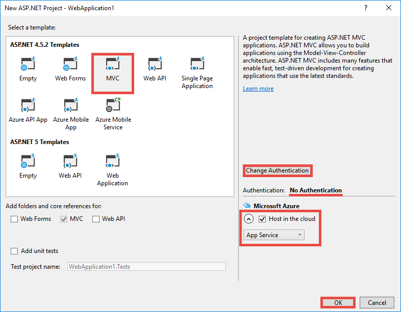
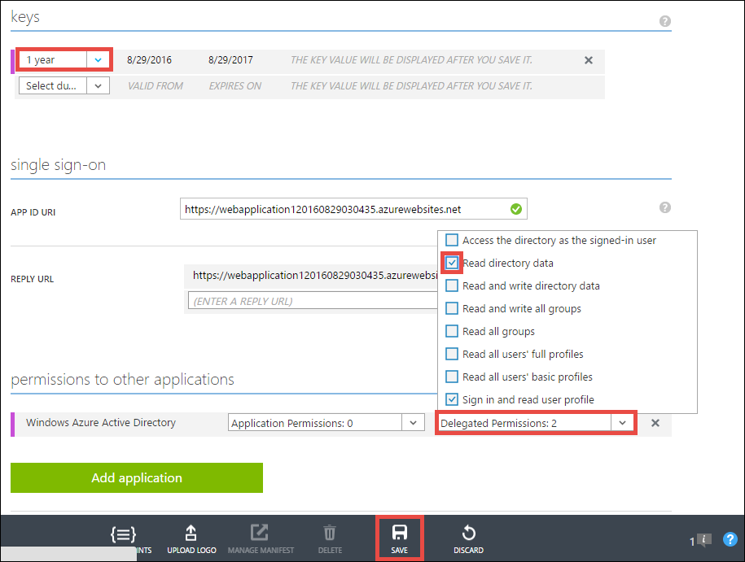
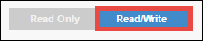

<properties 
    pageTitle="Créer une application Azure-métier avec l’authentification Azure Active Directory | Microsoft Azure" 
    description="Apprenez à créer une application métier ASP.NET MVC dans Azure Application Service qui authentifie Azure Active Directory" 
    services="app-service\web, active-directory" 
    documentationCenter=".net" 
    authors="cephalin" 
    manager="wpickett" 
    editor=""/>

<tags 
    ms.service="app-service-web" 
    ms.devlang="dotnet" 
    ms.topic="article" 
    ms.tgt_pltfrm="na" 
    ms.workload="web" 
    ms.date="09/01/2016" 
    ms.author="cephalin"/>

# Créer une application Azure-métier avec l’authentification Azure Active Directory #

Cet article vous explique comment créer une application métier de .NET dans [Azure Application Service Web Apps](http://go.microsoft.com/fwlink/?LinkId=529714) à l’aide du [authentification / autorisation](../app-service/app-service-authentication-overview.md) fonctionnalité. Il indique également comment utiliser l' [API Azure Active Directory Graph](https://msdn.microsoft.com/Library/Azure/Ad/Graph/api/api-catalog) pour interroger des données directory dans l’application.

Le client Azure Active Directory que vous utilisez peut être un répertoire Azure uniquement. Ou bien, il peut être [synchronisé avec Active Directory sur site](../active-directory/active-directory-aadconnect.md) de créer une expérience d’authentification unique pour les travailleurs qui sont en local et à distance. Cet article utilise le répertoire par défaut pour votre compte Azure.

## Vous allez créer ##

Vous allez générer une application de créer-lecture-mise à jour-suppression (CRUD)-métier simple dans l’application de Service Web Apps que suit le travail éléments grâce aux fonctionnalités suivantes :

- Authentifie les utilisateurs avec Azure Active Directory
- Utilisateurs et groupes à l’aide [d’Azure Active Directory Graph API](http://msdn.microsoft.com/library/azure/hh974476.aspx) directory des requêtes
- Utiliser le modèle ASP.NET MVC *Aucune authentification*

Si vous avez besoin de contrôle d’accès basé sur un rôle (RBAC) pour votre application métier dans Azure, reportez-vous à [l’Étape suivante](#next).

## Vous avez besoin ##

[AZURE.INCLUDE [free-trial-note](../../includes/free-trial-note.md)]

Vous besoin des éléments suivants pour effectuer ce didacticiel :

- Un client Azure Active Directory avec des utilisateurs dans différents groupes
- Autorisations pour créer des applications sur le client Azure Active Directory
- Mise à jour de Visual Studio 2013 4 ou version ultérieure
- [Kit de développement logiciel Azure 2.8.1 ou version ultérieure](https://azure.microsoft.com/downloads/)

## Créer et déployer une application web vers Azure ##

1. Dans Visual Studio, cliquez sur **fichier** > **Nouveau** > **projet**.

2. Sélectionnez **Application Web ASP.NET**, nommez votre projet, puis cliquez sur **OK**.

3. Sélectionnez le modèle **MVC** , puis modifiez l’authentification **Non**. Vérifiez que **l’hôte dans le nuage** est sélectionné, puis cliquez sur **OK**.

    

4. Dans la boîte de dialogue **Créer un Service de l’application** , cliquez sur **Ajouter un compte** (puis sur **Ajouter un compte** dans la liste déroulante) pour vous connecter à votre compte Azure.

5. Une fois connecté, configurez votre application web. Créer un groupe de ressources et une nouvelle offre de Service d’application en cliquant sur le bouton **Nouveau** correspondant. Cliquez sur **Explorer des services Azure supplémentaires** pour continuer.

    

6. Dans l’onglet **Services** , cliquez sur **+** pour ajouter une base de données SQL pour votre application. 

    

7. De **Configurer la base de données SQL**, cliquez sur **Nouveau** pour créer une instance de SQL Server.

8. **Configuration de SQL Server**, configurez votre instance de SQL Server. Ensuite, cliquez sur **OK**, **OK**et **créer** pour démarrer la création d’une application dans Azure.

9. Dans l' **Activité de Service d’application Azure**, vous pouvez voir quand la création d’une application est terminée. Cliquez sur * *Publier &lt; *appname*> pour cette application Web maintenant**puis cliquez sur **publier **. 

    Une fois que Visual Studio se termine, il ouvre l’application publier dans le navigateur. 

    

## Configurer l’accès d’authentification et d’annuaire

1. Connectez-vous au [portail Azure](https://portal.azure.com).

2. Dans le menu de gauche, cliquez sur **Services d’application** > **&lt;*appname*>** > **authentification / autorisation **.

    

3. Activer l’authentification Azure Active Directory en cliquant **sur** > **Azure Active Directory** > **Express** > **OK**.

    

4. Dans la barre de commandes, cliquez sur **Enregistrer** .

    

    Une fois que les paramètres d’authentification sont enregistrées correctement, essayez d’afficher votre application à nouveau dans le navigateur. Vos paramètres par défaut appliquent l’authentification à l’application entière. Si vous n’êtes pas déjà connecté, vous êtes redirigé vers un écran de connexion. Une fois connecté, vous consultez votre application sécurisée par HTTPS. Ensuite, vous devez activer l’accès aux données de l’annuaire. 

5. Accédez au [portail classique](https://manage.windowsazure.com).

6. Dans le menu de gauche, cliquez sur **Active Directory** > **Répertoire par défaut** > **Applications** > **&lt;*appname*> **.

    

    Il s’agit de l’application Azure Active Directory Application Service créé pour vous permettent de l’autorisation / fonctionnalité d’authentification.

7. Cliquez sur **utilisateurs** et **groupes** pour vous assurer que vous avez certains utilisateurs et groupes dans l’annuaire. Dans le cas contraire, créez quelques utilisateurs de test et des groupes.

    

7. Cliquez sur **configurer** pour cette application.

8. Faites défiler jusqu'à la section **clés** et ajoutez une clé en sélectionnant une durée. Puis, cliquez sur **Autorisations délégués** , sélectionnez les **données de l’annuaire en lecture**. Cliquez sur **Enregistrer**.

    

8. Une fois que vos paramètres sont enregistrés, revenez en la section **clés** , puis cliquez sur le bouton **Copier** pour copier la clé du client. 

    

    >[AZURE.IMPORTANT] Si vous naviguez maintenant en dehors de cette page, vous ne pourrez pas accéder à ce client clé jamais à nouveau.

9. Ensuite, vous devez configurer votre application web lorsqu’elle est. Connectez-vous à l' [Explorateur de ressources Azure](https://resources.azure.com) avec votre compte Azure.

10. En haut de la page, cliquez sur **En lecture/écriture** pour apporter des modifications dans l’Explorateur de ressources Azure.

    

11. Trouver les paramètres d’authentification pour votre application, situé à abonnements > * *&lt;*subscriptionname*>** > **resourceGroups** > **&lt;*resourcegroupname*>** > **fournisseurs** > **Microsoft.Web** > **sites** > **&lt;*appname*>** > **config** > **authsettings **.

12. Cliquez sur **Modifier**.

    

13. Dans le volet d’édition, définissez la `clientSecret` et `additionalLoginParams` propriétés comme suit.

        ...
        "clientSecret": "<client key from the Azure Active Directory application>",
        ...
        "additionalLoginParams": ["response_type=code id_token", "resource=https://graph.windows.net"],
        ...

14. Cliquez sur **placer** dans la partie supérieure pour envoyer vos modifications.

    

14. À présent, pour tester si vous avez le jeton d’autorisation pour accéder à l’API de Graph Azure Active Directory, simplement atteindre * *https://&lt;*appname*>.azurewebsites.net/.auth/me** dans votre navigateur. Si vous avez tout correctement configuré, vous devriez voir les `access_token` propriété dans la réponse JSON.

    La `~/.auth/me` chemin d’URL est gérée par l’application de Service d’authentification / autorisation vous donner toutes les informations relatives à votre session authentifiée. Pour plus d’informations, voir [l’authentification et l’autorisation dans le Service d’application Azure](../app-service/app-service-authentication-overview.md).

    >[AZURE.NOTE] La `access_token` a une période d’expiration. Toutefois, application Service authentification / autorisation fournit des fonctionnalités d’actualisation jeton avec `~/.auth/refresh`. Pour plus d’informations sur son utilisation, voir     [App Store de jeton de Service](https://cgillum.tech/2016/03/07/app-service-token-store/).

Ensuite, vous effectuez une opération utile avec les données de l’annuaire.

## Ajouter des fonctionnalités de métier à votre application

À présent, vous créez un suivi d’éléments de travail CRUD simple.  

5.  Dans le dossier ~\Models, créez un fichier de classe appelé WorkItem.cs et remplacez `public class WorkItem {...}` par le code suivant :

        using System.ComponentModel.DataAnnotations;

        public class WorkItem
        {
            [Key]
            public int ItemID { get; set; }
            public string AssignedToID { get; set; }
            public string AssignedToName { get; set; }
            public string Description { get; set; }
            public WorkItemStatus Status { get; set; }
        }

        public enum WorkItemStatus
        {
            Open,
            Investigating,
            Resolved,
            Closed
        }

7.  Générez le projet pour le rendre accessible à la logique de la structure à votre nouveau modèle dans Visual Studio.

8.  Ajouter un nouvel élément avec génération de modèles `WorkItemsController` vers le dossier ~\Controllers (avec le bouton droit **contrôleurs**, pointez sur **Ajouter**et sélectionnez **un nouvel élément avec génération de modèles**). 

9.  **Contrôleur de 5 MVC avec les affichages, à l’aide de Framework entité** , cliquez sur **Ajouter**.

10. Sélectionnez le modèle que vous avez créé, puis cliquez sur **+** et puis **Ajouter** pour ajouter un contexte de données, puis cliquez sur **Ajouter**.

    

14. Dans ~\Views\WorkItems\Create.cshtml (un élément automatiquement avec génération de modèles), recherchez la `Html.BeginForm` méthode d’assistance et apportez les modifications en surbrillance suivantes :  
<pre class="prettyprint">
    @modelWebApplication1.Models.WorkItem

    @{ViewBag.Title = &quot;créer&quot;; }

    &lt;H2&gt;créer&lt;/h2&gt;

    @using(Html.BeginForm (<mark>&quot;créer&quot;, &quot;éléments de travail&quot;, FormMethod.Post, nouveau {id = &quot;formulaire principal&quot; }</mark>)) {@Html.AntiForgeryToken()

        &lt;div class=&quot;form-horizontal&quot;&gt;
            &lt;h4&gt;WorkItem&lt;/h4&gt;
            &lt;hr /&gt;
            @Html.ValidationSummary(true, &quot;&quot;, new { @class = &quot;text-danger&quot; })
            &lt;div class=&quot;form-group&quot;&gt;
                @Html.LabelFor(model =&gt; model.AssignedToID, htmlAttributes: new { @class = &quot;control-label col-md-2&quot; })
                &lt;div class=&quot;col-md-10&quot;&gt;
                    @Html.EditorFor(model =&gt; model.AssignedToID, new { htmlAttributes = new { @class = &quot;form-control&quot;<mark>, @type = &quot;hidden&quot;</mark> } })
                    @Html.ValidationMessageFor(model =&gt; model.AssignedToID, &quot;&quot;, new { @class = &quot;text-danger&quot; })
                &lt;/div&gt;
            &lt;/div&gt;

            &lt;div class=&quot;form-group&quot;&gt;
                @Html.LabelFor(model =&gt; model.AssignedToName, htmlAttributes: new { @class = &quot;control-label col-md-2&quot; })
                &lt;div class=&quot;col-md-10&quot;&gt;
                    @Html.EditorFor(model =&gt; model.AssignedToName, new { htmlAttributes = new { @class = &quot;form-control&quot; } })
                    @Html.ValidationMessageFor(model =&gt; model.AssignedToName, &quot;&quot;, new { @class = &quot;text-danger&quot; })
                &lt;/div&gt;
            &lt;/div&gt;

            &lt;div class=&quot;form-group&quot;&gt;
                @Html.LabelFor(model =&gt; model.Description, htmlAttributes: new { @class = &quot;control-label col-md-2&quot; })
                &lt;div class=&quot;col-md-10&quot;&gt;
                    @Html.EditorFor(model =&gt; model.Description, new { htmlAttributes = new { @class = &quot;form-control&quot; } })
                    @Html.ValidationMessageFor(model =&gt; model.Description, &quot;&quot;, new { @class = &quot;text-danger&quot; })
                &lt;/div&gt;
            &lt;/div&gt;

            &lt;div class=&quot;form-group&quot;&gt;
                @Html.LabelFor(model =&gt; model.Status, htmlAttributes: new { @class = &quot;control-label col-md-2&quot; })
                &lt;div class=&quot;col-md-10&quot;&gt;
                    @Html.EnumDropDownListFor(model =&gt; model.Status, htmlAttributes: new { @class = &quot;form-control&quot; })
                    @Html.ValidationMessageFor(model =&gt; model.Status, &quot;&quot;, new { @class = &quot;text-danger&quot; })
                &lt;/div&gt;
            &lt;/div&gt;

            &lt;div class=&quot;form-group&quot;&gt;
                &lt;div class=&quot;col-md-offset-2 col-md-10&quot;&gt;
                    &lt;input type=&quot;submit&quot; value=&quot;Create&quot; class=&quot;btn btn-default&quot;<mark> id=&quot;submit-button&quot;</mark> /&gt;
                &lt;/div&gt;
            &lt;/div&gt;
        &lt;/div&gt;
    }

    &lt;div&gt;
    @Html.ActionLink(&quot;retour à la liste&quot;, &quot;Index&quot;) &lt;/div    &gt;

    @sectionScripts { @Scripts.Render( &quot;~/bundles/jqueryval&quot;)     <mark> &lt;script&gt; 
     / / Code de sélecteur de personnes/groupe var maxResultsPerPage = 14 ;         entrée var = document.getElementById (&quot;AssignedToName&quot;) ;

            // Access token from request header, and tenantID from claims identity
            var token = &quot;@Request.Headers[&quot;X-MS-TOKEN-AAD-ACCESS-TOKEN&quot;]&quot;;
            var tenant =&quot;@(System.Security.Claims.ClaimsPrincipal.Current.Claims
                            .Where(c => c.Type == &quot;http://schemas.microsoft.com/identity/claims/tenantid&quot;)
                            .Select(c => c.Value).SingleOrDefault())&quot;;

            var picker = new AadPicker(maxResultsPerPage, input, token, tenant);

            // Submit the selected user/group to be asssigned.
            $(&quot;#submit-button&quot;).click({ picker: picker }, function () {
                if (!picker.Selected())
                    return;
                $(&quot;#main-form&quot;).get()[0].elements[&quot;AssignedToID&quot;].value = picker.Selected().objectId;
            });
        &lt;/script&gt;</mark>
    }
    </pre>
    
    Notez que `token` et `tenant` sont utilisées par le `AadPicker` objet pour émettre des appels Azure Active Directory Graph API. Vous souhaitez ajouter `AadPicker` ultérieurement.   
    
    >[AZURE.NOTE] Vous pouvez tout aussi bien obtenir `token` et `tenant` à partir du client avec `~/.auth/me`, mais ce serait un appel de serveurs supplémentaires. Par exemple :
    >  
    >     $.ajax({
    >         dataType: "json",
    >         url: "/.auth/me",
    >         success: function (data) {
    >             var token = data[0].access_token;
    >             var tenant = data[0].user_claims
    >                             .find(c => c.typ === 'http://schemas.microsoft.com/identity/claims/tenantid')
    >                             .val;
    >         }
    >     });
    
15. Apporter des modifications avec ~ \Views\WorkItems\Edit.cshtml.

15. La `AadPicker` objet est défini dans un script dont vous avez besoin d’ajouter à votre projet. Cliquez sur le dossier ~\Scripts, pointez sur **Ajouter**, puis cliquez sur **fichier JavaScript**. Type de `AadPickerLibrary` pour le nom de fichier et cliquez sur **OK**.

16. Copiez le contenu [ici](https://raw.githubusercontent.com/cephalin/active-directory-dotnet-webapp-roleclaims/master/WebApp-RoleClaims-DotNet/Scripts/AadPickerLibrary.js) dans ~ \Scripts\AadPickerLibrary.js.

    Dans le script, le `AadPicker` objet appelle [Azure Active Directory Graph API](https://msdn.microsoft.com/Library/Azure/Ad/Graph/api/api-catalog) pour rechercher des utilisateurs et groupes qui correspondent à l’entrée.  

17. ~\Scripts\AadPickerLibrary.js utilise également le [widget de saisie semi-automatique de l’interface utilisateur jQuery](https://jqueryui.com/autocomplete/). Si vous devez ajouter l’interface utilisateur jQuery à votre projet. Avec le bouton droit de votre projet dans, puis cliquez sur **Gérer les Packages NuGet**.

18. Dans le Gestionnaire de Package NuGet, cliquez sur Parcourir, tapez **l’interface utilisateur jquery** dans la barre de recherche, puis cliquez sur **jQuery.UI.Combined**.

    

19. Dans le volet droit, cliquez sur **installer**, puis cliquez sur **OK** pour continuer.

19. Ouvrez ~\App_Start\BundleConfig.cs et apportez les modifications en surbrillance suivantes :  
    <pre class="prettyprint">
    RegisterBundles(BundleCollection bundles) void statique public {offres. Ajouter (nouvelle ScriptBundle (&quot;~/bundles/jquery&quot;). Inclure ( &quot;~/Scripts/jquery-{version}.js&quot;<mark>, &quot;~/Scripts/jquery-ui-{version}.js&quot;, &quot;~/Scripts/AadPickerLibrary.js&quot;</mark>)) ;

        bundles.Add(new ScriptBundle(&quot;~/bundles/jqueryval&quot;).Include(
                    &quot;~/Scripts/jquery.validate*&quot;));

        // Use the development version of Modernizr to develop with and learn from. Then, when you&#39;re
        // ready for production, use the build tool at http://modernizr.com to pick only the tests you need.
        bundles.Add(new ScriptBundle(&quot;~/bundles/modernizr&quot;).Include(
                    &quot;~/Scripts/modernizr-*&quot;));

        bundles.Add(new ScriptBundle(&quot;~/bundles/bootstrap&quot;).Include(
                    &quot;~/Scripts/bootstrap.js&quot;,
                    &quot;~/Scripts/respond.js&quot;));

        bundles.Add(new StyleBundle(&quot;~/Content/css&quot;).Include(
                    &quot;~/Content/bootstrap.css&quot;,
                    &quot;~/Content/site.css&quot;<mark>,
                    &quot;~/Content/themes/base/jquery-ui.css&quot;</mark>));
    }
    </pre>

    Il existe plusieurs manières performant pour gérer des fichiers CSS et JavaScript dans votre application. Toutefois, pour simplifier vous allez juste en question sur les offres qui sont chargés avec chaque affichage.

12. Enfin, dans ~ \Global.asax, ajoutez la ligne suivante du code dans la `Application_Start()` méthode. `Ctrl`+`.`chaque erreur de résolution d’appellation résoudre le problème.

        AntiForgeryConfig.UniqueClaimTypeIdentifier = ClaimTypes.NameIdentifier;
    
    > [AZURE.NOTE] Vous avez besoin de cette ligne de code, car le modèle MVC par défaut utilise <code>[ValidateAntiForgeryToken]</code> décoration sur certaines des actions. En raison du comportement décrit par [Brock Allen](https://twitter.com/BrockLAllen)     [MVC 4, AntiForgeryToken](http://brockallen.com/2012/07/08/mvc-4-antiforgerytoken-and-claims/) et revendications votre billet HTTP peut échouer contre jeton validation car :

    > - Azure Active Directory n’envoie pas http://schemas.microsoft.com/accesscontrolservice/2010/07/claims/identityprovider, qui est requis par défaut par le jeton contre.
    > - Si Azure Active Directory est répertoire synchronisé avec AD FS, l’approbation AD FS par défaut n’envoie la demande http://schemas.microsoft.com/accesscontrolservice/2010/07/claims/identityprovider, bien que vous pouvez configurer manuellement AD FS pour envoyer la demande.

    > `ClaimTypes.NameIdentifies`Spécifie la demande `http://schemas.xmlsoap.org/ws/2005/05/identity/claims/nameidentifier`, laquelle Azure Active Directory fournit.  

20. À présent, publier vos modifications. Avec le bouton droit de votre projet, puis cliquez sur **Publier**.

21. Cliquez sur **paramètres**, assurez-vous qu’il existe une chaîne de connexion à votre base de données SQL, sélectionnez **Mise à jour de base de données** puisse apporter les modifications de schéma pour votre modèle et cliquez sur **Publier**.

    

22. Dans le navigateur, accédez à https://&lt;*appname*>.azurewebsites.net/workitems et cliquez sur **Créer un nouveau**.

23. Cliquez dans la zone **AssignedToName** . Normalement, les utilisateurs et groupes à partir de votre client Azure Active Directory dans une liste déroulante. Vous pouvez taper pour filtrer les données, ou utiliser le `Up` ou `Down` clés ou cliquez sur pour sélectionner l’utilisateur ou groupe. 

    

24. Cliquez sur **créer** pour enregistrer les modifications. Ensuite, cliquez sur **Modifier** dans l’élément de travail créé à observer le même comportement.

Félicitations, vous êtes maintenant en une application métier Azure avec accès au répertoire ! Il est beaucoup plus, que vous pouvez faire avec l’API de graphique. Voir [référence de l’API Azure AD Graph](https://msdn.microsoft.com/library/azure/ad/graph/api/api-catalog).

## Étape suivante

Si vous avez besoin de contrôle d’accès basé sur un rôle (RBAC) pour votre application métier dans azure, voir [WebApp-RoleClaims-DotNet](https://github.com/Azure-Samples/active-directory-dotnet-webapp-roleclaims) pour un échantillon de l’équipe Azure Active Directory. Il vous montre comment activer les rôles pour votre application Azure Active Directory et puis autoriser les utilisateurs avec le `[Authorize]` décoration.

Si votre application métier doit accéder aux données locales, voir [accès local ressources à l’aide de connexions hybride dans le Service d’application Azure](web-sites-hybrid-connection-get-started.md).

## Autres ressources

- [Authentification et autorisation dans le Service d’application Azure](../app-service/app-service-authentication-overview.md)
- [Vous authentifier avec locale d’Active Directory dans votre application Azure](web-sites-authentication-authorization.md)
- [Créer une application métier dans Azure avec l’authentification ADFS](web-sites-dotnet-lob-application-adfs.md)
- [Application Service Auth et Azure AD Graph API](https://cgillum.tech/2016/03/25/app-service-auth-aad-graph-api/)
- [Microsoft Azure Active Directory exemples et la Documentation](https://github.com/AzureADSamples)
- [Azure Active Directory jeton et les Types de revendications prises en charge](http://msdn.microsoft.com/library/azure/dn195587.aspx)

[Protect the Application with SSL and the Authorize Attribute]: web-sites-dotnet-deploy-aspnet-mvc-app-membership-oauth-sql-database.md#protect-the-application-with-ssl-and-the-authorize-attribute
