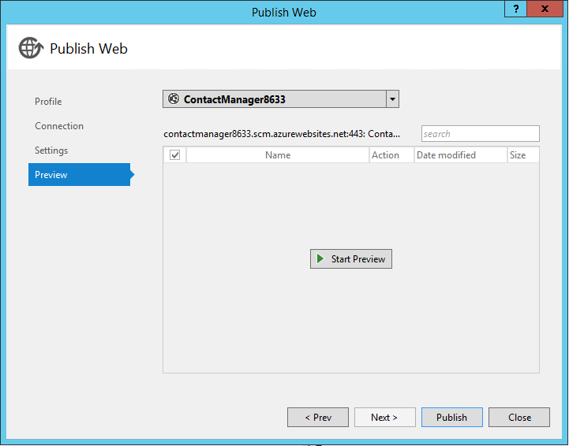

<properties 
    pageTitle="Création d’un service reste à l’aide d’API Web ASP.NET et base de données SQL Azure Application Service" 
    description="Didacticiel qui vous apprend à déployer une application qui utilise l’API Web ASP.NET pour une application web Azure à l’aide de Visual Studio." 
    services="app-service\web" 
    documentationCenter=".net" 
    authors="Rick-Anderson" 
    writer="Rick-Anderson" 
    manager="wpickett" 
    editor=""/>

<tags 
    ms.service="app-service-web" 
    ms.workload="web" 
    ms.tgt_pltfrm="na" 
    ms.devlang="dotnet" 
    ms.topic="article" 
    ms.date="02/29/2016" 
    ms.author="riande"/>

# Création d’un service reste à l’aide d’API Web ASP.NET et base de données SQL Azure Application Service

Ce didacticiel montre comment déployer une application web ASP.NET à un [Service d’application Azure](http://go.microsoft.com/fwlink/?LinkId=529714) à l’aide de l’Assistant Publier le site Web dans Visual Studio 2013 ou Visual Studio 2013 Community Edition. 

Vous pouvez ouvrir un compte Azure gratuitement, et si vous n’avez pas Visual Studio 2013, le Kit de développement installe automatiquement Visual Studio 2013 Web Express. Vous pouvez donc commencer à développer pour Azure entièrement pour libre.

Ce didacticiel suppose que vous n’avez aucune expérience antérieure à l’aide d’Azure. Dans la zone fin ce didacticiel, vous avez une application web simple vers le haut et en cours d’exécution dans le cloud.
 
Vous allez découvrir :

* Comment permettre à votre ordinateur pour le développement d’Azure en installant le Kit de développement Azure.
* Découvrez comment créer un projet Visual Studio ASP.NET MVC 5 et publiez-le sur une application Azure.
* Comment utiliser l’API Web ASP.NET pour activer les appels API Restful.
* Comment utiliser une base de données SQL pour stocker les données dans Azure.
* Découvrez comment publier des mises à jour de l’application dans Azure.

Vous allez créer une application web simple liste de contacts est basée sur ASP.NET MVC 5 et utilise l’infrastructure d’entité ADO.NET pour l’accès de base de données. L’illustration suivante montre l’application terminée :

![capture d’écran du site web][intro001]

<!-- the next line produces the "Set up the development environment" section as see at http://azure.microsoft.com/documentation/articles/web-sites-dotnet-get-started/ -->
[AZURE.INCLUDE [create-account-and-websites-note](../../includes/create-account-and-websites-note.md)]

### Créer le projet

1. Démarrez Visual Studio 2013.
1. Dans le menu **fichier** , cliquez sur **Nouveau projet**.
3. Dans la boîte de dialogue **Nouveau projet** , développez **Visual c#** et sélectionnez **site Web** , puis sélectionnez **Application Web ASP.NET**. Nom de l’application **ContactManager** et cliquez sur **OK**.

    

1. Dans la boîte de dialogue **Nouveau projet ASP.NET** , sélectionnez le modèle **MVC** , vérifiez **L’API Web** , puis sur **Modifier l’authentification**.

1. Dans la boîte de dialogue **Modifier l’authentification** , cliquez sur **Aucune authentification**, puis cliquez sur **OK**.

    

    L’exemple d’application que vous créez pas les fonctionnalités qui nécessitent aux utilisateurs de se connecter. Pour plus d’informations sur la façon d’implémenter des fonctionnalités d’authentification et d’autorisation, voir la section [Étapes suivantes](#nextsteps) à la fin de ce didacticiel. 

1. Dans la boîte de dialogue **Nouveau projet ASP.NET** , assurez-vous que l' **hôte dans le nuage** est cochée, puis cliquez sur **OK**.

Si vous n’avez pas déjà connecté à Azure, vous devrez se connecter.

1. L’Assistant configuration vous propose un nom unique basé sur *ContactManager* (voir l’image ci-dessous). Sélectionnez une région proche de vous. Vous pouvez utiliser [azurespeed.com](http://www.azurespeed.com/ "AzureSpeed.com") pour accéder au centre de données de latence les plus faibles. 
2. Si vous n’avez pas créé un serveur de base de données avant, sélectionnez **créer un nouveau serveur**, entrez un nom d’utilisateur de base de données et le mot de passe.

    

Si vous avez un serveur de base de données, utiliser ce pour créer une nouvelle base de données. Les serveurs de base de données sont une ressource essentielle, et que vous voulez généralement créer plusieurs bases de données du même serveur test et développement au lieu de créer un serveur de base de données par base de données. Assurez-vous que votre site web et la base de données sont dans la même région.

### Définir l’en-tête de page et le pied de page

1. Dans l' **Explorateur de solutions**, développez le dossier *Views\Shared* et ouvrez le fichier *_Layout.cshtml* .

    ![_Layout.cshtml dans l’Explorateur de solutions][newapp004]

1. Remplacez le contenu du fichier *Views\Shared_Layout.cshtml* par le code suivant :

        <!DOCTYPE html>
        <html lang="en">
        <head>
            <meta charset="utf-8" />
            <title>@ViewBag.Title - Contact Manager</title>
            <link href="~/favicon.ico" rel="shortcut icon" type="image/x-icon" />
            <meta name="viewport" content="width=device-width" />
            @Styles.Render("~/Content/css")
            @Scripts.Render("~/bundles/modernizr")
        </head>
        <body>
            <header>
                

                    

                        
@Html.ActionLink("Contact Manager", "Index", "Home")

                    

                

            </header>
            

                @RenderSection("featured", required: false)
                <section class="content-wrapper main-content clear-fix">
                    @RenderBody()
                </section>
            

            <footer>
                

                    

                        
&copy; @DateTime.Now.Year - Contact Manager

                    

                

            </footer>
            @Scripts.Render("~/bundles/jquery")
            @RenderSection("scripts", required: false)
        </body>
        </html>
            
Le balisage au-dessus modifie le nom de l’application à partir de « Mon application ASP.NET » à « Gestionnaire de contacts », et il supprime les liaisons vers **accueil**, **sur** et de **Contact**.

### Exécutez l’application localement

1. Appuyez sur CTRL + F5 pour exécuter l’application.
La page d’accueil application apparaît dans le navigateur par défaut.
    

C’est tout ce que vous devez faire pour le moment créer l’application que vous allez déployer sur Azure. Plus tard, vous souhaitez ajouter des fonctionnalités de base de données.

## Déploiement de l’application vers Azure

1. Dans Visual Studio, cliquez sur le projet dans **L’Explorateur** et sélectionnez **Publier** dans le menu contextuel.

    ![Publier dans le menu contextuel du projet][PublishVSSolution]

    L’Assistant **Publier le site Web** s’ouvre.

12. Cliquez sur **Publier**.

Visual Studio lance le processus de copie des fichiers sur le serveur Azure. La fenêtre de **sortie** affiche les actions de déploiement exécutées et indique réussite du déploiement.

14. Le navigateur par défaut s’ouvre automatiquement à l’URL du site déployé.

    L’application que vous avez créé est actif dans le cloud.
    
    ![Page d’accueil liste des tâches en cours d’exécution dans Azure][rxz2]

## Ajouter une base de données à l’application

Ensuite, vous devez mettre à jour l’application MVC pour ajouter la fonctionnalité permettant d’afficher et mettre à jour les contacts et stocker les données dans une base de données. L’application utilise l’infrastructure d’entité pour créer la base de données et de lire et de mettre à jour les données dans la base de données.

### Ajouter des classes de modèle de données pour les contacts

Vous commencez par créer un modèle de données simple dans le code.

1. Dans l' **Explorateur de solutions**, cliquez sur le dossier Modèles, cliquez sur **Ajouter**, puis **classe**.

    ![Ajouter une classe dans le menu contextuel du dossier Modèles][adddb001]

2. Dans la boîte de dialogue **Ajouter un nouvel élément** , nommez le nouveau fichier de classe *Contact.cs*, puis cliquez sur **Ajouter**.

    ![Ajouter la boîte de dialogue Nouvel élément][adddb002]

3. Remplacez le contenu du fichier Contacts.cs par le code suivant.

        using System.Globalization;
        namespace ContactManager.Models
        {
            public class Contact
            {
                public int ContactId { get; set; }
                public string Name { get; set; }
                public string Address { get; set; }
                public string City { get; set; }
                public string State { get; set; }
                public string Zip { get; set; }
                public string Email { get; set; }
                public string Twitter { get; set; }
                public string Self
                {
                    get { return string.Format(CultureInfo.CurrentCulture,
                         "api/contacts/{0}", this.ContactId); }
                    set { }
                }
            }
        }

La classe **contacter** définit les données que vous souhaitez stocker pour chaque contact, ainsi qu’une clé primaire, soumettez le formulaire, qui est requis par la base de données. Vous pouvez obtenir plus d’informations sur les modèles de données dans la section [Étapes suivantes](#nextsteps) à la fin de ce didacticiel.

### Créer des pages web qui permettent aux utilisateurs d’application pour l’utiliser avec les contacts

La fonctionnalité de la structure du MVC ASP.NET peut générer automatiquement du code qui effectue créer, lire, mettre à jour et supprimer des actions (CRUD).

## Ajouter un contrôleur et une vue pour les données

1. Dans l' **Explorateur de solutions**, développez le dossier Controllers.

3. Générez le projet **(Ctrl + Maj + B)**. (Vous devez générer le projet avant d’utiliser la structure fonctionnalité). 

4. Cliquez sur le dossier contrôleurs et cliquez sur **Ajouter**, puis cliquez sur **contrôleur**.

    ![Ajouter contrôleur dans le menu contextuel du dossier contrôleurs][addcode001]

1. Dans la boîte de dialogue **Ajouter une structure** , sélectionnez **Contrôleur MVC avec les affichages, à l’aide de Framework entité** , puis cliquez sur **Ajouter**.

 

6. Définissez le nom du contrôleur sur **HomeController**. Sélectionnez le **Contact** en tant que votre classe de modèle. Cliquez sur le bouton **nouveau contexte de données** , puis acceptez la valeur par défaut « ContactManager.Models.ContactManagerContext » pour le **nouveau type de contexte de données**. Cliquez sur **Ajouter**.

    Une boîte de dialogue vous demandera : « un fichier avec le nom HomeController existe déjà. Vous souhaitez remplacer ? ». Cliquez sur **Oui**. Nous sommes en écrasant le contrôleur Home qui a été créé avec le nouveau projet. Nous allons utiliser le nouveau contrôleur famille de notre liste de contacts.

    Visual Studio crée des méthodes de contrôleur et des affichages pour les opérations de base de données pour les objets de **Contact** .

## Activer les Migrations, créer la base de données, ajouter des exemples de données et un initialiseur de données ##

La tâche suivante consiste à activer la fonctionnalité de [Code première Migrations](http://curah.microsoft.com/55220) afin de créer la base de données basé sur le modèle de données que vous avez créé.

1. Dans le menu **Outils** , sélectionnez **Gestionnaire de Package de bibliothèque** , puis sur **Gestionnaire de Package Console**.

    ![Console du Gestionnaire de package dans le menu Outils][addcode008]

2. Dans la fenêtre **Gestionnaire de Package Console** , entrez la commande suivante :

        enable-migrations 
  
    La commande **enable-migrations** crée un dossier *Migrations* et place dans ce dossier un fichier *Configuration.cs* que vous pouvez modifier pour configurer les Migrations. 

2. Dans la fenêtre **Gestionnaire de Package Console** , entrez la commande suivante :

        add-migration Initial

    La commande **initiale de migration ajouter** génère une classe nommée ** &lt;date_stamp&gt;Initial** qui crée la base de données. Le premier paramètre ( *Initial* ) est arbitraire et utilisée pour créer le nom du fichier. Vous pouvez voir les nouveaux fichiers de classe dans **L’Explorateur de solutions**.

    Dans la classe **initiale** , la méthode **la** crée la table Contacts et supprime la méthode **vers le bas** (utilisée lorsque vous souhaitez revenir à l’état précédent).

3. Ouvrez le fichier *Migrations\Configuration.cs* . 

4. Ajouter des espaces de noms suivants. 

         using ContactManager.Models;

5. Remplacez la méthode de *valeur de départ* par le code suivant :
        
        protected override void Seed(ContactManager.Models.ContactManagerContext context)
        {
            context.Contacts.AddOrUpdate(p => p.Name,
               new Contact
               {
                   Name = "Debra Garcia",
                   Address = "1234 Main St",
                   City = "Redmond",
                   State = "WA",
                   Zip = "10999",
                   Email = "debra@example.com",
                   Twitter = "debra_example"
               },
                new Contact
                {
                    Name = "Thorsten Weinrich",
                    Address = "5678 1st Ave W",
                    City = "Redmond",
                    State = "WA",
                    Zip = "10999",
                    Email = "thorsten@example.com",
                    Twitter = "thorsten_example"
                },
                new Contact
                {
                    Name = "Yuhong Li",
                    Address = "9012 State st",
                    City = "Redmond",
                    State = "WA",
                    Zip = "10999",
                    Email = "yuhong@example.com",
                    Twitter = "yuhong_example"
                },
                new Contact
                {
                    Name = "Jon Orton",
                    Address = "3456 Maple St",
                    City = "Redmond",
                    State = "WA",
                    Zip = "10999",
                    Email = "jon@example.com",
                    Twitter = "jon_example"
                },
                new Contact
                {
                    Name = "Diliana Alexieva-Bosseva",
                    Address = "7890 2nd Ave E",
                    City = "Redmond",
                    State = "WA",
                    Zip = "10999",
                    Email = "diliana@example.com",
                    Twitter = "diliana_example"
                }
                );
        }

    Ce code ci-dessus effectuera l’initialisation de la base de données avec les informations de contact. Pour plus d’informations sur l’amorçage de la base de données, voir [bases de données de débogage entité Framework (FE)](http://blogs.msdn.com/b/rickandy/archive/2013/02/12/seeding-and-debugging-entity-framework-ef-dbs.aspx).

1. Dans le **Gestionnaire de Package Console** Entrez la commande :

        update-database

    ![Commandes de la Console du Gestionnaire de package][addcode009]

    La **base de données mise à jour** s’exécute la première migration qui crée la base de données. Par défaut, la base de données est créé comme une base de données SQL Server Express LocalDB.

1. Appuyez sur CTRL + F5 pour exécuter l’application. 

L’application affiche des données de la valeur de départ et fournit des liens détails, modifier et supprimer.

![Vue MVC des données][rxz3]

## Modifier l’affichage

1. Ouvrez le fichier *Views\Home\Index.cshtml* . Dans l’étape suivante, nous remplacera le balisage généré par code utilisant [jQuery](http://jquery.com/) et [Knockout.js](http://knockoutjs.com/). Ce nouveau code récupère la liste des contacts à partir de l’aide de l’API web et JSON et lie ensuite les données de contact à l’interface utilisateur à l’aide de knockout.js. Pour plus d’informations, consultez la section [Étapes suivantes](#nextsteps) à la fin de ce didacticiel. 

2. Remplacez le contenu du fichier par le code suivant.

        @model IEnumerable<ContactManager.Models.Contact>
        @{
            ViewBag.Title = "Home";
        }
        @section Scripts {
            @Scripts.Render("~/bundles/knockout")
            
        }
        <ul id="contacts" data-bind="foreach: contacts">
            <li class="ui-widget-content ui-corner-all">
                <h1 data-bind="text: Name" class="ui-widget-header"></h1>
                

                

                    ,
                    
                    
                

                

                
Email?

                

                
Twitter?

                
<a data-bind="attr: { href: Self }, click: $root.removeContact" class="removeContact ui-state-default ui-corner-all">Remove</a>

            </li>
        </ul>
        <form id="addContact" data-bind="submit: addContact">
            <fieldset>
                <legend>Add New Contact</legend>
                <ol>
                    <li>
                        <label for="Name">Name</label>
                        <input type="text" name="Name" />
                    </li>
                    <li>
                        <label for="Address">Address</label>
                        <input type="text" name="Address" >
                    </li>
                    <li>
                        <label for="City">City</label>
                        <input type="text" name="City" />
                    </li>
                    <li>
                        <label for="State">State</label>
                        <input type="text" name="State" />
                    </li>
                    <li>
                        <label for="Zip">Zip</label>
                        <input type="text" name="Zip" />
                    </li>
                    <li>
                        <label for="Email">E-mail</label>
                        <input type="text" name="Email" />
                    </li>
                    <li>
                        <label for="Twitter">Twitter</label>
                        <input type="text" name="Twitter" />
                    </li>
                </ol>
                <input type="submit" value="Add" />
            </fieldset>
        </form>

3. Cliquez sur le dossier contenu et cliquez sur **Ajouter**, puis cliquez sur **Nouvel élément**.

    ![Ajouter la feuille de style dans le menu contextuel du dossier contenu][addcode005]

4. Dans la boîte de dialogue **Ajouter un nouvel élément** , entrez **Style** dans la zone de recherche coin supérieur, puis sélectionnez **La feuille de Style**.
    ![Ajouter la boîte de dialogue Nouvel élément][rxStyle]

5. Nommez le fichier *Contacts.css* et cliquez sur **Ajouter**. Remplacez le contenu du fichier par le code suivant.
    
        .column {
            float: left;
            width: 50%;
            padding: 0;
            margin: 5px 0;
        }
        form ol {
            list-style-type: none;
            padding: 0;
            margin: 0;
        }
        form li {
            padding: 1px;
            margin: 3px;
        }
        form input[type="text"] {
            width: 100%;
        }
        #addContact {
            width: 300px;
            float: left;
            width:30%;
        }
        #contacts {
            list-style-type: none;
            margin: 0;
            padding: 0;
            float:left;
            width: 70%;
        }
        #contacts li {
            margin: 3px 3px 3px 0;
            padding: 1px;
            float: left;
            width: 300px;
            text-align: center;
            background-image: none;
            background-color: #F5F5F5;
        }
        #contacts li h1
        {
            padding: 0;
            margin: 0;
            background-image: none;
            background-color: Orange;
            color: White;
            font-family: Trebuchet MS, Tahoma, Verdana, Arial, sans-serif;
        }
        .removeContact, .viewImage
        {
            padding: 3px;
            text-decoration: none;
        }

    Nous allons utiliser cette feuille de style pour la mise en page, les couleurs et les styles utilisés dans l’application Gestionnaire de contacts professionnels.

6. Ouvrez le fichier *App_Start\BundleConfig.cs* .

7. Ajoutez le code suivant pour inscrire le plug-in [masquage](http://knockoutjs.com/index.html "KO") .

        bundles.Add(new ScriptBundle("~/bundles/knockout").Include(
                    "~/Scripts/knockout-{version}.js"));
    Cet exemple à l’aide de masquage pour simplifier le code JavaScript dynamique qui gère les modèles de l’écran.

8. Modifiez l’entrée de contenu/css pour enregistrer la feuille de style *contacts.css* . Modifiez la ligne suivante :

                 bundles.Add(new StyleBundle("~/Content/css").Include(
                   "~/Content/bootstrap.css",
                   "~/Content/site.css"));
À :

        bundles.Add(new StyleBundle("~/Content/css").Include(
                   "~/Content/bootstrap.css",
                   "~/Content/contacts.css",
                   "~/Content/site.css"));

1. Dans la Console Gestionnaire de Package, exécutez la commande suivante pour installer le masquage.

        Install-Package knockoutjs

## Ajouter un contrôleur de l’interface Web API Restful

1. Dans l' **Explorateur de solutions**, avec le bouton droit contrôleurs et cliquez sur **Ajouter** , puis sur **contrôleur...** 

1. Dans la boîte de dialogue **Ajouter une structure** entrez **Contrôleur de 2 API Web avec actions, à l’aide de Framework entité** , puis sur **Ajouter**.

    

4. Dans la boîte de dialogue **Ajouter un contrôleur** , entrez « ContactsController » comme nom de contrôleur. Sélectionnez « Contact (ContactManager.Models) » pour la **classe de modèle**.  Conservez la valeur par défaut pour la **classe de contexte de données**. 

6. Cliquez sur **Ajouter**.

### Exécutez l’application localement

1. Appuyez sur CTRL + F5 pour exécuter l’application.

    ![Page d’index][intro001]

2. Entrez un contact, puis cliquez sur **Ajouter**. L’application retourne à la page d’accueil et affiche le contact que vous avez entré.

    ![Page d’index des éléments de la liste des tâches][addwebapi004]

3. Dans le navigateur, ajoutez **/api/contacts** à l’URL.

    L’URL résultante ressemblera à l’api/http://localhost:1234/contacts. Le web RESTful API que vous avez ajouté renvoie les contacts stockées. Firefox et Chrome affiche les données au format XML.

    ![Page d’index des éléments de la liste des tâches][rxFFchrome]
    

    Internet Explorer vous invite à ouvrir ou enregistrer les contacts.

    ![Boîte de dialogue Enregistrer API Web][addwebapi006]
    
    
    Vous pouvez ouvrir les contacts retournés dans le bloc-notes ou dans un navigateur.
    
    Ce résultat peut être consommé par une autre application comme page web mobile ou d’une application.

    ![Boîte de dialogue Enregistrer API Web][addwebapi007]

    **Avertissement de sécurité**: À ce stade, votre application est sécurisée et objet d’attaque CSRF. Plus loin dans le didacticiel nous allez supprimer celle-ci. Pour plus d’informations, voir [attaques empêchant intersites demander falsification (CSRF)][prevent-csrf-attacks].
## Ajouter une Protection XSRF

Attaque par rapport aux applications de site web hébergé par laquelle un site Web malveillant peut influencer l’interaction entre un navigateur client et un site Web approuvé par ce navigateur est falsification demande intersites (également appelé XSRF ou CSRF). Ces attaques sont rendus possibles, car les navigateurs web vous envoie des jetons d’authentification automatiquement avec toutes les requêtes à un site Web. L’exemple canonique est des cookies d’authentification, telles que ASP. Tickets de l’authentification par formulaire de NET. Toutefois, les sites Web qui utilisent tout mécanisme d’authentification permanente (par exemple, l’authentification Windows, Basic et ainsi de suite) peuvent être ciblées par ces attaques.

Attaque XSRF se distingue une attaque par phishing. Les attaques de phishing nécessitent l’intervention de victime. Dans une attaque par phishing, un site Web malveillant sera simuler le site Web cible, puis la victime est croyez fournissant des informations sensibles à l’utilisateur malveillant. Dans une attaque XSRF, aucune interaction n’est souvent nécessaire de victime. Au lieu de cela, le pirate repose sur le navigateur envoyer automatiquement tous les cookies pertinents pour le site Web de destination.

Pour plus d’informations, voir le [Projet de sécurité Application Web ouvert](https://www.owasp.org/index.php/Main_Page) (OWASP avoir) [XSRF](https://www.owasp.org/index.php/Cross-Site_Request_Forgery_(CSRF)).

1. Dans l' **Explorateur de solutions**, **ContactManager** projet avec le bouton droit et cliquez sur **Ajouter** , puis sur **cours**.

2. Nommez le fichier *ValidateHttpAntiForgeryTokenAttribute.cs* et ajoutez le code suivant :

        using System;
        using System.Collections.Generic;
        using System.Linq;
        using System.Net;
        using System.Net.Http;
        using System.Web.Helpers;
        using System.Web.Http.Controllers;
        using System.Web.Http.Filters;
        using System.Web.Mvc;
        namespace ContactManager.Filters
        {
            public class ValidateHttpAntiForgeryTokenAttribute : AuthorizationFilterAttribute
            {
                public override void OnAuthorization(HttpActionContext actionContext)
                {
                    HttpRequestMessage request = actionContext.ControllerContext.Request;
                    try
                    {
                        if (IsAjaxRequest(request))
                        {
                            ValidateRequestHeader(request);
                        }
                        else
                        {
                            AntiForgery.Validate();
                        }
                    }
                    catch (HttpAntiForgeryException e)
                    {
                        actionContext.Response = request.CreateErrorResponse(HttpStatusCode.Forbidden, e);
                    }
                }
                private bool IsAjaxRequest(HttpRequestMessage request)
                {
                    IEnumerable<string> xRequestedWithHeaders;
                    if (request.Headers.TryGetValues("X-Requested-With", out xRequestedWithHeaders))
                    {
                        string headerValue = xRequestedWithHeaders.FirstOrDefault();
                        if (!String.IsNullOrEmpty(headerValue))
                        {
                            return String.Equals(headerValue, "XMLHttpRequest", StringComparison.OrdinalIgnoreCase);
                        }
                    }
                    return false;
                }
                private void ValidateRequestHeader(HttpRequestMessage request)
                {
                    string cookieToken = String.Empty;
                    string formToken = String.Empty;
                    IEnumerable<string> tokenHeaders;
                    if (request.Headers.TryGetValues("RequestVerificationToken", out tokenHeaders))
                    {
                        string tokenValue = tokenHeaders.FirstOrDefault();
                        if (!String.IsNullOrEmpty(tokenValue))
                        {
                            string[] tokens = tokenValue.Split(':');
                            if (tokens.Length == 2)
                            {
                                cookieToken = tokens[0].Trim();
                                formToken = tokens[1].Trim();
                            }
                        }
                    }
                    AntiForgery.Validate(cookieToken, formToken);
                }
            }
        }

1. Ajoutez l’instruction suivante *à l’aide* sur le contrôleur de contrats pour avoir accès à l’attribut **[ValidateHttpAntiForgeryToken]** .

        using ContactManager.Filters;

1. Ajoutez l’attribut **[ValidateHttpAntiForgeryToken]** pour les méthodes de publication de **ContactsController** à protéger contre les XSRF. Vous allez l’ajouter aux « PutContact », « PostContact » et **DeleteContact** les méthodes d’action.

        [ValidateHttpAntiForgeryToken]
            public IHttpActionResult PutContact(int id, Contact contact)
            {

1. Mettre à jour de la section *Scripts* du fichier *Views\Home\Index.cshtml* d’inclure le code pour obtenir les jetons XSRF.

         @section Scripts {
            @Scripts.Render("~/bundles/knockout")
            
         }

## Publier la mise à jour de l’application et base de données SQL Azure

Pour publier l’application, vous répétez la procédure que vous avez suivi de version antérieure.

1. Dans l' **Explorateur de solutions**, cliquez avec le bouton droit sur le projet et sélectionnez **Publier**.

    ![Publier][rxP]

5. Cliquez sur l’onglet **paramètres** .
    

1. Sous **ContactsManagerContext(ContactsManagerContext)**, cliquez sur l’icône **v** pour modifier la *chaîne de connexion à distance* à la chaîne de connexion pour la base de données contact. Cliquez sur **ContactDB**.

    

7. Cochez la case pour **Exécuter Code première Migrations (s’exécute sur le démarrage de l’application)**.

1. Cliquez sur **suivant** , puis sur **Aperçu**. Visual Studio affiche une liste des fichiers qui doit être ajouté ou mis à jour.

8. Cliquez sur **Publier**.
Une fois que le déploiement est terminé, le navigateur s’ouvre à la page d’accueil de l’application.

    ![Page d’index avec aucun des contacts][intro001]

    Visual Studio publier processus automatiquement configuré la chaîne de connexion dans le fichier *Web.config* déployé pointent vers la base de données SQL. Il également configuré Migrations première Code pour mettre automatiquement à jour la base de données vers la dernière version la première fois que l’application accède à la base de données après le déploiement.

    Avec cette configuration, Code First créé la base de données en exécutant le code dans la classe **initiale** que vous avez créé précédemment. Ce, il a la première fois que l’application a essayé d’accéder à la base de données après le déploiement.

9. Entrez un contact comme vous le faisiez lorsque vous avez exécuté l’application localement, pour vérifier que le déploiement de base de données a réussi.

Lorsque vous constatez que l’élément que vous entrez est enregistré et s’affiche dans la page Gestionnaire de contacts professionnels, vous savez qu’il a été stocké dans la base de données.

![Page d’index des contacts][addwebapi004]

L’application est actif dans le cloud, à l’aide de la base de données SQL pour stocker ses données. Une fois que vous avez terminé de test de l’application dans Azure, supprimez-le. L’application est publique et n’a pas un mécanisme pour limiter l’accès.

>[AZURE.NOTE] Si vous voulez commencer à utiliser le Service d’application Azure avant de vous inscrire pour un compte Azure, accédez à [Essayer le Service application](http://go.microsoft.com/fwlink/?LinkId=523751), où vous pouvez créer une application web starter courte immédiatement dans le Service d’application. Aucune carte de crédit obligatoire ; Aucune engagements.

## Étapes suivantes

Une application réelle nécessaire de verser authentification et autorisation, et vous utiliseriez la base de données de l’appartenance à cet effet. Le didacticiel [déployer une application Secure ASP.NET MVC avec OAuth, l’appartenance et base de données SQL](web-sites-dotnet-deploy-aspnet-mvc-app-membership-oauth-sql-database.md) est basé sur ce didacticiel et montre comment déployer une application web avec la base de données d’appartenance.

Autre procédure pour stocker les données dans une application Azure consiste à utiliser stockage Azure, qui fournissent le stockage des données non relationnelles sous la forme d’objets BLOB et des tables. Les liens suivants fournissent des informations sur l’API Web ASP.NET MVC et fenêtre Azure.
 

* [Prise en main Framework entité à l’aide de MVC][EFCodeFirstMVCTutorial]
* [Introduction à ASP.NET MVC 5](http://www.asp.net/mvc/tutorials/mvc-5/introduction/getting-started)
* [Votre première API Web ASP.NET](http://www.asp.net/web-api/overview/getting-started-with-aspnet-web-api/tutorial-your-first-web-api)
* [Débogage WAWS](web-sites-dotnet-troubleshoot-visual-studio.md)

Ce didacticiel et l’application exemple a été rédigé par [Anderson RTF](http://blogs.msdn.com/b/rickandy/) (Twitter [@RickAndMSFT](https://twitter.com/RickAndMSFT)) avec l’aide des Tom Dykstra et Barry Dorrans (Twitter [@blowdart](https://twitter.com/blowdart)). 

Veuillez laisser une évaluation sur ce que vous avez aimé ou que vous voulez voir améliorée, pas seulement sur le didacticiel lui-même, mais également sur les produits il montre. Vos commentaires nous aider à hiérarchiser les améliorations. Nous sommes particulièrement intéressés par découvrir combien intérêt est enregistrée dans Automatisation accrue pour le processus de configuration et déploiement de la base de données d’appartenance. 

## Ce qui a changé
* Pour un guide à la modification de sites Web Application Service voir : [Azure Application Service et son Impact sur les Services Azure existants](http://go.microsoft.com/fwlink/?LinkId=529714)

<!-- bookmarks -->
[Add an OAuth Provider]: #addOauth
[Add Roles to the Membership Database]:#mbrDB
[Create a Data Deployment Script]:#ppd
[Update the Membership Database]:#ppd2
[setupdbenv]: #bkmk_setupdevenv
[setupwindowsazureenv]: #bkmk_setupwindowsazure
[createapplication]: #bkmk_createmvc4app
[deployapp1]: #bkmk_deploytowindowsazure1
[adddb]: #bkmk_addadatabase
[addcontroller]: #bkmk_addcontroller
[addwebapi]: #bkmk_addwebapi
[deploy2]: #bkmk_deploydatabaseupdate

<!-- links -->
[EFCodeFirstMVCTutorial]: http://www.asp.net/mvc/tutorials/getting-started-with-ef-using-mvc/creating-an-entity-framework-data-model-for-an-asp-net-mvc-application
[dbcontext-link]: http://msdn.microsoft.com/library/system.data.entity.dbcontext(v=VS.103).aspx

<!-- images-->
[rxE]: ./media/web-sites-dotnet-rest-service-aspnet-api-sql-database/rxE.png
[rxP]: ./media/web-sites-dotnet-rest-service-aspnet-api-sql-database/rxP.png
[rx22]: ./media/web-sites-dotnet-rest-service-aspnet-api-sql-database/
[rxb2]: ./media/web-sites-dotnet-rest-service-aspnet-api-sql-database/rxb2.png
[rxz]: ./media/web-sites-dotnet-rest-service-aspnet-api-sql-database/rxz.png
[rxzz]: ./media/web-sites-dotnet-rest-service-aspnet-api-sql-database/rxzz.png
[rxz2]: ./media/web-sites-dotnet-rest-service-aspnet-api-sql-database/rxz2.png
[rxz3]: ./media/web-sites-dotnet-rest-service-aspnet-api-sql-database/rxz3.png
[rxStyle]: ./media/web-sites-dotnet-rest-service-aspnet-api-sql-database/rxStyle.png
[rxz4]: ./media/web-sites-dotnet-rest-service-aspnet-api-sql-database/rxz4.png
[rxz44]: ./media/web-sites-dotnet-rest-service-aspnet-api-sql-database/rxz44.png
[rxNewCtx]: ./media/web-sites-dotnet-rest-service-aspnet-api-sql-database/rxNewCtx.png
[rxPrevDB]: ./media/web-sites-dotnet-rest-service-aspnet-api-sql-database/rxPrevDB.png
[rxOverwrite]: ./media/web-sites-dotnet-rest-service-aspnet-api-sql-database/rxOverwrite.png
[rxPWS]: ./media/web-sites-dotnet-rest-service-aspnet-api-sql-database/rxPWS.png
[rxNewCtx]: ./media/web-sites-dotnet-rest-service-aspnet-api-sql-database/rxNewCtx.png
[rxAddApiController]: ./media/web-sites-dotnet-rest-service-aspnet-api-sql-database/rxAddApiController.png
[rxFFchrome]: ./media/web-sites-dotnet-rest-service-aspnet-api-sql-database/rxFFchrome.png
[intro001]: ./media/web-sites-dotnet-rest-service-aspnet-api-sql-database/dntutmobil-intro-finished-web-app.png
[rxCreateWSwithDB]: ./media/web-sites-dotnet-rest-service-aspnet-api-sql-database/rxCreateWSwithDB.png
[setup007]: ./media/web-sites-dotnet-rest-service-aspnet-api-sql-database/dntutmobile-setup-azure-site-004.png
[setup009]: ../Media/dntutmobile-setup-azure-site-006.png
[newapp002]: ./media/web-sites-dotnet-rest-service-aspnet-api-sql-database/dntutmobile-createapp-002.png
[newapp004]: ./media/web-sites-dotnet-rest-service-aspnet-api-sql-database/dntutmobile-createapp-004.png
[firsdeploy007]: ./media/web-sites-dotnet-rest-service-aspnet-api-sql-database/dntutmobile-deploy1-publish-005.png
[firsdeploy009]: ./media/web-sites-dotnet-rest-service-aspnet-api-sql-database/dntutmobile-deploy1-publish-007.png
[adddb001]: ./media/web-sites-dotnet-rest-service-aspnet-api-sql-database/dntutmobile-adddatabase-001.png
[adddb002]: ./media/web-sites-dotnet-rest-service-aspnet-api-sql-database/dntutmobile-adddatabase-002.png
[addcode001]: ./media/web-sites-dotnet-rest-service-aspnet-api-sql-database/dntutmobile-controller-add-context-menu.png
[addcode002]: ./media/web-sites-dotnet-rest-service-aspnet-api-sql-database/dntutmobile-controller-add-controller-dialog.png
[addcode004]: ./media/web-sites-dotnet-rest-service-aspnet-api-sql-database/dntutmobile-controller-modify-index-context.png
[addcode005]: ./media/web-sites-dotnet-rest-service-aspnet-api-sql-database/dntutmobile-controller-add-contents-context-menu.png
[addcode007]: ./media/web-sites-dotnet-rest-service-aspnet-api-sql-database/dntutmobile-controller-modify-bundleconfig-context.png
[addcode008]: ./media/web-sites-dotnet-rest-service-aspnet-api-sql-database/dntutmobile-migrations-package-manager-menu.png
[addcode009]: ./media/web-sites-dotnet-rest-service-aspnet-api-sql-database/dntutmobile-migrations-package-manager-console.png
[addwebapi004]: ./media/web-sites-dotnet-rest-service-aspnet-api-sql-database/dntutmobile-webapi-added-contact.png
[addwebapi006]: ./media/web-sites-dotnet-rest-service-aspnet-api-sql-database/dntutmobile-webapi-save-returned-contacts.png
[addwebapi007]: ./media/web-sites-dotnet-rest-service-aspnet-api-sql-database/dntutmobile-webapi-contacts-in-notepad.png
[Add XSRF Protection]: #xsrf
[WebPIAzureSdk20NetVS12]: ./media/web-sites-dotnet-rest-service-aspnet-api-sql-database/WebPIAzureSdk20NetVS12.png
[Add XSRF Protection]: #xsrf
[ImportPublishSettings]: ./media/web-sites-dotnet-rest-service-aspnet-api-sql-database/ImportPublishSettings.png
[ImportPublishProfile]: ./media/web-sites-dotnet-rest-service-aspnet-api-sql-database/ImportPublishProfile.png
[PublishVSSolution]: ./media/web-sites-dotnet-rest-service-aspnet-api-sql-database/PublishVSSolution.png
[ValidateConnection]: ./media/web-sites-dotnet-rest-service-aspnet-api-sql-database/ValidateConnection.png
[WebPIAzureSdk20NetVS12]: ./media/web-sites-dotnet-rest-service-aspnet-api-sql-database/WebPIAzureSdk20NetVS12.png
[prevent-csrf-attacks]: http://www.asp.net/web-api/overview/security/preventing-cross-site-request-forgery-(csrf)-attacks
 
