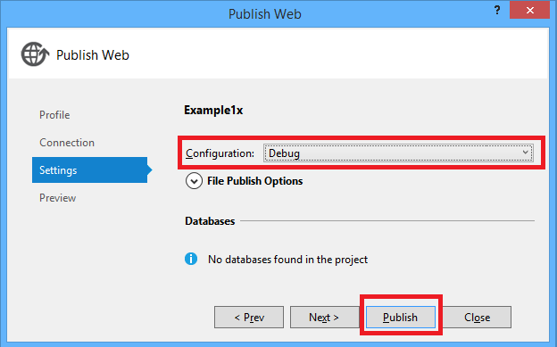
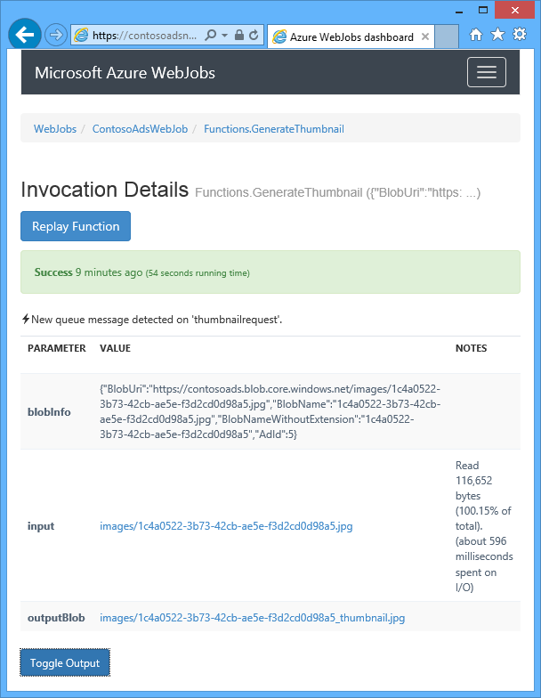
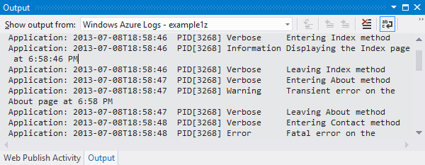
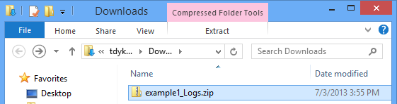
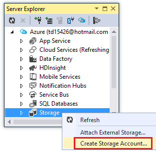
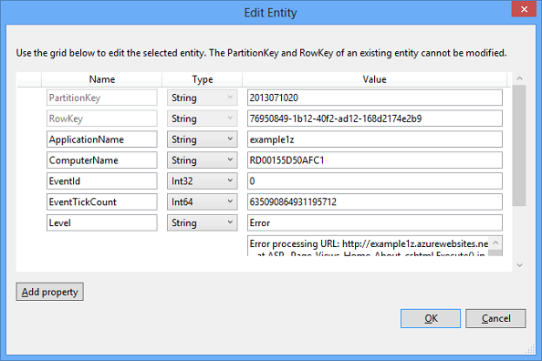

<properties 
    pageTitle="Résoudre les problèmes d’une application web dans le Service d’application Azure à l’aide de Visual Studio" 
    description="Découvrez comment résoudre les problèmes d’une application web Azure à l’aide de débogage distant, suivi et outils de journalisation intégrés Visual Studio 2013." 
    services="app-service" 
    documentationCenter=".net" 
    authors="tdykstra" 
    manager="wpickett" 
    editor=""/>

<tags 
    ms.service="app-service" 
    ms.workload="na" 
    ms.tgt_pltfrm="na" 
    ms.devlang="dotnet" 
    ms.topic="article" 
    ms.date="08/29/2016" 
    ms.author="rachelap"/>

# Résoudre les problèmes d’une application web dans le Service d’application Azure à l’aide de Visual Studio

## Vue d’ensemble

Ce didacticiel montre comment utiliser les outils de Visual Studio qui permettent de déboguer une application web dans le [Service d’application](http://go.microsoft.com/fwlink/?LinkId=529714), en exécutant en [mode débogage](http://www.visualstudio.com/get-started/debug-your-app-vs.aspx) à distance ou en consultant les journaux d’application et les journaux de serveur web.

[AZURE.INCLUDE [app-service-web-to-api-and-mobile](../../includes/app-service-web-to-api-and-mobile.md)]

Vous allez découvrir :

* Les fonctions de gestion de l’application web Azure sont disponibles dans Visual Studio.
* Comment utiliser le mode distant Visual Studio pour apporter des modifications rapides dans une application web à distance.
* Comment faire pour exécuter le mode débogage à distance pendant un projet s’exécute dans Azure, pour une application web et un WebJob.
* Comment créer des journaux de suivi des applications et les afficher lors de l’application de leur création.
* Comment afficher les journaux de serveur web, y compris les messages d’erreur détaillés, a échoué suivi des requêtes.
* Comment envoyer les journaux de diagnostic pour un stockage Azure du compte et il les visualiser.

Si vous avez Visual Studio intégrale, vous pouvez également utiliser [IntelliTrace](http://msdn.microsoft.com/library/vstudio/dd264915.aspx) pour le débogage. IntelliTrace n’est pas traité dans ce didacticiel.

## Conditions préalables

Ce didacticiel fonctionne avec l’environnement de développement, project web et Azure dans le navigateur que vous avez configuré dans [prise en main Azure et ASP.NET][GetStarted]. Pour les sections WebJobs, vous devez avoir l’application que vous créez dans [Prise en main du Kit de développement Azure WebJobs][GetStartedWJ].

Les exemples de code indiqués dans ce didacticiel sont pour une application web MVC c#, mais les procédures de dépannage sont les mêmes pour applications Visual Basic et formulaires Web.

Le didacticiel suppose que vous utilisez Visual Studio 2015 ou 2013. Si vous utilisez Visual Studio 2013, les fonctionnalités WebJobs requièrent [mise à jour 4](http://go.microsoft.com/fwlink/?LinkID=510314) ou version ultérieure. 

Les journaux de diffusion en continu fonctionnalité fonctionne uniquement pour les applications qui ciblent .NET Framework 4 ou version ultérieure.

## Gestion et configuration d’application web

Visual Studio permet d’accéder à un sous-ensemble des fonctions de gestion de l’application web et des paramètres de configuration disponibles dans le [Portail Azure](http://go.microsoft.com/fwlink/?LinkId=529715). Dans cette section, vous verrez ce qui est disponible à l’aide de **L’Explorateur de serveur**. Pour afficher les dernières fonctionnalités d’intégration Azure, essayez les **Cloud Explorer** également. Vous pouvez ouvrir les deux fenêtres dans le menu **affichage** . 

1. Si vous n’êtes pas déjà connecté à Azure dans Visual Studio, cliquez sur le bouton **se connecter à Azure** dans **l’Explorateur de serveur**.

    Une alternative consiste à installer un certificat de gestion qui permet d’accéder à votre compte. Si vous choisissez d’installer un certificat, cliquez sur le nœud **Azure** dans **l’Explorateur de serveur**, puis cliquez sur **gérer et filtrer les abonnements** dans le menu contextuel. Dans la boîte de dialogue **Gérer les abonnements Azure** , cliquez sur l’onglet **certificats** , puis cliquez sur **Importer**. Suivez les instructions pour télécharger, puis les importer un fichier d’abonnement (également appelé un fichier *.publishsettings* ) pour votre compte Azure.

    > [AZURE.NOTE]
    > Si vous téléchargez un fichier d’abonnement, enregistrez-le dans un dossier en dehors de vos répertoires de code source (par exemple, dans le dossier Téléchargements) et supprimez-le une fois l’importation terminée. Un utilisateur malveillant qui accède au fichier abonnement peut modifier, créer et supprimer vos services Azure.

    Pour plus d’informations sur la connexion aux ressources Azure à partir de Visual Studio, voir [Gérer les comptes, les abonnements et les rôles d’administrateur](http://go.microsoft.com/fwlink/?LinkId=324796#BKMK_AccountVCert).

2. Dans l' **Explorateur de serveurs**, développez **Azure** et **Service d’application**.

3. Développer le groupe de ressources qui inclut l’application web que vous avez créé dans [mise en route d’Azure et ASP.NET][GetStarted], puis cliquez sur le nœud de l’application web et cliquez sur **Paramètres d’affichage**.

    

    L’onglet **Azure Web App** s’affiche et vous pouvez voir les tâches d’application web gestion et de configuration qui sont disponibles dans Visual Studio.

    

    Dans ce didacticiel vous allez utiliser la journalisation et le suivi des listes déroulantes. Vous allez également utiliser le débogage distant, mais que vous utiliserez une autre méthode pour l’activer.
   
    Pour plus d’informations sur les zones de paramètres de l’application et des chaînes de connexion dans cette fenêtre, consultez [Azure Web Apps : comment chaînes de l’Application et le travail de chaînes de connexion](http://blogs.msdn.com/b/windowsazure/archive/2013/07/17/windows-azure-web-sites-how-application-strings-and-connection-strings-work.aspx).

    Si vous souhaitez effectuer une tâche de gestion de l’application web qui ne peut pas être effectuée dans cette fenêtre, cliquez sur **Ouvrir dans le portail de gestion** pour ouvrir une fenêtre de navigateur au portail Azure.

## Fichiers d’application web Access dans l’Explorateur de serveurs

En général, vous déployez un projet web avec le `customErrors` indicateur dans le fichier Web.config la valeur `On` ou `RemoteOnly`, ce qui signifie que vous n’obtenez un message d’erreur utiles lorsque quelque chose en cas de problème. Pour de nombreuses erreurs tout ce que vous obtenez est une page comme parmi les options suivantes.

**Erreur du serveur dans l’Application '/' :**

**Une erreur est survenue :**

**Le site Web ne peut pas afficher la page**

Le moyen le plus simple pour trouver la cause de l’erreur est fréquemment pour activer les messages d’erreur détaillés, le premier des captures d’écran précédente explique comment faire. Nécessitant une modification dans le fichier Web.config déployé. Vous pouvez modifier le fichier *Web.config* du projet et redéployez le projet, ou de créer une [transformation Web.config](http://www.asp.net/mvc/tutorials/deployment/visual-studio-web-deployment/web-config-transformations) et déployer une version de débogage, mais il existe un moyen rapide : dans **L’Explorateur de solutions** , vous pouvez directement permet d’afficher et modifier des fichiers dans l’application web à distance en utilisant la fonctionnalité de *vue distante* .

1. Dans l' **Explorateur de serveurs**, développez **Azure**, développez **Application Service**, développer le groupe de ressources où se trouve votre application web, puis développez le nœud pour votre application web.

    Vous consultez nœuds qui vous permettent d’accéder aux fichiers de contenu et les fichiers journaux de l’application web.

2. Développez le nœud de **fichiers** , puis double-cliquez sur le fichier *Web.config* .

    

    Visual Studio ouvre le fichier Web.config de l’application web distant et affiche [distance] en regard du nom de fichier dans la barre de titre.

3. Ajoutez la ligne suivante à la `system.web` élément :

    `<customErrors mode="Off"></customErrors>`

    

4. Actualisez le navigateur qui s’affiche le message d’erreur inutile, et maintenant vous obtenez un message d’erreur détaillé, comme l’exemple suivant :

    

    (Le message d’erreur indiqué a été créé en ajoutant la ligne apparaissent en rouge à *Views\Home\Index.cshtml*).

Modification du fichier Web.config n'est qu’un exemple de scénarios dans lesquels la possibilité de lire et modifier des fichiers sur votre application web Azure faciliter le dépannage.

## Applications web débogage à distance

Si le message d’erreur détaillé ne fournit pas assez d’informations, et vous ne pouvez pas créer à nouveau l’erreur localement, une autre façon de résoudre les problèmes consiste à s’exécuter en mode débogage à distance. Vous pouvez défini point d’arrêt, manipuler directement la quantité de mémoire, parcourez le code et même changer le chemin d’accès de code. 

Le débogage distant ne fonctionne pas dans les éditions Express de Visual Studio.

Cette section explique comment déboguer à distance en utilisant le projet que vous créez dans [mise en route d’Azure et ASP.NET][GetStarted].

1. Ouvrez le projet web que vous avez créé dans [mise en route d’Azure et ASP.NET][GetStarted].

1. Ouvrez *Controllers\HomeController.cs*.

2. Supprimer la `About()` méthode et insérez le code suivant de son emplacement.

        public ActionResult About()
        {
            string currentTime = DateTime.Now.ToLongTimeString();
            ViewBag.Message = "The current time is " + currentTime;
            return View();
        }

2. [Définir un point d’arrêt](http://www.visualstudio.com/get-started/debug-your-app-vs.aspx) sur la `ViewBag.Message` ligne.

1. Dans l' **Explorateur de solutions**, cliquez sur le projet, puis cliquez sur **Publier**.

2. Dans la liste déroulante de **profil** , sélectionnez le même profil que vous avez utilisées dans [mise en route d’Azure et ASP.NET][GetStarted].

3. Cliquez sur l’onglet **paramètres** et modifier la **Configuration** **Déboguer**, puis cliquez sur **Publier**.

    

4. Une fois le déploiement se termine et votre navigateur s’ouvre à l’URL Azure de votre application web, fermez le navigateur.

5. Dans l' **Explorateur de serveurs**, avec le bouton droit de votre application web, puis cliquez sur **Joindre un débogueur**. 

    

    Le navigateur s’ouvre automatiquement à votre page d’accueil en cours d’exécution dans Azure. Vous devrez peut-être attendre 20 secondes ou ainsi qu’Azure configure le serveur pour le débogage. Ce retard se produit uniquement la première fois que vous exécutez en mode débogage sur une application web. Les démarrages suivants dans les 48 heures lorsque vous commencez à déboguer à nouveau il ne sont pas un délai.

    **Remarque :** Si vous avez des problèmes pour démarrer le débogueur, essayez d’effectuer à l’aide de **Cloud Explorer** au lieu de **l’Explorateur de serveurs**.

6. Cliquez sur à **propos** dans le menu.

    Visual Studio s’arrête sur le point d’arrêt, et le code est en cours d’exécution dans Azure, pas sur votre ordinateur local.

7. Pointez sur le `currentTime` variable pour déterminer la valeur d’heure.

    

    Le temps que vous voyez est l’heure du serveur Azure, qui se trouve dans un autre fuseau horaire de votre ordinateur local.

8. Entrez une nouvelle valeur pour le `currentTime` variables, telles que « En cours d’exécution dans Azure ».

5. Appuyez sur F5 pour continuer à s’exécuter.

    La page à propos en cours d’exécution dans Azure affiche la nouvelle valeur que vous avez entrées dans la variable currentTime.

    

## WebJobs débogage à distance

Cette section montre comment déboguer à distance à l’aide de l’application web et le projet que vous créez dans [Prise en main du Kit de développement WebJobs Azure](websites-dotnet-webjobs-sdk.md). 

Les fonctionnalités présentées dans cette section sont disponibles uniquement dans Visual Studio 2013 avec la mise à jour 4 ou version ultérieure. 

Le débogage distant fonctionne uniquement avec WebJobs continue. WebJobs planifiées et à la demande ne prend pas en charge le débogage.

1. Ouvrez le projet web que vous avez créé dans [Prise en main du Kit de développement Azure WebJobs][GetStartedWJ].

1. Dans le projet ContosoAdsWebJob, ouvrez *Functions.cs*.

2. [Définir un point d’arrêt](http://www.visualstudio.com/get-started/debug-your-app-vs.aspx) sur la première instruction dans le `GnerateThumbnail` méthode.

    

1. Dans l' **Explorateur de solutions**, cliquez sur le projet web (et non le projet WebJob), puis cliquez sur **Publier**.

2. Dans la liste déroulante de **profil** , sélectionnez le même profil que vous avez utilisé dans [Prise en main du Kit de développement WebJobs Azure](websites-dotnet-webjobs-sdk.md).

3. Cliquez sur l’onglet **paramètres** et modifier la **Configuration** **Déboguer**, puis cliquez sur **Publier**.

    Visual Studio déploie le web et les projets WebJob et votre navigateur s’ouvre à l’URL Azure de votre application web.

5. Dans **l’Explorateur de serveurs** développez **Azure > Application Service > votre groupe de ressources > votre application web > WebJobs > continu**, puis double-cliquez sur **ContosoAdsWebJob**.

7. Cliquez sur **joindre un débogueur**. 

    

    Le navigateur s’ouvre automatiquement à votre page d’accueil en cours d’exécution dans Azure. Vous devrez peut-être attendre 20 secondes ou ainsi qu’Azure configure le serveur pour le débogage. Ce retard se produit uniquement la première fois que vous exécutez en mode débogage sur une application web. La prochaine fois que vous joignez le débogueur il n’est pas un délai, si vous le faites dans les 48 heures.

6. Dans le navigateur web s’ouvre à la page d’accueil de Contoso annonces, créer une publicité. 

    Création d’une annonce entraîne un message file d’attente doit être créée, qui sera récupérée par la WebJob et traité. Lorsque le SDK WebJobs appelle la fonction pour traiter le message file d’attente, le code atteindrez votre point d’arrêt.

7. Lorsque le débogueur s’arrête à votre point d’arrêt, vous pouvez examiner et modifier les valeurs de variables pendant que le programme s’exécute le cloud. Dans l’illustration suivante le débogueur affiche le contenu de l’objet blobInfo qui a été transmis à la méthode GenerateThumbnail.

    
 
5. Appuyez sur F5 pour continuer à s’exécuter.

    La méthode GenerateThumbnail termine la création de la miniature.

6. Dans le navigateur, actualisez la page d’Index et vous voyez la miniature.

6. Dans Visual Studio, appuyez sur MAJ + F5 pour arrêter le débogage.

7. Dans l' **Explorateur de serveurs**, cliquez sur le nœud ContosoAdsWebJob, puis cliquez sur **Affichage du tableau de bord**.

8. Connectez-vous à l’aide de vos informations d’identification Azure, puis cliquez sur le nom de WebJob pour accéder à la page pour votre WebJob. 

    

    Le tableau de bord indique que la fonction GenerateThumbnail exécutée récemment.

    (La prochaine fois que vous cliquez sur **Afficher le tableau de bord**, vous n’êtes pas obligé de se connecter et le navigateur accède directement à la page pour votre WebJob).

9. Cliquez sur le nom de fonction pour afficher plus d’informations sur l’exécution de la fonction.

    

Si votre fonction [a écrit les journaux](websites-dotnet-webjobs-sdk-storage-queues-how-to.md#logs), vous pouvez également cliquer sur **ToggleOutput** celles.

## Remarques sur le débogage distant

* En cours d’exécution en mode débogage dans production n’est pas recommandé. Si votre application web de production n’est pas répartie à plusieurs instances de serveur, le débogage empêchera le serveur web de répondre aux autres requêtes. Si vous avez plusieurs instances de serveur web, lorsque vous joignez au débogueur vous recevrez une instance aléatoire, et vous n’avez aucun moyen pour vous assurer que les demandes suivantes seront dirigés vers cette instance. En outre, vous ne généralement déployez une version de débogage en production et optimisations pour les versions release peuvent rendre impossible à afficher quoi de neuf ligne par ligne dans votre code source. Pour résoudre les problèmes de production, votre meilleure ressource est application web et suivi des journaux du serveur.

* Éviter les taquets de temps aux points d’arrêt à distance débogage. Azure traite un processus qui est arrêté pendant plus de quelques minutes sous la forme d’un processus ne répond pas, il s’arrête.

* Pendant que vous êtes le débogage, le serveur envoie des données à Visual Studio, qui peuvent affecter des frais de bande passante. Pour plus d’informations sur les taux de bande passante, consultez [Azure tarification](/pricing/calculator/).

* Assurez-vous que la `debug` attribut de la `compilation` élément dans le fichier *Web.config* est défini sur true. Il est défini sur true par défaut lorsque vous publiez une configuration de génération de débogage.

        <system.web>
          <compilation debug="true" targetFramework="4.5" />
          <httpRuntime targetFramework="4.5" />
        </system.web>

* Si vous trouvez que le débogueur ne pas à pas détaillé code que vous souhaitez déboguer, vous devrez peut-être modifier le paramètre uniquement mon Code.  Pour plus d’informations, voir [restreindre pas à pas pour uniquement mon Code](http://msdn.microsoft.com/library/vstudio/y740d9d3.aspx#BKMK_Restrict_stepping_to_Just_My_Code).

* Un minuteur démarre sur le serveur lorsque vous activez la fonctionnalité de débogage à distance, et après 48 heures la fonctionnalité est automatiquement désactivée. Cette limite 48 heures est terminée pour des raisons de sécurité et les performances. Vous pouvez facilement activer la fonctionnalité Revenir autant de fois que vous le souhaitez. Nous vous recommandons de ce qu’il soit désactivé lorsque vous n’êtes pas activement débogage.

* Vous pouvez manuellement attacher le débogueur à tout processus, non seulement le processus application web (w3wp.exe). Pour plus d’informations sur l’utilisation du mode débogage dans Visual Studio, consultez [débogage dans Visual Studio](http://msdn.microsoft.com/library/vstudio/sc65sadd.aspx).

## Vue d’ensemble des journaux de diagnostic

Une application ASP.NET qui s’exécute dans une application web Azure peut créer les types de journaux suivants :

* **Journaux de suivi d’application** 
  L’application crée ces journaux en appelant des méthodes de la classe [System.Diagnostics.Trace](http://msdn.microsoft.com/library/system.diagnostics.trace.aspx) .
* **Journaux de serveur Web** 
  Le serveur web crée une entrée de journal pour chaque requête HTTP à l’application web.
* **Journaux d’erreurs détaillés message** 
  Le serveur web crée une page HTML avec des informations supplémentaires pour les requêtes HTTP échecs (ceux qui génèrent code d’état 400 ou version ultérieure). 
* **Échec de la demande les journaux de suivi** 
  Le serveur web crée un fichier XML avec les informations de suivi détaillées pour les requêtes HTTP a échoué. Le serveur web fournit également un fichier XSL pour mettre en forme le code XML dans un navigateur.
  
Journalisation affecte les performances de l’application web Azure vous donne la possibilité pour activer ou désactiver chaque type de journal selon vos besoins. Pour les journaux d’application, vous pouvez spécifier que seuls les journaux au-dessus d’un certain niveau gravité doivent être signé. Lorsque vous créez une nouvelle application web, par défaut tout enregistrement est désactivé.

Les journaux sont écrits dans les fichiers dans un dossier de *fichiers journaux* dans le système de fichiers de votre application web et sont accessibles via FTP. Journaux de serveur Web et des applications peuvent également être écrites à un compte de stockage Azure. Vous pouvez conserver un plus grand nombre de journaux dans un compte de stockage qu’il n’est pas disponible dans le système de fichiers. Vous êtes limité à un maximum de 100 mégaoctets des journaux lorsque vous utilisez le système de fichiers. (Système de fichiers journaux sont uniquement pour la rétention à court terme. Azure supprime les anciens fichiers journaux pour libérer de l’espace pour les nouveaux après que la limite est atteint.)  

## Créer et afficher les journaux de suivi d’application

Dans cette section, vous devez effectuer les tâches suivantes :

* Ajouter des instructions de traçage au projet web que vous avez créé dans [prise en main Azure et ASP.NET][GetStarted].
* Afficher les journaux lorsque vous exécutez le projet localement.
* Afficher les journaux qu’ils sont générés par l’application en cours d’exécution dans Azure. 

Pour savoir comment créer des applications se connecte WebJobs, consultez [comment travailler avec stockage Azure file d’attente à l’aide de la WebJobs SDK - comment écrire des journaux](websites-dotnet-webjobs-sdk-storage-queues-how-to.md#logs). Les instructions suivantes pour afficher les journaux et contrôler la manière dont elles sont stockées dans Azure s’appliquent également à application journaux créés par WebJobs. 

### Ajouter des instructions de traçage à l’application

1. Ouvrez *Controllers\HomeController.cs*, puis remplacez la `Index`, `About`, et `Contact` méthodes par le code suivant afin d’ajouter `Trace` instructions et une `using` déclaration `System.Diagnostics`:

        public ActionResult Index()
        {
            Trace.WriteLine("Entering Index method");
            ViewBag.Message = "Modify this template to jump-start your ASP.NET MVC application.";
            Trace.TraceInformation("Displaying the Index page at " + DateTime.Now.ToLongTimeString());
            Trace.WriteLine("Leaving Index method");
            return View();
        }
        
        public ActionResult About()
        {
            Trace.WriteLine("Entering About method");
            ViewBag.Message = "Your app description page.";
            Trace.TraceWarning("Transient error on the About page at " + DateTime.Now.ToShortTimeString());
            Trace.WriteLine("Leaving About method");
            return View();
        }
        
        public ActionResult Contact()
        {
            Trace.WriteLine("Entering Contact method");
            ViewBag.Message = "Your contact page.";
            Trace.TraceError("Fatal error on the Contact page at " + DateTime.Now.ToLongTimeString());
            Trace.WriteLine("Leaving Contact method");
            return View();
        }       

2. Ajouter un `using System.Diagnostics;` instruction vers le haut du fichier.
                
### Afficher la sortie de traçage localement

3. Appuyez sur F5 pour exécuter l’application en mode débogage.

    Le récepteur de suivi par défaut écrit toute la sortie trace dans la fenêtre de **sortie** , ainsi que d’autres résultats de débogage. L’illustration suivante montre la sortie dans les instructions trace que vous avez ajouté à la `Index` méthode.

    

    Les étapes suivantes montrent comment afficher le résultat de la trace dans une page web, sans compilation en mode débogage.

2. Ouvrez le fichier Web.config de l’application (celui situé dans le dossier du projet) et ajoutez un `<system.diagnostics>` élément à la fin du fichier juste avant la formule de politesse `</configuration>` élément :

        <system.diagnostics>
            <trace>
              <listeners>
                <add name="WebPageTraceListener"
                    type="System.Web.WebPageTraceListener, 
                    System.Web, 
                    Version=4.0.0.0, 
                    Culture=neutral,
                    PublicKeyToken=b03f5f7f11d50a3a" />
              </listeners>
            </trace>
          </system.diagnostics>

    La `WebPageTraceListener` sortie de traçage vous permet d’afficher en accédant à `/trace.axd`.

3. Ajoutez un <a href="http://msdn.microsoft.com/library/vstudio/6915t83k(v=vs.100).aspx">élément trace</a> sous `<system.web>` dans le fichier Web.config, comme l’exemple suivant :

        <trace enabled="true" writeToDiagnosticsTrace="true" mostRecent="true" pageOutput="false" />

3. Appuyez sur CTRL + F5 pour exécuter l’application.

4. Dans la barre d’adresses de la fenêtre du navigateur, ajouter *trace.axd* à l’URL et appuyez sur entrée (l’URL sera semblable à http://localhost:53370/trace.axd).

5. Dans la page de la **Trace de l’Application** , cliquez sur **Afficher les détails** sur la première ligne (et non la ligne BrowserLink).

    

    La page **Détails de la requête** s’affiche, et dans la section **Informations de suivi des messages** vous voir le résultat dans les instructions trace que vous avez ajouté à la `Index` méthode.

    

    Par défaut, `trace.axd` est uniquement disponible localement. Si vous souhaitez rendre disponibles à partir d’une application web à distance, vous pouvez ajouter `localOnly="false"` à la `trace` élément dans le fichier *Web.config* , comme illustré dans l’exemple suivant :

        <trace enabled="true" writeToDiagnosticsTrace="true" localOnly="false" mostRecent="true" pageOutput="false" />

    Toutefois, l’activation `trace.axd` dans une production dans le navigateur est généralement pas recommandé pour des raisons de sécurité, et dans les sections suivantes, vous verrez un moyen plus facile à lire les journaux de traçage dans une application web Azure.

### Afficher la sortie de traçage dans Azure

1. Dans l' **Explorateur de solutions**, cliquez sur le projet web, puis cliquez sur **Publier**.

2. Dans la boîte de dialogue **Publier le site Web** , cliquez sur **Publier**.

    Une fois que Visual Studio publie votre mise à jour, il ouvre une fenêtre de navigateur à votre page d’accueil (en supposant que vous n’avez pas effacer les **URL de Destination** sous l’onglet **connexion** ).

3. Dans l' **Explorateur de serveurs**, avec le bouton droit de votre application web et sélectionnez **Afficher les journaux de diffusion en continu**. 

    

    La fenêtre de **sortie** indique que vous êtes connecté au service de diffusion en continu de journal et ajoute une ligne notification chaque minute passe sans un journal à afficher.

    

4. Dans la fenêtre de navigateur qui affiche votre page d’accueil application, cliquez sur **Contact**.

    Quelques secondes de la sortie d’erreur au niveau du trace que vous avez ajoutée à la `Contact` méthode s’affiche dans la fenêtre de **sortie** .

    

    Visual Studio s’affiche uniquement au niveau de l’erreur traces parce que c’est le paramètre par défaut lorsque vous activez le journal d’analyse du service. Lorsque vous créez une nouvelle application web Azure, tout enregistrement est désactivée par défaut, comme vous l’avez vu lorsque vous avez ouvert la page Paramètres de version antérieure :

    

    Toutefois, lorsque vous avez sélectionné **Afficher les journaux de diffusion en continu**, Visual Studio automatiquement remplacé **Application Logging(File System)** **erreur**, ce qui signifie que les journaux d’erreur niveau obtenir signalés. Pour afficher tous vos journaux de suivi, vous pouvez modifier ce paramètre sur **commentaires**. Lorsque vous sélectionnez un niveau de gravité inférieur d’erreur, tous les journaux pour les niveaux de gravité supérieurs sont également signalés. Donc lorsque vous sélectionnez commentaires, vous voyez également d’informations, d’avertissement et les journaux d’erreur.  

4. Dans l' **Explorateur de serveurs**, avec le bouton droit de l’application web, puis cliquez sur **Paramètres d’affichage** comme vous le faisiez précédemment.

5. Modifier **L’Application enregistre (File System)** sur **commentaires**, puis cliquez sur **Enregistrer**.
 
    

6. Dans la fenêtre de navigateur qui s’affiche maintenant votre page de **Contact** , cliquez sur **accueil**, puis cliquez sur à **propos**, puis cliquez sur **Contact**.

    Quelques secondes, la fenêtre de **sortie** affiche tous vos sortie de traçage.

    

    Dans cette section, vous avez activé et désactivé journalisation à l’aide de paramètres de l’application web Azure. Vous pouvez également activer et désactiver récepteurs trace en modifiant le fichier Web.config. Toutefois, la modification du fichier Web.config provoque le domaine d’application vers la Corbeille, tandis que l’activation de la journalisation via la configuration d’application web qui ne. Si le problème prend beaucoup de temps à reproduire, ou est intermittent, recyclage le domaine d’application peut « correctif » et vous oblige à patienter jusqu'à ce que ce problème survient à nouveau. Activer les diagnostics dans Azure ne procéder ainsi pour commencer à capturer les informations d’erreur immédiatement.

### Fonctionnalités de la fenêtre Sortie

L’onglet **Journaux Azure** de la fenêtre de **sortie** comporte plusieurs boutons et une zone de texte :

Ces exécutent les fonctions suivantes :

* Désactivez la fenêtre de **sortie** .
* Activer ou désactiver le retour automatique à la.
* Démarrer ou arrêter la surveillance des journaux.
* Spécifier des journaux à surveiller.
* Télécharger les journaux.
* Filtrer les journaux basées sur une chaîne de recherche ou une expression régulière.
* Fermez la fenêtre de **sortie** .

Si vous entrez une chaîne de recherche ou une expression régulière, Visual Studio filtre les informations d’enregistrement au niveau du client. Cela signifie que vous pouvez entrer les critères après que les journaux sont affichés dans la fenêtre de **sortie** , vous pouvez modifier les critères de filtrage sans avoir à régénérer les journaux.

## Afficher les journaux de serveur web

Journaux de serveur Web enregistrent toute l’activité HTTP pour l’application web. Afin de les voir dans la fenêtre de **sortie** , vous devez les activer pour l’application web et indiquer à Visual Studio que vous souhaitez surveiller les. 

1. Dans l’onglet **Configuration de l’application Web Azure** que vous avez ouvert à partir de **l’Explorateur de serveurs**, placez-vous journalisation sur le serveur Web **sur**, puis cliquez sur **Enregistrer**.

    

2. Dans la fenêtre de **sortie** , cliquez sur le bouton **spécifier qui ouvre une session Azure pour surveiller** .
    
    

3. Dans la boîte de dialogue **Options de journalisation Azure** , sélectionnez **journaux de serveur Web**, puis cliquez sur **OK**.

    

4. Dans la fenêtre de navigateur qui affiche l’application web, cliquez sur **accueil**, puis cliquez sur à **propos**, puis cliquez sur **Contact**.

    Les journaux des applications généralement apparaissent en premier, suivis par les journaux de serveur web. Vous devrez peut-être patienter un certain temps pour que les journaux apparaisse. 

    

Par défaut, lorsque vous activez tout d’abord les journaux de serveur web à l’aide de Visual Studio, Azure écrit les journaux dans le système de fichiers. Comme alternative, vous pouvez utiliser le portail Azure spécifier que le serveur web journaux doivent être écrits dans un conteneur blob dans un compte de stockage.

Si vous utilisez le portail pour activer le serveur web journalisation à un compte de stockage Azure et puis désactivez la journalisation dans Visual Studio, lorsque vous réactivez journalisation dans Visual Studio vos paramètres de compte de stockage sont restaurées. 

## Afficher les journaux de message d’erreur détaillé

Journaux d’erreurs détaillés fournissent des informations supplémentaires sur les requêtes HTTP qui génèrent des codes de réponse d’erreur (400 ou version ultérieure). Afin de les voir dans la fenêtre de **sortie** , vous devez les activer pour l’application web et indiquer à Visual Studio que vous souhaitez surveiller les.

1. Dans l’onglet **Configuration de l’application Web Azure** que vous avez ouvert à partir de **l’Explorateur de serveurs**, modifier des **Messages d’erreur détaillés** sur **activé**, puis cliquez sur **Enregistrer**.

    

2. Dans la fenêtre de **sortie** , cliquez sur le bouton **spécifier qui ouvre une session Azure pour surveiller** .

3. Dans la boîte de dialogue **Options de journalisation Azure** , cliquez sur **tous les journaux**, puis cliquez sur **OK**.

    

4. Dans la barre d’adresses de la fenêtre du navigateur, ajoutez un caractère supplémentaire à l’URL à l’origine d’une erreur 404 (par exemple, `http://localhost:53370/Home/Contactx`), puis appuyez sur ENTRÉE.

    Après quelques secondes le journal des erreurs détaillées s’affiche dans la fenêtre Visual Studio **sortie** .

    

    Touche CTRL enfoncée et cliquez sur le lien pour afficher la sortie de journal mis en forme dans un navigateur :

    

## Télécharger les journaux de système de fichiers

Les journaux que vous pouvez surveiller dans la fenêtre de **sortie** peuvent également être téléchargés sous forme de fichier *.zip* . 

1. Dans la fenêtre de **sortie** , cliquez sur **Télécharger les journaux de diffusion en continu**.

    

    Explorateur de fichiers s’ouvre dans votre dossier *téléchargements* avec le fichier téléchargé sélectionné.

    

2. Extraire le fichier *.zip* , et vous voyez la structure de dossiers suivants :

    

    * Journaux de suivi d’application sont dans les fichiers *.txt* dans le dossier *LogFiles\Application* .
    * Journaux de serveur Web sont dans les fichiers *.log* dans le dossier *LogFiles\http\RawLogs* . Vous pouvez utiliser un outil comme [Analyseur de journal](http://www.microsoft.com/download/details.aspx?displaylang=en&id=24659) pour afficher et modifier ces fichiers.
    * Les journaux de message d’erreur détaillées sont dans les fichiers *.html* dans le dossier *LogFiles\DetailedErrors* .

    (Le dossier *déploiements* concerne les fichiers créés par le contrôle de source de publication ; il ne comporte rien qui liés à la publication de Visual Studio. Le dossier *Git* concerne traces liés au contrôle de source de publication et le journal de service de diffusion en continu de fichiers.)  

## Afficher les journaux de stockage

Journaux de suivi d’application peuvent également être envoyés à un compte de stockage Azure, et vous pouvez les afficher dans Visual Studio. Pour faire que vous devez créer un compte de stockage, activez les journaux de stockage dans le portail classique et les afficher dans l’onglet **journaux** de la fenêtre **Azure Web App** .

Vous pouvez envoyer les journaux à tout ou partie des trois destinations :

* Le système de fichiers.
* Tables de compte de stockage.
* Objets BLOB compte de stockage.

Vous pouvez spécifier une gravité différente pour chaque destination. 

Tables permettent d’afficher les détails des journaux en ligne, et ils prennent en charge la diffusion en continu ; Vous pouvez interroger des journaux dans des tableaux et voir les nouveaux journaux lors de leur création. Objets BLOB facilitent pour télécharger les journaux dans les fichiers et les analyser à l’aide de HDInsight, car HDInsight sache comment travailler avec le stockage blob. Pour plus d’informations, voir **Hadoop et MapReduce** dans les [Options de stockage de données (construction réelles Cloud applications Azure)](http://www.asp.net/aspnet/overview/developing-apps-with-windows-azure/building-real-world-cloud-apps-with-windows-azure/data-storage-options).

Vous avez actuellement journaux système de fichiers de définir au niveau de détail ; les étapes suivantes vous guident dans la configuration journaux au niveau des informations pour accéder à des tables de compte de stockage. Niveau d’informations signifie que tous les journaux créés par l’appel `Trace.TraceInformation`, `Trace.TraceWarning`, et `Trace.TraceError` s’affichera, mais pas les journaux créés par l’appel `Trace.WriteLine`.

Comptes de stockage offrent davantage de stockage et de rétention de durée plus longue pour les journaux par rapport au système de fichiers. Un autre avantage d’envoi des journaux de suivi application au stockage fait que vous obtenez des informations supplémentaires avec chaque journal que vous n’obtenez pas de système de fichiers journaux.

5. Avec le bouton droit de **stockage** sous le nœud Azure, puis cliquez sur **Créer un compte de stockage**.

3. Dans la boîte de dialogue **Créer un compte de stockage** , entrez un nom pour le compte de stockage. 

    Le nom doit être doit être unique (aucun autre compte de stockage Azure ne peut avoir le même nom). Si le nom que vous entrez est déjà en cours d’utilisation, vous recevrez une chance de le modifier.

    L’URL pour accéder à votre compte de stockage sera *{nom}*. core.windows.net. 

5. Définir la liste déroulante **région ou un groupe affinité** à la région plus proche de vous.

    Ce paramètre spécifie le centre de données Azure va héberger votre compte de stockage. Pour ce didacticiel votre choix ne faire la différence visible, mais pour une application web production souhaité de votre serveur web et votre compte de stockage d’être présent à la même région pour réduire les frais de sortie de latence et les données. L’application web (que vous allez créer ultérieurement) doit s’exécuter dans une zone aussi près que possible pour les navigateurs accéder à votre application web afin de réduire la latence.

6. Définissez la liste déroulante **réplication** sur **localement redondants**. 

    Lors de la réplication de geo est activée pour un compte de stockage, le contenu stocké est répliqué sur un centre de données secondaire pour permettre le basculement à cet emplacement en cas de sinistre majeur dans l’emplacement principal. Geo réplication peut entraîner des coûts supplémentaires. Pour les comptes de test et de développement, vous ne souhaitez généralement payer pour geo réplication. Pour plus d’informations, voir [créer, gérer, ou supprimer un compte de stockage](../storage-create-storage-account/#replication-options).

5. Cliquez sur **créer**. 

      

1. Dans la fenêtre Visual Studio **Azure Web App** , cliquez sur l’onglet **journaux** , puis cliquez sur **Configurer la journalisation dans le portail de gestion**.

    <!-- todo:screenshot of new portal if the VS page link goes to new portal -->
    

    Sous l’onglet **configurer** s’ouvre dans le portail classique pour votre application web.

2. Dans l’onglet **configurer** du portail classique, faites défiler jusqu'à la section diagnostics application et choisissez **L’Application enregistre (stockage de tables)** **sur**.

3. Modifier le **niveau d’enregistrement** vers des **informations**.

4. Cliquez sur **gérer le stockage de Table**.

    

    Dans la zone **gérer le stockage de table pour les diagnostics de l’application** , vous pouvez choisir votre compte de stockage si vous avez plusieurs. Vous pouvez créer une table ou utiliser une existante.

    

6. Dans la zone **gérer le stockage de table pour les diagnostics de l’application** sur la case à cocher pour fermer la boîte.

6. Dans l’onglet **configurer** du portail classique, cliquez sur **Enregistrer**.

7. Dans la fenêtre de navigateur qui affiche l’application web application, cliquez sur **accueil**, puis cliquez sur à **propos**, puis cliquez sur **Contact**.

    Les informations de journalisation produites en parcourant ces pages web seront écrit sur le compte de stockage.

8. Sous l’onglet **journaux** de la fenêtre **Azure Web App** dans Visual Studio, cliquez sur **Actualiser** sous **Résumé des diagnostics**.

    

    La section **Diagnostics résumé** indique les journaux pour depuis 15 minutes par défaut. Vous pouvez modifier la période pour afficher plus de journaux. 

    (Si vous obtenez une erreur « tableau non trouvé », vérifiez que vous avez recherchés vers les pages qui effectuent le suivi une fois que vous avez activé **L’Application enregistre (stockage)** et une fois que vous avez cliqué sur **Enregistrer**.)

    

    Notez que cette vue affiche **ID de processus** et les **ID de Thread** pour chaque journal, vous n’obtenez pas dans les système de fichiers journaux. Vous pouvez afficher des champs supplémentaires en affichage de la table de stockage Azure directement.

8. Cliquez sur **Afficher tous les journaux d’application**.

    La table de journal de suivi des messages s’affiche dans la visionneuse de table Azure stockage.
   
    (Si vous obtenez une erreur « séquence ne contient pas d’éléments », ouvrez **l’Explorateur de serveurs**, développez le nœud de votre compte de stockage sous le nœud **Azure** , puis avec le bouton droit de **Tables** et cliquez sur **Actualiser**.)

    

    Cet affichage montre des champs supplémentaires que n’apparaît pas dans toutes les autres vues. Cet affichage vous permet également de filtrer les journaux à l’aide de l’interface utilisateur du Concepteur de requête spécial pour construire une requête. Pour plus d’informations, voir Utilisation des ressources de la Table - entités filtrage dans les [Ressources de stockage de navigation avec l’Explorateur de serveur](http://msdn.microsoft.com/library/ff683677.aspx).

7. Pour consulter les détails d’une seule ligne, double-cliquez sur une des lignes.

    

## Afficher les journaux de suivi demande a échoué

Journaux de suivi demande échec sont utiles lorsque vous avez besoin de comprendre les détails de la façon dont IIS gère une demande HTTP, dans les scénarios tels que des problèmes d’authentification ou de la réécriture d’URL. 

Applications web Azure utilisent la fonctionnalité de suivi demande échec même qui a été disponible avec IIS 7.0 et versions ultérieures. Vous n’avez pas accès aux paramètres de IIS configurer les erreurs sont enregistrés, cependant. Lorsque vous activez le suivi des requêtes échec, toutes les erreurs sont capturés. 

Vous pouvez activer le suivi de la demande a échoué à l’aide de Visual Studio, mais vous ne pouvez pas les afficher dans Visual Studio. Ces fichiers journaux est des fichiers XML. Le service de journal de diffusion en continu vérifie uniquement les fichiers qui sont considérés comme lisibles en mode texte brut : fichiers *.txt*, *.html*et *.log* .

Vous pouvez afficher les journaux de suivi demande échec dans un navigateur directement via FTP ou localement après l’utilisation d’un outil FTP pour les télécharger sur votre ordinateur local. Dans cette section vous devez les afficher dans un navigateur directement.

1. Sous l’onglet **Configuration** de la fenêtre **Azure dans le navigateur** que vous avez ouvert à partir de **l’Explorateur de serveurs**, placez-vous **Failed Request Tracing** **sur**, puis cliquez sur **Enregistrer**.

    

4. Dans la barre d’adresses de la fenêtre de navigateur qui affiche l’application web, ajoutez un caractère supplémentaire à l’URL, puis cliquez sur ENTRÉE pour déclencher une erreur 404.

    Ceci provoque un journal de suivi demande échec doit être créé, et les étapes suivantes montrent comment afficher ou télécharger le journal.

2. Dans Visual Studio, sous l’onglet **Configuration** de la fenêtre **Azure Web App** , cliquez sur **Ouvrir dans le portail de gestion**.

3. Dans la carte de **paramètres du** [Portail Azure](https://portal.azure.com) pour votre application web, cliquez sur **informations d’identification de déploiement**, puis entrez un nouveau nom d’utilisateur et mot de passe.

    

    ** Lors de la connexion, vous devez utiliser le nom d’utilisateur complet avec le nom de l’application web précédée. Par exemple, si vous entrez « myid » comme nom d’utilisateur et le site est « myexample », vous connecter en tant que « myexample\myid ».

5. Dans une nouvelle fenêtre de navigateur, accédez à l’URL affichée sous le **nom d’hôte FTP** ou **nom d’hôte FTPS** dans la carte **Web App** pour votre application web. 

6. Connectez-vous en utilisant les informations d’identification FTP que vous avez créé précédemment (y compris le préfixe du nom de l’application web pour le nom d’utilisateur).

    Le navigateur affiche le dossier racine de l’application web.

6. Ouvrez le dossier de *fichiers journaux* .

    

7. Ouvrez le dossier nommé W3SVC ainsi qu’une valeur numérique.

    

    Le dossier contient des fichiers XML pour les erreurs qui ont été enregistrés une fois que vous avez activé le suivi des requêtes échec et un fichier XSL qu’un navigateur peut utiliser pour mettre en forme le code XML.

    

8. Cliquez sur le fichier XML de la requête ayant échoué que vous souhaitez voir les informations de suivi.

    L’illustration suivante montre une partie des informations de traçage pour un exemple d’erreur.

    

## Étapes suivantes

Vous avez vu comment Visual Studio facilite afficher les journaux créés par une application web Azure. Les sections suivantes fournissent des liens vers des ressources supplémentaires sur les rubriques connexes :

* Résolution des problèmes de l’application web Azure
* Débogage dans Visual Studio 
* Le débogage dans Azure distant
* Traçage dans les applications ASP.NET
* Analyser les journaux de serveur web
* L’analyse a échoué les journaux de suivi des requêtes
* Services de Cloud débogage

### Résolution des problèmes de l’application web Azure

Pour plus d’informations sur la résolution des applications web dans le Service d’application Azure, consultez les ressources suivantes :

* [Comment faire pour surveiller des applications web](/manage/services/web-sites/how-to-monitor-websites/)
* [Une solution pertes de mémoire dans les applications Web Azure avec Visual Studio 2013](http://blogs.msdn.com/b/visualstudioalm/archive/2013/12/20/investigating-memory-leaks-in-azure-web-sites-with-visual-studio-2013.aspx). Billet de blog Microsoft ALM sur les fonctionnalités de Visual Studio pour analyser les problèmes de mémoire managée.
* [Outils en ligne d’applications web azure que vous devez savoir sur](/blog/2014/03/28/windows-azure-websites-online-tools-you-should-know-about-2/). Billet de blog par Amit Apple.

Pour obtenir de l’aide une question de résolution des problèmes spécifique, démarrer un thread dans un des forums suivants :

* [Azure le forum sur le site ASP.NET](http://forums.asp.net/1247.aspx/1?Azure+and+ASP+NET).
* [Azure le forum sur MSDN](http://social.msdn.microsoft.com/Forums/windowsazure/).
* [StackOverflow.com](http://www.stackoverflow.com).

### Débogage dans Visual Studio 

Pour plus d’informations sur l’utilisation du mode débogage dans Visual Studio, consultez la rubrique MSDN [débogage dans Visual Studio](http://msdn.microsoft.com/library/vstudio/sc65sadd.aspx) et [Conseils de débogage avec Visual Studio 2010](http://weblogs.asp.net/scottgu/archive/2010/08/18/debugging-tips-with-visual-studio-2010.aspx).

### Le débogage dans Azure distant

Pour plus d’informations sur le débogage distant des applications web Azure WebJobs, consultez les ressources suivantes :

* [Introduction à Remote débogage Azure Application Service Web Apps](/blog/2014/05/06/introduction-to-remote-debugging-on-azure-web-sites/).
* [Présentation du composant distant débogage Azure Application Service Web Apps 2 : à l’intérieur de débogage distant](/blog/2014/05/07/introduction-to-remote-debugging-azure-web-sites-part-2-inside-remote-debugging/)
* [Introduction au débogage distant sur Azure Application Service Web Apps 3e partie-environnement plusieurs instances et GIT](/blog/2014/05/08/introduction-to-remote-debugging-on-azure-web-sites-part-3-multi-instance-environment-and-git/)
* [WebJobs débogage (vidéo)](https://www.youtube.com/watch?v=ncQm9q5ZFZs&list=UU_SjTh-ZltPmTYzAybypB-g&index=1)

Si votre application web utilise une API Web Azure ou les Services mobiles principale et que vous devez déboguer qui, voir [Débogage .NET principal dans Visual Studio](http://blogs.msdn.com/b/azuremobile/archive/2014/03/14/debugging-net-backend-in-visual-studio.aspx).

### Traçage dans les applications ASP.NET

Aucune introduction approfondie et mises à jour pour le traçage ASP.NET ne sont disponibles sur Internet. Le meilleur possibles est prise en main ancienne matériaux introduction écrites pour Web Forms, car MVC n’a pas été existe encore, ainsi que compléter avec la plus récente blog publie qui mettent sur des problèmes spécifiques. Certains bon point de départ est les ressources suivantes :

* [Analyse et télémétrie (création d’applications Cloud réelles avec Azure)](http://www.asp.net/aspnet/overview/developing-apps-with-windows-azure/building-real-world-cloud-apps-with-windows-azure/monitoring-and-telemetry).  Chapitres de livre électronique avec des recommandations pour le suivi dans les applications cloud Azure.
* [Traçage ASP.NET](http://msdn.microsoft.com/library/ms972204.aspx) 
  Ancien mais toujours une bonne ressource pour une présentation de base de l’objet.
* [Suivi des récepteurs](http://msdn.microsoft.com/library/4y5y10s7.aspx) 
  Informations sur les récepteurs trace mais ne mentionner la [WebPageTraceListener](http://msdn.microsoft.com/library/system.web.webpagetracelistener.aspx).
* [Procédure pas à pas : Intégration du traçage ASP.NET avec le traçage System.Diagnostics](http://msdn.microsoft.com/library/b0ectfxd.aspx) 
  Trop ancien, ce service inclut des informations supplémentaires qui ne couvre pas l’article Introduction.
* [Traçage dans les affichages de Razor ASP.NET MVC](http://blogs.msdn.com/b/webdev/archive/2013/07/16/tracing-in-asp-net-mvc-razor-views.aspx) 
  Outre le suivi dans les affichages Razor, le billet explique également comment créer un filtre d’erreur pour pouvoir vous pour connecter toutes les exceptions non prise en charge dans une application MVC. Pour plus d’informations pour vous connecter à toutes les exceptions non prise en charge dans une application Web Forms, consultez l’exemple Global.asax dans [l’Exemple complet pour les gestionnaires d’erreur](http://msdn.microsoft.com/library/bb397417.aspx) sur MSDN. Dans MVC ou Web Forms, si vous voulez ouvrir une session certaines exceptions mais laisser la structure par défaut gestion prennent effet, vous pouvez intercepter et lever de nouveau comme dans l’exemple suivant :

        try
        {
           // Your code that might cause an exception to be thrown.
        }
        catch (Exception ex)
        {
            Trace.TraceError("Exception: " + ex.ToString());
            throw;
        } 

* [Diffusion en continu Diagnostics Trace journalisation à partir de la ligne de commande Azure (plus aperçu !)](http://www.hanselman.com/blog/StreamingDiagnosticsTraceLoggingFromTheAzureCommandLinePlusGlimpse.aspx) 
  L’utilisation de la ligne de commande pour effectuer le ce didacticiel montre comment faire dans Visual Studio. [Aperçu](http://www.hanselman.com/blog/IfYoureNotUsingGlimpseWithASPNETForDebuggingAndProfilingYoureMissingOut.aspx) est un outil de débogage d’applications ASP.NET. 
* [À l’aide des applications Web journalisation et les Diagnostics - avec David Ebbo](/documentation/videos/azure-web-site-logging-and-diagnostics/) et des [journaux de diffusion en continu à partir des applications Web - avec David Ebbo](/documentation/videos/log-streaming-with-azure-web-sites/) 
  Vidéos en fonction de Scott Hanselman et David Ebbo.

Pour l’enregistrement des erreurs, au lieu d’écrire votre propre code de suivi consiste à utiliser une structure de journalisation open source tels que [ELMAH](http://nuget.org/packages/elmah/). Pour plus d’informations, consultez les [publications de blog de Scott Hanselman sur ELMAH](http://www.hanselman.com/blog/NuGetPackageOfTheWeek7ELMAHErrorLoggingModulesAndHandlersWithSQLServerCompact.aspx).

Notez également que vous n’avez pas à utiliser ASP.NET ou System.Diagnostics suivi si vous souhaitez obtenir la diffusion journaux à partir d’Azure. Le service de journal diffusion en continu Azure web app est diffusés n’importe quel fichier *.txt*, *.html*ou *.log* qu’elle trouve dans le dossier de *fichiers journaux* . Par conséquent, vous pouvez créer votre propre système de journalisation qui écrit dans le système de fichiers de l’application web et votre fichier sera automatiquement diffusés en continu et téléchargé. Tout ce que vous avez à faire est écrire du code application qui crée des fichiers dans le dossier *d:\home\logfiles* . 

### Analyser les journaux de serveur web

Pour plus d’informations sur l’analyse des journaux de serveur web, consultez les ressources suivantes :

* [LogParser](http://www.microsoft.com/download/details.aspx?id=24659) 
  Un outil d’affichage des données dans les journaux de serveur web (fichiers*.log* ).
* [Dépannage des problèmes de performances IIS ou les erreurs d’Application à l’aide de LogParser](http://www.iis.net/learn/troubleshoot/performance-issues/troubleshooting-iis-performance-issues-or-application-errors-using-logparser) 
  Présentation de l’outil Analyseur de journal que vous pouvez utiliser pour analyser les journaux de serveur web.
* [Billets de blog par Robert McMurray sur l’utilisation de LogParser](http://blogs.msdn.com/b/robert_mcmurray/archive/tags/logparser/) 
* [Code d’état HTTP dans IIS 7.0, IIS 7.5 et IIS 8.0](http://support.microsoft.com/kb/943891)

### L’analyse a échoué les journaux de suivi des requêtes

Le site Web Microsoft TechNet comprend une section [à l’aide de Failed Request Tracing](http://www.iis.net/learn/troubleshoot/using-failed-request-tracing) qui peut-être être utile pour comprendre comment utiliser ces fichiers journaux. Toutefois, cette documentation se concentre principalement sur la configuration de suivi des requêtes échec dans IIS, vous ne pouvez pas faire dans Azure Web Apps.

[GetStarted]: web-sites-dotnet-get-started.md
[GetStartedWJ]: websites-dotnet-webjobs-sdk.md
 
