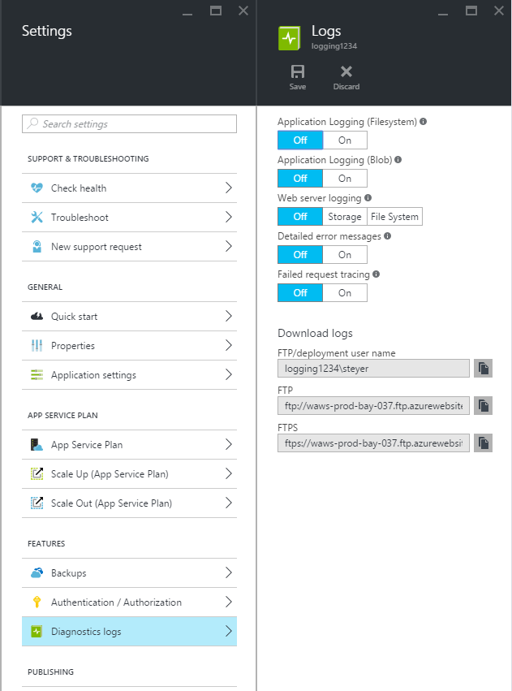

<properties
    pageTitle="Activer la journalisation des diagnostics pour les applications web dans le Service d’application Azure"
    description="Découvrez comment activer la journalisation des diagnostics et ajouter une instrumentation à votre application, ainsi que comment accéder aux informations enregistrées par Azure."
    services="app-service"
    documentationCenter=".net"
    authors="cephalin"
    manager="wpickett"
    editor="jimbe"/>

<tags
    ms.service="app-service"
    ms.workload="na"
    ms.tgt_pltfrm="na"
    ms.devlang="na"
    ms.topic="article"
    ms.date="06/06/2016"
    ms.author="cephalin"/>

# Activer la journalisation des diagnostics pour les applications web dans le Service d’application Azure

## Vue d’ensemble

Azure fournit des diagnostics intégrés pour faciliter le débogage d’une [application de Service web app](http://go.microsoft.com/fwlink/?LinkId=529714). Dans cet article, vous allez découvrir comment activer la journalisation des diagnostics et ajouter une instrumentation à votre application, ainsi que comment accéder aux informations enregistrées par Azure.

Cet article utilise le [Portail Azure](https://portal.azure.com)Azure PowerShell et l’Interface de ligne Azure (commande Azure) pour travailler avec les journaux de diagnostic. Pour plus d’informations sur l’utilisation des journaux de diagnostic à l’aide de Visual Studio, voir [Dépannage Azure dans Visual Studio](web-sites-dotnet-troubleshoot-visual-studio.md).

[AZURE.INCLUDE [app-service-web-to-api-and-mobile](../../includes/app-service-web-to-api-and-mobile.md)]

## Diagnostics de serveur Web et les diagnostics de l’application

Application Service web applications fournissent des fonctionnalités de diagnostic pour plus d’informations de journalisation à partir du serveur web et l’application web. Elles sont séparées logiquement en **diagnostics server web** et les **diagnostics de l’application**.

### Diagnostics de serveur Web

Vous pouvez activer ou désactiver les types de journaux suivants :

- **Enregistrement des erreurs détaillées** - informations d’erreur détaillées pour les codes d’état HTTP indiquant qu’une erreur (code d’état 400 ou version ultérieure). Cela peut contenir des informations qui peuvent vous aider à déterminer pourquoi le serveur a renvoyé le code d’erreur.
- **Échec de la demande de suivi** - des informations détaillées sur les requêtes échecs, y compris une trace des composants IIS permettant de traiter la demande et la durée de chaque composant. Cela peut être utile si vous essayez d’améliorer les performances du site ou d’isoler ce qui entraîne une erreur HTTP spécifique à renvoyer.
- **Journalisation sur le serveur web** - informations sur les transactions HTTP en utilisant le [format de fichier journal étendu W3C](http://msdn.microsoft.com/library/windows/desktop/aa814385.aspx). Ceci est utile pour déterminer les chiffres site globaux tels que le nombre de demandes gérées ou le nombre de requêtes proviennent d’une adresse IP spécifique.

### Diagnostics d’applications

Application diagnostics permet de capturer les informations de produit par une application web. Applications ASP.NET peuvent utiliser la classe [System.Diagnostics.Trace](http://msdn.microsoft.com/library/36hhw2t6.aspx) pour enregistrer les informations dans le journal de diagnostic applications. Par exemple :

    System.Diagnostics.Trace.TraceError("If you're seeing this, something bad happened");

Vous pourrez le retrouver ces journaux pour vous aider à résoudre les problèmes lors de l’exécution. Pour plus d’informations, voir [dépannage Azure web apps dans Visual Studio](web-sites-dotnet-troubleshoot-visual-studio.md).

Application Service web applications également enregistrer les informations relatives au déploiement lors de la publication du contenu pour une application web. Cela se produit automatiquement et il n’existe aucune les paramètres de configuration pour l’enregistrement de déploiement. Journalisation du déploiement permet de déterminer pourquoi un déploiement a échoué. Par exemple, si vous utilisez un script de déploiement personnalisé, vous utiliserez journalisation de déploiement pour déterminer pourquoi le script échoue.

## Comment activer les diagnostics

Pour activer des diagnostics dans le [Portail Azure](https://portal.azure.com), accédez à la carte pour votre application web et cliquez sur **Paramètres > journaux de Diagnostics**.

<!-- todo:cleanup dogfood addresses in screenshot -->

Lorsque vous activez **l’application diagnostics** vous choisissez également le **niveau**. Ce paramètre vous permet de filtrer les informations capturées vers des informations **d’information**, **Avertissement** ou une **erreur** . Ce paramètre **explicite** enregistre toutes les informations de produit par l’application.

> [AZURE.NOTE] Contrairement à la modification du fichier web.config, l’activation des diagnostics Application ou modification des niveaux de journal de diagnostic ne pas recycler le domaine d’application qui s’exécute à l’application dans.

Dans l’onglet de **configurer** [portail classique](https://manage.windowsazure.com) Web app, vous pouvez sélectionner **stockage** ou **système de fichiers** pour **l’enregistrement de serveur web**. Sélection de **stockage** vous permet de sélectionner un compte de stockage, puis un conteneur blob qui seront écrites dans les journaux. Tous les autres journaux des **diagnostics site** sont écrits sur le système de fichiers uniquement.

Sous l’onglet [classique portail](https://manage.windowsazure.com) Web application **configurer** comporte également des paramètres supplémentaires pour diagnostics d’applications :

* **Système de fichiers** - stocke les informations de diagnostic d’application pour le système de fichiers d’application web. Ces fichiers peuvent être accessible en FTP ou téléchargés dans une archive Zip en utilisant le PowerShell Azure ou une Interface de ligne Azure (Azure commande).
* **Stockage de table** - stocke les informations de diagnostic application dans le nom du compte de stockage Azure et table spécifié.
* **Stockage d’objets blob** - stocke les informations de diagnostic application dans le conteneur de compte de stockage Azure et blob spécifié.
* **Période de rétention** - par défaut, les journaux ne sont pas automatiquement supprimés de **stockage d’objets blob**. Sélectionnez **un jeu de rétention** et entrez le nombre de jours à conserver des journaux si vous souhaitez supprimer automatiquement les journaux.

>[AZURE.NOTE] Si vous [Régénérer les touches d’accès rapide de votre compte de stockage](storage-create-storage-account.md#view-copy-and-regenerate-storage-access-keys), vous devez rétablir la configuration de journalisation respectives d’utiliser les touches mis à jour. Pour cela :
>
> 1. Dans l’onglet **configurer** , définissez la fonctionnalité de journalisation respectifs à **désactiver**. Enregistrez vos paramètres.
> 2. Activer la journalisation pour les objets blob storage compte ou le tableau à nouveau. Enregistrez vos paramètres.

N’importe quelle combinaison de système de fichiers, de stockage de tables ou de stockage d’objets blob peut être activée en même temps et avoir des configurations niveau journaux individuels. Par exemple, vous souhaiterez peut-être enregistrer les erreurs et avertissements de stockage blob comme une solution de journalisation à long terme, tout en permettant de journalisation de système de fichiers avec un niveau de commentaires.

Bien que tous les emplacements de stockage trois offrent les mêmes informations de base pour les événements connectés, **stockage de tables** et de **stockage d’objets blob** enregistrer les informations supplémentaires telles que l’ID de l’instance, ID de thread et un horodatage plus granulaire (format graduations) à celui de journalisation au **système de fichiers**.

> [AZURE.NOTE] Peuvent uniquement être d’accéder aux informations stockées dans le **stockage de tables** ou de **stockage d’objets blob** à l’aide d’un client de stockage ou une application qui peut travailler directement avec ces systèmes de stockage. Par exemple, Visual Studio 2013 contient un Explorateur de stockage peut être utilisée pour Explorer le stockage de table ou blob et HDInsight peut accéder aux données stockées dans le stockage blob. Vous pouvez également écrire une application qui accède au stockage Azure en utilisant l’un de l' [Azure SDK](/downloads/#).

> [AZURE.NOTE] Diagnostics peuvent également être activées à partir de PowerShell Azure à l’aide de l’applet de commande **Set-AzureWebsite** . Si vous n’avez pas installé Azure PowerShell ou que vous n’avez pas configuré pour utiliser votre abonnement Azure, Découvrez [comment utiliser Azure PowerShell](/develop/nodejs/how-to-guides/powershell-cmdlets/).

##Comment : télécharger les journaux

Informations de diagnostic stockés dans le système de fichiers application web vous pouvez accéder directement à l’aide de FTP. Il peut également être téléchargé dans une archive Zip à l’aide de PowerShell Azure ou l’Interface de ligne de commande Azure.

La structure du répertoire stockés dans les journaux est la suivante :

* **Journaux d’application** - /LogFiles/applications /. Ce dossier contient un ou plusieurs fichiers texte contenant des informations obtenues par la journalisation de l’application.

* **Échec de la demande de Traces** - / fichiers journaux/W3SVC ## /. Ce dossier contient un fichier XSL et un ou plusieurs fichiers XML. Assurez-vous que vous téléchargez le fichier XSL dans le même répertoire comme fichier (s) le code XML, car le fichier XSL fournit des fonctionnalités de mise en forme et de filtrage le contenu des fichiers XML lorsqu’ils sont affichés dans Internet Explorer.

* **Journaux d’erreurs détaillés** - /LogFiles/DetailedErrors /. Ce dossier contient un ou plusieurs fichiers .htm qui fournissent des informations détaillées pour toutes les erreurs HTTP qui se sont produites.

* **Journaux de serveur web** - /LogFiles/http/RawLogs. Ce dossier contient un ou plusieurs fichiers texte mis en forme en utilisant le [format de fichier journal étendu W3C](http://msdn.microsoft.com/library/windows/desktop/aa814385.aspx).

* **Journaux de déploiement** - / fichiers journaux/Git. Ce dossier contient des journaux générés par les processus de déploiement interne utilisés par les applications web Azure, ainsi que les journaux pour les déploiements Git.

### FTP

Pour accéder à des informations de diagnostic à l’aide de FTP, consultez le **tableau de bord** de votre application web dans le [portail classique](https://manage.windowsazure.com). Dans la section **coup de œil rapide** , cliquez sur le lien **Les journaux de Diagnostic FTP** pour accéder aux fichiers journaux à l’aide de FTP. Entrée de **l’Utilisateur de déploiement/FTP** répertorie le nom d’utilisateur qui doit être utilisé pour accéder au site FTP.

> [AZURE.NOTE] Si l’entrée du **Déploiement/FTP utilisateur** n’est pas définie ou si vous avez oublié le mot de passe pour cet utilisateur, vous pouvez créer un nouvel utilisateur et mot de passe à l’aide du lien **Réinitialiser les informations d’identification de déploiement** dans la section **coup de œil rapide** du tableau de **bord**.

### Télécharger avec PowerShell Azure

Pour télécharger les fichiers journaux, démarrez une nouvelle instance de PowerShell Azure et utilisez la commande suivante :

    Save-AzureWebSiteLog -Name webappname

Ceci enregistre les journaux pour l’application web spécifié par le **-nom** paramètre dans un fichier nommé **logs.zip** dans le répertoire actif.

> [AZURE.NOTE] Si vous n’avez pas installé Azure PowerShell ou que vous n’avez pas configuré pour utiliser votre abonnement Azure, Découvrez [comment utiliser Azure PowerShell](/develop/nodejs/how-to-guides/powershell-cmdlets/).

### Télécharger avec Azure Interface de ligne de commande

Pour télécharger les fichiers journaux à l’aide de l’Interface de ligne de commande Azure, ouvrez une nouvelle invite, PowerShell, Bash ou session Terminal Server et entrez la commande suivante :

    azure site log download webappname

Ceci enregistre les journaux pour l’application web nommé « webappname » dans un fichier nommé **diagnostics.zip** dans le répertoire actif.

> [AZURE.NOTE] Si vous n’avez pas installé la Azure de ligne de commande Interface (Azure), ou que vous n’avez pas configuré pour utiliser votre abonnement Azure, Découvrez [comment utiliser Azure infrastructure du langage commun](../xplat-cli-install.md).

## Comment : afficher les journaux dans l’Application perspectives

Analyse des applications Visual Studio fournit des outils de filtrage et de recherche des journaux et des corrélation les journaux avec les demandes et d’autres événements.

1. Ajouter l’Application Insights SDK à votre projet dans Visual Studio.
 * Dans l’Explorateur de solutions, cliquez avec le bouton droit sur votre projet et choisissez Ajouter Application perspectives. Vous serez guidé étapes qui incluent la création d’une ressource d’analyse de l’Application. [Pour en savoir plus](../application-insights/app-insights-asp-net.md)
2. Ajoutez le package récepteur de suivi à votre projet.
 * Cliquez avec le bouton droit sur votre projet, puis sélectionnez Manage NuGet Packages. Sélectionnez `Microsoft.ApplicationInsights.TraceListener` [en savoir plus](../application-insights/app-insights-asp-net-trace-logs.md)
3. Téléchargez votre projet et exécutez-le pour générer les données du journal.
4. Dans le [Portail Azure](https://portal.azure.com/), accédez à votre nouvelle ressource d’analyse de l’Application, puis ouvrez la **recherche**. Vous verrez vos données de journal, ainsi que la demande, l’utilisation et d’autres télémétrie. Certains télémétrie peut prendre quelques minutes à arriver : cliquez sur Actualiser. [Pour en savoir plus](../application-insights/app-insights-diagnostic-search.md)

[Pour plus d’informations sur les performances avec des aperçus de l’Application de suivi](../application-insights/app-insights-azure-web-apps.md)

##Comment : les journaux de flux

Lors du développement d’une application, il est souvent utile d’afficher les informations de journalisation dans presque en temps réel. Pour ce faire, vous pouvez en continu les informations de journalisation pour votre environnement de développement à l’aide de PowerShell Azure ou l’Interface de ligne de commande Azure.

> [AZURE.NOTE] Certains types de mémoire tampon de journalisation d’écrire dans le fichier journal, qui peut entraîner de désordre événements dans le flux de données. Par exemple, une entrée de journal d’application qui se produit lorsqu’un utilisateur visite une page peut être affichée dans le flux avant l’entrée de journal HTTP correspondant pour la demande de page.

> [AZURE.NOTE] Diffusion en continu de journal est également diffusés informations écrites dans n’importe quel fichier texte stocké dans le **d\\accueil\\fichiers journaux\\ ** dossier.

### Diffusion en continu avec PowerShell Azure

Pour diffuser en continu les informations de journalisation, démarrez une nouvelle instance de PowerShell Azure et utilisez la commande suivante :

    Get-AzureWebSiteLog -Name webappname -Tail

Vous êtes alors connecté à l’application web spécifiée par le **-nom** paramètre et commencer la diffusion en continu les informations dans la fenêtre PowerShell au journal des événements se produisent dans l’application web. Les informations écrites dans les fichiers se terminant par .txt, .log ou .htm qui sont stockés dans le répertoire /LogFiles (d/accueil/fichiers journaux) sont envoyées à la console locale.

Pour filtrer des événements spécifiques, tels que des erreurs, utilisez le **-Message** paramètre. Par exemple :

    Get-AzureWebSiteLog -Name webappname -Tail -Message Error

Pour filtrer des types de journal spécifique, par exemple HTTP, utilisez la **-chemin d’accès** paramètre. Par exemple :

    Get-AzureWebSiteLog -Name webappname -Tail -Path http

Pour afficher la liste des chemins d’accès disponibles, utilisez le paramètre - ListPath.

> [AZURE.NOTE] Si vous n’avez pas installé Azure PowerShell ou que vous n’avez pas configuré pour utiliser votre abonnement Azure, Découvrez [comment utiliser Azure PowerShell](/develop/nodejs/how-to-guides/powershell-cmdlets/).

### Diffusion en continu avec Azure Interface de ligne de commande

Pour diffuser en continu les informations de journalisation, ouvrez une nouvelle invite, PowerShell, Bash ou session Terminal Server et entrez la commande suivante :

    azure site log tail webappname

Vous connecter à l’application web nommée « webappname » et commencer la diffusion en continu les informations dans la fenêtre d’au journal des événements se produisent dans l’application web. Les informations écrites dans les fichiers se terminant par .txt, .log ou .htm qui sont stockés dans le répertoire /LogFiles (d/accueil/fichiers journaux) sont envoyées à la console locale.

Pour filtrer des événements spécifiques, tels que des erreurs, utilisez la **--filtre** paramètre. Par exemple :

    azure site log tail webappname --filter Error

Pour filtrer des types de journal spécifique, par exemple HTTP, utilisez la **--chemin d’accès** paramètre. Par exemple :

    azure site log tail webappname --path http

> [AZURE.NOTE] Si vous n’avez pas installé l’Interface de ligne de commande Azure ou que vous n’avez pas configuré pour utiliser votre abonnement Azure, Découvrez [comment à utiliser Azure de ligne de commande Interface](../xplat-cli-install.md).

##Comment : comprendre les journaux de diagnostic

### Journaux de diagnostics d’application

Application diagnostics stocke des informations dans un format spécifique pour les applications .NET, selon que vous stockez les fichiers journaux au système de fichiers, le stockage de tables ou le stockage d’objets blob. L’ensemble de base de données stockées est identique à tous les trois types de stockage - la date et l’heure de que l’événement, l’ID du processus qui a produit l’événement, le type d’événement (informations, avertissement, erreur) et le message d’événement.

__Système de fichiers__

Chaque ligne connecté au système de fichiers ou reçus à l’aide de la diffusion en continu sera au format suivant :

    {Date}  PID[{process id}] {event type/level} {message}

Par exemple, un événement d’erreur devrait ressembler à ce qui suit :

    2014-01-30T16:36:59  PID[3096] Error       Fatal error on the page!

Journalisation pour le système de fichiers fournit les informations essentielles des trois méthodes disponibles, fournir uniquement le temps, id de processus, niveau d’événement et le message.

__Stockage de table__

Lorsque vous vous connectez au stockage de tables, des propriétés supplémentaires sont utilisées pour faciliter la recherche des données stockées dans le tableau, ainsi que des informations plus granulaires sur l’événement. Les propriétés (colonnes) suivantes sont utilisées pour chaque entité (ligne) stockée dans la table.

Nom de la propriété|Format de la valeur
---|---
PartitionKey|Date/heure de l’événement au format yyyyMMddHH
RowKey|Une valeur GUID qui identifie de façon unique cette entité
Horodatage|Date et heure de l’événement
EventTickCount|Date et heure de l’événement, au format de graduation (une plus grande précision)
ApplicationName|Le nom de l’application web
Niveau|Niveau d’événement (par exemple : erreur, avertissement, informations)
ID de l’événement|L’ID d’événement de cet événement

0 si aucun spécifié par défaut
ID d’instance|Instance de l’application web qui se sont produites même sur
PID|ID de processus
TID|L’ID du thread qui a produit l’événement
Message|Message d’événement détail

__Stockage d’objets BLOB__

Lorsque vous vous connectez pour stockage blob, les données sont stockées dans le format de valeurs séparées par des virgules (CSV). Semblable au stockage de tables, des champs supplémentaires sont enregistrés pour fournir des informations plus granulaires sur l’événement. Les propriétés suivantes sont utilisées pour chaque ligne dans la CSV :

Nom de la propriété|Format de la valeur
---|---
Date|Date et heure de l’événement
Niveau|Niveau d’événement (par exemple : erreur, avertissement, informations)
ApplicationName|Le nom de l’application web
ID d’instance|Instance de l’application web qui l’événement s’est produite sur
EventTickCount|Date et heure de l’événement, au format de graduation (une plus grande précision)
ID de l’événement|L’ID d’événement de cet événement

0 si aucun spécifié par défaut
PID|ID de processus
TID|L’ID du thread qui a produit l’événement
Message|Message d’événement détail

Les données stockées dans un blob peut se présenter comme suit :

    date,level,applicationName,instanceId,eventTickCount,eventId,pid,tid,message
    2014-01-30T16:36:52,Error,mywebapp,6ee38a,635266966128818593,0,3096,9,An error occurred

> [AZURE.NOTE] La première ligne du journal contient les en-têtes de colonnes que représenté dans cet exemple.

### Échec de la demande traces

Échec de la demande de traces sont stockés dans des fichiers XML nommés __fr ### .xml__. Pour rendre plus facile de voir les informations enregistrées, une feuille de style XSL nommé __freb.xsl__ est fourni dans le même répertoire que les fichiers XML. Ouverture de l’une des fichiers XML dans Internet Explorer utilise la feuille de style XSL pour fournir un affichage des informations de suivi des mises en forme. Cela sera semblable à ce qui suit :

### Journaux d’erreurs détaillés

Journaux d’erreurs détaillés sont des documents HTML qui fournissent des informations plus détaillées sur les erreurs HTTP qui se sont produites. Dans la mesure où ils sont simplement les documents HTML, ils peuvent être affichés à l’aide d’un navigateur web.

### Journaux de serveur Web

Les journaux de serveur web sont mis en forme en utilisant le [format de fichier journal étendu W3C](http://msdn.microsoft.com/library/windows/desktop/aa814385.aspx). Ces informations peuvent être lus à l’aide d’un éditeur de texte ou de l’analyse de l’utilisation des utilitaires tels que [Analyseur de journal](http://go.microsoft.com/fwlink/?LinkId=246619).

> [AZURE.NOTE] Les journaux générés par les applications web Azure ne prennent pas en charge les champs __s-computername__, __s-ip__ou __SC version__ .

##Étapes suivantes

- [Comment faire pour surveiller des applications Web](/manage/services/web-sites/how-to-monitor-websites/)
- [Dépannage des applications web Azure dans Visual Studio](web-sites-dotnet-troubleshoot-visual-studio.md)
- [Analyser ouvre une application web dans HDInsight](http://gallery.technet.microsoft.com/scriptcenter/Analyses-Windows-Azure-web-0b27d413)

> [AZURE.NOTE] Si vous voulez commencer à utiliser le Service d’application Azure avant de vous inscrire pour un compte Azure, accédez à [Essayer le Service application](http://go.microsoft.com/fwlink/?LinkId=523751), où vous pouvez créer une application web starter courte immédiatement dans le Service d’application. Aucune carte de crédit obligatoire ; Aucune engagements.

## Ce qui a changé
* Pour un guide à la modification de sites Web Application Service voir : [Azure Application Service et son Impact sur les Services Azure existants](http://go.microsoft.com/fwlink/?LinkId=529714)
* Pour un guide pour la modification de l’ancien portail au nouveau portail voir : [référence pour naviguer sur le portail Azure](http://go.microsoft.com/fwlink/?LinkId=529715)
 
