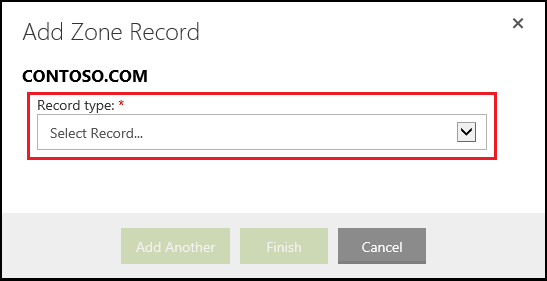

<properties
    pageTitle="Configurer un nom de domaine personnalisé dans le Service d’application Azure (GoDaddy)"
    description="Découvrez comment utiliser un nom de domaine auprès de GoDaddy avec Azure Web Apps"
    services="app-service"
    documentationCenter=""
    authors="erikre"
    manager="wpickett"
    editor="jimbe"/>

<tags
    ms.service="app-service"
    ms.workload="na"
    ms.tgt_pltfrm="na"
    ms.devlang="na"
    ms.topic="article"
    ms.date="01/12/2016"
    ms.author="cephalin"/>

# Configurer un nom de domaine personnalisé dans le Service d’application Azure (acheté directement auprès de GoDaddy)

[AZURE.INCLUDE [web-selector](../../includes/websites-custom-domain-selector.md)]

[AZURE.INCLUDE [intro](../../includes/custom-dns-web-site-intro.md)]

Si vous avez acheté domaine via Azure Application Service Web Apps ensuite faire référence à la dernière étape de [Acheter un domaine pour les applications Web](custom-dns-web-site-buydomains-web-app.md).

Cet article fournit des instructions sur l’utilisation d’un nom de domaine personnalisé qui a été acheté directement auprès de [GoDaddy](https://godaddy.com) avec [Application de Service Web Apps](http://go.microsoft.com/fwlink/?LinkId=529714).

[AZURE.INCLUDE [introfooter](../../includes/custom-dns-web-site-intro-notes.md)]

##Présentation des enregistrements DNS

[AZURE.INCLUDE [understandingdns](../../includes/custom-dns-web-site-understanding-dns-raw.md)]

## Ajouter un enregistrement DNS pour votre domaine personnalisé

Pour associer votre domaine personnalisé à une application web dans le Service d’application, vous devez ajouter une nouvelle entrée dans la table DNS pour votre domaine personnalisé à l’aide des outils fournis par GoDaddy. Utilisez les étapes suivantes pour localiser les outils DNS de GoDaddy.com

1. Connectez-vous à votre compte avec GoDaddy.com, puis sélectionnez **Mon compte** , puis sur **Gérer mes domaines**. Enfin, sélectionnez le menu déroulant pour le nom de domaine que vous souhaitez utiliser avec votre application web Azure, puis sélectionnez **Gérer DNS**.

    

2. Dans la page **Détails du domaine** , accédez à l’onglet **Fichier de Zone DNS** . Il s’agit de la section utilisée pour l’ajout et modification des enregistrements DNS pour votre nom de domaine.

    

    Sélectionnez **Add Record** pour ajouter un enregistrement existant.

    Pour **Modifier** un enregistrement existant, sélectionnez l’icône du stylet et blanc à côté de l’enregistrement.

    > [AZURE.NOTE] Avant d’ajouter de nouveaux enregistrements, notez que GoDaddy a déjà créé des enregistrements DNS pour les plus consultés sous-domaines (appelés **hôte** dans l’éditeur,) telles que la **messagerie**, de **fichiers**, **messagerie**et d’autres personnes. Si le nom que vous souhaitez utiliser déjà existe, modifiez l’enregistrement existant au lieu de créer un nouvel identifiant.

4. Lorsque vous ajoutez un enregistrement, vous devez d’abord sélectionner le type d’enregistrement.

    

    Ensuite, vous devez fournir l' **hôte** (le domaine personnalisé ou sous-domaine) et ce qu’elle **pointe vers**.

    

    * Lorsque vous ajoutez un **enregistrement A (hôte)** - vous devez définir le champ **hôte** soit **@** (il s’agit de nom de domaine racine, tel que **contoso.com**,) *(un caractère générique pour la correspondance des plusieurs sous-domaines) ou le sous-domaine que vous souhaitez utiliser (par exemple, * *www**.) Vous devez définir la * *pointage** champ à l’adresse IP de votre application web Azure.

    * Lorsque vous ajoutez un **enregistrement CNAME (alias)** - vous devez définir le champ **hôte** pour le sous-domaine que vous souhaitez utiliser. Par exemple, **www**. Vous devez définir le champ **pointe vers** la **. azurewebsites.net** nom de domaine de votre application web Azure. Par exemple, **contoso.azurewebsites.net**.

5. Cliquez sur **Ajouter un autre**.
6. Sélectionnez le type d’enregistrement **TXT** , puis spécifiez la valeur **Host** **@** et la valeur **pointe vers** ** &lt;yourwebappname&gt;. azurewebsites.net**.

    > [AZURE.NOTE] Cet enregistrement TXT est utilisé par Azure pour valider que vous êtes propriétaire du domaine décrit à l’enregistrement A ou du premier enregistrement TXT. Une fois que le domaine a été mappé à l’application web dans le portail Azure, cette entrée de l’enregistrement TXT peut être supprimée.

5. Lorsque vous avez terminé d’ajouter ou modifier des enregistrements, cliquez sur **Terminer** pour enregistrer les modifications.

## Activer le nom de domaine dans votre application web

[AZURE.INCLUDE [modes](../../includes/custom-dns-web-site-enable-on-web-site.md)]

>[AZURE.NOTE] Si vous voulez commencer à utiliser le Service d’application Azure avant de vous inscrire pour un compte Azure, accédez à [Essayer le Service application](http://go.microsoft.com/fwlink/?LinkId=523751), où vous pouvez créer une application web starter courtes immédiatement dans le Service d’application. Aucune carte de crédit obligatoire ; Aucune engagements.

## Ce qui a changé
* Pour un guide à la modification de sites Web Application Service voir : [Azure Application Service et son Impact sur les Services Azure existants](http://go.microsoft.com/fwlink/?LinkId=529714)
