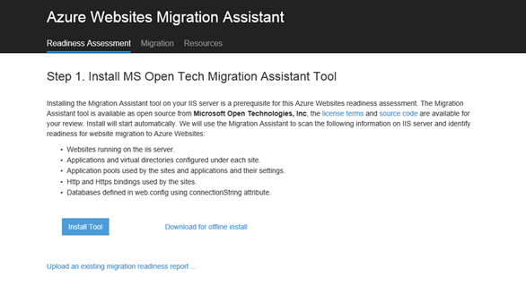
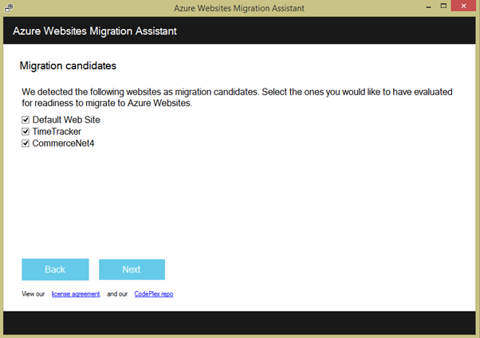
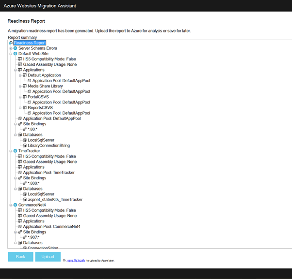

<properties 
    pageTitle="Migrer une application web entreprise au Service d’application Azure" 
    description="Montre comment utiliser l’Assistant Migration Web applications à migrer rapidement des sites Web IIS existants à Azure Application Service Web Apps" 
    services="app-service" 
    documentationCenter="" 
    authors="cephalin" 
    writer="cephalin" 
    manager="wpickett" 
    editor=""/>

<tags 
    ms.service="app-service" 
    ms.workload="na" 
    ms.tgt_pltfrm="na" 
    ms.devlang="na" 
    ms.topic="article" 
    ms.date="07/01/2016" 
    ms.author="cephalin"/>

# Migrer une application web entreprise au Service d’application Azure

Vous pouvez facilement migrer vos sites Web existante qui s’exécutent sur les services Internet (IIS) 6 ou version ultérieure pour [Application Service Web Apps](http://go.microsoft.com/fwlink/?LinkId=529714). 

>[AZURE.IMPORTANT] Windows Server 2003 atteint la fin de prise en charge sur juillet 2015 14. Si vous hébergez vos sites Web sur un serveur IIS qui est Windows Server 2003, Web Apps est un risque faible, économique, et problèmes permet de conserver votre site Web en ligne et de l’Assistant Migration Web applications peuvent vous aider à automatiser le processus de migration pour vous. 

[L’Assistant Migration d’applications Web](https://www.movemetothecloud.net/) peuvent analyser votre installation de serveur IIS, identifiez les sites peuvent être migrés vers le Service d’application, mettez en surbrillance tous les éléments qui ne peuvent pas être migrées ou sont non prises en charge sur la plateforme et puis migrer vos sites Web et les bases de données associées à Azure.

[AZURE.INCLUDE [app-service-web-to-api-and-mobile](../../includes/app-service-web-to-api-and-mobile.md)]

## Éléments vérifiés lors de l’analyse de compatibilité ##
L’Assistant de Migration crée un rapport de compatibilité pour identifier les causes possibles poser problème ou des problèmes de blocage qui peuvent empêcher la migration à partir de IIS local vers Azure Application Service Web Apps. Certains éléments clés importants sont :

-   Liaisons de port – Web Apps prend uniquement en charge le Port 80 pour HTTP et le Port 443 pour le trafic HTTPS. Plusieurs configurations seront ignorées et le trafic doivent être routé vers 80 et 443. 
-   Authentification – Web Apps prend en charge l’authentification anonyme par défaut et l’authentification par formulaire where spécifiée par une application. L’authentification Windows peuvent être utilisée par intégration avec Azure Active Directory et ADFS uniquement. Toutes les autres formes d’authentification - par exemple, l’authentification de base - ne sont actuellement pas pris en charge. 
-   Global Assembly Cache de – le GAC n’est pas pris en charge dans les applications Web. Si votre application référence assemblys qui vous déployez généralement le GAC, vous devrez déployer dans le dossier bin application dans les applications Web. 
-   IIS 5 Mode de compatibilité – Ceci n’est pas pris en charge dans les applications Web. 
-   Des Pools d’applications – dans les applications Web, chaque site et ses applications enfants s’exécutent dans le même pool d’applications. Si votre site possède plusieurs applications enfants qui utilisent plusieurs pools d’applications, les consolider à un pool d’applications unique avec des paramètres communs ou migrer chaque application pour une application web distincte.
-   Composants COM – Web Apps n’autorise pas l’enregistrement des composants COM sur la plateforme. Si vos applications ou sites Web appel à des composants COM, vous devez recréez-les dans du code managé et les déployer avec l’application ou le site Web.
-   Filtres ISAPI – Web Apps peut prendre en charge l’utilisation des filtres ISAPI. Vous devez effectuer les opérations suivantes :
    -   déployer les DLL avec votre application web 
    -   Enregistrez les DLL à l’aide de [Web.config](http://www.iis.net/configreference/system.webserver/isapifilters)
    -   Placez un fichier applicationHost.xdt dans la racine du site avec le contenu ci-dessous :

            <?xml version="1.0"?>
            <configuration xmlns:xdt="http://schemas.microsoft.com/XML-Document-Transform">
            <configSections>
                <sectionGroup name="system.webServer">
                  <section name="isapiFilters" xdt:Transform="SetAttributes(overrideModeDefault)" overrideModeDefault="Allow" />
                </sectionGroup>
              </configSections>
            </configuration>

        Pour plus d’exemples d’utilisation des Transformations de documents XML à votre site Web, voir [transformer votre Site Web de Microsoft Azure](http://blogs.msdn.com/b/waws/archive/2014/06/17/transform-your-microsoft-azure-web-site.aspx).

-   Autres composants telles que SharePoint, les extensions serveur FrontPage (FPSE), FTP, les certificats SSL ne seront pas migrés.

## Comment utiliser l’Assistant de Migration Web Apps ##
Cet exemple pour migrer des sites Web quelques qui utilisent une base de données SQL Server et s’exécutant sur un ordinateur Windows Server 2003 R2 (IIS 6.0) sur site parcourt section :

1.  Sur le serveur IIS ou votre ordinateur client, accédez à [https://www.movemetothecloud.net/](https://www.movemetothecloud.net/) 

    

2.  Installer l’Assistant Migration Web Apps en cliquant sur le bouton **Dédié IIS Server** . Autres options sera bientôt options. 
4.  Cliquez sur le bouton **Outil d’installation** pour installer l’Assistant Migration Web Apps sur votre ordinateur.

    

    >[AZURE.NOTE] Vous pouvez également cliquer sur **télécharger pour l’installation en mode hors connexion** pour télécharger un fichier ZIP pour l’installation sur des serveurs ne pas connectés à internet. Ou bien, vous pouvez cliquer sur **télécharger un rapport de compatibilité de migration existant**, qui est une option avancée pour l’utiliser avec un migration préparation rapport existant que vous avez créé auparavant (expliqué ultérieurement).

5.  Dans l’écran **Installation de l’Application** , cliquez sur **installer** pour installer sur votre ordinateur. Il installe également dépendances correspondantes comme déploiement Web, DacFX et IIS, si nécessaire. 

    

    Une fois installée, l’Assistant Migration Web applications démarre automatiquement.
  
6.  Sélectionnez **sites migrer et bases de données à partir d’un serveur distant vers Azure**. Entrez les informations d’identification d’administration pour le serveur distant, puis cliquez sur **Continuer**. 

    

    Bien entendu, vous pouvez choisir de migrer à partir du serveur local. L’option remote est utile lorsque vous voulez migrer des sites Web à partir d’un serveur IIS de production.
 
    À ce stade d’inspecter l’outil de migration la configuration de votre serveur IIS, tels que des Sites, des Applications, des Pools d’applications et dépendances pour identifier les sites candidate pour la migration. 

8.  La capture d’écran ci-dessous montre les trois sites Web – **Site Web par défaut**, **TimeTracker**et **CommerceNet4**. Ils présentent tous une base de données associée que nous souhaitons migrer. Sélectionnez tous les sites que vous voulez évaluer, puis cliquez sur **suivant**.

    
 
9.  Cliquez sur **Télécharger** pour télécharger le rapport de compatibilité. Si vous cliquez sur **Enregistrer le fichier localement**, vous pouvez exécuter l’outil de migration à nouveau ultérieurement et téléchargez l’état de préparation enregistré comme indiqué précédemment.

    
 
    Une fois le rapport de disponibilité du téléchargement, Azure effectue une analyse de préparation et affiche les résultats. Lisez les détails d’évaluation pour chaque site Web et vérifiez que vous comprenez ou avez pris en compte tous les problèmes avant de poursuivre. 
 
    

12. Cliquez sur **Commencer la Migration** pour démarrer la migration. Vous êtes maintenant être redirigé vers Azure pour vous connecter à votre compte. Il est important que vous ouvrez une session avec un compte disposant d’un abonnement Azure active. Si vous ne disposez pas d’un compte Azure puis vous pouvez vous inscrire pour un gratuit d’évaluation [ici](https://azure.microsoft.com/pricing/free-trial/?WT.srch=1&WT.mc_ID=SEM_). 

13. Sélectionnez le compte client, l’abonnement Azure et la région à utiliser pour vos applications web Azure migrés et les bases de données, puis cliquez sur **Démarrer la Migration**. Vous pouvez sélectionner les sites Web pour migrer ultérieurement.

    

14. Dans l’écran suivant vous pouvez modifier les paramètres de migration par défaut, telles que :

    - utiliser une base de données SQL Azure existante ou créer une nouvelle base de données SQL Azure et configurer ses informations d’identification
    - Sélectionnez les sites Web à déplacer
    - définir des noms pour les applications web Azure et leurs bases de données SQL liées
    - personnaliser les paramètres globaux et au niveau du site

    La capture d’écran ci-dessous montre tous les sites Web sélectionnés pour la migration avec les paramètres par défaut.

    

    >[AZURE.NOTE] la case à cocher **Activer Azure Active Directory** dans les paramètres personnalisés intègre l’application web Azure [Azure Active Directory](active-directory-whatis.md) (le **Répertoire par défaut**). Pour plus d’informations sur la synchronisation Azure Active Directory avec Active Directory sur site, voir [intégration d’annuaire](http://msdn.microsoft.com/library/jj573653).

16.  Une fois que vous apportez toutes les modifications souhaitées, cliquez sur **créer** pour démarrer le processus de migration. L’outil de migration crée la base de données SQL Azure et Azure dans le navigateur et puis le publier le contenu de site Web et les bases de données. Progression de la migration est clairement présentée dans l’outil de migration, et vous verrez un écran récapitulatif à la fin, les détails sur les sites migrés, s’ils ont été réussies, des liens vers les applications nouvellement créé Azure web. 

    Si une erreur se produit lors de la migration, l’outil de migration clairement indique l’échec et restaurer les modifications. Vous pourrez également envoyer le rapport d’erreurs directement à l’équipe technique en cliquant sur le bouton **Envoyer le rapport d’erreur** , avec la pile d’appel échec capturées et créer le corps du message. 

    

    Si migrer établie sans erreurs, vous pouvez également cliquer sur le bouton **Envoyer des commentaires** pour fournir des commentaires directement. 
 
20. Cliquez sur les liens vers les applications web Azure et vérifiez que la migration a réussi.

21. Vous pouvez maintenant gérer les applications web a été déplacée dans le Service d’application Azure. Pour cela, connectez-vous au [Portail Azure](https://portal.azure.com).

22. Dans le portail Azure, ouvrez la carte Web Apps pour afficher vos sites Web migrés (indiqué comme applications web), puis cliquez sur l’un d’eux pour commencer à gérer l’application web, tels que la configuration de la publication continue, création des sauvegardes, autoscaling et surveiller l’utilisation ou les performances.

    

>[AZURE.NOTE] Si vous voulez commencer à utiliser le Service d’application Azure avant de vous inscrire pour un compte Azure, accédez à [Essayer le Service application](http://go.microsoft.com/fwlink/?LinkId=523751), où vous pouvez créer une application web starter courtes immédiatement dans le Service d’application. Aucune carte de crédit obligatoire ; Aucune engagements.

## Ce qui a changé
* Pour un guide à la modification de sites Web Application Service voir : [Azure Application Service et son Impact sur les Services Azure existants](http://go.microsoft.com/fwlink/?LinkId=529714)
 
