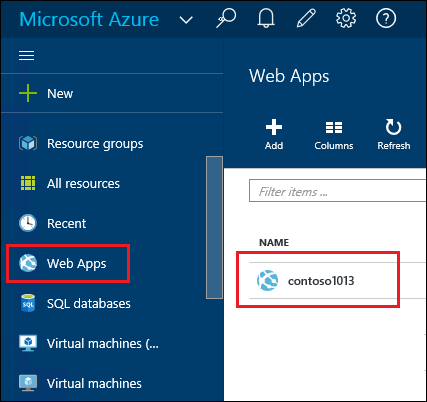
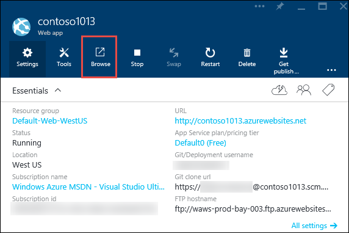
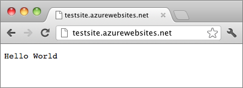

<properties
    pageTitle="Créer une application web Node.js dans le Service d’application Azure | Microsoft Azure"
    description="Découvrez comment déployer une application Node.js sur une application web dans le Service d’application Azure."
    services="app-service\web"
    documentationCenter="nodejs"
    authors="rmcmurray"
    manager="wpickett"
    editor=""/>

<tags
    ms.service="app-service-web"
    ms.workload="web"
    ms.tgt_pltfrm="na"
    ms.devlang="nodejs"
    ms.topic="hero-article"
    ms.date="08/11/2016"
    ms.author="robmcm"/>

# Créer une application web Node.js dans le Service d’application Azure

> [AZURE.SELECTOR]
- [.NET](web-sites-dotnet-get-started.md)
- [Node.js](web-sites-nodejs-develop-deploy-mac.md)
- [Java](web-sites-java-get-started.md)
- [PHP - Git](web-sites-php-mysql-deploy-use-git.md)
- [PHP - FTP](web-sites-php-mysql-deploy-use-ftp.md)
- [Python](web-sites-python-ptvs-django-mysql.md)

Ce didacticiel montre comment créer une application [Node.js](http://nodejs.org) simple et le déployez dans une [application web](app-service-web-overview.md) dans le [Service d’application Azure](../app-service/app-service-value-prop-what-is.md) à l’aide de [Git](http://git-scm.com). Vous pouvez suivre les instructions présentées dans ce didacticiel sur les systèmes d’exploitation est en mesure de l’exécution de Node.js.

Vous allez découvrir :

* Comment créer une application web dans le Service d’application Azure à l’aide du portail Azure.
* Comment déployer une application Node.js à l’application web en appuyant vers le référentiel de Git de l’application web.

L’application terminée écrit une courte chaîne « Bonjour » dans le navigateur.

![Un navigateur affichant le message « Hello World ».][helloworld-completed]

Pour des didacticiels et des exemples de code d’applications Node.js plus complexes, ou d’autres rubriques sur l’utilisation Node.js dans Azure, voir le [Centre de développement Node.js](/develop/nodejs/).

> [AZURE.NOTE]
> Pour effectuer ce didacticiel, vous avez besoin d’un compte Microsoft Azure. Si vous n’avez pas un compte, vous pouvez [activer vos avantages d’abonné Visual Studio](/en-us/pricing/member-offers/msdn-benefits-details/?WT.mc_id=A261C142F) ou [s’inscrire à une version d’évaluation gratuite](/en-us/pricing/free-trial/?WT.mc_id=A261C142F).
>
> Si vous voulez commencer avec le Service d’application Azure avant de vous inscrivez à un compte Azure, accédez à [Essayer le Service application](http://go.microsoft.com/fwlink/?LinkId=523751). Vous pouvez créer une application web starter courte immédiatement dans le Service d’application : aucune carte de crédit obligatoire et aucun engagements.

## Créer une application web et activer la publication Git

Suivez ces étapes pour créer une application web dans le Service d’application Azure et activer la publication Git. 

[GIT](http://git-scm.com/) est un système de contrôle de version distribuée que vous pouvez utiliser pour déployer votre site Web Azure. Vous pouvez stocker le code que vous écrivez pour votre application web dans un référentiel Git local, et vous serez déployez votre code Azure en appuyant sur un référentiel distant. Cette méthode de déploiement est une fonctionnalité d’application Service web apps.  

1. Connectez-vous au [portail Azure](https://portal.azure.com).

2. Cliquez sur l’icône **+ Nouveau** dans le coin supérieur gauche du portail Azure.

3. Cliquez sur **Web + Mobile**, puis cliquez sur **application Web**.

    ![][portal-quick-create]

4. Entrez un nom pour l’application web dans la zone **dans le navigateur** .

    Ce nom doit être unique dans le domaine azurewebsites.net, car l’URL de l’application web sera {nom}. azurewebsites.net. Si le nom que vous entrez n’est pas unique, un point d’exclamation rouge apparaît dans la zone de texte.

5. Sélectionnez un **abonnement**.

6. Sélectionnez un **Groupe de ressources** ou créez-en une.

    Pour plus d’informations sur les groupes de ressources, voir [vue d’ensemble du Gestionnaire de ressources Azure](../azure-resource-manager/resource-group-overview.md).

7. Sélectionnez un **Emplacement de plan de Service** d’application/ou créez-en une.

    Pour plus d’informations sur les offres de Service d’application, voir [vue d’ensemble des plans de Service d’application Azure](../azure-web-sites-web-hosting-plans-in-depth-overview.md)

8. Cliquez sur **créer**.
   
    ![][portal-quick-create2]

    En peu de temps, généralement inférieure à une minute, Azure termine la création de la nouvelle application web.

9. Cliquez sur **Web Applications > {votre nouvelle application web}**.

    

10. Dans la carte **dans le navigateur** , cliquez sur le composant de **déploiement** .

    ![][deployment-part]

11. Dans la carte de **Déploiement continue** , cliquez sur **Choisir une Source**

12. Cliquez sur **Référentiel Git Local**, puis cliquez sur **OK**.

    ![][setup-git-publishing]

13. Configurer les informations d’identification de déploiement si vous n’avez pas déjà fait.

    un. Dans la carte de l’application Web, cliquez sur **Paramètres > informations d’identification de déploiement**.

    ![][deployment-credentials]
 
    b. Créer un nom d’utilisateur et mot de passe. 
    
    

14. Dans la carte de l’application Web, cliquez sur **paramètres**, puis cliquez sur **Propriétés**.
 
    Pour publier, vous devez pousser à un référentiel Git distant. L’URL pour le référentiel est répertorié sous **GIT URL**. Vous allez utiliser cette URL plus loin dans le didacticiel.

    ![][git-url]

## Créer et tester votre application localement

Dans cette section, vous devez créer un fichier **server.js** qui contient une version de l’exemple « Hello World » à partir de [nodejs.org] légèrement modifiée. Le code ajoute process.env.PORT comme le port à l’écoute lors de l’exécution dans une application web Azure.

1. Créez un répertoire nommé *helloworld*.

2. Utiliser un éditeur de texte pour créer un nouveau fichier nommé **server.js** dans le répertoire *helloworld* .

2. Copiez le code suivant dans le fichier **server.js** et enregistrez le fichier :

        var http = require('http')
        var port = process.env.PORT || 1337;
        http.createServer(function(req, res) {
          res.writeHead(200, { 'Content-Type': 'text/plain' });
          res.end('Hello World\n');
        }).listen(port);

3. Ouvrez la ligne de commande et utilisez la commande suivante pour démarrer l’application web localement.

        node server.js

4. Ouvrez votre navigateur web et accédez à http://localhost:1337. 

    Une page Web qui affiche « Hello World » s’affiche, comme illustré dans l’écran suivant.

    ![Un navigateur affichant le message « Hello World ».][helloworld-localhost]

## Publiez votre application

1. Installez Git si vous n’avez pas déjà fait.

    Pour obtenir des instructions d’installation pour votre plateforme, voir le [Git page de téléchargement](http://git-scm.com/download).

1. Dans la ligne de commande, accédez au répertoire **helloworld** , entrez la commande suivante initialisation un référentiel Git local.

        git init

2. Ajouter des fichiers dans le référentiel, utilisez les commandes suivantes :

        git add .
        git commit -m "initial commit"

3. Ajouter un Git à distance pour pousser des mises à jour à l’application web que vous avez créé précédemment, à l’aide de la commande suivante :

        git remote add azure [URL for remote repository]

4. Notifications Push vos modifications sur Azure à l’aide de la commande suivante :

        git push azure master

    Vous êtes invité au mot de passe que vous avez créé précédemment. Le résultat est similaire à l’exemple suivant.

        Counting objects: 3, done.
        Delta compression using up to 8 threads.
        Compressing objects: 100% (2/2), done.
        Writing objects: 100% (3/3), 374 bytes, done.
        Total 3 (delta 0), reused 0 (delta 0)
        remote: New deployment received.
        remote: Updating branch 'master'.
        remote: Preparing deployment for commit id '5ebbe250c9'.
        remote: Preparing files for deployment.
        remote: Deploying Web.config to enable Node.js activation.
        remote: Deployment successful.
        To https://user@testsite.scm.azurewebsites.net/testsite.git
         * [new branch]      master -> master

5. Pour afficher votre application, cliquez sur le bouton **Parcourir** sur le composant **Web App** dans le portail Azure.

    

    

## Publier les modifications apportées à votre application

1. Ouvrez le fichier **server.js** dans un éditeur de texte et remplacez « Hello World\n » par « Hello Azure\n ». 

2. Enregistrez le fichier.

2. À partir de la ligne de commande, accédez au répertoire **helloworld** et exécutez les commandes suivantes :

        git add .
        git commit -m "changing to hello azure"
        git push azure master

    Vous êtes invité à nouveau votre mot de passe.

3. Actualiser la fenêtre du navigateur que vous accédé à l’URL de l’application web.

    ![Une page web affichant « Hello Azure »][helloworld-completed]

## Restaurer un déploiement

À partir de la carte **dans le navigateur** vous pouvez cliquer sur **Paramètres > déploiement continue** pour afficher l’historique de déploiement dans la carte **déploiements** . Si vous avez besoin revenir à un déploiement antérieur, vous pouvez sélectionner, puis sur **redéployez** dans la carte de **Détails du déploiement** .

## Étapes suivantes

Vous avez déployé une application Node.js à une application web dans le Service d’application Azure. Pour en savoir plus sur l’application Service web applications exécutent des applications Node.js, voir [Azure Application Service Web Apps : Node.js](http://blogs.msdn.com/b/silverlining/archive/2012/06/14/windows-azure-websites-node-js.aspx) et en [spécifiant une version Node.js dans une application Azure](../nodejs-specify-node-version-azure-apps.md).

Node.js fournit un réseau développé de modules qui peuvent être utilisées par vos applications. Pour découvrir le fonctionnement des applications Web avec des modules, voir [Node.js à l’aide de modules avec les applications Azure](../nodejs-use-node-modules-azure-apps.md).

Si vous rencontrez des problèmes avec votre application après que qu’il a été déployé sur Azure, Découvrez [comment déboguer une application Node.js dans le Service d’application Azure](web-sites-nodejs-debug.md) pour plus d’informations sur le diagnostic du problème.

Cet article utilise le portail Azure pour créer une application web. Vous pouvez également utiliser [l’Interface de ligne Azure](../xplat-cli-install.md) ou [Azure PowerShell](../powershell-install-configure.md) pour effectuer les opérations mêmes.

Pour plus d’informations sur le développement d’applications Node.js dans Azure, voir le [Centre de développement Node.js](/develop/nodejs/).

[helloworld-completed]: ./media/web-sites-nodejs-develop-deploy-mac/helloazure.png
[helloworld-localhost]: ./media/web-sites-nodejs-develop-deploy-mac/helloworldlocal.png
[portal-quick-create]: ./media/web-sites-nodejs-develop-deploy-mac/create-quick-website.png
[portal-quick-create2]: ./media/web-sites-nodejs-develop-deploy-mac/create-quick-website2.png
[setup-git-publishing]: ./media/web-sites-nodejs-develop-deploy-mac/setup_git_publishing.png
[go-to-dashboard]: ./media/web-sites-nodejs-develop-deploy-mac/go_to_dashboard.png
[deployment-part]: ./media/web-sites-nodejs-develop-deploy-mac/deployment-part.png
[deployment-credentials]: ./media/web-sites-nodejs-develop-deploy-mac/deployment-credentials.png
[git-url]: ./media/web-sites-nodejs-develop-deploy-mac/git-url.png
