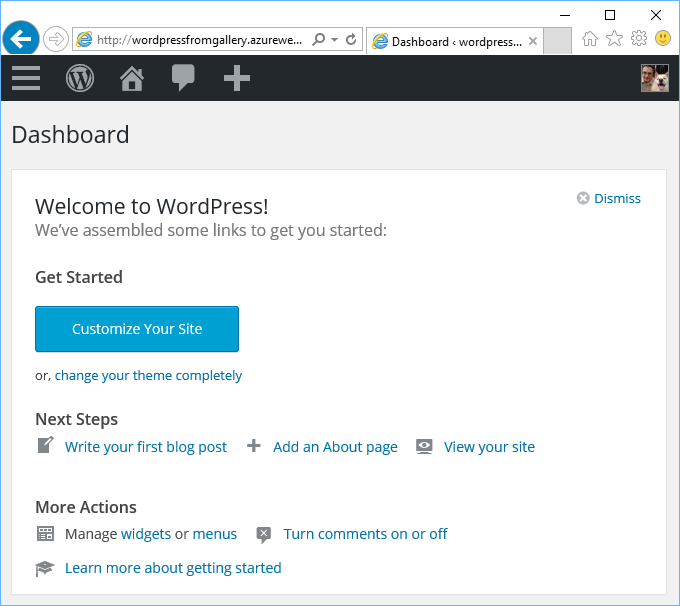
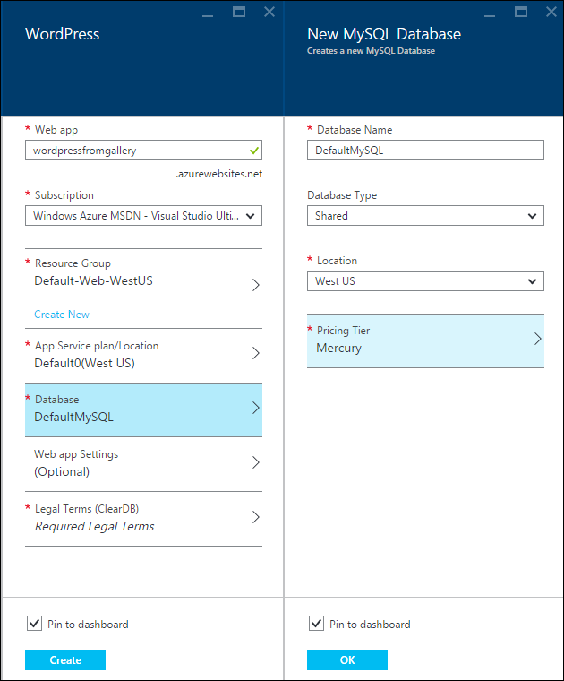

<properties
    pageTitle="Créer une application web WordPress dans le Service d’application Azure | Microsoft Azure"
    description="Apprenez à créer une nouvelle application web Azure pour un blog WordPress à l’aide du portail Azure."
    services="app-service\web"
    documentationCenter="php"
    authors="rmcmurray"
    manager="wpickett"
    editor=""/>

<tags
    ms.service="app-service-web"
    ms.workload="na"
    ms.tgt_pltfrm="na"
    ms.devlang="PHP"
    ms.topic="hero-article"
    ms.date="08/11/2016"
    ms.author="robmcm"/>

# Créer une application web WordPress dans le Service d’application Azure

[AZURE.INCLUDE [tabs](../../includes/app-service-web-get-started-nav-tabs.md)]

Ce didacticiel montre comment déployer un site de blog WordPress depuis la Azure Marketplace.

Lorsque vous avez terminé avec le didacticiel, vous aurez votre propre site de blog WordPress vers le haut et en cours d’exécution dans le cloud.

Vous allez découvrir :

* Comment trouver un modèle d’application dans le Azure Marketplace.
* Comment créer une application web dans le Service d’application Azure qui est basé sur le modèle.
* Comment configurer les paramètres de Service d’application Azure pour la nouvelle application web et la base de données.

La Azure Marketplace met à disposition un large éventail d’applications web les plus courants sont développés par Microsoft, des entreprises tierces et initiatives logiciel open source. Les applications web sont appuient sur un large éventail de structures populaires, telles que [PHP](/develop/nodejs/) cette WordPress exemple [.NET](/develop/net/), [Node.js](/develop/nodejs/), [Java](/develop/java/)et [Python](/develop/python/), pour ne citer. Pour créer une application web à partir de la Azure Marketplace le logiciel seulement que vous avez besoin est le navigateur que vous utilisez pour le [Portail Azure](https://portal.azure.com/). 

Le site WordPress que vous déployez dans ce didacticiel utilise MySQL pour la base de données. Si vous souhaitez utiliser à la place de la base de données SQL pour la base de données, voir [Nami de projet](http://projectnami.org/). **Projet Nami** est également disponible via le marché.

> [AZURE.NOTE]
> Pour effectuer ce didacticiel, vous avez besoin d’un compte Microsoft Azure. Si vous n’avez pas un compte, vous pouvez [activer vos avantages d’abonné Visual Studio](/pricing/member-offers/msdn-benefits-details/?WT.mc_id=A261C142F) ou [s’inscrire à une version d’évaluation gratuite](/en-us/pricing/free-trial/?WT.mc_id=A261C142F).
>
> Si vous voulez commencer avec le Service d’application Azure avant de vous inscrivez à un compte Azure, accédez à [Essayer le Service application](http://go.microsoft.com/fwlink/?LinkId=523751). Vous pouvez créer une application web starter courte immédiatement dans le Service d’application : aucune carte de crédit obligatoire et aucun engagements.

## Sélectionnez WordPress et configurez pour le Service d’application Azure

1. Connectez-vous au [portail Azure](https://portal.azure.com/).

2. Cliquez sur **Nouveau**.
    
    ![Créer une nouvelle][5]
    
3. Recherchez **WordPress**, puis cliquez sur **WordPress**. Si vous souhaitez utiliser la base de données SQL au lieu de MySQL, recherchez **Nami de projet**.

    ![WordPress de liste][7]
    
5. Après la lecture de la description de l’application WordPress, cliquez sur **créer**.

    

4. Entrez un nom pour l’application web dans la zone **dans le navigateur** .

    Ce nom doit être unique dans le domaine azurewebsites.net, car l’URL de l’application web sera {nom}. azurewebsites.net. Si le nom que vous entrez n’est pas unique, un point d’exclamation rouge apparaît dans la zone de texte.

8. Si vous avez plusieurs abonnements, choisissez celui que vous voulez utiliser. 

5. Sélectionnez un **Groupe de ressources** ou créez-en une.

    Pour plus d’informations sur les groupes de ressources, voir [vue d’ensemble du Gestionnaire de ressources Azure](../azure-resource-manager/resource-group-overview.md).

5. Sélectionnez un **Emplacement de plan de Service** d’application/ou créez-en une.

    Pour plus d’informations sur les offres de Service d’application, voir [vue d’ensemble des plans de Service d’application Azure](../azure-web-sites-web-hosting-plans-in-depth-overview.md) 

7. Cliquez sur **base de données**et dans la carte de **Nouvelle base de données MySQL** fournir les valeurs requises pour la configuration de votre base de données MySQL.

    un. Entrez un nouveau nom ou laissez le nom par défaut.

    b. Conserver le **Type de base de données** définie sur **partagé**.

    c. Cliquez sur le même emplacement que celui que vous avez choisi pour l’application web.

    d. Choisissez un niveau de tarification. Mercure (gratuitement avec les connexions autorisées minimales et espace disque) est prêt pour ce didacticiel.

8. Dans la carte de la **Nouvelle base de données MySQL** , cliquez sur **OK**. 

8. Dans la carte **WordPress** , acceptez les conditions juridiques et puis cliquez sur **créer**. 

    

    Le Service application Azure crée l’application web, généralement en moins d’une minute. Vous pouvez surveiller la progression en cliquant sur l’icône bell en haut de la page du portail.

    

## Lancer et gérer votre application web WordPress
    
7. Lors de la création d’une application web est terminée, naviguez dans le portail Azure au groupe de ressources dans lequel vous avez créé l’application, et vous pouvez voir l’application web et la base de données.

    La ressource supplémentaire avec l’icône ampoule est [Application perspectives](/services/application-insights/), qui fournit des services d’analyse pour votre application web.

1. Dans la carte du **groupe de ressources** , cliquez sur la ligne de l’application web.

    

2. Dans la carte de l’application Web, cliquez sur **Parcourir**.

    ![URL du site][browse]

3. Dans la page **Bienvenue dans** WordPress, entrez les informations de configuration requises par WordPress, puis cliquez sur **Installer WordPress**.

    

4. Connectez-vous en utilisant les informations d’identification que vous avez créé dans la page **Bienvenue** .  

5. Page de tableau de bord de votre site s’ouvre.    

    

## Étapes suivantes

Vous avez appris à créer et déployer une application web PHP à partir de la galerie. Pour plus d’informations sur l’utilisation de PHP dans Azure, voir le [Centre de développement PHP](/develop/php/).

Pour plus d’informations sur l’utilisation de l’application de Service Web Apps, consultez les liens sur le côté gauche de la page (pour les fenêtres du navigateur large) ou en haut de la page (pour les fenêtres du navigateur étroite). 

## Ce qui a changé
* Pour un guide pour la modification de sites Web Application Service, voir [Azure Application Service et son impact sur les Services Azure existants](http://go.microsoft.com/fwlink/?LinkId=529714).

[5]: ./media/web-sites-php-web-site-gallery/startmarketplace.png
[7]: ./media/web-sites-php-web-site-gallery/search-web-app.png
[browse]: ./media/web-sites-php-web-site-gallery/browse-web.png
