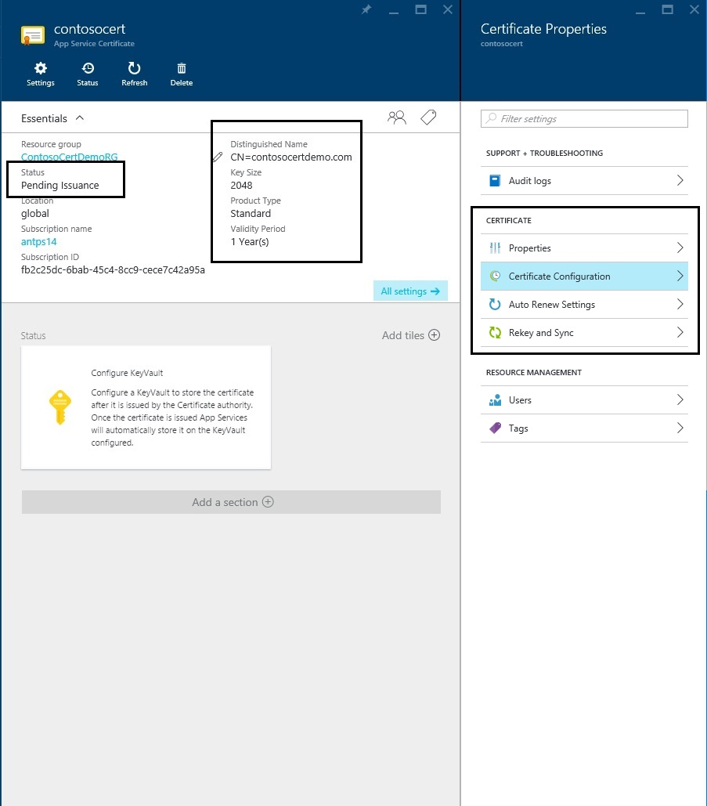
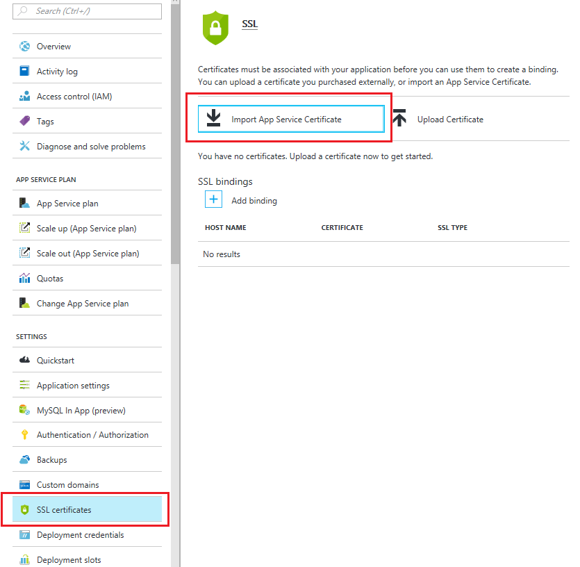
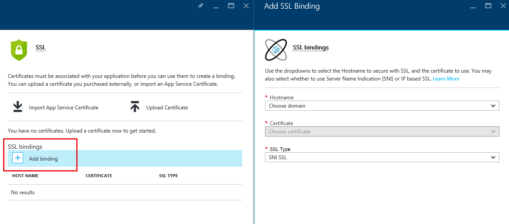

<properties
    pageTitle="Acheter et configurer un certificat SSL à votre Service d’application Azure"
    description="Découvrez comment acheter et configurer un certificat SSL à votre Service d’application Azure."
    services="app-service"
    documentationCenter=".net"
    authors="apurvajo"
    manager="stefsch"
    editor="cephalin"
    tags="buy-ssl-certificates"/>

<tags
    ms.service="app-service"
    ms.workload="na"
    ms.tgt_pltfrm="na"
    ms.devlang="na"
    ms.topic="article"
    ms.date="09/19/2016"
    ms.author="apurvajo"/>

#Acheter et configurer un certificat SSL à votre Service d’application Azure

> [AZURE.SELECTOR]
- [Acheter le certificat SSL dans Azure](web-sites-purchase-ssl-web-site.md)
- [Utiliser un certificat SSL à partir d’un autre emplacement](web-sites-configure-ssl-certificate.md)

Par défaut, **[Azure Application Service](http://go.microsoft.com/fwlink/?LinkId=529714)** déjà active HTTPS pour votre application web avec un certificat générique pour le *. azurewebsites.net domaine. Si vous ne prévoyez configurer un domaine personnalisé, vous pouvez bénéficier à partir du certificat HTTPS par défaut. Toutefois, comme tous les * [domaines génériques](https://casecurity.org/2014/02/26/pros-and-cons-of-single-domain-multi-domain-and-wildcard-certificates), il n’est pas moins sûre qu’un domaine personnalisé avec votre propre certificat. Azure Application Service vous propose désormais un moyen très simple à acheter et gérer un certificat SSL directement à partir d’Azure Portal sans avoir à quitter le portail.  
Cet article explique comment acheter et configurer un certificat SSL à votre **[Service d’application Azure](http://go.microsoft.com/fwlink/?LinkId=529714)** en 3 étapes simples. 

> [AZURE.NOTE]
> Certificats SSL pour les noms de domaine personnalisé ne peuvent pas être utilisés avec l’application web libre et partagé. Vous devez configurer votre application web mode Basic, Standard ou Premium, ce qui peut changer combien vous êtes facturé pour votre abonnement. Pour plus d’informations, consultez **[Détails de tarification pour applications Web](https://azure.microsoft.com/pricing/details/web-sites/)** .

##Vue d’ensemble
> [AZURE.NOTE]
> N’essayez pas d’acheter un certificat SSL à l’aide d’un abonnement qui n’a pas d’une carte de crédit Active associé. Cela peut entraîner dans votre abonnement est désactivé. 

##<a>Acheter, stocker et assigner un certificat SSL pour votre domaine personnalisé</a>
Pour activer HTTPS pour un domaine personnalisé, tel que contoso.com, vous devez tout d’abord ** [configurer un nom de domaine personnalisé dans le Service d’application Azure.](web-sites-custom-domain-name.md)**

Avant de demander un certificat SSL, vous devez d’abord déterminer les noms de domaine seront sécurisées par le certificat. Cela permet de déterminer quel type de certificat que vous devez obtenir. Si vous souhaitez simplement banque d’informations sécurisé un nom de domaine unique tel que contoso.com ou www.contoso.com Standard (base) certificat est suffisant. Si vous avez besoin sécuriser plusieurs noms de domaine, tel que contoso.com, www.contoso.com et mail.contoso.com, vous pouvez obtenir un ** [certificat générique](http://en.wikipedia.org/wiki/Wildcard_certificate)**

##Étape 0 : Passer une commande de certificat SSL

Dans cette étape, vous allez apprendre à passer une commande pour un certificat SSL de votre choix.

1.  Dans le **[Portail Azure](https://portal.azure.com/)**, cliquez sur Parcourir et tapez « Certificats de Service d’application » dans la barre de recherche et sélectionnez « Certificats de Service d’application » dans le résultat, puis cliquez sur Ajouter. 

    

    

2.  Entrez le **nom convivial** pour votre certificat SSL.

3.  Entrez le **nom d’hôte**
> [AZURE.NOTE]
    Il s’agit d’un des éléments plus importants du processus d’achat. Veillez à entrer de nom d’hôte correct (domaine personnalisé) que vous souhaitez protéger avec ce certificat. **Ne pas** ajouter le nom d’hôte par WWW. Par exemple, si votre nom de domaine personnalisé est www.contoso.com, simplement entrez contoso.com dans le champ nom d’hôte, le certificat en question protéger domaines www et racine. 
    
4.  Sélectionnez votre **abonnement**. 

    Si vous avez plusieurs abonnements, vérifiez que créer un certificat SSL dans le même abonnement que vous avez utilisées pour votre domaine personnalisé ou d’une application Web en question.
       
5.  Sélectionner ou créer un **groupe de ressources**.

    Groupes de ressources vous permettent de gérer les ressources Azure connexes comme une unité et sont utiles lors de l’établissement de règles de contrôle d’accès basé sur un rôle pour vos applications. Pour plus d’informations, reportez-vous à gestion de vos ressources Azure.
     
6.  Sélectionnez le **certificat de référence (SKU)** 

    Enfin, sélectionnez le certificat de référence (SKU) qui correspond à vos besoins et cliquez sur Créer. Aujourd'hui, Azure Application Service vous permet d’acheter deux • références SKU autre S1 – certificat Standard avec 1 an validité et de renouvellement automatique  
           • W1 – certificat avec des caractères génériques avec renouvellement automatique et de validité 1 an      
    Pour plus d’informations, consultez **[Détails de tarification pour applications Web](https://azure.microsoft.com/pricing/details/web-sites/)** .

> [AZURE.NOTE]
> La création de certificat SSL peut durer de 1 à 10 minutes. Ce processus effectue plusieurs étapes en arrière-plan qui sont très difficile à effectuer manuellement.  

##Étape 1 : Stocker le certificat dans l’archivage sécurisé de clé Azure

Dans cette étape, vous allez apprendre à placer un magasin un certificat SSL que vous avez acheté à l’archivage sécurisé de clé Azure de votre choix.

1.  Une fois que l’achat de certificat SSL est terminée, vous devez ouvrir manuellement carte ressource **Certificats de Service d’application** en accédant à celui-ci (voir étape 1 ci-dessus)   

    

    Vous remarquerez que l’état du certificat est **« en attente d’émission »** qu’il sont a quelques étapes supplémentaires que vous devez effectuer avant de commencer à l’aide des certificats.
 
2. Cliquez sur **« Configuration de certificats »** à l’intérieur de la carte de propriétés du certificat et cliquez sur **« étape 1 : stocker »** pour stocker ce certificat dans l’archivage sécurisé de clé Azure.

3.  Dans cliquez **« état de l’archivage sécurisé clé »** cartes sur **« clé de l’archivage sécurisé référentiel »** pour choisir un archivage sécurisé clé existant pour stocker ce certificat **ou « créer de nouveau l’archivage sécurisé clé »** pour créer la nouvelle clé de l’archivage sécurisé à l’intérieur du même groupe d’abonnement et des ressources.
 
    
 
    > [AZURE.NOTE]
    L’archivage sécurisé clé Azure a frais minimes pour le stockage de ce certificat. Pour plus d’informations, consultez **[Azure clé l’archivage sécurisé tarifs détails](https://azure.microsoft.com/pricing/details/key-vault/)** .

4. Une fois que vous avez sélectionné le référentiel de l’archivage sécurisé clé pour stocker ce certificat dans, continuez et stocker en cliquant sur le bouton **« Stocker »** en haut de la carte **« état de l’archivage sécurisé clé »** .  

    Cela doit se terminer étape pour stocker le certificat que vous avez acheté avec l’archivage sécurisé de clé Azure de votre choix. Lors de l’actualisation de la carte, vous devriez voir vérifier vert marquer par rapport à cette étape également.
    
##Étape 2 : Vérifier la propriété du domaine

Dans cette étape, vous allez apprendre à effectuer la vérification de la propriété du domaine d’un certificat SSL que vous venez de placer une commande pour. 

1.  Cliquez sur **« étape 2 : vérifier «** étape à partir de la carte **« Configuration de certificats »** . Il existe 4 types de domaine pris en charge par application Service certificats de vérification.

    * **Vérification des services d’application** 
    
        * Il s’agit du processus mieux si vous avez déjà **votre domaine personnalisé affectée aux applications de Service d’application.** Cette méthode permet de répertorier les toutes les applications de Service de l’application qui répondent à ce critère. 
           Par exemple, dans ce cas, **contosocertdemo.com** est un domaine personnalisé affecté à l’application de Service d’application appelé **« ContosoCertDemo »** et, par conséquent, qui est la seule application de Service d’application répertoriés ici. S’il y a plusieurs région déploiement, il serait les répertorie tous les régions.
        
           La méthode de vérification est uniquement disponible pour les achats Standard certificat (base). Les certificats avec des caractères génériques, veuillez ignorer et accéder à l’option B, C ou D ci-dessous.
        * Cliquez sur le bouton **« Vérifier »** pour effectuer cette étape.
        * Cliquez sur **« Actualiser »** pour mettre à jour l’état du certificat une fois la vérification terminée. Il peut prendre quelques minutes pour la vérification terminer.
        
             

    * **Vérification du domaine** 

        * Il s’agit du processus mieux **uniquement si** vous avez **[acheté votre domaine personnalisé à partir d’Azure Application Service.](custom-dns-web-site-buydomains-web-app.md)**
        
        * Cliquez sur le bouton **« Vérifier »** pour effectuer cette étape.
        
        * Cliquez sur **« Actualiser »** pour mettre à jour l’état du certificat une fois la vérification terminée. Il peut prendre quelques minutes pour la vérification terminer.

    * **Vérification de messagerie**
        
        * Courrier électronique de vérification a déjà été envoyé aux adresses de messagerie associée à ce domaine personnalisé.
         
        * Ouvrez le message électronique, cliquez sur le lien de vérification pour terminer l’étape de vérification de messagerie. 
        
        * Si vous avez besoin renvoyer le message de vérification, cliquez sur le bouton **« renvoyer messagerie »** .
         
    * **Vérification manuelle**    
                 
        1. **Vérification de Page Web HTML**
        
            * Créer un fichier HTML nommé .html **{Jeton vérification du domaine}**(vous pouvez copier le jeton d’il carte de statut de vérification du domaine)
            
            * Le contenu de ce fichier doit être exactement le même nom de **Domaine vérification du jeton**.
            
            * Téléchargez ce fichier à la racine du serveur web qui héberge votre domaine.
            
            * Cliquez sur **« Actualiser »** pour mettre à jour l’état du certificat une fois la vérification terminée. Il peut prendre quelques minutes pour la vérification terminer.
            
            Par exemple, si vous achetez un certificat standard pour contosocertdemo.com avec jeton de vérification du domaine **'cAGgQrKc'** à **'http://contosocertdemo.com/cAGgQrKc.html'** une requête web doit renvoyer **cAGgQrKc.**
        2. **Vérification d’enregistrement TXT DNS**

            * À l’aide de votre Gestionnaire DNS, créez un enregistrement TXT sur le sous-domaine **« DZC »** avec une valeur égale à la **jeton de vérification du domaine.**
            
            * Cliquez sur **« Actualiser »** pour mettre à jour l’état du certificat une fois la vérification terminée. Il peut prendre quelques minutes pour la vérification terminer.
                              
            Par exemple, pour exécuter la validation d’un certificat génériques en nom d’hôte ** \*. contosocertdemo.com** ou ** \*. subdomain.contosocertdemo.com** et **cAGgQrKc**jeton de vérification du domaine, vous devez créer un enregistrement TXT sur dzc.contosocertdemo.com avec valeur **cAGgQrKc.**     

##Étape 3 : Attribuer un certificat à l’application de Service d’application

Dans cette étape, vous allez apprendre à affecter cette récemment achetés certificat à vos applications de Service d’application. 

> [AZURE.NOTE]
> Avant d’effectuer les étapes décrites dans cette section, vous devez associé un nom de domaine personnalisé avec votre application. Pour plus d’informations, voir ** [configuration d’un nom de domaine personnalisé pour un web App.](web-sites-custom-domain-name.md)**

1.  Dans votre navigateur, ouvrez le ** [portail Azure.](https://portal.azure.com/)**
2.  Cliquez sur l’option de **Service d’application** sur le côté gauche de la page.
3.  Cliquez sur le nom de votre application auquel vous souhaitez affecter ce certificat. 
4.  Dans les **paramètres**, cliquez sur **certificats SSL**
5.  Cliquez sur **Importer un certificat application Service** et sélectionnez le certificat que vous venez d’acheter

    

6. Dans les **liaisons ssl** section, cliquez sur **Ajouter des liaisons**
7. Dans la carte **Ajouter SSL liaison** utiliser les menus déroulants pour sélectionner le nom de domaine pour sécuriser avec SSL et le certificat à utiliser. Vous pouvez également choisir d’utiliser **[Indication de nom de serveur (SNI)](http://en.wikipedia.org/wiki/Server_Name_Indication)** ou SSL basée sur IP.

    

       •    IP based SSL associates a certificate with a domain name by mapping the dedicated public IP address of the server to the domain name. This requires each domain name (contoso.com, fabricam.com, etc.) associated with your service to have a dedicated IP address. This is the traditional          method of associating SSL certificates with a web server.
       •    SNI based SSL is an extension to SSL and **[Transport Layer Security](http://en.wikipedia.org/wiki/Transport_Layer_Security)** (TLS) that allows multiple domains to share the same IP address, with separate security certificates for each domain. Most modern browsers (including Internet Explorer, Chrome, Firefox and Opera) support SNI, however older browsers may not support SNI. For more information on SNI, see the **[Server Name Indication](http://en.wikipedia.org/wiki/Server_Name_Indication)** article on Wikipedia.
       
7. Cliquez sur **Ajouter la liaison** pour enregistrer les modifications et activer le protocole SSL.

Si vous avez sélectionné **SSL basée sur IP** et votre domaine personnalisé est configuré à l’aide d’un enregistrement A, vous devez effectuer les étapes supplémentaires suivantes :

* Une fois que vous avez configuré une adresse IP en fonction de liaison SSL, une adresse IP dédiée est affectée à votre application. Vous pouvez trouver cette adresse IP dans la page de **domaine personnalisé** sous paramètres de votre application, juste au-dessus de la section **noms d’hôte** . Elle est indiquée comme **Adresse IP externe**
    
    

    Notez que cette adresse IP sera différente de l’adresse IP virtuelle utilisée précédemment pour configurer l’enregistrement A de votre domaine. Si vous avez configuré pour utiliser SNI basée SSL ou ne sont pas configuré pour utiliser SSL, aucune adresse n’apparaît pour cette entrée.
    
2. En utilisant les outils fournis par votre bureau d’enregistrement du nom de domaine, modifiez l’enregistrement A de votre nom de domaine personnalisé pour qu’il pointe vers l’adresse IP de l’étape précédente.
À ce stade, vous devriez pouvoir consulter votre application à l’aide de HTTPS:// au lieu de HTTP:// pour vérifier que le certificat a été configuré correctement.

##Recomposition et synchroniser le certificat

1. Pour des raisons de sécurité, si vous avez besoin pour recomposition votre certificat puis simplement sélectionnez option **« recomposition et synchroniser »** dans **« Propriétés du certificat »** carte. 

2. Cliquez sur **« Recomposition »** pour démarrer le processus. Ce processus peut prendre 1-10 minutes. 

    

3. Changement de clé votre certificat mettra le certificat avec un nouveau certificat émis par l’autorité de certification.
4. Vous ne devrez pas payer pour la recomposition pour la durée de vie du certificat. 
5. Changement de clé votre certificat traitée état d’émission en attente. 
6. Une fois que le certificat est prêt Vérifiez que vous synchronisez vos ressources à l’aide de ce certificat pour empêcher une interruption du service.
7. Option synchroniser n’est pas disponible pour les certificats qui ne sont pas encore affectées à l’application Web. 

## Ressources complémentaires ##
- [Activer HTTPS pour une application dans le Service d’application Azure](web-sites-configure-ssl-certificate.md)
- [Acheter et configurer un nom de domaine personnalisé dans le Service d’application Azure](custom-dns-web-site-buydomains-web-app.md)
- [Centre de gestion de la confidentialité de Microsoft Azure](/support/trust-center/security/)
- [Options de configuration déverrouillées dans des Sites Web Azure](http://azure.microsoft.com/blog/2014/01/28/more-to-explore-configuration-options-unlocked-in-windows-azure-web-sites/)
- [Portail de gestion Azure](https://manage.windowsazure.com)

>[AZURE.NOTE] Si vous voulez commencer à utiliser le Service d’application Azure avant de vous inscrire pour un compte Azure, accédez à [Essayer le Service application](http://go.microsoft.com/fwlink/?LinkId=523751), où vous pouvez créer une application web starter courte immédiatement dans le Service d’application. Aucune carte de crédit obligatoire ; Aucune engagements.

