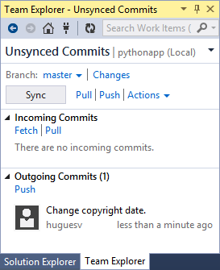

<properties
    pageTitle="Création d’applications web avec Django dans Azure"
    description="Didacticiel présente à l’exécution d’une application web Python dans Azure Application Service Web Apps."
    services="app-service\web"
    documentationCenter="python"
    tags="python"
    authors="huguesv" 
    manager="wpickett" 
    editor=""/>

<tags
    ms.service="app-service-web"
    ms.workload="web"
    ms.tgt_pltfrm="na"
    ms.devlang="python"
    ms.topic="hero-article" 
    ms.date="02/19/2016"
    ms.author="huvalo"/>

# Création d’applications web avec Django dans Azure

Ce didacticiel décrit comment commencer en cours d’exécution Python sur [Azure Application Service Web Apps](http://go.microsoft.com/fwlink/?LinkId=529714). Applications Web fournit d’hébergement gratuit limitée et déploiement rapide, et vous pouvez utiliser Python ! Au fur et à mesure du votre application, vous pouvez basculer à l’hébergement payant et vous pouvez également intégrer avec tous les autres services Azure.

Vous allez créer une application à l’aide de l’infrastructure web Django (voir autres versions de ce didacticiel pour [ballon](web-sites-python-create-deploy-flask-app.md) et [bouteilles](web-sites-python-create-deploy-bottle-app.md)). Vous créer l’application web à partir de la Azure Marketplace, configurez le déploiement Git et cloner le référentiel localement. Puis vous exécutez l’application localement, apporter des modifications, valider et les pousser à Azure. Le didacticiel montre comment effectuer cette opération à partir de Windows ou Mac/Linux.

[AZURE.INCLUDE [create-account-and-websites-note](../../includes/create-account-and-websites-note.md)]

>[AZURE.NOTE] Si vous voulez commencer à utiliser le Service d’application Azure avant de vous inscrire pour un compte Azure, accédez à [Essayer le Service application](http://go.microsoft.com/fwlink/?LinkId=523751), où vous pouvez créer une application web starter courte immédiatement dans le Service d’application. Aucune carte de crédit obligatoire ; Aucune engagements.

## Conditions préalables

- Windows, Mac ou Linux
- Python 2.7 ou 3.4
- setuptools, pip, virtualenv (2,7 Python uniquement)
- GIT
- [Outils Python pour Visual Studio][] (PTVS) - Remarque : cette étape est facultative

**Remarque**: la publication TFS n’est actuellement pas pris en charge pour les projets Python.

### Windows

Si vous n’avez pas Python 2.7 ou 3.4 installés (32 bits), nous recommandons l’installation [Azure SDK pour Python 2.7] ou [Azure SDK pour Python 3.4] à l’aide de Web Platform Installer. Cette procédure installe la version 32 bits de Python, setuptools, pip, virtualenv, etc. (32 bits Python est ce qui est installé sur les ordinateurs hôtes Azure). Vous pouvez également obtenir Python à partir de [python.org].

Pour Git, nous vous recommandons de [Git pour Windows] ou [GitHub pour Windows]. Si vous utilisez Visual Studio, vous pouvez utiliser la prise en charge Git intégrée.

Nous recommandons également l’installation [Python outils 2.2 pour Visual Studio]. Cette étape est facultative, mais si vous avez [Visual Studio], y compris la gratuit Visual Studio Communauté 2013 ou Visual Studio Express 2013 pour le Web, puis cela vous donne un excellent IDE Python.

### Mac/Linux

Vous disposez Python et Git déjà installé, mais vérifiez que vous disposez Python 2.7 ou 3.4.

## Création de l’application Web sur le portail

La première étape pour créer votre application consiste à créer l’application web via le [Portail Azure](https://portal.azure.com).

1. Connectez-vous au portail Azure et cliquez sur le bouton **Nouveau** dans le coin inférieur gauche.
3. Dans la zone de recherche, tapez « python ».
4. Dans les résultats de recherche, sélectionnez **Django** (publié par PTVS), puis cliquez sur **créer**.
5. Configurer la nouvelle application Django, telles que la création d’une nouvelle offre de Service d’application et un groupe de ressources de celui-ci. Ensuite, cliquez sur **créer**.
6. Configurer la publication Git pour votre application web nouvellement créé en suivant les instructions au [Déploiement Local de Git Azure Application Service](app-service-deploy-local-git.md).

## Vue d’ensemble de l’application

### Contenu du référentiel GIT

Voici une vue d’ensemble des fichiers que vous trouverez dans le référentiel Git initial, nous allons cloner dans la section suivante.

    \app\__init__.py
    \app\forms.py
    \app\models.py
    \app\tests.py
    \app\views.py
    \app\static\content\
    \app\static\fonts\
    \app\static\scripts\
    \app\templates\about.html
    \app\templates\contact.html
    \app\templates\index.html
    \app\templates\layout.html
    \app\templates\login.html
    \app\templates\loginpartial.html
    \DjangoWebProject\__init__.py
    \DjangoWebProject\settings.py
    \DjangoWebProject\urls.py
    \DjangoWebProject\wsgi.py

Sources principales pour l’application. Se compose de 3 pages (index, sur contact) avec une mise en page maître. Les scripts et le contenu statique incluent démarrage, jquery, modernizr et y répondre.

    \manage.py

Prise en charge du serveur de développement et de gestion locale. Utilisez cette option pour exécuter l’application localement, synchroniser la base de données, etc..

    \db.sqlite3

Base de données par défaut. Inclut les tables requises pour l’application à exécuter, mais ne contient pas tous les utilisateurs (synchroniser la base de données pour créer un utilisateur).

    \DjangoWebProject.pyproj
    \DjangoWebProject.sln

Fichiers de projet pour une utilisation avec [Python Tools pour Visual Studio].

    \ptvs_virtualenv_proxy.py

Proxy IIS pour les environnements virtuels et PTVS prise en charge de débogage distant.

    \requirements.txt

Lots externes requis par cette application. Le script de déploiement sera pip installer les packages répertoriés dans ce fichier.

    \web.2.7.config
    \web.3.4.config

Fichiers de configuration IIS. Le script de déploiement utilise le web.x.y.config approprié et copier sous web.config.

### Fichiers facultatifs - déploiement de personnalisation

[AZURE.INCLUDE [web-sites-python-django-customizing-deployment](../../includes/web-sites-python-django-customizing-deployment.md)]

### Fichiers facultatifs - Python runtime

[AZURE.INCLUDE [web-sites-python-customizing-runtime](../../includes/web-sites-python-customizing-runtime.md)]

### Fichiers supplémentaires sur le serveur

Certains fichiers hébergés sur le serveur, mais ne sont pas ajoutés au référentiel git. Ils sont créés par le script de déploiement.

    \web.config

Fichier de configuration IIS. Créé à partir de web.x.y.config dans chaque déploiement.

    \env\

Environnement virtuel Python. Créé au cours du déploiement si un environnement virtuel compatible n’existe pas déjà sur l’application web. Packages répertoriés dans requirements.txt sont pip installé, mais pip ignore installation si les packages sont déjà installés.

Les 3 sections décrivent comment poursuivre le développement d’applications web sous 3 différents environnements :

- Fenêtres, avec des outils Python pour Visual Studio
- Windows, avec ligne de commande
- Mac/Linux avec ligne de commande

## Développement d’applications Web - Windows - Python Tools pour Visual Studio

### Cloner le référentiel

Tout d’abord, cloner le référentiel à l’aide de l’URL fournie dans le portail Azure. Pour plus d’informations, voir [Le déploiement Local Git Azure Application Service](app-service-deploy-local-git.md).

Ouvrez le fichier solution (.sln) qui est inclus dans la racine du référentiel.

### Créer l’environnement virtuel

Nous allons maintenant créer un environnement virtuel pour le développement local. Dans **Les environnements Python** sélectionner **Ajouter environnement virtuel...**menu contextuel.

- Vérifiez que le nom de l’environnement est `env`.

- Sélectionnez le relais de base. Assurez-vous d’utiliser la même version de Python est activée pour votre application web (dans runtime.txt ou la carte de **Paramètres de l’Application** de votre application web dans le portail Azure).

- Assurez-vous que l’option Télécharger et installer des packages est cochée.

Cliquez sur **créer**. Cela crée l’environnement virtuel et installer les dépendances répertoriées dans requirements.txt.

### Créer un super utilisateur

La base de données inclus avec l’application n’a pas de n’importe quel super utilisateur défini. Pour pouvoir utiliser la fonctionnalité de connexion dans l’application ou l’interface d’administration Django (si vous décidez d’activer), vous devez créer un super utilisateur.

Exécutez-le à partir de la ligne de commande à partir de votre dossier de projet :

    env\scripts\python manage.py createsuperuser

Suivez les invites pour définir le nom d’utilisateur, mot de passe, etc..

### Exécuter à l’aide du serveur de développement

Appuyez sur F5 pour démarrer le débogage et votre navigateur web seront ouvre automatiquement à la page en cours d’exécution localement.

Vous pouvez définir des points d’arrêt dans les sources, utilisez les fenêtres Espion, etc.. Voir les [Outils Python pour la Documentation de Visual Studio] pour plus d’informations sur les différentes fonctionnalités.

### Apporter des modifications

Désormais, vous pouvez essayer en apportant des modifications aux sources d’application et/ou aux modèles.

Une fois que vous avez testé vos modifications, les valider au référentiel Git :

### Installer des packages

Votre application peut-être avoir des dépendances au-delà de Python et Django.

Vous pouvez installer des packages supplémentaires à l’aide de pip. Pour installer un package, avec le bouton droit sur l’environnement virtuel, puis sélectionnez **Installer un Package Python**.

Par exemple, pour installer le Kit de développement Azure pour Python, qui permet d’accéder à stockage Azure, bus des services et d’autres services Azure, entrez `azure`:

Avec le bouton droit sur l’environnement virtuel, puis sélectionnez **Générer requirements.txt** pour mettre à jour requirements.txt.

Ensuite, validez les modifications à requirements.txt vers le référentiel Git.

### Déploiement d’Azure

Pour déclencher la lecture d’un déploiement, cliquez sur **synchronisation** ou **transmission**. Synchronisation effectue un push et une extraction.

Le premier déploiement prend un certain temps, qu’il crée un environnement virtuel, packages d’installation, etc..

Visual Studio n’affiche pas la progression du déploiement. Si vous souhaitez vérifier le résultat, consultez la section sur la [résolution des problèmes - déploiement](#troubleshooting-deployment).

Accédez à l’URL Azure pour visualiser vos modifications.

## Ligne de commande de développement - Windows - Web app

### Cloner le référentiel

Tout d’abord, cloner le référentiel à l’aide de l’URL fournie dans le portail Azure, puis ajoutez le référentiel Azure une télécommande. Pour plus d’informations, voir [Le déploiement Local Git Azure Application Service](app-service-deploy-local-git.md).

    git clone <repo-url>
    cd <repo-folder>
    git remote add azure <repo-url>

### Créer l’environnement virtuel

Nous allons créer un nouvel environnement virtuel pour le développement (ne pas l’ajoutez au référentiel). Environnements virtuels dans Python ne sont pas transférable, afin que tous les développeurs travaillant sur l’application allez créer leurs propres localement.

Assurez-vous d’utiliser la même version de Python est activée pour votre application web (dans runtime.txt ou la carte de paramètres de l’Application de votre application web dans le portail Azure).

Pour Python 2.7 :

    c:\python27\python.exe -m virtualenv env

Pour Python 3.4 :

    c:\python34\python.exe -m venv env

Installer les packages externes requises par votre application. Vous pouvez utiliser le fichier requirements.txt à la racine du référentiel pour installer les packages dans votre environnement virtuel :

    env\scripts\pip install -r requirements.txt

### Créer un super utilisateur

La base de données inclus avec l’application n’a pas de n’importe quel super utilisateur défini. Pour pouvoir utiliser la fonctionnalité de connexion dans l’application ou l’interface d’administration Django (si vous décidez d’activer), vous devez créer un super utilisateur.

Exécutez-le à partir de la ligne de commande à partir de votre dossier de projet :

    env\scripts\python manage.py createsuperuser

Suivez les invites pour définir le nom d’utilisateur, mot de passe, etc..

### Exécuter à l’aide du serveur de développement

Vous pouvez lancer l’application sous un serveur de développement avec la commande suivante :

    env\scripts\python manage.py runserver

La console affiche l’URL et écoute port du serveur :

Ensuite, ouvrez votre navigateur web à cette URL.

### Apporter des modifications

Désormais, vous pouvez essayer en apportant des modifications aux sources d’application et/ou aux modèles.

Une fois que vous avez testé vos modifications, les valider au référentiel Git :

    git add <modified-file>
    git commit -m "<commit-comment>"

### Installer des packages

Votre application peut-être avoir des dépendances au-delà de Python et Django.

Vous pouvez installer des packages supplémentaires à l’aide de pip. Par exemple, pour installer le Kit de développement Azure pour Python, qui permet d’accéder à stockage Azure, bus des services et d’autres services Azure, tapez :

    env\scripts\pip install azure

Veillez à mettre à jour requirements.txt :

    env\scripts\pip freeze > requirements.txt

Valider les modifications :

    git add requirements.txt
    git commit -m "Added azure package"

### Déploiement d’Azure

Pour déclencher la lecture d’un déploiement, diffuser les changements à Azure :

    git push azure master

Vous verrez le résultat du script de déploiement, y compris la création d’un environnement virtuel, l’installation des packages, la création du fichier web.config.

Accédez à l’URL Azure pour visualiser vos modifications.

## Ligne de commande de développement - Mac/Linux - Web app

### Cloner le référentiel

Tout d’abord, cloner le référentiel à l’aide de l’URL fournie dans le portail Azure, puis ajoutez le référentiel Azure une télécommande. Pour plus d’informations, voir [Le déploiement Local Git Azure Application Service](app-service-deploy-local-git.md).

    git clone <repo-url>
    cd <repo-folder>
    git remote add azure <repo-url>

### Créer l’environnement virtuel

Nous allons créer un nouvel environnement virtuel pour le développement (ne pas l’ajoutez au référentiel). Environnements virtuels dans Python ne sont pas transférable, afin que tous les développeurs travaillant sur l’application allez créer leurs propres localement.

Assurez-vous d’utiliser la même version de Python est activée pour votre application web (dans runtime.txt ou la carte de paramètres de l’Application de votre application web dans le portail Azure).

Pour Python 2.7 :

    python -m virtualenv env

Pour Python 3.4 :

    python -m venv env

ou

    pyvenv env

Installer les packages externes requises par votre application. Vous pouvez utiliser le fichier requirements.txt à la racine du référentiel pour installer les packages dans votre environnement virtuel :

    env/bin/pip install -r requirements.txt

### Créer un super utilisateur

La base de données inclus avec l’application n’a pas de n’importe quel super utilisateur défini. Pour pouvoir utiliser la fonctionnalité de connexion dans l’application ou l’interface d’administration Django (si vous décidez d’activer), vous devez créer un super utilisateur.

Exécutez-le à partir de la ligne de commande à partir de votre dossier de projet :

    env/bin/python manage.py createsuperuser

Suivez les invites pour définir le nom d’utilisateur, mot de passe, etc..

### Exécuter à l’aide du serveur de développement

Vous pouvez lancer l’application sous un serveur de développement avec la commande suivante :

    env/bin/python manage.py runserver

La console affiche l’URL et écoute port du serveur :

Ensuite, ouvrez votre navigateur web à cette URL.

### Apporter des modifications

Désormais, vous pouvez essayer en apportant des modifications aux sources d’application et/ou aux modèles.

Une fois que vous avez testé vos modifications, les valider au référentiel Git :

    git add <modified-file>
    git commit -m "<commit-comment>"

### Installer des packages

Votre application peut-être avoir des dépendances au-delà de Python et Django.

Vous pouvez installer des packages supplémentaires à l’aide de pip. Par exemple, pour installer le Kit de développement Azure pour Python, qui permet d’accéder à stockage Azure, bus des services et d’autres services Azure, tapez :

    env/bin/pip install azure

Veillez à mettre à jour requirements.txt :

    env/bin/pip freeze > requirements.txt

Valider les modifications :

    git add requirements.txt
    git commit -m "Added azure package"

### Déploiement d’Azure

Pour déclencher la lecture d’un déploiement, diffuser les changements à Azure :

    git push azure master

Vous verrez le résultat du script de déploiement, y compris la création d’un environnement virtuel, l’installation des packages, la création du fichier web.config.

Accédez à l’URL Azure pour visualiser vos modifications.

## Résolution des problèmes - Installation du Package

[AZURE.INCLUDE [web-sites-python-troubleshooting-package-installation](../../includes/web-sites-python-troubleshooting-package-installation.md)]

## Résolution des problèmes - environnement virtuel

[AZURE.INCLUDE [web-sites-python-troubleshooting-virtual-environment](../../includes/web-sites-python-troubleshooting-virtual-environment.md)]

## Résolution des problèmes - fichiers statiques

Django contient le concept de la collecte des fichiers statiques. Cela permet d’accéder tous les statiques des fichiers à partir de leur emplacement d’origine et les copie dans un dossier. Pour cette application, ils sont copiés dans `/static`.

Pour ce faire, car les fichiers statiques peuvent provenir de différente Django « applications ». Par exemple, les fichiers statiques à partir des interfaces Django d’administration sont situés dans un sous-dossier bibliothèque Django dans l’environnement virtuel. Fichiers statiques définies par cette application se trouvent dans `/app/static`. Lorsque vous utilisez plusieurs Django « applications », vous aurez statiques fichiers situés à plusieurs endroits.

Lorsque vous exécutez l’application en mode débogage, l’application gère les fichiers statiques à partir de leur emplacement d’origine.

Lorsque vous exécutez l’application en mode publication, l’application ne **pas** fournir ces fichiers statiques. Il est la responsabilité du serveur web pour traiter les fichiers. Pour cette application, IIS servira les fichiers statiques à partir de `/static`.

La collection de fichiers statiques s’effectue automatiquement en tant que composant de script de déploiement, la désactivation de précédemment collectée fichiers. Cela signifie que la collecte se produit dans chaque déploiement, ralentir déploiement quelque peu, mais elle garantit que les fichiers obsolètes ne seront pas disponibles, pour éviter d’obtenir un problème de sécurité potentiel.

Si vous souhaitez ignorer collection des fichiers statiques pour votre application Django :

    \.skipDjango

Ensuite, vous devez faire de la collection de sites manuellement sur votre ordinateur local :

    env\scripts\python manage.py collectstatic

Supprimez la `\static` dossier à partir de `.gitignore` et ajoutez-le au référentiel Git.

## Résolution des problèmes - paramètres

Différents paramètres de l’application peuvent être modifiés dans `DjangoWebProject/settings.py`.

Pour plus de facilité développeur, mode débogage est activé. Piles inconvénient qui est que vous pourrez afficher des images et autre contenu statique lors de l’exécution localement, sans avoir à recueillir les fichiers statiques.

Pour désactiver le mode débogage :

    DEBUG = False

Lorsque le débogage est désactivé, la valeur de `ALLOWED_HOSTS` doit être mis à jour pour inclure le nom d’hôte Azure. Par exemple :

    ALLOWED_HOSTS = (
        'pythonapp.azurewebsites.net',
    )

ou afin de permettre :

    ALLOWED_HOSTS = (
        '*',
    )

Dans la pratique, vous souhaiterez effectuer une opération plus complexe à traiter basculement entre déboguer et relâchez mode et obtenez le nom d’hôte.

Vous pouvez définir des variables d’environnement via le portail Azure page **configurer** , dans la section **paramètres de l’application** .  Cela peut être utile pour définir les valeurs que vous souhaiterez ne peut-être pas apparaître dans les sources (chaînes de connexion, les mots de passe, etc.), ou que vous souhaitez définir différemment entre Azure et votre ordinateur local. Dans `settings.py`, vous pouvez interroger les variables d’environnement à l’aide de `os.getenv`.

## À l’aide d’une base de données

La base de données qui est inclus avec l’application est une base de données sqlite. Il s’agit d’une base de données par défaut pratiques et utiles à utiliser pour le développement, car elle ne requiert presque aucun le programme d’installation. La base de données est stockée dans le fichier db.sqlite3 dans le dossier du projet.

Azure fournit des services de base de données qui sont faciles à utiliser à partir d’une application Django. Didacticiels pour l’utilisation de [Base de données SQL] et [MySQL] à partir d’une application Django affichent les étapes nécessaires pour créer le service de base de données, modifiez les paramètres de base de données dans `DjangoWebProject/settings.py`, ainsi que les bibliothèques nécessaires pour installer.

Bien entendu, si vous préférez gérer vos propres serveurs de base de données, vous pouvez effectuer à l’aide de Windows ou Linux machines virtuelles s’exécutant sur Azure.

## Interface d’administration Django

Une fois que vous commencez à créer vos modèles, vous souhaiterez remplir la base de données avec des données. Un moyen facile à suivre ajouter et modifier du contenu de façon interactive consiste à utiliser l’interface d’administration Django.

Le code de l’interface d’administration est commenté dans les sources d’application, mais il est marqué clairement afin que vous pouvez facilement l’activer (recherchez « admin »).

Une fois qu’il est activé, synchroniser la base de données, exécutez l’application et accédez à `/admin`.

## Étapes suivantes

Suivez ces liens pour en savoir plus sur les outils de Python et Django pour Visual Studio :

- [Documentation Django]
- [Outils Python pour la Documentation de Visual Studio]

Pour plus d’informations sur l’utilisation de la base de données SQL et MySQL :

- [Django et MySQL sur Azure avec Python Tools pour Visual Studio]
- [Django et base de données SQL Azure avec Python Tools pour Visual Studio]

Pour plus d’informations, voir le [Centre de développement Python](/develop/python/).

## Ce qui a changé
* Pour un guide à la modification de sites Web Application Service voir : [Azure Application Service et son Impact sur les Services Azure existants](http://go.microsoft.com/fwlink/?LinkId=529714)

<!--Link references-->
[Django et MySQL sur Azure avec Python Tools pour Visual Studio]: web-sites-python-ptvs-django-mysql.md
[Django et base de données SQL Azure avec Python Tools pour Visual Studio]: web-sites-python-ptvs-django-sql.md
[Base de données SQL]: web-sites-python-ptvs-django-sql.md
[MySQL]: web-sites-python-ptvs-django-mysql.md

<!--External Link references-->
[Azure SDK pour Python 2.7]: http://go.microsoft.com/fwlink/?linkid=254281
[Azure SDK pour Python 3.4]: http://go.microsoft.com/fwlink/?linkid=516990
[Python.org]: http://www.python.org/
[GIT pour Windows]: http://msysgit.github.io/
[GitHub pour Windows]: https://windows.github.com/
[Outils Python pour Visual Studio]: http://aka.ms/ptvs
[Python 2.2 des outils pour Visual Studio]: http://go.microsoft.com/fwlink/?LinkID=624025
[Visual Studio]: http://www.visualstudio.com/
[Outils Python pour la Documentation de Visual Studio]: http://aka.ms/ptvsdocs
[Documentation Django]: https://www.djangoproject.com/
