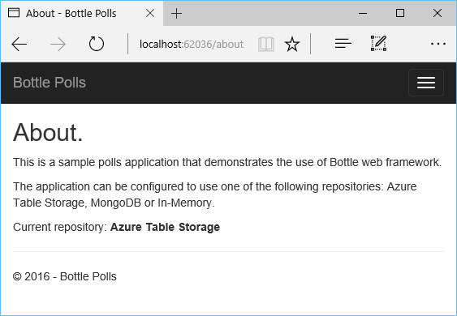
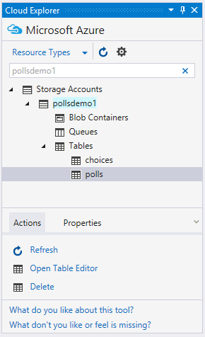

<properties 
    pageTitle="Bouteilles et le stockage de Table Azure sur Azure avec les outils de Python 2.2 pour Visual Studio" 
    description="Découvrez comment utiliser les outils de Python pour Visual Studio pour créer une application bouteilles qui stocke les données dans le stockage de Table Azure et déployer l’application web à Azure Application Service Web Apps." 
    services="app-service\web" 
    documentationCenter="python" 
    authors="huguesv" 
    manager="wpickett" 
    editor=""/>

<tags 
    ms.service="app-service-web" 
    ms.workload="web" 
    ms.tgt_pltfrm="na" 
    ms.devlang="python" 
    ms.topic="article" 
    ms.date="07/07/2016"
    ms.author="huvalo"/>

# Bouteilles et le stockage de Table Azure sur Azure avec les outils de Python 2.2 pour Visual Studio 

Dans ce didacticiel, nous allons utiliser [Python Tools pour Visual Studio] pour créer une application web sondages simple à l’aide d’un des exemples de modèles de PTVS. Ce didacticiel est également disponible en tant qu’une [vidéo](https://www.youtube.com/watch?v=GJXDGaEPy94).

L’application web sondages définit une abstraction pour son référentiel, afin que vous pouvez facilement basculer entre les différents types de référentiels (en mémoire, stockage de Table Azure, MongoDB).

Nous allez découvrir comment créer un compte de stockage Azure, comment faire pour configurer l’application web pour utiliser le stockage de Table Azure et comment publier l’application web sur [Azure Application Service Web Apps](http://go.microsoft.com/fwlink/?LinkId=529714).

Consultez le [Centre de développement Python] pour d’autres articles couvrant développement d’Azure Application Service Web Apps avec PTVS à l’aide de cadres web bouteilles, ballon et Django, avec les services MongoDB, stockage de Table Azure, MySQL et base de données SQL. Tandis que cet article se concentre sur Service d’application, les étapes sont similaires lorsque vous développez des [Services Cloud Azure].

## Conditions préalables

 - Visual Studio 2015
 - [Python 2.2 des outils pour Visual Studio]
 - [Python Tools 2.2 pour exemples Visual Studio VSIX]
 - [Outils SDK Azure VS 2015]
 - [Python 2.7 32 bits] ou [Python 3.4 32 bits]

[AZURE.INCLUDE [create-account-and-websites-note](../../includes/create-account-and-websites-note.md)]

>[AZURE.NOTE] Si vous voulez commencer à utiliser le Service d’application Azure avant de vous inscrire pour un compte Azure, accédez à [Essayer le Service application](http://go.microsoft.com/fwlink/?LinkId=523751), où vous pouvez créer une application web starter courte immédiatement dans le Service d’application. Aucune carte de crédit obligatoire ; Aucune engagements.

## Créer le projet

Dans cette section, nous allons créer un projet Visual Studio à l’aide d’un exemple de modèle. Nous allons créer un environnement virtuel et installez packages requis. Nous allons puis exécutez l’application localement à l’aide du référentiel en mémoire par défaut.

1.  Dans Visual Studio, sélectionnez **fichier**, **Nouveau projet**.

1.  Les modèles de projet à partir de la [Python outils 2.2 pour Visual Studio exemples VSIX] sont disponibles sous **Python**, **exemples**. Sélectionnez **Des sondages bouteilles Web projet** , puis cliquez sur OK pour créer le projet.

    

1.  Vous devez installer les packages externes. Sélectionnez **installer dans un environnement virtuel**.

    

1.  Sélectionnez **Python 2.7** ou **Python 3.4** comme le relais de base.

    

1.  Vérifiez que l’application fonctionne en appuyant sur `F5`. Par défaut, l’application utilise un référentiel en mémoire qui ne nécessite pas de n’importe quelle configuration. Toutes les données est perdue lorsque le serveur web est arrêté.

1.  Cliquez sur **Créer des sondages exemple**, puis cliquez sur un sondage et de vote.

    

## Créer un compte de stockage Azure

Pour utiliser les opérations de stockage, vous avez besoin d’un compte de stockage Azure. Vous pouvez créer un compte de stockage en procédant comme suit.

1.  Connectez-vous au [portail Azure](https://portal.azure.com/).

1. Cliquez sur l’icône **Nouveau** dans le coin supérieur gauche du portail, puis cliquez sur **données + stockage** > **Compte de stockage**.  Cliquez sur le bouton **créer** , puis attribuez un nom unique le compte de stockage et créer un [groupe de ressources](../azure-resource-manager/resource-group-overview.md) de celui-ci.

    

    Lorsque le compte de stockage a été créé, le bouton **Notifications** clignote en vert **SUCCESS** et carte de compte de stockage est ouverte pour afficher qu’il appartient au nouveau groupe de ressources que vous avez créé.

1. Cliquez sur le composant de **touches d’accès rapide** dans la carte de compte de stockage. Notez le nom du compte et touche1.

    

    Nous aurons besoin de ces informations pour configurer votre projet dans la section suivante.

## Configurer le projet

Dans cette section, nous allons configurer notre application afin d’utiliser le compte de stockage que nous avons créé uniquement. Nous allons puis exécutez l’application localement.

1.  Dans Visual Studio, avec le bouton droit sur le nœud de votre projet dans l’Explorateur et sélectionnez **Propriétés**. Cliquez sur l’onglet **Déboguer** .

    

1.  Définir les valeurs de variables d’environnement requises par l’application dans la **Commande du serveur déboguer**, **environnement**.

        REPOSITORY_NAME=azuretablestorage
        STORAGE_NAME=<storage account name>
        STORAGE_KEY=<primary access key>

    Cette option définit les variables d’environnement lorsque vous **Démarrez le débogage**. Si vous souhaitez que les variables à définir lorsque vous **Exécuter sans débogage**, définissez les mêmes valeurs sous la **Commande de serveur exécuter** également.

    Vous pouvez également définir des variables d’environnement en utilisant le panneau de configuration Windows. Il s’agit d’une meilleure option si vous voulez éviter de stocker les informations d’identification dans le code source / fichier de projet. Notez que vous devez redémarrer Visual Studio pour les nouvelles valeurs environnement pour être accessibles à l’application.

1.  Le code qui mettent en œuvre, le référentiel de stockage de Table Azure se trouve dans **models/azuretablestorage.py**. Consultez la [documentation] pour plus d’informations sur l’utilisation du Service de Table à partir de Python.

1.  Exécutez l’application avec `F5`. Sondages créés à l’aide de **Créer des sondages exemple** et les données envoyées par vote seront sérialisées dans le stockage de Table Azure.

    > [AZURE.NOTE] L’environnement de virtuel 2.7 Python peut provoquer un exception saut dans Visual Studio.  Appuyez sur la touche `F5` pour continuer à charger le projet web. 

1.  Accédez à la page **à propos de** pour vérifier que l’application utilise le référentiel de **Stockage de Table Azure** .

    

## Explorer le stockage de Table Azure

Il est facile afficher et modifier des tables de stockage à l’aide de Cloud Explorer dans Visual Studio. Dans cette section, nous allons utiliser Explorateur de serveurs pour afficher le contenu des tables application sondages.

> [AZURE.NOTE] Cela nécessite Microsoft Azure installation des outils, qui sont disponibles dans le cadre du [Kit de développement logiciel Azure pour .NET].

1.  Ouvrez **l’Explorateur de Cloud**. Développez les **Comptes de stockage**, votre compte de stockage, puis **Tables**.

    

1.  Double-cliquez sur la table **des sondages** ou des **choix** pour afficher le contenu de la table dans une fenêtre de document, mais aussi ajouter/supprimer/edit entités.

    

## Publier l’application web au Service d’application Azure

Le Kit de développement .NET Azure fournit un moyen facile à déployer votre application web Azure Application Service.

1.  Dans l' **Explorateur de solutions**, avec le bouton droit sur le nœud du projet et sélectionnez **Publier**.

    

1.  Cliquez sur **applications Web de Microsoft Azure**.

1.  Cliquez sur **Nouveau** pour créer une nouvelle application web.

1.  Renseignez les champs suivants, cliquez sur **créer**.
    -   **Nom de l’application Web**
    -   **Plan de services d’application**
    -   **Groupe de ressources**
    -   **Région**
    -   Laissez le **serveur de base de données** défini sur **Aucune base de données**

1.  Accepter toutes les autres paramètres par défaut, cliquez sur **Publier**.

1.  Votre navigateur web s’ouvre automatiquement à l’application web publiées. Si vous accédez à la sur la page, vous verrez qu’elle utilise le référentiel **En mémoire** , pas le référentiel de **Stockage de Table Azure** .

    C’est parce que les variables d’environnement ne sont pas définies dans l’instance d’applications Web dans le Service d’application Azure, pour qu’il utilise les valeurs par défaut spécifiés dans **settings.py**.

## Configurer l’instance Web Apps

Dans cette section, nous allons configurer des variables d’environnement pour l’instance Web Apps.

1.  [Portail Azure], ouvrez la carte de l’application web en cliquant sur **Parcourir** > **Application Services** > votre nom de l’application web.

1.  Dans la carte de votre application web, cliquez sur **Tous les paramètres**, puis cliquez sur **Paramètres de l’Application**.

1.  Faites défiler jusqu'à la section **paramètres de l’application** et définissez les valeurs pour **référentiel\_nom**, **stockage\_nom** et **stockage\_clé** comme décrit dans la section **configurer le projet** ci-dessus.

    

1.  Cliquez sur **Enregistrer**. Une fois que vous avez reçu les notifications que les modifications ont été appliquées, cliquez sur **Parcourir** à partir de la carte principale de l’application Web.

1.  Vous devriez voir l’application web fonctionne comme prévu, à l’aide du référentiel de **Stockage de Table Azure** .

    Félicitations !

    

## Étapes suivantes

Suivez ces liens pour en savoir plus sur les outils de Python pour Visual Studio, bouteilles et stockage de Table Azure.

- [Outils Python pour la Documentation de Visual Studio]
  - [Projets Web]
  - [Projets de Service cloud]
  - [Le débogage distant sur Microsoft Azure]
- [Bouteilles Documentation]
- [Stockage Azure]
- [Azure SDK pour Python]
- [Comment utiliser le Service de stockage de Table à partir de Python]

## Ce qui a changé
* Pour un guide à la modification de sites Web Application Service voir : [Azure Application Service et son Impact sur les Services Azure existants](http://go.microsoft.com/fwlink/?LinkId=529714)

<!--Link references-->
[Centre de développement Python]: /develop/python/
[Services Cloud Azure]: ../cloud-services-python-ptvs.md
[documentation]: ../storage-python-how-to-use-table-storage.md
[Comment utiliser le Service de stockage de Table à partir de Python]: ../storage-python-how-to-use-table-storage.md

<!--External Link references-->
[Portail Azure]: https://portal.azure.com
[Kit de développement Azure pour .NET]: http://azure.microsoft.com/downloads/
[Outils Python pour Visual Studio]: http://aka.ms/ptvs
[Python 2.2 des outils pour Visual Studio]: http://go.microsoft.com/fwlink/?LinkId=624025
[Python Tools 2.2 pour exemples Visual Studio VSIX]: http://go.microsoft.com/fwlink/?LinkId=624025
[Outils SDK Azure VS 2015]: http://go.microsoft.com/fwlink/?LinkId=518003
[Python 2.7 32 bits]: http://go.microsoft.com/fwlink/?LinkId=517190 
[Python 3.4 32 bits]: http://go.microsoft.com/fwlink/?LinkId=517191
[Outils Python pour la Documentation de Visual Studio]: http://aka.ms/ptvsdocs
[Bouteilles Documentation]: http://bottlepy.org/docs/dev/index.html
[Le débogage distant sur Microsoft Azure]: http://go.microsoft.com/fwlink/?LinkId=624026
[Projets Web]: http://go.microsoft.com/fwlink/?LinkId=624027
[Projets de Service cloud]: http://go.microsoft.com/fwlink/?LinkId=624028
[Stockage Azure]: http://azure.microsoft.com/documentation/services/storage/
[Azure SDK pour Python]: https://github.com/Azure/azure-sdk-for-python
 
