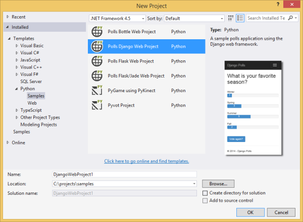
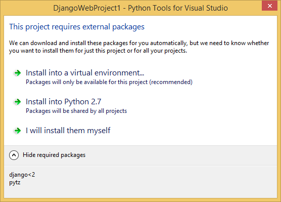

<properties 
    pageTitle="Django et MySQL sur Azure avec les outils de Python 2.2 pour Visual Studio" 
    description="Découvrez comment utiliser les outils de Python pour Visual Studio pour créer une application web Django qui stocke les données dans une instance de base de données MySQL et le déployez dans Azure Application Service Web Apps." 
    services="app-service\web" 
    documentationCenter="python" 
    authors="huguesv" 
    manager="wpickett" 
    editor=""/>

<tags 
    ms.service="app-service-web" 
    ms.workload="web" 
    ms.tgt_pltfrm="na" 
    ms.devlang="python"
    ms.topic="get-started-article" 
    ms.date="07/07/2016"
    ms.author="huvalo"/>

# Django et MySQL sur Azure avec les outils de Python 2.2 pour Visual Studio 

[AZURE.INCLUDE [tabs](../../includes/app-service-web-get-started-nav-tabs.md)]

Dans ce didacticiel, vous allez utiliser [Python Tools pour Visual Studio] (PTVS) pour créer une application web sondages simple à l’aide d’un des exemples de modèles de PTVS. Vous allez découvrir comment utiliser un service MySQL hébergé sur Azure, comment faire pour configurer l’application web pour utiliser MySQL et comment publier l’application web sur [Azure Application Service Web Apps](http://go.microsoft.com/fwlink/?LinkId=529714).

> [AZURE.NOTE] Les informations contenues dans ce didacticiel sont également disponibles dans la vidéo suivante :
> 
> [PTVS 2.1 : Application de Django avec MySQL][video]

Consultez le [Centre de développement Python] pour d’autres articles couvrant développement d’Azure Application Service Web Apps avec PTVS à l’aide de cadres web bouteilles, ballon et Django, avec les services de base de données SQL Azure Table Storage et MySQL. Tandis que cet article se concentre sur Service d’application, les étapes sont similaires lorsque vous développez des [Services Cloud Azure].

## Conditions préalables

 - Visual Studio 2015
 - [Python 2.7 32 bits] ou [Python 3.4 32 bits]
 - [Python 2.2 des outils pour Visual Studio]
 - [Python Tools 2.2 pour exemples Visual Studio VSIX]
 - [Outils SDK Azure VS 2015]
 - Django 1,9 ou version ultérieure

[AZURE.INCLUDE [create-account-and-websites-note](../../includes/create-account-and-websites-note.md)]

<!-- This note should not render as part of the the previous include. -->

> [AZURE.NOTE] Si vous voulez commencer à utiliser le Service d’application Azure avant de vous inscrire pour un compte Azure, accédez à [Essayer le Service application](http://go.microsoft.com/fwlink/?LinkId=523751), où vous pouvez créer une application web starter courte immédiatement dans le Service d’application. Aucune carte de crédit n’est nécessaire, et aucun engagements ne sont nécessaires.

## Créer le projet

Dans cette section, vous devez créer un projet Visual Studio à l’aide d’un exemple de modèle. Vous devez créer un environnement virtuel et installez packages requis. Vous devez créer une base de données locale à l’aide de sqlite. Vous devez exécuter l’application localement.

1. Dans Visual Studio, sélectionnez **fichier**, **Nouveau projet**.

1. Les modèles de projet à partir de la [Python outils 2.2 pour Visual Studio exemples VSIX] sont disponibles sous **Python**, **exemples**. Sélectionnez **Des sondages Django Web projet** , puis cliquez sur OK pour créer le projet.

    

1. Vous devez installer les packages externes. Sélectionnez **installer dans un environnement virtuel**.

    

1. Sélectionnez **Python 2.7** ou **Python 3.4** comme le relais de base.

    

1. Dans l' **Explorateur de solutions**, avec le bouton droit sur le nœud du projet et sélectionnez **Python**, puis **Django migrer**.  Sélectionnez ensuite **Django créer super utilisateur**.

1. Vous ouvrez une Console de gestion Django et créer une base de données sqlite dans le dossier du projet. Suivez les invites pour créer un utilisateur.

1. Vérifiez que l’application fonctionne en appuyant sur `F5`.

1. Cliquez sur **se connecter** à partir de la barre de navigation en haut.

    

1. Entrez les informations d’identification pour l’utilisateur que vous avez créé lors de la synchronisation de la base de données.

    

1. Cliquez sur **créer des sondages exemple**.

    

1. Cliquez sur un sondage, voter.

    

## Créer une base de données MySQL

Pour la base de données, vous devez créer une base de données ClearDB MySQL hébergé sur Azure.

Comme alternative, vous pouvez créer votre propre Machine virtuelle en cours d’exécution dans Azure, puis installer et administrer MySQL vous-même.

Vous pouvez créer une base de données avec une offre gratuite en procédant comme suit.

1. Connectez-vous au [portail Azure].

1. Dans la partie supérieure du volet de navigation, cliquez sur **Nouveau**, puis cliquez sur **données + stockage**, puis cliquez sur **Base de données MySQL**. 

1. Configurer la nouvelle base de données MySQL en créant un nouveau groupe de ressources et sélectionnez l’emplacement approprié de celui-ci.

1. Une fois que la base de données MySQL est créé, cliquez sur **Propriétés** dans la carte de base de données.

1. Utilisez le bouton Copier pour remettre la valeur de **Chaîne de connexion** dans le Presse-papiers.

## Configurer le projet

Dans cette section, vous devez configurer notre application web pour utiliser la base de données MySQL que vous venez de créer. Vous devez également installer des packages Python supplémentaires requises pour utiliser des bases de données MySQL avec Django. Vous devez exécuter l’application web localement.

1. Dans Visual Studio, ouvrez **settings.py**, à partir du dossier *NomProjet* . Collez temporairement la chaîne de connexion dans l’éditeur. La chaîne de connexion est au format suivant :

        Database=<NAME>;Data Source=<HOST>;User Id=<USER>;Password=<PASSWORD>

    Modifier la base de données par défaut **moteur** d’utiliser MySQL et définissez les valeurs pour **nom**, **utilisateur**, **mot de passe** et **l’hôte** de **CONNECTIONSTRING**.

        DATABASES = {
            'default': {
                'ENGINE': 'django.db.backends.mysql',
                'NAME': '<Database>',
                'USER': '<User Id>',
                'PASSWORD': '<Password>',
                'HOST': '<Data Source>',
                'PORT': '',
            }
        }

1. Dans l’Explorateur, sous **Environnements Python**, avec le bouton droit sur l’environnement virtuel, puis sélectionnez **Installer un Package Python**.

1. Installer le package `mysqlclient` à l’aide de **pip**.

    

1. Dans l' **Explorateur de solutions**, avec le bouton droit sur le nœud du projet et sélectionnez **Python**, puis **Django migrer**.  Sélectionnez ensuite **Django créer super utilisateur**.

    Cela créera les tables de la base de données MySQL que vous avez créé dans la section précédente. Suivez les invites pour créer un utilisateur, qui ne doit pas nécessairement correspondent à l’utilisateur dans la base de données sqlite créé dans la première section de cet article.

1. Exécutez l’application avec `F5`. Sondages créés à l’aide de **Créer des sondages exemple** et les données envoyées par vote seront sérialisées dans la base de données MySQL.

## Publier l’application web au Service d’application Azure

Le Kit de développement .NET Azure fournit un moyen facile à déployer votre application web Azure Application Service.

1. Dans l' **Explorateur de solutions**, avec le bouton droit sur le nœud du projet et sélectionnez **Publier**.

    

1. Cliquez sur service **d’application Microsoft Azure**.

1. Cliquez sur **Nouveau** pour créer une nouvelle application web.

1. Renseignez les champs suivants, cliquez sur **créer**:
    - **Nom de l’application Web**
    - **Plan de services d’application**
    - **Groupe de ressources**
    - **Région**
    - Laissez le **serveur de base de données** défini sur **Aucune base de données**

1. Accepter toutes les autres paramètres par défaut, cliquez sur **Publier**.

1. Votre navigateur web s’ouvre automatiquement à l’application web publiées. Vous devriez voir l’application web fonctionne comme prévu, à l’aide de la base de données **MySQL** hébergé sur Azure.

    

    Félicitations ! Vous avez publié votre application web basée sur MySQL sur Azure.

## Étapes suivantes

Suivez ces liens pour en savoir plus sur les outils de Python pour Visual Studio, Django et MySQL.

- [Outils Python pour la Documentation de Visual Studio]
  - [Projets Web]
  - [Projets de Service cloud]
  - [Le débogage distant sur Microsoft Azure]
- [Documentation Django]
- [MySQL]

Pour plus d’informations, voir le [Centre de développement Python](/develop/python/).

<!--Link references-->

[Centre de développement Python]: /develop/python/
[Services Cloud Azure]: ../cloud-services-python-ptvs.md

<!--External Link references-->

[Portail Azure]: https://portal.azure.com
[Outils Python pour Visual Studio]: http://aka.ms/ptvs
[Python 2.2 des outils pour Visual Studio]: http://go.microsoft.com/fwlink/?LinkID=624025
[Python Tools 2.2 pour exemples Visual Studio VSIX]: http://go.microsoft.com/fwlink/?LinkID=624025
[Outils SDK Azure VS 2015]: http://go.microsoft.com/fwlink/?LinkId=518003
[Python 2.7 32 bits]: http://go.microsoft.com/fwlink/?LinkId=517190 
[Python 3.4 32 bits]: http://go.microsoft.com/fwlink/?LinkId=517191
[Outils Python pour la Documentation de Visual Studio]: http://aka.ms/ptvsdocs
[Le débogage distant sur Microsoft Azure]: http://go.microsoft.com/fwlink/?LinkId=624026
[Projets Web]: http://go.microsoft.com/fwlink/?LinkId=624027
[Projets de Service cloud]: http://go.microsoft.com/fwlink/?LinkId=624028
[Documentation Django]: https://www.djangoproject.com/
[MySQL]: http://www.mysql.com/
[video]: http://youtu.be/oKCApIrS0Lo
