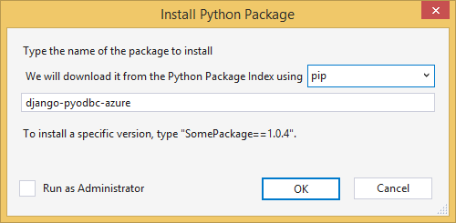

<properties 
    pageTitle="Django et base de données SQL Azure avec les outils de Python 2.2 pour Visual Studio" 
    description="Découvrez comment utiliser les outils de Python pour Visual Studio pour créer une application web Django qui stocke les données dans une instance de base de données SQL et le déployez dans Azure Application Service Web Apps." 
    services="app-service\web" 
    tags="python"
    documentationCenter="python" 
    authors="huguesv" 
    manager="wpickett" 
    editor=""/>

<tags 
    ms.service="app-service-web" 
    ms.workload="web" 
    ms.tgt_pltfrm="na" 
    ms.devlang="python" 
    ms.topic="article" 
    ms.date="07/07/2016"
    ms.author="huguesv"/>

# Django et base de données SQL Azure avec les outils de Python 2.2 pour Visual Studio 

Dans ce didacticiel, nous allons utiliser [Python Tools pour Visual Studio] pour créer une application web sondages simple à l’aide d’un des exemples de modèles de PTVS. Ce didacticiel est également disponible en tant qu’une [vidéo](https://www.youtube.com/watch?v=ZwcoGcIeHF4).

Nous allez découvrir comment utiliser une base de données SQL hébergé sur Azure, comment faire pour configurer l’application web pour utiliser une base de données SQL et comment publier l’application web sur [Azure Application Service Web Apps](http://go.microsoft.com/fwlink/?LinkId=529714).

Consultez le [Centre de développement Python] pour d’autres articles couvrant développement d’Azure Application Service Web Apps avec PTVS à l’aide de cadres web bouteilles, ballon et Django, avec les services de stockage de Table Azure, MySQL et base de données SQL. Tandis que cet article se concentre sur Service d’application, les étapes sont similaires lorsque vous développez des [Services Cloud Azure].

## Conditions préalables

 - Visual Studio 2015
 - [Python 2.7 32 bits]
 - [Python 2.2 des outils pour Visual Studio]
 - [Python Tools 2.2 pour exemples Visual Studio VSIX]
 - [Outils SDK Azure VS 2015]
 - Django 1,9 ou version ultérieure

[AZURE.INCLUDE [create-account-and-websites-note](../../includes/create-account-and-websites-note.md)]

>[AZURE.NOTE] Si vous voulez commencer à utiliser le Service d’application Azure avant de vous inscrire pour un compte Azure, accédez à [Essayer le Service application](http://go.microsoft.com/fwlink/?LinkId=523751), où vous pouvez créer une application web starter courtes immédiatement dans le Service d’application. Aucune carte de crédit obligatoire ; Aucune engagements.

## Créer le projet

Dans cette section, nous allons créer un projet Visual Studio à l’aide d’un exemple de modèle. Nous allons créer un environnement virtuel et installez packages requis. Nous allons créer une base de données locale à l’aide de sqlite. Nous allons puis exécutez l’application web localement.

1.  Dans Visual Studio, sélectionnez **fichier**, **Nouveau projet**.

1.  Les modèles de projet à partir de la [Python outils 2.2 pour Visual Studio exemples VSIX] sont disponibles sous **Python**, **exemples**. Sélectionnez **Des sondages Django Web projet** , puis cliquez sur OK pour créer le projet.

    

1.  Vous devez installer les packages externes. Sélectionnez **installer dans un environnement virtuel**.

    

1.  Sélectionnez **Python 2.7** comme le relais de base.

    

1.  Dans l' **Explorateur de solutions**, avec le bouton droit sur le nœud du projet et sélectionnez **Python**, puis **Django migrer**.  Sélectionnez ensuite **Django créer super utilisateur**.

1.  Vous ouvrez une Console de gestion Django et créer une base de données sqlite dans le dossier du projet. Suivez les invites pour créer un utilisateur.

1.  Vérifiez que l’application fonctionne en appuyant sur <kbd>F5</kbd>.

1.  Cliquez sur **se connecter** à partir de la barre de navigation en haut.

    

1.  Entrez les informations d’identification pour l’utilisateur que vous avez créé lors de la synchronisation de la base de données.

    

1.  Cliquez sur **créer des sondages exemple**.

    

1.  Cliquez sur un sondage, voter.

    

## Créer une base de données SQL

Pour la base de données, nous allons créer une base de données SQL Azure.

Vous pouvez créer une base de données en procédant comme suit.

1.  Connectez-vous au [portail Azure].

1.  Dans la partie inférieure du volet de navigation, cliquez sur **Nouveau**. , cliquez sur **données + stockage** > **Base de données SQL**.

1.  Configurer la nouvelle base de données SQL en créant un nouveau groupe de ressources et sélectionnez l’emplacement approprié de celui-ci.

1.  Une fois que la base de données SQL est créé, cliquez sur **Ouvrir dans Visual Studio** dans la carte de base de données.
2.  Cliquez sur **configurer votre pare-feu**.
3.  Dans la carte de **Paramètres du pare-feu** , ajoutez qu'une règle de pare-feu avec **IP de début** et **Fin IP** ensemble vers l’adresse IP de votre ordinateur de développement. Cliquez sur **Enregistrer**.

    Ainsi, les connexions au serveur de base de données à partir de votre ordinateur de développement.

4.  Dans la carte de base de données, cliquez sur **Propriétés**, puis cliquez sur **Afficher les chaînes de connexion de base de données**. 

2.  Utilisez le bouton Copier pour remettre la valeur **d’ADO.NET** dans le Presse-papiers.

## Configurer le projet

Dans cette section, nous allons configurer notre application web pour utiliser la base de données SQL que nous venez de créer. Nous allons également installer des packages Python supplémentaires requises pour utiliser des bases de données SQL avec Django. Nous allons puis exécutez l’application web localement.

1.  Dans Visual Studio, ouvrez **settings.py**, à partir du dossier *NomProjet* . Collez temporairement la chaîne de connexion dans l’éditeur. La chaîne de connexion est au format suivant :

        Server=<ServerName>,<ServerPort>;Database=<DatabaseName>;User ID=<UserName>;Password={your_password_here};Encrypt=True;TrustServerCertificate=False;Connection Timeout=30;

Modifier la définition de `DATABASES` d’utiliser les valeurs ci-dessus.

        DATABASES = {
            'default': {
                'ENGINE': 'sql_server.pyodbc',
                'NAME': '<DatabaseName>',
                'USER': '<UserName>',
                'PASSWORD': '{your_password_here}',
                'HOST': '<ServerName>',
                'PORT': '<ServerPort>',
                'OPTIONS': {
                    'driver': 'SQL Server Native Client 11.0',
                    'MARS_Connection': 'True',
                }
            }
        }

1.  Dans l’Explorateur, sous **Environnements Python**, avec le bouton droit sur l’environnement virtuel, puis sélectionnez **Installer un Package Python**.

1.  Installer le package `pyodbc` à l’aide de **pip**.

    

1.  Installer le package `django-pyodbc-azure` à l’aide de **pip**.

    

1.  Dans l' **Explorateur de solutions**, avec le bouton droit sur le nœud du projet et sélectionnez **Python**, puis **Django migrer**.  Sélectionnez ensuite **Django créer super utilisateur**.

    Cela créera les tables de la base de données SQL que nous avons créé dans la section précédente. Suivez les invites pour créer un utilisateur, qui ne doit pas nécessairement correspondent à l’utilisateur dans la base de données sqlite créé dans la première section.

1.  Exécutez l’application avec `F5`. Sondages créés à l’aide de **Créer des sondages exemple** et les données envoyées par vote seront sérialisées dans la base de données SQL.

## Publier l’application web au Service d’application Azure

Le Kit de développement .NET Azure fournit un moyen facile à déployer votre application web web Azure Application Service Web Apps.

1.  Dans l' **Explorateur de solutions**, avec le bouton droit sur le nœud du projet et sélectionnez **Publier**.

    

1.  Cliquez sur **applications Web de Microsoft Azure**.

1.  Cliquez sur **Nouveau** pour créer une nouvelle application web.

1.  Renseignez les champs suivants, cliquez sur **créer**.
    -   **Nom de l’application Web**
    -   **Plan de services d’application**
    -   **Groupe de ressources**
    -   **Région**
    -   Laissez le **serveur de base de données** défini sur **Aucune base de données**

1.  Accepter toutes les autres paramètres par défaut, cliquez sur **Publier**.

1.  Votre navigateur web s’ouvre automatiquement à l’application web publiées. Vous devriez voir l’application web ne fonctionne comme prévu, à l’aide de la base de données **SQL** hébergé sur Azure.

    Félicitations !

    

## Étapes suivantes

Suivez ces liens pour en savoir plus sur les outils de Python pour Visual Studio, Django et base de données SQL.

- [Outils Python pour la Documentation de Visual Studio]
  - [Projets Web]
  - [Projets de Service cloud]
  - [Le débogage distant sur Microsoft Azure]
- [Documentation Django]
- [Base de données SQL]

## Ce qui a changé
* Pour un guide à la modification de sites Web Application Service voir : [Azure Application Service et son Impact sur les Services Azure existants](http://go.microsoft.com/fwlink/?LinkId=529714)

<!--Link references-->
[Centre de développement Python]: /develop/python/
[Services Cloud Azure]: ../cloud-services-python-ptvs.md

<!--External Link references-->
[Portail Azure]: https://portal.azure.com
[Outils Python pour Visual Studio]: http://aka.ms/ptvs
[Python 2.2 des outils pour Visual Studio]: http://go.microsoft.com/fwlink/?LinkID=624025
[Python Tools 2.2 pour exemples Visual Studio VSIX]: http://go.microsoft.com/fwlink/?LinkID=624025
[Outils SDK Azure VS 2015]: http://go.microsoft.com/fwlink/?LinkId=518003
[Python 2.7 32 bits]: http://go.microsoft.com/fwlink/?LinkId=517190 
[Outils Python pour la Documentation de Visual Studio]: http://aka.ms/ptvsdocs
[Le débogage distant sur Microsoft Azure]: http://go.microsoft.com/fwlink/?LinkId=624026
[Projets Web]: http://go.microsoft.com/fwlink/?LinkId=624027
[Projets de Service cloud]: http://go.microsoft.com/fwlink/?LinkId=624028
[Documentation Django]: https://www.djangoproject.com/
[Base de données SQL]: /documentation/services/sql-database/
